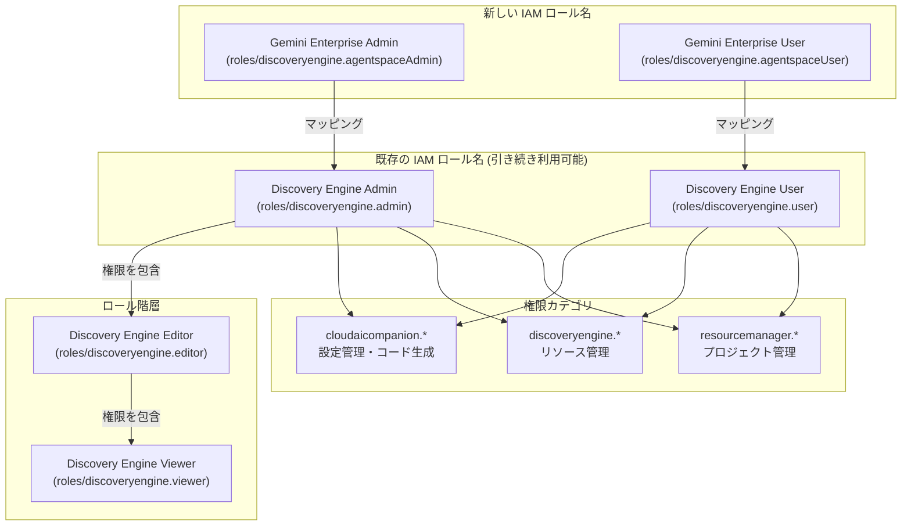

# Gemini Enterprise: Gemini Enterprise Admin / User IAM ロールの導入

**リリース日**: 2026-04-15

**サービス**: Gemini Enterprise

**機能**: Gemini Enterprise Admin および Gemini Enterprise User IAM ロール

**ステータス**: GA (一般提供)

[このアップデートのインフォグラフィックを見る](https://takech9203.github.io/google-cloud-news-summary/20260415-gemini-enterprise-iam-roles.html)

## 概要

2026 年 4 月 15 日、Google Cloud は Gemini Enterprise 向けに新しい IAM ロール名「Gemini Enterprise Admin」と「Gemini Enterprise User」の使用を案内しました。これにより、Gemini Enterprise のアクセス制御において、サービス名と直感的に対応するロール名でリソースを管理できるようになります。

これまで Gemini Enterprise のアクセス制御には「Discovery Engine Admin」(`roles/discoveryengine.admin`) や「Discovery Engine User」(`roles/discoveryengine.user`) といったロール名が使用されていました。今回のアップデートでは、新しいロール名が導入されましたが、内部的には引き続き Discovery Engine のロールにマッピングされるため、既存のお客様は変更を行う必要はありません。新規導入のお客様にとっては、サービス名と一致するロール名を使用できるため、IAM 設定がより直感的になります。

このアップデートは、Google Cloud が Gemini ブランドの統一を進める中で、IAM ロール名のリブランディングとして位置付けられます。セキュリティやアクセス制御の機能自体には変更はなく、運用上の影響は最小限です。

**アップデート前の課題**

- Gemini Enterprise のリソースにアクセス権を設定する際、「Discovery Engine Admin」「Discovery Engine User」という内部サービス名ベースのロール名を使う必要があり、Gemini Enterprise を利用しているという認識と乖離があった
- 新規管理者が IAM ロールを設定する際、「Discovery Engine」が Gemini Enterprise にマッピングされていることを事前に理解しておく必要があった
- 複数の Google Cloud サービスの IAM ロールを管理する環境では、ロール名からどのサービスに対する権限かを即座に判別しにくかった

**アップデート後の改善**

- 「Gemini Enterprise Admin」「Gemini Enterprise User」というサービス名と直接対応するロール名で IAM 設定が可能になった
- 既存の Discovery Engine ロールとの後方互換性が完全に維持されるため、既存のお客様は設定変更不要
- IAM ロール選択時にサービス名で検索しやすくなり、管理者のオンボーディングが容易になった

## アーキテクチャ図



Gemini Enterprise の新しい IAM ロール名は、既存の Discovery Engine ロールに直接マッピングされます。ロール階層は Discovery Engine Admin > Editor > Viewer の順に権限が広く、新しい Gemini Enterprise Admin / User ロールもこの階層に準じます。

## サービスアップデートの詳細

### 主要機能

1. **Gemini Enterprise Admin ロール (`roles/discoveryengine.agentspaceAdmin`)**
   - Gemini Enterprise リソースへの管理者レベルのフルアクセスを提供
   - Discovery Engine Admin (`roles/discoveryengine.admin`) と同等の権限セット
   - `cloudaicompanion.*` 権限 (AI Dev Tools 設定、コードリポジトリインデックス、ロギング設定など) を含む
   - `discoveryengine.*` 権限 (データストア、エンジン、スキーマ、セッション管理など) を含む

2. **Gemini Enterprise User ロール (`roles/discoveryengine.agentspaceUser`)**
   - Gemini Enterprise リソースへのユーザーレベルのアクセスを提供
   - Discovery Engine User (`roles/discoveryengine.user`) と同等の権限セット
   - `cloudaicompanion.companions.*` 権限 (チャット生成、コード生成) を含む
   - `cloudaicompanion.instances.*` 権限 (コード補完、タスク完了、テキスト生成) を含む
   - `discoveryengine.sessions.*` 権限 (セッション作成・管理・ファイルアップロード) を含む

3. **後方互換性の維持**
   - 既存の Discovery Engine Admin / User ロールは引き続き利用可能
   - 新しいロール名は内部的に同じ権限セットにマッピング
   - 既存のお客様は IAM ポリシーの変更不要

## 技術仕様

### IAM ロールマッピング

| 新しいロール名 | ロール ID | マッピング先 (既存ロール) |
|------|------|------|
| Gemini Enterprise Admin | `roles/discoveryengine.agentspaceAdmin` | Discovery Engine Admin (`roles/discoveryengine.admin`) |
| Gemini Enterprise User | `roles/discoveryengine.agentspaceUser` | Discovery Engine User (`roles/discoveryengine.user`) |

### 主要な権限カテゴリ

| 権限カテゴリ | Admin ロール | User ロール |
|------|------|------|
| `cloudaicompanion.aiDevToolsSettings.*` | 全操作 (CRUD) | - |
| `cloudaicompanion.codeRepositoryIndexes.*` | 全操作 (CRUD) | - |
| `cloudaicompanion.companions.*` | - | generateChat, generateCode |
| `cloudaicompanion.instances.*` | queryEffectiveSetting | completeCode, completeTask, generateCode, generateText |
| `cloudaicompanion.loggingSettings.*` | 全操作 (CRUD) | - |
| `discoveryengine.sessions.*` | 全操作 | 全操作 |
| `discoveryengine.agents.*` | 全操作 | create, delete, get, list, update |
| `resourcemanager.projects.*` | get, list | get, list |

## 設定方法

### 前提条件

1. Google Cloud プロジェクトで Gemini Enterprise が有効化されていること
2. IAM ロールを付与する権限 (プロジェクトオーナーまたは適切な IAM 管理権限) を保有していること

### 手順

#### ステップ 1: 管理者ロールの付与

```bash
# Gemini Enterprise Admin ロールの付与
gcloud projects add-iam-policy-binding PROJECT_ID \
  --member="user:admin@example.com" \
  --role="roles/discoveryengine.agentspaceAdmin"

# 補助ロールの付与 (推奨)
gcloud projects add-iam-policy-binding PROJECT_ID \
  --member="user:admin@example.com" \
  --role="roles/serviceusage.serviceUsageConsumer"

gcloud projects add-iam-policy-binding PROJECT_ID \
  --member="user:admin@example.com" \
  --role="roles/logging.viewer"
```

管理者には Gemini Enterprise Admin ロールに加えて、Service Usage Consumer と Logs Viewer ロールの付与が推奨されます。

#### ステップ 2: ユーザーロールの付与

```bash
# Gemini Enterprise User ロールの付与
gcloud projects add-iam-policy-binding PROJECT_ID \
  --member="user:user@example.com" \
  --role="roles/discoveryengine.agentspaceUser"
```

ユーザーには Discovery Engine User (Gemini Enterprise User) ロールに加えて、Gemini Enterprise のライセンスが必要です。

#### ステップ 3: 付与されたロールの確認

```bash
# プロジェクトの IAM ポリシーを確認
gcloud projects get-iam-policy PROJECT_ID \
  --flatten="bindings[].members" \
  --filter="bindings.role:roles/discoveryengine.agentspace*" \
  --format="table(bindings.role, bindings.members)"
```

## メリット

### ビジネス面

- **管理の直感性向上**: サービス名と一致するロール名により、IAM 設定の意図が明確になり、監査やコンプライアンスレビューが容易になる
- **オンボーディングの効率化**: 新規管理者が「Discovery Engine」と「Gemini Enterprise」の関係を理解する学習コストが削減される

### 技術面

- **完全な後方互換性**: 既存の IAM ポリシーや Terraform/Pulumi の IaC 定義に変更は不要
- **権限の明確な分離**: Admin ロールと User ロールの権限範囲が明確に区分されており、最小権限の原則に基づいたアクセス制御が容易

## デメリット・制約事項

### 制限事項

- Gemini Enterprise User ロールに加えて、別途 Gemini Enterprise ライセンスの購入・割り当てが必要
- 新しいロール名 (`agentspaceAdmin` / `agentspaceUser`) と既存のロール名 (`admin` / `user`) が併存するため、チーム内で使用するロール名を統一する運用ルールの策定が推奨される

### 考慮すべき点

- IaC テンプレートやドキュメントで使用するロール ID を新しいもの (`roles/discoveryengine.agentspaceAdmin`) に統一するか、既存のもの (`roles/discoveryengine.admin`) を継続するかを組織として決定する必要がある
- アプリを管理・共有するユーザーには、追加で Discovery Engine Viewer ロールの付与が必要

## ユースケース

### ユースケース 1: 新規プロジェクトでの Gemini Enterprise 導入

**シナリオ**: 新しい Google Cloud プロジェクトで Gemini Enterprise を導入し、管理者と一般ユーザーのアクセス権を設定する場合

**実装例**:
```bash
# 管理者グループへの Gemini Enterprise Admin ロール付与
gcloud projects add-iam-policy-binding my-project \
  --member="group:gemini-admins@example.com" \
  --role="roles/discoveryengine.agentspaceAdmin"

# ユーザーグループへの Gemini Enterprise User ロール付与
gcloud projects add-iam-policy-binding my-project \
  --member="group:gemini-users@example.com" \
  --role="roles/discoveryengine.agentspaceUser"
```

**効果**: サービス名と一致するロール名により、IAM ポリシーの可読性が向上し、新規チームメンバーのオンボーディングが迅速になる

### ユースケース 2: 既存環境からの段階的移行

**シナリオ**: 既に Discovery Engine Admin / User ロールを使用している環境で、新しいロール名に段階的に移行する場合

**効果**: 既存のロール割り当てはそのまま機能し続けるため、新規のロール付与から新しい名称を使用することで、運用の中断なく段階的に移行できる

## 関連サービス・機能

- **Cloud IAM**: Gemini Enterprise のアクセス制御の基盤となる認証・認可サービス
- **Discovery Engine**: Gemini Enterprise が内部的に利用する検索・対話エンジン基盤。IAM ロールの実体はこのサービスのロールとして定義される
- **Gemini Enterprise ライセンス管理**: User ロールとは別に、ユーザーごとのライセンス割り当てが必要
- **Gemini Enterprise Restricted User (`roles/discoveryengine.agentspaceRestrictedUser`)**: 同プロジェクト内の複数 Gemini Enterprise インスタンスに対するきめ細かい制御が必要な場合に使用する Beta ロール

## 参考リンク

- [インフォグラフィック](https://takech9203.github.io/google-cloud-news-summary/20260415-gemini-enterprise-iam-roles.html)
- [公式リリースノート](https://docs.cloud.google.com/release-notes#April_15_2026)
- [Gemini Enterprise IAM ロールと権限](https://docs.cloud.google.com/gemini/enterprise/docs/access-control)
- [Discovery Engine IAM ロール一覧](https://docs.cloud.google.com/iam/docs/roles-permissions/discoveryengine)
- [IAM ドキュメント](https://docs.cloud.google.com/iam/docs)
- [Gemini Enterprise ライセンス取得](https://docs.cloud.google.com/gemini/enterprise/docs/licenses)

## まとめ

今回のアップデートにより、Gemini Enterprise の IAM ロールがサービス名と直接対応する形でリブランディングされ、アクセス制御の管理がより直感的になりました。既存の Discovery Engine ロールとの完全な後方互換性が維持されるため、既存のお客様は即座の対応は不要ですが、新規の IAM ポリシー設定やドキュメントでは新しいロール名の使用を推奨します。

---

**タグ**: #GeminiEnterprise #IAM #AccessControl #DiscoveryEngine
