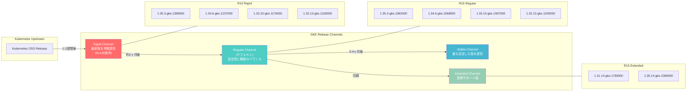

# Google Kubernetes Engine (GKE): 2026-R15 バージョンアップデートおよびセキュリティアップデート

**リリース日**: 2026-04-15

**サービス**: Google Kubernetes Engine (GKE)

**機能**: 2026-R15 バージョンアップデートおよびセキュリティアップデート

**ステータス**: Change + Security

[このアップデートのインフォグラフィックを見る](https://takech9203.github.io/google-cloud-news-summary/20260415-gke-version-security-updates-r15.html)

## 概要

Google Kubernetes Engine (GKE) の 2026-R15 リリースでは、Rapid、Regular、Extended の各リリースチャネルに新しいクラスタバージョンが配信されました。本リリースには、Kubernetes のバグ修正やパフォーマンス改善に加え、Container-Optimized OS (COS) イメージの累積セキュリティ修正が含まれています。

今回のアップデートでは、Rapid チャネルに最新の 1.35.3 系が、Regular チャネルには 1.35.2 系が提供され、Extended チャネルでは長期サポート対象の 1.30 および 1.31 マイナーバージョンの新しいパッチが利用可能になりました。なお、Stable チャネルについては今回のリリースサイクルでは新しいバージョンの配信はありません。

セキュリティ面では、Container-Optimized OS イメージが更新され、累積的なセキュリティ修正が適用されています。COS milestone 117 (バージョン cos-117-18613-534-62) は GKE 1.30 から 1.32 向け、COS milestone 125 (バージョン cos-125-19216-220-106) は GKE 1.35 向けに提供されています。

**アップデート前の課題**

- 以前のパッチバージョンに存在していたセキュリティ脆弱性が未修正の状態であった
- Container-Optimized OS イメージに累積的なセキュリティ修正が適用されていなかった
- 古いパッチバージョンではカーネルやシステムコンポーネントの既知の問題が残存していた

**アップデート後の改善**

- 各リリースチャネルで最新のセキュリティパッチが適用されたバージョンが利用可能になった
- Container-Optimized OS イメージの累積セキュリティ修正により、ノードのセキュリティ態勢が強化された
- Rapid チャネルでは最新の 1.35.3 系を利用した新機能の早期検証が可能になった

## アーキテクチャ図



この図は、GKE のリリースチャネルモデルと 2026-R15 で各チャネルに配信されたバージョンの関係を示しています。Kubernetes のアップストリームリリースが Rapid チャネルに最初に到達し、安定性の検証を経て Regular、Stable チャネルへ段階的に展開されます。

## サービスアップデートの詳細

### 主要機能

1. **Rapid チャネル バージョン更新**
   - 1.32.13-gke.1318000、1.33.10-gke.1176000、1.34.6-gke.1237000、1.35.3-gke.1389000 が利用可能
   - 最新の Kubernetes パッチリリースに基づくセキュリティ修正とバグ修正を含む
   - 新規クラスタの作成および既存クラスタの手動アップグレードで利用可能

2. **Regular チャネル バージョン更新**
   - 1.32.13-gke.1205000、1.33.10-gke.1067000、1.34.6-gke.1068000、1.35.2-gke.1962000 が利用可能
   - Rapid チャネルで検証済みのバージョンが展開されており、本番環境に推奨
   - デフォルトのリリースチャネルとして、機能の利用可能性と安定性のバランスを提供

3. **Extended チャネル バージョン更新**
   - 1.30.14-gke.2369000、1.31.14-gke.1790000 が利用可能
   - 長期サポートが必要なクラスタ向けに、同一マイナーバージョンのパッチ更新を継続提供
   - 1.30 の標準サポート終了は 2026 年 Q3 予定、Extended サポートは 2026-07-30 まで

4. **Container-Optimized OS セキュリティ更新**
   - 累積的なセキュリティ修正を含む更新された COS イメージが各バージョンに適用
   - cos-117-18613-534-62: GKE 1.30 から 1.32 向け
   - cos-125-19216-220-106: GKE 1.35 向け

## 技術仕様

### チャネル別バージョン一覧

| チャネル | マイナーバージョン | 配信バージョン | COS イメージ |
|----------|-------------------|---------------|-------------|
| Rapid | 1.32 | 1.32.13-gke.1318000 | cos-117-18613-534-62 |
| Rapid | 1.33 | 1.33.10-gke.1176000 | - |
| Rapid | 1.34 | 1.34.6-gke.1237000 | - |
| Rapid | 1.35 | 1.35.3-gke.1389000 | cos-125-19216-220-106 |
| Regular | 1.32 | 1.32.13-gke.1205000 | cos-117-18613-534-62 |
| Regular | 1.33 | 1.33.10-gke.1067000 | - |
| Regular | 1.34 | 1.34.6-gke.1068000 | - |
| Regular | 1.35 | 1.35.2-gke.1962000 | cos-125-19216-220-106 |
| Extended | 1.30 | 1.30.14-gke.2369000 | cos-117-18613-534-62 |
| Extended | 1.31 | 1.31.14-gke.1790000 | cos-117-18613-534-62 |
| Stable | - | 新規リリースなし | - |

### リリースチャネル特性比較

| 特性 | Rapid | Regular | Stable | Extended |
|------|-------|---------|--------|----------|
| マイナーバージョン提供時期 | アップストリーム GA 後 1-2 週間 | Rapid リリース後 約 2 ヶ月 | Regular リリース後 3-4 ヶ月 | Regular と同期 |
| 自動アップグレード開始 | リリース後 1-2 ヶ月 | リリース後 約 3 ヶ月 | リリース後 約 2 ヶ月 | Regular と同期 |
| SLA 対象 | 対象外 | 対象 | 対象 | 対象 |
| 推奨用途 | テスト・検証環境 | 一般的な本番環境 | 安定性重視の本番環境 | 長期サポートが必要な環境 |

## 設定方法

### 前提条件

1. Google Cloud プロジェクトで GKE API が有効であること
2. `gcloud` CLI がインストールされ、適切な認証が設定されていること
3. `container.clusterAdmin` または同等の IAM ロールが付与されていること

### 手順

#### ステップ 1: 利用可能なバージョンの確認

```bash
# 特定のチャネルで利用可能なバージョンを確認
gcloud container get-server-config \
  --zone=asia-northeast1-a \
  --flatten="channels" \
  --filter="channels.channel=RAPID" \
  --format="yaml(channels.channel,channels.validVersions)"
```

`channels.channel` を `REGULAR`、`STABLE`、`EXTENDED` に変更することで、各チャネルの利用可能バージョンを確認できます。

#### ステップ 2: クラスタのコントロールプレーンをアップグレード

```bash
# コントロールプレーンを指定バージョンにアップグレード
gcloud container clusters upgrade CLUSTER_NAME \
  --zone=asia-northeast1-a \
  --master \
  --cluster-version=1.35.2-gke.1962000
```

コントロールプレーンのアップグレードは数分から数十分かかります。アップグレード中もワークロードは引き続き実行されます。

#### ステップ 3: ノードプールのアップグレード

```bash
# ノードプールを指定バージョンにアップグレード
gcloud container clusters upgrade CLUSTER_NAME \
  --zone=asia-northeast1-a \
  --node-pool=NODE_POOL_NAME \
  --cluster-version=1.35.2-gke.1962000
```

ノードプールのアップグレードでは、ノードがローリング方式で更新されます。Surge upgrade や Blue-Green upgrade の設定により、アップグレード中のワークロードへの影響を最小限に抑えることができます。

#### ステップ 4: アップグレードの確認

```bash
# クラスタのバージョンを確認
gcloud container clusters describe CLUSTER_NAME \
  --zone=asia-northeast1-a \
  --format="table(name,currentMasterVersion,currentNodeVersion)"
```

## メリット

### ビジネス面

- **セキュリティコンプライアンスの維持**: Container-Optimized OS の累積セキュリティ修正を適用することで、セキュリティ要件への継続的な準拠が可能
- **サービス継続性の確保**: リリースチャネルを活用した段階的なアップグレードにより、ビジネスへの影響を最小化しつつ最新バージョンへ移行可能
- **長期運用の安定性**: Extended チャネルにより、1.30 や 1.31 を利用するクラスタは、大規模なメジャーアップグレードなしにセキュリティパッチを継続的に受領可能

### 技術面

- **脆弱性の迅速な修正**: COS イメージの累積セキュリティ修正により、ノードレベルのセキュリティが強化
- **段階的な検証**: Rapid チャネルでの早期利用から Stable チャネルでの安定配信まで、段階的な品質検証プロセスが担保
- **柔軟なバージョン管理**: 複数のマイナーバージョンが同時に各チャネルで提供され、ワークロードの互換性に応じたバージョン選択が可能

## デメリット・制約事項

### 制限事項

- ロールアウトはリリースノート公開時点で既に進行中であり、全ての Google Cloud ゾーンで利用可能になるまで数日を要する場合がある
- Stable チャネルでは今回のリリースサイクルに新しいバージョンの配信がなく、Stable チャネルのクラスタは既存バージョンのままとなる
- 自動アップグレードのタイミングはチャネルごとに異なり、即座にすべてのクラスタが更新されるわけではない

### 考慮すべき点

- コントロールプレーンとノードプールのバージョン差異 (skew) ポリシーに注意が必要。コントロールプレーンのマイナーバージョンはノードプールより 2 マイナーバージョン以上新しい必要がある
- Extended チャネルの 1.30 は標準サポート終了が近づいているため (2026 年 Q3 予定)、計画的なアップグレードの検討が推奨される
- セキュリティアップデートの適用は、メンテナンスウィンドウやメンテナンス除外の設定により遅延する可能性がある
- COS イメージのインプレースアップデートは、UEFI Secure Boot が有効な VM では対応していない

## ユースケース

### ユースケース 1: 本番環境のセキュリティ維持

**シナリオ**: Regular チャネルに登録された本番 GKE クラスタを運用しており、セキュリティコンプライアンス要件として最新のセキュリティパッチの適用が求められている。

**実装例**:
```bash
# メンテナンスウィンドウを設定して、業務時間外にアップグレードを実行
gcloud container clusters update my-prod-cluster \
  --zone=asia-northeast1-a \
  --maintenance-window-start=2026-04-16T18:00:00Z \
  --maintenance-window-end=2026-04-17T06:00:00Z \
  --maintenance-window-recurrence="FREQ=WEEKLY;BYDAY=SA"
```

**効果**: メンテナンスウィンドウ内で自動的にセキュリティパッチが適用され、業務への影響を最小限に抑えつつコンプライアンス要件を充足できる。

### ユースケース 2: Extended チャネルによる長期安定運用

**シナリオ**: 金融系システムで GKE 1.31 を利用しており、アプリケーションの互換性テストに時間を要するため、頻繁なマイナーバージョンアップグレードを避けたい。

**実装例**:
```bash
# Extended チャネルにクラスタを登録
gcloud container clusters update my-finance-cluster \
  --zone=asia-northeast1-a \
  --release-channel=extended
```

**効果**: Extended チャネルにより、1.31.14-gke.1790000 のようなパッチバージョンを継続的に受領しつつ、マイナーバージョンのアップグレードは計画的に実施できる。Extended サポート期間は 2026-10-22 まで継続される。

### ユースケース 3: 新バージョンの早期検証

**シナリオ**: 開発チームが Kubernetes 1.35 の新機能 (Gateway API の拡張、PodDisruptionBudget の改善など) を本番導入前に検証したい。

**実装例**:
```bash
# Rapid チャネルでステージング環境のクラスタを作成
gcloud container clusters create staging-cluster \
  --zone=asia-northeast1-a \
  --release-channel=rapid \
  --cluster-version=1.35.3-gke.1389000 \
  --num-nodes=3
```

**効果**: Rapid チャネルの 1.35.3-gke.1389000 を使用して、最新機能を本番導入前に安全に検証できる。

## 料金

GKE のバージョンアップデート自体に追加料金は発生しません。

### 料金関連の注意事項

| 項目 | 詳細 |
|------|------|
| バージョンアップグレード | 無料 (追加料金なし) |
| GKE Standard クラスタ管理料金 | $0.10/時間/クラスタ |
| GKE Autopilot | Pod のリソース使用量に応じた従量課金 |
| Extended チャネル (Extended サポート期間) | 標準サポート終了後はクラスタごとに追加料金が発生 |

Extended チャネルを利用して標準サポート期間を超えて運用する場合は、追加のクラスタ管理料金が発生します。詳細は料金ページを参照してください。

## 利用可能リージョン

GKE バージョンアップデートはすべての Google Cloud リージョンおよびゾーンで提供されます。ただし、ロールアウトはリリースノート公開時点で既に進行中であり、すべてのゾーンで利用可能になるまで数日を要する場合があります。

特定のゾーンでの利用可能状況は、`gcloud container get-server-config` コマンドで確認できます。

## 関連サービス・機能

- **Container-Optimized OS**: GKE ノードのデフォルト OS イメージ。今回のアップデートでセキュリティ修正が適用された COS イメージが提供
- **GKE Release Channels**: クラスタのバージョン管理を自動化するチャネルシステム。Rapid、Regular、Stable、Extended の 4 チャネルを提供
- **GKE Security Bulletins**: GKE に影響するセキュリティ脆弱性とその修正バージョンの情報を公開
- **GKE Maintenance Windows**: クラスタの自動アップグレードが実行される時間帯を制御する機能
- **Binary Authorization**: コンテナイメージのデプロイ時のセキュリティポリシーを強制する機能

## 参考リンク

- [インフォグラフィック](https://takech9203.github.io/google-cloud-news-summary/20260415-gke-version-security-updates-r15.html)
- [公式リリースノート](https://cloud.google.com/release-notes#April_15_2026)
- [GKE バージョニングとサポート](https://cloud.google.com/kubernetes-engine/versioning)
- [GKE リリースチャネル](https://cloud.google.com/kubernetes-engine/docs/concepts/release-channels)
- [GKE リリーススケジュール](https://cloud.google.com/kubernetes-engine/docs/release-schedule)
- [Container-Optimized OS リリースノート](https://cloud.google.com/container-optimized-os/docs/release-notes)
- [GKE セキュリティ速報](https://cloud.google.com/kubernetes-engine/docs/security-bulletins)
- [GKE 料金ページ](https://cloud.google.com/kubernetes-engine/pricing)

## まとめ

GKE 2026-R15 リリースでは、Rapid、Regular、Extended の各チャネルに新しいパッチバージョンが配信され、Container-Optimized OS の累積セキュリティ修正が適用されました。特にセキュリティコンプライアンスの観点から、各クラスタが適切なリリースチャネルに登録されていることを確認し、メンテナンスウィンドウを設定して計画的にアップデートを適用することを推奨します。Extended チャネルで 1.30 を運用しているクラスタについては、標準サポート終了が近づいているため、1.31 以降へのアップグレード計画を早期に検討することをお勧めします。

---

**タグ**: #GKE #Kubernetes #SecurityUpdate #ContainerOptimizedOS #ReleaseChannels #VersionUpdate #GKESecurity
