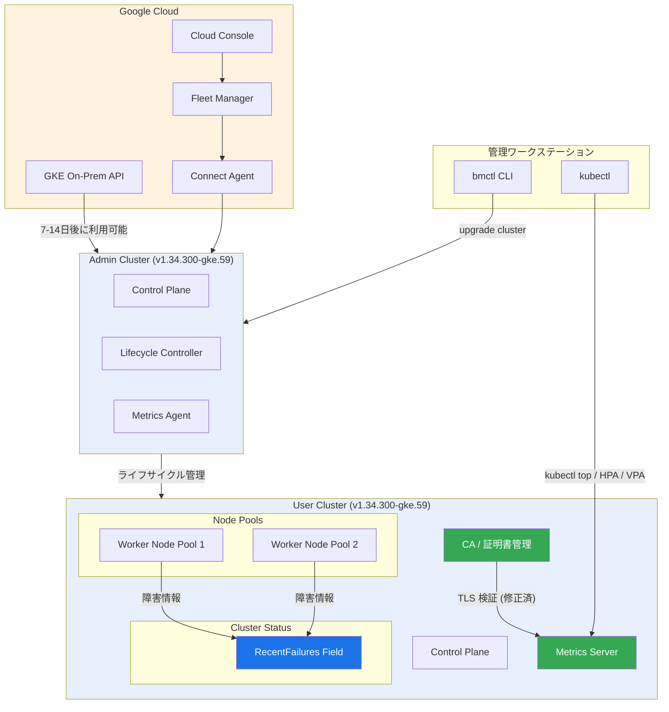

# Google Distributed Cloud (software only) for bare metal: バージョン 1.34.300-gke.59 リリース

**リリース日**: 2026-04-15

**サービス**: Google Distributed Cloud (software only) for bare metal

**機能**: Version 1.34.300-gke.59 release

**ステータス**: パッチリリース (修正・改善)

[このアップデートのインフォグラフィックを見る](https://takech9203.github.io/google-cloud-news-summary/20260415-google-distributed-cloud-bare-metal-1-34-300.html)

## 概要

Google Distributed Cloud (software only) for bare metal の新しいパッチバージョン 1.34.300-gke.59 がダウンロード可能になった。本バージョンは Kubernetes v1.34.3-gke.400 をベースとしており、セキュリティ脆弱性の修正、クラスタステータスにおけるエラー情報の集約表示、および CA ローテーション中の Metrics API に関する TLS 検証エラーの修正が含まれている。

Google Distributed Cloud for bare metal は、Google Cloud のインフラストラクチャとサービスを自社のデータセンターに拡張するソフトウェア専用ソリューションであり、ベアメタルサーバー上で直接 GKE クラスタを運用できる。本パッチリリースは、オンプレミス環境で Kubernetes クラスタを運用するエンタープライズユーザーにとって、安定性とオブザーバビリティの向上に寄与する重要なアップデートである。

リリース後、GKE On-Prem API クライアントを通じたインストールやアップグレードが可能になるまでに約 7 日から 14 日を要する。bmctl CLI を使用したアップグレードは即座にダウンロード可能なバイナリを利用して実行できる。

**アップデート前の課題**

- クラスタやノードプールの障害情報がクラスタステータスに集約されておらず、問題の特定に複数のリソースを個別に確認する必要があった
- CA ローテーション中に Metrics API の操作 (`kubectl top`、HPA、VPA) が TLS 検証エラーで失敗する場合があり、CA ローテーション中のモニタリングとオートスケーリングに影響が生じていた
- 既知のセキュリティ脆弱性に対する修正が適用されておらず、セキュリティリスクが残存していた

**アップデート後の改善**

- クラスタステータスの `RecentFailures` フィールドにクラスタおよびノードプールの障害が集約表示されるようになり、エラーの一元的な確認が可能になった
- CA ローテーション中の TLS 検証エラーが修正され、Metrics API (`kubectl top`、HPA、VPA) がローテーション中でも正常に動作するようになった
- セキュリティ脆弱性が修正され、クラスタのセキュリティ態勢が強化された

## アーキテクチャ図



Google Distributed Cloud for bare metal のアーキテクチャと本パッチリリースの修正箇所を示す。管理クラスタがユーザークラスタのライフサイクルを管理し、ユーザークラスタ内のクラスタステータスに新設された `RecentFailures` フィールドで障害情報が集約される。CA ローテーションと Metrics Server 間の TLS 検証エラーが修正され、`kubectl top`、HPA、VPA が安定動作する。

## サービスアップデートの詳細

### 主要機能

1. **RecentFailures フィールドによるエラー集約表示**
   - クラスタステータスに `RecentFailures` フィールドが追加され、クラスタおよびノードプールの障害情報が一元的に表示される
   - 従来は個別のリソースやイベントを確認する必要があったが、クラスタステータスの単一フィールドで直近の障害を把握できる
   - 運用チームによるインシデント対応の初動を高速化し、障害の見落としを防止する

2. **CA ローテーション中の Metrics API TLS 検証エラー修正**
   - CA ローテーション実行中に `kubectl top`、Horizontal Pod Autoscaler (HPA)、Vertical Pod Autoscaler (VPA) が TLS 検証エラーで失敗する問題が修正された
   - CA ローテーションは証明書の更新プロセスで API サーバーやコントロールプレーンプロセスの再起動を伴うが、その過渡期に Metrics Server への TLS 接続が失敗していた
   - この修正により、CA ローテーション中でもオートスケーリングとリソースモニタリングが継続的に機能する

3. **セキュリティ脆弱性の修正**
   - Vulnerability fixes に記載された既知のセキュリティ脆弱性が修正された
   - ベースとなる Kubernetes v1.34.3-gke.400 に含まれるセキュリティパッチも適用されている
   - オンプレミス環境においてもクラウドと同等のセキュリティ水準を維持できる

## 技術仕様

### バージョン情報

| 項目 | 詳細 |
|------|------|
| Google Distributed Cloud バージョン | 1.34.300-gke.59 |
| ベース Kubernetes バージョン | v1.34.3-gke.400 |
| マイナーバージョン | 1.34 |
| パッチレベル | 300 |
| GKE On-Prem API 利用可能時期 | リリース後 7-14 日 |

### RecentFailures フィールド

| 項目 | 詳細 |
|------|------|
| フィールドパス | `status.recentFailures` |
| 対象リソース | Cluster、NodePool |
| 表示内容 | クラスタおよびノードプールの直近の障害情報 |
| 確認方法 | `kubectl get cluster -o yaml` または `kubectl describe cluster` |

### CA ローテーション関連

| 項目 | 詳細 |
|------|------|
| 修正対象 | Metrics API (kubectl top, HPA, VPA) の TLS 検証エラー |
| 発生条件 | CA ローテーション実行中 |
| 影響を受けるコンポーネント | Metrics Server、API Server |
| ローテーションコマンド | `bmctl update credentials certificate-authorities rotate` |
| ローテーション所要時間 (目安) | クラスタ規模に依存 (50 ワーカーノードで約 2 時間) |

## 設定方法

### 前提条件

1. 既存のクラスタがバージョン 1.34.x 系で動作していること
2. bmctl バージョン 1.34.300-gke.59 のバイナリをダウンロード済みであること
3. アドミンワークステーションに十分なディスク容量があること
4. アドミンクラスタのバージョンがユーザークラスタのバージョン以上であること

### 手順

#### ステップ 1: bmctl のダウンロード

```bash
# bmctl バイナリのダウンロード
gsutil cp gs://anthos-baremetal-release/bmctl/1.34.300-gke.59/linux-amd64/bmctl bmctl
chmod +x bmctl
```

bmctl のバージョンはアップグレード先のクラスタバージョンと一致する必要がある。

#### ステップ 2: クラスタ構成ファイルの更新

```yaml
# クラスタ構成ファイルの anthosBareMetalVersion を更新
apiVersion: baremetal.cluster.gke.io/v1
kind: Cluster
metadata:
  name: my-cluster
  namespace: cluster-my-cluster
spec:
  type: admin
  anthosBareMetalVersion: 1.34.300-gke.59
```

クラスタ構成ファイルの `anthosBareMetalVersion` フィールドを `1.34.300-gke.59` に更新する。

#### ステップ 3: クラスタのアップグレード実行

```bash
# アドミンクラスタのアップグレード
bmctl upgrade cluster -c CLUSTER_NAME \
  --kubeconfig ADMIN_KUBECONFIG

# アップグレード後のバージョン確認
kubectl get cluster -n CLUSTER_NAMESPACE \
  --kubeconfig ADMIN_KUBECONFIG \
  -o jsonpath='{.items[*].spec.anthosBareMetalVersion}'
```

アップグレード前にプリフライトチェックが自動実行され、クラスタの状態とノードの健全性が検証される。プリフライトチェックに失敗した場合、アップグレードは進行しない。

#### ステップ 4: RecentFailures フィールドの確認

```bash
# クラスタステータスの RecentFailures を確認
kubectl get cluster CLUSTER_NAME -n CLUSTER_NAMESPACE \
  --kubeconfig ADMIN_KUBECONFIG \
  -o jsonpath='{.status.recentFailures}'
```

アップグレード完了後、クラスタステータスの `RecentFailures` フィールドが利用可能になる。

## メリット

### ビジネス面

- **障害対応の迅速化**: `RecentFailures` フィールドにより、運用チームがクラスタの障害状況を即座に把握でき、インシデント対応の平均復旧時間 (MTTR) が短縮される
- **オートスケーリングの安定性向上**: CA ローテーション中でも HPA/VPA が正常動作するため、証明書のローテーションをメンテナンスウィンドウ外でも安心して実施でき、セキュリティ運用の柔軟性が向上する
- **セキュリティコンプライアンスの強化**: セキュリティ脆弱性の修正により、オンプレミス環境のコンプライアンス要件への適合が維持される

### 技術面

- **オブザーバビリティの向上**: クラスタステータスへのエラー集約により、障害の可視性が大幅に改善され、複数コンポーネントにまたがる問題の診断が容易になる
- **CA ローテーションの信頼性向上**: TLS 検証エラーの修正により、CA ローテーション中の Metrics API の可用性が保証され、ローテーション手順の中断リスクが低減される
- **Kubernetes ベースの最新化**: Kubernetes v1.34.3-gke.400 ベースにより、上流の安定性改善とセキュリティパッチが適用される

## デメリット・制約事項

### 制限事項

- GKE On-Prem API クライアント (Cloud Console、gcloud CLI、Terraform) を通じたアップグレードは、リリース後 7 日から 14 日経過するまで利用できない
- アドミンクラスタを先にアップグレードする必要があり、関連するユーザークラスタがバージョン 1.33.0 以上でなければアドミンクラスタのアップグレードはエラーとなる
- CA ローテーション自体は一度開始すると一時停止やロールバックができない点は従来と変わらない

### 考慮すべき点

- パッチアップグレード中もワークロードの再スケジューリングが発生する可能性があるため、メンテナンスウィンドウの計画が推奨される
- アップグレード中は一時的にクラスタ管理操作が制限されるため、他の運用作業との調整が必要
- 複数クラスタを運用している場合、アドミンクラスタとユーザークラスタのバージョン整合性に注意が必要

## ユースケース

### ユースケース 1: 定期的な CA ローテーションとモニタリングの両立

**シナリオ**: セキュリティポリシーにより、クラスタの CA を 90 日ごとにローテーションすることが義務付けられている。従来は CA ローテーション中に HPA が動作せず、ワークロードのオートスケーリングが一時的に停止していた。

**実装例**:
```bash
# 1.34.300-gke.59 へアップグレード後、CA ローテーションを実施
bmctl update credentials certificate-authorities rotate \
  --cluster my-user-cluster \
  --kubeconfig bmctl-workspace/my-admin-cluster/my-admin-cluster-kubeconfig

# ローテーション中も HPA が正常に動作していることを確認
kubectl top pods -n production
kubectl get hpa -n production
```

**効果**: CA ローテーション中でも HPA/VPA が正常に動作し、オートスケーリングが継続されるため、メンテナンスウィンドウの短縮やサービス影響の回避が可能になる。

### ユースケース 2: 大規模クラスタの障害監視の効率化

**シナリオ**: 複数のノードプールを持つ大規模なユーザークラスタを運用しており、ノードプール単位の障害を一括で監視したい。

**実装例**:
```bash
# クラスタステータスの RecentFailures を定期監視
kubectl get cluster my-cluster -n cluster-my-cluster \
  --kubeconfig admin-kubeconfig \
  -o jsonpath='{.status.recentFailures}' | jq .

# 監視ツールとの連携例: Prometheus カスタムメトリクスとして公開
# または Cloud Monitoring へのエクスポート
```

**効果**: 個別のノードプールやノードのステータスを逐一確認する必要がなくなり、クラスタレベルで直近の障害を一覧把握できる。運用チームのアラート対応と障害分析の初動が大幅に効率化される。

## 料金

Google Distributed Cloud (software only) for bare metal は、vCPU 単位の課金モデルで提供されている。

### 料金例

| 項目 | 詳細 |
|------|------|
| 課金単位 | vCPU あたり |
| 課金対象 | Fleet に登録されたクラスタのワーカーノード |
| 必要な API | Anthos API の有効化 |
| 詳細 | [Google Kubernetes Engine pricing](https://cloud.google.com/kubernetes-engine/pricing) を参照 |

パッチアップグレード自体に追加料金は発生しない。

## 利用可能リージョン

Google Distributed Cloud for bare metal はオンプレミスソフトウェアであるため、リージョンの概念は適用されない。自社のデータセンターやエッジロケーションなど、任意の環境にデプロイ可能である。Fleet 管理やログ/メトリクスの送信先となる Google Cloud プロジェクトのリージョンは任意に選択できる。

## 関連サービス・機能

- **[GKE On-Prem API](https://docs.cloud.google.com/kubernetes-engine/distributed-cloud/bare-metal/docs/how-to/manage-clusters-gke-on-prem-api)**: Cloud Console、gcloud CLI、Terraform からクラスタのライフサイクルを管理する API。リリース後 7-14 日で本バージョンの利用が可能
- **[CA ローテーション](https://docs.cloud.google.com/kubernetes-engine/distributed-cloud/bare-metal/docs/how-to/ca-rotation)**: クラスタの証明書機関を更新する運用手順。本パッチで TLS 検証の問題が修正された
- **[スキップアップグレード](https://docs.cloud.google.com/kubernetes-engine/distributed-cloud/bare-metal/docs/how-to/upgrade)**: バージョン 1.33 以降で利用可能な、2 マイナーバージョンをスキップしてアップグレードする機能
- **[アップグレードの一時停止と再開](https://docs.cloud.google.com/kubernetes-engine/distributed-cloud/bare-metal/docs/how-to/upgrade)**: アップグレード中にワーカーノードのアップグレードを一時停止し、メンテナンスウィンドウに合わせて再開できる機能
- **[並列アップグレード](https://docs.cloud.google.com/kubernetes-engine/distributed-cloud/bare-metal/docs/how-to/upgrade)**: 複数のノードプールやノードを同時にアップグレードし、アップグレード時間を短縮する機能

## 参考リンク

- [インフォグラフィック](https://takech9203.github.io/google-cloud-news-summary/20260415-google-distributed-cloud-bare-metal-1-34-300.html)
- [公式リリースノート](https://cloud.google.com/release-notes#April_15_2026)
- [Google Distributed Cloud for bare metal ドキュメント](https://docs.cloud.google.com/kubernetes-engine/distributed-cloud/bare-metal/docs)
- [クラスタのアップグレード手順](https://docs.cloud.google.com/kubernetes-engine/distributed-cloud/bare-metal/docs/how-to/upgrade)
- [CA ローテーション](https://docs.cloud.google.com/kubernetes-engine/distributed-cloud/bare-metal/docs/how-to/ca-rotation)
- [ダウンロードページ](https://docs.cloud.google.com/kubernetes-engine/distributed-cloud/bare-metal/docs/downloads)
- [料金ページ](https://cloud.google.com/kubernetes-engine/pricing)

## まとめ

Google Distributed Cloud (software only) for bare metal 1.34.300-gke.59 は、オンプレミス Kubernetes クラスタの運用品質を向上させる重要なパッチリリースである。特に `RecentFailures` フィールドによるエラー集約表示は、大規模クラスタの運用効率を大幅に改善し、CA ローテーション中の Metrics API 修正はセキュリティ運用とオートスケーリングの両立を実現する。既存の 1.34.x クラスタを運用しているユーザーは、セキュリティ修正も含まれているため、早期のアップグレードを推奨する。

---

**タグ**: #GoogleDistributedCloud #BareMetal #GDC #Kubernetes #PatchRelease #CARotation #MetricsAPI #RecentFailures #SecurityFix
