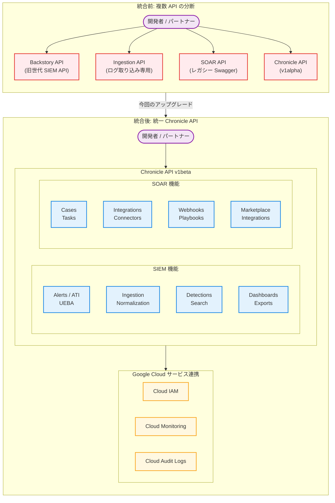

# Google SecOps: Chronicle API の統合とアルファからベータへの大規模アップグレード

**リリース日**: 2026-04-15

**サービス**: Google SecOps

**機能**: Chronicle API の統一 -- レガシー SOAR API の統合およびアルファリソースの v1 Beta へのアップグレード

**ステータス**: Announcement / Feature

[このアップデートのインフォグラフィックを見る](https://takech9203.github.io/google-cloud-news-summary/20260415-google-secops-chronicle-api-upgrade.html)

## 概要

Google Security Operations (SecOps) は、Chronicle API の大規模な統合とアップグレードを発表した。本アップデートの核心は 2 つある。第一に、これまで独立して存在していたレガシー SOAR API のリソースが Chronicle API に統合され、単一の統一された API サーフェスが実現した。第二に、Chronicle API の多数のリソースがアルファ (v1alpha) からベータ (v1beta) にアップグレードされた。このベータ昇格は、Google の API Improvement Proposals (AIP-181) に基づく API 安定性と機能的完全性のシグナルであり、本番環境での顧客およびパートナーによる採用を可能にするものである。

アップグレードされたリソースは、アラート・脅威インテリジェンス (ATI)、UEBA、ダッシュボード、データテーブル、インジェスション、正規化、検知、検索・調査、エクスポート、エンリッチメント制御、SOAR という 10 以上の機能領域に及び、合計 80 以上のリソースが対象となっている。これは Google SecOps プラットフォーム史上最大規模の API アップグレードであり、セキュリティオートメーションを構築する全ての開発者・パートナー・顧客に影響する。

加えて、SecOps Marketplace では SentinelOneV2、CrowdStrike Falcon、ServiceNow、Zscaler、Mandiant Threat Intelligence の 5 つのインテグレーションが同時にアップデートされ、サードパーティ連携の強化が図られている。

**アップデート前の課題**

Chronicle API 統合以前には、以下の課題が存在していた。

- SOAR API と Chronicle API (旧 Backstory API) が別々に存在し、開発者は目的に応じて異なる API エンドポイント、認証方式、データモデルを使い分ける必要があった
- アルファ版 API は互換性のない変更が予告なく行われる可能性があり、本番環境での採用にリスクがあった
- SOAR 機能 (ケース管理、プレイブック、コネクタなど) を自動化するには、レガシー SOAR API の Swagger ベースの独自エンドポイントを使用する必要があり、Google Cloud IAM やCloud Monitoring などの標準サービスとの統合が困難だった
- レガシー SOAR API は API キーベースの認証に依存しており、Google Cloud のサービスアカウント認証やワークロード ID フェデレーションとの整合性がなかった

**アップデート後の改善**

今回のアップデートにより、以下の改善が実現された。

- Chronicle API 一本で SIEM 機能と SOAR 機能の両方をプログラマティックに操作でき、開発・保守コストが大幅に削減された
- v1beta への昇格により、後方互換性が保証され、本番環境での安心した採用が可能になった
- Google Cloud IAM、Cloud Monitoring、Cloud Audit Logs といった Google Cloud の標準サービスとのシームレスな統合が実現した
- AIP 標準に基づくリソース指向の一貫した設計により、クライアントライブラリを通じた開発が簡素化された

## アーキテクチャ図



この図は、今回の Chronicle API 統合の全体像を示している。統合前はBackstory API、Ingestion API、SOAR API、Chronicle API (alpha) の 4 つが分断されていたが、統合後は Chronicle API v1beta に一本化され、Google Cloud IAM や Cloud Monitoring との標準的な連携が可能になった。

## サービスアップデートの詳細

### 主要機能

1. **レガシー SOAR API の Chronicle API への統合**
   - 従来の SOAR API (siemplify-soar.com ドメイン) のリソースが Chronicle API (googleapis.com ドメイン) に統合された
   - ケース管理、アラート処理、インテグレーション管理、コネクタ操作など、SOAR の全機能が Chronicle API から利用可能に
   - レガシー SOAR API は 2026 年 9 月 30 日まで並行稼働するが、パフォーマンスへの影響があるため早期の移行が推奨される

2. **アルファからベータへの大規模リソースアップグレード**
   - AIP-181 に基づく API 安定性の保証: ベータ API はバージョン内での後方互換性のない変更が行われない
   - 80 以上のリソースが一斉にベータへ昇格し、本番環境での採用が正式にサポートされた
   - リソース指向のURL構造 (`projects/{project}/locations/{location}/instances/{instance}/...`) による一貫した設計

3. **Google Cloud ネイティブ認証への移行**
   - レガシー API キー認証から Google Cloud IAM ベースの認証に移行
   - サービスアカウント認証およびワークロード ID フェデレーションに対応
   - きめ細かなアクセス制御が IAM ロールで管理可能に

### アップグレードされたリソース一覧

| 機能領域 | v1beta にアップグレードされた主要リソース |
|---------|----------------------------------------|
| Alerts / ATI / UEBA | ThreatCollection, IoC, CoverageDetail, EntityRisk |
| Dashboards | NativeDashboard, DashboardChart, DashboardQuery, FeaturedContentNativeDashboard |
| Data Tables | DataTable, DataTableRow, DataTableOperationError |
| Ingestion | Logs, Feed, LogTypeSchema, FeedSourceSchema, FeedPack, Forwarder, Collector |
| Normalization | Logtype, Parser, IngestionLogLabel |
| Detections | FindingsRefinement, VerifyRuleText, FeaturedContentRule, RuleExecutionError |
| Search / Investigation | Event, Entity, SearchQuery, SavedColumnSet |
| Exports | BigQueryExportService |
| Enrichment Controls | EnrichmentControl, EnrichmentCombination |
| SOAR (ケース管理) | Case, CaseAlert, CaseStageDefinition, CaseTagDefinition, CaseQueueFilter, CaseCloseDefinition, CaseComment, CaseWallRecord |
| SOAR (インテグレーション) | Integration, IntegrationAction, Connector, ConnectorInstance, RemoteAgent, IntegrationInstance, Job, JobInstance |
| SOAR (その他) | Task, Webhook, View, ContentPack, SocRole, EmailTemplate, Environment, AlertGroupingRule, MarketplaceIntegration, SlaDefinition 他多数 |

### SecOps Marketplace アップデート

| インテグレーション | バージョン | 主な変更内容 |
|------------------|-----------|-------------|
| SentinelOneV2 | v50.0 | Sync Threats ジョブの処理を更新 |
| CrowdStrike Falcon | v76.0 | Sync Alerts ジョブの処理を更新 |
| ServiceNow | v64.0 | オーバーフロー設定の追加、チケット処理の改善 |
| Zscaler | v14.0 | IOC 入力パラメータの改善、OAuth 認証のサポート |
| Mandiant Threat Intelligence | v17.0 | エンティティ処理の最適化 |

## 技術仕様

### API エンドポイント構造

Chronicle API v1beta のエンドポイントは以下の統一構造に従う。

| 項目 | 詳細 |
|------|------|
| エンドポイント形式 | `https://{regional_endpoint}/v1beta/projects/{project_id}/locations/{location}/instances/{instance_id}/{resource}` |
| 認証方式 | Google Cloud IAM (サービスアカウント / ワークロード ID フェデレーション) |
| API 標準 | Google AIP (API Improvement Proposals) 準拠 |
| API 安定性 | AIP-181 に基づくベータ安定性保証 |
| レスポンス形式 | JSON (REST) |
| レート制限 | Cloud Armor による 900 リクエスト/分/IP |

### リージョナルエンドポイント

Chronicle API はリージョナルサービスであり、リージョンごとのエンドポイントを使用する。

```
# 主要リージョンの例
US:                 https://chronicle.us.rep.googleapis.com
EU:                 https://chronicle.eu.rep.googleapis.com
asia-northeast1:    https://chronicle.asia-northeast1.rep.googleapis.com
asia-southeast1:    https://chronicle.asia-southeast1.rep.googleapis.com
australia-southeast1: https://chronicle.australia-southeast1.rep.googleapis.com
europe-west2:       https://chronicle.europe-west2.rep.googleapis.com
```

### API バージョンの比較

| 項目 | v1alpha (従来) | v1beta (今回) |
|------|---------------|--------------|
| 安定性保証 | なし (互換性のない変更あり) | AIP-181 に基づく後方互換性保証 |
| 本番利用推奨 | 非推奨 | 推奨 |
| SOAR リソース | 限定的 | 全 SOAR リソース統合済み |
| SLA 対象 | 対象外 | ベータ SLA 適用 |
| クライアントライブラリ | 限定的サポート | 完全サポート |

## 設定方法

### 前提条件

1. Google Cloud プロジェクトで Chronicle API が有効化されていること
2. 適切な IAM ロールが付与されたサービスアカウントが作成されていること
3. Google SecOps インスタンス ID を把握していること

### 手順

#### ステップ 1: 認証の設定

```bash
# サービスアカウントの作成
gcloud iam service-accounts create chronicle-api-client \
    --display-name="Chronicle API Client"

# 必要なロールの付与
gcloud projects add-iam-policy-binding PROJECT_ID \
    --member="serviceAccount:chronicle-api-client@PROJECT_ID.iam.gserviceaccount.com" \
    --role="roles/chronicle.editor"

# サービスアカウントキーの生成
gcloud iam service-accounts keys create key.json \
    --iam-account=chronicle-api-client@PROJECT_ID.iam.gserviceaccount.com
```

サービスアカウントを作成し、Chronicle API にアクセスするための適切な IAM ロールを付与する。

#### ステップ 2: v1beta エンドポイントへの移行

```bash
# 旧 v1alpha エンドポイント (移行前)
curl -H "Authorization: Bearer $(gcloud auth print-access-token)" \
  "https://chronicle.us.rep.googleapis.com/v1alpha/projects/PROJECT_ID/locations/us/instances/INSTANCE_ID/cases"

# 新 v1beta エンドポイント (移行後)
curl -H "Authorization: Bearer $(gcloud auth print-access-token)" \
  "https://chronicle.us.rep.googleapis.com/v1beta/projects/PROJECT_ID/locations/us/instances/INSTANCE_ID/cases"
```

API パスの `v1alpha` を `v1beta` に変更する。リソース名やフィールド名に構造的な変更がある場合は、API リファレンスドキュメントを参照して対応する。

#### ステップ 3: レガシー SOAR API からの移行 (該当する場合)

```bash
# 旧 SOAR API エンドポイント (移行前)
# https://xxxx.siemplify-soar.com/api/external/v1/cases

# 新 Chronicle API エンドポイント (移行後)
curl -H "Authorization: Bearer $(gcloud auth print-access-token)" \
  "https://chronicle.us.rep.googleapis.com/v1beta/projects/PROJECT_ID/locations/us/instances/INSTANCE_ID/cases"
```

レガシー SOAR API の siemplify-soar.com ドメインから googleapis.com ドメインへエンドポイントを変更し、認証方式を API キーから IAM 認証に切り替える。エンドポイントマッピングテーブルを参照して、各 API コールの対応関係を確認する。

## メリット

### ビジネス面

- **開発・運用コストの削減**: API サーフェスの一本化により、開発チームが習得・保守すべき API が 1 つに集約され、トレーニングコストとインテグレーション開発コストが大幅に削減される
- **本番環境への安心した採用**: ベータ安定性保証により、API の互換性リスクを気にせず本番ワークフローに組み込める。パートナーや ISV も安心して製品統合を構築できる
- **エコシステムの拡大**: 統一 API によりサードパーティ製品やカスタムツールとの統合が容易になり、セキュリティオペレーションのエコシステムが拡大する

### 技術面

- **Google Cloud サービスとのネイティブ統合**: IAM による細かなアクセス制御、Cloud Monitoring によるAPI使用状況の監視、Cloud Audit Logs による監査証跡が標準で利用可能
- **AIP 標準準拠の一貫した API 設計**: リソース指向の URL 構造、標準的な CRUD 操作、リストのページネーション、フィールドマスクなど、Google Cloud API の標準パターンに準拠
- **クライアントライブラリによる開発の簡素化**: Python、Java、Go、Node.js などのクライアントライブラリが利用可能であり、ボイラープレートコードが大幅に削減される
- **リージョナルエンドポイントによるデータレジデンシー対応**: データの物理的な処理場所を制御でき、コンプライアンス要件への対応が容易

## デメリット・制約事項

### 制限事項

- レガシー SOAR API は 2026 年 9 月 30 日に完全に停止するため、それまでにすべてのスクリプトとインテグレーションを移行する必要がある
- v1alpha のエンドポイントも引き続き利用可能だが、ベータにアップグレードされたリソースについては v1beta の使用が強く推奨される
- Cloud Armor によるレート制限 (900 リクエスト/分/IP) はベータ API にも適用される
- 一部のレガシー SOAR API エンドポイントは、Chronicle API に完全に 1:1 でマッピングされない場合があり、データモデルの変更に対応する必要がある

### 考慮すべき点

- 既存の SOAR API を使用するカスタムスクリプトやサードパーティインテグレーションは、エンドポイントURL、認証方式、データモデルの 3 つの観点で移行作業が必要
- SOAR の権限グループ管理が Google Cloud IAM に移行されるため、既存のアクセス制御設計の見直しが必要になる場合がある
- ステージング環境でのテストを十分に行ったうえで本番環境への移行を実施することが推奨される
- Webhook の URL 更新も必要であり、レガシードメイン (siemplify-soar.com) から googleapis.com ドメインに変更する必要がある

## ユースケース

### ユースケース 1: SOAR ワークフローの完全自動化

**シナリオ**: セキュリティ運用チームが、アラート検知からケース作成、調査、対応アクション実行までを統一 API で自動化したい。これまでは SIEM 系の操作に Chronicle API、SOAR 系の操作にレガシー SOAR API と、2 つの API を使い分ける必要があった。

**実装例**:
```python
from google.cloud import chronicle_v1beta

# 統一 Chronicle API クライアントの初期化
client = chronicle_v1beta.ChronicleServiceClient()
instance = f"projects/{project_id}/locations/us/instances/{instance_id}"

# 1. UDM 検索でイベントを取得 (旧 Backstory API 機能)
events = client.udm_search(instance=instance, query="ip = '10.0.0.1'")

# 2. ケースを作成 (旧 SOAR API 機能)
case = client.create_case(parent=instance, case={
    "display_name": "Suspicious activity from 10.0.0.1",
    "priority": "HIGH",
})

# 3. タスクを割り当て (旧 SOAR API 機能)
task = client.create_task(parent=instance, task={
    "display_name": "Investigate source IP",
    "assignee": "analyst@example.com",
})
```

**効果**: 単一の API クライアントと認証情報で、SIEM 検索から SOAR ケース管理まで一貫した自動化パイプラインを構築でき、開発・保守コストが削減される。

### ユースケース 2: パートナー製品の本番統合

**シナリオ**: セキュリティベンダーが自社製品と Google SecOps を統合する製品を開発しているが、これまでアルファ API の互換性リスクにより本番リリースを見送っていた。

**効果**: v1beta への昇格により API の安定性が保証されるため、本番環境向けの製品統合を安心してリリースできる。AIP 標準に準拠した一貫したインターフェースにより、新しいリソースが追加された場合でも予測可能なパターンで対応できる。

## 料金

Chronicle API の利用自体に追加料金は発生しない。料金は Google SecOps のライセンスモデルに基づく。

| ライセンスタイプ | 内容 |
|----------------|------|
| Google SecOps Standard | 基本的な SIEM + SOAR 機能、Chronicle API アクセス含む |
| Google SecOps Enterprise | 高度な分析、UEBA、Gemini AI 機能を含むフルスイート |

詳細な料金については Google Cloud の営業担当者に確認のこと。

## 利用可能リージョン

Chronicle API v1beta は、以下のリージョナルエンドポイントで利用可能である。

- **マルチリージョン**: US, EU
- **アジア太平洋**: asia-northeast1 (東京), asia-south1 (ムンバイ), asia-southeast1 (シンガポール), asia-southeast2 (ジャカルタ), australia-southeast1 (シドニー)
- **ヨーロッパ**: europe-west2 (ロンドン), europe-west3 (フランクフルト), europe-west6 (チューリッヒ), europe-west9 (パリ), europe-west12 (トリノ)
- **中東**: me-central1, me-central2, me-west1 (テルアビブ)
- **南米**: southamerica-east1 (サンパウロ)
- **北米**: northamerica-northeast2 (トロント)
- **アフリカ**: africa-south1 (ヨハネスブルグ)

## 関連サービス・機能

- **Google SecOps SIEM**: UDM 検索、検知ルール、ログインジェスション、正規化などの SIEM 機能を提供し、今回 Chronicle API v1beta に統合された
- **Google SecOps SOAR**: ケース管理、プレイブック、インテグレーション、コネクタなどの SOAR 機能を提供し、レガシー SOAR API から Chronicle API に移行
- **Google Cloud IAM**: Chronicle API の認証・認可基盤。サービスアカウント、ワークロード ID フェデレーション、きめ細かなロールベースのアクセス制御を提供
- **Cloud Monitoring**: Chronicle API の使用状況やパフォーマンスメトリクスの監視に使用
- **Cloud Audit Logs**: Chronicle API の呼び出しに対する監査ログを自動記録
- **SecOps Marketplace**: サードパーティインテグレーションのハブ。今回 SentinelOneV2、CrowdStrike Falcon、ServiceNow、Zscaler、Mandiant Threat Intelligence がアップデート
- **BigQuery**: BigQueryExportService リソースにより、SecOps のデータを BigQuery にエクスポートして高度な分析が可能

## 参考リンク

- [インフォグラフィック](https://takech9203.github.io/google-cloud-news-summary/20260415-google-secops-chronicle-api-upgrade.html)
- [公式リリースノート](https://cloud.google.com/release-notes#April_15_2026)
- [Google SecOps リリースノート](https://cloud.google.com/chronicle/docs/release-notes)
- [Chronicle API リファレンス](https://cloud.google.com/chronicle/docs/reference/rest)
- [Google SecOps API とライブラリの概要](https://cloud.google.com/chronicle/docs/reference/google-secops-api-libraries-overview)
- [SOAR API マイグレーションガイド](https://cloud.google.com/chronicle/docs/soar/admin-tasks/advanced/api-migration-guide)
- [SOAR から Google Cloud への移行概要](https://cloud.google.com/chronicle/docs/soar/admin-tasks/advanced/migrate-to-gcp)
- [API エンドポイントマッピングテーブル](https://cloud.google.com/chronicle/docs/soar/admin-tasks/advanced/endpoint-mapping-table)
- [API 安定性 (AIP-181)](https://google.aip.dev/181)
- [Chronicle API 認証ガイド](https://cloud.google.com/chronicle/docs/reference/authentication)
- [SecOps Marketplace インテグレーションリリースノート](https://cloud.google.com/chronicle/docs/soar/marketplace-integrations/release-notes)

## まとめ

今回の Chronicle API 統合とベータアップグレードは、Google SecOps プラットフォームの API 戦略における重要なマイルストーンである。レガシー SOAR API の統合により API サーフェスが一本化され、80 以上のリソースのベータ昇格により本番環境での安定した利用が正式にサポートされた。セキュリティチームおよびパートナーには、レガシー SOAR API の廃止期限 (2026 年 9 月 30 日) を見据え、早期に Chronicle API v1beta への移行を開始することを強く推奨する。まずは API マイグレーションガイドを確認し、ステージング環境でのテストから着手するのがよい。

---

**タグ**: #google-secops #chronicle-api #soar #api-upgrade #v1beta #security #siem #marketplace #sentinelone #crowdstrike #servicenow #zscaler #mandiant
