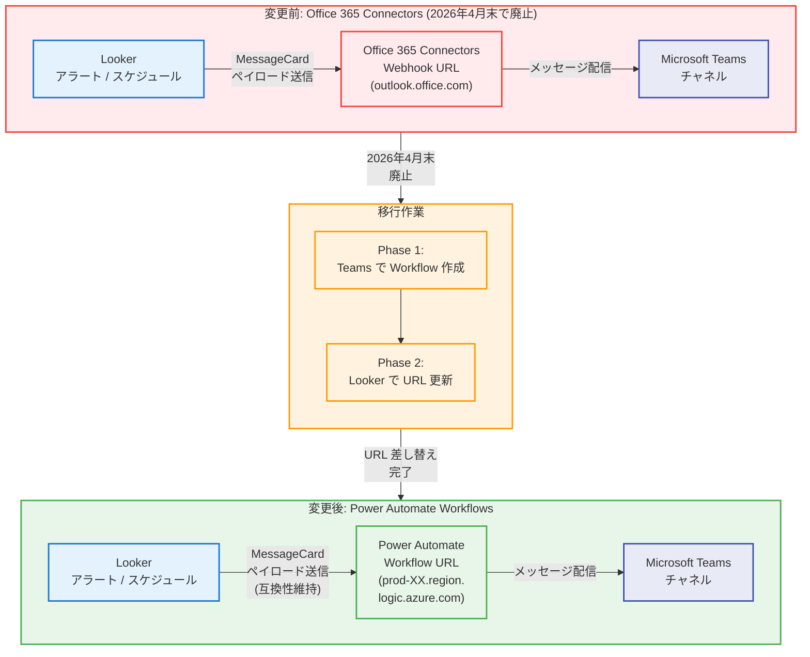

# Looker: Teams Webhook の「Workflows」への移行 (Breaking Change)

**リリース日**: 2026-04-15

**サービス**: Looker

**機能**: Breaking Change - Teams Webhook を Power Automate Workflows に移行

**ステータス**: Breaking

:chart_with_upwards_trend: [このアップデートのインフォグラフィックを見る](https://takech9203.github.io/google-cloud-news-summary/20260415-looker-teams-webhook-migration.html)

## 概要

Microsoft が従来の Office 365 Connectors を廃止し、Power Automate Workflows に移行することに伴い、Looker から Microsoft Teams へのアラート配信に使用している Webhook URL の更新が必要となる Breaking Change が発表された。Office 365 Connectors は 2026 年 4 月末に動作を停止するため、Teams チャネルへのアラート配信を継続するには、現在使用している Webhook URL を新しい「Workflow」URL に置き換える必要がある。

この変更は Microsoft 側のインフラストラクチャ変更に起因するものであり、Looker 自体の機能変更ではない。しかし、Looker の Teams - Incoming Webhook アクションを使用してアラートやスケジュール配信を Microsoft Teams に送信しているすべてのユーザーに直接的な影響がある。対応期限が 2026 年 4 月末と極めて短いため、早急な対応が求められる。

対象となるのは、Looker (Google Cloud core) および Looker (original) の両方のプラットフォームにおいて、Microsoft Teams への Incoming Webhook を利用した Look、Explore、ダッシュボードのスケジュール配信やアラート通知を設定しているユーザーおよび管理者である。

**アップデート前の課題**

Office 365 Connectors ベースの従来の Webhook には以下の課題があった。

- Microsoft が Office 365 Connectors のサポートを終了するため、既存の Webhook URL (outlook.office.com で始まる URL) が 2026 年 4 月末以降に 404 エラーまたは Expired エラーを返すようになる
- 従来の Connectors はレガシーインフラストラクチャ上で動作しており、Microsoft の新しいプラットフォーム戦略と整合しなくなっていた
- Connectors の廃止に気づかないまま放置すると、アラートのサイレント障害が発生し、重要なデータ通知が届かなくなるリスクがある

**アップデート後の改善**

Power Automate Workflows への移行により以下の改善が実現される。

- 新しい Workflow URL (prod-XX.region.logic.azure.com で始まる URL) により、Microsoft の最新インフラストラクチャ上でアラート配信が継続可能
- 既存の Looker メッセージフォーマット (MessageCard) はそのまま互換性が維持されるため、Looker 側の設定変更は URL の差し替えのみ
- Power Automate プラットフォーム上で Workflow が動作するため、将来的なカスタマイズや拡張の余地が広がる

## アーキテクチャ図



この図は、Office 365 Connectors ベースの従来の Webhook から Power Automate Workflows への移行パスを示している。Looker 側のメッセージフォーマット (MessageCard) に変更はなく、Webhook エンドポイント URL の差し替えのみで移行が完了する。

## サービスアップデートの詳細

### 主要機能

1. **Office 365 Connectors の廃止**
   - Microsoft が Office 365 Connectors を正式に廃止することを発表
   - 従来の Webhook URL (outlook.office.com ドメイン) は 2026 年 4 月末以降に動作を停止する
   - 廃止後は 404 エラーまたは Expired エラーが返される

2. **Power Automate Workflows への移行**
   - Microsoft Teams 内で新しい Workflow を作成し、Webhook URL を取得する
   - 新しい URL は prod-XX.region.logic.azure.com ドメインで発行される
   - Looker の既存の MessageCard フォーマットとの後方互換性が維持される

3. **Looker 側の URL 更新**
   - Looker の Admin > Actions パネルまたは個別のスケジュール設定から URL を更新する
   - 古い URL を削除し、新しい Workflow URL を貼り付けるだけで完了
   - テストペイロードを送信して正常に動作することを確認可能

## 技術仕様

### URL 形式の変更

| 項目 | 変更前 (Office 365 Connectors) | 変更後 (Power Automate Workflows) |
|------|------|------|
| URL ドメイン | outlook.office.com | prod-XX.region.logic.azure.com |
| バックエンド | Office 365 Connectors サービス | Power Automate |
| メッセージフォーマット | MessageCard | MessageCard (互換性維持) |
| ステータス | 2026 年 4 月末廃止 | アクティブ |

### 影響を受ける Looker アクション

| アクション | タイプ | 影響 |
|------|------|------|
| Teams - Incoming Webhook | Query, Dashboard | Webhook URL の更新が必要 |
| Look のスケジュール配信 | Query | 配信先が Teams の場合、URL 更新が必要 |
| Explore のスケジュール配信 | Query | 配信先が Teams の場合、URL 更新が必要 |
| ダッシュボードのスケジュール配信 | Dashboard | 配信先が Teams の場合、URL 更新が必要 |
| アラート通知 | Query | 配信先が Teams の場合、URL 更新が必要 |

### レート制限の変更

Power Automate Workflows には従来の Connectors とは異なるレート制限が適用される。1 分あたり数百件のアラートを送信している場合、429 (Too Many Requests) エラーが発生する可能性がある。

## 設定方法

### 前提条件

1. Microsoft Teams の対象チャネルへのアクセス権限を持っていること
2. Teams の Workflows (Power Automate) アプリが組織で有効化されていること
3. Looker の Admin > Actions パネルまたはスケジュール設定へのアクセス権限を持っていること

### 手順

#### ステップ 1: Microsoft Teams で新しい Workflow を作成する

1. Microsoft Teams を開き、アラートを受信するチャネルに移動する
2. チャネルの三点メニュー (...) をクリックし、「Workflows」を選択する
3. 検索バーに「webhook」と入力し、「Post to a channel when a webhook request is received」テンプレートを選択する
4. セットアップのプロンプトに従い設定する

```
名前: わかりやすい名前を設定 (例: "Looker Alerts - Sales")
接続: Microsoft Teams コネクタにサインインしていることを確認
詳細: チームとチャネルが正しいことを確認
```

5. 「Add Workflow」をクリックする
6. 表示される URL をコピーする (これが新しい Webhook エンドポイントとなる)

#### ステップ 2: Looker で Webhook URL を更新する

1. Looker インスタンスにアクセスし、Admin > Actions パネルまたは Webhook が設定されている個別のスケジュールに移動する
2. Microsoft Teams アクションを見つける
3. 古い URL (outlook.office.com で始まるもの) を削除し、新しい URL (prod-XX.region.logic.azure.com で始まるもの) を貼り付ける

#### ステップ 3: 接続をテストする

1. Looker からテストペイロードを送信する
2. Teams チャネルにメッセージが正常に表示されることを確認する

```
確認ポイント:
- メッセージが Teams チャネルに届くこと
- メッセージのフォーマットが正しいこと (タイトル、本文、リンクなど)
- 添付されるビジュアライゼーション画像が正しく表示されること
```

## メリット

### ビジネス面

- **アラート配信の継続性確保**: 移行を完了することで、重要なデータアラートや定期レポートの Teams 配信が中断なく継続される
- **Microsoft の最新プラットフォームとの整合**: Power Automate Workflows は Microsoft の戦略的プラットフォームであり、長期的なサポートが期待できる

### 技術面

- **後方互換性の維持**: Looker の MessageCard フォーマットは新しい Workflows でもそのままサポートされるため、Looker 側のメッセージ構造を変更する必要がない
- **将来的な拡張性**: Power Automate プラットフォーム上で動作するため、条件分岐やフォーマット変換などの高度なワークフローを構築できる可能性がある

## デメリット・制約事項

### 制限事項

- Power Automate Workflows のレート制限が従来の Connectors とは異なるため、大量のアラートを送信している場合は 429 (Too Many Requests) エラーが発生する可能性がある
- 移行作業は各チャネルごとに手動で行う必要があり、大量のチャネルを使用している場合は作業量が増加する
- Workflow URL には有効期限がある場合があるため、定期的な URL の更新が必要になる可能性がある

### 考慮すべき点

- **対応期限が極めて短い**: Office 365 Connectors は 2026 年 4 月末に動作を停止するため、早急な移行が必要。リリースノートの公開が 4 月 15 日であり、対応期間は約 2 週間しかない
- **組織の IT 管理者との連携**: Teams の Workflows (Power Automate) アプリが組織で制限されている場合、IT 管理者にアプリの有効化を依頼する必要がある
- **テスト環境での事前検証**: 本番のアラート設定を変更する前に、テスト用のチャネルと Workflow で動作確認を行うことを強く推奨する
- **複数チャネルの棚卸し**: 複数のチャネルに Looker アラートを配信している場合、すべての Webhook URL をリストアップし、漏れなく移行する必要がある

## ユースケース

### ユースケース 1: 営業チームの KPI アラート移行

**シナリオ**: 営業部門が Looker のダッシュボードタイルにアラートを設定し、売上目標の達成状況を Teams の営業チャネルに自動通知している。Office 365 Connectors の廃止により、この通知が停止するリスクがある。

**実装例**:
```
1. Teams の営業チャネルで「Looker Alerts - Sales KPI」という名前の Workflow を作成
2. 生成された URL をコピー
3. Looker の Admin > Actions で Microsoft Teams の Webhook URL を新しい URL に更新
4. テストアラートを送信して動作確認
```

**効果**: 移行完了により、売上目標達成時の自動通知が中断なく継続され、営業チームの迅速な意思決定を支援する。

### ユースケース 2: 異常検知アラートの移行

**シナリオ**: データエンジニアリングチームが Looker で設定したデータ品質の異常検知アラートを Teams チャネルで受信している。アラートの停止はデータ品質問題の見逃しにつながる。

**効果**: 移行により、データパイプラインの異常を即座に検知し Teams で通知する仕組みが維持される。Power Automate の機能を活用して、将来的にはアラートの条件分岐やエスカレーションルールの追加も検討可能。

## 料金

この移行自体に追加の Looker 料金は発生しない。ただし、Microsoft 側の Power Automate Workflows の利用にはライセンスが必要な場合がある。

| 項目 | 料金 |
|------|------|
| Looker 側の URL 更新作業 | 追加料金なし |
| Power Automate (Microsoft 365 ライセンスに含まれる範囲) | 追加料金なし |
| Power Automate Premium (高度なワークフローが必要な場合) | Microsoft の料金体系に準拠 |

## 利用可能リージョン

この変更はリージョンに依存しない。Looker (Google Cloud core) および Looker (original) のすべてのインスタンスが対象である。Microsoft Teams の Workflows 機能が利用可能なすべての Microsoft 365 テナントで移行が可能。

## 関連サービス・機能

- **Looker アラート**: ダッシュボードタイルのデータが指定条件を満たした場合に通知を送信する機能。Teams への配信には Webhook URL の設定が必要
- **Looker スケジュール配信**: Look、Explore、ダッシュボードの結果を定期的に配信する機能。Teams を配信先として設定可能
- **Looker Action Hub**: Looker と外部サービスを連携する統合ハブ。Teams - Incoming Webhook アクションがこの変更の対象
- **Microsoft Power Automate**: Microsoft のワークフロー自動化プラットフォーム。従来の Office 365 Connectors の後継として Workflows 機能を提供
- **Slack Integration**: Looker の代替的なメッセージング連携先。OAuth ベースの Slack 連携は今回の変更の影響を受けない

## 参考リンク

- :chart_with_upwards_trend: [インフォグラフィック](https://takech9203.github.io/google-cloud-news-summary/20260415-looker-teams-webhook-migration.html)
- [公式リリースノート](https://cloud.google.com/release-notes#April_15_2026)
- [Teams Webhook を Workflows に移行する (ベストプラクティス)](https://cloud.google.com/looker/docs/best-practices/migrate-teams-webhook-to-workflows)
- [Looker アラートの概要](https://cloud.google.com/looker/docs/alerts-overview)
- [Looker アラートの作成](https://cloud.google.com/looker/docs/creating-alerts)
- [Looker Action Hub の概要](https://cloud.google.com/looker/docs/actions-overview)
- [Microsoft Office 365 Connectors 廃止の告知](https://mc.merill.net/message/MC1181996)
- [料金ページ](https://cloud.google.com/looker/pricing)

## まとめ

本アップデートは、Microsoft による Office 365 Connectors の廃止に伴う Breaking Change であり、Looker から Microsoft Teams へのアラートおよびスケジュール配信を利用しているすべてのユーザーに即時対応が求められる。対応期限は 2026 年 4 月末であり、本リリースノート公開から約 2 週間しかないため、早急に各チャネルの Webhook URL を Power Automate Workflows の URL に移行する必要がある。移行作業自体は URL の差し替えのみであり、Looker の MessageCard フォーマットとの互換性は維持されるため技術的な難易度は低いが、対象となるすべてのチャネルを漏れなく更新することが重要である。

---

**タグ**: looker, microsoft-teams, webhook, breaking-change, migration, power-automate, alerts
