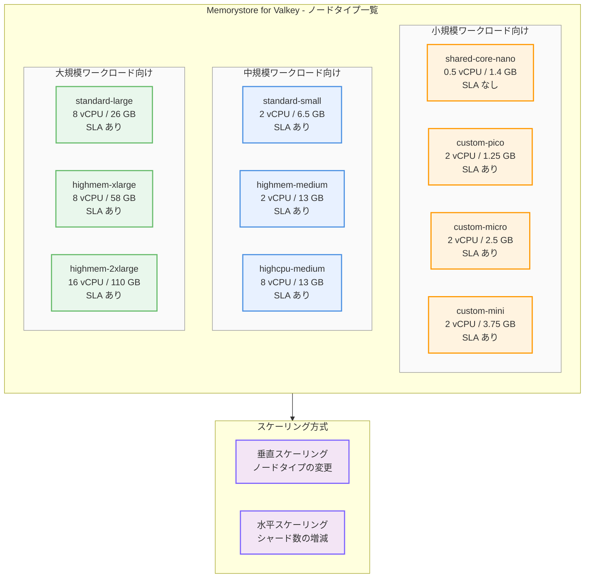

# Memorystore for Valkey: 新しいノードタイプが GA

**リリース日**: 2026-04-15

**サービス**: Memorystore for Valkey

**機能**: 新しいノードタイプの選択肢が追加 (GA)

**ステータス**: GA (Generally Available)

[このアップデートのインフォグラフィックを見る](https://takech9203.github.io/google-cloud-news-summary/20260415-memorystore-valkey-node-types-ga.html)

## 概要

Memorystore for Valkey で新しいノードタイプが一般提供 (GA) となり、インスタンス作成時に選択できるノードタイプのラインナップが拡充されました。これにより、ワークロードの特性に応じて、より細かいリソースサイジングが可能となり、コストパフォーマンスの最適化が実現できます。

Memorystore for Valkey は Google Cloud のフルマネージド Valkey サービスであり、Cluster Mode Enabled と Cluster Mode Disabled の両方のインスタンスモードをサポートしています。今回のアップデートでは、従来の highmem-medium や standard-small に加えて、custom-pico、custom-micro、custom-mini、highcpu-medium、standard-large、highmem-xlarge、highmem-2xlarge といったノードタイプが GA として利用可能になり、1.25 GB から 110 GB までの幅広い容量帯をカバーできるようになりました。

このアップデートは、キャッシュやセッション管理から大規模なリアルタイムデータ処理まで、多様なユースケースに対応する Memorystore for Valkey ユーザーにとって重要な改善です。GA ステータスにより、すべてのノードタイプが SLA の対象となり（shared-core-nano を除く）、本番環境での利用に適した信頼性が保証されます。

**アップデート前の課題**

今回のアップデート以前は、以下の制限がありました。

- 利用可能なノードタイプが限られており、ワークロードの規模に対して過剰または不足するリソースを選択せざるを得ないケースがあった
- 小規模なワークロード向けに SLA 付きで 1 GB - 3 GB の容量帯を利用するオプションが不足しており、Memorystore for Redis からの移行時にサイズ選択に制約があった
- CPU 集約型ワークロードに特化したノードタイプがなく、メモリ容量に対して処理性能が不足するケースがあった

**アップデート後の改善**

今回のアップデートにより、以下の改善が実現しました。

- 10 種類のノードタイプから最適なものを選択でき、1.25 GB から 110 GB までの容量帯を細かくカバーできるようになった
- custom-pico、custom-micro、custom-mini ノードタイプにより、SLA 付きで小規模インスタンス (1 GB - 3 GB) を作成でき、Memorystore for Redis からの移行が容易になった
- highcpu-medium ノードタイプにより、CPU 集約型ワークロードに最適なリソース配分が選択可能になった

## アーキテクチャ図



Memorystore for Valkey のノードタイプは小規模、中規模、大規模の 3 つのカテゴリに分類され、それぞれ異なる vCPU 数と容量を持ちます。インスタンス作成後もノードタイプの変更（垂直スケーリング）やシャード数の増減（水平スケーリング）により柔軟にリソースを調整できます。

## サービスアップデートの詳細

### 主要機能

1. **10 種類のノードタイプ**
   - shared-core-nano から highmem-2xlarge まで、幅広い容量帯をカバーする 10 種類のノードタイプが GA として利用可能
   - ワークロードの特性（メモリ集約型、CPU 集約型、小規模開発用など）に応じた最適な選択が可能

2. **Custom ノードタイプ（Cluster Mode Disabled 専用）**
   - custom-pico (1.25 GB)、custom-micro (2.5 GB)、custom-mini (3.75 GB) の 3 種類
   - Memorystore for Redis からの移行時に、1 GB - 3 GB の小規模インスタンスを SLA 付きで作成可能
   - Cluster Mode Disabled インスタンスでのみ利用可能

3. **High-CPU ノードタイプ**
   - highcpu-medium は 8 vCPU / 13 GB で、メモリ容量に対して高い処理性能を提供
   - CPU 集約型のワークロード（複雑なデータ構造操作、Lua スクリプト処理など）に最適

## 技術仕様

### ノードタイプ一覧

| ノードタイプ | vCPU 数 | デフォルト書き込み容量 | 合計ノード容量 | SLA | デフォルト接続数 | 最大接続数 |
|---|---|---|---|---|---|---|
| shared-core-nano | 0.5 | 1.12 GB | 1.4 GB | なし | 5,000 | 5,000 |
| custom-pico | 2 | 1.08 GB | 1.25 GB | あり | 16,000 | 32,000 |
| custom-micro | 2 | 2 GB | 2.5 GB | あり | 16,000 | 32,000 |
| custom-mini | 2 | 3 GB | 3.75 GB | あり | 16,000 | 32,000 |
| standard-small | 2 | 5.2 GB | 6.5 GB | あり | 16,000 | 32,000 |
| highmem-medium | 2 | 10.4 GB | 13 GB | あり | 32,000 | 64,000 |
| highcpu-medium | 8 | 10.4 GB | 13 GB | あり | 32,000 | 64,000 |
| standard-large | 8 | 20.8 GB | 26 GB | あり | 32,000 | 64,000 |
| highmem-xlarge | 8 | 46.4 GB | 58 GB | あり | 64,000 | 64,000 |
| highmem-2xlarge | 16 | 88 GB | 110 GB | あり | 64,000 | 64,000 |

### ノードタイプの選択基準

| ユースケース | 推奨ノードタイプ | 理由 |
|---|---|---|
| 開発・テスト | shared-core-nano | 低コスト（SLA なし） |
| Redis 移行（小規模） | custom-pico / custom-micro / custom-mini | SLA 付き 1-3 GB |
| 一般的なキャッシュ | standard-small / highmem-medium | バランスの良い性能 |
| CPU 集約型処理 | highcpu-medium | 高い vCPU 対メモリ比率 |
| 大規模データセット | highmem-xlarge / highmem-2xlarge | 大容量メモリ |
| コスト最適化 | standard-small（水平スケーリング） | 小ノードの分散による高い価格性能比 |

### インスタンス作成例

```bash
# highmem-medium ノードタイプでクラスターモードインスタンスを作成
gcloud memorystore instances create my-valkey-instance \
  --location=us-central1 \
  --project=my-project \
  --node-type=highmem-medium \
  --shard-count=3 \
  --engine-configs=maxmemory-policy=allkeys-lru
```

```bash
# custom-micro ノードタイプで Cluster Mode Disabled インスタンスを作成
gcloud memorystore instances create my-small-instance \
  --location=us-central1 \
  --project=my-project \
  --node-type=custom-micro \
  --shard-count=1 \
  --mode=cluster-disabled
```

## 設定方法

### 前提条件

1. Google Cloud プロジェクトが作成済みであること
2. Memorystore API が有効化されていること
3. ネットワーキングの前提条件（VPC、PSC 接続など）が設定済みであること
4. 最新バージョンの gcloud CLI がインストールされていること

### 手順

#### ステップ 1: gcloud CLI の更新

```bash
gcloud components update
```

最新のノードタイプをサポートするため、gcloud CLI を最新バージョンに更新します。

#### ステップ 2: ノードタイプを指定してインスタンスを作成

```bash
gcloud memorystore instances create INSTANCE_ID \
  --location=REGION \
  --project=PROJECT_ID \
  --node-type=NODE_TYPE \
  --shard-count=SHARD_COUNT
```

NODE_TYPE には、shared-core-nano、custom-pico、custom-micro、custom-mini、standard-small、highmem-medium、highcpu-medium、standard-large、highmem-xlarge、highmem-2xlarge のいずれかを指定します。

#### ステップ 3: 既存インスタンスのノードタイプを変更（垂直スケーリング）

```bash
gcloud memorystore instances update INSTANCE_ID \
  --location=REGION \
  --project=PROJECT_ID \
  --node-type=NEW_NODE_TYPE
```

ワークロードの要件が変化した場合、既存インスタンスのノードタイプを変更してスケールアップまたはスケールダウンが可能です。

## メリット

### ビジネス面

- **コスト最適化**: ワークロードの規模に合った最適なノードタイプを選択することで、過剰プロビジョニングを回避し、コストを削減できる
- **移行の容易さ**: custom ノードタイプにより、Memorystore for Redis からの移行時に同等のサイズ帯（1-3 GB）を SLA 付きで利用でき、移行リスクが軽減される
- **スケーラビリティ**: 事業成長に合わせてノードタイプを変更でき、小規模から始めて段階的にスケールアップできる柔軟性がある

### 技術面

- **パフォーマンス最適化**: highcpu-medium ノードタイプにより、CPU 集約型ワークロードに対して最適な処理性能を選択できる
- **柔軟なスケーリング**: 垂直スケーリング（ノードタイプ変更）と水平スケーリング（シャード数変更）の両方を組み合わせた柔軟なリソース管理が可能
- **SLA 保証**: shared-core-nano を除くすべてのノードタイプで SLA が提供され、本番ワークロードに適した可用性が保証される

## デメリット・制約事項

### 制限事項

- shared-core-nano ノードタイプには SLA が適用されないため、本番環境での利用は非推奨
- custom-pico、custom-micro、custom-mini ノードタイプは Cluster Mode Disabled インスタンスでのみ利用可能であり、クラスター構成への移行時にはインスタンスの再作成が必要
- ノードサイズが大きくなるほど vCPU の追加に対する性能向上が線形にスケールしない場合がある

### 考慮すべき点

- 最適なコストパフォーマンスを得るには、大きなノードへのスケールアップよりも、小さなノードを追加するスケールアウト戦略が推奨される
- ノードタイプの変更（垂直スケーリング）中はインスタンスへの影響がある場合があるため、メンテナンスウィンドウでの実施を推奨
- maxmemory 設定を変更することで書き込み可能容量を調整できるが、デフォルト値からの変更は OOM エラーのリスクを高める可能性がある

## ユースケース

### ユースケース 1: Memorystore for Redis から Valkey への移行

**シナリオ**: 現在 2 GB の Memorystore for Redis インスタンスを使用しているアプリケーションを、Memorystore for Valkey に移行する。SLA の保証が必要で、Cluster Mode Disabled で運用したい。

**実装例**:
```bash
# custom-micro (2.5 GB) で Cluster Mode Disabled インスタンスを作成
gcloud memorystore instances create my-migrated-cache \
  --location=asia-northeast1 \
  --project=my-project \
  --node-type=custom-micro \
  --shard-count=1 \
  --mode=cluster-disabled \
  --replica-count=1
```

**効果**: SLA 付きで既存の Redis インスタンスと同等のサイズ帯を利用でき、ダウンタイムを最小限にした段階的な移行が可能。

### ユースケース 2: 大規模リアルタイムレコメンデーションエンジン

**シナリオ**: EC サイトで数百万ユーザーのセッションデータとレコメンデーションモデルをリアルタイムで処理する必要がある。高いメモリ容量と水平スケーリングが求められる。

**実装例**:
```bash
# highmem-xlarge (58 GB) で大規模クラスターを作成
gcloud memorystore instances create recommendation-cache \
  --location=asia-northeast1 \
  --project=my-project \
  --node-type=highmem-xlarge \
  --shard-count=10 \
  --replica-count=2
```

**効果**: 10 シャード x 58 GB = 580 GB の大容量キャッシュにより、数百万ユーザーのリアルタイムデータ処理が可能。レプリカにより読み取りスループットも確保。

### ユースケース 3: CPU 集約型の Lua スクリプト処理

**シナリオ**: ゲームアプリケーションのランキングシステムで、複雑な Lua スクリプトによるアトミックなスコア集計処理が頻繁に発生する。

**効果**: highcpu-medium (8 vCPU / 13 GB) を使用することで、Lua スクリプトの実行性能が向上し、同じメモリ容量の highmem-medium (2 vCPU / 13 GB) と比較して 4 倍の処理能力で複雑な計算ロジックを実行できる。

## 料金

Memorystore for Valkey の料金はノードタイプ、リージョン、およびノード数に基づいて課金されます。各ノードはノードタイプに応じた時間単位の料金が適用されます。

### 料金例

以下は us-central1 リージョンでの概算料金です（実際の料金は Google Cloud の料金ページで確認してください）。

| 構成例 | ノード数 | 概算月額料金 |
|---|---|---|
| highmem-medium x 3 シャード（レプリカなし） | 3 | 約 $337/月 |
| highmem-medium x 10 シャード（レプリカ 2） | 30 | 約 $3,370/月 |
| standard-small x 5 シャード（レプリカ 1） | 10 | 約 $560/月 |

### コスト削減オプション

- **確約利用割引 (CUD)**: 1 年間の確約で 20% 割引、3 年間で 40% 割引
- **CUD の適用範囲**: Memorystore for Valkey の CUD は Memorystore for Redis Cluster、Redis、Memcached の利用にも適用可能
- **スケールアウト戦略**: 大きなノードにスケールアップするよりも、小さなノードを追加するほうがコストパフォーマンスが向上する場合がある

## 利用可能リージョン

Memorystore for Valkey はグローバルに複数のリージョンで利用可能です。新しいノードタイプは、Memorystore for Valkey がサポートされているすべてのリージョンで利用できます。日本リージョンとしては asia-northeast1（東京）および asia-northeast2（大阪）が含まれます。最新のリージョン一覧は [Memorystore for Valkey のロケーション](https://docs.cloud.google.com/memorystore/docs/valkey/locations) を参照してください。

## 関連サービス・機能

- **Memorystore for Redis**: Memorystore for Valkey の前身サービス。custom ノードタイプにより Redis からの移行パスが改善された
- **Compute Engine**: Memorystore for Valkey インスタンスへの接続元となる仮想マシン。ノードタイプの vCPU 数は Compute Engine のマシンタイプに類似した概念
- **Cloud Monitoring**: Memorystore for Valkey のメトリクスをモニタリングし、ノードタイプ変更のタイミングを判断するために使用
- **VPC / Private Service Connect**: Memorystore for Valkey インスタンスへのネットワーク接続に必要な基盤サービス

## 参考リンク

- [インフォグラフィック](https://takech9203.github.io/google-cloud-news-summary/20260415-memorystore-valkey-node-types-ga.html)
- [公式リリースノート](https://cloud.google.com/release-notes#April_15_2026)
- [Memorystore for Valkey - インスタンスとノードの仕様](https://docs.cloud.google.com/memorystore/docs/valkey/instance-node-specification)
- [Memorystore for Valkey - プロダクト概要](https://docs.cloud.google.com/memorystore/docs/valkey/product-overview)
- [Memorystore for Valkey - 料金](https://cloud.google.com/memorystore/valkey/pricing)
- [Memorystore for Valkey - 確約利用割引](https://docs.cloud.google.com/memorystore/docs/valkey/cuds)

## まとめ

Memorystore for Valkey の新しいノードタイプの GA は、ワークロードの多様性に対応するための重要なアップデートです。10 種類のノードタイプにより、小規模な開発環境から大規模な本番ワークロードまで、最適なリソースサイジングが可能になりました。特に、Memorystore for Redis からの移行を検討しているユーザーは custom ノードタイプの活用を、CPU 集約型ワークロードを運用しているユーザーは highcpu-medium ノードタイプの検討を推奨します。

---

**タグ**: #Memorystore #Valkey #NodeTypes #GA #InMemoryDatabase #Cache #Performance #Scaling #GoogleCloud
