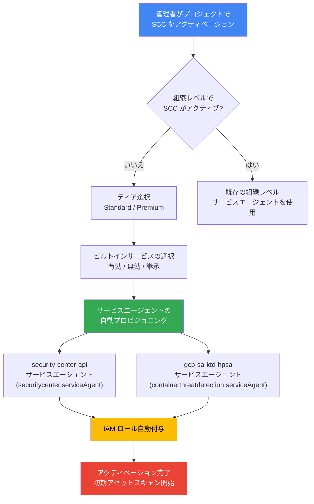

# Security Command Center: プロジェクト単位のアクティベーション時にサービスとサービスエージェントが自動プロビジョニング

**リリース日**: 2026-04-15

**サービス**: Security Command Center

**機能**: プロジェクト単位アクティベーション時のサービス自動有効化とサービスエージェント自動プロビジョニング

**ステータス**: Change

[このアップデートのインフォグラフィックを見る](https://takech9203.github.io/google-cloud-news-summary/20260415-security-command-center-project-activation.html)

## 概要

Security Command Center (SCC) の Standard または Premium ティアをプロジェクト単位でアクティベーションする際、複数のサービスが自動的に有効化され、サービス固有のサービスエージェントが必要な IAM ロールと権限とともに自動的にプロビジョニングされるようになりました。この変更は、組織レベルで Security Command Center がアクティブでない場合にプロジェクト単位でアクティベーションを行うシナリオに適用されます。

これにより、管理者はアクティベーションプロセス中にサービスエージェントの設定を手動で行う手間が軽減され、Security Command Center の導入がより迅速かつ確実に行えるようになります。セキュリティチームやプロジェクト管理者が個別プロジェクトのセキュリティ監視を開始する際の障壁が下がり、設定ミスによるセキュリティギャップのリスクも低減されます。

**アップデート前の課題**

- プロジェクト単位で SCC をアクティベーションする際、サービスエージェントの IAM ロール付与を手動で実施する必要があった
- サービスエージェントの設定漏れにより、SCC の検出サービスが正常に機能しないリスクがあった
- 複数のサービスエージェントに対して個別にロールを付与する作業は煩雑で、誤設定の原因となっていた

**アップデート後の改善**

- プロジェクト単位のアクティベーション時にサービスとサービスエージェントが自動的にプロビジョニングされるようになった
- 必要な IAM ロールと権限が自動的に付与されるため、設定漏れのリスクが低減された
- アクティベーションプロセスが簡素化され、セキュリティ監視の開始までの時間が短縮された

## アーキテクチャ図



Security Command Center のプロジェクト単位アクティベーションフロー。組織レベルで SCC がアクティブでない場合、ティア選択後にサービスエージェントが自動的にプロビジョニングされ、必要な IAM ロールが付与されます。

## サービスアップデートの詳細

### 主要機能

1. **サービスエージェントの自動プロビジョニング**
   - プロジェクト単位でアクティベーションすると、以下のサービスエージェントが自動的に作成されます
   - `service-project-PROJECT_NUMBER@security-center-api.iam.gserviceaccount.com` : SCC 本体のサービスエージェント
   - `service-project-PROJECT_NUMBER@gcp-sa-ktd-hpsa.iam.gserviceaccount.com` : Container Threat Detection のサービスエージェント

2. **IAM ロールの自動付与**
   - SCC サービスエージェントには `roles/securitycenter.serviceAgent` ロールが自動付与
   - Container Threat Detection サービスエージェントには `roles/containerthreatdetection.serviceAgent` ロールが自動付与
   - 手動での gcloud CLI による付与も引き続きサポート

3. **ビルトインサービスの選択と有効化**
   - アクティベーションプロセス中に各ビルトインサービスの有効/無効/継承を選択可能
   - Container Threat Detection を有効にすると GKE クラスタに DaemonSet が自動デプロイされる
   - アクティベーション完了後、自動的に初期アセットスキャンが開始

## 技術仕様

### サービスエージェント一覧

| サービスエージェント | IAM ロール | 用途 |
|------|------|------|
| `service-project-PROJECT_NUMBER@security-center-api.iam.gserviceaccount.com` | `roles/securitycenter.serviceAgent` | SCC のコア機能の実行 |
| `service-project-PROJECT_NUMBER@gcp-sa-ktd-hpsa.iam.gserviceaccount.com` | `roles/containerthreatdetection.serviceAgent` | Container Threat Detection の実行 |

### 組織レベルのアクティベーションとの違い

| 項目 | プロジェクトレベル | 組織レベル |
|------|------|------|
| サービスエージェントのプレフィックス | `service-project-PROJECT_NUMBER` | `service-org-ORGANIZATION_ID` |
| Enterprise ティア | 利用不可 | 利用可能 |
| データレジデンシー | 非サポート | サポート |
| 攻撃パスシミュレーション | 利用不可 | 利用可能 (Premium) |
| セキュリティポスチャ管理 | 利用不可 | 利用可能 (Premium) |

### ロール付与のコマンド例 (手動実行の場合)

```bash
# SCC サービスエージェントへのロール付与
gcloud projects add-iam-policy-binding PROJECT_ID \
  --member="serviceAccount:service-project-PROJECT_NUMBER@security-center-api.iam.gserviceaccount.com" \
  --role="roles/securitycenter.serviceAgent"

# Container Threat Detection サービスエージェントへのロール付与
gcloud projects add-iam-policy-binding PROJECT_ID \
  --member="serviceAccount:service-project-PROJECT_NUMBER@gcp-sa-ktd-hpsa.iam.gserviceaccount.com" \
  --role="roles/containerthreatdetection.serviceAgent"
```

## 設定方法

### 前提条件

1. プロジェクトが Google Cloud 組織に関連付けられていること
2. ユーザーアカウントに `roles/iam.securityAdmin` および `roles/securitycenter.admin` の IAM ロールが付与されていること
3. 組織ポリシーでドメイン制限が設定されている場合、ユーザーとサービスアカウントが許可されたドメインに属していること
4. Container Threat Detection を使用する場合、GKE クラスタがサポートされたバージョンであること

### 手順

#### ステップ 1: ティアの選択

Google Cloud コンソールで Security Command Center を開き、対象プロジェクトを選択します。「Get Security Command Center」ページが表示されたら、Standard または Premium ティアを選択して「Next」をクリックします。

#### ステップ 2: サービスの選択

Select services ページで、各ビルトインサービスの有効/無効/継承を設定します。

```
Inherit  - 親リソースの設定を継承
Enable   - サービスを有効化
Disable  - サービスを無効化
```

#### ステップ 3: サービスエージェントの構成

Grant roles ページで「Grant roles」をクリックすると、必要な IAM ロールがサービスエージェントに自動的に付与されます。

#### ステップ 4: アクティベーションの確認

Complete setup ページで「Finish」をクリックしてアクティベーションを完了します。初期アセットスキャンが自動的に開始されます。

## メリット

### ビジネス面

- **導入の迅速化**: サービスエージェントの自動プロビジョニングにより、SCC の導入に要する時間と工数が削減される
- **コンプライアンス対応の促進**: プロジェクト単位でのセキュリティ監視をすぐに開始でき、コンプライアンス要件への対応が迅速化される

### 技術面

- **設定ミスの防止**: 自動プロビジョニングにより、サービスエージェントの設定漏れや権限の不足を防止できる
- **運用負荷の軽減**: 手動での IAM ロール設定が不要になり、インフラ管理者の運用負荷が軽減される

## デメリット・制約事項

### 制限事項

- プロジェクトレベルのアクティベーションでは、Enterprise ティアは利用不可 (組織レベルのアクティベーションが必要)
- プロジェクト外のログやデータへのアクセスが必要なサービスや検出カテゴリは利用できない
- データレジデンシーはプロジェクトレベルのアクティベーションではサポートされない
- 攻撃パスシミュレーション、セキュリティポスチャ管理などの一部 Premium 機能はプロジェクトレベルでは利用不可

### 考慮すべき点

- Container Threat Detection を有効にすると GKE クラスタにリソースが追加されるため、クラスタの容量を事前に確認すること
- プロジェクトレベルの Premium ティアを最適に活用するには、組織レベルで Standard ティアをアクティベーションすることが推奨される
- VPC Service Controls のサービス境界を使用している場合、サービスエージェントへのインバウンドアクセスの許可が別途必要

## ユースケース

### ユースケース 1: 新規プロジェクトのセキュリティ監視開始

**シナリオ**: 組織で SCC を使用していない状態で、特定のプロジェクトに対してセキュリティ監視を迅速に開始したい場合。Google Cloud コンソールから対象プロジェクトの SCC をアクティベーションすると、サービスエージェントが自動プロビジョニングされ、すぐにセキュリティスキャンが開始される。

**効果**: 手動設定を最小限に抑え、数分でセキュリティ監視体制を構築できる。

### ユースケース 2: マルチプロジェクト環境での段階的導入

**シナリオ**: 複数プロジェクトを運用しており、まず重要度の高いプロジェクトから SCC Premium を導入したい場合。組織レベルで Standard ティアをアクティベーションし、特定プロジェクトに Premium ティアをアクティベーションすることで、段階的にセキュリティ強化を進められる。

**効果**: コストを抑えながら優先度の高いプロジェクトから高度なセキュリティ機能を利用でき、自動プロビジョニングにより導入作業が効率化される。

## 料金

Security Command Center の料金はティアによって異なります。

| ティア | 料金 |
|--------|------|
| Standard | 無料 |
| Premium (従量課金) | プロジェクト内の Google Cloud リソース使用量に基づく |
| Premium (サブスクリプション) | 年間契約に基づく固定料金 |

詳細な料金は [Security Command Center の料金ページ](https://cloud.google.com/security-command-center/pricing) を参照してください。

## 関連サービス・機能

- **Container Threat Detection**: GKE クラスタのランタイム脅威を検出するサービス。SCC アクティベーション時にサービスエージェントが自動プロビジョニングされる
- **Security Health Analytics**: Google Cloud リソースの脆弱性と設定ミスを自動検出するマネージドサービス
- **Event Threat Detection**: Cloud Logging のログを分析して脅威を検出するサービス (一部の検出カテゴリはプロジェクトレベルでは利用不可)
- **IAM**: サービスエージェントへのロール付与に使用されるアクセス管理サービス

## 参考リンク

- [インフォグラフィック](https://takech9203.github.io/google-cloud-news-summary/20260415-security-command-center-project-activation.html)
- [公式リリースノート](https://docs.cloud.google.com/release-notes#April_15_2026)
- [プロジェクト単位のアクティベーション手順](https://docs.cloud.google.com/security-command-center/docs/activate-scc-for-a-project)
- [アクティベーションの概要](https://docs.cloud.google.com/security-command-center/docs/activate-scc-overview)
- [プロジェクトレベルの制限事項](https://docs.cloud.google.com/security-command-center/docs/activate-scc-project-level-limitations)
- [サービスティア一覧](https://docs.cloud.google.com/security-command-center/docs/service-tiers)
- [プロジェクトレベルのアクセス制御](https://docs.cloud.google.com/security-command-center/docs/access-control-project)
- [料金ページ](https://cloud.google.com/security-command-center/pricing)

## まとめ

今回のアップデートにより、Security Command Center の Standard または Premium ティアをプロジェクト単位でアクティベーションする際に、サービスエージェントと必要な IAM ロールが自動的にプロビジョニングされるようになりました。これにより、セキュリティ監視の導入が大幅に簡素化され、設定ミスのリスクも低減されます。プロジェクト単位でのセキュリティ強化を検討している管理者は、公式ドキュメントでプロジェクトレベルの制限事項を確認した上で、アクティベーションを実施することを推奨します。

---

**タグ**: #SecurityCommandCenter #SCC #ProjectActivation #ServiceAgents #IAM
