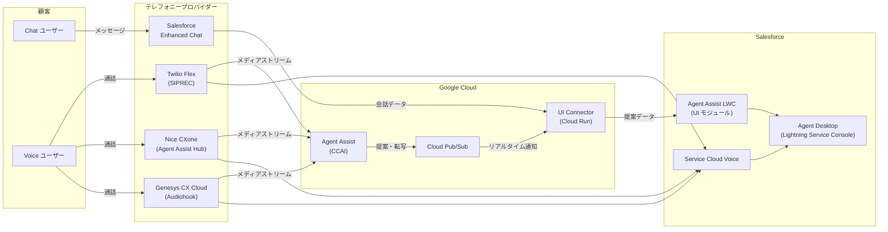

# Agent Assist (Contact Center AI): Salesforce UI モジュール統合の拡充

**リリース日**: 2026-04-16

**サービス**: Agent Assist (Contact Center AI)

**機能**: Salesforce UI モジュール統合 (Chat / Voice with Twilio Flex / Voice with Nice CXone / Voice with Genesys CX Cloud)

**ステータス**: Feature

[このアップデートのインフォグラフィックを見る](https://takech9203.github.io/google-cloud-news-summary/20260416-agent-assist-salesforce-integrations.html)

## 概要

Agent Assist が Salesforce との UI モジュール統合を大幅に拡充し、Chat、Voice with Twilio Flex、Voice with Nice CXone、Voice with Genesys CX Cloud の 4 つのインテグレーションパスを提供するようになりました。これにより、Salesforce を利用するコンタクトセンターのオペレーターは、既存のテレフォニープロバイダーを問わず、Agent Assist の AI 支援機能をネイティブに利用できるようになります。

Agent Assist の UI モジュールは Salesforce Lightning Web Component (LWC) として実装されており、Salesforce Agent Desktop 内にリアルタイムのナレッジアシスト、スマートリプライ、会話要約、センチメント分析などの AI 支援機能を直接埋め込むことが可能です。今回のアップデートにより、Chat チャネルに加えて主要な 3 つの Voice テレフォニープロバイダーとの統合が正式にサポートされ、音声通話においても Agent Assist の提案をリアルタイムで受け取れるようになりました。

本アップデートは、Salesforce Service Cloud を利用してカスタマーサポートを提供する大規模コンタクトセンター、特に複数のテレフォニープロバイダーを使い分けている企業にとって重要な機能強化です。

**アップデート前の課題**

- Salesforce との統合は段階的に提供されており、すべてのチャネルとテレフォニープロバイダーの組み合わせが一括でサポートされていなかった
- Voice チャネルでの Agent Assist 利用には、テレフォニープロバイダーごとに個別の統合構成が必要で、サポート状況が限定的だった
- Salesforce 上でチャットと音声の両方で一貫した AI 支援体験を提供することが困難だった

**アップデート後の改善**

- Chat と Voice (Twilio Flex / Nice CXone / Genesys CX Cloud) の 4 つの統合パスが正式にサポートされた
- テレフォニープロバイダーを問わず、Salesforce Agent Desktop 内で統一的な Agent Assist 体験を提供可能になった
- Skillset ベースのルーティングにより、エージェントの役割に応じた会話プロファイルの動的切り替えが可能になった

## アーキテクチャ図



Salesforce Agent Desktop 内の Agent Assist LWC が、UI Connector と Cloud Pub/Sub を経由して Agent Assist のリアルタイム提案を受け取ります。Voice チャネルでは各テレフォニープロバイダーがメディアストリームを Agent Assist に転送し、Chat チャネルでは Salesforce Enhanced Chat 経由で会話データが処理されます。

## サービスアップデートの詳細

### 主要機能

1. **Salesforce Chat 統合**
   - Salesforce Enhanced Chat を使用したメッセージングチャネルとの統合
   - Salesforce Agent Desktop 内で Agent Assist の提案をリアルタイムに表示
   - Embedded Service Deployment によるウェブサイト/モバイルアプリからのチャットウィジェット対応
   - Omni-Channel キューを利用した自動ルーティング

2. **Voice with Twilio Flex 統合**
   - Twilio Flex と Salesforce Service Cloud Voice (SCV) の連携
   - SIPREC コネクタアドオンを使用したメディアストリームの Agent Assist への転送
   - Twilio Studio によるコールフローの構成 (HTTP リクエスト、Fork Stream、Send to Flex)
   - Google Telephony Platform (GTP) を通じた通話メディアのリアルタイム解析

3. **Voice with Nice CXone 統合**
   - Nice CXone Agent Assist Hub を通じたメディアストリームの Agent Assist への転送
   - NiCE CXone Studio によるプログラマティックなコールフローの設定
   - NiCE CXone Agent for Service Cloud Voice (BYOT) による Salesforce 内での通話受信
   - インバウンド・アウトバウンド両方の通話に対応

4. **Voice with Genesys CX Cloud 統合**
   - Genesys Cloud Audiohook を使用したリアルタイム音声ストリーミング
   - CX Cloud from Genesys for Salesforce パッケージによる Salesforce との連携
   - OAuth アプリケーションによるセキュアな認証とデータアクセス
   - Audiohook Monitor による双方向の音声チャネルキャプチャ

5. **共通機能: Skillset ベースのルーティング**
   - Skillset により会話プロファイル、UI Connector エンドポイント、UI モジュール設定を一元管理
   - カスタムパーミッションとパーミッションセットを活用したエージェントごとの Skillset 割り当て
   - デフォルト Skillset のフォールバック機能

## 技術仕様

### サポートされる Agent Assist 機能

| 機能 | Chat | Voice |
|------|------|-------|
| ナレッジアシスト | 対応 | 対応 |
| (プロアクティブ) 生成ナレッジアシスト | 対応 | 対応 |
| スマートリプライ | 対応 | - |
| 会話要約 (カスタムセクション) | 対応 | 対応 |
| センチメント分析 | 対応 | 対応 |
| リアルタイム通話転写 | - | 対応 |
| スペル・文法修正 | 対応 (Preview) | - |

### 統合パスの比較

| 項目 | Chat | Voice (Twilio Flex) | Voice (Nice CXone) | Voice (Genesys CX Cloud) |
|------|------|---------------------|---------------------|--------------------------|
| メディア転送方式 | Salesforce API | SIPREC | Agent Assist Hub | Audiohook |
| SCV 連携 | 不要 | 必要 (Partner Telephony) | 必要 (BYOT) | 必要 |
| コールフロー構成 | Salesforce Messaging | Twilio Studio | NiCE CXone Studio | Genesys Architect |
| 追加ライセンス | Salesforce Messaging | Twilio Flex | NiCE CXone + Agent Assist Hub | Genesys CX Cloud |

### UI モジュールのバージョン

```
Container: v1.16
Legacy Container: v2.5
Common: v1.13
Generative knowledge assist: v2.10
Smart reply: v1.4
Summarization: v1.3
Transcript: v1.4
```

## 設定方法

### 前提条件

1. Google Cloud プロジェクトで Agent Assist (Dialogflow) API が有効化されていること
2. Agent Assist の会話プロファイルが作成済みであること
3. Salesforce インスタンスで Agent Assist for Salesforce アプリがインストール済みであること
4. 各テレフォニープロバイダーのアカウントとライセンスが準備されていること

### 手順

#### ステップ 1: Salesforce 共通設定

Salesforce 側での基本設定として、CORS の有効化、リモートサイト設定、信頼済み URL の登録、外部クライアントアプリの作成を行います。

1. Salesforce Setup で CORS for OAuth endpoints を有効化
2. リモートサイト設定にドメインを追加
3. Agent Assist Settings アプリで信頼済み URL を登録
4. External Client App を作成し、OAuth を有効化
5. Client Credentials Flow を有効化し、Consumer Key / Secret を取得

#### ステップ 2: UI Connector のデプロイ

```bash
# UI Connector を Cloud Run にデプロイ
gcloud run deploy ui-connector \
  --source=./ui-connector \
  --region=us-central1 \
  --allow-unauthenticated
```

UI Connector は Agent Assist のバックエンドと Salesforce UI モジュール間の通信を仲介する Cloud Run サービスです。

#### ステップ 3: Skillset の構成

Agent Assist Settings アプリで Skillset を作成し、会話プロファイルパス、UI Connector エンドポイント、使用する機能を設定します。

#### ステップ 4: チャネル固有の設定

各チャネルに応じた追加設定を行います。

- **Chat**: Enhanced Chat の有効化、メッセージングチャネルの作成、Embedded Service Deployment の公開
- **Twilio Flex**: SIPREC Connector のインストール、Twilio Studio フローの構成、SCV の設定
- **Nice CXone**: CXone Studio でのコールフロー構成、Agent Assist Hub の設定、SCV (BYOT) のインストール
- **Genesys CX Cloud**: Audiohook Monitor の作成、OAuth アプリの設定、CX Cloud for Salesforce のインストール

## メリット

### ビジネス面

- **マルチベンダー対応**: Twilio、Nice、Genesys といった主要テレフォニープロバイダーをカバーし、既存のコンタクトセンター基盤を変更することなく AI 支援機能を導入可能
- **オペレーター生産性の向上**: リアルタイムのナレッジサジェスト、スマートリプライ、会話要約により、通話あたりの対応時間を短縮し、初回解決率を改善
- **統一されたエージェント体験**: Chat と Voice の両チャネルで一貫した Agent Assist 体験を Salesforce Agent Desktop 内に提供

### 技術面

- **LWC ベースの統合**: Salesforce Lightning Web Component として実装されており、Salesforce のネイティブフレームワーク内で動作するためカスタマイズ性が高い
- **Skillset ベースのルーティング**: パーミッションセットと連動した動的な Skillset 割り当てにより、エージェントの役割に応じた最適な AI 支援を提供
- **リアルタイム処理**: Cloud Pub/Sub を活用した低レイテンシのイベント駆動型アーキテクチャ

## デメリット・制約事項

### 制限事項

- 各テレフォニープロバイダーの追加ライセンス (Twilio Flex、NiCE CXone Agent Assist Hub アドオン、Genesys CX Cloud) が別途必要
- Voice 統合には Salesforce Service Cloud Voice (SCV) ライセンスが必要
- UI モジュールの利用には Cloud Pub/Sub、Memorystore for Redis、Cloud Run などの追加 Google Cloud サービスの料金が発生する

### 考慮すべき点

- テレフォニープロバイダーごとに設定手順が大きく異なるため、導入計画の策定と検証に十分な時間を確保する必要がある
- Salesforce と Google Cloud の両方に精通したエンジニアが導入に必要
- 音声メディアストリームの転送方式 (SIPREC、Audiohook、Agent Assist Hub) はプロバイダーにより異なり、ネットワーク要件も異なる

## ユースケース

### ユースケース 1: 大規模コンタクトセンターでの AI 支援導入

**シナリオ**: Salesforce Service Cloud を利用する大規模コンタクトセンターで、Twilio Flex を使った音声通話チャネルに Agent Assist を導入する。

**実装例**:
```
1. Google Cloud で会話プロファイルを作成 (ナレッジアシスト + 会話要約を有効化)
2. UI Connector を Cloud Run にデプロイ
3. Twilio Flex に SIPREC Connector をインストールし、GTP 電話番号を設定
4. Twilio Studio でコールフローを構成 (HTTP Request -> Fork Stream -> Send to Flex)
5. Salesforce で Agent Assist LWC を Voice Call Record Page に配置
6. Skillset を作成し、会話プロファイルと UI Connector エンドポイントを紐付け
```

**効果**: オペレーターが通話中にリアルタイムでナレッジ記事の提案を受け取り、通話終了後に自動生成された要約を CRM に保存できる。対応時間の短縮と記録品質の向上が期待される。

### ユースケース 2: マルチチャネル対応のカスタマーサポート

**シナリオ**: Chat と Voice の両チャネルで顧客サポートを提供する企業が、すべてのチャネルで統一された AI 支援を導入する。

**効果**: Chat では Enhanced Chat 経由でスマートリプライとナレッジアシスト、Voice では各テレフォニープロバイダー経由でリアルタイム転写とナレッジアシストを提供。エージェントはチャネルを問わず同一の Salesforce Agent Desktop 内で AI 支援を受けられ、トレーニングコストの削減とサービス品質の均質化が実現される。

## 料金

Agent Assist の Salesforce 統合では、以下の複数サービスの料金が発生します。

### 関連サービスの料金

| サービス | 料金参照先 |
|---------|-----------|
| Agent Assist (CCAI) | [Agent Assist 料金ページ](https://cloud.google.com/agent-assist/pricing) |
| Cloud Pub/Sub | [Pub/Sub 料金ページ](https://cloud.google.com/pubsub/pricing) |
| Memorystore for Redis | [Memorystore 料金ページ](https://cloud.google.com/memorystore/docs/redis/pricing) |
| Cloud Run | [Cloud Run 料金ページ](https://cloud.google.com/run/pricing) |

各テレフォニープロバイダー (Twilio、Nice CXone、Genesys) の料金は、各プロバイダーの料金体系に従います。Salesforce Service Cloud Voice のライセンスも別途必要です。

## 利用可能リージョン

Agent Assist は複数のリージョンで利用可能です。Summarization with custom sections、Generative Knowledge Assist、Proactive Generative Knowledge Assist は以下のリージョンを含む幅広いリージョンで提供されています:

- us-central1 (アイオワ)
- us-east1 (サウスカロライナ)
- europe-west1 (ベルギー)
- europe-west2 (ロンドン)
- europe-west4 (エームスハーヴェン)
- asia-northeast1 (東京)
- northamerica-northeast1 (モントリオール)
- その他

詳細は [Agent Assist リージョン](https://docs.cloud.google.com/agent-assist/docs/regionalization) を参照してください。

## 関連サービス・機能

- **Dialogflow CX**: Agent Assist のバックエンドとして会話の分析と提案生成を担当
- **Cloud Pub/Sub**: リアルタイムの提案通知をUI Connector に配信
- **Cloud Run**: UI Connector のホスティング基盤
- **Memorystore for Redis**: UI Connector のセッション管理
- **Contact Center AI Platform (CCAI Platform)**: Google Cloud のフルマネージドコンタクトセンターソリューション。Agent Assist はその中核機能の一つ
- **Vertex AI**: Build Your Own Assist (BYOA) 機能で Vertex LLM エクステンションを活用可能

## 参考リンク

- [インフォグラフィック](https://takech9203.github.io/google-cloud-news-summary/20260416-agent-assist-salesforce-integrations.html)
- [公式リリースノート](https://cloud.google.com/release-notes#April_16_2026)
- [Agent Assist Salesforce 統合概要](https://docs.cloud.google.com/agent-assist/docs/salesforce)
- [Salesforce 統合セットアップガイド](https://docs.cloud.google.com/agent-assist/docs/salesforce-setup)
- [Salesforce Chat 統合](https://docs.cloud.google.com/agent-assist/docs/salesforce-chat)
- [Salesforce Voice with Twilio Flex](https://docs.cloud.google.com/agent-assist/docs/salesforce-voice-twilio)
- [Salesforce Voice with NiCE CXone](https://docs.cloud.google.com/agent-assist/docs/salesforce-voice-nice)
- [Salesforce Voice with Genesys CX Cloud](https://docs.cloud.google.com/agent-assist/docs/salesforce-voice-genesys)
- [UI モジュールドキュメント](https://docs.cloud.google.com/agent-assist/docs/ui-modules)
- [Agent Assist 料金ページ](https://cloud.google.com/agent-assist/pricing)

## まとめ

Agent Assist の Salesforce UI モジュール統合が Chat および主要 3 つの Voice テレフォニープロバイダー (Twilio Flex、Nice CXone、Genesys CX Cloud) に拡大され、Salesforce を基盤とするコンタクトセンターにおいて包括的な AI 支援が実現可能になりました。既存のテレフォニー基盤を維持しながら Agent Assist を導入できるため、Salesforce Service Cloud を利用する企業は自社のテレフォニープロバイダーに応じた統合パスを選択し、段階的な AI 支援の導入を検討することを推奨します。

---

**タグ**: #AgentAssist #ContactCenterAI #Salesforce #TwilioFlex #NiceCXone #GenesysCXCloud #UIModules #コンタクトセンター #CCAI
