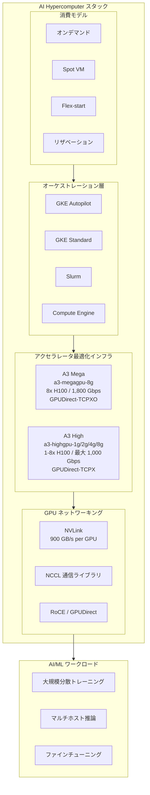

# AI Hypercomputer: A3 Mega / A3 High マシンタイプのドキュメント正式対応 (GA)

**リリース日**: 2026-04-16

**サービス**: AI Hypercomputer

**機能**: A3 Mega および A3 High マシンタイプのドキュメント統合・正式サポート

**ステータス**: Generally Available (GA)

[このアップデートのインフォグラフィックを見る](https://takech9203.github.io/google-cloud-news-summary/20260416-ai-hypercomputer-a3-mega-high-ga.html)

## 概要

Google Cloud は、AI Hypercomputer のドキュメントにおいて A3 Mega および A3 High マシンタイプの包括的なサポートを正式に追加しました。これにより、大規模 AI モデルのトレーニングおよびサービングに利用可能なコンピューティングオプションが拡充され、Google Kubernetes Engine (GKE) と Compute Engine の両方で統一されたガイダンスが提供されます。

A3 Mega と A3 High はいずれも NVIDIA H100 SXM GPU を搭載したアクセラレータ最適化マシンタイプです。A3 Mega は大規模モデルのトレーニングとマルチホスト推論に最適化されており、最大 1,800 Gbps のネットワーク帯域幅と GPUDirect-TCPXO による高スループット通信を実現します。一方、A3 High は大規模モデルの推論やファインチューニングに適しており、1 GPU から 8 GPU まで柔軟な構成が可能です。

今回のアップデートでは、VM の作成方法、一括作成、GKE Autopilot / Standard クラスタの構築、NCCL テストの実行手順など、5 つの新規ドキュメントページが追加されています。これは AI/ML ワークロードを大規模に運用するプラットフォームエンジニア、ML エンジニア、データサイエンティストにとって重要なアップデートです。

**アップデート前の課題**

- AI Hypercomputer ドキュメント内に A3 Mega / A3 High に特化した作成・管理ガイドが存在せず、Compute Engine の一般的な GPU ドキュメントを参照する必要があった
- GKE 上で A3 Mega / A3 High クラスタを構築する際のベストプラクティスが体系化されていなかった
- NCCL テストの実行手順が A3 Mega / A3 High 向けに最適化されておらず、GPUDirect-TCPXO や GPUDirect-TCPX の設定が複雑だった
- AI Hypercomputer スタック全体での A3 Mega / A3 High の位置づけやデプロイ戦略の統一的な情報源がなかった

**アップデート後の改善**

- AI Hypercomputer ドキュメント内に A3 Mega / A3 High 専用のページが 5 つ追加され、統一的なガイダンスが利用可能になった
- GKE Autopilot および GKE Standard の両方で A3 Mega / A3 High クラスタを作成するための手順が体系化された
- NCCL テストのマニフェストや設定例が A3 Mega / A3 High それぞれに最適化された形で提供されるようになった
- VM の単体作成から一括作成まで、さまざまなデプロイパターンに対応するドキュメントが整備された

## アーキテクチャ図



AI Hypercomputer スタック内での A3 Mega / A3 High の位置づけを示す図です。消費モデルの選択からオーケストレーション層、ハードウェア、ネットワーキングを経て AI/ML ワークロードに接続されます。

## サービスアップデートの詳細

### 新規追加ドキュメント

1. **A3 High / A3 Mega で AI 最適化インスタンスを作成**
   - スタンドアロン VM インスタンスの作成手順を網羅
   - 消費モデル (オンデマンド、Spot、Flex-start、リザベーション) ごとの作成パラメータを解説
   - ネットワーク構成 (gVNIC を使用した複数 NIC 設定) の詳細ガイド

2. **A3 High / A3 Mega で AI 最適化インスタンスを一括作成**
   - 大規模クラスタ向けの一括 VM プロビジョニング手順
   - マネージドインスタンスグループ (MIG) での展開方法

3. **A3 Mega / A3 High を使用する GKE Autopilot クラスタの作成**
   - GKE Autopilot モードでのアクセラレータ最適化クラスタ構築
   - ノードの自動プロビジョニングとスケーリングの設定

4. **A3 Mega / A3 High を使用する GKE Standard クラスタの作成**
   - GKE Standard モードでのカスタムクラスタ構築
   - Cluster Toolkit、XPK、手動作成の 3 つのアプローチを提供
   - Topology Aware Scheduling (TAS) による最適なワークロード配置

5. **A3 Mega / A3 High を使用するカスタム GKE クラスタで NCCL テストを実行**
   - NVIDIA Collective Communications Library (NCCL) のベンチマークテスト手順
   - A3 Mega 向け GPUDirect-TCPXO と A3 High 向け GPUDirect-TCPX のそれぞれの設定
   - JobSet と Kueue (TAS 対応) を使用したテストワークロードのデプロイ

### クラスタ管理に関する注意事項

2025 年 10 月 1 日より前に作成された A3 Mega または A3 High VM については、クラスタ管理機能がサポートされません。これらの VM でクラスタ管理機能を利用するには、新しいインスタンスの作成が必要です。

## 技術仕様

### A3 Mega と A3 High の比較

| 項目 | A3 Mega (a3-megagpu-8g) | A3 High (a3-highgpu-8g) | A3 High (a3-highgpu-4g) | A3 High (a3-highgpu-2g) | A3 High (a3-highgpu-1g) |
|------|------------------------|------------------------|------------------------|------------------------|------------------------|
| GPU | NVIDIA H100 SXM (nvidia-h100-mega-80gb) | NVIDIA H100 SXM (nvidia-h100-80gb) | NVIDIA H100 SXM | NVIDIA H100 SXM | NVIDIA H100 SXM |
| GPU 数 | 8 | 8 | 4 | 2 | 1 |
| GPU メモリ (HBM3) | 640 GB | 640 GB | 320 GB | 160 GB | 80 GB |
| vCPU 数 | 208 | 208 | 104 | 52 | 26 |
| インスタンスメモリ | 1,872 GB | 1,872 GB | 936 GB | 468 GB | 234 GB |
| ローカル SSD | 6,000 GiB | 6,000 GiB | 3,000 GiB | 1,500 GiB | 750 GiB |
| 物理 NIC 数 | 9 | 5 | 1 | 1 | 1 |
| 最大ネットワーク帯域幅 | 1,800 Gbps | 1,000 Gbps | 100 Gbps | 50 Gbps | 25 Gbps |
| GPU 間通信 (GPUDirect) | GPUDirect-TCPXO | GPUDirect-TCPX | - | - | - |
| NVLink 帯域幅 (per GPU) | 900 GB/s | 900 GB/s | 900 GB/s | 900 GB/s | - |
| CPU プラットフォーム | Intel Sapphire Rapids | Intel Sapphire Rapids | Intel Sapphire Rapids | Intel Sapphire Rapids | Intel Sapphire Rapids |

### ネットワーキング技術の比較

| 技術 | 対象マシンタイプ | 特徴 |
|------|----------------|------|
| GPUDirect-TCPXO | A3 Mega | TCP プロトコルをオフロードし、A3 High / A3 Edge と比較して 2 倍のネットワーク帯域幅を実現 |
| GPUDirect-TCPX | A3 High (8g) | データパケットペイロードを GPU メモリからネットワークインターフェースに直接転送 |
| NVLink Full Mesh | A3 Mega / A3 High | 8 GPU 間の all-to-all トポロジで集約帯域幅最大 7.2 TB/s |

### NCCL ベンチマーク参考値 (2 ノードテスト)

| マシンタイプ | 平均バス帯域幅 |
|-------------|--------------|
| A3 Mega (a3-megagpu-8g) | 約 45.76 GB/s |
| A3 High (a3-highgpu-8g) | 約 29.83 GB/s |

## 設定方法

### 前提条件

1. Google Cloud プロジェクトが有効であること
2. Compute Engine API または GKE API が有効化されていること
3. 適切な IAM 権限 (Compute Admin、GKE Admin など) が付与されていること
4. GPU クォータが申請・承認されていること
5. VPC ネットワークが作成済みであること (A3 Mega: 9 NIC、A3 High 8g: 5 NIC 分のサブネットが必要)

### 手順

#### ステップ 1: A3 Mega / A3 High のスタンドアロン VM を作成する場合

```bash
# A3 Mega VM の作成例 (gcloud CLI)
gcloud compute instances create my-a3-mega-vm \
    --zone=us-central1-a \
    --machine-type=a3-megagpu-8g \
    --image-family=common-cu126-debian-12 \
    --image-project=ml-images \
    --boot-disk-size=200GB \
    --boot-disk-type=hyperdisk-balanced \
    --network-interface=network=default,subnet=default \
    --network-interface=network=gpu-net-1,subnet=gpu-sub-1,no-address \
    --network-interface=network=gpu-net-2,subnet=gpu-sub-2,no-address \
    --network-interface=network=gpu-net-3,subnet=gpu-sub-3,no-address \
    --network-interface=network=gpu-net-4,subnet=gpu-sub-4,no-address \
    --network-interface=network=gpu-net-5,subnet=gpu-sub-5,no-address \
    --network-interface=network=gpu-net-6,subnet=gpu-sub-6,no-address \
    --network-interface=network=gpu-net-7,subnet=gpu-sub-7,no-address \
    --network-interface=network=gpu-net-8,subnet=gpu-sub-8,no-address \
    --maintenance-policy=TERMINATE \
    --restart-on-failure
```

各 NIC には gVNIC タイプが使用され、GPUDirect トラフィック用の専用ネットワークとして機能します。

#### ステップ 2: GKE Standard クラスタで A3 Mega を使用する場合

Cluster Toolkit を使用して GKE クラスタを迅速に作成できます。

```bash
# Cluster Toolkit のインストール (未インストールの場合)
git clone https://github.com/GoogleCloudPlatform/cluster-toolkit.git
cd cluster-toolkit && make

# A3 Mega GKE クラスタの作成
./gcluster create my-a3-mega-cluster.yaml \
    --vars project_id=MY_PROJECT_ID \
    --vars region=us-central1 \
    --vars zone=us-central1-a
```

手動で GKE Standard クラスタを作成する場合は、ノードプールに GPU アクセラレータを指定します。

#### ステップ 3: NCCL テストを実行して通信性能を検証

```bash
# JobSet と Kueue のインストール
kubectl apply --server-side -f https://github.com/kubernetes-sigs/kueue/releases/download/v0.16.5/manifests.yaml

# Kueue 設定の適用 (A3 Mega 用)
kubectl apply -f kueue-config.yaml

# NCCL テストジョブの適用
kubectl apply -f nccl-tas-jobset.yaml

# テストの実行
kubectl exec --stdin --tty --container=nccl-test \
    nccl-tas-test-worker-0-0 -- /configs/allgather.sh \
    nccl-tas-test-worker-0-0 nccl-tas-test-worker-1-0
```

NCCL テストにより、GPU 間通信の帯域幅とレイテンシを検証できます。

## メリット

### ビジネス面

- **統一ドキュメントによる導入コスト削減**: AI Hypercomputer スタック内に統合されたドキュメントにより、A3 Mega / A3 High の導入・運用に必要な情報取得のコストが大幅に低減される
- **柔軟なスケーリング**: A3 High の 1/2/4/8 GPU 構成と A3 Mega の 8 GPU 構成により、ワークロードの規模に応じた最適なリソース割り当てが可能
- **複数の消費モデル**: オンデマンド、Spot VM、Flex-start、リザベーションの中から、コスト最適化や可用性の要件に合わせて選択可能

### 技術面

- **高帯域幅 GPU 間通信**: A3 Mega の GPUDirect-TCPXO により、従来の A3 High と比較して 2 倍のノード間ネットワーク帯域幅を実現
- **GKE Autopilot / Standard の両対応**: マネージド型の Autopilot とカスタマイズ可能な Standard の両方で A3 Mega / A3 High が利用可能
- **Topology Aware Scheduling**: Kueue の TAS 機能により、ブロック・サブブロック・ホストレベルでの最適なワークロード配置を実現
- **NCCL テストによる性能検証**: デプロイ後すぐに GPU 間通信性能を検証できるテスト手順が提供されている

## デメリット・制約事項

### 制限事項

- 2025 年 10 月 1 日より前に作成された A3 Mega / A3 High VM ではクラスタ管理機能がサポートされない
- A3 Mega / A3 High マシンタイプでは持続使用割引 (SUD) およびフレキシブル CUD が適用されない
- マシンタイプの変更 (A3 Mega / A3 High と他のマシンタイプ間の切り替え) はサポートされない。変更には新規インスタンスの作成が必要
- Windows OS は A3 Mega / A3 High マシンタイプ上で実行できない
- リージョン永続ディスクは A3 Mega / A3 High インスタンスでは使用できない
- A3 Mega / A3 High は Intel Sapphire Rapids CPU プラットフォームでのみ利用可能
- A3 High の 1/2/4 GPU 構成 (a3-highgpu-1g/2g/4g) は Spot VM または Flex-start VM でのみプロビジョニング可能

### 考慮すべき点

- A3 Mega は 9 NIC (gVNIC) を必要とするため、事前に十分な VPC ネットワークとサブネットの準備が必要
- A3 High (8g) は 5 NIC を必要とし、GPUDirect-TCPX 用に 4 つの追加ネットワークインターフェースが必要
- A3 Ultra と A3 Mega / A3 High / A3 Edge 間ではネットワークトポロジが異なるため、ワークロードの移行は不可
- GPU クォータの申請が必要であり、特に大規模デプロイの場合はアカウントチームへの事前相談が推奨される

## ユースケース

### ユースケース 1: 大規模言語モデル (LLM) の分散トレーニング

**シナリオ**: 数十億パラメータの大規模言語モデルを複数ノードで分散トレーニングする必要がある場合。

**実装例**:
```yaml
# GKE Standard クラスタ上で A3 Mega を使用した分散トレーニングジョブ
apiVersion: batch/v1
kind: Job
metadata:
  name: llm-training-job
spec:
  parallelism: 4
  template:
    spec:
      nodeSelector:
        cloud.google.com/gke-accelerator: nvidia-h100-mega-80gb
      containers:
      - name: trainer
        image: my-training-image:latest
        resources:
          limits:
            nvidia.com/gpu: 8
            memory: "1800Gi"
          requests:
            nvidia.com/gpu: 8
            memory: "1800Gi"
```

**効果**: A3 Mega の GPUDirect-TCPXO と 1,800 Gbps ネットワーク帯域幅により、ノード間の集合通信 (AllReduce、AllGather 等) のスループットが最大化され、トレーニング時間の短縮と goodput の向上が期待できます。

### ユースケース 2: コスト効率の高い推論・ファインチューニング

**シナリオ**: 推論やファインチューニングのワークロードで、8 GPU フルセットは不要だが、H100 GPU の性能は必要な場合。

**実装例**:
```bash
# A3 High 2 GPU 構成で Spot VM を作成
gcloud compute instances create inference-vm \
    --zone=us-central1-a \
    --machine-type=a3-highgpu-2g \
    --provisioning-model=SPOT \
    --instance-termination-action=STOP \
    --image-family=common-cu126-debian-12 \
    --image-project=ml-images
```

**効果**: A3 High の柔軟な GPU 構成 (1/2/4/8 GPU) により、ワークロードに必要な最小限のリソースで H100 GPU を利用でき、Spot VM との組み合わせでコストを最大 60-91% 削減できます。

### ユースケース 3: GKE Autopilot での AI プラットフォーム構築

**シナリオ**: インフラ管理を最小化しつつ、マルチテナントの AI プラットフォームを構築したい場合。

**効果**: GKE Autopilot は A3 Mega / A3 High ノードの自動プロビジョニングとスケーリングを提供し、クラスタの運用負荷を大幅に軽減できます。プラットフォームチームはインフラ管理ではなくワークロードの最適化に集中できます。

## 料金

AI Hypercomputer のアクセラレータ最適化マシンタイプの料金は、接続された GPU、事前定義された vCPU、メモリ、およびバンドルされたローカル SSD に基づいて課金されます。具体的な料金は消費モデルによって異なります。

### 消費モデルごとの割引

| 消費モデル | 割引の適用 |
|-----------|----------|
| オンデマンド | 一部リソースに対して CUD が適用可能 (GPU とローカル SSD は CUD 対象外) |
| Spot VM | Spot VM 料金による自動割引 |
| Flex-start | Dynamic Workload Scheduler 料金による自動割引 |
| リザベーション | リソースベースの CUD が GPU とローカル SSD を含むすべてのリソースに適用可能 |

詳細な料金情報は [GPU pricing](https://cloud.google.com/compute/gpus-pricing) および [VM instance pricing (Accelerator-optimized)](https://docs.cloud.google.com/compute/vm-instance-pricing#accelerator-optimized) を参照してください。

## 利用可能リージョン

### A3 Mega の利用可能リージョン

| リージョン | ゾーン | 所在地 |
|----------|-------|-------|
| us-central1 | a, b, c | アイオワ州、米国 |
| us-east4 | a, b | バージニア州アッシュバーン、米国 |
| us-east5 | a | オハイオ州コロンバス、米国 |
| us-west1 | a, b | オレゴン州ダレス、米国 |
| us-west4 | a | ネバダ州ラスベガス、米国 |
| europe-west1 | b, c | ベルギー (限定提供含む) |
| europe-west4 | b, c | オランダ |
| asia-northeast1 | b | 東京、日本 |
| asia-southeast1 | b, c | シンガポール |
| australia-southeast1 | c | シドニー、オーストラリア (限定提供) |

### A3 High の利用可能リージョン

| リージョン | ゾーン | 所在地 |
|----------|-------|-------|
| us-central1 | a, b, c | アイオワ州、米国 |
| us-east4 | a, b, c | バージニア州アッシュバーン、米国 |
| us-east5 | a | オハイオ州コロンバス、米国 |
| us-west1 | a, b | オレゴン州ダレス、米国 |
| us-west4 | a | ネバダ州ラスベガス、米国 |
| europe-west1 | b, c | ベルギー (限定提供含む) |
| europe-west3 | c | フランクフルト、ドイツ |
| europe-west4 | b, c | オランダ |
| asia-southeast1 | b, c | シンガポール |

**注**: 一部のリージョン・ゾーンは限定提供であり、利用にはアカウントチームへの問い合わせが必要な場合があります。最新のリージョン情報は [GPU regions and zones](https://docs.cloud.google.com/compute/docs/gpus/gpu-regions-zones) を確認してください。

## 関連サービス・機能

- **[AI Hypercomputer](https://docs.cloud.google.com/ai-hypercomputer/docs/overview)**: パフォーマンス最適化ハードウェア、オープンソフトウェア、ML フレームワーク、柔軟な消費モデルを統合した AI/ML 向けスーパーコンピューティングシステム
- **[Google Kubernetes Engine (GKE)](https://docs.cloud.google.com/kubernetes-engine/docs/concepts/machine-learning)**: AI/ML ワークロードのデプロイ、管理、スケーリングを行うマネージド Kubernetes プラットフォーム
- **[Compute Engine](https://docs.cloud.google.com/compute/docs/gpus/overview)**: 個別の GPU VM やスモールクラスタの作成・管理を行うインフラストラクチャサービス
- **[Cluster Director](https://docs.cloud.google.com/cluster-director/docs/overview)**: 大規模なアクセラレータおよびネットワーキングリソースを単一ユニットとして展開・管理するツール
- **[NCCL (NVIDIA Collective Communications Library)](https://docs.cloud.google.com/ai-hypercomputer/docs/nccl/overview)**: GPU 間の集合通信を最適化するライブラリ
- **[A3 Ultra マシンタイプ](https://docs.cloud.google.com/compute/docs/accelerator-optimized-machines#a3-ultra-vms)**: NVIDIA H200 GPU 搭載の上位マシンタイプ (RoCE ベースのネットワーキング)

## 参考リンク

- [インフォグラフィック](https://takech9203.github.io/google-cloud-news-summary/20260416-ai-hypercomputer-a3-mega-high-ga.html)
- [公式リリースノート](https://docs.cloud.google.com/release-notes#April_16_2026)
- [A3 High / A3 Mega で AI 最適化インスタンスを作成](https://docs.cloud.google.com/ai-hypercomputer/docs/create/create-vm-a3-high-mega)
- [A3 High / A3 Mega で AI 最適化インスタンスを一括作成](https://docs.cloud.google.com/ai-hypercomputer/docs/create/create-vms-in-bulk-a3-high-mega)
- [GKE Autopilot クラスタの作成 (A3 Mega / A3 High)](https://docs.cloud.google.com/ai-hypercomputer/docs/create/gke-ai-hypercompute-autopilot-a3-high-mega)
- [GKE Standard クラスタの作成 (A3 Mega / A3 High)](https://docs.cloud.google.com/ai-hypercomputer/docs/create/gke-ai-hypercompute-standard-a3-high-mega)
- [NCCL テスト実行手順 (A3 Mega / A3 High)](https://docs.cloud.google.com/ai-hypercomputer/docs/nccl/test-gke-custom-a3-mega-high)
- [AI Hypercomputer 概要](https://docs.cloud.google.com/ai-hypercomputer/docs/overview)
- [アクセラレータ最適化マシンタイプ](https://docs.cloud.google.com/compute/docs/accelerator-optimized-machines)
- [GPU 料金](https://cloud.google.com/compute/gpus-pricing)
- [GPU リージョンとゾーン](https://docs.cloud.google.com/compute/docs/gpus/gpu-regions-zones)

## まとめ

今回の AI Hypercomputer ドキュメントへの A3 Mega / A3 High マシンタイプの正式統合により、NVIDIA H100 SXM GPU を活用した大規模 AI/ML ワークロードのデプロイ・管理がこれまで以上に体系的かつ容易になりました。A3 Mega の 1,800 Gbps 帯域幅と GPUDirect-TCPXO、A3 High の柔軟な 1-8 GPU 構成は、トレーニングから推論まで多様なワークロードに対応します。大規模 AI モデルの運用を検討している組織は、まず GKE Standard / Autopilot クラスタでの NCCL テストを実施し、自社ワークロードに最適なマシンタイプと消費モデルを評価することを推奨します。

---

**タグ**: #AI-Hypercomputer #A3-Mega #A3-High #NVIDIA-H100 #GPU #GKE #Compute-Engine #機械学習 #大規模AI #GA
