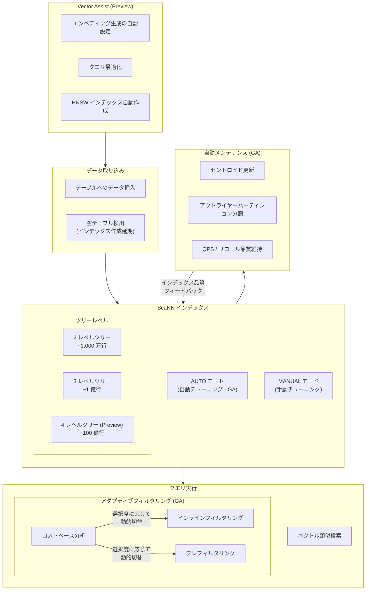

# AlloyDB for PostgreSQL: ベクトル検索と ScaNN の大規模改善 (Vector Assist / 4 レベルツリー / 自動チューニング / アダプティブフィルタリング GA)

**リリース日**: 2026-04-16

**サービス**: AlloyDB for PostgreSQL

**機能**: ベクトル検索と ScaNN インデックスの大規模改善 (Vector Assist Preview、4 レベルツリー、自動チューニングインデックス、アダプティブフィルタリング GA、自動メンテナンスインデックス)

**ステータス**: Preview + GA (複数機能)

[このアップデートのインフォグラフィックを見る](https://takech9203.github.io/google-cloud-news-summary/20260416-alloydb-vector-search-scann-improvements.html)

## 概要

AlloyDB for PostgreSQL において、ベクトル検索機能と ScaNN (Scalable Nearest Neighbors) インデックスに関する 6 つの主要な改善が一度にリリースされました。Preview として 3 機能、GA として 3 機能が発表されており、AlloyDB のベクトル検索エコシステムにとって過去最大級のアップデートとなります。

今回のアップデートの中核は「簡素化」と「スケーラビリティ」の 2 軸です。Preview として提供される Vector Assist は、エンベディング生成からクエリ最適化、インデックス作成までのワークフローを自動化し、ベクトル検索の導入障壁を大幅に下げます。また、4 レベルツリーインデックスにより最大 100 億行のベクトルデータに対応可能となり、エンタープライズ規模の AI ワークロードに対応します。

GA として提供されるアダプティブフィルタリング、自動チューニングインデックス、自動メンテナンスインデックスの 3 機能は、運用負荷の削減に直結します。これまで手動で行っていたインデックスのチューニングやメンテナンスが自動化され、コストベースの分析によるフィルタリング戦略の動的選択が本番ワークロードで利用可能になりました。対象ユーザーは、RAG (Retrieval-Augmented Generation)、セマンティック検索、レコメンデーションエンジンなど、ベクトル検索を活用する全ての開発者・データエンジニアです。

**アップデート前の課題**

- ベクトル検索のセットアップには、エンベディングモデルの選定、テーブル設計、インデックスパラメータのチューニングなど複数の手順を個別に行う必要があり、専門知識が求められた
- ScaNN インデックスは最大 3 レベルツリー (max_num_levels=2) までしか対応しておらず、1 億行を超える大規模データセットではパフォーマンスの限界があった
- インデックスのチューニング (num_leaves、quantizer、num_leaves_to_search など) は手動で最適値を探す必要があり、データ規模の変化に追従するのが困難だった
- フィルタリング戦略の選択 (インラインフィルタリングとプレフィルタリング) は静的で、クエリパターンに応じた動的な最適化ができなかった
- データセットの増加に伴うインデックスの品質劣化 (セントロイドの偏り、パーティションの肥大化) に対して手動での再構築が必要だった

**アップデート後の改善**

- Vector Assist により、ベクトル検索の初期セットアップが自動化され、プロダクションレディなベクトル検索環境を迅速に構築可能になった
- 4 レベルツリーインデックスにより、最大 100 億行のベクトルデータに対応し、超大規模 AI ワークロードをサポート可能になった
- AUTO モードでのインデックス作成により、チューニングパラメータの手動設定が不要になった
- アダプティブフィルタリングが GA となり、コストベースの分析でインラインフィルタリングとプレフィルタリングを動的に選択し、常に最適なパフォーマンスが得られるようになった
- 自動メンテナンスにより、データ増加に伴うセントロイドの更新やパーティションの分割が自動的に行われ、インデックスの品質が維持されるようになった
- 空テーブルや行数不足テーブルでの ScaNN インデックス作成が、十分なデータが蓄積されるまで延期されるようになり、不完全なインデックス構築を防止できるようになった

## アーキテクチャ図



この図は、今回のアップデートで強化された AlloyDB ベクトル検索パイプラインの全体像を示しています。Vector Assist によるセットアップの簡素化から、4 レベルツリーによるスケーラビリティ拡張、自動チューニング/自動メンテナンスによる運用の自動化、アダプティブフィルタリングによるクエリ最適化まで、エンドツーエンドでベクトル検索体験が改善されています。

## サービスアップデートの詳細

### Preview 機能

1. **Vector Assist**
   - ベクトルワークロードのデプロイと管理を簡素化する新機能
   - エンベディング生成、クエリ最適化、HNSW インデックス作成を含むプロダクションレディなベクトル検索のセットアップを支援
   - ベクトル検索を初めて導入するチームにとって、必要な専門知識のハードルを大幅に下げる

2. **4 レベルツリー ScaNN インデックス**
   - `alloydb_scann` エクステンションが 4 レベルツリーインデックスをサポート
   - 最大 100 億行のベクトルデータに対応可能
   - 従来の 3 レベルツリー (max_num_levels=2) では 1 億行程度が実用的な上限だったが、4 レベルツリー (max_num_levels=3) により 2 桁上のスケールを実現
   - K-means クラスタリングツリーの階層を深くすることで、大規模データセットでも効率的なパーティショニングを維持

3. **空テーブルでの遅延インデックス作成**
   - 空テーブルまたは行数不足のテーブルに対する ScaNN インデックス作成を、十分なデータが蓄積されるまで自動的に延期
   - データ不足の状態でインデックスを作成すると品質の低いインデックスが生成される問題を解消
   - データ投入フローとインデックス作成のタイミングを手動で調整する必要がなくなった

### GA 機能

4. **アダプティブフィルタリング (インラインフィルタリング → プレフィルタリング)**
   - コストベースの分析により、最も効率的なフィルタリング戦略を実行時に動的に選択
   - インラインフィルタリングからプレフィルタリングへの切替が GA に昇格
   - フィルタの選択度 (selectivity) をランタイムで学習し、クエリ実行計画を適応的に調整
   - 注意: プレフィルタリングからインラインフィルタリングへの切替は引き続き Preview

5. **ScaNN インデックスの自動チューニング**
   - 新しい ScaNN ベクトルインデックスのビルドがデフォルトで自動チューニングされるように変更
   - `mode='AUTO'` を指定するだけで、テーブル名、エンベディングカラム、距離関数の指定のみでインデックスを作成可能
   - 手動チューニングされた既存のインデックスも自動チューニングに変換可能
   - `num_leaves` などのパラメータを自分で設定する必要がなくなり、AlloyDB が最適な値を自動決定

6. **ScaNN インデックスの自動メンテナンス**
   - AlloyDB がインクリメンタルにインデックスを管理し、セントロイドの更新と大きなアウトライヤーパーティションの分割を自動実行
   - データセットの成長に伴う QPS や検索品質の劣化を自動的に防止
   - AUTO モードで作成されたインデックスではデフォルトで有効
   - 手動チューニングインデックスでも `auto_maintenance=on` を指定して有効化可能

## 技術仕様

### ScaNN インデックスのツリーレベル比較

| ツリーレベル | max_num_levels | 対応行数 | パーティション計算 | ユースケース |
|-------------|---------------|---------|-----------------|------------|
| 2 レベルツリー | 1 (デフォルト) | ~1,000 万行 | sqrt(ROWS) | 中小規模のベクトルデータセット |
| 3 レベルツリー | 2 | ~1 億行 | power(ROWS, 2/3) | 大規模データセット |
| 4 レベルツリー (Preview) | 3 | ~100 億行 | - | 超大規模エンタープライズ AI |

### アダプティブフィルタリングの動作

| フィルタリング方式 | 動作 | 最適なケース | ステータス |
|-----------------|------|------------|----------|
| インラインフィルタリング | ベクトル検索とフィルタ評価を並行実行。B-tree/GIN/GiST のセカンダリインデックスでビットマップを作成 | フィルタの選択度が中程度の場合 | GA |
| プレフィルタリング | フィルタ条件を先に適用し、候補を絞った後にベクトル検索を実行 | フィルタの選択度が高い場合 | GA (インライン→プレフィルタ方向) |
| アダプティブ切替 | コストベース分析で上記 2 つの戦略を動的に選択 | 多様なクエリパターンが混在する環境 | GA (インライン→プレフィルタ方向) |

### AUTO モードインデックス作成パラメータ

```sql
-- AUTO モードでの ScaNN インデックス作成 (自動チューニング)
CREATE INDEX my_scann_index ON items
  USING scann (embedding cosine)
  WITH (mode='AUTO');

-- 最適化オプションを指定する場合
CREATE INDEX my_scann_index ON items
  USING scann (embedding l2)
  WITH (mode='AUTO', optimization='SEARCH_OPTIMIZED');
-- optimization: SEARCH_OPTIMIZED (デフォルト) または BALANCED
```

## 設定方法

### 前提条件

1. AlloyDB for PostgreSQL のクラスタとプライマリインスタンスが作成済みであること
2. `vector` エクステンションと `alloydb_scann` エクステンションがインストール済みであること
3. Preview 機能を使用する場合は `alloydb.enable_preview_features` フラグを有効にすること

### 手順

#### ステップ 1: エクステンションのインストール

```sql
-- 必要なエクステンションをインストール
CREATE EXTENSION IF NOT EXISTS vector;
CREATE EXTENSION IF NOT EXISTS alloydb_scann;
CREATE EXTENSION IF NOT EXISTS google_ml_integration CASCADE;
```

AlloyDB Studio または psql クライアントから実行します。

#### ステップ 2: Preview 機能の有効化

```bash
# Preview 機能フラグの有効化 (4 レベルツリー、Vector Assist、遅延インデックス作成に必要)
gcloud alloydb instances update INSTANCE_ID \
  --database-flags alloydb.enable_preview_features=on \
  --region=REGION_ID \
  --cluster=CLUSTER_ID \
  --project=PROJECT_ID
```

Preview 機能を使用するために必要な設定です。

#### ステップ 3: 自動チューニングインデックスの作成 (GA)

```sql
-- AUTO モードで ScaNN インデックスを作成
-- num_leaves などのパラメータ指定は不要
CREATE INDEX my_auto_index ON products
  USING scann (embedding cosine)
  WITH (mode='AUTO');

-- インデックス作成後に ANALYZE を実行
ANALYZE products;
```

AUTO モードでは自動メンテナンスもデフォルトで有効になります。

#### ステップ 4: 4 レベルツリーインデックスの作成 (Preview)

```sql
-- 100 億行規模のテーブル向け 4 レベルツリーインデックス
CREATE INDEX my_4level_index ON large_embeddings
  USING scann (embedding l2)
  WITH (num_leaves=100000000, max_num_levels=3);

-- インデックス作成後に ANALYZE を実行
ANALYZE large_embeddings;
```

max_num_levels=3 を指定することで 4 レベルツリーが有効になります。

#### ステップ 5: 既存インデックスへの自動メンテナンス有効化

```sql
-- 手動チューニングインデックスに自動メンテナンスを有効化
CREATE INDEX my_maintained_index ON products
  USING scann (embedding cosine)
  WITH (mode=MANUAL, num_leaves=1000, auto_maintenance=on);
```

既存の手動チューニングインデックスでも auto_maintenance=on を指定して自動メンテナンスを利用できます。

## メリット

### ビジネス面

- **導入コストの大幅削減**: Vector Assist によりベクトル検索の専門知識がなくてもプロダクションレディな環境を構築可能。AI/ML プロジェクトの立ち上げ速度が向上
- **エンタープライズ規模の AI 対応**: 100 億行対応により、大規模な商品カタログ、ドキュメントリポジトリ、ユーザー行動データなどの超大規模データセットでのベクトル検索が実現
- **運用コストの最小化**: 自動チューニングと自動メンテナンスにより、DBA によるインデックス管理の工数を大幅に削減。データ増加に伴う再チューニングの手動介入が不要に

### 技術面

- **パフォーマンスの自動最適化**: アダプティブフィルタリングにより、クエリパターンに応じて最適なフィルタリング戦略が自動選択され、常に高い QPS を維持
- **スケーラビリティの飛躍的向上**: 4 レベルツリーにより K-means クラスタリングの階層が深くなり、100 億行規模でも効率的な近似最近傍探索が可能
- **インデックス品質の継続的維持**: 自動メンテナンスがセントロイドの偏りやパーティションの肥大化を検知し、インクリメンタルに修正。リコールと QPS の劣化を未然に防止
- **PostgreSQL エコシステムとの互換性**: pgvector 互換の SQL インターフェースを維持しながら、Google の ScaNN アルゴリズムによる高性能を実現。既存の PostgreSQL ツール/ORM がそのまま利用可能

## デメリット・制約事項

### 制限事項

- Vector Assist、4 レベルツリー、遅延インデックス作成は Preview ステータスであり、本番環境での利用は「Pre-GA Offerings Terms」が適用される
- アダプティブフィルタリングのプレフィルタリングからインラインフィルタリングへの切替方向は引き続き Preview
- auto_maintenance=on と max_num_levels=2 の組み合わせは、まれにインデックス破損を引き起こす可能性があるため非推奨
- AUTO モードではインデックス作成パラメータ (num_leaves など) を手動で指定できないため、特殊なワークロードでの細かい制御には MANUAL モードが必要

### 考慮すべき点

- 4 レベルツリーインデックスは超大規模データセット向けであり、小規模データセットでは 2 レベルまたは 3 レベルツリーの方が効率的な場合がある
- 自動チューニングから手動チューニングへの変換はサポートされるが、その逆 (手動→自動) は新しいインデックスの作成が必要
- 自動メンテナンスはバックグラウンドワーカーのリソースを消費するため、`scann.max_background_workers` や `scann.maintenance_background_naptime_s` の調整が必要になる場合がある
- Preview 機能の有効化には `alloydb.enable_preview_features` フラグの設定が必要であり、インスタンス全体に影響する

## ユースケース

### ユースケース 1: 大規模 EC サイトの商品レコメンデーション

**シナリオ**: 数十億点の商品を扱う EC サイトにおいて、ユーザーの閲覧履歴に基づくリアルタイム商品レコメンデーションを実装する。商品エンベディングは数十億行に達し、カテゴリやブランドによるフィルタリングと組み合わせた類似検索が必要。

**実装例**:
```sql
-- Preview 機能を有効化
-- gcloud alloydb instances update ... --database-flags alloydb.enable_preview_features=on

-- 4 レベルツリーで超大規模インデックスを作成
CREATE INDEX product_embedding_idx ON products
  USING scann (embedding cosine)
  WITH (num_leaves=50000000, max_num_levels=3, auto_maintenance=on);

ANALYZE products;

-- カテゴリフィルタ付きベクトル検索 (アダプティブフィルタリングが自動適用)
SELECT product_id, name, embedding <=> '[user_embedding]' AS distance
FROM products
WHERE category = 'electronics' AND brand IN ('brand_a', 'brand_b')
ORDER BY embedding <=> '[user_embedding]'
LIMIT 20;
```

**効果**: 100 億行規模の商品カタログに対して、フィルタ付きベクトル検索をミリ秒レベルで実行可能。アダプティブフィルタリングにより、フィルタ条件の選択度に応じて最適な実行計画が自動選択される。

### ユースケース 2: エンタープライズ RAG アプリケーションの迅速な構築

**シナリオ**: 社内ドキュメント (マニュアル、FAQ、技術資料) を対象とした RAG ベースの Q&A システムを構築する。ベクトル検索の専門知識を持つメンバーがいないチームが、短期間でプロダクション品質のシステムを立ち上げたい。

**実装例**:
```sql
-- Vector Assist でセットアップを簡素化 (Preview)
-- エンベディング生成、クエリ最適化、インデックス作成を自動化

-- AUTO モードで最適化されたインデックスを作成
CREATE INDEX doc_embedding_idx ON documents
  USING scann (embedding cosine)
  WITH (mode='AUTO');

ANALYZE documents;

-- embedding() 関数を使用した自然言語によるセマンティック検索
SELECT doc_id, title, content,
       embedding <=> embedding('textembedding-gecko@003', 'Kubernetes のデプロイ方法')::vector AS distance
FROM documents
ORDER BY embedding <=> embedding('textembedding-gecko@003', 'Kubernetes のデプロイ方法')::vector
LIMIT 5;
```

**効果**: Vector Assist と AUTO モードの組み合わせにより、ベクトル検索の専門知識なしでプロダクションレディな RAG 環境を構築。自動メンテナンスが有効なため、ドキュメント追加に伴うインデックス品質の劣化も自動的に防止される。

### ユースケース 3: マルチモーダル検索基盤の運用自動化

**シナリオ**: 画像、テキスト、音声など複数のモダリティのエンベディングを格納し、日々数百万件のデータが追加される環境で、インデックスの運用管理コストを最小化したい。

**効果**: 自動チューニングと自動メンテナンスの組み合わせにより、DBA の介入なしでインデックスの品質を維持。データ増加に伴うセントロイドの再計算とパーティション分割が自動的に行われ、QPS とリコールの劣化を防止する。

## 料金

AlloyDB for PostgreSQL のベクトル検索機能は AlloyDB の標準料金に含まれており、ScaNN インデックスの利用に追加料金は発生しません。

### 料金例

| コンポーネント | 月額料金 (概算) |
|-------------|-----------------|
| AlloyDB プライマリインスタンス (16 vCPU, 128 GB RAM) | 約 $2,400/月 |
| ストレージ (100 GB) | 約 $30/月 |
| Vertex AI エンベディング API (google_ml_integration 使用時) | テキスト: $0.025/1,000 リクエスト |

注意: 料金はリージョンやインスタンスタイプにより異なります。最新の料金は [AlloyDB の料金ページ](https://cloud.google.com/alloydb/pricing) を参照してください。

## 利用可能リージョン

AlloyDB for PostgreSQL が利用可能な全てのリージョンで、今回のアップデートが利用可能です。主要リージョンには以下が含まれます:

- us-central1、us-east1、us-west1
- europe-west1、europe-west4
- asia-northeast1 (東京)、asia-southeast1
- その他の AlloyDB 対応リージョン

最新のリージョン一覧は [AlloyDB のロケーションページ](https://cloud.google.com/alloydb/docs/locations) を参照してください。

## 関連サービス・機能

- **AlloyDB AI**: ベクトル検索、エンベディング生成、モデルエンドポイント管理を統合した AlloyDB の AI 機能スイート。今回のアップデートは AlloyDB AI の中核機能を強化するもの
- **Vertex AI**: google_ml_integration エクステンションを通じて Vertex AI のエンベディングモデルと連携し、AlloyDB 内から直接エンベディングを生成可能
- **pgvector**: AlloyDB が拡張した PostgreSQL のベクトルエクステンション。HNSW インデックスと ScaNN インデックスの両方をサポート
- **AlloyDB Omni**: オンプレミスやマルチクラウドで動作する AlloyDB。同様の ScaNN 改善が Omni でも段階的に提供される
- **Vertex AI Vector Search**: Google Cloud のマネージドベクトル検索サービス。AlloyDB とは別のスタンドアロン型ベクトルデータベースとして利用可能

## 参考リンク

- [インフォグラフィック](https://takech9203.github.io/google-cloud-news-summary/20260416-alloydb-vector-search-scann-improvements.html)
- [公式リリースノート](https://cloud.google.com/release-notes#April_16_2026)
- [AlloyDB AI ベクトル検索概要](https://cloud.google.com/alloydb/docs/ai/vector-search-overview)
- [ScaNN インデックスの作成](https://cloud.google.com/alloydb/docs/ai/create-scann-index)
- [ScaNN インデックスリファレンス](https://cloud.google.com/alloydb/docs/reference/ai/scann-index-reference)
- [ベクトルインデックスのメンテナンス](https://cloud.google.com/alloydb/docs/ai/maintain-vector-indexes)
- [フィルタ付きベクトル検索](https://cloud.google.com/alloydb/docs/ai/filtered-vector-search-overview)
- [ベクトル検索チュートリアル](https://cloud.google.com/alloydb/docs/ai/perform-vector-search)
- [料金ページ](https://cloud.google.com/alloydb/pricing)

## まとめ

今回の AlloyDB for PostgreSQL のアップデートは、ベクトル検索エコシステム全体にわたる包括的な強化であり、セットアップの簡素化 (Vector Assist)、スケーラビリティの大幅な拡張 (100 億行対応)、運用の自動化 (自動チューニング・自動メンテナンス)、クエリパフォーマンスの最適化 (アダプティブフィルタリング GA) を一度に実現しています。RAG やセマンティック検索など、ベクトル検索を活用するプロジェクトに取り組んでいる場合は、まず AUTO モードでの ScaNN インデックス作成とアダプティブフィルタリングの有効化から始めることを推奨します。大規模データセットを扱う場合は、4 レベルツリーインデックスの Preview 機能も評価対象として検討してください。

---

**タグ**: #AlloyDB #PostgreSQL #VectorSearch #ScaNN #VectorAssist #AdaptiveFiltering #AutoTuning #AutoMaintenance #AI #MachineLearning #RAG #SemanticSearch #EmbeddingSearch #Database #GoogleCloud
