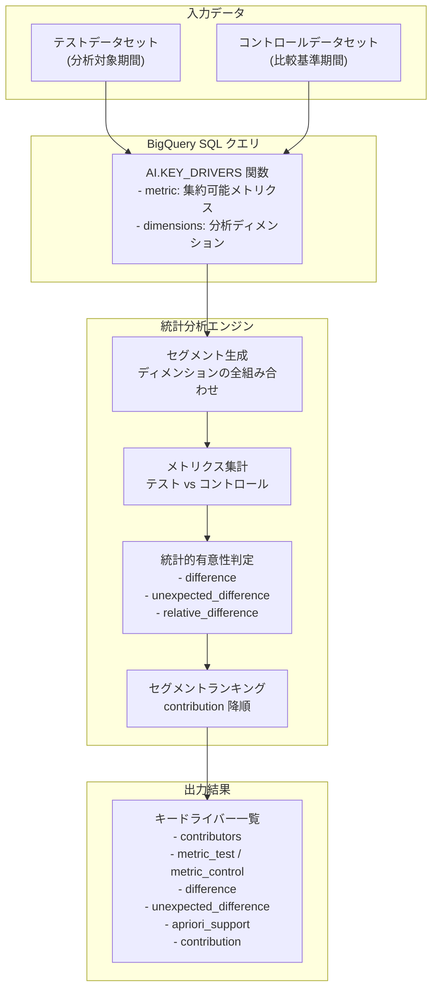

# BigQuery: AI.KEY_DRIVERS 関数によるキードライバー分析 (統計的に有意なデータセグメントの特定)

**リリース日**: 2026-04-16

**サービス**: BigQuery

**機能**: AI.KEY_DRIVERS 関数 -- 集約可能メトリクスに対する統計的に有意な変化要因セグメントの自動特定

**ステータス**: Preview

[このアップデートのインフォグラフィックを見る](https://takech9203.github.io/google-cloud-news-summary/20260416-bigquery-ai-key-drivers.html)

## 概要

BigQuery に新しい AI 関数 `AI.KEY_DRIVERS` が Preview として追加された。この関数は、集約可能 (summable) なメトリクスに対して統計的に有意な変化を引き起こしているデータセグメントを自動的に特定する。たとえば、四半期間での売上変動の主要因となっている地域・製品・顧客セグメントを、SQL クエリ一つで発見できるようになる。

`AI.KEY_DRIVERS` は、BigQuery が既に提供しているキードライバー分析 (Contribution Analysis) の機能を、より直感的で簡潔な AI 関数インターフェースとして再構築したものである。従来の `CREATE MODEL` + `ML.GET_INSIGHTS` による 2 ステップのワークフローを単一の関数呼び出しに簡素化し、データアナリストが SQL クエリ内でインラインにキードライバー分析を実行できるようにする。

この機能は、KPI の変動原因を迅速に特定したいデータアナリスト、ビジネスインテリジェンス担当者、データサイエンティストを主な対象としている。売上・コスト・トラフィックなどの集約可能メトリクスの変動要因分析を大幅に効率化し、Augmented Analytics (拡張分析) の実現に貢献する。

**アップデート前の課題**

- キードライバー分析を行うには、`CREATE MODEL` で貢献度分析モデルを作成し、`ML.GET_INSIGHTS` でインサイトを取得する 2 ステップが必要だった
- モデルの作成と管理にオーバーヘッドがあり、アドホックな分析には不向きだった
- 貢献度分析の結果を他の SQL クエリと組み合わせるには、中間テーブルや CTE を介した複雑なクエリ構成が必要だった
- メトリクス変動の原因をデータから手動で特定するには、多数のディメンションの組み合わせを逐一検証する必要があり、時間と専門知識を要した

**アップデート後の改善**

- `AI.KEY_DRIVERS` 関数を使って、単一の SQL 関数呼び出しでキードライバー分析を実行できるようになった
- モデルの事前作成が不要になり、アドホックな変動要因分析が容易になった
- BigQuery の他の AI 関数 (`AI.CLASSIFY`、`AI.DETECT_ANOMALIES` など) と同じ構文パターンで使用でき、学習コストが低い
- 統計的手法に基づく自動セグメント分析により、人手による網羅的な検証が不要になった

## アーキテクチャ図



このフローチャートは、`AI.KEY_DRIVERS` 関数がテストデータとコントロールデータを受け取り、内部でセグメント生成、メトリクス集計、統計的有意性判定、ランキングを行い、メトリクス変動の主要因となるセグメントを出力する流れを示している。

## サービスアップデートの詳細

### 主要機能

1. **単一関数によるキードライバー分析**
   - `AI.KEY_DRIVERS` 関数一つで、テストデータとコントロールデータの比較によるキードライバー分析を実行
   - 従来の `CREATE MODEL` + `ML.GET_INSIGHTS` の 2 ステップが不要
   - SQL クエリ内でインラインに使用可能

2. **集約可能 (Summable) メトリクスの分析**
   - 売上金額、トランザクション数、アクセス数などの合計可能な数値メトリクスに対応
   - 指定したメトリクスカラムの値を各セグメントで合計し、テストとコントロール間の差分を計算
   - 統計的に有意な差分を持つセグメントを自動的に特定

3. **多次元セグメント自動探索**
   - 複数のディメンション (地域、製品カテゴリ、顧客タイプなど) の組み合わせを自動的に探索
   - Apriori サポート閾値による小規模セグメントの自動除外で、意味のあるインサイトに絞り込み
   - `unexpected_difference` メトリクスにより、全体の変化率と比較して「予想外に大きな変化」を示すセグメントを識別

4. **BigQuery AI 関数ファミリとの統合**
   - `AI.CLASSIFY`、`AI.DETECT_ANOMALIES`、`AI.FORECAST` などと同じ `AI.*` 名前空間に属する
   - 既存の AI 関数と組み合わせて高度な分析パイプラインを構築可能
   - 異常検知 (`AI.DETECT_ANOMALIES`) で異常を発見し、`AI.KEY_DRIVERS` でその原因を特定するといったワークフローに対応

## 技術仕様

### 出力カラム

| カラム名 | 型 | 説明 |
|---------|------|------|
| `contributors` | `ARRAY<STRING>` | セグメントを構成するディメンション値の配列 |
| `metric_test` | `NUMERIC` | テストデータセットにおけるメトリクスの合計値 |
| `metric_control` | `NUMERIC` | コントロールデータセットにおけるメトリクスの合計値 |
| `difference` | `NUMERIC` | `metric_test - metric_control` の差分 |
| `relative_difference` | `NUMERIC` | 相対的な変化率 (`difference / metric_control`) |
| `unexpected_difference` | `NUMERIC` | 全体の変化率と比較した予想外の差分 |
| `relative_unexpected_difference` | `NUMERIC` | 予想外の差分の相対値 |
| `apriori_support` | `NUMERIC` | セグメントの全体に対する割合 (重要度の指標) |
| `contribution` | `NUMERIC` | `ABS(difference)` -- 貢献度 (降順ソートに使用) |

### 関連する AI 関数との比較

| 関数 | 用途 | ステータス |
|------|------|-----------|
| `AI.KEY_DRIVERS` | メトリクス変動の主要因セグメント特定 | Preview |
| `AI.DETECT_ANOMALIES` | 時系列データの異常検知 | GA |
| `AI.FORECAST` | 時系列データの予測 | GA |
| `AI.CLASSIFY` | テキスト・画像のカテゴリ分類 | GA |
| `AI.GENERATE` | テキスト生成 | GA |

### 想定される構文例

```sql
-- 2024年と2025年の売上データを比較し、
-- 売上変動のキードライバーを特定する
WITH sales_2024 AS (
  SELECT region, product_category, channel, revenue
  FROM `myproject.mydataset.sales`
  WHERE EXTRACT(YEAR FROM sale_date) = 2024
),
sales_2025 AS (
  SELECT region, product_category, channel, revenue
  FROM `myproject.mydataset.sales`
  WHERE EXTRACT(YEAR FROM sale_date) = 2025
)
SELECT *
FROM AI.KEY_DRIVERS(
  -- テストデータ (分析対象)
  (SELECT * FROM sales_2025),
  -- コントロールデータ (比較基準)
  (SELECT * FROM sales_2024),
  metric => 'revenue'
);
```

## 設定方法

### 前提条件

1. BigQuery API が有効化された Google Cloud プロジェクト
2. 適切な IAM 権限 (BigQuery ジョブ実行権限)
3. テストデータとコントロールデータとして使用可能な、同一スキーマを持つデータセット

### 手順

#### ステップ 1: API の有効化

```bash
gcloud services enable bigquery.googleapis.com
```

BigQuery API を有効化する。`AI.KEY_DRIVERS` は BigQuery の組み込み分析機能であるため、Vertex AI API の有効化は不要である (LLM ベースの AI 関数とは異なり、統計分析エンジンを使用する)。

#### ステップ 2: データの準備

```sql
-- テストデータとコントロールデータを準備する
-- 例: 売上データの年度間比較
-- テストデータ: 2025年の売上
-- コントロールデータ: 2024年の売上
-- 両方に同じディメンションカラムとメトリクスカラムが含まれている必要がある
```

テストデータ (分析対象期間) とコントロールデータ (比較基準期間) を同一のスキーマで準備する。ディメンションカラム (文字列型のカテゴリ変数) とメトリクスカラム (数値型の集約可能値) を含むデータが必要である。

#### ステップ 3: AI.KEY_DRIVERS 関数の実行

```sql
SELECT
  contributors,
  metric_test,
  metric_control,
  difference,
  relative_difference,
  unexpected_difference,
  contribution
FROM AI.KEY_DRIVERS(
  (SELECT region, product, channel, revenue
   FROM `myproject.sales.summary_2025`),
  (SELECT region, product, channel, revenue
   FROM `myproject.sales.summary_2024`),
  metric => 'revenue'
)
ORDER BY contribution DESC
LIMIT 20;
```

`AI.KEY_DRIVERS` 関数を呼び出し、結果を `contribution` 降順でソートすることで、メトリクス変動に最も大きく貢献しているセグメントから順に確認できる。

## メリット

### ビジネス面

- **迅速な変動要因の特定**: 売上・コスト・利用量などの KPI 変動の原因を、複雑な分析プロセスなしに即座に特定できる。ビジネス上の意思決定の迅速化に直結する
- **分析の民主化**: SQL の知識があれば高度な統計的キードライバー分析を実行可能。統計学や ML の専門知識は不要
- **データドリブン経営の加速**: 勘や経験に頼らず、統計的に有意なデータに基づいた要因分析が可能になり、より精度の高いビジネス判断を支援する

### 技術面

- **シンプルな構文**: 従来の `CREATE MODEL` + `ML.GET_INSIGHTS` の 2 ステップを単一の関数呼び出しに集約。クエリの可読性と保守性が向上
- **アドホック分析への適性**: モデルの事前作成が不要なため、探索的データ分析 (EDA) やアドホックな原因調査に最適
- **AI 関数エコシステムとの統合**: `AI.DETECT_ANOMALIES` で異常を検知し、`AI.KEY_DRIVERS` で原因を分析するといったパイプラインを SQL だけで構築可能
- **自動セグメント探索**: 多次元データにおけるディメンションの組み合わせを網羅的に探索し、人手では発見困難なパターンを統計的に検出

## デメリット・制約事項

### 制限事項

- Preview ステータスであり、本番環境での利用は「プレ GA サービスの利用規約」に基づく。機能の仕様変更や廃止の可能性がある
- 現時点では集約可能 (summable) メトリクスのみに対応。集約可能比率 (summable ratio) やカテゴリ別集約 (summable by category) のサポート範囲は要確認
- 大規模な多次元データに対しては、ディメンションの組み合わせ爆発によるクエリ実行時間の増加が予想される

### 考慮すべき点

- テストデータとコントロールデータの選択が分析結果に大きく影響するため、比較基準の設定を慎重に行う必要がある
- `apriori_support` 閾値の設定により、小規模だが重要なセグメントが除外される可能性がある。閾値の調整が分析品質に影響する
- `unexpected_difference` は全体の変化率に対する相対的な指標であり、絶対値としての大きさとは異なる解釈が必要。ビジネスコンテキストに応じた適切な指標の選択が求められる
- 従来の `CREATE MODEL` + `ML.GET_INSIGHTS` アプローチも引き続き利用可能であり、より細かい制御が必要な場合はそちらを選択する

## ユースケース

### ユースケース 1: 四半期売上変動の要因分析

**シナリオ**: EC サイトの Q1 と Q2 の売上を比較し、売上増加の主要因となっている地域、商品カテゴリ、顧客セグメントを特定する。

**実装例**:
```sql
WITH q1_sales AS (
  SELECT region, product_category, customer_segment, revenue
  FROM `ecommerce.transactions`
  WHERE order_date BETWEEN '2025-01-01' AND '2025-03-31'
),
q2_sales AS (
  SELECT region, product_category, customer_segment, revenue
  FROM `ecommerce.transactions`
  WHERE order_date BETWEEN '2025-04-01' AND '2025-06-30'
)
SELECT
  contributors,
  metric_test AS q2_revenue,
  metric_control AS q1_revenue,
  difference AS revenue_change,
  relative_difference AS change_rate,
  unexpected_difference
FROM AI.KEY_DRIVERS(
  (SELECT * FROM q2_sales),
  (SELECT * FROM q1_sales),
  metric => 'revenue'
)
ORDER BY contribution DESC
LIMIT 10;
```

**効果**: Q2 で売上が伸びた主要因 (例: 「関東地域 x 電子機器カテゴリ」が全体の変化率を大きく上回る成長) を瞬時に特定し、成功施策の横展開やリソース配分の最適化に活用できる。

### ユースケース 2: 異常検知と原因特定の組み合わせ

**シナリオ**: `AI.DETECT_ANOMALIES` で検出されたトラフィック異常の発生後、`AI.KEY_DRIVERS` を使ってどのセグメントが異常の原因であるかを特定する。

**実装例**:
```sql
-- ステップ 1: 異常期間の特定 (AI.DETECT_ANOMALIES)
-- ステップ 2: 異常期間と正常期間のキードライバー分析
WITH normal_period AS (
  SELECT source_country, device_type, page_category, pageviews
  FROM `analytics.traffic`
  WHERE date BETWEEN '2025-06-01' AND '2025-06-14'
),
anomaly_period AS (
  SELECT source_country, device_type, page_category, pageviews
  FROM `analytics.traffic`
  WHERE date BETWEEN '2025-06-15' AND '2025-06-21'
)
SELECT *
FROM AI.KEY_DRIVERS(
  (SELECT * FROM anomaly_period),
  (SELECT * FROM normal_period),
  metric => 'pageviews'
)
ORDER BY contribution DESC
LIMIT 10;
```

**効果**: トラフィック急増の原因が「特定国 x モバイルデバイス x 特定ページカテゴリ」にあることを統計的に特定し、インフラ増強やコンテンツ最適化の判断材料とすることができる。

### ユースケース 3: ML モデル性能変化の診断

**シナリオ**: ML モデルの推論精度が月次で変化した際、トレーニングデータのどのセグメントが精度変化に寄与しているかを分析する。

**効果**: データドリフトの原因セグメントを特定し、モデルの再トレーニングや特徴量エンジニアリングの方針決定を支援する。データ品質モニタリングの一環として定期的な分析パイプラインに組み込むことで、MLOps の成熟度向上に貢献する。

## 料金

`AI.KEY_DRIVERS` は BigQuery の組み込み統計分析機能であり、料金体系は BigQuery ML の貢献度分析モデルに準ずると想定される。

- **BigQuery コンピュート料金**: クエリ実行に使用するコンピュートリソースに対して課金。オンデマンドまたはエディション (スロット) ベースの料金体系が適用される
- **BigQuery ML 料金**: 評価・インスペクション・予測レートでの課金 ([BigQuery ML 料金](https://cloud.google.com/bigquery/pricing#bqml)を参照)

なお、`AI.KEY_DRIVERS` は LLM ベースの AI 関数 (`AI.GENERATE`、`AI.CLASSIFY` など) とは異なり、Vertex AI の Gemini モデルを呼び出さないため、Vertex AI 側の追加料金は発生しない。

### 料金例

| 使用量 | 月額料金 (概算) |
|--------|-----------------|
| オンデマンド クエリ 1 TB 処理 | $6.25 |
| Enterprise エディション 100 スロット | $0.04/スロット時間 |

※ 実際の料金は処理データ量やクエリの複雑さにより変動する。最新の料金は [BigQuery 料金ページ](https://cloud.google.com/bigquery/pricing) を参照。

## 利用可能リージョン

Preview 機能として、BigQuery ML の[サポートされているロケーション](https://docs.cloud.google.com/bigquery/docs/locations#bqml-loc)で利用可能と想定される。一般的に BigQuery ML の機能は US および EU マルチリージョンを含む主要リージョンで利用できる。

## 関連サービス・機能

- **[BigQuery 貢献度分析 (Contribution Analysis)](https://docs.cloud.google.com/bigquery/docs/contribution-analysis)**: `AI.KEY_DRIVERS` の基盤となる既存の分析手法。`CREATE MODEL` + `ML.GET_INSIGHTS` の 2 ステップアプローチで、より細かい制御が可能
- **[AI.DETECT_ANOMALIES](https://docs.cloud.google.com/bigquery/docs/reference/standard-sql/bigqueryml-syntax-ai-detect-anomalies)**: 時系列データの異常検知関数。異常を検知した後に `AI.KEY_DRIVERS` で原因を特定する連携ワークフローに最適
- **[AI.FORECAST](https://docs.cloud.google.com/bigquery/docs/reference/standard-sql/bigqueryml-syntax-ai-forecast)**: 時系列データの予測関数。予測値と実績値の乖離に対するキードライバー分析への応用が可能
- **[BigQuery マネージド AI 関数](https://docs.cloud.google.com/bigquery/docs/generative-ai-overview#managed_ai_functions)**: `AI.IF`、`AI.SCORE`、`AI.CLASSIFY` などの Gemini ベースのセマンティック分析関数群。`AI.KEY_DRIVERS` は統計分析ベースだが、同じ `AI.*` 名前空間に属する
- **[BigQuery ML](https://docs.cloud.google.com/bigquery/docs/bqml-introduction)**: BigQuery の機械学習プラットフォーム。予測、分類、クラスタリングなどの ML タスクを SQL で実行可能

## 参考リンク

- [インフォグラフィック](https://takech9203.github.io/google-cloud-news-summary/20260416-bigquery-ai-key-drivers.html)
- [公式リリースノート](https://cloud.google.com/release-notes#April_16_2026)
- [貢献度分析の概要](https://docs.cloud.google.com/bigquery/docs/contribution-analysis)
- [CREATE MODEL (貢献度分析)](https://docs.cloud.google.com/bigquery/docs/reference/standard-sql/bigqueryml-syntax-create-contribution-analysis)
- [ML.GET_INSIGHTS](https://docs.cloud.google.com/bigquery/docs/reference/standard-sql/bigqueryml-syntax-get-insights)
- [貢献度分析チュートリアル](https://docs.cloud.google.com/bigquery/docs/get-contribution-analysis-insights)
- [BigQuery AI 関数の概要](https://docs.cloud.google.com/bigquery/docs/ai-introduction)
- [BigQuery ML 料金](https://cloud.google.com/bigquery/pricing#bqml)

## まとめ

BigQuery の新しい `AI.KEY_DRIVERS` 関数 (Preview) により、集約可能メトリクスの変動要因を統計的に特定するキードライバー分析が、単一の SQL 関数呼び出しで実行可能になった。従来の `CREATE MODEL` + `ML.GET_INSIGHTS` による 2 ステップのワークフローを簡素化し、SQL アナリストがアドホックな変動要因分析をより迅速に実施できる。売上変動の要因特定、異常検知との連携、ML モデル性能診断など幅広いユースケースでの活用が見込まれるため、Preview 段階でデータセットへの適用を試し、GA リリースに向けた検証を進めることを推奨する。

---

**タグ**: #BigQuery #AI関数 #KeyDrivers #貢献度分析 #ContributionAnalysis #統計分析 #キードライバー分析 #Preview #AugmentedAnalytics #データ分析
