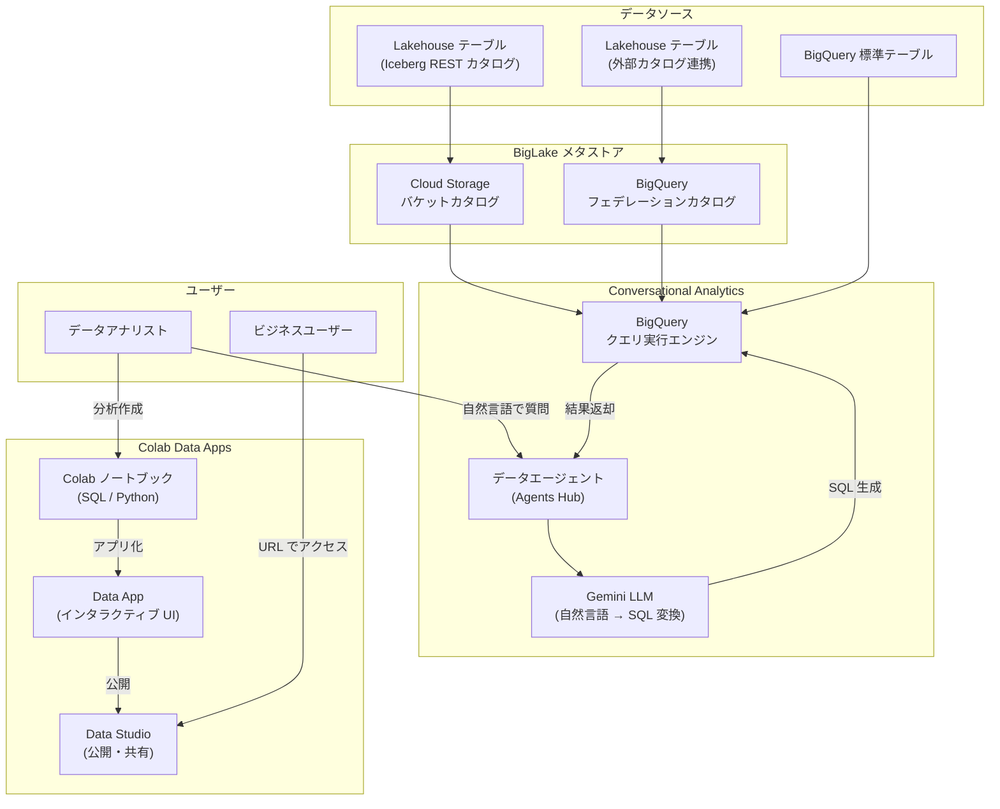

# BigQuery: Conversational Analytics の Lakehouse テーブル対応と Colab Data Apps の登場

**リリース日**: 2026-04-16

**サービス**: BigQuery

**機能**: Conversational Analytics の Lakehouse テーブル (Iceberg REST カタログ / 外部カタログ連携) 対応、および Colab Data Apps によるノートブックのインタラクティブアプリケーション化

**ステータス**: Preview

[このアップデートのインフォグラフィックを見る](https://takech9203.github.io/google-cloud-news-summary/20260416-bigquery-conversational-analytics-colab-data-apps.html)

## 概要

BigQuery に 2 つの Preview 機能が追加された。1 つ目は Conversational Analytics (会話型分析) が Lakehouse テーブルに対応した点であり、Apache Iceberg REST カタログに接続するテーブルや外部カタログに連携 (フェデレーション) されたテーブルに対して、自然言語でクエリを実行できるようになった。2 つ目は Colab Data Apps の導入であり、Colab ノートブックで作成したデータ分析をインタラクティブな Web アプリケーションに変換し、共有できる機能である。

Conversational Analytics の Lakehouse テーブル対応により、BigLake メタストアで管理されるオープンフォーマットのデータに対しても、SQL の知識がなくても自然言語で問い合わせができるようになる。これにより、データレイクハウスに蓄積された大量のデータへのアクセス障壁が大幅に低下する。一方、Colab Data Apps はデータアナリストやデータサイエンティストが作成した分析結果を、コードに触れることなくビジネスユーザーが閲覧・操作できるインタラクティブなアプリケーションとして公開する手段を提供する。

これらの機能は、データの民主化とセルフサービス分析の推進を目指す組織にとって重要なアップデートである。データエンジニア、データアナリスト、ビジネスユーザーなど幅広い役割のユーザーが対象となる。

**アップデート前の課題**

- Conversational Analytics は BigQuery の標準テーブルやビューのみを対象としており、Lakehouse テーブル (Iceberg REST カタログ接続テーブル、外部カタログ連携テーブル) に対する自然言語クエリは実行できなかった
- BigLake メタストアのオープンフォーマットデータにアクセスするには SQL の知識が必要であり、ビジネスユーザーには障壁が高かった
- Colab ノートブックの分析結果を共有するには、ノートブック自体を共有するか、静的なレポートとしてエクスポートする必要があり、インタラクティブ性が失われていた
- ビジネスユーザーがデータ分析結果を閲覧するには Google Cloud コンソールへのアクセスやノートブックの操作知識が求められていた

**アップデート後の改善**

- Conversational Analytics で Lakehouse テーブル (Iceberg REST カタログおよび外部カタログ連携) に対する自然言語クエリが可能になった
- BigLake メタストアで管理されるオープンフォーマットデータに、SQL を書かずに自然言語でアクセスできるようになった
- Colab Data Apps により、ノートブックの分析結果をインタラクティブな Web アプリケーションとして公開し、URL で共有できるようになった
- ビジネスユーザーはブラウザのみでパラメータ調整やフィルタリング操作を伴うデータ閲覧が可能になった

## アーキテクチャ図



この図は、Conversational Analytics が BigLake メタストアを介して Lakehouse テーブルにアクセスし自然言語クエリを実行するフロー (上部) と、Colab Data Apps がノートブックからインタラクティブアプリケーションを生成し Data Studio 経由でビジネスユーザーに公開するフロー (下部) を示している。

## サービスアップデートの詳細

### 主要機能

1. **Conversational Analytics の Lakehouse テーブル対応**
   - Apache Iceberg REST カタログに接続する Lakehouse テーブルを、データエージェントのナレッジソースとして追加可能
   - BigQuery フェデレーションカタログ (`bq://` ウェアハウスパス) で管理される外部カタログ連携テーブルにも対応
   - テーブルの検索・選択は BigQuery Studio の Agents Hub で行い、`catalog:` や `namespace:` などのキーワードでフィルタリング可能
   - BigLake メタストアがスキーマ情報を統合管理するため、BigQuery 標準テーブルと同様の操作感で Lakehouse テーブルを利用できる

2. **自然言語からフェデレーテッド SQL への自動変換**
   - Gemini LLM がユーザーの自然言語プロンプトを理解し、BigLake テーブルのスキーマに対応した SQL クエリを自動生成
   - スキーマディスカバリ、SQL 生成、クエリ実行、結果返却の一連の処理が自動化されている
   - データエージェントのコンテキスト設定 (ビジネス用語の定義、デフォルトフィルタ、検証済みクエリ) により、クエリ精度を向上可能

3. **Colab Data Apps によるノートブックのアプリケーション化**
   - Colab ノートブックのセルを選択し、インタラクティブな Web アプリケーションとして公開
   - SQL セル、コードセル、テキストセル、ビジュアライゼーションセルなど、すべてのセルタイプに対応
   - iPywidgets や AnyWidget などのサードパーティウィジェットライブラリをサポートし、日付範囲フィルタやドロップダウンなどのインタラクティブコントロールを追加可能
   - Colab Data Science Agent や Gemini によるコード自動生成にも対応

4. **Data Studio を介したアプリケーション共有**
   - 公開された Data Apps は URL を通じて共有可能で、閲覧者は Google Cloud コンソールやノートブックの操作を必要としない
   - IAM による Editor / Viewer のアクセス制御に対応
   - バージョン管理機能により、ソースノートブックの変更後にアプリを更新公開可能

## 技術仕様

### Conversational Analytics -- Lakehouse テーブル対応

| 項目 | 詳細 |
|------|------|
| 対応テーブルタイプ | Iceberg REST カタログ接続テーブル、BigQuery フェデレーションカタログテーブル |
| メタストア | BigLake メタストア |
| カタログタイプ | Cloud Storage バケットウェアハウス (`gs://`)、BigQuery フェデレーション (`bq://`) |
| テーブル命名規則 (P.C.N.T) | `project.catalog.namespace.table` |
| 対応データ形式 | Apache Iceberg (Parquet ファイル) |
| 動作モード | グローバル (リージョン選択不可) |
| LLM エンジン | Gemini for Google Cloud |
| BigQuery ML 連携 | AI.FORECAST、AI.DETECT_ANOMALIES、AI.GENERATE をサポート |

### Colab Data Apps

| 項目 | 詳細 |
|------|------|
| セルタイプ | SQL セル、コードセル、テキストセル、ビジュアライゼーションセル |
| ウィジェットライブラリ | iPywidgets、AnyWidget、Plotly など |
| インタラクティブセッション | 30 分 (セッション切れ後はページリロードで再開) |
| 初回起動時間 | 2 - 5 分 (アプリの複雑さに依存) |
| 認証情報 | アプリ作成者の認証情報でデータアクセス (閲覧者は作成者のアクセス権に基づくデータを参照) |
| 公開先 | Data Studio |
| アクセス制御 | Editor / Viewer ロール (IAM ベース) |

### IAM ロール -- Colab Data Apps

```
# Data Apps の作成に必要なロール
roles/bigquery.readSessionUser   -- BigQuery 読み取りセッションユーザー
roles/bigquery.studioUser        -- BigQuery Studio ユーザー
```

## 設定方法

### 前提条件

1. BigQuery API および Dataform API が有効化された Google Cloud プロジェクト
2. Gemini for Google Cloud が有効化されていること (Conversational Analytics の利用に必要)
3. 適切な IAM 権限 (BigQuery Studio ユーザー、BigQuery 読み取りセッションユーザー)
4. Lakehouse テーブルの利用には、BigLake メタストアにテーブルが登録済みであること

### 手順

#### ステップ 1: Conversational Analytics で Lakehouse テーブルをクエリ

```
1. Google Cloud コンソールで BigQuery Studio の Agents Hub に移動
2. データエージェントを作成、または既存のエージェントとの会話を開始
3. ナレッジソースの追加時に BigLake テーブルを検索
   - 検索キーワード例: catalog:CATALOG_NAME, namespace:NAMESPACE_NAME
4. テーブルを選択して会話コンテキストに追加
5. 自然言語で質問を入力 (例: 「先月の売上トップ 10 の地域を教えて」)
```

Lakehouse テーブルは BigLake メタストアを通じて BigQuery Studio 上で標準テーブルと同様に検索・選択できる。テーブルの完全修飾名は `PROJECT_ID.biglake_catalog.namespace.table` の形式となる。

#### ステップ 2: Colab Data Apps の作成と公開

```
1. BigQuery Studio で Colab ノートブックを作成または開く
2. 分析コード (SQL、Python) を作成・実行
3. 「Data app」ボタンをクリック
4. Components ペインで公開するセルを選択
5. 「Publish」をクリック
6. アプリ名とランタイム (既存ランタイムへの接続 / 新規作成) を設定
7. 「Publish」で公開完了
8. Data Studio で「Share」からユーザーやグループにアクセス権を付与
```

ノートブックの変更後は「Publish changes」で Data App を更新できる。

## メリット

### ビジネス面

- **データレイクハウスへのアクセス民主化**: SQL の専門知識がなくても、BigLake メタストアで管理されるオープンフォーマットデータに自然言語でアクセスできるようになり、より多くのビジネスユーザーがデータドリブンな意思決定を行える
- **分析結果の共有効率化**: Colab Data Apps により、分析者がノートブックで作成した分析結果をインタラクティブな Web アプリとして公開でき、ビジネスユーザーはブラウザだけでデータ探索が可能になる
- **セルフサービス BI の促進**: ビジネスユーザーがパラメータ (日付範囲、フィルタ条件など) を自分で調整してデータを確認できるため、データチームへの分析依頼の回数を削減できる

### 技術面

- **統合メタデータ管理**: BigLake メタストアがオープンフォーマットデータのメタデータを統一管理するため、Conversational Analytics はスキーマ情報を自動取得して正確な SQL を生成できる
- **マルチエンジン互換性**: BigLake メタストアの Iceberg REST カタログは Apache Spark、Apache Flink、Trino などのオープンソースエンジンとも互換性があり、同じデータに対して複数のエンジンからアクセス可能
- **柔軟なアプリ構成**: Colab Data Apps は任意の Python ビジュアライゼーションライブラリをサポートしており、Matplotlib、Plotly、seaborn などを組み合わせた高度なダッシュボードを構築可能

## デメリット・制約事項

### 制限事項

- 両機能とも Preview ステータスであり、「プレ GA サービスの利用規約」に基づく。機能仕様の変更や廃止の可能性がある
- Conversational Analytics はグローバル動作であり、リージョンの選択はできない
- BigLake メタストアの Iceberg REST カタログは Parquet ファイルのみサポート。Iceberg メタデータファイルサイズは 1 MB に制限
- Colab Data Apps のインタラクティブセッションは 30 分で切断される。30 分経過後は静的表示となり、ページリロードで新しいセッションを開始する必要がある
- Colab Data Apps ではサービスアカウントやエンドユーザー認証情報 (EUC) によるデータアクセスやアプリ閲覧は不可
- Data Apps は初回起動時に 2 - 5 分のロード時間が必要

### 考慮すべき点

- Conversational Analytics の回答品質は、データエージェントに設定したコンテキスト (ビジネス用語、指示、検証済みクエリ) に大きく依存する。Lakehouse テーブルのカラム名やデータ構造が不明瞭な場合、追加のメタデータ設定が推奨される
- Colab Data Apps では、非表示セルもすべて順番に実行されるため、バックグラウンドで実行されるセルがカーネルリソースを消費し、アプリが無反応に見える場合がある
- Data Apps は作成者の認証情報でデータアクセスを行うため、機密データへのアクセス権を持つユーザーがアプリを作成する場合は、共有範囲に注意が必要
- Lakehouse テーブルに対する BigQuery のクエリ性能は、標準 BigQuery テーブルと比較して低い場合がある (Cloud Storage からのデータ読み取りに依存)

## ユースケース

### ユースケース 1: データレイクハウスのビジネスレポート自動化

**シナリオ**: データエンジニアが Apache Spark で作成した Iceberg テーブル (売上データ、在庫データ) が BigLake メタストアに登録されている。営業部門のマネージャーが SQL を書かずに自然言語で売上傾向や在庫状況を確認したい。

**実装例**:
```
-- Agents Hub でデータエージェントを作成
-- ナレッジソースとして Lakehouse テーブルを追加:
--   myproject.sales_catalog.production.daily_sales
--   myproject.inventory_catalog.production.stock_levels

-- 自然言語での質問例:
「先月の売上が前年同月比で最も伸びた製品カテゴリを上位 5 つ教えて」
「現在、在庫回転率が低下している倉庫はどこですか？」
```

**効果**: データエンジニアリングチームが Spark で管理するデータに対して、営業部門が直接自然言語でアクセスできるため、レポート依頼の工数が削減され、意思決定のスピードが向上する。

### ユースケース 2: Colab Data Apps による経営ダッシュボード

**シナリオ**: データアナリストが BigQuery のデータを使って月次経営ダッシュボードを Colab ノートブックで作成している。経営層がコードに触れずに、期間や部門を変更しながらデータを確認できるようにしたい。

**実装例**:
```python
# Colab ノートブックでウィジェットを定義
import ipywidgets as widgets

date_range = widgets.DatePicker(description='開始日')
department = widgets.Dropdown(
    options=['全社', '営業', '開発', 'マーケティング'],
    description='部門:'
)

# ウィジェットの値に基づいて BigQuery クエリを実行し、
# Plotly で可視化するセルを作成
# -> Data App として公開
```

**効果**: 経営層は URL にアクセスするだけで、日付や部門を切り替えながらリアルタイムに KPI を確認できる。ノートブックの運用はデータアナリストが行い、閲覧者はコードを意識する必要がない。

### ユースケース 3: マルチエンジン環境での統合分析

**シナリオ**: データパイプラインは Apache Spark で構築し、アドホック分析は BigQuery で実行する環境において、Conversational Analytics を使って両エンジンのデータに自然言語でアクセスし、分析結果を Colab Data Apps で共有する。

**効果**: BigLake メタストアが共通のメタデータレイヤーとして機能するため、エンジンの違いを意識せずにデータエージェントからクエリ可能。分析結果は Data Apps として社内に展開でき、データの利活用範囲が拡大する。

## 料金

### Conversational Analytics

- **BigQuery コンピュート料金**: クエリ実行時のデータ処理に対して課金。オンデマンドまたはエディション (スロット) ベースの料金体系が適用される
- **データエージェントの作成・利用**: Preview 期間中は追加料金なし (BigQuery コンピュート料金のみ発生)
- **コスト管理**: `big_query_max_billed_bytes` パラメータで 1 クエリあたりの上限バイト数を設定可能

### Colab Data Apps

- **ランタイム料金**: ノートブックのランタイム (Compute Engine VM) の実行時間に対して課金
- **BigQuery スロット料金**: BigQuery クエリの実行に使用したスロットに対して課金
- **詳細**: [Colab Enterprise 料金](https://cloud.google.com/colab/pricing) を参照

### 料金例

| 使用量 | 月額料金 (概算) |
|--------|-----------------|
| BigQuery オンデマンド 1 TB 処理 | $6.25 |
| BigQuery Enterprise エディション 100 スロット | $0.04/スロット時間 |
| Colab Enterprise ランタイム (e2-standard-4) | Compute Engine の標準料金に準ずる |

※ 実際の料金は処理データ量やランタイム構成により変動する。最新の料金は [BigQuery 料金ページ](https://cloud.google.com/bigquery/pricing) を参照。

## 利用可能リージョン

- **Conversational Analytics**: グローバル動作。リージョンの選択はできない
- **Colab Data Apps / BigQuery Studio ノートブック**: BigQuery Studio がサポートする全リージョンで利用可能。主要リージョンとして us-central1、us-east1、europe-west1、asia-northeast1 (東京)、asia-northeast3 (ソウル) などを含む多数のリージョンに対応

## 関連サービス・機能

- **[BigLake メタストア](https://docs.cloud.google.com/biglake/docs/about-blms)**: Lakehouse テーブルのメタデータを統合管理するフルマネージドサービス。Conversational Analytics が Lakehouse テーブルにアクセスするための基盤
- **[Iceberg REST カタログ](https://docs.cloud.google.com/biglake/docs/blms-rest-catalog)**: BigLake メタストアが提供する Apache Iceberg の REST カタログインターフェース。Spark、Flink、Trino などのオープンソースエンジンとの相互運用を実現
- **[Colab Enterprise](https://docs.cloud.google.com/colab/docs/introduction)**: Google Cloud のマネージドノートブック環境。Data Apps の基盤となる
- **[Data Studio](https://lookerstudio.google.com)**: Data Apps の公開・共有プラットフォーム。Looker Studio として提供される BI ツール
- **[Gemini for Google Cloud](https://docs.cloud.google.com/gemini/docs/overview)**: Conversational Analytics の自然言語処理を支える LLM エンジン
- **[BigQuery AI 関数](https://docs.cloud.google.com/bigquery/docs/ai-introduction)**: AI.FORECAST、AI.DETECT_ANOMALIES、AI.GENERATE など、Conversational Analytics の会話内で使用可能な AI 関数群

## 参考リンク

- [インフォグラフィック](https://takech9203.github.io/google-cloud-news-summary/20260416-bigquery-conversational-analytics-colab-data-apps.html)
- [公式リリースノート](https://docs.cloud.google.com/release-notes#April_16_2026)
- [Conversational Analytics の概要](https://docs.cloud.google.com/bigquery/docs/conversational-analytics)
- [BigLake データの自然言語クエリ](https://docs.cloud.google.com/biglake/docs/conversational-analytics)
- [Colab Data Apps のドキュメント](https://docs.cloud.google.com/bigquery/docs/colab-data-apps)
- [BigLake メタストアの概要](https://docs.cloud.google.com/biglake/docs/about-blms)
- [Iceberg REST カタログの利用](https://docs.cloud.google.com/biglake/docs/blms-rest-catalog)
- [BigQuery 料金](https://cloud.google.com/bigquery/pricing)
- [Colab Enterprise 料金](https://cloud.google.com/colab/pricing)

## まとめ

BigQuery の Conversational Analytics が Lakehouse テーブル (Iceberg REST カタログ接続・外部カタログ連携) に対応したことで、BigLake メタストアで管理されるオープンフォーマットデータに対しても自然言語でのクエリが可能になった。同時に、Colab Data Apps の登場により、データ分析の成果物をインタラクティブな Web アプリケーションとして公開・共有する新たなワークフローが実現された。両機能はいずれも Preview ステータスであるが、データの民主化とセルフサービス分析の推進に大きく寄与するため、早期に検証環境で試用し、データエージェントの構成やアプリの設計パターンを確立しておくことを推奨する。

---

**タグ**: #BigQuery #ConversationalAnalytics #ColabDataApps #Lakehouse #Iceberg #BigLake #BigLakeメタストア #DataStudio #Gemini #自然言語クエリ #データ民主化 #セルフサービス分析 #Preview
