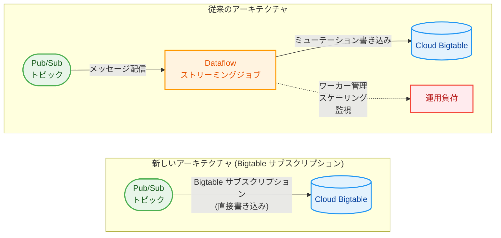

# Bigtable + Pub/Sub: Bigtable サブスクリプションによる Pub/Sub からの直接ストリーミング取り込み

**リリース日**: 2026-04-16

**サービス**: Cloud Bigtable / Pub/Sub

**機能**: Bigtable サブスクリプション (Pub/Sub から Bigtable への直接ストリーミング書き込み)

**ステータス**: Preview

[このアップデートのインフォグラフィックを見る](https://takech9203.github.io/google-cloud-news-summary/20260416-bigtable-pubsub-subscriptions.html)

## 概要

Google Cloud は、Pub/Sub のメッセージを Bigtable テーブルに直接ストリーミングで書き込める新機能「Bigtable サブスクリプション」を Preview としてリリースしました。これまで Pub/Sub から Bigtable にデータを取り込むには Dataflow などの中間サブスクライバーを別途構築・運用する必要がありましたが、本機能により中間層を介さずにメッセージを直接 Bigtable に書き込むことが可能になります。

この機能は、Pub/Sub が既に提供している BigQuery サブスクリプションや Cloud Storage サブスクリプションと同じ「エクスポートサブスクリプション」のカテゴリに属する新しいサブスクリプションタイプです。Pub/Sub のマルチテナントサービス基盤上で動作するため、ユーザーが別途 Dataflow ジョブを管理・監視する必要がなく、ストリーミングアーキテクチャが大幅に簡素化されます。

対象ユーザーは、IoT デバイスからのテレメトリデータ、ユーザーアクティビティログ、時系列データなど、大量のストリーミングデータを低レイテンシで Bigtable に取り込みたいデータエンジニア、プラットフォームエンジニア、およびアーキテクトです。

**アップデート前の課題**

このアップデート以前、Pub/Sub から Bigtable にストリーミングデータを取り込むには以下の課題がありました。

- Pub/Sub から Bigtable へのデータパイプラインには Dataflow ジョブの構築・デプロイ・運用が必須であり、Apache Beam のプログラミングモデルの知識が必要だった
- Dataflow ワーカーインスタンスの起動・維持にコストがかかり、データ変換が不要な単純な書き込みシナリオでもインフラコストが発生していた
- Dataflow ジョブの監視、オートスケーリング設定、障害復旧など、運用負荷が高かった

**アップデート後の改善**

今回のアップデートにより可能になったことは以下の通りです。

- Pub/Sub サブスクリプションの設定だけで Bigtable への直接書き込みが可能になり、Dataflow ジョブの構築・運用が不要になった
- Dataflow ワーカーインスタンスが不要になることで、単純なストリーミング取り込みシナリオにおけるインフラコストが大幅に削減される
- Pub/Sub のマネージドサービス基盤でスケーリングとリトライが自動管理されるため、運用負荷が最小化された

## アーキテクチャ図



従来は Pub/Sub から Bigtable にデータを取り込むために Dataflow ストリーミングジョブの構築と運用が必要でしたが、Bigtable サブスクリプションにより、Pub/Sub からの直接書き込みが可能になり、アーキテクチャが大幅に簡素化されます。

## サービスアップデートの詳細

### 主要機能

1. **Bigtable サブスクリプション (エクスポートサブスクリプション)**
   - Pub/Sub のエクスポートサブスクリプションの新タイプとして、Bigtable テーブルへの直接書き込みが可能
   - BigQuery サブスクリプション、Cloud Storage サブスクリプションに続く 3 番目のエクスポートサブスクリプション
   - Pub/Sub のマネージドサービス基盤上で動作し、スケーリングやフェイルオーバーは自動管理

2. **Dataflow 不要のストリーミング取り込み**
   - Apache Beam パイプラインの開発・デプロイが不要
   - Dataflow ワーカーインスタンスのプロビジョニング・管理が不要
   - サブスクリプション作成のみでストリーミングパイプラインが稼働開始

3. **マネージドなメッセージ配信とリトライ**
   - Pub/Sub が自動的にメッセージの配信と確認応答を管理
   - 配信失敗時のリトライ処理がサービス側で自動実行
   - デッドレタートピックとの連携による障害メッセージの管理が可能 (想定)

## 技術仕様

### Pub/Sub エクスポートサブスクリプションの比較

| 項目 | BigQuery サブスクリプション | Cloud Storage サブスクリプション | Bigtable サブスクリプション (新機能) |
|------|---------------------------|-------------------------------|-------------------------------------|
| 書き込み先 | BigQuery テーブル | Cloud Storage バケット | Bigtable テーブル |
| ステータス | GA | GA | Preview |
| 主なユースケース | 分析、データウェアハウス | アーカイブ、データレイク | 低レイテンシ読み取り、時系列データ |
| Dataflow の必要性 | 不要 | 不要 | 不要 |
| 配信保証 | At-least-once | At-least-once | At-least-once (想定) |

### Dataflow ベースと Bigtable サブスクリプションの比較

| 項目 | Dataflow パイプライン | Bigtable サブスクリプション |
|------|----------------------|---------------------------|
| セットアップ | Apache Beam パイプライン開発が必要 | サブスクリプション設定のみ |
| データ変換 | 複雑な変換ロジックが可能 | データ変換なし (直接書き込み) |
| スケーリング | 手動/自動スケーリング設定が必要 | Pub/Sub が自動管理 |
| コスト | Dataflow ワーカー + Pub/Sub | Pub/Sub のみ |
| 運用負荷 | ジョブの監視・障害対応が必要 | Pub/Sub のマネージドサービス |
| 起動時間 | ジョブ起動に数分 | サブスクリプション作成後即時 |

### 想定される設定例

```bash
# Bigtable サブスクリプションの作成 (想定されるコマンド)
gcloud pubsub subscriptions create SUBSCRIPTION_ID \
    --topic=TOPIC_ID \
    --bigtable-table=projects/PROJECT_ID/instances/INSTANCE_ID/tables/TABLE_ID \
    --bigtable-app-profile=APP_PROFILE_ID
```

## 設定方法

### 前提条件

1. Cloud Bigtable インスタンスおよび対象テーブルが作成済みであること
2. Pub/Sub トピックが作成済みであること
3. 適切な IAM 権限が付与されていること (Pub/Sub サービスアカウントに Bigtable への書き込み権限)
4. Bigtable テーブルのスキーマ (カラムファミリー) がメッセージのデータ構造と一致していること

### 手順

#### ステップ 1: Bigtable インスタンスとテーブルの準備

```bash
# Bigtable インスタンスの作成 (未作成の場合)
gcloud bigtable instances create INSTANCE_ID \
    --display-name="My Instance" \
    --cluster-config=id=CLUSTER_ID,zone=ZONE,nodes=3

# テーブルとカラムファミリーの作成
cbt -instance=INSTANCE_ID createtable TABLE_ID
cbt -instance=INSTANCE_ID createfamily TABLE_ID COLUMN_FAMILY
```

Bigtable テーブルを作成し、メッセージデータに対応するカラムファミリーを定義します。

#### ステップ 2: Pub/Sub トピックの準備

```bash
# Pub/Sub トピックの作成 (未作成の場合)
gcloud pubsub topics create TOPIC_ID
```

メッセージを発行する Pub/Sub トピックを作成します。

#### ステップ 3: IAM 権限の付与

```bash
# Pub/Sub サービスアカウントに Bigtable 書き込み権限を付与
gcloud bigtable instances add-iam-policy-binding INSTANCE_ID \
    --member="serviceAccount:service-PROJECT_NUMBER@gcp-sa-pubsub.iam.gserviceaccount.com" \
    --role="roles/bigtable.user"
```

Pub/Sub サービスアカウントが Bigtable テーブルにデータを書き込めるよう、適切な IAM ロールを付与します。

#### ステップ 4: Bigtable サブスクリプションの作成

```bash
# Bigtable サブスクリプションの作成 (想定されるコマンド)
gcloud pubsub subscriptions create SUBSCRIPTION_ID \
    --topic=TOPIC_ID \
    --bigtable-table=projects/PROJECT_ID/instances/INSTANCE_ID/tables/TABLE_ID
```

Bigtable サブスクリプションを作成すると、トピックに発行されたメッセージが自動的に Bigtable テーブルに書き込まれます。

## メリット

### ビジネス面

- **コスト削減**: Dataflow ワーカーインスタンスの費用が不要になり、単純なストリーミング取り込みのインフラコストが大幅に削減される。特に 24 時間稼働のストリーミングジョブでは、Dataflow の最小ワーカー台数分のコストが恒常的に発生していたが、これが解消される
- **Time to Market の短縮**: Apache Beam パイプラインの開発・テスト・デプロイのサイクルが不要になり、サブスクリプション設定のみでストリーミング取り込みを開始できるため、新しいデータパイプラインの構築期間が大幅に短縮される
- **運用チームの負荷軽減**: Dataflow ジョブの監視・アラート・障害対応が不要になり、運用チームはより付加価値の高い業務に集中できる

### 技術面

- **アーキテクチャの簡素化**: ストリーミングパイプラインのコンポーネント数が削減され、障害点 (failure point) が減少する
- **低レイテンシ**: Dataflow を経由しないため、メッセージの発行から Bigtable への書き込みまでのレイテンシが短縮される
- **マネージドスケーリング**: Pub/Sub のマルチテナントサービス基盤上で自動スケーリングが行われるため、トラフィックの急増にも自動的に対応可能
- **Infrastructure as Code との親和性**: サブスクリプション設定のみで完結するため、Terraform や gcloud CLI による宣言的な管理が容易

## デメリット・制約事項

### 制限事項

- Preview 段階であるため、本番環境での利用には SLA が適用されない。GA までの間に仕様変更が行われる可能性がある
- データ変換機能がないため、メッセージデータを Bigtable のスキーマに合わせて加工する必要がある場合は Dataflow が引き続き必要
- 配信保証は At-least-once と想定されるため、重複排除が必要な場合はアプリケーション側での対応が必要
- Preview 段階のため、対応リージョン、スループット上限、メッセージサイズ上限などの制約が存在する可能性がある

### 考慮すべき点

- 複雑なデータ変換 (フィルタリング、集約、ウィンドウ処理など) が必要なユースケースでは、引き続き Dataflow パイプラインの利用が推奨される
- 既存の Dataflow ベースのパイプラインからの移行時は、メッセージフォーマットと Bigtable スキーマの互換性を事前に検証する必要がある
- Bigtable のロウキー設計はパフォーマンスに直結するため、ホットスポットを回避するキー設計が引き続き重要
- Preview から GA への移行時にサブスクリプションの再作成が必要になる可能性がある

## ユースケース

### ユースケース 1: IoT テレメトリデータの取り込み

**シナリオ**: 数百万台の IoT デバイスからセンサーデータが Pub/Sub トピックにリアルタイムで発行される。従来は Dataflow ジョブを経由して Bigtable に書き込んでいたが、データ変換が不要なため Bigtable サブスクリプションに移行する。

**実装例**:
```bash
# IoT テレメトリ用の Bigtable テーブル
cbt -instance=iot-instance createtable sensor-readings
cbt -instance=iot-instance createfamily sensor-readings telemetry

# Pub/Sub から Bigtable への直接ストリーミング
gcloud pubsub subscriptions create iot-to-bigtable \
    --topic=iot-sensor-data \
    --bigtable-table=projects/my-project/instances/iot-instance/tables/sensor-readings
```

**効果**: Dataflow ワーカーの運用コストが削減され、デバイス数の増加に応じた自動スケーリングにより運用負荷が大幅に軽減される。

### ユースケース 2: リアルタイムユーザーアクティビティログの蓄積

**シナリオ**: Web アプリケーションやモバイルアプリからのユーザーアクティビティイベント (ページビュー、クリック、購買行動など) を Pub/Sub 経由で Bigtable に蓄積し、リアルタイムのパーソナライゼーションエンジンやレコメンデーションシステムから低レイテンシで参照する。

**効果**: パイプラインの簡素化により、イベント発行から Bigtable への書き込みまでのレイテンシが短縮され、よりリアルタイムに近いパーソナライゼーションが実現できる。

### ユースケース 3: 金融取引データのリアルタイム記録

**シナリオ**: 金融取引システムからの取引イベントを Pub/Sub で受信し、Bigtable に時系列データとして蓄積する。Bigtable の高速読み取り性能を活かし、不正検知システムや取引履歴照会システムから参照する。

**効果**: Dataflow ジョブの起動遅延がなくなり、取引データの書き込みレイテンシが改善される。また、インフラコンポーネントの削減により、金融システムの可用性と信頼性が向上する。

## 料金

本機能は Preview 段階であり、正式な料金体系は GA 時に公開される見込みです。既存の BigQuery サブスクリプション・Cloud Storage サブスクリプションの料金モデルを参考に、以下のようなコスト構造が想定されます。

### 想定されるコスト比較

| コスト要素 | Dataflow パイプライン | Bigtable サブスクリプション (想定) |
|-----------|----------------------|----------------------------------|
| Pub/Sub メッセージ配信 | Pub/Sub 料金 | Pub/Sub 料金 |
| データ処理 | Dataflow ワーカー (vCPU, メモリ, ストレージ) | Pub/Sub スループット料金 |
| Bigtable 書き込み | Bigtable 書き込み料金 | Bigtable 書き込み料金 |
| 最小コスト (24 時間稼働) | Dataflow 最小ワーカー 1 台分 + Pub/Sub | Pub/Sub のみ |

Dataflow の最小ワーカー (n1-standard-1 相当) のコストが月額約 $40-50 であることを考慮すると、単純なストリーミング取り込みシナリオでは相当のコスト削減が期待できます。

## 利用可能リージョン

Preview 段階のため、利用可能リージョンの詳細は公式ドキュメントをご確認ください。Pub/Sub と Cloud Bigtable の両方がサポートするリージョンで利用可能になると想定されます。Cloud Bigtable は 35 以上のリージョンで利用可能であり、Pub/Sub はグローバルサービスとして提供されています。

## 関連サービス・機能

- **Pub/Sub BigQuery サブスクリプション**: Pub/Sub から BigQuery テーブルへの直接書き込みを行うエクスポートサブスクリプション。Bigtable サブスクリプションと同じカテゴリの既存機能
- **Pub/Sub Cloud Storage サブスクリプション**: Pub/Sub から Cloud Storage バケットへの直接書き込みを行うエクスポートサブスクリプション
- **Dataflow**: Apache Beam ベースのストリーム/バッチ処理サービス。複雑なデータ変換が必要な場合は引き続き Dataflow の利用が推奨される
- **Bigtable Change Streams**: Bigtable テーブルの変更を Pub/Sub に配信する機能 (Dataflow 経由)。今回の機能とは逆方向のデータフロー
- **Cloud Bigtable**: 大規模データ向けの NoSQL ワイドカラムデータベース。低レイテンシの読み書きと高スループットが特徴

## 参考リンク

- [このアップデートのインフォグラフィック](https://takech9203.github.io/google-cloud-news-summary/20260416-bigtable-pubsub-subscriptions.html)
- [公式リリースノート](https://cloud.google.com/release-notes#April_16_2026)
- [Cloud Bigtable ドキュメント](https://cloud.google.com/bigtable/docs)
- [Pub/Sub サブスクリプションの種類](https://cloud.google.com/pubsub/docs/subscriber)
- [Pub/Sub BigQuery サブスクリプション](https://cloud.google.com/pubsub/docs/bigquery)
- [Pub/Sub Cloud Storage サブスクリプション](https://cloud.google.com/pubsub/docs/cloudstorage)
- [Pub/Sub 料金](https://cloud.google.com/pubsub/pricing)
- [Cloud Bigtable 料金](https://cloud.google.com/bigtable/pricing)

## まとめ

Bigtable サブスクリプションは、Pub/Sub のエクスポートサブスクリプションファミリーに新たに追加された Bigtable 向けの直接書き込み機能です。Dataflow を介さずに Pub/Sub メッセージを Bigtable に直接ストリーミングできるため、データ変換が不要なシナリオにおいてアーキテクチャの簡素化、コスト削減、運用負荷の軽減を同時に実現します。現在 Preview 段階のため、本番環境への導入は GA リリースを待つことが推奨されますが、開発・検証環境での早期検証を開始し、既存の Dataflow ベースのパイプラインからの移行計画を策定しておくことをお勧めします。

---

**タグ**: #CloudBigtable #PubSub #Streaming #ExportSubscription #Dataflow #NoSQL #Preview #コスト削減 #アーキテクチャ簡素化
