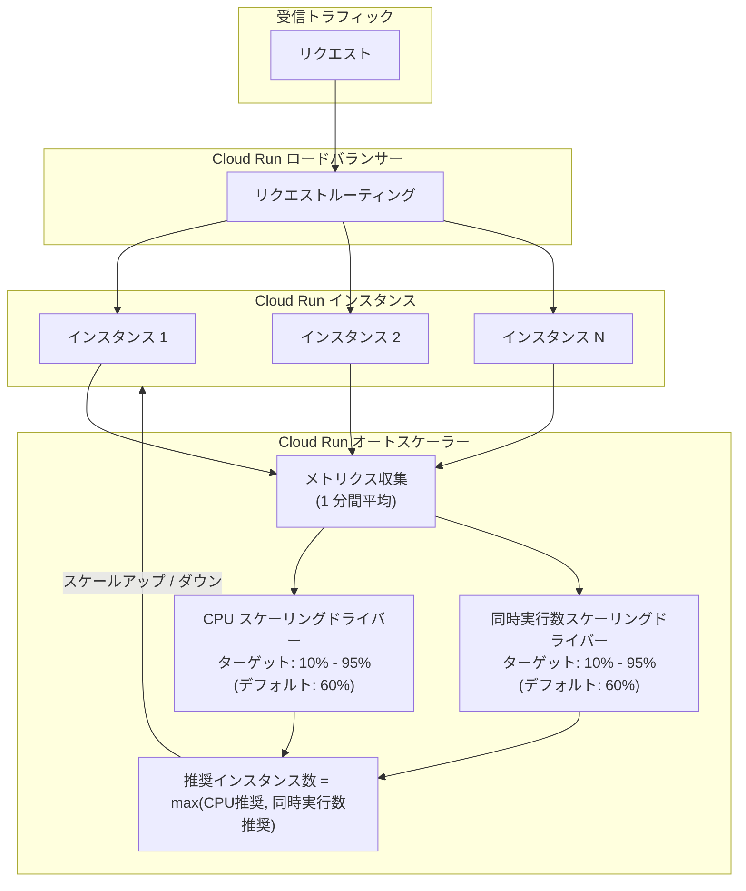

# Cloud Run: カスタムスケーリングコントロール (CPU / 同時実行数ターゲット指定) が Preview

**リリース日**: 2026-04-16

**サービス**: Cloud Run

**機能**: カスタム CPU / 同時実行数ターゲットによるスケーリングコントロール

**ステータス**: Preview

[このアップデートのインフォグラフィックを見る](https://takech9203.github.io/google-cloud-news-summary/20260416-cloud-run-custom-scaling-controls.html)

## 概要

Cloud Run のオートスケーラーにおいて、カスタム CPU 使用率ターゲットおよびカスタム同時実行数 (コンカレンシー) ターゲットを指定できる「スケーリングコントロール」機能が Preview として利用可能になりました。従来 Cloud Run は CPU 使用率と同時実行数の両方に対してデフォルト 60% の使用率ターゲットを固定的に使用していましたが、本機能によりワークロードの特性に応じて 10% から 95% の範囲でターゲット値をカスタマイズできるようになります。

スケーリングコントロールを利用することで、コスト最適化とスケーリング予測可能性の両立が可能になります。例えば、CPU バウンドなワークロードでは CPU ターゲットのみでスケーリングし、I/O バウンドなワークロードでは同時実行数ターゲットのみでスケーリングするといった柔軟な構成が実現できます。さらに、オプトインすることでインスタンス数が少ないサービスでも精度の高いスケーリングが動作する改善されたオートスケーリングモデルが有効になります。

本機能は、トラフィックパターンやリソース消費の特性が明確なワークロードを Cloud Run で運用しているインフラエンジニア、SRE、アプリケーション開発者にとって特に有用です。不必要なスケールアウトによるコスト増加や、スケーリング不足によるレイテンシ悪化を防ぐための細かな制御が可能になります。

**アップデート前の課題**

- CPU 使用率と同時実行数のスケーリングターゲットが 60% に固定されており、ワークロード特性に応じた調整ができなかった
- インスタンス数が少ないサービスでは、オートスケーラーの精度が低く、予測可能なスケーリング動作を得ることが困難だった
- CPU バウンドまたは I/O バウンドといったワークロード特性に応じて、スケーリングドライバーを選択的に使用することができなかった
- スケーリング動作の最適化には、最大同時実行数 (concurrency) やインスタンス数の上下限を間接的に調整するしかなかった

**アップデート後の改善**

- CPU 使用率ターゲットを 10% から 95% の範囲でカスタマイズできるようになった
- 同時実行数ターゲットを 10% から 95% の範囲でカスタマイズできるようになった
- CPU または同時実行数のいずれか一方のスケーリングドライバーを無効化し、単一メトリクスでのスケーリングが可能になった
- オプトインするだけでも、インスタンス数が少ないサービスにおけるスケーリング精度が向上する改善モデルが利用可能になった

## アーキテクチャ図



Cloud Run オートスケーラーは CPU 使用率と同時実行数の 2 つのスケーリングドライバーからそれぞれ推奨インスタンス数を算出し、より多くのインスタンスを必要とする方の値を採用します。スケーリングコントロールにより、各ドライバーのターゲット値をカスタマイズしたり、一方のドライバーを無効化したりすることが可能です。

## サービスアップデートの詳細

### 主要機能

1. **カスタム CPU 使用率ターゲット**
   - CPU 使用率に基づくスケーリングのターゲット値を 0.1 (10%) から 0.95 (95%) の範囲で指定可能
   - 小数点以下 2 桁まで指定可能 (例: 0.75)
   - デフォルトは 0.6 (60%)
   - 全 CPU の平均使用率が 1 分間の平均としてモニタリングされる

2. **カスタム同時実行数ターゲット**
   - 同時実行数に基づくスケーリングのターゲット値を 0.1 (10%) から 0.95 (95%) の範囲で指定可能
   - 最大同時実行数に対する使用率として算出される
   - 1 分間および 10 分間の平均が使用される
   - デフォルトは 0.6 (60%)

3. **スケーリングドライバーの選択的無効化**
   - CPU ターゲットまたは同時実行数ターゲットのいずれかを `disabled` に設定可能
   - 両方を同時に無効化することはできない (少なくとも 1 つのドライバーが常にアクティブ)
   - CPU バウンドなワークロードでは同時実行数を無効化して CPU のみでスケール
   - I/O バウンドなワークロードでは CPU を無効化して同時実行数のみでスケール

4. **高精度オートスケーリングモデル (オプトイン)**
   - スケーリングコントロールにオプトインすると、デフォルトの 60% ターゲットを維持する場合でも改善されたスケーリングモデルが有効になる
   - インスタンス数が少ないサービスでもターゲットに近いスケーリング動作を実現
   - カスタムターゲットとの差分が 10% の許容閾値を超えると、スケーリングが発動する

## 技術仕様

### スケーリングターゲットの設定範囲

| スケーリングドライバー | デフォルト値 | 最小設定値 | 最大設定値 |
|----------------------|------------|-----------|-----------|
| CPU ターゲット使用率 | 60% | 10% | 95% |
| 同時実行数ターゲット使用率 | 60% | 10% | 95% |

### スケーリング動作の比較

| ターゲット値 | スケーリング動作 | メリット | デメリット |
|------------|----------------|---------|-----------|
| 低い値 (10%-30%) | 早期にスケールアウト、大きなアイドルバッファ | 高可用性、トラフィックスパイクへの耐性 | コスト増加、頻繁なスケーリング |
| 中程度 (40%-60%) | バランスの取れたスケーリング | コストと性能のバランス | 汎用的だが最適化の余地あり |
| 高い値 (70%-95%) | 遅延的なスケールアウト、広い許容範囲 | コスト削減 | レイテンシ増加リスク、急激なスケーリング |

### YAML アノテーション

```yaml
apiVersion: serving.knative.dev/v1
kind: Service
metadata:
  annotations:
    run.googleapis.com/launch-stage: BETA
  name: my-service
spec:
  template:
    metadata:
      annotations:
        # カスタム CPU ターゲット (0.1 - 0.95)
        run.googleapis.com/scaling-cpu-target: '0.75'
        # カスタム同時実行数ターゲット (0.1 - 0.95)
        run.googleapis.com/scaling-concurrency-target: '0.50'
```

## 設定方法

### 前提条件

1. Google Cloud プロジェクトが作成済みであること
2. Cloud Run API が有効化されていること
3. `gcloud` CLI がインストール・認証済みであること
4. `gcloud beta` コンポーネントがインストール済みであること

### 手順

#### ステップ 1: スケーリングコントロールへのオプトイン (デフォルトターゲット維持)

```bash
# デフォルトの 60% ターゲットを明示的に設定してオプトイン
gcloud beta run services update SERVICE_NAME \
  --scaling-cpu-target=0.6 \
  --scaling-concurrency-target=0.6
```

`SERVICE_NAME` を対象のサービス名に置き換えてください。デフォルト値を維持する場合でも、オプトインすることで改善されたスケーリングモデルが有効になります。

#### ステップ 2: カスタムターゲットの設定

```bash
# CPU ターゲットを 75%、同時実行数ターゲットを 50% に設定
gcloud beta run services update SERVICE_NAME \
  --scaling-cpu-target=0.75 \
  --scaling-concurrency-target=0.50
```

#### ステップ 3: スケーリングドライバーの選択的無効化

```bash
# CPU のみでスケーリング (同時実行数ドライバーを無効化)
gcloud beta run services update SERVICE_NAME \
  --scaling-concurrency-target=disabled

# 同時実行数のみでスケーリング (CPU ドライバーを無効化)
gcloud beta run services update SERVICE_NAME \
  --scaling-cpu-target=disabled
```

#### ステップ 4: 設定の確認

```bash
# サービスの詳細を表示してスケーリング設定を確認
gcloud run services describe SERVICE_NAME
```

出力の `Target CPU utilization` と `Target concurrency utilization` の値を確認してください。Google Cloud Console では、サービスの Revisions タブ内の Containers タブにある Autoscaling metrics セクションでも確認できます。

#### ステップ 5: デフォルト値への復元 (オプトアウト)

```bash
# 両方のターゲットをデフォルトに復元してオプトアウト
gcloud beta run services update SERVICE_NAME \
  --scaling-cpu-target=default \
  --scaling-concurrency-target=default
```

## メリット

### ビジネス面

- **コスト最適化**: スケーリングターゲットを適切に調整することで、不必要なインスタンス起動を抑制し、Cloud Run の利用コストを削減できる。例えば、ターゲットを高めに設定することで、インスタンスの稼働率を向上させ、遊休リソースを最小化できる
- **SLA 準拠の可用性確保**: ターゲットを低めに設定することで十分なバッファを確保し、トラフィックスパイク時でもレイテンシ SLA を満たすスケーリング動作を実現できる
- **ワークロード別の最適化**: サービスごとに異なるスケーリング戦略を適用でき、コストと性能のバランスをワークロード特性に応じて最適化できる

### 技術面

- **スケーリング精度の向上**: オプトインにより、特にインスタンス数が少ないサービスにおいてスケーリングの予測可能性が大幅に改善される
- **スケーリングドライバーの選択**: CPU または同時実行数の一方のみでスケーリングすることで、ワークロード特性に適した単純なスケーリングモデルを実現できる
- **段階的な調整**: Metrics Explorer で `run.googleapis.com/scaling/recommended_instances` メトリクスを確認しながら、ターゲット値を段階的に調整してスケーリング動作を最適化できる

## デメリット・制約事項

### 制限事項

- 本機能は Preview (プレビュー) ステータスのため、本番環境での使用は「Pre-GA Offerings Terms」が適用される
- Preview 段階ではサポートが限定的であり、機能仕様が変更される可能性がある
- CPU ターゲットと同時実行数ターゲットの両方を同時に無効化することはできない
- ターゲット値の指定は小数点以下 2 桁までに制限される
- メモリ使用率に基づくスケーリングはサポートされていない

### 考慮すべき点

- 低いターゲット値 (10% 付近) を設定すると、インスタンス数が大幅に増加してコストが上昇する可能性がある
- 高いターゲット値 (90% 以上) を設定すると、許容範囲が広くなるためスケーリングが遅延し、突発的なトラフィック増加時にレイテンシが悪化するリスクがある
- 高い CPU ターゲットを設定した場合、許容閾値の幅が広くなり (例: 0.8 ターゲットで 10% 許容 = 0.72-0.88)、スムーズなカーブではなく一括スケーリング動作になる可能性がある
- シングルスレッドアプリケーションをマルチ CPU インスタンスで実行している場合、CPU ベースのスケーリングが正確に機能しない可能性があるため、同時実行数ベースのスケーリングを検討すべき
- ターゲット変更はリビジョンの新規作成を伴うため、トラフィック分割 (traffic splitting) を使用して段階的にテストすることを推奨

## ユースケース

### ユースケース 1: CPU バウンドな機械学習推論サービスのコスト最適化

**シナリオ**: 画像認識 API を Cloud Run でホスティングしている。各リクエストは CPU 集約的で同時実行数は低いが、デフォルトの 60% CPU ターゲットではインスタンスが過剰にスケールアウトしてコストが高くなっている。

**実装例**:
```bash
# CPU ターゲットを 80% に引き上げ、同時実行数ドライバーを無効化
gcloud beta run services update ml-inference-api \
  --scaling-cpu-target=0.80 \
  --scaling-concurrency-target=disabled
```

**効果**: CPU 使用率 80% まで許容することでインスタンス数を抑制し、同時実行数ドライバーの無効化により CPU 使用率のみに基づくシンプルで予測可能なスケーリングが実現する。コストを最大 25% 程度削減できる可能性がある。

### ユースケース 2: I/O バウンドな API ゲートウェイの高可用性確保

**シナリオ**: 外部 API への中継を行う API ゲートウェイサービスで、リクエストの大部分が外部 API のレスポンス待ち (I/O wait) であり CPU 使用率は低い。トラフィックスパイク時にも低レイテンシを維持したい。

**実装例**:
```bash
# 同時実行数ターゲットを 30% に設定し、CPU ドライバーを無効化
gcloud beta run services update api-gateway \
  --scaling-cpu-target=disabled \
  --scaling-concurrency-target=0.30
```

**効果**: 同時実行数が設定の 30% に達した時点でスケールアウトが始まるため、70% 分のバッファが常に確保される。突発的なトラフィック増加時でもリクエストキューイングが発生しにくく、安定した低レイテンシを維持できる。

### ユースケース 3: バースト性の高い Webhook 受信サービス

**シナリオ**: 外部 SaaS からの Webhook を受信するサービスで、通常時はトラフィックが非常に少ないが、バッチ処理完了時に短時間で大量のリクエストが到着する。

**実装例**:
```yaml
apiVersion: serving.knative.dev/v1
kind: Service
metadata:
  annotations:
    run.googleapis.com/launch-stage: BETA
  name: webhook-receiver
spec:
  template:
    metadata:
      annotations:
        run.googleapis.com/scaling-cpu-target: '0.40'
        run.googleapis.com/scaling-concurrency-target: '0.25'
        autoscaling.knative.dev/minScale: '1'
        autoscaling.knative.dev/maxScale: '50'
    spec:
      containers:
        - image: gcr.io/my-project/webhook-receiver:latest
```

**効果**: 低めのターゲット値により早期にスケールアウトが開始されるため、バースト到着時のコールドスタートによるレイテンシを最小化できる。最小インスタンス 1 と組み合わせることで、ゼロからのスケールアップ遅延も回避できる。

## 料金

スケーリングコントロール機能自体には追加料金は発生しません。ただし、スケーリングターゲットの設定値によってインスタンス数が変動するため、間接的に Cloud Run の利用料金に影響します。

### Cloud Run の基本料金 (Tier 1 リージョン、オンデマンド)

| 項目 | 料金 |
|------|------|
| vCPU 秒 | $0.000018 / vCPU 秒 ($0.0648 / 時間) |
| メモリ GiB 秒 | $0.000002 / GiB 秒 ($0.0072 / 時間) |
| リクエスト (リクエストベース課金の場合) | $0.40 / 100 万リクエスト |

### スケーリングターゲット変更によるコスト影響の例

| シナリオ | ターゲット設定 | インスタンス数の目安 | コスト影響 |
|---------|--------------|-------------------|-----------|
| デフォルト | CPU 60% / 同時実行数 60% | 基準値 | 基準 |
| コスト最適化 | CPU 80% / 同時実行数 disabled | 基準値の約 75% | 約 25% 削減 |
| 高可用性重視 | CPU disabled / 同時実行数 30% | 基準値の約 200% | 約 100% 増加 |

注: 上記は概算であり、実際のコスト影響はワークロードのトラフィックパターンに依存します。詳細な料金は [Cloud Run の料金ページ](https://cloud.google.com/run/pricing) を参照してください。

## 利用可能リージョン

スケーリングコントロール機能は Cloud Run サービスが利用可能な全リージョンで使用できます。

**Tier 1 リージョン (低価格)**:
asia-east1, asia-northeast1, asia-northeast2, asia-south1, asia-southeast3, europe-north1, europe-north2, europe-southwest1, europe-west1, europe-west4, europe-west8, europe-west9, me-west1, northamerica-south1, us-central1, us-east1, us-east4, us-east5, us-south1, us-west1

**Tier 2 リージョン**:
africa-south1, asia-east2, asia-northeast3, asia-southeast1, asia-southeast2, asia-south2, australia-southeast1, australia-southeast2, europe-central2, europe-west10, europe-west12, europe-west2, europe-west3, europe-west6, me-central1, me-central2, northamerica-northeast1, northamerica-northeast2, southamerica-east1, southamerica-west1, us-west2, us-west3, us-west4

## 関連サービス・機能

- **Cloud Run インスタンスオートスケーリング**: スケーリングコントロールはオートスケーラーのメトリクスベーススケーリングの動作を制御する機能であり、オンデマンドスケーリング (ゼロからのスケール) とは独立して動作する
- **Cloud Run 最大インスタンス数設定**: スケーリングコントロールと併用して、コストの上限を制御するために最大インスタンス数を設定することを推奨
- **Cloud Run 最小インスタンス数設定**: コールドスタートを回避するためにウォームインスタンスを維持する設定。低ターゲット値との組み合わせで高可用性を実現
- **Cloud Run 同時実行数設定 (max concurrency)**: インスタンスあたりの最大同時リクエスト数の設定。スケーリングコントロールの同時実行数ターゲットとは別の設定
- **Cloud Run マニュアルスケーリング**: オートスケーリングの代替として、固定インスタンス数での運用が必要な場合に利用
- **Cloud Monitoring (Metrics Explorer)**: `run.googleapis.com/scaling/recommended_instances` メトリクスを使用してスケーリングドライバーの動作を可視化・分析

## 参考リンク

- [インフォグラフィック](https://takech9203.github.io/google-cloud-news-summary/20260416-cloud-run-custom-scaling-controls.html)
- [公式リリースノート](https://docs.cloud.google.com/release-notes#April_16_2026)
- [スケーリングコントロールのドキュメント](https://docs.cloud.google.com/run/docs/configuring/scaling-controls)
- [Cloud Run インスタンスオートスケーリングの仕組み](https://docs.cloud.google.com/run/docs/about-instance-autoscaling)
- [Cloud Run 料金ページ](https://cloud.google.com/run/pricing)
- [Cloud Run ロケーション](https://docs.cloud.google.com/run/docs/locations)
- [gcloud beta run services update リファレンス](https://docs.cloud.google.com/sdk/gcloud/reference/beta/run/services/update)

## まとめ

Cloud Run のカスタムスケーリングコントロール (Preview) は、オートスケーラーの CPU 使用率ターゲットおよび同時実行数ターゲットをワークロード特性に応じてカスタマイズできる重要な機能です。デフォルトの 60% ターゲットから 10%-95% の範囲で調整でき、さらに一方のドライバーを無効化して単一メトリクスでのスケーリングも可能です。Preview 段階ではありますが、まずはオプトインして改善されたスケーリングモデルの恩恵を受けつつ、Metrics Explorer でスケーリング動作をモニタリングしながら段階的にターゲット値を調整することを推奨します。

---

**タグ**: #CloudRun #スケーリング #オートスケーリング #CPU #コンカレンシー #Preview #コスト最適化 #パフォーマンスチューニング #サーバーレス
