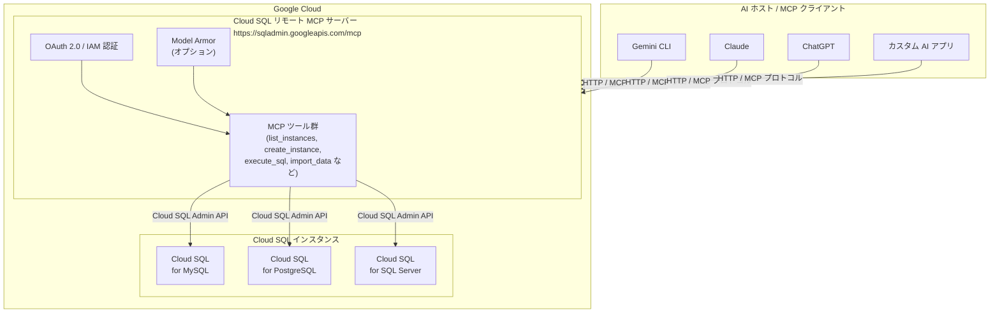

# Cloud SQL: リモート MCP サーバーが GA (一般提供)

**リリース日**: 2026-04-16

**サービス**: Cloud SQL (MySQL, PostgreSQL, SQL Server)

**機能**: Cloud SQL リモート MCP サーバーの一般提供開始

**ステータス**: GA

[このアップデートのインフォグラフィックを見る](https://takech9203.github.io/google-cloud-news-summary/20260416-cloud-sql-mcp-server-ga.html)

## 概要

Cloud SQL のリモート Model Context Protocol (MCP) サーバーが一般提供 (GA) となりました。Cloud SQL リモート MCP サーバーは、LLM、AI アプリケーション、AI 対応開発プラットフォームから Cloud SQL インスタンスと容易にやり取りできるようにするマネージドサービスです。本アップデートは Cloud SQL for MySQL、Cloud SQL for PostgreSQL、Cloud SQL for SQL Server の全 3 エンジンに同時適用されます。

MCP (Model Context Protocol) は Anthropic が開発したオープンソースプロトコルで、AI アプリケーションが外部データソースに接続するための標準化された仕組みを提供します。Cloud SQL リモート MCP サーバーは Google のインフラストラクチャ上で動作し、HTTP エンドポイント (`https://sqladmin.googleapis.com/mcp`) を通じて AI アプリケーションとの通信を行います。GA リリースにより、本番環境での使用が正式にサポートされ、SLA に基づいたサービス品質保証が提供されます。

このアップデートは、AI を活用したデータベース管理や開発ワークフローを構築したいデータベース管理者、アプリケーション開発者、AI エンジニアにとって重要なマイルストーンです。自然言語でデータベースの作成、クエリ実行、スキーマ変更などを行える環境が本番グレードで利用可能になりました。

**アップデート前の課題**

- Cloud SQL インスタンスの管理には、Google Cloud Console、gcloud CLI、または REST API の直接操作が必要で、AI アプリケーションからの統合的な操作が困難だった
- LLM やAI エージェントから Cloud SQL リソースを操作するには、独自の API ラッパーや中間レイヤーの構築が必要だった
- MCP サーバー機能はプレビュー段階であり、本番環境での使用には SLA が適用されず、サポートも限定的だった

**アップデート後の改善**

- Gemini CLI、Claude、ChatGPT などの主要 AI プラットフォームから自然言語で Cloud SQL インスタンスを直接操作可能になった
- GA リリースにより SLA が適用され、本番ワークロードでの利用が正式にサポートされた
- OAuth 2.0 と IAM による細粒度のアクセス制御、Model Armor によるセキュリティ保護が利用可能になった

## アーキテクチャ図



Cloud SQL リモート MCP サーバーは Google のインフラストラクチャ上でホストされ、各種 AI ホストプログラムの MCP クライアントが HTTP エンドポイントを通じて Cloud SQL の操作ツールにアクセスします。IAM と Model Armor による多層的なセキュリティが適用されます。

## サービスアップデートの詳細

### 主要機能

1. **マネージド HTTP エンドポイント**
   - Google のインフラストラクチャ上で稼働するリモート MCP サーバー
   - エンドポイント URL: `https://sqladmin.googleapis.com/mcp`
   - ローカル MCP サーバーと異なり、インストールや管理が不要

2. **豊富な MCP ツール群**
   - `list_instances`: プロジェクト内の全 Cloud SQL インスタンスを一覧表示
   - `create_instance`: Cloud SQL インスタンスの新規作成
   - `clone_instance`: 既存インスタンスのクローン作成
   - `update_instance`: インスタンス設定の更新
   - `get_instance`: インスタンスの詳細情報取得
   - `execute_sql`: DDL、DCL、DQL、DML を含む任意の SQL 文の実行 (MySQL / PostgreSQL)
   - `import_data`: Cloud Storage からのデータインポート
   - `create_user` / `update_user` / `list_users`: データベースユーザー管理 (MySQL / PostgreSQL)
   - `get_operation`: 長時間実行オペレーションのステータス確認

3. **マルチプラットフォーム対応**
   - Gemini CLI: エクステンションとして構成
   - Claude (claude.ai): カスタムコネクタとして構成
   - ChatGPT: MCP クライアント設定で構成
   - Antigravity: MCP サーバーとして構成
   - その他カスタム AI アプリケーション: HTTP エンドポイントで接続

4. **エンタープライズグレードのセキュリティ**
   - OAuth 2.0 による認証
   - IAM ポリシーによる細粒度のアクセス制御
   - Model Armor によるプロンプトインジェクション対策と機密データ保護
   - 集中型の監査ログ

## 技術仕様

### 対応データベースエンジンとツール比較

| ツール | MySQL | PostgreSQL | SQL Server |
|--------|:-----:|:----------:|:----------:|
| list_instances | 対応 | 対応 | 対応 |
| get_instance | 対応 | 対応 | 対応 |
| create_instance | 対応 | 対応 | 対応 |
| clone_instance | 対応 | 対応 | 対応 |
| update_instance | 対応 | 対応 | 対応 |
| execute_sql | 対応 | 対応 | 非対応 |
| import_data | 対応 | 対応 | 対応 |
| create_user | 対応 | 対応 | 非対応 |
| update_user | 対応 | 対応 | 非対応 |
| list_users | 対応 | 対応 | 対応 |
| get_operation | 対応 | 対応 | 対応 |

### MCP サーバー接続情報

| 項目 | 詳細 |
|------|------|
| サーバー URL | `https://sqladmin.googleapis.com/mcp` |
| トランスポート | HTTP (Streamable HTTP) |
| 認証 | OAuth 2.0 + IAM |
| OAuth スコープ | `https://www.googleapis.com/auth/cloud-platform` |
| API キー認証 | 非対応 |

### 必要な IAM ロール

```text
# MCP ツール呼び出し (必須)
roles/mcp.toolUser

# インスタンス管理 (作成・更新・クローン)
roles/cloudsql.admin

# インスタンス参照のみ
roles/cloudsql.viewer

# SQL 実行 (MySQL / PostgreSQL)
roles/cloudsql.admin + roles/cloudsql.StudioUser

# データインポート
roles/cloudsql.admin + roles/storage.admin

# OAuth クライアント ID 作成
roles/oauthconfig.editor
```

## 設定方法

### 前提条件

1. Google Cloud プロジェクトが作成済みであること
2. 対象の Cloud SQL API (MySQL、PostgreSQL、または SQL Server) が有効化されていること
3. 適切な IAM ロールが付与されていること

### 手順

#### ステップ 1: Gemini CLI での設定

```bash
# エクステンションディレクトリの作成
mkdir -p ~/.gemini/extensions/cloud-sql/
```

以下の内容で `~/.gemini/extensions/cloud-sql/gemini-extension.json` を作成します。

```json
{
  "name": "cloud-sql",
  "version": "1.0.0",
  "mcpServers": {
    "Cloud SQL MCP Server": {
      "httpUrl": "https://sqladmin.googleapis.com/mcp",
      "authProviderType": "google_credentials",
      "oauth": {
        "scopes": ["https://www.googleapis.com/auth/cloud-platform"]
      },
      "timeout": 30000,
      "headers": {
        "x-goog-user-project": "PROJECT_ID"
      }
    }
  }
}
```

`PROJECT_ID` を実際のプロジェクト ID に置き換えてください。

#### ステップ 2: ツールの確認

```bash
# Gemini CLI を起動
gemini

# MCP ツール一覧を確認
/mcp
```

以下のようなツール一覧が表示されます。

```text
Configured MCP servers:
  Cloud SQL MCP Server (from sqladmin)
    - list_instances
    - get_instance
    - clone_instance
    - create_instance
    - update_instance
    - execute_sql
    - import_data
    - create_user
    - update_user
    - list_users
    - get_operation
```

#### ステップ 3: Claude での設定 (Enterprise / Team プラン)

1. Google Cloud Console で OAuth 2.0 クライアント ID を作成
2. 承認済みリダイレクト URI に `https://claude.ai/api/mcp/auth_callback` を追加
3. Claude.ai の Admin settings > Connectors でカスタムコネクタを追加
4. サーバー URL に `https://sqladmin.googleapis.com/mcp` を設定

#### ステップ 4: HTTP リクエストでの直接利用

```bash
# ツール一覧の取得 (認証不要)
curl -X POST \
  -H "Content-Type: application/json" \
  -d '{"jsonrpc": "2.0", "id": 0, "method": "tools/list"}' \
  "https://sqladmin.googleapis.com/mcp"

# ツール呼び出し (認証必要)
curl -X POST \
  -H "Content-Type: application/json" \
  -H "Authorization: Bearer $(gcloud auth print-access-token)" \
  -d '{
    "jsonrpc": "2.0",
    "id": 1,
    "method": "tools/call",
    "params": {
      "name": "list_instances",
      "arguments": {
        "project": "PROJECT_ID"
      }
    }
  }' \
  "https://sqladmin.googleapis.com/mcp"
```

## メリット

### ビジネス面

- **開発生産性の大幅な向上**: 自然言語でデータベースの作成、クエリ実行、スキーマ変更が可能になり、SQL に精通していないチームメンバーも DB 操作に参加できる
- **運用コストの削減**: AI エージェントによるデータベース管理の自動化により、ルーティン作業の工数を削減
- **本番環境での信頼性**: GA リリースにより SLA が適用され、エンタープライズ要件を満たすサービス品質が保証される

### 技術面

- **標準プロトコルの採用**: MCP (Model Context Protocol) はオープンスタンダードであり、特定ベンダーにロックインされることなく多様な AI プラットフォームと統合可能
- **マネージドインフラストラクチャ**: Google がホストするリモートサーバーのため、ローカルでのサーバー構築・管理が不要
- **多層的セキュリティ**: OAuth 2.0、IAM、Model Armor による包括的なセキュリティ制御

## デメリット・制約事項

### 制限事項

- SQL Server では `execute_sql`、`create_user`、`update_user` ツールが利用できない
- `execute_sql` のレスポンスが 10 MB を超える場合、結果が切り捨てられる
- `execute_sql` で 30 秒を超えるクエリはタイムアウトする可能性がある
- `create_user` ツールではビルトイン認証 (パスワード) のユーザー作成がサポートされていない
- `execute_sql` の利用には IAM データベース認証が有効化されたインスタンスと、`data_api_access` 設定が `ALLOW_DATA_API` に設定されている必要がある

### 考慮すべき点

- API キー認証は非対応であり、OAuth 2.0 による認証が必須
- AI エージェントに広範な IAM ロールを付与する場合、セキュリティリスクを最小化するために専用のサービスアカウントを作成し、最小権限の原則を適用することを推奨
- Model Armor のプロンプトインジェクション検出フィルタは、自然言語データを含む MCP トラフィックがある場合にのみ有効化することが推奨される
- リモート MCP サーバーはローカル MCP サーバー (MCP Toolbox for Databases) とは別のソリューションであり、ユースケースに応じた選択が必要

## ユースケース

### ユースケース 1: AI アシスタントによる Web アプリケーション開発

**シナリオ**: 開発者が新しい Web アプリケーションのバックエンドデータベースを自然言語の指示で素早くセットアップする。

**実装例**:
```text
プロンプト: 「MySQL の開発用インスタンスを作成して、products テーブルをセットアップしてください」

AI エージェントの実行フロー:
1. create_instance でインスタンスを作成
2. get_operation でインスタンス作成の完了を確認
3. get_instance で接続情報を取得
4. execute_sql で CREATE TABLE products を実行
5. execute_sql で初期データを INSERT
```

**効果**: データベースのプロビジョニングからスキーマ設計、初期データ投入までを会話形式で完了でき、開発のイテレーションが大幅に加速する。

### ユースケース 2: 自然言語によるデータベースクエリと分析

**シナリオ**: ビジネスアナリストが SQL を書かずに、自然言語でデータベースのデータを検索・分析する。

**実装例**:
```text
プロンプト: 「在庫テーブルから価格が100ドル以上の靴の一覧を表示してください」

AI エージェントの実行フロー:
1. execute_sql で適切な SELECT 文を生成・実行
2. 結果を人間が読みやすい形式で返却
```

**効果**: SQL の知識がなくてもデータベースからの情報取得が可能になり、データドリブンな意思決定を加速する。

### ユースケース 3: AI エージェントによるデータベース運用自動化

**シナリオ**: 運用チームが AI エージェントを使って Cloud SQL インスタンスの日常的な管理タスクを自動化する。

**実装例**:
```text
プロンプト: 「全インスタンスの一覧を表示し、開発環境のインスタンスを最新の設定に更新してください」

AI エージェントの実行フロー:
1. list_instances でプロジェクト内の全インスタンスを取得
2. get_instance で各インスタンスの詳細を確認
3. update_instance で該当インスタンスの設定を更新
4. get_operation で更新の完了を確認
```

**効果**: 定型的な運用タスクを自然言語で指示するだけで実行でき、運用効率が向上する。

## 料金

Cloud SQL リモート MCP サーバー自体の利用に追加料金は発生しません。課金は既存の Cloud SQL リソースの使用量に基づきます。

### 料金例

| 項目 | 料金 |
|------|------|
| MCP サーバーへのアクセス | 無料 (Cloud SQL API の一部) |
| Cloud SQL インスタンス (MySQL) | vCPU とメモリに応じた従量課金 |
| Cloud SQL インスタンス (PostgreSQL) | vCPU とメモリに応じた従量課金 |
| Cloud SQL インスタンス (SQL Server) | vCPU、メモリ、ライセンスに応じた従量課金 |
| Model Armor (オプション) | リクエスト数に応じた従量課金 |

詳細な料金は [Cloud SQL の料金ページ](https://cloud.google.com/sql/pricing) を参照してください。

## 利用可能リージョン

Cloud SQL リモート MCP サーバーはグローバルエンドポイント (`https://sqladmin.googleapis.com/mcp`) として提供されており、Cloud SQL インスタンスが利用可能な全リージョンで使用できます。Cloud SQL インスタンス自体のリージョン可用性については、[Cloud SQL のロケーション](https://cloud.google.com/sql/docs/mysql/locations) を参照してください。

## 関連サービス・機能

- **Google Cloud MCP サーバーエコシステム**: BigQuery、Cloud Storage など他の Google Cloud サービスもリモート MCP サーバーを提供しており、統合的な AI 駆動のクラウド管理が可能
- **MCP Toolbox for Databases**: Cloud SQL 向けのローカル MCP サーバーソリューション。ローカル環境での実行が必要な場合に利用
- **Model Armor**: MCP ツール呼び出しとレスポンスのセキュリティスキャンを提供し、プロンプトインジェクションや機密データ漏洩を防止
- **Cloud SQL Studio**: ブラウザベースの SQL エディタ。MCP サーバー経由ではなく直接 SQL を実行する場合に利用
- **Cloud SQL Admin API**: MCP サーバーが内部的に使用する API。プログラマティックなアクセスが必要な場合に直接利用可能

## 参考リンク

- [インフォグラフィック](https://takech9203.github.io/google-cloud-news-summary/20260416-cloud-sql-mcp-server-ga.html)
- [公式リリースノート](https://cloud.google.com/release-notes#April_16_2026)
- [Cloud SQL for MySQL MCP サーバーのドキュメント](https://cloud.google.com/sql/docs/mysql/use-cloudsql-mcp)
- [Cloud SQL for PostgreSQL MCP サーバーのドキュメント](https://cloud.google.com/sql/docs/postgres/use-cloudsql-mcp)
- [Cloud SQL for SQL Server MCP サーバーのドキュメント](https://cloud.google.com/sql/docs/sqlserver/use-cloudsql-mcp)
- [Google Cloud MCP サーバー概要](https://cloud.google.com/mcp/overview)
- [MCP 認証ガイド](https://cloud.google.com/mcp/authenticate-mcp)
- [Cloud SQL 料金ページ](https://cloud.google.com/sql/pricing)

## まとめ

Cloud SQL リモート MCP サーバーの GA リリースは、AI 駆動のデータベース管理における重要なマイルストーンです。MySQL、PostgreSQL、SQL Server の全 3 エンジンで利用可能となり、Gemini CLI、Claude、ChatGPT などの主要 AI プラットフォームから自然言語で Cloud SQL インスタンスを操作できるようになりました。GA に伴い SLA が適用され本番環境での利用が正式にサポートされるため、AI エージェントを活用したデータベース運用の自動化や、開発ワークフローへの MCP 統合を検討することを推奨します。

---

**タグ**: #CloudSQL #MCP #ModelContextProtocol #GA #MySQL #PostgreSQL #SQLServer #AI #LLM #データベース管理 #自動化
