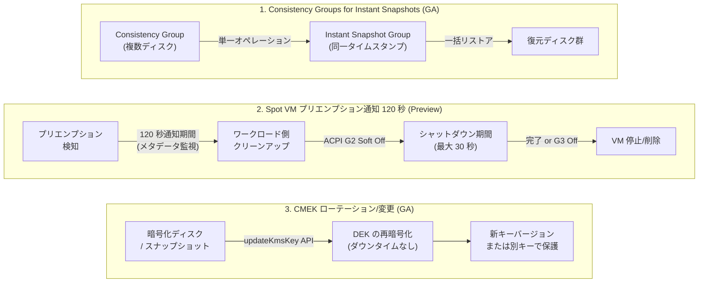

# Compute Engine: インスタントスナップショット整合性グループ GA / Spot VM プリエンプション通知拡張 / CMEK ローテーション GA

**リリース日**: 2026-04-16

**サービス**: Compute Engine

**機能**: Consistency Groups for Instant Snapshots (GA)、Spot VM 120 秒プリエンプション通知 (Preview)、CMEK キーローテーション/変更 (GA)

**ステータス**: GA / Preview

[このアップデートのインフォグラフィックを見る](https://takech9203.github.io/google-cloud-news-summary/20260416-compute-engine-instant-snapshots-cmek-spot.html)

## 概要

2026 年 4 月 16 日、Compute Engine に 3 つの重要なアップデートが同時にリリースされた。いずれもディスク管理、コスト最適化、セキュリティの各領域における運用性を大幅に向上させるものである。

第一に、**Consistency Groups for Instant Snapshots が GA (一般提供)** となった。2026 年 2 月に Preview として導入されたこの機能が正式リリースされ、SLA の対象として本番環境で安心して利用できるようになった。複数ディスクを同一時点でまとめてバックアップし、データの整合性を保証する機能であり、マルチディスク構成のデータベースや分散アプリケーションの運用において特に有用である。

第二に、**Spot VM の 120 秒プリエンプション通知 (Preview)** が追加された。従来の Spot VM ではプリエンプション検知からシャットダウンまでのベストエフォート 30 秒間しか猶予がなかったが、本機能により最大 120 秒の事前通知期間を確保できるようになった。チェックポイントの保存やタスクのグレースフルな移行に十分な時間を得られる。

第三に、**CMEK (顧客管理暗号化キー) のローテーションおよびキー変更がダウンタイムなしで GA** となった。ディスク、標準スナップショット、アーカイブスナップショットの暗号化キーを、ワークロードを停止することなくローテーションまたは別のキーに変更できる。コンプライアンス要件への対応やセキュリティ運用が大幅に簡素化される。

**アップデート前の課題**

- 複数ディスクの一括バックアップは Preview 段階であり、本番環境での利用には SLA の保証がなかった
- Spot VM がプリエンプトされた際、シャットダウンスクリプト内の最大 30 秒のベストエフォートのみでクリーンアップを完了する必要があり、ステートフルなワークロードでは不十分だった
- CMEK のローテーションやキー変更を行うには、ディスクを再作成するか、一時的にワークロードを停止する必要があった

**アップデート後の改善**

- Consistency Groups for Instant Snapshots が GA となり、SLA の対象として本番環境で信頼性高く利用可能になった
- Spot VM に 120 秒のプリエンプション通知期間を設定でき、シャットダウンスクリプト外でのグレースフルな処理終了が可能になった
- CMEK のキーバージョンローテーションおよび別キーへの変更がダウンタイムなしで実行可能になった

## アーキテクチャ図



今回の 3 つのアップデートの全体像を示す。各機能は独立して利用可能であり、それぞれディスクバックアップ、コスト最適化、セキュリティの領域を強化する。

## サービスアップデートの詳細

### 1. Consistency Groups for Instant Snapshots (GA)

2026 年 2 月 10 日に Preview として提供開始されたこの機能が、GA として正式リリースされた。

1. **同時バックアップ (Simultaneous Backups)**
   - コンシステンシーグループに属する全ディスクのインスタントスナップショットを、1 回のオペレーションで同一タイムスタンプにて取得
   - ゾーンディスクとリージョナルディスクの両方に対応
   - `gcloud compute instant-snapshot-groups create` コマンドまたは REST API で実行可能 (GA のため `beta` 不要)

2. **一括リストア (Bulk Restoration)**
   - コンシステンシーグループのインスタントスナップショットから、全ディスクを一括で復元
   - `gcloud compute disks bulk create` コマンドまたは REST API (`disks.bulkInsert`) で実行可能
   - 復元後のディスクは、必要に応じて新しいコンシステンシーグループに追加可能

3. **GA による信頼性向上**
   - SLA の対象となり、本番環境での利用が公式にサポートされる
   - API の安定性が保証され、今後の破壊的変更のリスクが低減

### 2. Spot VM 120 秒プリエンプション通知 (Preview)

1. **拡張されたプリエンプション通知期間**
   - Spot VM 作成時に `--preemption-notice-duration=120s` を指定することで、プリエンプション通知からシャットダウン開始までの間に 120 秒の猶予時間を確保
   - メタデータサーバーの `preempted` 値の変更を監視し、ワークロード側でクリーンアップ処理を実行可能
   - 従来のシャットダウンスクリプト (最大 30 秒) とは別に、事前に処理時間を確保できる

2. **プリエンプション処理の流れ**
   - Compute Engine がメタデータの `preempted` を `TRUE` に設定 (通知開始)
   - 120 秒間、ワークロード側でチェックポイント保存やタスク移行を実行
   - ACPI G2 Soft Off シグナルが送信され、シャットダウンスクリプトが起動 (ベストエフォート最大 30 秒)
   - VM の停止または削除 (設定した `instanceTerminationAction` に依存)

3. **ワークロード側での検知方法**
   - メタデータエンドポイント `http://metadata.google.internal/computeMetadata/v1/instance/preempted` をポーリングまたは `?wait_for_change=true` でハングリクエスト
   - シャットダウンスクリプトの外でプリエンプションを処理するため、より柔軟な制御が可能

### 3. CMEK ローテーション/変更 (GA)

1. **キーバージョンのローテーション**
   - 既存の CMEK の最新プライマリバージョンにローテーション
   - データ暗号化キー (DEK) が新しいキーバージョンで再暗号化される
   - ディスクのパフォーマンスやワークロードに影響なし

2. **別キーへの変更**
   - 完全に異なる Cloud KMS キーへの切り替えが可能
   - プロジェクト移行やコンプライアンス要件の変更時に有用
   - `gcloud compute disks update-kms-key` または `gcloud compute snapshots update-kms-key` コマンドで実行

3. **対象リソース**
   - ディスク (ゾーンディスク、リージョナルディスク)
   - 標準スナップショット (グローバルスコープ、リージョナルスコープ)
   - アーカイブスナップショット

## 技術仕様

### Consistency Groups for Instant Snapshots

| 項目 | 詳細 |
|------|------|
| ステータス | GA (一般提供) |
| 対応ディスクタイプ | Persistent Disk、Hyperdisk Balanced、Hyperdisk Balanced HA、Hyperdisk Extreme |
| 非対応ディスクタイプ | Hyperdisk Throughput、Hyperdisk ML |
| 最大ディスク数 | 1 コンシステンシーグループあたり 128 ディスク |
| スナップショット保存場所 | ソースディスクと同一ゾーン/リージョン |
| データ整合性 | クラッシュ整合性 |
| 追加料金 | なし |

### Spot VM プリエンプション通知

| 項目 | 詳細 |
|------|------|
| ステータス | Preview |
| 通知期間オプション | 0 秒 (デフォルト) / 120 秒 |
| シャットダウン期間 | ベストエフォート最大 30 秒 (通知期間とは別) |
| 終了アクション | STOP (デフォルト) / DELETE |
| API バージョン | `beta` (Preview のため) |
| 検知方法 | メタデータサーバーの `preempted` 値を監視 |

### CMEK ローテーション/変更

| 項目 | 詳細 |
|------|------|
| ステータス | GA (一般提供) |
| ローテーション対象 | ディスク、標準スナップショット、アーカイブスナップショット |
| ダウンタイム | なし |
| パフォーマンス影響 | なし (DEK の再暗号化のみ) |
| 対応ディスクタイプ | 全 Persistent Disk、特定の Hyperdisk (条件あり) |
| イメージ/インスタントスナップショット | 非対応 (キー変更不可) |

### CMEK ローテーション対応マシンタイプ (オンライン Hyperdisk)

オンラインの Hyperdisk ボリュームに対して CMEK ローテーション/変更が可能なマシンタイプは以下の通り:

| 世代 | 対応マシンタイプ |
|------|-----------------|
| 第 1・第 2 世代 | 全マシンタイプ |
| 第 3・第 4 世代 | A3、A4、A4X、C4、C4A、C4D、C3、X4、Z3、H4D、全 TPU |

**注意**: Confidential Hyperdisk のオンラインボリューム、および上記以外のマシンタイプにアタッチされたオンライン Hyperdisk ボリュームでは CMEK のローテーション/変更は不可。

## 設定方法

### 1. Consistency Groups for Instant Snapshots

#### ステップ 1: コンシステンシーグループの作成

```bash
# コンシステンシーグループ (リソースポリシー) を作成
gcloud compute resource-policies create disk-consistency-group my-consistency-group \
    --region=us-central1
```

#### ステップ 2: ディスクをグループに追加

```bash
# 各ディスクをコンシステンシーグループに追加
gcloud compute disks add-resource-policies disk-1 \
    --resource-policies=my-consistency-group \
    --zone=us-central1-a

gcloud compute disks add-resource-policies disk-2 \
    --resource-policies=my-consistency-group \
    --zone=us-central1-a
```

#### ステップ 3: 一括スナップショットの作成

```bash
# コンシステンシーグループのインスタントスナップショットを作成 (GA)
gcloud compute instant-snapshot-groups create my-snapshot-group \
    --source-consistency-group=my-consistency-group \
    --zone=us-central1-a
```

#### ステップ 4: 一括リストア

```bash
# スナップショットグループからディスクを一括復元
gcloud compute disks bulk create \
    --zone=us-central1-a \
    --source-instant-snapshot-group=my-snapshot-group \
    --source-instant-snapshot-group-zone=us-central1-a
```

### 2. Spot VM 120 秒プリエンプション通知

#### gcloud CLI

```bash
# 120 秒プリエンプション通知付き Spot VM を作成 (Preview - beta 必須)
gcloud beta compute instances create my-spot-vm \
    --provisioning-model=SPOT \
    --preemption-notice-duration=120s \
    --instance-termination-action=STOP \
    --machine-type=n2-standard-4 \
    --zone=us-central1-a
```

#### REST API

```json
POST https://compute.googleapis.com/compute/beta/projects/PROJECT_ID/zones/ZONE/instances
{
  "machineType": "zones/ZONE/machineTypes/n2-standard-4",
  "name": "my-spot-vm",
  "disks": [{
    "initializeParams": {
      "sourceImage": "projects/debian-cloud/global/images/family/debian-12"
    },
    "boot": true
  }],
  "scheduling": {
    "provisioningModel": "SPOT",
    "preemptionNoticeDuration": { "seconds": 120 },
    "instanceTerminationAction": "STOP"
  }
}
```

#### ワークロード側でのプリエンプション検知例

```bash
#!/bin/bash
# メタデータサーバーからプリエンプション通知を待機
curl -s "http://metadata.google.internal/computeMetadata/v1/instance/preempted?wait_for_change=true" \
    -H "Metadata-Flavor: Google"

# プリエンプション通知を受信した場合の処理
echo "Preemption notice received. Starting graceful shutdown..."
# チェックポイントの保存
/opt/app/save_checkpoint.sh
# 進行中タスクの移行
/opt/app/migrate_tasks.sh
echo "Cleanup complete."
```

### 3. CMEK ローテーション/キー変更

#### キーバージョンのローテーション

```bash
# ディスクの CMEK キーバージョンをローテーション
gcloud compute disks update-kms-key DISK_NAME \
    --zone=us-central1-a

# スナップショットの CMEK キーバージョンをローテーション
gcloud compute snapshots update-kms-key SNAPSHOT_NAME
```

#### 別キーへの変更

```bash
# ディスクの CMEK を別のキーに変更
gcloud compute disks update-kms-key DISK_NAME \
    --kms-key=projects/KEY_PROJECT/locations/global/keyRings/KEY_RING/cryptoKeys/NEW_KEY \
    --zone=us-central1-a

# スナップショットの CMEK を別のキーに変更
gcloud compute snapshots update-kms-key SNAPSHOT_NAME \
    --kms-key=projects/KEY_PROJECT/locations/global/keyRings/KEY_RING/cryptoKeys/NEW_KEY
```

## メリット

### ビジネス面

- **本番環境での信頼性向上**: Consistency Groups for Instant Snapshots が GA となり、SLA に裏付けられた信頼性で本番ワークロードのバックアップに利用可能
- **Spot VM の活用範囲拡大**: 120 秒のプリエンプション通知により、これまで Spot VM の利用が困難だったステートフルなワークロード (ML トレーニング、バッチ処理) での採用が進む。Spot VM は最大 91% の割引が適用されるため、コスト削減効果が大きい
- **コンプライアンス対応の簡素化**: CMEK のダウンタイムなしローテーションにより、暗号化キーの定期ローテーションポリシーを運用負荷なく実行可能

### 技術面

- **RPO/RTO の短縮**: コンシステンシーグループによる一括バックアップ・リストアで、マルチディスクワークロードの復旧時間を大幅に短縮
- **グレースフルシャットダウンの実現**: 120 秒の通知期間で、チェックポイント保存やタスク移行を十分な時間をかけて完了可能
- **ゼロダウンタイム暗号化管理**: DEK の再暗号化のみで完了するため、実行中のワークロードに一切の影響なし

## デメリット・制約事項

### 制限事項

- **Spot VM プリエンプション通知**: 現在 Preview 段階であり、SLA の対象外。`gcloud beta` コマンドが必要
- **インスタントスナップショットの保存場所**: ソースディスクと同じゾーン/リージョンにのみ保存されるため、ゾーン障害からの保護には標準スナップショットへの変換が必要
- **インスタントスナップショットの寿命**: ソースディスクが削除されるとインスタントスナップショットも削除される
- **CMEK ローテーション非対応リソース**: イメージおよびインスタントスナップショットの暗号化キーは変更不可
- **CMEK の制限**: Hyperdisk のクローンでは、ソースディスクと他の全クローンが削除されるまでキー変更不可
- **CMEK 暗号化の後付け不可**: 既存の暗号化されていないリソースに CMEK を適用することはできない

### 考慮すべき点

- Spot VM の 120 秒通知を利用する場合、ワークロード側のプリエンプション検知コードをシャットダウンスクリプトの外に実装する必要がある。既存の Spot VM ワークロードを移行する場合はテストが必要
- CMEK ローテーション後も以前のキーバージョンは無効化・削除されない。古いキーバージョンの無効化は Cloud KMS 側で別途管理する必要がある
- コンシステンシーグループのインスタントスナップショットはクラッシュ整合性であり、アプリケーション整合性ではない。データベース等のインメモリデータはキャプチャされない

## ユースケース

### ユースケース 1: データベースクラスタのバックアップ (Consistency Groups GA)

**シナリオ**: PostgreSQL の高可用性クラスタにおいて、データディスク、WAL ディスク、設定ディスクの 3 つで構成されるプライマリノードのバックアップを本番環境で運用したい。

**実装例**:
```bash
# コンシステンシーグループの作成と一括スナップショット取得 (GA - beta 不要)
gcloud compute resource-policies create disk-consistency-group pg-backup-group \
    --region=asia-northeast1

gcloud compute disks add-resource-policies pg-data \
    --resource-policies=pg-backup-group --zone=asia-northeast1-a
gcloud compute disks add-resource-policies pg-wal \
    --resource-policies=pg-backup-group --zone=asia-northeast1-a
gcloud compute disks add-resource-policies pg-config \
    --resource-policies=pg-backup-group --zone=asia-northeast1-a

# メンテナンス前に一括バックアップ
gcloud compute instant-snapshot-groups create pg-pre-maintenance \
    --source-consistency-group=pg-backup-group \
    --zone=asia-northeast1-a
```

**効果**: GA 機能として SLA の保証の下、3 つのディスクを同一時点でバックアップし、問題発生時に整合性のあるロールバックを実行可能。

### ユースケース 2: ML トレーニングの Spot VM 活用 (120 秒通知)

**シナリオ**: 大規模な機械学習モデルのトレーニングを Spot VM で実行し、プリエンプション時にチェックポイントを保存して別の VM で再開したい。

**実装例**:
```bash
# 120 秒通知付き Spot VM を作成
gcloud beta compute instances create ml-training-vm \
    --provisioning-model=SPOT \
    --preemption-notice-duration=120s \
    --machine-type=a2-highgpu-1g \
    --zone=us-central1-a \
    --instance-termination-action=STOP
```

```python
# ワークロード側でのプリエンプション検知と処理 (Python 例)
import requests
import threading

def monitor_preemption():
    """メタデータサーバーでプリエンプション通知を待機"""
    url = "http://metadata.google.internal/computeMetadata/v1/instance/preempted?wait_for_change=true"
    headers = {"Metadata-Flavor": "Google"}
    response = requests.get(url, headers=headers)
    if response.text == "TRUE":
        save_checkpoint()  # チェックポイントを Cloud Storage に保存
        upload_training_state()  # トレーニング状態を保存

# バックグラウンドスレッドで監視を開始
monitor_thread = threading.Thread(target=monitor_preemption, daemon=True)
monitor_thread.start()
```

**効果**: Spot VM の最大 91% 割引を享受しつつ、120 秒の猶予でチェックポイントを確実に保存し、トレーニングの進捗を失うリスクを最小化できる。

### ユースケース 3: 定期的な暗号化キーローテーション (CMEK GA)

**シナリオ**: セキュリティポリシーにより 90 日ごとの暗号化キーローテーションが義務付けられている環境で、本番ディスクのキーを無停止でローテーションしたい。

**実装例**:
```bash
# Cloud KMS でキーの自動ローテーションを設定 (90 日ごと)
gcloud kms keys update my-disk-key \
    --keyring=my-keyring \
    --location=global \
    --rotation-period=90d \
    --next-rotation-time="2026-07-15T00:00:00Z"

# ディスクの暗号化キーバージョンをローテーション (ダウンタイムなし)
gcloud compute disks update-kms-key production-disk \
    --zone=asia-northeast1-a

# スナップショットのキーもローテーション
gcloud compute snapshots update-kms-key production-snapshot
```

**効果**: ワークロードを停止することなく暗号化キーをローテーションし、コンプライアンス要件を満たしつつ可用性を維持できる。

## 料金

### Consistency Groups for Instant Snapshots

コンシステンシーグループのインスタントスナップショット機能に追加料金は発生しない。インスタントスナップショットの料金は以下の通り:

- **オペレーション料金**: スナップショット作成時に適用
- **ストレージ料金**: スナップショット取得後にディスク上で変更されたデータ量に基づいて課金。ソースディスクと同じ料金レートで課金

### Spot VM

| 項目 | 詳細 |
|------|------|
| 割引率 | 標準 VM 比で最大 91% オフ |
| 120 秒通知の追加料金 | なし (Preview) |
| 課金単位 | 秒単位 |
| 1 分以内のプリエンプション | 課金なし |

### CMEK ローテーション/変更

| 項目 | 詳細 |
|------|------|
| ローテーション/変更操作 | 追加料金なし (Compute Engine 側) |
| Cloud KMS キー利用料金 | キーバージョンごとに月額 $0.06 + 暗号化オペレーション料金 |
| Cloud KMS オペレーション料金 | 10,000 オペレーションあたり $0.03 |

詳細な料金情報は [Compute Engine ディスク料金ページ](https://cloud.google.com/compute/disks-image-pricing)、[Spot VM 料金ページ](https://cloud.google.com/compute/vm-instance-pricing)、[Cloud KMS 料金ページ](https://cloud.google.com/kms/pricing) を参照。

## 利用可能リージョン

- **Consistency Groups for Instant Snapshots**: Compute Engine が利用可能な全リージョンで対応。スナップショットはソースディスクと同一ゾーン/リージョンに保存
- **Spot VM 120 秒プリエンプション通知**: Spot VM が利用可能な全リージョンで対応
- **CMEK ローテーション/変更**: Cloud KMS が利用可能な全リージョンで対応。CMEK はディスクと同一リージョン、同一地域のマルチリージョン、またはグローバルロケーションのキーが利用可能

## 関連サービス・機能

- **[Standard Snapshots](https://cloud.google.com/compute/docs/disks/snapshots)**: ゾーン障害・リージョン障害からの保護に対応したリモートバックアップ。インスタントスナップショットからの変換も可能
- **[Backup and DR Service](https://cloud.google.com/backup-disaster-recovery/docs)**: ポリシーベースのバックアップ管理、監視、レポート機能を提供する包括的なバックアップソリューション
- **[Cloud KMS](https://cloud.google.com/kms/docs)**: CMEK の管理、自動ローテーション設定、キーバージョン管理を提供
- **[Managed Instance Groups (MIG)](https://cloud.google.com/compute/docs/instance-groups)**: Spot VM と組み合わせることで、プリエンプト後の自動再作成が可能
- **[Asynchronous Replication](https://cloud.google.com/compute/docs/disks/async-pd/about)**: コンシステンシーグループはもともと非同期レプリケーション用に設計された機能であり、インスタントスナップショットとの連携が追加された

## 参考リンク

- [インフォグラフィック](https://takech9203.github.io/google-cloud-news-summary/20260416-compute-engine-instant-snapshots-cmek-spot.html)
- [公式リリースノート](https://docs.cloud.google.com/release-notes#April_16_2026)
- [About instant snapshots](https://docs.cloud.google.com/compute/docs/disks/instant-snapshots)
- [Create instant snapshots](https://docs.cloud.google.com/compute/docs/disks/create-instant-snapshots)
- [Restore from instant snapshots](https://docs.cloud.google.com/compute/docs/disks/restore-instant-snapshot)
- [Spot VMs](https://docs.cloud.google.com/compute/docs/instances/spot)
- [Create and use Spot VMs](https://docs.cloud.google.com/compute/docs/instances/create-use-spot)
- [Customer-managed encryption keys](https://docs.cloud.google.com/compute/docs/disks/customer-managed-encryption)
- [Rotate CMEK for a disk](https://docs.cloud.google.com/compute/docs/disks/customer-managed-encryption#rotate_encryption)
- [Change CMEK for a disk](https://docs.cloud.google.com/compute/docs/disks/customer-managed-encryption#change-key)
- [Cloud KMS 料金](https://cloud.google.com/kms/pricing)
- [Compute Engine ディスク料金](https://cloud.google.com/compute/disks-image-pricing)

## まとめ

今回の Compute Engine アップデートは、ディスクバックアップ (Consistency Groups GA)、コスト最適化 (Spot VM 120 秒通知)、セキュリティ (CMEK ダウンタイムなしローテーション) の 3 領域にわたる重要な機能強化である。特に、Consistency Groups for Instant Snapshots の GA と CMEK ローテーションの GA により、マルチディスク構成のバックアップ運用と暗号化キー管理が本番環境で信頼性高く実行可能になった。Spot VM の 120 秒プリエンプション通知は Preview 段階だが、ML トレーニングやバッチ処理など、ステートフルなワークロードでの Spot VM 活用を大幅に促進する機能であり、コスト最適化を検討している場合は早期に検証を開始することを推奨する。

---

**タグ**: #ComputeEngine #InstantSnapshots #ConsistencyGroups #SpotVM #Preemption #CMEK #Encryption #KeyRotation #Backup #DataProtection #CostOptimization #Security #GA #Preview
