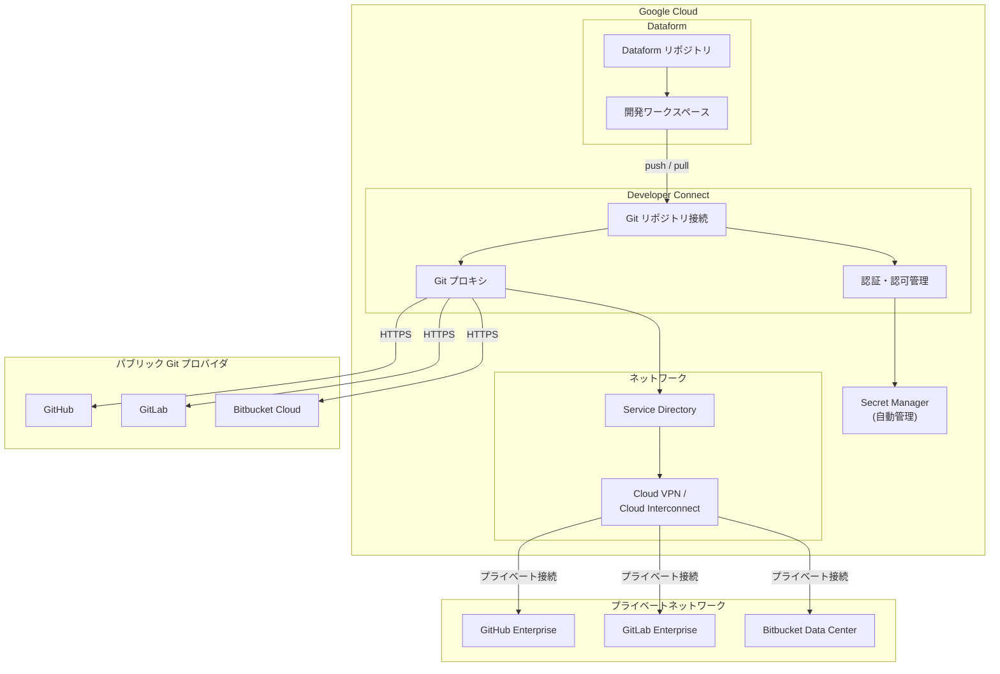

# Dataform: Developer Connect を使用したサードパーティ Git リポジトリ接続 (GA)

**リリース日**: 2026-04-16

**サービス**: Dataform

**機能**: Developer Connect を使用したサードパーティ Git リポジトリへの接続

**ステータス**: GA (一般提供開始)

[このアップデートのインフォグラフィックを見る](https://takech9203.github.io/google-cloud-news-summary/20260416-dataform-developer-connect-ga.html)

## 概要

Dataform リポジトリとサードパーティの Git リポジトリを Developer Connect を使用して接続できるようになりました。この機能により、手動でのシークレット管理が不要になり、プライベートネットワーク上にホストされたリポジトリへの接続もサポートされます。本機能は GA (一般提供) として利用可能です。

Developer Connect は、Google Cloud 外部のソースコード管理 (SCM) システム上の Git リポジトリへの接続を作成・維持するための統合プラットフォームです。これまで Dataform でサードパーティの Git リポジトリに接続するには、個人アクセストークンや SSH 鍵を Secret Manager に手動で保存し、サービスエージェントへの権限付与を行う必要がありました。Developer Connect の統合により、認証・認可・ネットワーク構成が標準化されたフローで処理され、運用負荷が大幅に削減されます。

このアップデートは、BigQuery の ELT パイプラインを Dataform で管理し、GitHub、GitLab、Bitbucket などの外部 Git リポジトリとバージョン管理を統合しているデータエンジニアやプラットフォームチームにとって特に重要な改善です。

**アップデート前の課題**

- Git リポジトリとの接続に個人アクセストークンや SSH 鍵を手動で作成・管理する必要があった
- Secret Manager にシークレットを保存し、Dataform サービスエージェントに `roles/secretmanager.secretAccessor` ロールを手動で付与する必要があった
- プライベート IP アドレスのみを持つオンプレミスの Git ホストには直接接続できなかった (パブリック IP アドレスが必須)
- アクセストークンの期限管理やローテーションを手動で行う必要があり、トークン失効によるパイプライン障害のリスクがあった
- Git プロバイダごとに異なる認証方式 (HTTPS、SSH) への対応が必要で、設定手順が複雑だった

**アップデート後の改善**

- Developer Connect がシークレット (トークン・鍵) のライフサイクルを自動管理するため、手動でのシークレット管理が不要になった
- Service Directory と VPN/Cloud Interconnect を経由した、プライベートネットワーク上の Git リポジトリへの接続がサポートされた
- Google Cloud コンソール上の標準化されたウィザードで、認証・認可・ネットワーク構成をガイド付きで完了できるようになった
- 複数の Google Cloud サービス (Cloud Build、Cloud Run、Gemini Code Assist など) と同一の接続基盤を共有でき、SCM 統合を一元管理可能になった

## アーキテクチャ図



Dataform リポジトリは Developer Connect を介してサードパーティ Git リポジトリに接続します。パブリックリポジトリには Git プロキシ経由で直接接続し、プライベートネットワーク上のリポジトリには Service Directory と Cloud VPN / Cloud Interconnect を経由して安全に接続します。認証情報は Secret Manager で自動管理されます。

## サービスアップデートの詳細

### 主要機能

1. **Developer Connect による統合 Git 接続**
   - Dataform と外部 Git リポジトリ間の接続を Developer Connect が仲介
   - Google Cloud コンソールから標準化されたワークフローで接続を作成・管理
   - 接続の作成、リポジトリのリンク、権限設定を一箇所で完結
   - 他の Google Cloud サービス (Cloud Build、Cloud Run、Gemini Code Assist) と同一の接続基盤を共有

2. **自動シークレット管理**
   - Developer Connect が OAuth トークンや認証情報のライフサイクルを自動管理
   - 個人アクセストークンの手動作成・Secret Manager への保存・サービスエージェントへの権限付与が不要
   - トークンの自動ローテーションにより、トークン失効によるパイプライン障害リスクを排除
   - CMEK (顧客管理の暗号鍵) によるシークレットの暗号化もサポート

3. **プライベートネットワーク接続サポート**
   - Service Directory を使用してプライベート IP アドレスのみを持つ Git ホストに接続可能
   - Cloud VPN または Cloud Interconnect 経由でオンプレミスの Git サーバーにアクセス
   - ファイアウォール内に配置された GitHub Enterprise、GitLab Enterprise、Bitbucket Data Center をサポート
   - VPC Service Controls との統合により、データ境界の制御も可能

## 技術仕様

### 接続方式の比較

| 項目 | 従来方式 (HTTPS/SSH) | Developer Connect 方式 |
|------|---------------------|----------------------|
| 認証情報の管理 | 手動 (Secret Manager + IAM 設定) | 自動 (Developer Connect が管理) |
| プライベートネットワーク | 非対応 (パブリック IP 必須) | 対応 (Service Directory 経由) |
| トークンローテーション | 手動 | 自動 |
| 対応 Git プロバイダ | GitHub, GitLab, Bitbucket, Azure DevOps | GitHub, GitHub Enterprise, GitLab, GitLab Enterprise, Bitbucket Cloud, Bitbucket Data Center |
| Git プロキシ | なし | あり (Developer Connect が代理で Git 操作) |
| 接続の一元管理 | なし (サービスごとに個別設定) | あり (Developer Connect ダッシュボード) |
| CMEK サポート | Secret Manager 側で設定 | Developer Connect で統合設定 |
| データ レジデンシー | 非対応 | 対応 (リージョン選択可能) |

### 必要な IAM ロール

| ロール | 説明 |
|--------|------|
| `roles/dataform.admin` | Dataform リポジトリの管理と Git 接続の設定 |
| `roles/developerconnect.admin` | Developer Connect 接続の作成と管理 |
| `roles/developerconnect.user` | Developer Connect 接続の使用 |
| `roles/servicedirectory.viewer` | Service Directory リソースの参照 (プライベートネットワーク使用時) |
| `roles/servicedirectory.pscAuthorizedService` | VPC ネットワークリソースへのアクセス (プライベートネットワーク使用時) |

## 設定方法

### 前提条件

1. Google Cloud プロジェクトで Dataform API と Developer Connect API が有効化されていること
2. Dataform リポジトリが作成済みであること
3. 接続先の Git プロバイダ (GitHub、GitLab、Bitbucket) にリポジトリが存在すること
4. プライベートネットワーク接続の場合、Cloud VPN または Cloud Interconnect が構成済みであること

### 手順

#### ステップ 1: Developer Connect で Git 接続を作成

```bash
# Developer Connect API を有効化
gcloud services enable developerconnect.googleapis.com

# GitHub 接続を作成 (例)
gcloud developer-connect connections create my-github-connection \
    --location=us-central1
```

Google Cloud コンソールの Developer Connect ページで接続を作成することもできます。コンソールでは、Git プロバイダの選択、OAuth 認証、リポジトリのリンクをガイド付きで行えます。

#### ステップ 2: リポジトリリンクを作成

```bash
# Git リポジトリをリンク
gcloud developer-connect connections git-repository-links create my-dataform-repo \
    --clone-uri=https://github.com/my-org/my-dataform-project.git \
    --connection=my-github-connection \
    --location=us-central1
```

接続が確立されると、Developer Connect がリポジトリリンクを作成し、認証情報を自動管理します。

#### ステップ 3: Dataform リポジトリを Developer Connect 接続にリンク

Google Cloud コンソールの Dataform ページで以下を実行します。

1. 対象の Dataform リポジトリを選択
2. **Settings** > **Connect with Git** を選択
3. 接続方式として **Developer Connect** を選択
4. 作成済みの Developer Connect 接続とリポジトリリンクを選択
5. デフォルトのリモートブランチ名を入力
6. **Link** をクリックして接続を完了

#### ステップ 4: (オプション) プライベートネットワーク接続の設定

```bash
# Developer Connect サービスアカウントに Service Directory の権限を付与
PROJECT_NUMBER=$(gcloud projects describe PROJECT_ID --format="value(projectNumber)")
SERVICE_ACCOUNT="service-${PROJECT_NUMBER}@gcp-sa-devconnect.iam.gserviceaccount.com"

gcloud projects add-iam-policy-binding PROJECT_ID \
    --member="serviceAccount:${SERVICE_ACCOUNT}" \
    --role="roles/servicedirectory.viewer"

gcloud projects add-iam-policy-binding PROJECT_ID \
    --member="serviceAccount:${SERVICE_ACCOUNT}" \
    --role="roles/servicedirectory.pscAuthorizedService"
```

プライベートネットワーク上の Git ホストに接続する場合、Service Directory のエンドポイントを構成し、Cloud VPN または Cloud Interconnect を通じてルーティングを設定します。

## メリット

### ビジネス面

- **運用コストの削減**: シークレットの手動管理・ローテーションが不要になり、インフラ運用チームの負荷が軽減される
- **コンプライアンス強化**: プライベートネットワーク接続のサポートにより、機密性の高いコードベースをパブリックインターネットに公開することなく Dataform と統合可能
- **ガバナンスの一元化**: Developer Connect ダッシュボードで全ての SCM 接続を可視化・管理でき、組織全体の Git 接続ポリシーを統一可能

### 技術面

- **セキュリティの向上**: 手動で管理される長期間有効なトークンや SSH 鍵が不要になり、認証情報漏洩のリスクが低減
- **プライベートネットワーク対応**: VPC 内やオンプレミスの Git サーバーに安全に接続可能になり、これまでパブリック IP が必須だった制約が解消
- **統一された接続基盤**: Cloud Build、Cloud Run、Gemini Code Assist など他のサービスと同じ Developer Connect 接続を共有でき、接続管理が簡素化
- **Git プロキシ機能**: Developer Connect が Git 操作のプロキシとして機能し、ネットワーク構成が簡素化

## デメリット・制約事項

### 制限事項

- Developer Connect のリージョンサポートは限定的であり、全てのリージョンで利用できるわけではない
- プライベートネットワーク接続には Cloud VPN または Cloud Interconnect の事前構成が必要で、追加のネットワーク費用が発生する
- 従来の HTTPS/SSH 方式から Developer Connect 方式への移行には、既存の接続設定のリセットと再構成が必要

### 考慮すべき点

- 既存の Dataform リポジトリで従来方式を使用している場合、Developer Connect への移行計画を立てることを推奨
- Developer Connect は Organization Policy による制御が可能なため、組織のセキュリティポリシーとの整合性を確認すること
- プライベートネットワーク接続を使用する場合、Service Directory の IP アドレス範囲 (35.199.192.0/19) のファイアウォール許可ルールが必要
- Azure DevOps Services は従来方式 (SSH) でのみサポートされており、Developer Connect 経由の接続は現時点で対応していない

## ユースケース

### ユースケース 1: エンタープライズ環境での Dataform パイプライン管理

**シナリオ**: 大規模企業のデータエンジニアリングチームが、社内のプライベート GitHub Enterprise サーバーで SQL ワークフローのソースコードを管理しています。これまでパブリック IP が必須だったため、Dataform との直接統合ができず、コードの手動コピーや中間リポジトリの運用が必要でした。

**実装例**:
```bash
# プライベートネットワーク上の GitHub Enterprise への接続を作成
gcloud developer-connect connections create ghe-private-conn \
    --location=us-central1 \
    --github-enterprise-config-host-uri=https://github.internal.example.com

# Service Directory エンドポイントを構成
gcloud service-directory endpoints create ghe-endpoint \
    --namespace=my-namespace \
    --service=ghe-service \
    --location=us-central1 \
    --address=10.0.1.100 \
    --port=443
```

**効果**: プライベートネットワーク上の GitHub Enterprise と Dataform を直接統合でき、中間リポジトリの運用が不要になる。セキュリティポリシーを維持したまま、開発ワークスペースから直接 push/pull が可能になる。

### ユースケース 2: マルチチームでの Git 接続の一元管理

**シナリオ**: プラットフォームチームが複数のデータチームの Dataform 環境を管理しています。各チームが異なる Git プロバイダ (GitHub、GitLab) を使用しており、個人アクセストークンの管理とローテーションが大きな運用負荷になっています。

**効果**: Developer Connect で全ての Git 接続を一元管理し、トークン管理を自動化することで、プラットフォームチームの運用負荷を大幅に削減。Organization Policy で許可する接続先を制御し、ガバナンスも強化できる。

### ユースケース 3: CI/CD パイプラインとの統合

**シナリオ**: データチームが Cloud Build で CI/CD パイプラインを構築し、Dataform のワークフローをテスト・デプロイしています。Dataform と Cloud Build の両方で同じ Git リポジトリにアクセスする必要がありますが、それぞれ個別にシークレットを管理しています。

**効果**: Developer Connect の接続を Dataform と Cloud Build で共有することで、シークレット管理の重複を排除。接続設定の変更が一箇所で完結し、メンテナンスコストが削減される。

## 料金

Developer Connect 自体の使用料は無料です。ただし、以下の関連サービスの料金が発生する場合があります。

### 料金例

| 項目 | 料金 |
|------|------|
| Developer Connect | 無料 |
| Dataform | リポジトリの使用自体は無料 (BigQuery のコンピューティング・ストレージ料金は別途) |
| Secret Manager | Developer Connect が自動作成するシークレットに対して、シークレットバージョンごとの月額料金 ($0.06/バージョン/月) とアクセスオペレーション料金 |
| Cloud VPN (プライベートネットワーク使用時) | VPN トンネルあたり $0.075/時間 + データ転送料金 |
| Cloud Interconnect (プライベートネットワーク使用時) | ポートタイプとキャパシティに基づく月額料金 |

## 利用可能リージョン

Developer Connect はマルチリージョンで利用可能です。接続リソースの作成時にリージョンを指定します。Dataform のリポジトリと同じリージョン、または近接するリージョンに Developer Connect 接続を作成することを推奨します。利用可能なリージョンの最新情報は [Developer Connect のロケーション](https://docs.cloud.google.com/developer-connect/docs/locations) を参照してください。

## 関連サービス・機能

- **[Developer Connect](https://docs.cloud.google.com/developer-connect/docs/overview)**: Google Cloud と外部 SCM を接続する統合プラットフォーム。Dataform 以外にも Cloud Build、Cloud Run、Gemini Code Assist などで利用可能
- **[Dataform](https://docs.cloud.google.com/dataform/docs/overview)**: BigQuery 上の SQL ワークフローを管理するサービス。SQLX による変換ロジックの記述、依存関係管理、スケジュール実行をサポート
- **[Secret Manager](https://docs.cloud.google.com/secret-manager/docs/overview)**: Developer Connect が認証情報を安全に保存するために内部で使用。従来方式では手動設定が必要だったが、Developer Connect 方式では自動管理される
- **[Service Directory](https://docs.cloud.google.com/service-directory/docs/overview)**: プライベートネットワーク接続時に、DNS 解決とネットワークルーティングを提供するサービス
- **[Cloud Build](https://docs.cloud.google.com/build/docs/overview)**: Developer Connect の接続を共有して CI/CD パイプラインと Dataform の Git 統合を一元化可能

## 参考リンク

- [インフォグラフィック](https://takech9203.github.io/google-cloud-news-summary/20260416-dataform-developer-connect-ga.html)
- [公式リリースノート](https://cloud.google.com/release-notes#April_16_2026)
- [Dataform - リモートリポジトリの接続](https://docs.cloud.google.com/dataform/docs/connect-repository)
- [Developer Connect 概要](https://docs.cloud.google.com/developer-connect/docs/overview)
- [Developer Connect - Git リポジトリ接続](https://docs.cloud.google.com/developer-connect/docs/git-repo-connections)
- [Dataform 料金](https://cloud.google.com/dataform/pricing)
- [Developer Connect リリースノート](https://docs.cloud.google.com/developer-connect/docs/release-notes)

## まとめ

Dataform における Developer Connect を使用したサードパーティ Git リポジトリ接続の GA は、データパイプラインのバージョン管理におけるセキュリティと運用効率を大幅に改善するアップデートです。手動でのシークレット管理からの脱却、プライベートネットワーク上の Git サーバーへの接続サポート、そして Developer Connect による接続の一元管理により、特にエンタープライズ環境での Dataform 導入障壁が低下します。現在 HTTPS/SSH の従来方式を使用している場合は、Developer Connect への移行を検討し、まずは開発環境での検証から始めることを推奨します。

---

**タグ**: #Dataform #DeveloperConnect #Git #BigQuery #GA #セキュリティ #プライベートネットワーク #ELT
