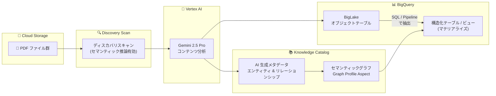

# Dataplex (Knowledge Catalog): 非構造化データ向け Data Insights

**リリース日**: 2026-04-16

**サービス**: Dataplex (Knowledge Catalog)

**機能**: Data insights for unstructured data

**ステータス**: Preview

📊 [このアップデートのインフォグラフィックを見る](https://takech9203.github.io/google-cloud-news-summary/20260416-dataplex-data-insights-unstructured-data.html)

## 概要

Google Cloud の Dataplex (Knowledge Catalog) に、非構造化データ向けの Data Insights 機能が Preview として追加されました。この機能は、Cloud Storage に保存された PDF などの非構造化ファイル (いわゆる「ダークデータ」) を、Vertex AI を活用して分析し、構造化されたクエリ可能なアセットへと変換します。

従来のディスカバリツールはファイルサイズやファイルタイプといったファイルレベルのメタデータ取得に限定されていましたが、本機能は Vertex AI (Gemini) を使用してファイルの実際のコンテンツを分析します。エンティティの推論 (企業名、製品名、シリアル番号などの属性を自動抽出) やリレーションシップの抽出 (エンティティ間の関係をセマンティックグラフとして構築) を自動的に行い、手動でのドキュメントパーシングやカスタム ETL コードを不要にします。

この機能は、大量の PDF ドキュメントを保有しながらもそのデータを十分に活用できていなかったデータエンジニア、データスチュワード、アナリストを主な対象としています。抽出されたデータは BigQuery のテーブルやビューとしてマテリアライズでき、既存の構造化データとの結合や Gemini による分析にも利用可能です。

**アップデート前の課題**

- Cloud Storage 上の PDF などの非構造化ファイルはメタデータ (ファイル名、サイズ、タイプ) しか取得できず、内容の分析には手動でのパーシングが必要だった
- 非構造化データから構造化データを抽出するには、カスタム ETL パイプラインや専用のパーサーコードを開発・保守する必要があった
- ドキュメント内のエンティティ間の関係性 (例: 部品と製品の関係) を把握するためには、人手による分析が不可欠だった
- いわゆる「ダークデータ」として、組織内の非構造化ファイルが検索・分析の対象外となっていた

**アップデート後の改善**

- Vertex AI (Gemini 2.5 Pro) による自動コンテンツ分析で、PDF の実際の内容からエンティティとリレーションシップを自動抽出できるようになった
- ワンクリック SQL またはパイプラインオーケストレーションにより、推論されたデータを BigQuery のテーブル・ビューとしてマテリアライズ可能になった
- AI が生成するセマンティックグラフにより、エンティティ間の関係を視覚的に把握できるようになった
- Knowledge Catalog への自動メタデータ登録により、非構造化データが検索・ガバナンスの対象に含まれるようになった

## アーキテクチャ図



Cloud Storage 上の PDF ファイルがディスカバリスキャンを経由して Vertex AI で分析され、Knowledge Catalog にメタデータとセマンティックグラフが登録されます。推論結果は BigQuery のテーブルやビューとしてマテリアライズし、分析に活用できます。

## サービスアップデートの詳細

### 主要機能

1. **自動ディスカバリスキャン (セマンティック推論)**
   - Cloud Storage 内の非構造化ファイルを自動的に検出し、BigLake オブジェクトテーブルとしてカタログ化
   - 「Enable semantic inference」チェックボックスを有効にすることで、Vertex AI によるコンテンツ分析を実行
   - オンデマンド実行またはスケジュール実行に対応

2. **エンティティ推論とリレーションシップ抽出**
   - Generative AI を使用して、ドキュメントコンテンツから具体的な属性 (例: Company、Product、Serial Number) を抽出
   - エンティティ間の接続関係 (例: Component is_part_of Product) を識別し、セマンティックグラフを構築
   - AI が提案するリレーショナルスキーマと Graph Profile Aspect を生成

3. **データ抽出 (SQL / パイプライン)**
   - **SQL 抽出**: BigQuery リモートモデルを使用したゼロインフラのアドホック分析向け。Insights タブから「Extract by SQL」を選択し、自動生成される SQL を実行
   - **パイプライン抽出**: 大規模データ処理向け。Dataform ベースのパイプラインによるリトライロジック、エラーハンドリング、自動オーケストレーション

4. **インタラクティブなセマンティックグラフビュー**
   - Knowledge Catalog の Insights タブで、エンティティ (ノード) とリレーションシップ (エッジ) をインタラクティブなグラフとして可視化
   - 各エンティティの AI 生成説明、推論スキーマ (フィールド名、データ型、フィールド説明) を確認可能

## 技術仕様

### 必要な API

| API | 用途 |
|-----|------|
| `dataplex.googleapis.com` | ディスカバリスキャンの管理 |
| `bigquery.googleapis.com` | BigLake オブジェクトテーブル、データ抽出 |
| `aiplatform.googleapis.com` | Vertex AI によるコンテンツ分析 |

### IAM ロール

| ロール | 対象プリンシパル | 用途 |
|--------|-----------------|------|
| `roles/dataplex.dataScanAdmin` | エンドユーザー | ディスカバリスキャンの作成・管理 |
| `roles/dataplex.dataScanDataViewer` | エンドユーザー | スキャン結果とインサイトの閲覧 |
| `roles/bigquery.dataEditor` | エンドユーザー / パイプラインサービスアカウント | データ抽出 |
| `roles/bigquery.jobUser` | エンドユーザー / パイプラインサービスアカウント | BigQuery ジョブ実行 |
| `roles/aiplatform.user` | Discovery サービスエージェント / パイプラインサービスアカウント | Vertex AI 推論 |
| `roles/dataplex.discoveryServiceAgent` | Dataplex サービスアカウント | ディスカバリスキャン実行 |

### 対応ファイル形式

| 項目 | 詳細 |
|------|------|
| 最適化対象 | PDF ファイル |
| ディスカバリ対象 (非構造化) | PDF、画像 (JPEG, PNG, BMP)、音声/動画 (WAV, MP3, MP4) など |
| オブジェクトテーブル形式 | BigLake オブジェクトテーブル (読み取り専用) |

## 設定方法

### 前提条件

1. 対象プロジェクトで Dataplex API、BigQuery API、Vertex AI API を有効化
2. Dataplex サービスアカウントに必要な IAM ロールを付与
3. 非構造化データ (PDF ファイル) を Cloud Storage バケットにアップロード
4. BigQuery 接続 (Connection ID) を作成

### 手順

#### ステップ 1: ディスカバリスキャンの作成

Google Cloud コンソールで Metadata curation ページに移動し、Cloud Storage discovery タブから「Create」をクリックします。

1. スキャン名を入力
2. 対象の Cloud Storage バケットを「Browse」で選択
3. **Unstructured data options** で「Enable semantic inference」チェックボックスを有効にする
4. BigQuery 接続 ID を指定
5. 「Run now」(オンデマンド) または「Create」(スケジュール) をクリック

#### ステップ 2: インサイトの確認

```
1. BigQuery コンソール > Governance > Metadata curation に移動
2. 対象のディスカバリスキャンをクリック
3. Published dataset のリンクをクリック
4. BigLake オブジェクトテーブルを選択
5. Knowledge Catalog で検索し、Insights タブを確認
```

#### ステップ 3: データの抽出 (SQL の場合)

```sql
-- Insights タブの「Extract by SQL」で自動生成される SQL を実行
-- 結果は指定した BigQuery データセットに構造化テーブル・ビューとして作成される
-- ML.PROCESS_DOCUMENT 関数を使用したドキュメント処理
```

#### ステップ 3 (代替): データの抽出 (パイプラインの場合)

```
1. Insights タブで「Extract by pipeline」を選択
2. パイプラインの表示名を入力
3. リージョンと宛先データセットを選択
4. 「Extract」をクリックして BigQuery パイプラインを作成
5. パイプライン内の全タスクを実行
```

## メリット

### ビジネス面

- **ダークデータの活用**: これまでアクセス不可能だった非構造化ファイル内の情報を、分析可能な構造化データとして活用できる
- **コスト削減**: カスタムパーサーや ETL コードの開発・保守コストが不要になり、ワンクリックでデータ抽出が可能
- **データガバナンスの強化**: Knowledge Catalog への自動登録により、非構造化データも組織全体のデータガバナンス対象に含められる

### 技術面

- **AI ベースの自動スキーマ推論**: Vertex AI (Gemini 2.5 Pro) がドキュメントコンテンツからスキーマを自動生成し、手動でのスキーマ設計が不要
- **セマンティックグラフによる関係性の可視化**: エンティティ間の関係をグラフとして表現し、RAG エージェントのグラウンディングにも活用可能
- **BigQuery との統合**: 抽出データを既存の構造化データセットと結合して分析可能。Gemini in BigQuery による会話型分析や Looker Studio でのダッシュボード作成にも対応

## デメリット・制約事項

### 制限事項

- Preview 段階のため、サポートが限定的であり、Pre-GA Offerings Terms が適用される
- 非構造化データのインサイト機能は現時点で **PDF ファイルに最適化** されており、他のファイル形式では同等の精度が保証されない
- 利用可能なロケーションは **Vertex AI Gemini 2.5 Pro モデルがサポートされているリージョンに限定** される

### 考慮すべき点

- ディスカバリスキャンとデータ抽出には Vertex AI の推論コストが発生する
- パイプライン抽出を使用する場合、Dataform サービスアカウントの設定が追加で必要
- AI による推論結果のため、エンティティやリレーションシップの精度は human-in-the-loop による検証が推奨される
- 抽出先の BigQuery データセットはソースと同じロケーションに配置する必要がある

## ユースケース

### ユースケース 1: 金融サービスにおける請求書の自動分析

**シナリオ**: 金融サービス企業が数千件の PDF 請求書から請求明細、ベンダー名、契約条件を自動抽出し、BigQuery にマテリアライズして支出分析を即座に行う。

**効果**: カスタムパーシングコードを書くことなく、請求書データを構造化テーブルとして BigQuery に取り込み、リアルタイムの支出分析が可能になる。

### ユースケース 2: 法務・コンプライアンス部門における契約書分類

**シナリオ**: 法務部門が大量の過去の契約書リポジトリを自動分類し、主要エンティティ (契約当事者、契約日、条件など) を抽出する。データスチュワードが AI 生成メタデータを検証した上で、規制報告に使用する。

**効果**: human-in-the-loop の検証プロセスを経て、信頼性の高いメタデータに基づく規制対応が可能になる。

### ユースケース 3: AI エージェントのグラウンディング

**シナリオ**: 製造企業がメンテナンスログから機器の関係性を抽出する。会話型 AI エージェントがユーザーの質問に対して、検証済みのリレーションシップグラフに基づいた正確な回答を提供する。

**効果**: RAG エージェントが元のドキュメントまで遡れるトレーサビリティチェーンを持つことで、ハルシネーションが低減される。

## 料金

本機能は Preview 段階のため、料金体系の詳細は公式の料金ページを確認してください。Knowledge Catalog のメタデータストレージ SKU による課金が適用される可能性があります。また、Vertex AI の推論コスト (Gemini 2.5 Pro の利用料) が別途発生します。

Knowledge Catalog における以下の操作は無料です:
- カタログリソースの作成・管理
- Search API の呼び出し
- Google Cloud コンソールでの Knowledge Catalog 検索クエリ

詳細は [Knowledge Catalog の料金ページ](https://cloud.google.com/dataplex/pricing) を参照してください。

## 利用可能リージョン

Data insights for unstructured data は、Vertex AI Gemini 2.5 Pro モデルがサポートされているリージョンでのみ利用可能です。サポートされるリージョンの一覧は [Gemini 2.5 Pro のドキュメント](https://cloud.google.com/vertex-ai/generative-ai/docs/models/gemini/2-5-pro) を参照してください。

## 関連サービス・機能

- **[Data insights for structured data](https://cloud.google.com/dataplex/docs/data-insights-structured-data)**: 構造化テーブルのメタデータに基づいて説明や SQL クエリを生成する機能。非構造化データ版とは異なり、既存テーブルの理解を支援する
- **[BigQuery BigLake](https://cloud.google.com/bigquery/docs/biglake-intro)**: Cloud Storage データへの構造化インターフェースを提供するオブジェクトテーブル。本機能のディスカバリスキャン結果の格納先
- **[Vertex AI (Gemini 2.5 Pro)](https://cloud.google.com/vertex-ai/generative-ai/docs/models/gemini/2-5-pro)**: 本機能のコンテンツ分析エンジン。エンティティ推論とリレーションシップ抽出を担当
- **[Dataform](https://cloud.google.com/dataform/docs/overview)**: パイプライン抽出モードで使用されるデータワークフローオーケストレーションサービス
- **[Cloud Storage](https://cloud.google.com/storage)**: 非構造化ファイル (PDF) の保存先。ディスカバリスキャンのソースとなる
- **[Gemini in BigQuery](https://cloud.google.com/bigquery/docs/write-sql-gemini)**: 抽出後のデータに対する会話型分析や自然言語クエリ生成を提供

## 参考リンク

- 📊 [インフォグラフィック](https://takech9203.github.io/google-cloud-news-summary/20260416-dataplex-data-insights-unstructured-data.html)
- [公式リリースノート](https://cloud.google.com/release-notes#April_16_2026)
- [About data insights for unstructured data](https://cloud.google.com/dataplex/docs/data-insights-unstructured-data)
- [Use data insights for unstructured data](https://cloud.google.com/dataplex/docs/use-data-insights-unstructured-data)
- [Data insights for structured data](https://cloud.google.com/dataplex/docs/data-insights-structured-data)
- [Knowledge Catalog の概要](https://cloud.google.com/dataplex/docs/introduction)
- [Discover and catalog Cloud Storage data](https://cloud.google.com/bigquery/docs/automatic-discovery)
- [料金ページ](https://cloud.google.com/dataplex/pricing)

## まとめ

Dataplex (Knowledge Catalog) の非構造化データ向け Data Insights は、Cloud Storage 上の PDF ファイルを Vertex AI で自動分析し、構造化されたクエリ可能なアセットに変換する Preview 機能です。手動パーシングやカスタム ETL コードを不要にし、エンティティとリレーションシップの自動抽出、セマンティックグラフの生成、BigQuery へのワンクリック抽出を実現します。大量の非構造化ドキュメントを保有する組織は、この機能の Preview を評価し、ダークデータの活用可能性を検討することを推奨します。

---

**タグ**: #Dataplex #KnowledgeCatalog #UnstructuredData #DataInsights #VertexAI #BigQuery #BigLake #Preview #DataGovernance #PDF #SemanticGraph #ETL
