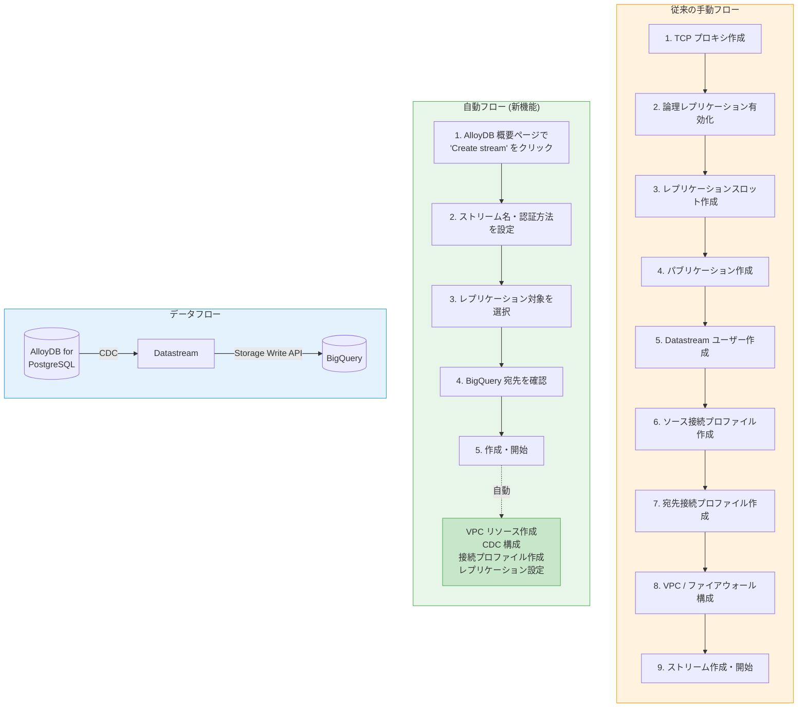

# Datastream: AlloyDB for PostgreSQL の概要ページからの自動フローによるストリーム作成

**リリース日**: 2026-04-16

**サービス**: Datastream

**機能**: AlloyDB for PostgreSQL の概要ページから自動フローを使用して Datastream ストリームを直接作成

**ステータス**: Feature

[このアップデートのインフォグラフィックを見る](https://takech9203.github.io/google-cloud-news-summary/20260416-datastream-alloydb-automated-flow.html)

## 概要

Google Cloud は、AlloyDB for PostgreSQL のインスタンス概要ページから直接 Datastream ストリームを作成できる自動フロー (Automated Flow) 機能を発表しました。この機能により、AlloyDB から BigQuery へのデータレプリケーションプロセスが大幅に簡素化され、従来必要だった複数の手動ステップが自動化されます。

自動フローは、VPC 接続のセキュリティ設定、データベース構成、ストリーム接続リソースの作成を Datastream が自動的に処理します。これにより、データエンジニアやデータベース管理者は、複雑なネットワーク構成やレプリケーション設定を個別に行うことなく、数クリックで AlloyDB のデータを BigQuery に継続的にストリーミングできるようになります。

この機能は、AlloyDB for PostgreSQL を使用してトランザクションワークロードを処理しつつ、BigQuery でリアルタイム分析を実行したいチームに特に有用です。従来の手動フローでは TCP プロキシの設定、論理レプリケーションの構成、接続プロファイルの作成など多くのステップが必要でしたが、自動フローではこれらがすべてバックグラウンドで処理されます。

**アップデート前の課題**

AlloyDB for PostgreSQL から BigQuery へデータをストリーミングするには、従来以下のような複雑な手順が必要でした。

- TCP プロキシの手動セットアップ: Datastream が AlloyDB インスタンスに接続するため、コンシューマープロジェクト内に TCP プロキシを手動で作成・構成する必要があった
- 論理レプリケーションの手動構成: AlloyDB の `alloydb.logical_decoding` フラグの有効化、レプリケーションスロットの作成、パブリケーションの作成、専用ユーザーの作成と権限付与を個別に実行する必要があった
- 接続プロファイルの個別作成: Datastream コンソールでソース接続プロファイルと BigQuery 宛先接続プロファイルをそれぞれ手動で作成する必要があった
- VPC ネットワーク構成の手動管理: プライベート接続構成、ファイアウォールルール、IP アドレス範囲の割り当てなどを個別に設定する必要があった

**アップデート後の改善**

今回のアップデートにより、以下の改善が実現しました。

- AlloyDB の概要ページから直接「Create stream」ボタンでストリームを作成可能になった
- VPC リソース (内部 IP アドレス範囲、サブネットワーク、ネットワークアタッチメント) が自動的に作成されるようになった
- CDC 用のテーブル構成、レプリケーションスロット、パブリケーション、専用 Datastream ユーザーが自動的にセットアップされるようになった
- プライベート接続構成およびソース・宛先の接続プロファイルが自動的に作成されるようになった
- ストリームのモニタリングが AlloyDB インスタンスの概要ページから直接確認可能になった

## アーキテクチャ図



上図は、従来の手動フロー (9 ステップ) と新しい自動フロー (5 ステップ + 自動処理) の比較、および AlloyDB から BigQuery へのデータフローを示しています。自動フローでは、VPC リソース作成や CDC 構成などの複雑な処理がバックグラウンドで自動実行されます。

## サービスアップデートの詳細

### 主要機能

1. **AlloyDB 概要ページからのワンクリックストリーム作成**
   - AlloyDB for PostgreSQL インスタンスの概要ページに「Stream data into BigQuery」セクションが追加され、「Create stream」ボタンから直接ストリームを作成可能
   - Datastream コンソールに移動することなく、AlloyDB の管理画面内で完結するワークフロー

2. **インフラストラクチャの自動プロビジョニング**
   - VPC リソース (内部 IP アドレス範囲、サブネットワーク、ネットワークアタッチメント) の自動作成
   - プライベート接続構成の自動セットアップ
   - ソースおよび宛先の接続プロファイルの自動作成
   - Private Service Connect インターフェースを使用した接続タイプのサポート

3. **データベースレプリケーションの自動構成**
   - CDC (Change Data Capture) 用テーブルの自動構成
   - レプリケーションスロットの自動セットアップ
   - 全テーブル用パブリケーションの自動作成
   - 専用 Datastream ユーザーの自動作成と権限付与

4. **概要ページからのストリームモニタリング**
   - ストリームステータス、ストリーム名、宛先 BigQuery データセット、宛先プロジェクト ID を AlloyDB の概要ページで確認可能
   - ストリームの開始、停止、一時停止アクションを概要ページから直接実行可能
   - より詳細なモニタリングが必要な場合はストリーム名をクリックして Datastream に遷移

## 技術仕様

### 自動フローの要件と構成

| 項目 | 詳細 |
|------|------|
| サポートソース | AlloyDB for PostgreSQL |
| 宛先 | BigQuery |
| 接続要件 | Private Services Access が有効であること |
| 接続タイプ | Private Service Connect インターフェース |
| 認証方式 | IAM データベース認証 / ビルトインデータベース認証 |
| CDC 方式 | PostgreSQL 論理デコーディング (pgoutput プラグイン) |
| 書き込みモード | Merge (デフォルト) / Append-only |
| 最大イベントサイズ | 20 MB |

### 自動作成されるリソース

| リソース | 説明 |
|----------|------|
| VPC 内部 IP アドレス範囲 | Datastream とソース間の通信用 |
| サブネットワーク | プライベート接続用のネットワークセグメント |
| ネットワークアタッチメント | VPC ネットワーク間の接続ポイント |
| プライベート接続構成 | セキュアなプライベートネットワーク接続 |
| ソース接続プロファイル | AlloyDB への接続情報 |
| 宛先接続プロファイル | BigQuery への接続情報 |
| レプリケーションスロット | PostgreSQL の論理レプリケーション用スロット |
| パブリケーション | レプリケーション対象テーブルのグループ |
| Datastream ユーザー | レプリケーション権限を持つ専用ユーザー |

### 認証方式の選択

```
IAM データベース認証を使用する場合:
  - ユーザーに IAM プリンシパル ID が割り当てられている必要あり
  - 手動で cloudsqlsuperuser ロールと CREATEROLE 権限を付与する必要あり

  GRANT cloudsqlsuperuser TO "USER_NAME";
  ALTER ROLE "USER_NAME" CREATEROLE;

ビルトインデータベース認証を使用する場合:
  - cloudsqlsuperuser ロールを持つユーザー名とパスワードを指定
  - レプリケーション対象テーブルへの GRANT 権限が必要
```

## 設定方法

### 前提条件

1. Datastream、Network Connectivity、Compute Engine API が有効化されていること
2. Datastream リソースの作成・管理に必要な IAM 権限が付与されていること
3. AlloyDB for PostgreSQL インスタンスが Private Services Access を使用するよう構成されていること
4. (推奨) ストリーム作成前に論理レプリケーションを有効化しておくこと (有効化していない場合、Datastream が自動で有効化しますが、インスタンスの再起動が発生します)

### 手順

#### ステップ 1: AlloyDB 概要ページへ移動

Google Cloud コンソールで対象の AlloyDB for PostgreSQL インスタンスの概要ページを開きます。「Stream data into BigQuery」セクションの「Create stream」ボタンをクリックします。

#### ステップ 2: ストリーム基本設定

「Get started」ページで以下を設定します。

- **ストリーム名**: 任意のストリーム名を入力 (一意の識別子が自動生成されます)
- **認証方式**: IAM データベース認証またはビルトインデータベース認証を選択
- **追加設定**: リージョン、暗号化、ラベルなどを必要に応じて変更

「Continue」をクリックします。

#### ステップ 3: ソースの構成

「Configure stream source」ページで以下を設定します。

- レプリケーション対象のデータベースを選択
- レプリケーション対象オブジェクト (テーブル) を選択 (デフォルトでは権限のある全オブジェクトが選択済み)
- バックフィルモードや最大同時バックフィル接続数などの詳細設定を必要に応じて変更

「Continue」をクリックします。

#### ステップ 4: 宛先の構成

「Configure destination」ページで BigQuery 宛先の設定を確認・調整します。

- データセット構成 (スキーマごとのデータセット / 単一データセット)
- 書き込みモード (Merge / Append-only)
- データ鮮度 (max_staleness) の設定

#### ステップ 5: ストリームの作成と開始

- 「Create and start later」で後から手動開始、または「Start」で即時開始を選択
- 自動実行されるタスク (VPC リソース作成、CDC 構成、接続プロファイル作成) の確認ダイアログが表示されます
- 確認して作成を実行

## メリット

### ビジネス面

- **Time-to-Value の大幅短縮**: 従来数時間かかっていた設定作業が数分に短縮され、データ分析基盤の構築を迅速に開始できる
- **運用コストの削減**: インフラストラクチャの手動構成が不要になり、データエンジニアは高付加価値な分析作業に集中できる
- **リアルタイム分析の民主化**: 複雑なネットワーク・データベース知識がなくても、AlloyDB のデータを BigQuery でリアルタイムに分析可能になる

### 技術面

- **設定ミスの防止**: 手動構成で発生しがちなネットワーク設定やレプリケーション構成のエラーを自動化により排除
- **一貫したセキュリティ**: Private Service Connect を使用したセキュアな接続が自動的に確立され、ベストプラクティスに準拠した構成が保証される
- **統合管理**: AlloyDB の概要ページからストリームの状態監視と操作が可能になり、複数のコンソール間を行き来する必要がなくなる

## デメリット・制約事項

### 制限事項

- 自動フローは AlloyDB for PostgreSQL から BigQuery へのレプリケーションのみをサポートしており、Cloud Storage への宛先は対象外
- Private Services Access が有効で、Private Service Connect インターフェースの接続タイプを使用するインスタンスのみが対象
- ストリームを削除する際、一部のリソース (パブリケーション、Datastream リーダーユーザー、接続プロファイル、プライベート接続リソース、ネットワークリソース) は手動で削除する必要がある
- 論理レプリケーションが有効化されていない場合、Datastream が自動で有効化するが、ソースインスタンスの再起動が発生する

### 考慮すべき点

- BigQuery の CDC コストは Datastream とは別に課金されるため、max_staleness パラメータの適切なチューニングが重要
- 自動フローで作成されたリソースの管理責任は利用者側にあり、不要になった場合は手動でのクリーンアップが必要
- レプリケーション対象テーブルが多い場合、ソースデータベースと Datastream の負荷が増加する可能性がある
- パブリケーションはデータベース管理者ユーザーで作成されるため、削除はその所有者のみが実行可能

## ユースケース

### ユースケース 1: HTAP (Hybrid Transactional/Analytical Processing) の実現

**シナリオ**: EC サイトの注文管理システムが AlloyDB for PostgreSQL 上で稼働しており、マーケティングチームが注文データのリアルタイム分析を BigQuery で実行したい場合。

**実装例**:
```
1. AlloyDB の概要ページで「Create stream」をクリック
2. 注文関連テーブル (orders, order_items, customers) を選択
3. BigQuery の宛先データセットを指定
4. 書き込みモードを「Merge」に設定して開始
```

**効果**: 注文データが数秒以内に BigQuery に反映され、マーケティングチームはリアルタイムで売上ダッシュボードや顧客行動分析を実行可能。従来のバッチ ETL と比較してデータ鮮度が大幅に向上。

### ユースケース 2: 本番データベースへの影響を最小化したレポーティング

**シナリオ**: 金融サービス企業が AlloyDB で取引処理を行いながら、規制レポートの生成に BigQuery を使用したい場合。AlloyDB への分析クエリの負荷を避けたい。

**効果**: AlloyDB のトランザクション処理性能に影響を与えることなく、BigQuery 上で大規模な集計や複雑な分析クエリを実行可能。レポート生成の SLA を確保しつつ、本番システムの安定性を維持。

### ユースケース 3: マイクロサービスのイベントデータ統合

**シナリオ**: 複数のマイクロサービスがそれぞれ AlloyDB インスタンスを使用しており、全サービスのデータを BigQuery に集約して横断的な分析を行いたい場合。

**効果**: 各 AlloyDB インスタンスの概要ページから自動フローでストリームを作成するだけで、全サービスのデータが BigQuery に統合される。データパイプラインの構築・保守の工数を大幅に削減。

## 料金

Datastream は、ソースから宛先に処理されたデータ量 (GB) に基づいて課金されます。BigQuery へのストリーミング時には、Datastream の料金に加えて BigQuery の料金 (Storage Write API 使用分、ストレージ、CDC マージジョブの計算リソース) が別途発生します。

### 料金例

| 項目 | 月額料金 (概算) |
|------|-----------------|
| Datastream データ処理 (100 GB/月) | 料金は処理データ量に比例 (詳細は [Datastream Pricing](https://cloud.google.com/datastream/pricing) を参照) |
| BigQuery ストレージ (100 GB) | BigQuery ストレージ料金に準拠 |
| BigQuery CDC マージジョブ | Analysis SKU として課金 (BigQuery Reservations の利用を推奨) |

**コスト最適化のポイント**:
- BigQuery の `max_staleness` パラメータを適切に設定し、不要に高頻度なマージジョブを回避
- BigQuery Reservations を購入して CDC マージジョブのコストを予測可能にする
- レプリケーション対象テーブルを必要最小限に絞ることでデータ処理量を抑制

## 利用可能リージョン

Datastream は全ての Google Cloud リージョンで利用可能です (2021 年 11 月の GA 以降)。2025 年 12 月には europe-west10 (Berlin)、europe-west12 (Turin)、me-central1 (Doha)、me-west1 (Tel Aviv) が追加され、2025 年 6 月には northamerica-south1 (Mexico) が追加されています。利用可能なリージョンの完全なリストは [IP allowlists and regions](https://cloud.google.com/datastream/docs/ip-allowlists-and-regions) を参照してください。

なお、AlloyDB for PostgreSQL のインスタンスと Datastream ストリームは同一リージョンに配置することが推奨されます。BigQuery データセットのロケーションも同一リージョンに設定することで、コストとパフォーマンスの最適化が可能です。

## 関連サービス・機能

- **AlloyDB for PostgreSQL**: フルマネージドの PostgreSQL 互換データベースサービス。今回のアップデートのデータソース
- **BigQuery**: サーバーレスのデータウェアハウス。Datastream のストリーミング先として CDC データをリアルタイムで受信
- **Datastream**: サーバーレスの CDC およびレプリケーションサービス。AlloyDB と BigQuery 間のデータ同期を担当
- **Private Service Connect**: Google Cloud のプライベートネットワーク接続機能。自動フローで自動的に構成される
- **Cloud SQL 用自動フロー**: Cloud SQL for PostgreSQL、MySQL、SQL Server でも同様の自動フロー機能が提供されている

## 参考リンク

- [インフォグラフィック](https://takech9203.github.io/google-cloud-news-summary/20260416-datastream-alloydb-automated-flow.html)
- [公式リリースノート](https://cloud.google.com/release-notes#April_16_2026)
- [自動フローを使用した AlloyDB for PostgreSQL ストリームの作成](https://cloud.google.com/datastream/docs/create-a-stream-automated)
- [AlloyDB for PostgreSQL の CDC 構成](https://cloud.google.com/datastream/docs/configure-alloydb-psql)
- [Datastream ドキュメント](https://cloud.google.com/datastream/docs)
- [Datastream 料金ページ](https://cloud.google.com/datastream/pricing)
- [BigQuery CDC ドキュメント](https://cloud.google.com/bigquery/docs/change-data-capture)

## まとめ

今回のアップデートにより、AlloyDB for PostgreSQL から BigQuery へのデータレプリケーションが大幅に簡素化されました。従来は TCP プロキシの構築、論理レプリケーションの構成、接続プロファイルの作成など多数の手動ステップが必要でしたが、自動フローにより AlloyDB の概要ページから数クリックで完了できるようになりました。AlloyDB を OLTP ワークロードに使用しながら BigQuery でリアルタイム分析を行いたいチームは、この自動フローを活用することで、データパイプラインの構築時間を大幅に短縮し、より迅速にビジネスインサイトを得ることが可能です。

---

**タグ**: #Datastream #AlloyDB #BigQuery #CDC #データレプリケーション #自動フロー #PostgreSQL #リアルタイム分析
