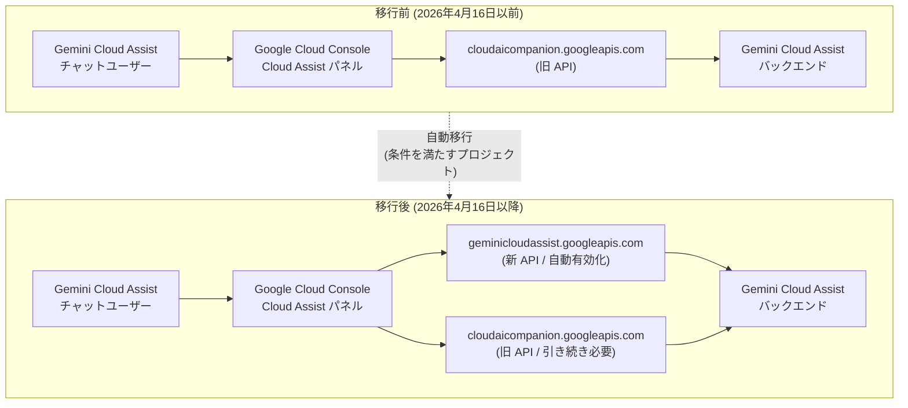

# Gemini Cloud Assist: geminicloudassist API の自動有効化によるチャットユーザーのシームレス移行

**リリース日**: 2026-04-16

**サービス**: Gemini Cloud Assist

**機能**: geminicloudassist API のチャットユーザー向け自動有効化

**ステータス**: Announcement

[このアップデートのインフォグラフィックを見る](https://takech9203.github.io/google-cloud-news-summary/20260416-gemini-cloud-assist-api-auto-enabled.html)

## 概要

2026 年 4 月 16 日より、Gemini Cloud Assist チャットを利用していたプロジェクトに対して、`geminicloudassist.googleapis.com` API が自動的に有効化されました。これは、Gemini Cloud Assist のバックエンド API が `cloudaicompanion.googleapis.com` から `geminicloudassist.googleapis.com` へ移行する一連のプロセスの一環であり、既存ユーザーがサービスの中断なく新しい API 基盤を利用できるようにするための措置です。

自動有効化の対象となったのは、以下の 3 つの条件を全て満たすプロジェクトです。(1) 過去 60 日以内に Gemini Cloud Assist チャットを使用していた、(2) 2026 年 4 月 16 日時点で `cloudaicompanion.googleapis.com` API が有効だった、(3) 2026 年 4 月 16 日時点で `geminicloudassist.googleapis.com` API が有効でなかった。これにより、対象のユーザーは何のアクションも必要とせず、シームレスに新しい API 基盤へ移行されました。

この変更は、Google Cloud が Gemini Cloud Assist のブランディングとアーキテクチャを統一するために段階的に進めてきた API 移行計画の重要なステップです。2026 年 4 月 8 日の IAM パーミッション変更 (`cloudaicompanion.instances.completeTask` から `geminicloudassist.agents.invoke` への置き換え) に続き、今回の API 自動有効化により、既存の全アクティブユーザーが新しい API エンドポイントを通じてサービスを利用できる状態が整いました。

**アップデート前の課題**

- Gemini Cloud Assist チャット機能が `cloudaicompanion.googleapis.com` API に依存しており、新しい `geminicloudassist.googleapis.com` API が有効化されていないプロジェクトでは、移行後にサービスが利用できなくなるリスクがあった
- 管理者が各プロジェクトで手動で新しい API を有効化する必要があり、大規模な組織では見落としや対応遅延が発生する恐れがあった
- 2 つの API (`cloudaicompanion` と `geminicloudassist`) の関係や依存関係が複雑で、どちらを有効にすべきか管理者にとって判断が難しかった

**アップデート後の改善**

- 条件を満たすプロジェクトに対して `geminicloudassist.googleapis.com` API が自動有効化され、管理者の手動対応が不要になった
- 既存の Gemini Cloud Assist チャットユーザーはサービスの中断を経験することなく、新しい API 基盤へシームレスに移行された
- 両方の API (`cloudaicompanion.googleapis.com` と `geminicloudassist.googleapis.com`) が依存関係として揃い、Gemini Cloud Assist の全機能が安定して利用可能な状態になった

## アーキテクチャ図



移行前は `cloudaicompanion.googleapis.com` API のみでチャット機能が提供されていましたが、移行後は `geminicloudassist.googleapis.com` API が主要なエンドポイントとなり、`cloudaicompanion.googleapis.com` も引き続き依存関係として必要です。条件を満たすプロジェクトでは、新 API が自動的に有効化されました。

## サービスアップデートの詳細

### 主要機能

1. **自動 API 有効化**
   - 条件を満たすプロジェクトに対して `geminicloudassist.googleapis.com` API を自動的に有効化
   - 管理者の手動操作は不要で、サービスの継続性が保証される
   - 対象条件: 過去 60 日以内のチャット利用 + `cloudaicompanion` API 有効 + `geminicloudassist` API 未有効

2. **デュアル API 依存関係の確立**
   - Gemini Cloud Assist の利用には `geminicloudassist.googleapis.com` と `cloudaicompanion.googleapis.com` の両方が必要
   - `geminicloudassist.googleapis.com` を有効化すると、`cloudaicompanion.googleapis.com` も自動的に有効化される (逆は自動ではない)
   - いずれかの API を無効化しても、もう一方のステータスは変更されない

3. **段階的な API 移行の完了**
   - 2026 年 1 月: Gemini Cloud Assist のドキュメントとリリースノートの移行
   - 2026 年 4 月 6-8 日: IAM パーミッションの移行 (`cloudaicompanion.instances.completeTask` から `geminicloudassist.agents.invoke` へ)
   - 2026 年 4 月 16 日: アクティブチャットユーザーへの API 自動有効化 (今回のアップデート)

## 技術仕様

### API 移行の対応関係

| 項目 | 旧 (cloudaicompanion) | 新 (geminicloudassist) |
|------|----------------------|----------------------|
| API エンドポイント | `cloudaicompanion.googleapis.com` | `geminicloudassist.googleapis.com` |
| IAM パーミッション | `cloudaicompanion.instances.completeTask` | `geminicloudassist.agents.invoke` |
| IAM ロール | `roles/cloudaicompanion.user` | `roles/geminicloudassist.user` |
| チャット機能の提供 | 移行前のみ | 移行後 (主要) |
| API ステータス | 引き続き必要 (依存関係) | 新たに自動有効化 |

### 自動有効化の条件

| 条件 | 詳細 |
|------|------|
| チャット利用履歴 | 2026 年 3 月 17 日~4 月 16 日の 60 日間に Gemini Cloud Assist チャットを使用 |
| 旧 API ステータス | 2026 年 4 月 16 日時点で `cloudaicompanion.googleapis.com` が有効 |
| 新 API ステータス | 2026 年 4 月 16 日時点で `geminicloudassist.googleapis.com` が未有効 |

### 必要な IAM ロール

```text
# Gemini Cloud Assist の利用に必要なロール
roles/geminicloudassist.user    # Gemini Cloud Assist ユーザー (チャットと調査)
roles/recommender.viewer        # Recommender の閲覧 (推奨)

# カスタムロールの場合に必要なパーミッション
geminicloudassist.agents.invoke     # 新パーミッション (2026年4月8日~)
geminicloudassist.instances.explain
geminicloudassist.investigations.create
geminicloudassist.investigations.list
```

## 設定方法

### 前提条件

1. Google Cloud プロジェクトが作成済みであること
2. プロジェクトに対する適切な管理権限 (オーナーまたは編集者ロール) を持っていること

### 手順

#### ステップ 1: API の有効化状態の確認

```bash
# geminicloudassist API の有効化状態を確認
gcloud services list --enabled --filter="name:geminicloudassist.googleapis.com" \
  --project=PROJECT_ID

# cloudaicompanion API の有効化状態を確認
gcloud services list --enabled --filter="name:cloudaicompanion.googleapis.com" \
  --project=PROJECT_ID
```

自動有効化の対象プロジェクトであれば、両方の API が有効化されているはずです。

#### ステップ 2: 手動での API 有効化 (対象外プロジェクトの場合)

```bash
# geminicloudassist API を手動で有効化
# (cloudaicompanion API も自動的に有効化される)
gcloud services enable geminicloudassist.googleapis.com \
  --project=PROJECT_ID
```

API を使用した有効化も可能です。

```bash
curl -X POST \
  -H "Authorization: Bearer $(gcloud auth print-access-token)" \
  "https://serviceusage.googleapis.com/v1/projects/PROJECT_ID/services/geminicloudassist.googleapis.com:enable"
```

#### ステップ 3: IAM ロールの確認と更新

```bash
# 現在の IAM ポリシーを確認
gcloud projects get-iam-policy PROJECT_ID \
  --flatten="bindings[].members" \
  --filter="bindings.role:roles/geminicloudassist.user OR bindings.role:roles/cloudaicompanion.user"

# 必要に応じて geminicloudassist.user ロールを付与
gcloud projects add-iam-policy-binding PROJECT_ID \
  --member="user:USER_EMAIL" \
  --role="roles/geminicloudassist.user"
```

カスタム IAM ロールを使用している場合は、`cloudaicompanion.instances.completeTask` パーミッションを `geminicloudassist.agents.invoke` に置き換えてください (2026 年 4 月 8 日の Breaking Change 対応)。

## メリット

### ビジネス面

- **サービスの継続性保証**: 自動有効化により、管理者の対応漏れによるサービス中断リスクをゼロに低減
- **管理工数の削減**: 大規模組織で多数のプロジェクトを運用している場合でも、個別の手動対応が不要
- **ブランド統一による分かりやすさ**: API 名が `geminicloudassist` に統一されることで、サービスの識別性と管理の明確性が向上

### 技術面

- **シームレスな移行**: エンドユーザーの操作やワークフローに変更は不要で、バックエンドの API 基盤のみが更新される
- **デュアル API アーキテクチャ**: 両方の API が依存関係として維持されることで、後方互換性を保ちつつ新しいアーキテクチャへの移行が実現
- **段階的な移行戦略**: ドキュメント移行、IAM パーミッション変更、API 自動有効化と段階的に進めることで、各ステップでの影響を最小化

## デメリット・制約事項

### 制限事項

- 自動有効化の対象は、過去 60 日以内にチャットを利用したプロジェクトに限定される。60 日以上チャットを利用していなかったプロジェクトは対象外のため、再利用時に手動での API 有効化が必要
- `geminicloudassist.googleapis.com` を有効化しても `cloudaicompanion.googleapis.com` は自動で有効化されるが、いずれかを無効化してももう一方のステータスは変更されないため、無効化時には両方の API を個別に管理する必要がある
- VPC Service Controls ペリメータ内での Gemini Cloud Assist 調査 (investigations) は 2026 年 4 月 13 日以降サポートされなくなっている (別途アナウンス済み)

### 考慮すべき点

- カスタム IAM ロールを使用している場合、2026 年 4 月 8 日の Breaking Change に対応して `geminicloudassist.agents.invoke` パーミッションへの更新が別途必要
- 組織ポリシーで API の有効化を制限している場合、自動有効化がブロックされる可能性がある。その場合は組織管理者に確認が必要
- 監査ログやコンプライアンスの観点から、自動有効化されたプロジェクトの一覧を把握しておくことを推奨

## ユースケース

### ユースケース 1: 大規模組織での一括移行

**シナリオ**: 数百のプロジェクトで Gemini Cloud Assist を利用している大規模企業で、全プロジェクトの API 移行を管理する必要がある。

**実装例**:
```bash
# 組織内の全プロジェクトで geminicloudassist API の有効化状態を確認
for project in $(gcloud projects list --format="value(projectId)"); do
  status=$(gcloud services list --enabled \
    --filter="name:geminicloudassist.googleapis.com" \
    --project="$project" --format="value(name)" 2>/dev/null)
  if [ -z "$status" ]; then
    echo "未有効化: $project"
  else
    echo "有効化済み: $project"
  fi
done
```

**効果**: 自動有効化によりアクティブなプロジェクトの大部分が対応済みとなり、管理者は未有効化のプロジェクトのみにフォーカスして手動対応できる。

### ユースケース 2: カスタム IAM ロールの移行確認

**シナリオ**: カスタム IAM ロールで Gemini Cloud Assist へのアクセスを管理しており、API 移行に伴うパーミッション変更への対応が必要。

**実装例**:
```bash
# カスタムロールに含まれる旧パーミッションを確認
gcloud iam roles list --project=PROJECT_ID \
  --filter="includedPermissions:cloudaicompanion.instances.completeTask" \
  --format="table(name, title)"

# カスタムロールのパーミッションを更新
gcloud iam roles update ROLE_ID --project=PROJECT_ID \
  --remove-permissions=cloudaicompanion.instances.completeTask \
  --add-permissions=geminicloudassist.agents.invoke
```

**効果**: API の自動有効化と IAM パーミッションの更新を合わせて行うことで、完全な移行を実現できる。

## 料金

Gemini Cloud Assist チャット機能はプレビュー段階であり、現時点では無料で利用できます。API の自動有効化自体に追加料金は発生しません。

| 項目 | 料金 |
|------|------|
| Gemini Cloud Assist チャット | 無料 (プレビュー期間中) |
| API 有効化 | 無料 |
| 推奨 API (Cloud Monitoring、Cloud Logging 等) | 各サービスの料金体系に準じる |

## 利用可能リージョン

Gemini Cloud Assist チャットは Google Cloud Console 上で利用できるグローバルサービスです。ただし、会話データは任意の Google Cloud データセンターに保存される可能性があるため、データ所在地に関する規制要件がある場合は注意が必要です。

## 関連サービス・機能

- **Gemini Cloud Assist チャットパネル**: Google Cloud Console に組み込まれた AI アシスタント。自然言語でクラウドリソースの管理や質問への回答を提供
- **Gemini Cloud Assist 調査 (Investigations)**: クラウドインフラのトラブルシューティングを AI が支援する機能。`geminicloudassist.googleapis.com` API に依存
- **Gemini Code Assist**: IDE やエディタ上でコード補完や生成を提供する関連サービス。API は `cloudaicompanion.googleapis.com` を共有するが、独立した機能
- **Application Design Center**: Gemini Cloud Assist と連携し、リソース構成の生成やアーキテクチャ設計を支援する機能

## 参考リンク

- [インフォグラフィック](https://takech9203.github.io/google-cloud-news-summary/20260416-gemini-cloud-assist-api-auto-enabled.html)
- [公式リリースノート](https://docs.cloud.google.com/release-notes#April_16_2026)
- [Gemini Cloud Assist リリースノート](https://docs.cloud.google.com/cloud-assist/release-notes)
- [Gemini Cloud Assist のセットアップ](https://docs.cloud.google.com/cloud-assist/set-up-gemini)
- [Gemini Cloud Assist チャットパネル](https://docs.cloud.google.com/cloud-assist/chat-panel)
- [Gemini Cloud Assist の推奨 API](https://docs.cloud.google.com/cloud-assist/api-recommendations)
- [非推奨の IAM パーミッション](https://docs.cloud.google.com/cloud-assist/deprecations/permissions)
- [Gemini Cloud Assist の無効化](https://docs.cloud.google.com/cloud-assist/turn-off)

## まとめ

今回の `geminicloudassist.googleapis.com` API の自動有効化は、Gemini Cloud Assist の API 基盤を `cloudaicompanion` から `geminicloudassist` へ移行する段階的プロセスの重要なマイルストーンです。過去 60 日以内にチャット機能を利用していたプロジェクトに対して自動的に新 API が有効化されたことで、既存ユーザーはサービス中断を経験することなくシームレスに移行されました。カスタム IAM ロールを使用している場合は、2026 年 4 月 8 日の Breaking Change に対応して `geminicloudassist.agents.invoke` パーミッションへの更新も忘れずに行うことを推奨します。

---

**タグ**: #GeminiCloudAssist #API移行 #cloudaicompanion #geminicloudassist #自動有効化 #IAM #GoogleCloudConsole #チャット #Announcement
