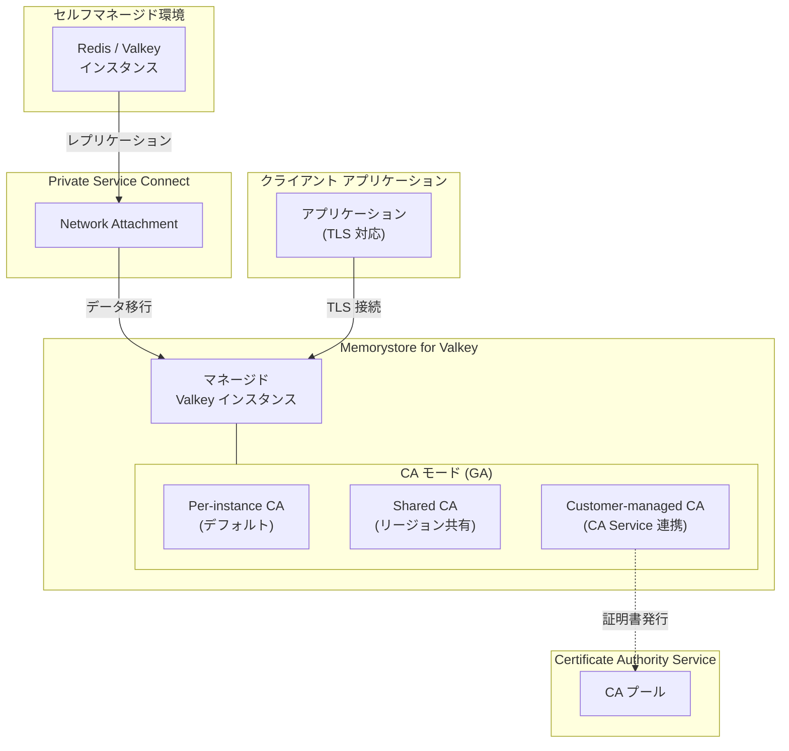

# Memorystore for Valkey: セルフマネージド Redis/Valkey マイグレーション (Preview) および Shared/Customer-managed CA モード (GA)

**リリース日**: 2026-04-16

**サービス**: Memorystore for Valkey

**機能**: セルフマネージド Redis/Valkey インスタンスからのマイグレーション (Preview) / Shared および Customer-managed CA モード (GA)

**ステータス**: Preview + GA

[このアップデートのインフォグラフィックを見る](https://takech9203.github.io/google-cloud-news-summary/20260416-memorystore-valkey-migration-ca-modes.html)

## 概要

Google Cloud は Memorystore for Valkey に関する 2 つの重要なアップデートを発表しました。1 つ目は、Google Cloud Platform 上で自己管理 (セルフマネージド) している Redis および Valkey インスタンスから Memorystore for Valkey へワークロードをマイグレーションできる機能が Preview として利用可能になったことです。2 つ目は、転送中暗号化 (in-transit encryption) における Shared CA (共有認証局) モードおよび Customer-managed CA (顧客管理認証局) モードが GA (一般提供) になったことです。

マイグレーション機能は、セルフマネージド環境で Redis や Valkey を運用している組織が、フルマネージドサービスである Memorystore for Valkey への移行を大幅に簡素化します。Private Service Connect のネットワークアタッチメントを介してソースインスタンスに接続し、レプリケーションベースのデータ移行を実行するため、ダウンタイムを最小限に抑えた移行が可能です。

CA モードの GA は、Memorystore for Valkey のセキュリティ態勢を強化するものです。Shared CA はリージョンごとに 1 つの CA 証明書バンドルを共有することで証明書管理を簡素化し、Customer-managed CA は Certificate Authority Service を通じて独自の CA プールを使用することでコンプライアンス要件に対応します。

**アップデート前の課題**

- セルフマネージド Redis/Valkey インスタンスから Memorystore for Valkey へのマイグレーションには、手動でのデータ移行、デュアルライト、クライアントライブラリの切り替えなど複雑な手順が必要だった
- Per-instance CA モードのみが利用可能で、インスタンスごとに個別の CA 証明書をダウンロード・管理する必要があり、大規模環境では証明書管理の負担が大きかった
- コンプライアンス要件で独自の CA 管理が必要な組織は、Memorystore for Valkey の in-transit encryption を効果的に活用できなかった

**アップデート後の改善**

- gcloud CLI から `start-migration` コマンドを実行するだけで、セルフマネージド Redis/Valkey から Memorystore for Valkey へのレプリケーションベースのマイグレーションを開始できるようになった
- Shared CA モードにより、同一リージョン内の全インスタンスで 1 つの CA 証明書バンドルを共有でき、証明書管理のオーバーヘッドが大幅に削減された
- Customer-managed CA モードにより、Certificate Authority Service 上の独自 CA プールを使用した in-transit encryption が本番環境で安心して利用可能になった

## アーキテクチャ図



上図は、セルフマネージド Redis/Valkey インスタンスから Memorystore for Valkey へのマイグレーションフローと、3 つの CA モードの関係を示しています。マイグレーションは Private Service Connect Network Attachment を介してレプリケーションで実行され、CA モードはインスタンス作成時に選択します。

## サービスアップデートの詳細

### 主要機能

1. **セルフマネージド Redis/Valkey マイグレーション (Preview)**
   - Google Cloud Platform 上で稼働するセルフマネージド Redis または Valkey インスタンスから Memorystore for Valkey へワークロードを移行する機能
   - Private Service Connect Network Attachment を使用してソースインスタンスとの安全な接続を確立
   - レプリケーションベースの移行により、移行中もソースインスタンスが稼働を継続
   - `forceFinishMigration` フラグにより、オフセット検証なしでの移行完了も可能

2. **Shared CA モード (GA)**
   - Google が管理するリージョン化された CA インフラストラクチャ
   - 同一リージョン内の全 Shared CA 対応インスタンスで 1 つの CA 証明書バンドルを共有
   - リージョンごとのグローバル証明書バンドルもダウンロード可能
   - 証明書の有効期限管理を簡素化し、クライアント側の証明書管理負担を軽減

3. **Customer-managed CA モード (GA)**
   - Certificate Authority Service 上の独自 CA プールを使用してサーバー証明書を発行
   - Root CA またはSubordinate CA のいずれも利用可能
   - オンデマンドでのサーバー証明書ローテーションをサポート
   - コンプライアンス要件に対応した自社管理の PKI インフラストラクチャとの統合

## 技術仕様

### マイグレーション設定 (MigrationConfig)

| 項目 | 詳細 |
|------|------|
| ソースタイプ | SelfManagedSource (セルフマネージド Redis/Valkey) |
| 必須パラメータ | IP アドレス、ポート番号、Network Attachment |
| 接続方式 | Private Service Connect Network Attachment |
| Network Attachment 要件 | 同一プロジェクト・同一リージョン、ソースと同じ VPC ネットワーク |
| 移行状態管理 | state フィールドで移行進捗を追跡 |
| 強制完了 | forceFinishMigration フラグで検証スキップ可能 |

### CA モード比較

| 項目 | Per-instance CA | Shared CA | Customer-managed CA |
|------|----------------|-----------|---------------------|
| 証明書管理 | インスタンスごと | リージョンごと | 顧客管理 |
| 証明書バンドル | インスタンス固有 | リージョン共有 | CA Service 経由 |
| 証明書ローテーション | 毎週自動 | 毎週自動 | 毎週自動 + オンデマンド |
| コンプライアンス対応 | 基本 | 基本 | 高度 (カスタム CA 階層) |
| TLS バージョン | 1.2 以降 | 1.2 以降 | 1.2 以降 |
| ステータス | GA | GA | GA |

### マイグレーション API 設定

```json
{
  "migrationConfig": {
    "state": "MIGRATING",
    "forceFinishMigration": false,
    "selfManagedSource": {
      "ipAddress": "10.0.0.1",
      "port": 6379,
      "networkAttachment": "projects/my-project/regions/us-central1/networkAttachments/my-network-attachment"
    }
  }
}
```

## 設定方法

### 前提条件

1. Google Cloud プロジェクトが有効であること
2. Memorystore for Valkey API が有効化されていること
3. 適切な IAM ロール (Memorystore Admin) が付与されていること
4. Customer-managed CA を使用する場合、Certificate Authority Service で CA プールが作成済みであること

### 手順

#### ステップ 1: セルフマネージドインスタンスからのマイグレーション開始

```bash
# Network Attachment の作成 (事前準備)
gcloud compute network-attachments create my-network-attachment \
    --region=us-central1 \
    --subnets=my-subnet \
    --connection-preference=ACCEPT_AUTOMATIC

# Memorystore for Valkey インスタンスの作成
gcloud memorystore instances create my-valkey-instance \
    --location=us-central1 \
    --endpoints='[{"connections": [{"pscAutoConnection": {"network": "projects/my-project/global/networks/my-network", "projectId": "my-project"}}]}]' \
    --replica-count=1 \
    --node-type=highmem-medium \
    --shard-count=3 \
    --engine-version=VALKEY_9_0

# マイグレーションの開始
gcloud beta memorystore instances start-migration my-valkey-instance \
    --project=my-project \
    --location=us-central1 \
    --self-managed-source-ip-address=10.0.0.1 \
    --self-managed-source-port=6379 \
    --self-managed-source-network-attachment=projects/my-project/regions/us-central1/networkAttachments/my-network-attachment
```

Private Service Connect Network Attachment を介してソースインスタンスとの接続を確立し、レプリケーションベースの移行を実行します。Network Attachment はソースインスタンスと同じ VPC ネットワーク内のサブネットに接続されている必要があります。

#### ステップ 2: Shared CA モードでインスタンスを作成

```bash
# Shared CA モードでインスタンスを作成
gcloud memorystore instances create my-shared-ca-instance \
    --location=us-central1 \
    --endpoints='[{"connections": [{"pscAutoConnection": {"network": "projects/my-project/global/networks/my-network", "projectId": "my-project"}}]}]' \
    --replica-count=1 \
    --node-type=highmem-medium \
    --shard-count=3 \
    --engine-version=VALKEY_9_0 \
    --transit-encryption-mode=server-authentication \
    --server-ca-mode=shared-cas-ca

# リージョンの CA 証明書バンドルをダウンロード
gcloud memorystore instances get-shared-regional-certificate-authority \
    --location=us-central1
```

Shared CA モードでは、リージョンごとに提供される CA 証明書バンドルをクライアントにインストールすることで、同一リージョン内の全 Shared CA 対応インスタンスに接続できます。

#### ステップ 3: Customer-managed CA モードでインスタンスを作成

```bash
# CA Service で CA プールを作成
gcloud privateca pools create my-ca-pool \
    --location=us-central1 \
    --tier=devops

# CA プール内に CA を作成
gcloud privateca roots create my-root-ca \
    --pool=my-ca-pool \
    --location=us-central1 \
    --subject="CN=My Root CA, O=My Organization"

# サービスアカウントに CA プールへのアクセス権を付与
gcloud privateca pools add-iam-policy-binding my-ca-pool \
    --location=us-central1 \
    --member="serviceAccount:service-PROJECT_NUMBER@gcp-sa-memorystore.iam.gserviceaccount.com" \
    --role="roles/privateca.certificateRequester"

# Customer-managed CA モードでインスタンスを作成
gcloud memorystore instances create my-cmca-instance \
    --location=us-central1 \
    --endpoints='[{"connections": [{"pscAutoConnection": {"network": "projects/my-project/global/networks/my-network", "projectId": "my-project"}}]}]' \
    --replica-count=1 \
    --node-type=highmem-medium \
    --shard-count=3 \
    --engine-version=VALKEY_9_0 \
    --transit-encryption-mode=server-authentication \
    --server-ca-mode=customer-managed-cas-ca \
    --server-ca-pool="projects/my-ca-pool-project/locations/us-central1/caPools/my-ca-pool"
```

Customer-managed CA モードでは、Certificate Authority Service 上に独自の CA プールを作成し、そこから発行される証明書を使用します。CA プールはインスタンスと同一リージョンに配置する必要があります。

## メリット

### ビジネス面

- **運用コストの削減**: セルフマネージド Redis/Valkey の運用管理 (パッチ適用、バックアップ、スケーリング、監視) をフルマネージドサービスに移行することで、インフラ管理の人的コストを削減
- **セキュリティ コンプライアンスの強化**: Customer-managed CA モードの GA 化により、金融・医療・政府機関などの厳格なコンプライアンス要件を持つ組織でも本番環境で安心して利用可能
- **移行リスクの低減**: レプリケーションベースの移行により、ダウンタイムを最小限に抑えてマネージドサービスへの段階的移行が可能

### 技術面

- **ゼロダウンタイム移行**: レプリケーションを活用した移行プロセスにより、ソースインスタンスの稼働を継続しながらデータ移行を実行
- **証明書管理の簡素化**: Shared CA モードにより、リージョン内の複数インスタンスで 1 つの証明書バンドルを共有し、証明書のローテーション管理を効率化
- **柔軟な CA 階層**: Customer-managed CA モードでは Root CA、Subordinate CA、外部 Root CA にチェインした Subordinate CA など、組織の PKI 要件に合わせた柔軟な CA 階層構成が可能
- **プロトコル互換性**: Valkey は Redis Serialization Protocol (RESP) を使用しており、既存の Redis クライアントライブラリをそのまま利用可能

## デメリット・制約事項

### 制限事項

- マイグレーション機能は現在 Preview であり、SLA の保証がない。本番環境での使用は慎重に検討する必要がある
- Network Attachment はソースインスタンスと同一プロジェクト・同一リージョン内に配置する必要があり、クロスリージョン移行は直接サポートされない
- Customer-managed CA モードでは CA プールの CA Service クォータに注意が必要。クォータ超過時にインスタンス操作が失敗する可能性がある
- in-transit encryption を有効化すると、暗号化・復号化のオーバーヘッドによりパフォーマンスが低下する可能性がある

### 考慮すべき点

- マイグレーション中はソースインスタンスの安定した IP アドレスとポートが必要。IP アドレスが変更されると移行が中断される
- Customer-managed CA モードでは、CA プール内に少なくとも 1 つの有効な CA が必要。CA が無効状態の場合、サーバー証明書の発行ができない
- Shared CA の証明書バンドルには有効期限があり、定期的な更新が必要。期限切れ前に新しいバンドルをダウンロードしてクライアントにインストールすること
- Per-instance CA モードから Shared CA または Customer-managed CA モードへの変更は、インスタンスの再作成が必要

## ユースケース

### ユースケース 1: EC サイトのセッション管理基盤の移行

**シナリオ**: 大規模 EC サイトで Compute Engine 上にセルフマネージド Redis クラスタを運用してセッション管理に使用しているが、パッチ適用やスケーリングの運用負荷が高い。ダウンタイムなしで Memorystore for Valkey に移行したい。

**実装例**:
```bash
# 1. Memorystore for Valkey インスタンスを作成
gcloud memorystore instances create session-store \
    --location=asia-northeast1 \
    --node-type=highmem-medium \
    --shard-count=3 \
    --replica-count=1 \
    --engine-version=VALKEY_9_0 \
    --endpoints='[{"connections": [{"pscAutoConnection": {"network": "projects/my-project/global/networks/production-vpc", "projectId": "my-project"}}]}]'

# 2. マイグレーション開始
gcloud beta memorystore instances start-migration session-store \
    --location=asia-northeast1 \
    --self-managed-source-ip-address=10.128.0.50 \
    --self-managed-source-port=6379 \
    --self-managed-source-network-attachment=projects/my-project/regions/asia-northeast1/networkAttachments/migration-attachment

# 3. レプリケーション完了後、アプリケーションの接続先を切り替え
```

**効果**: Redis クラスタの運用管理 (OS パッチ、メモリ管理、バックアップ、フェイルオーバー設定) が不要になり、SRE チームの運用負荷を大幅に削減。自動スケーリングにより、セール時のトラフィック急増にも自動対応が可能に。

### ユースケース 2: 金融機関のキャッシュ基盤における暗号化通信の強化

**シナリオ**: 金融機関のリアルタイム取引処理システムで Memorystore for Valkey をキャッシュとして利用しているが、監査要件により独自の CA 階層で in-transit encryption を管理する必要がある。

**実装例**:
```bash
# Customer-managed CA モードでインスタンスを作成
gcloud memorystore instances create trading-cache \
    --location=asia-northeast1 \
    --node-type=highmem-xlarge \
    --shard-count=5 \
    --replica-count=2 \
    --engine-version=VALKEY_9_0 \
    --transit-encryption-mode=server-authentication \
    --server-ca-mode=customer-managed-cas-ca \
    --server-ca-pool="projects/security-project/locations/asia-northeast1/caPools/trading-ca-pool" \
    --endpoints='[{"connections": [{"pscAutoConnection": {"network": "projects/my-project/global/networks/trading-vpc", "projectId": "my-project"}}]}]'
```

**効果**: 組織の既存 PKI インフラストラクチャと統合した CA 管理が可能になり、金融規制のコンプライアンス要件を満たしながら高性能なキャッシュ基盤を運用。オンデマンドの証明書ローテーションにより、セキュリティインシデント発生時の迅速な対応も可能。

## 料金

Memorystore for Valkey の料金はインスタンスのノードタイプとノード数に基づきます。マイグレーション機能自体に追加料金は発生しませんが、移行先の Memorystore for Valkey インスタンスの通常料金が適用されます。Customer-managed CA モードを使用する場合は、Certificate Authority Service の料金が別途発生します。

### 料金例

| 構成 | 月額料金 (概算、us-central1) |
|--------|-----------------|
| highmem-medium x 3 シャード + 1 レプリカ (6 ノード) | 約 $1,200 - $1,800 |
| highmem-xlarge x 5 シャード + 2 レプリカ (15 ノード) | 約 $8,000 - $12,000 |
| standard-small x 3 シャード + 1 レプリカ (6 ノード) | 約 $600 - $900 |

※ 料金は最新の公式料金ページをご確認ください。Certificate Authority Service の料金はCA プールの使用量に応じて別途発生します。

## 利用可能リージョン

マイグレーション機能は Memorystore for Valkey が利用可能な全リージョンで Preview として利用可能です。Shared CA および Customer-managed CA モードも、Memorystore for Valkey がサポートする全リージョンで GA として利用可能です。日本では `asia-northeast1` (東京)、`asia-northeast2` (大阪) の両リージョンで利用できます。Shared CA のリージョン別証明書バンドルは Google Cloud Storage からダウンロード可能です。

## 関連サービス・機能

- **Certificate Authority Service**: Customer-managed CA モードで使用する CA プールのホスティングサービス。独自の Root CA や Subordinate CA を作成・管理
- **Private Service Connect**: マイグレーション時のネットワーク接続に使用。Network Attachment を通じてソースインスタンスとの安全な接続を確立
- **Memorystore for Redis**: 従来の Redis マネージドサービス。Memorystore for Valkey は Redis 互換のプロトコルを使用しており、Redis からの移行パスも提供
- **Cloud Monitoring**: Memorystore for Valkey インスタンスの使用状況やパフォーマンスメトリクスを監視。マイグレーション中の監視にも活用
- **IAM 認証**: Memorystore for Valkey は IAM 認証をサポートしており、CA モードと組み合わせてゼロトラストセキュリティモデルを実現

## 参考リンク

- [インフォグラフィック](https://takech9203.github.io/google-cloud-news-summary/20260416-memorystore-valkey-migration-ca-modes.html)
- [公式リリースノート](https://cloud.google.com/release-notes#April_16_2026)
- [Memorystore for Valkey ドキュメント](https://docs.cloud.google.com/memorystore/docs/valkey)
- [マイグレーション CLI リファレンス (gcloud beta memorystore instances start-migration)](https://docs.cloud.google.com/sdk/gcloud/reference/beta/memorystore/instances/start-migration)
- [Shared CA の使用方法](https://docs.cloud.google.com/memorystore/docs/valkey/use-shared-ca)
- [Customer-managed CA の使用方法](https://docs.cloud.google.com/memorystore/docs/valkey/use-customer-managed-ca)
- [in-transit encryption の概要](https://docs.cloud.google.com/memorystore/docs/valkey/about-in-transit-encryption)
- [Memorystore for Valkey 料金ページ](https://cloud.google.com/memorystore/docs/valkey/pricing)

## まとめ

今回のアップデートにより、Memorystore for Valkey はセルフマネージド Redis/Valkey 環境からのマイグレーションパスを提供し、より多くの組織がフルマネージドサービスのメリットを享受できるようになりました。同時に、Shared CA と Customer-managed CA モードの GA 化により、大規模環境での証明書管理の効率化と、厳格なコンプライアンス要件への対応が本番レベルで実現されました。セルフマネージド Redis/Valkey を運用している組織は、Preview のマイグレーション機能を検証環境で試用し、マネージドサービスへの移行計画を検討することを推奨します。

---

**タグ**: #Memorystore #Valkey #Redis #Migration #InTransitEncryption #CertificateAuthority #SharedCA #CustomerManagedCA #Security #Preview #GA
