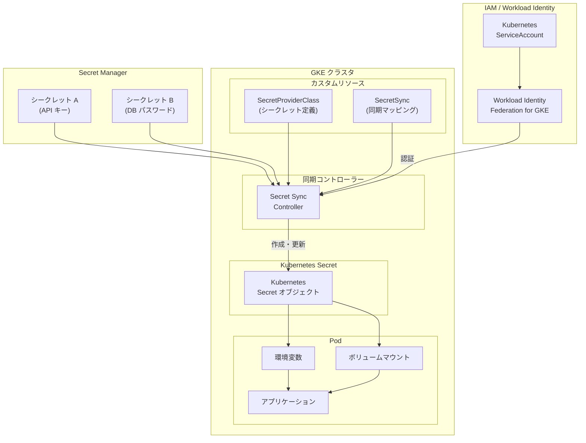

# Secret Manager: Kubernetes Secrets への統合シークレット同期機能が GA

**リリース日**: 2026-04-16

**サービス**: Secret Manager

**機能**: Secret Manager から GKE の Kubernetes Secret オブジェクトへの統合シークレット同期 (GA)

**ステータス**: GA (General Availability)

[このアップデートのインフォグラフィックを見る](https://takech9203.github.io/google-cloud-news-summary/20260416-secret-manager-secret-sync-gke-ga.html)

## 概要

Secret Manager の統合シークレット同期機能が GA (一般提供) となりました。この機能により、Secret Manager に保存されたシークレットを Google Kubernetes Engine (GKE) クラスタ内の Kubernetes Secret オブジェクトへ自動的に同期できるようになります。アプリケーションは環境変数やボリュームマウントなど標準的な Kubernetes の手法を使って Secret Manager のシークレットにアクセスできます。

この機能の最大の価値は、既に Kubernetes Secret オブジェクトからシークレットを読み取る設計になっているアプリケーションが、コード変更なしに Secret Manager のシークレットをシームレスに利用できる点です。Secret Manager の集中管理、IAM によるアクセス制御、監査ログ、CMEK 暗号化といったエンタープライズグレードのセキュリティ機能を、Kubernetes ネイティブなワークフローを維持したまま活用できます。

GKE 上でマイクロサービスを運用するプラットフォームエンジニアやアプリケーション開発者、セキュリティエンジニアにとって、シークレット管理の一元化と運用効率の向上を同時に実現する重要なアップデートです。

**アップデート前の課題**

- GKE アプリケーションが Secret Manager のシークレットにアクセスするには、Secret Manager API を直接呼び出すようにコードを変更する必要があった
- Kubernetes Secret と Secret Manager のシークレットを二重管理する運用負荷が発生していた
- シークレットのローテーション時に、Secret Manager と Kubernetes Secret の両方を手動で更新する必要があった
- 既存の Kubernetes ネイティブアプリケーションを Secret Manager に移行するには大幅なリファクタリングが必要だった

**アップデート後の改善**

- Secret Manager のシークレットが Kubernetes Secret オブジェクトへ自動同期され、アプリケーションのコード変更が不要に
- SecretProviderClass と SecretSync のカスタムリソースによる宣言的な同期設定が可能に
- 自動ローテーション機能により、Secret Manager でのシークレット更新が GKE クラスタに自動反映 (最短 1 分間隔)
- Secrets Store CSI Driver からの移行パスも提供され、既存環境からの段階的な移行が容易に

## アーキテクチャ図



Secret Manager に保存されたシークレットは、同期コントローラーによって SecretProviderClass と SecretSync の定義に基づき Kubernetes Secret オブジェクトとして GKE クラスタ内に自動同期されます。アプリケーションは標準的な Kubernetes の手法 (環境変数、ボリュームマウント) でシークレットにアクセスします。

## サービスアップデートの詳細

### 主要機能

1. **自動シークレット同期**
   - Secret Manager のシークレットを GKE クラスタ内の Kubernetes Secret オブジェクトとして自動的に同期
   - SecretProviderClass カスタムリソースでソースとなるシークレットを定義し、SecretSync カスタムリソースで同期先の Kubernetes Secret へのマッピングを設定
   - GKE Standard クラスタと Autopilot クラスタの両方で利用可能

2. **自動ローテーション対応**
   - `--enable-secret-sync-rotation` フラグにより、Secret Manager でのシークレット更新を自動検出
   - デフォルトのチェック間隔は 2 分、最短 1 分に設定可能
   - コントローラーはシークレットコンテンツのハッシュ比較により、変更があった場合のみ更新を実行

3. **Workload Identity Federation 統合**
   - GKE の Workload Identity Federation を通じて Secret Manager への安全な認証を実現
   - Kubernetes ServiceAccount と IAM ロールの紐付けによる最小権限アクセス制御
   - 追加の認証情報やキーファイルの管理が不要

4. **Secrets Store CSI Driver からの移行パス**
   - 既存の Secrets Store CSI Driver からの移行手順を提供
   - SecretProviderClass の `provider` フィールドを `gcp` から `gke` に変更するだけで移行開始
   - SecretSync リソースの追加により、Kubernetes Secret としての同期が可能に

## 技術仕様

### カスタムリソース定義

| リソース | API バージョン | 説明 |
|---------|--------------|------|
| SecretProviderClass | `secrets-store.csi.x-k8s.io/v1` | Secret Manager のシークレットとパスのマッピングを定義 |
| SecretSync | `secret-sync.gke.io/v1` | Kubernetes Secret オブジェクトの作成・更新ルールを定義 |

### 要件と対応バージョン

| 項目 | 要件 |
|------|------|
| GKE バージョン | 1.33 以降 |
| gcloud CLI バージョン | 378.0.0 以降 |
| Workload Identity Federation | 必須 (Autopilot ではデフォルト有効) |
| 対応クラスタタイプ | Standard / Autopilot |
| ローテーション最短間隔 | 1 分 |
| シークレットペイロード上限 | 64 KiB |

### SecretProviderClass の設定例

```yaml
apiVersion: secrets-store.csi.x-k8s.io/v1
kind: SecretProviderClass
metadata:
  name: my-app-secrets
  namespace: my-namespace
spec:
  provider: gke
  parameters:
    secrets: |
      - resourceName: "projects/my-project/secrets/api-key/versions/latest"
        path: "api-key.txt"
      - resourceName: "projects/my-project/secrets/db-password/versions/latest"
        path: "db-password.txt"
```

### SecretSync の設定例

```yaml
apiVersion: secret-sync.gke.io/v1
kind: SecretSync
metadata:
  name: my-kube-secret
  namespace: my-namespace
spec:
  serviceAccountName: my-ksa
  secretProviderClassName: my-app-secrets
  secretObject:
    type: Opaque
    data:
      - sourcePath: "api-key.txt"
        targetKey: "API_KEY"
      - sourcePath: "db-password.txt"
        targetKey: "DB_PASSWORD"
```

## 設定方法

### 前提条件

1. Secret Manager API と Google Kubernetes Engine API が有効化されていること
2. GKE バージョン 1.33 以降のクラスタが稼働していること
3. Workload Identity Federation for GKE がクラスタで有効であること
4. gcloud CLI バージョン 378.0.0 以降がインストールされていること
5. GKE クラスタと Secret Manager の管理に必要な IAM 権限を持っていること

### 手順

#### ステップ 1: GKE クラスタでシークレット同期を有効化

既存クラスタの場合:

```bash
# シークレット同期を有効化
gcloud container clusters update CLUSTER_NAME \
    --location=CONTROL_PLANE_LOCATION \
    --enable-secret-sync

# 自動ローテーション付きで有効化 (カスタム間隔)
gcloud container clusters update CLUSTER_NAME \
    --location=CONTROL_PLANE_LOCATION \
    --enable-secret-sync-rotation \
    --secret-sync-rotation-interval=300s
```

新規クラスタ作成時:

```bash
# Standard クラスタの場合
gcloud container clusters create CLUSTER_NAME \
    --location=CONTROL_PLANE_LOCATION \
    --workload-pool=PROJECT_ID.svc.id.goog \
    --enable-secret-sync \
    --enable-secret-sync-rotation

# Autopilot クラスタの場合
gcloud container clusters create-auto CLUSTER_NAME \
    --location=CONTROL_PLANE_LOCATION \
    --enable-secret-sync \
    --enable-secret-sync-rotation
```

#### ステップ 2: Kubernetes ServiceAccount の作成と IAM 設定

```bash
# Kubernetes ServiceAccount を作成
kubectl create serviceaccount KSA_NAME --namespace NAMESPACE

# IAM ポリシーバインディングを設定
gcloud secrets add-iam-policy-binding SECRET_NAME \
    --role=roles/secretmanager.secretAccessor \
    --member=principal://iam.googleapis.com/projects/PROJECT_NUMBER/locations/global/workloadIdentityPools/PROJECT_ID.svc.id.goog/subject/ns/NAMESPACE/sa/KSA_NAME
```

Workload Identity Federation により、Kubernetes ServiceAccount が Secret Manager のシークレットへ安全にアクセスできるようになります。

#### ステップ 3: SecretProviderClass の作成

```bash
# spc.yaml を適用
kubectl apply -f spc.yaml
```

SecretProviderClass で Secret Manager のどのシークレットバージョンを同期対象とするかを定義します。

#### ステップ 4: SecretSync の作成と確認

```bash
# SecretSync を適用
kubectl apply -f secret-sync.yaml

# 同期された Kubernetes Secret を確認
kubectl get secret KUBERNETES_SECRET_NAME -n NAMESPACE -o yaml

# 同期ステータスのトラブルシューティング
kubectl describe secretsync KUBERNETES_SECRET_NAME -n NAMESPACE
```

SecretSync リソースの適用により、同期コントローラーが Secret Manager のシークレットから Kubernetes Secret を自動作成します。

## メリット

### ビジネス面

- **運用コストの削減**: シークレットの二重管理が不要になり、管理対象が Secret Manager に一元化されることで、運用工数とヒューマンエラーのリスクが削減
- **コンプライアンス対応の強化**: Secret Manager の監査ログ、CMEK 暗号化、IAM 制御を活用することで、規制要件への対応が容易に
- **移行コストの最小化**: 既存の Kubernetes ネイティブアプリケーションのコード変更が不要なため、段階的かつ低コストでの Secret Manager 導入が可能

### 技術面

- **シームレスな統合**: 環境変数やボリュームマウントなど、既存の Kubernetes シークレット消費パターンをそのまま利用可能
- **自動ローテーション**: Secret Manager でのシークレット更新が GKE クラスタに自動的に反映され、手動同期が不要に
- **宣言的管理**: SecretProviderClass と SecretSync のカスタムリソースにより、GitOps ワークフローとの統合が容易
- **マルチテナント対応**: Namespace 単位での分離と、Kubernetes ServiceAccount ごとの IAM バインディングにより、きめ細かいアクセス制御が可能

## デメリット・制約事項

### 制限事項

- GKE バージョン 1.33 以降でのみ利用可能。古いバージョンのクラスタではアップグレードが必要
- Workload Identity Federation for GKE が有効である必要がある (Autopilot ではデフォルト有効だが、Standard では手動で有効化が必要)
- シークレットのペイロードサイズは 64 KiB まで
- ローテーション間隔は最短 1 分。リアルタイムの同期ではなく、ポーリングベースの同期方式

### 考慮すべき点

- Kubernetes Secret は etcd に保存されるため、Secret Manager 内と比較してセキュリティレベルが異なる。強化のためにはアプリケーション層での暗号化 (Cloud KMS) の設定を推奨
- 環境変数としてシークレットを公開する場合、ログやプロセスリストでの意図しない露出リスクがある。セキュリティ上はボリュームマウントの使用を推奨
- Secret Manager のシークレットバージョンはリージョナルシークレットの場合、クラスタと同一リージョンである必要がある
- 同期の無効化時、既に作成された Kubernetes Secret は自動削除されないため、手動で削除が必要
- VPC Service Controls 使用環境では、サービスペリメータの設定によってアクセスが制限される場合がある
- 公式ドキュメントでは、アプリケーションがサポートしている場合は Secret Manager アドオン (CSI ドライバーによるインメモリファイルマウント) の方がよりセキュアな手法として推奨されている

## ユースケース

### ユースケース 1: 既存マイクロサービスの Secret Manager 統合

**シナリオ**: 多数のマイクロサービスが Kubernetes Secret から環境変数としてデータベース認証情報や API キーを読み取っている。Secret Manager の集中管理機能を導入したいが、全サービスのコードを変更する余裕がない。

**実装例**:
```yaml
# SecretProviderClass で Secret Manager のシークレットを定義
apiVersion: secrets-store.csi.x-k8s.io/v1
kind: SecretProviderClass
metadata:
  name: microservice-secrets
  namespace: production
spec:
  provider: gke
  parameters:
    secrets: |
      - resourceName: "projects/my-project/secrets/db-credentials/versions/latest"
        path: "db-creds.txt"
---
# SecretSync で Kubernetes Secret として同期
apiVersion: secret-sync.gke.io/v1
kind: SecretSync
metadata:
  name: db-credentials
  namespace: production
spec:
  serviceAccountName: app-ksa
  secretProviderClassName: microservice-secrets
  secretObject:
    type: Opaque
    data:
      - sourcePath: "db-creds.txt"
        targetKey: "DATABASE_URL"
```

**効果**: アプリケーションのコードやデプロイメント設定を変更することなく、Secret Manager によるシークレットの集中管理、監査ログ、自動ローテーションを導入可能。

### ユースケース 2: マルチクラスタ環境でのシークレット一元管理

**シナリオ**: 複数の GKE クラスタ (開発、ステージング、本番) にまたがるアプリケーションで、各環境のシークレットを一元的に管理したい。

**効果**: Secret Manager を単一のシークレットソースとして使用し、各 GKE クラスタでシークレット同期を有効化することで、環境ごとのシークレット管理が一元化される。IAM ポリシーにより環境間のアクセス分離も維持できる。

### ユースケース 3: Secrets Store CSI Driver からの移行

**シナリオ**: 既にオープンソースの Secrets Store CSI Driver を使用しているが、GKE ネイティブの統合シークレット同期機能に移行したい。

**実装例**:
```yaml
# provider フィールドを gcp から gke に変更
apiVersion: secrets-store.csi.x-k8s.io/v1
kind: SecretProviderClass
metadata:
  name: app-secrets-gke
spec:
  provider: gke  # 変更前: gcp
  parameters:
    secrets: |
      - resourceName: "projects/my-project/secrets/api-key/versions/2"
        path: "api-key.txt"
```

**効果**: GKE マネージドの同期コントローラーに移行することで、CSI Driver の個別管理やアップデート作業が不要になり、GKE のライフサイクル管理に統合される。

## 料金

Secret Manager のシークレット同期機能自体に追加料金は発生しません。ただし、Secret Manager の標準料金が適用されます。

### Secret Manager の料金体系

| 項目 | 料金 |
|------|------|
| アクティブなシークレットバージョン | $0.06 / バージョン / 月 |
| アクセスオペレーション | $0.03 / 10,000 オペレーション |
| ローテーションオペレーション | アクセスオペレーション料金に含まれる |

### 無料枠

| 項目 | 無料枠 |
|------|--------|
| アクティブなシークレットバージョン | 6 バージョン / 月 |
| アクセスオペレーション | 10,000 オペレーション / 月 |

### 料金の考慮事項

- 同期コントローラーが定期的に Secret Manager API を呼び出すため、ローテーション間隔の設定によってアクセスオペレーション数が増加する可能性があります
- 例: 100 個のシークレットを 2 分間隔で同期する場合、月間約 216 万回のアクセスオペレーション (100 x 30 x 24 x 30) が発生し、約 $6.48 の追加コストとなります
- ハッシュ比較により変更のないシークレットの書き込みは最小化されますが、チェック用の読み取りは発生します

## 利用可能リージョン

シークレット同期機能は GKE 1.33 以降が利用可能な全リージョンで使用できます。Secret Manager 自体はグローバルサービスですが、リージョナルシークレットを使用する場合は GKE クラスタと同一リージョンのシークレットバージョンを指定する必要があります。Secret Manager のリージョン情報については、[Secret Manager のロケーション](https://docs.cloud.google.com/secret-manager/docs/locations)を参照してください。

## 関連サービス・機能

- **[Secret Manager アドオン (CSI コンポーネント)](https://docs.cloud.google.com/secret-manager/docs/secret-manager-managed-csi-component)**: シークレットをインメモリファイルとして Pod に直接マウントする、よりセキュアな代替手法。アプリケーションがサポートしている場合はこちらが推奨
- **[Workload Identity Federation for GKE](https://docs.cloud.google.com/kubernetes-engine/docs/how-to/workload-identity)**: GKE ワークロードから Google Cloud サービスへの認証に使用。シークレット同期機能の前提条件
- **[Cloud KMS](https://docs.cloud.google.com/kms/docs)**: Kubernetes Secret の etcd ストレージをアプリケーション層で暗号化するために使用可能。CMEK によるシークレットの暗号化にも対応
- **[Cloud Audit Logs](https://docs.cloud.google.com/logging/docs/audit)**: Secret Manager のシークレットアクセスと管理操作の監査ログを提供

## 参考リンク

- [このアップデートのインフォグラフィック](https://takech9203.github.io/google-cloud-news-summary/20260416-secret-manager-secret-sync-gke-ga.html)
- [公式リリースノート](https://docs.cloud.google.com/release-notes#April_16_2026)
- [Synchronize secrets to Kubernetes Secrets ドキュメント](https://docs.cloud.google.com/secret-manager/docs/sync-k8-secrets)
- [Secret Manager 概要](https://docs.cloud.google.com/secret-manager/docs/overview)
- [Secret Manager 料金ページ](https://cloud.google.com/secret-manager/pricing)
- [Secret Manager アドオン (CSI コンポーネント)](https://docs.cloud.google.com/secret-manager/docs/secret-manager-managed-csi-component)

## まとめ

Secret Manager の Kubernetes Secrets 統合シークレット同期機能の GA リリースにより、GKE 上のアプリケーションはコード変更なしで Secret Manager のエンタープライズグレードのシークレット管理機能を活用できるようになりました。特に、既に Kubernetes Secret を使用している多数のマイクロサービスを運用する組織にとって、段階的かつ低リスクな Secret Manager 導入を可能にする重要なマイルストーンです。GKE 1.33 以降を利用している場合は、クラスタでのシークレット同期有効化から始めて、まず非本番環境での検証を推奨します。

---

**タグ**: #SecretManager #GKE #KubernetesSecrets #シークレット管理 #GA #セキュリティ #WorkloadIdentity #シークレット同期
