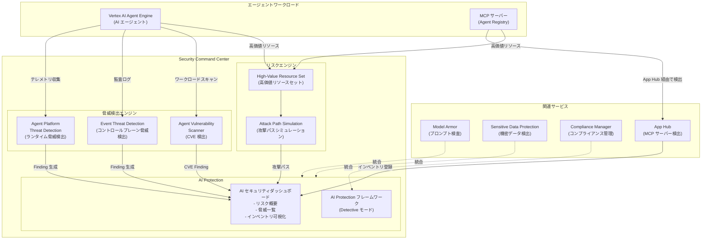

# Security Command Center: AI Protection がエージェントワークロードに対応 (Preview)

**リリース日**: 2026-04-16

**サービス**: Security Command Center

**機能**: AI Protection のエージェントワークロード対応 (Vertex AI Agent Engine / MCP サーバー)

**ステータス**: Preview

[このアップデートのインフォグラフィックを見る](https://takech9203.github.io/google-cloud-news-summary/20260416-security-command-center-ai-protection-agents.html)

## 概要

Security Command Center の AI Protection が、エージェントワークロード (agentic workloads) をサポートするようになりました。Preview として提供される本アップデートにより、Vertex AI Agent Engine 上にデプロイされた AI エージェントや、Agent Registry にカタログ登録された Model Context Protocol (MCP) サーバーに対するセキュリティの可視化、脆弱性検出、脅威検出が可能になります。

AI エージェントは環境を認識し、意思決定を行い、特定の目標を達成するためにアクションを実行する AI システムです。こうしたエージェントが本番環境で普及するにつれ、従来の AI モデルやエンドポイントとは異なるセキュリティリスクが顕在化しています。エージェントはツールの呼び出し、外部サービスへのアクセス、コード実行などの自律的なアクションを実行するため、攻撃対象面 (Attack Surface) が拡大します。本アップデートは、こうした新しい脅威に対処するための包括的なセキュリティフレームワークを提供します。

本機能は、AI エージェントを本番環境にデプロイしているセキュリティチーム、DevSecOps エンジニア、AI プラットフォーム管理者にとって特に重要です。Security Command Center の Premium または Enterprise ティアの組織レベルでの有効化が必要です。

**アップデート前の課題**

- AI Protection はモデル、データソース、エンドポイントなどの従来の AI アセットを対象としており、AI エージェントや MCP サーバーは保護対象外だった
- Agent Engine 上にデプロイされたエージェントのソフトウェア脆弱性 (CVE) を一元的にスキャンする仕組みがなかった
- AI エージェントに対するランタイム脅威検出 (リバースシェル、悪意あるスクリプト実行、権限昇格など) の専用検出ルールが存在しなかった
- AI セキュリティダッシュボードでエージェントや MCP サーバーを含むアセットインベントリを可視化・フィルタリングする手段がなかった

**アップデート後の改善**

- Agent Engine 上のエージェントおよび Agent Registry にカタログ登録された MCP サーバーが AI Protection の保護対象に追加された
- Agent vulnerability scanner により、Agent Engine でデプロイされたワークロードのソフトウェア脆弱性 (CVE) を自動的に検出可能になった
- Agent Platform Threat Detection により、エージェントのランタイム環境に対する 30 種類以上の脅威カテゴリの検出が可能になった
- AI セキュリティダッシュボードが更新され、エージェントリソースのフィルタリングオプションが追加された

## アーキテクチャ図



AI Protection はエージェントワークロードからテレメトリとログを収集し、3 つの検出エンジン (Agent Platform Threat Detection、Event Threat Detection、Agent Vulnerability Scanner) で脅威と脆弱性を検出します。検出結果は AI セキュリティダッシュボードに集約され、Attack Path Simulation と組み合わせたリスク評価が提供されます。

## サービスアップデートの詳細

### 主要機能

1. **Agent Vulnerability Scanner (エージェント脆弱性スキャナー)**
   - Agent Engine でデプロイされたエージェントワークロードのソフトウェア脆弱性 (CVE) を自動的に識別
   - 新規の AI Protection 有効化時にはデフォルトで有効
   - 既存の顧客は AI Protection 設定ページの「Vulnerability Assessment for Agent Platform」セクションから手動で有効化が必要
   - 検出された CVE は AI セキュリティダッシュボードの Finding として表示

2. **Agent Platform Threat Detection (エージェントプラットフォーム脅威検出)**
   - Vertex AI Agent Engine Runtime 上のエージェントに対するランタイム脅威検出
   - ウォッチャープロセスがエージェント実行中にイベント情報を収集 (起動まで最大 1 分)
   - 自然言語処理 (NLP) を使用して Bash および Python スクリプトの悪意あるコードを分析
   - 主要な検出カテゴリ:
     - **Command and Control**: ステガノグラフィツール検出
     - **Credential Access**: Google Cloud 認証情報の探索、GPG キー偵察、秘密鍵・パスワード検索
     - **Defense Evasion**: Base64 エンコードされたスクリプトの実行、コンパイラツールの起動
     - **Execution**: リモートコマンド実行、リバースシェル検出、悪意ある Python 実行、コンテナエスケープ
     - **Exfiltration**: リモートファイルコピーツールの起動
     - **Impact**: 悪意あるコマンドライン検出、大量データ削除、暗号通貨マイニング
     - **Privilege Escalation**: Sudo の悪用 (CVE-2019-14287, CVE-2021-3156)、Polkit の脆弱性 (CVE-2021-4034)
   - Event Threat Detection と連携して監査ログからコントロールプレーンの脅威も検出

3. **拡張されたインベントリとフィルタリング**
   - AI セキュリティダッシュボードで以下のエージェントリソースを可視化:
     - エージェント (Vertex AI Agent Engine)
     - MCP サーバー (Agent Registry にカタログ登録されたもの)
   - コンソールでのリソースフィルタリングにエージェントリソースタイプ (`aiplatform.googleapis.com/ReasoningEngine`) を追加
   - 攻撃パスシミュレーションでエージェントと MCP サーバーを高価値リソースとして設定可能
   - 過剰な権限を持つ Agent Engine エージェントの検出 (Preview)

## 技術仕様

### 検出対象のエージェントリソースタイプ

| リソースタイプ | 説明 | 必要な設定 |
|---------------|------|-----------|
| Vertex AI Agent Engine エージェント | `aiplatform.googleapis.com/ReasoningEngine` | Agent Engine Runtime へのデプロイ |
| MCP サーバー | Agent Registry にカタログ登録されたサーバー | App Hub API (`apphub.googleapis.com`) の有効化 |

### Agent Platform Threat Detection 検出カテゴリ一覧

| カテゴリ | 検出内容 |
|---------|---------|
| Command and Control | ステガノグラフィツール検出 |
| Credential Access | Google Cloud 認証情報探索、GPG キー偵察、秘密鍵・パスワード検索 |
| Defense Evasion | Base64 エンコードされた ELF/Python/Shell スクリプト実行、コンパイラツール起動 |
| Execution | リモートコマンド実行 (Netcat, Socat)、CUPS 脆弱性 (CVE-2024-47177)、悪意ある Python、コンテナエスケープ、Kubernetes 攻撃ツール |
| Exfiltration | リモートファイルコピーツール起動 |
| Impact | 悪意あるコマンドライン、大量データ削除、暗号通貨マイニング (Stratum)、悪意あるスクリプト・URL |
| Privilege Escalation | Sudo 悪用 (CVE-2019-14287, CVE-2021-3156)、Polkit (CVE-2021-4034) |

### 必要な IAM ロール

| 操作 | 必要なロール |
|------|-------------|
| AI セキュリティダッシュボードの閲覧 | `roles/securitycenter.adminViewer` または同等の権限 |
| AI Protection の設定 | `roles/securitycenter.admin` |
| App Hub の設定 (MCP サーバー検出) | `roles/apphub.admin` |
| AI Discovery サービス | `roles/monitoring.viewer` (SCC Enterprise 組織サービスアカウントに付与) |

## 設定方法

### 前提条件

1. Security Command Center Premium または Enterprise ティアが組織レベルで有効化されていること
2. 組織レベルでの AI Protection のセットアップが完了していること
3. AI Discovery サービスが有効化されていること

### 手順

#### ステップ 1: AI Protection の有効化 (既存の顧客向け)

Premium ティアの場合:

1. Google Cloud Console で Security Command Center の **Settings** に移動
2. **AI Protection** カードの **Manage Settings** をクリック
3. 画面の指示に従って有効化

Enterprise ティアの場合:

1. Google Cloud Console で Security Command Center の **SCC Setup Guide** に移動
2. **Review security capabilities summary** パネルを展開
3. **AI protection** パネルから **Set up** をクリック
4. 必要なサービスの設定を確認・実行

#### ステップ 2: Agent Vulnerability Scanner の有効化

```text
1. Google Cloud Console > Security Command Center > Settings
2. AI Protection カードの "Manage Settings" をクリック
3. "Vulnerability Assessment for Agent Platform" セクションで "Manage settings" をクリック
4. 組織に対してサービスを有効化
```

新規の AI Protection 有効化の場合、Agent Vulnerability Scanner はデフォルトで有効になります。

#### ステップ 3: MCP サーバーインベントリ用の App Hub 設定

```bash
# MCP サーバーをホストする各プロジェクトで App Hub API を有効化
gcloud services enable apphub.googleapis.com --project=PROJECT_ID
```

MCP サーバーを AI セキュリティダッシュボードで表示するには、ホストプロジェクトごとに App Hub API の有効化が必要です。

#### ステップ 4: 高価値リソースセットへのエージェントリソースの追加 (オプション)

```text
1. Google Cloud Console > Security Command Center > Settings
2. "Attack path simulation" セクションに移動
3. "Create resource value configuration" をクリック
4. リソースタイプに "aiplatform.googleapis.com/ReasoningEngine" を選択
5. 必要に応じてラベルやタグでスコープを限定
```

次回の攻撃パスシミュレーション実行時に、設定したエージェントリソースへの攻撃パスが生成されます。

## メリット

### ビジネス面

- **AI エージェントのセキュリティリスクの一元管理**: エージェントワークロードの脅威、脆弱性、コンプライアンスを単一のダッシュボードで可視化・管理でき、セキュリティ運用の効率が向上
- **コンプライアンス対応の強化**: AI Protection フレームワークにより、AI エージェントに対する推奨セキュリティコントロールが自動的に適用 (Detective モード) され、規制要件への対応を支援
- **法的・財務的リスクの低減**: エージェントのセキュリティ侵害やデータ漏洩を早期に検出・対応することで、レピュテーション損失や罰金のリスクを最小化

### 技術面

- **30 種類以上のランタイム脅威検出**: Agent Platform Threat Detection により、コンテナエスケープ、リバースシェル、悪意あるスクリプト実行など、エージェント固有の脅威をリアルタイムで検出
- **Attack Path Simulation との統合**: エージェントと MCP サーバーを高価値リソースとして設定し、攻撃パスシミュレーションによるリスク評価が可能
- **NLP ベースのコード分析**: 自然言語処理を使用して Bash/Python スクリプトの悪意あるコードを分析し、従来のパターンマッチングでは検出困難な脅威に対応

## デメリット・制約事項

### 制限事項

- 本機能は Preview であり、本番環境での使用には限定的なサポートが提供される (Pre-GA Offerings Terms が適用)
- AI Protection は組織レベルでの Security Command Center の有効化が必要であり、プロジェクトレベルのみの有効化では利用不可
- MCP サーバーの検出には Agent Registry へのカタログ登録と App Hub API の有効化が必要 (自動検出ではない)
- Agent Platform Threat Detection のウォッチャープロセスは起動まで最大 1 分かかるため、極めて短時間のランタイム攻撃は検出できない可能性がある

### 考慮すべき点

- AI Protection は Premium ティアまたは Enterprise ティアでのみ利用可能であり、Standard ティアでは限定的な機能のみ
- Agent Engine 以外のプラットフォーム (Cloud Run 上のカスタムエージェントなど) にデプロイされたエージェントは、Agent Platform Threat Detection の対象外 (Cloud Run Threat Detection が別途対応)
- 収集されたデータはメモリ内で処理され、インシデントとして特定されない限り永続化されないが、セキュリティログの保持ポリシーとの整合性を確認することを推奨
- 過剰権限の検出 (Preview) はエージェントに対する IAM ポリシーの見直しを促すため、既存のエージェントに対する権限設定の棚卸しが推奨される

## ユースケース

### ユースケース 1: 金融機関における AI エージェントのセキュリティ管理

**シナリオ**: 大手金融機関が顧客対応の AI エージェントを Vertex AI Agent Engine にデプロイしている。エージェントは顧客データベースへのアクセス権を持ち、MCP サーバー経由で外部 API と連携している。セキュリティチームはこれらのエージェントに対する脅威を監視する必要がある。

**実装例**:
```text
1. AI Protection を組織レベルで有効化
2. Agent Vulnerability Scanner を有効化して CVE を継続的にスキャン
3. 顧客データにアクセスするエージェントを高価値リソースセットに追加
4. App Hub API を有効化して MCP サーバーをインベントリに登録
5. AI セキュリティダッシュボードで脅威と脆弱性を一元監視
```

**効果**: エージェントのランタイム環境に対するクレデンシャルアクセスやデータ窃取の試行を早期に検出し、PCI DSS や GDPR などの規制要件への対応を強化できる。

### ユースケース 2: DevSecOps チームによるエージェント開発パイプラインの保護

**シナリオ**: AI プラットフォームチームが複数の AI エージェントを開発・デプロイしている。各エージェントには異なる IAM ロールが付与されており、過剰な権限を持つエージェントがないか確認したい。

**実装例**:
```text
1. AI Protection の過剰権限検出を有効化
2. Attack Path Simulation でエージェントリソースへの攻撃パスを分析
3. 検出された Finding に基づいて IAM ポリシーを最小権限に修正
4. Compliance Manager で AI Protection フレームワークの準拠状況を監視
```

**効果**: 過剰な権限を持つエージェントを早期に発見し、最小権限の原則に基づいたセキュリティポスチャを維持できる。攻撃パスシミュレーションにより、エージェントが侵害された場合の影響範囲を事前に把握できる。

### ユースケース 3: マルチエージェントシステムの MCP サーバーセキュリティ

**シナリオ**: 製造業の企業がマルチエージェントシステムを構築しており、複数の MCP サーバーが生産管理システム、在庫管理 API、品質検査システムと連携している。これらの MCP サーバーが攻撃対象になるリスクを評価したい。

**効果**: MCP サーバーを AI セキュリティダッシュボードで一元管理し、各サーバーに対する脅威検出とリスク評価を統合的に実施できる。App Hub と連携したインベントリ管理により、シャドー MCP サーバーの検出も可能になる。

## 料金

AI Protection はSecurity Command Center の Premium ティアおよび Enterprise ティアの一部として提供されます。エージェントワークロード対応の機能自体に追加料金は発生しませんが、Security Command Center のティアに応じた課金が適用されます。

### 料金体系

| ティア | AI Protection の利用 | 課金モデル |
|-------|---------------------|-----------|
| Standard | 限定的な機能のみ | 無料 |
| Premium | 全機能利用可能 | 従量課金またはサブスクリプション |
| Enterprise | 全機能利用可能 + マルチクラウド対応 | サブスクリプション (要問い合わせ) |

詳細な料金は [Security Command Center の料金ページ](https://cloud.google.com/security-command-center/pricing) を参照してください。

## 利用可能リージョン

AI Protection は Security Command Center の組織レベルの有効化で利用可能です。AI Protection のリージョン可用性については [Locations for AI Protection](https://cloud.google.com/security-command-center/docs/regional-endpoints#locations-ai-protection) を参照してください。Agent Platform Threat Detection は Agent Engine Runtime がサポートするリージョンで利用可能です。

## 関連サービス・機能

- **Vertex AI Agent Engine**: AI エージェントのデプロイ・管理・スケーリングを行うマネージドプラットフォーム。Agent Identity (Preview) による最小権限のアクセス制御もサポート
- **Model Armor**: AI モデルへのプロンプトとレスポンスを検査・サニタイズし、プロンプトインジェクションや機密データ漏洩を防止。MCP サーバーとの統合にも対応
- **Agent Development Kit (ADK)**: AI エージェントの開発フレームワーク。Agent Engine へのデプロイをサポート
- **Risk Engine (Attack Path Simulation)**: 2026 年 3 月 31 日に `aiplatform.googleapis.com/ReasoningEngine` の攻撃パスサポートが追加済み
- **Cloud Run Threat Detection**: Cloud Run 上にデプロイされたエージェントのランタイム脅威検出 (Agent Engine 以外のデプロイモデル向け)
- **Compliance Manager**: AI Protection フレームワークの定義・デプロイ・監視を管理

## 参考リンク

- [インフォグラフィック](https://takech9203.github.io/google-cloud-news-summary/20260416-security-command-center-ai-protection-agents.html)
- [公式リリースノート](https://docs.google.com/release-notes#April_16_2026)
- [AI Protection 概要ドキュメント](https://docs.cloud.google.com/security-command-center/docs/ai-protection-overview)
- [AI Protection の設定ガイド](https://docs.cloud.google.com/security-command-center/docs/configure-ai-protection)
- [Agent Platform Threat Detection 概要](https://docs.cloud.google.com/security-command-center/docs/agent-platform-threat-detection-overview)
- [Vertex AI Agent Engine 概要](https://docs.cloud.google.com/agent-builder/agent-engine/overview)
- [AI セキュリティダッシュボード](https://docs.cloud.google.com/security-command-center/docs/assess-risk#ai-protection)
- [Security Command Center サービスティア](https://docs.cloud.google.com/security-command-center/docs/service-tiers)
- [Security Command Center 料金ページ](https://cloud.google.com/security-command-center/pricing)

## まとめ

Security Command Center の AI Protection がエージェントワークロードに対応したことは、AI エージェントの本番運用が広がる中で極めて重要なアップデートです。Agent Vulnerability Scanner による CVE 検出、Agent Platform Threat Detection による 30 種類以上のランタイム脅威検出、そして AI セキュリティダッシュボードでの統合的な可視化により、エージェントと MCP サーバーに対する包括的なセキュリティ管理が実現されます。Vertex AI Agent Engine を利用している組織は、AI Protection の有効化と Agent Vulnerability Scanner の設定を優先的に検討し、App Hub API を有効化して MCP サーバーのインベントリ管理を開始することを推奨します。

---

**タグ**: #SecurityCommandCenter #AIProtection #VertexAI #AgentEngine #MCP #エージェントセキュリティ #脅威検出 #脆弱性スキャン #Preview #AI安全性
