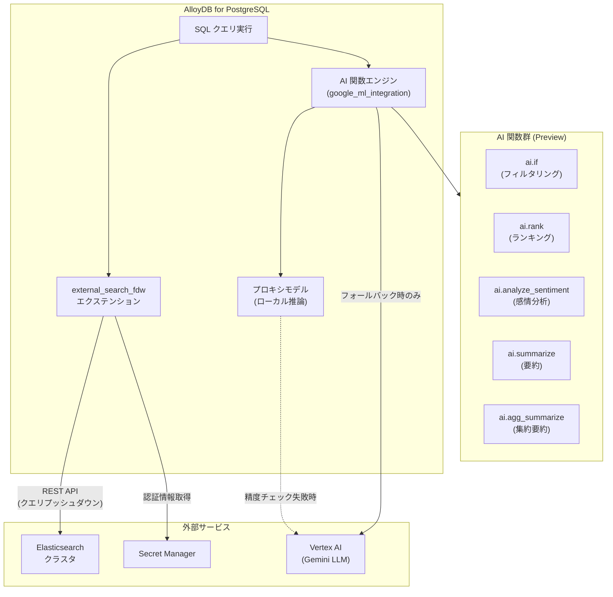

# AlloyDB for PostgreSQL: Elasticsearch 外部検索統合と AI 関数の拡充

**リリース日**: 2026-04-17

**サービス**: AlloyDB for PostgreSQL

**機能**: Elasticsearch 外部検索 (Preview)、AI 関数アクセラレーション・最適化・感情分析・要約 (Preview)、OFFSET 二重適用バグ

**ステータス**: Preview / Issue

:bar_chart: [このアップデートのインフォグラフィックを見る](https://takech9203.github.io/google-cloud-news-summary/20260417-alloydb-elasticsearch-ai-functions.html)

## 概要

AlloyDB for PostgreSQL に 3 つのカテゴリにわたるアップデートが発表された。まず、`external_search_fdw` エクステンションによる Elasticsearch との外部検索統合が Preview として利用可能になった。これにより、AlloyDB から直接 Elasticsearch のデータに対して標準 SQL クエリやハイブリッド検索を実行できるようになる。

次に、AlloyDB AI 関数群に大幅な機能拡充がなされた。AI Function Apply ノードによるクエリアクセラレーション、プロキシモデルを活用した最適化 AI 関数、そして新たな感情分析関数 (`ai.analyze_sentiment`) と要約関数 (`ai.summarize`、`ai.agg_summarize`) が Preview として追加された。これらはデータベース内で直接 AI による自然言語処理を実行でき、外部 ETL パイプラインの構築が不要になる。

また、Elasticsearch クエリで `OFFSET` を指定した際にプッシュダウンされると OFFSET が二重に適用されるバグが報告されている。

**アップデート前の課題**

- AlloyDB から Elasticsearch のデータを検索するには、アプリケーション側で Elasticsearch クライアントと AlloyDB クライアントを個別に管理し、結果をアプリケーション層で統合する必要があった
- AI 関数 (`ai.if`、`ai.rank`) の実行は標準 PostgreSQL エグゼキュータで処理されており、大規模データセットに対するクエリでは LLM への行単位リモートコールによるレイテンシが課題だった
- 感情分析やテキスト要約を行うには、外部の NLP サービスや ETL パイプラインを構築してデータを移動させる必要があった
- LLM を利用した行単位の分類・フィルタリングタスクは運用コストが高かった

**アップデート後の改善**

- `external_search_fdw` エクステンションにより、AlloyDB 内から標準 SQL で Elasticsearch のデータを直接クエリし、`ai.hybrid_search` でハイブリッド検索も実行可能になった
- AI Function Apply ノードにより `ai.if` と `ai.rank` のクエリ実行が最適化され、複雑な配列ベースのクエリを書かずに高スループットを実現できるようになった
- 最適化 AI 関数により、ローカルで訓練されたプロキシモデルが大半のクエリを処理し、LLM へのフォールバックを最小限に抑えることで、最大 100,000 行/秒 (行単位の 23,000 倍) の処理速度とコスト 6,000 分の 1 を実現した
- `ai.analyze_sentiment`、`ai.summarize`、`ai.agg_summarize` により、データベース内で直接テキストの感情分析と要約が可能になった

## アーキテクチャ図



AlloyDB が Elasticsearch と Vertex AI の両方と連携するアーキテクチャを示す。外部検索は FDW 経由で Elasticsearch に直接クエリを実行し、AI 関数はローカルのプロキシモデルを優先使用しつつ、必要に応じて Vertex AI にフォールバックする。

## サービスアップデートの詳細

### 主要機能

1. **Elasticsearch 外部検索統合 (Preview)**
   - `external_search_fdw` エクステンションにより、AlloyDB から Elasticsearch のデータに直接アクセス可能
   - 標準 SQL クエリで Elasticsearch のインデックスを検索でき、SELECT フィールド、WHERE フィルタ、ORDER BY、LIMIT のプッシュダウンに対応
   - `ai.hybrid_search` 関数による Reciprocal Rank Fusion (RRF) ベースのハイブリッド検索をサポート
   - Secret Manager を使用した認証情報管理 (API キーまたは Basic 認証)
   - ページネーション機能 (バッチサイズ・タイムアウト設定可能)

2. **AI 関数アクセラレーション (Preview)**
   - 新しい AI Function Apply ノードがクエリプランに追加され、`ai.if` (WHERE 句) と `ai.rank` (ORDER BY 句) の実行を最適化
   - 配列ベースの複雑なクエリを書かずに、同等以上のパフォーマンスを実現
   - データベースフラグ `google_ml_integration.enable_ai_function_acceleration` で有効化
   - PostgreSQL 17 でのみ利用可能

3. **最適化 AI 関数 (Preview)**
   - ローカルで訓練されたプロキシモデルにより、LLM 呼び出しを大幅に削減
   - `PREPARE` 文でプロキシモデルのバックグラウンド訓練を開始し、`EXECUTE` 文でローカル推論を実行
   - 精度チェックでしきい値を下回った場合は自動的に LLM にフォールバック
   - 最大 100,000 行/秒の処理速度、コスト 6,000 分の 1 (1 セントの 10 分の 1 以下)

4. **感情分析関数 `ai.analyze_sentiment` (Preview)**
   - テキストの感情をポジティブ・ネガティブ・ニュートラルに分類
   - スコアリング (-1.0 ~ 1.0) による定量的な感情評価
   - 行単位の処理に加え、カーソルベースのバッチ処理に対応

5. **要約関数 `ai.summarize` / `ai.agg_summarize` (Preview)**
   - `ai.summarize`: 個別行のテキストを要約
   - `ai.agg_summarize`: 集約関数として複数行をまとめて 1 つの要約を生成 (GROUP BY と組み合わせ可能)
   - 会議議事録、技術文書、レビューなどの長文テキストから重要情報を抽出

6. **OFFSET 二重適用バグ (Issue)**
   - Elasticsearch データに対する SQL クエリで `OFFSET` を指定すると、プッシュダウン時と結果返却時の 2 回適用される
   - 例: `OFFSET 5` を指定すると、Elasticsearch 側で 5 行スキップした後、AlloyDB 側でさらに 5 行スキップされる

## 技術仕様

### Elasticsearch 統合の要件

| 項目 | 詳細 |
|------|------|
| PostgreSQL バージョン | 17 以上 |
| エクステンション | `external_search_fdw` |
| 認証方式 | API キー (`ApiKey`) または Basic 認証 (`Basic`) |
| 認証情報保管 | Secret Manager |
| データアクセス | 読み取り専用 (書き込み不可) |
| 最大応答待機時間 (デフォルト) | 10,000 ms |
| ページネーションバッチサイズ (デフォルト) | 32 |
| ページネーションコンテキストタイムアウト (デフォルト) | 30,000 ms |

### AI 関数の要件

| 項目 | 詳細 |
|------|------|
| PostgreSQL バージョン | 17 以上 |
| エクステンション | `google_ml_integration` (バージョン 1.5.7 以上、最適化関数は 1.5.8 以上) |
| 対応モデル | Gemini (デフォルト)、カスタムモデル設定可能 |
| 最適化関数の対象 | `ai.if()` のみ (Preview 時点) |
| アクセラレーション対象 | `ai.if()` (WHERE 句)、`ai.rank()` (ORDER BY 句) |
| データカラム型 | TEXT / VARCHAR (ソースデータ)、REAL[] / VECTOR (埋め込み) |

### Elasticsearch 接続設定例

```sql
-- エクステンションの有効化
CREATE EXTENSION external_search_fdw;

-- Elasticsearch サーバーの設定
CREATE SERVER my_es_server
  FOREIGN DATA WRAPPER external_search_fdw
  OPTIONS (
    server 'https://my-elasticsearch.example.com:9200',
    search_provider 'elastic',
    auth_mode 'secret_manager',
    auth_method 'ApiKey',
    secret_path 'projects/123456789012/secrets/es-apikey/versions/1',
    max_deadline_ms '10000',
    pagination_num_results '32'
  );

-- ユーザーマッピング
CREATE USER MAPPING FOR CURRENT_USER SERVER my_es_server;

-- 外部テーブルの定義
CREATE FOREIGN TABLE es_products(
  metadata external_search_fdw_schema.OpaqueMetadata,
  product_id TEXT,
  product_name TEXT,
  description TEXT
) SERVER my_es_server OPTIONS(remote_table_name 'products_index');
```

### AI 関数アクセラレーションの有効化

```sql
-- インスタンスレベルで有効化
-- gcloud alloydb instances update INSTANCE_ID \
--   --database-flags google_ml_integration.enable_ai_function_acceleration=on \
--   --region=REGION_ID --cluster=CLUSTER_ID --project=PROJECT_ID

-- セッションレベルで有効化
SET google_ml_integration.enable_ai_function_acceleration = on;

-- アクセラレーションの確認 (EXPLAIN で AI Function Apply ノードを確認)
EXPLAIN (COSTS OFF)
SELECT r.name FROM restaurant_reviews r
WHERE ai.if('Is the following a positive review? Review: ' || r.review)
  AND r.city = 'Los Angeles'
GROUP BY r.name HAVING count(*) > 20;
```

## 設定方法

### 前提条件

1. AlloyDB クラスタが作成済みであること
2. PostgreSQL 17 インスタンスであること
3. Elasticsearch クラスタがデプロイ済みで、アクセス可能であること (外部検索の場合)
4. AlloyDB インスタンスでアウトバウンド接続が有効化されていること
5. Vertex AI との連携が設定済みであること (AI 関数の場合)

### 手順

#### ステップ 1: Elasticsearch 外部検索のセットアップ

```bash
# AlloyDB インスタンスでアウトバウンド接続を有効化
gcloud alloydb instances update INSTANCE_ID \
  --cluster=CLUSTER_ID \
  --region=REGION_ID \
  --project=PROJECT_ID
```

Secret Manager に Elasticsearch の API キーを保存し、AlloyDB サービスアカウントに読み取り権限を付与する。

#### ステップ 2: AI 関数の有効化

```sql
-- google_ml_integration エクステンションのバージョン確認
SELECT extversion FROM pg_extension WHERE extname = 'google_ml_integration';

-- Preview AI 関数の有効化
CALL google_ml.upgrade_to_preview_version();
SET google_ml_integration.enable_preview_ai_functions = 'on';

-- 最適化関数の有効化 (必要な場合)
-- 以下のデータベースフラグを設定:
-- google_ml_integration.enable_model_support
-- google_ml_integration.enable_ai_query_engine
-- google_ml_integration.enable_cost_optimized_ai_functions
```

#### ステップ 3: 感情分析と要約の利用例

```sql
-- 感情分析
SELECT id, review_content,
       ai.analyze_sentiment('Analyze the sentiment:', review_content)
FROM reviews;

-- テキスト要約
SELECT ai.summarize(document_text) FROM documents;

-- 集約要約 (販売者ごとのレビュー要約)
SELECT seller_id, ai.agg_summarize(review)
FROM product_reviews
GROUP BY seller_id;
```

## メリット

### ビジネス面

- **データサイロの解消**: AlloyDB 内から Elasticsearch のデータに直接アクセスでき、アプリケーション層での統合ロジックが不要になる
- **AI 運用コストの大幅削減**: 最適化 AI 関数により LLM 呼び出しコストを最大 6,000 分の 1 に削減可能
- **リアルタイムインサイト**: データベース内で感情分析や要約を直接実行でき、外部パイプラインの遅延なく分析結果を取得可能
- **開発生産性の向上**: SQL ベースのインターフェースにより、ML エンジニアリングの専門知識なしに AI 機能を活用可能

### 技術面

- **クエリプッシュダウン**: SELECT、WHERE、ORDER BY、LIMIT を Elasticsearch に直接プッシュダウンし、不要なデータ転送を削減
- **ハイブリッド検索**: RRF (Reciprocal Rank Fusion) により、複数の検索結果を統合した高品質なランキングを実現
- **スケーラブルな AI 処理**: プロキシモデルによるローカル推論で 100,000 行/秒の処理、バッチ処理で数千行/秒の AI 関数実行が可能
- **自動フォールバック**: プロキシモデルの精度が閾値を下回った場合、自動的に LLM にフォールバックし精度を保証

## デメリット・制約事項

### 制限事項

- すべての機能が Preview ステータスであり、本番環境での利用は推奨されない (Pre-GA 提供条件が適用)
- Elasticsearch 統合は読み取り専用であり、AlloyDB から Elasticsearch への書き込みはできない
- AlloyDB と Elasticsearch 間のデータ同期はユーザー責任
- Elasticsearch の `geo_point` などの特殊データ型はサポートされていない
- AI 関数アクセラレーションは PostgreSQL 17 のみで利用可能
- 最適化 AI 関数は Preview 時点で `ai.if()` のみサポート
- AI 関数アクセラレーションは 1 スキャンあたり 1 つの AI 関数のみ対応

### 考慮すべき点

- Elasticsearch の `OFFSET` 二重適用バグが存在するため、ページネーションクエリで `OFFSET` を使用する際は注意が必要
- 最適化 AI 関数のプロキシモデルは、基盤データが大きく変更された場合に再訓練が必要
- プロキシモデルは特定のプロンプトとデータの組み合わせに対して訓練されるため、プロンプトの変更時には `PREPARE` 文の再実行が必要
- AI 関数は Vertex AI 生成 AI モデルが利用可能なリージョンでのみ使用可能

## ユースケース

### ユースケース 1: EC サイトの商品検索と感情分析

**シナリオ**: EC サイトで AlloyDB にトランザクションデータを保持し、Elasticsearch で商品カタログの全文検索を行っている。顧客レビューの感情分析を組み合わせて、商品のレコメンデーション品質を向上させたい。

**実装例**:
```sql
-- Elasticsearch の商品データとレビューの感情分析を組み合わせ
SELECT
  es.product_name,
  es.description,
  ai.analyze_sentiment(
    'Analyze the sentiment of this product review:',
    r.review_text
  ) AS sentiment
FROM es_products es
JOIN product_reviews r ON es.product_id = r.product_id::text
WHERE es.metadata <@> 'description:"wireless headphones"'
ORDER BY sentiment DESC
LIMIT 10;
```

**効果**: Elasticsearch の全文検索と AlloyDB の AI 感情分析を統合することで、単一の SQL クエリで高品質な商品レコメンデーションが可能になる。

### ユースケース 2: コストを抑えたリアルタイムコンテンツモデレーション

**シナリオ**: 大量のユーザー投稿コンテンツに対して、LLM を使ったリアルタイムフィルタリングを実施しているが、LLM の API コストが高額になっている。

**実装例**:
```sql
-- 最適化 AI 関数でプロキシモデルを訓練
PREPARE flagged_content AS
SELECT c.id, c.content
FROM user_content c
WHERE ai.if(
  'Is the following content inappropriate or harmful? Content: ' || c.content,
  c.content_embedding
);

-- プロキシモデルによる高速・低コストフィルタリング
EXECUTE flagged_content;
```

**効果**: プロキシモデルによるローカル推論で LLM コストを 6,000 分の 1 に削減しつつ、100,000 行/秒の処理速度でリアルタイムモデレーションを実現する。

## 料金

AlloyDB for PostgreSQL は消費ベースの料金モデルを採用しており、インスタンスリソース (vCPU、メモリ)、ストレージ、ネットワーク転送量に基づいて課金される。AI 関数の利用には Vertex AI の API 呼び出し料金が別途発生する (最適化 AI 関数の利用によりこのコストを大幅に削減可能)。Elasticsearch 統合自体に追加料金はないが、Elasticsearch クラスタの運用コストは別途必要。

コミットメント利用割引 (CUD) として、1 年契約で 25%、3 年契約で 52% の割引が利用可能。

詳細は [AlloyDB for PostgreSQL pricing](https://cloud.google.com/alloydb/pricing) を参照。

## 利用可能リージョン

AlloyDB for PostgreSQL が利用可能なすべてのリージョンで Elasticsearch 統合を利用可能。ただし、AI 関数は Vertex AI 生成 AI モデルがサポートされているリージョンでのみ利用可能。対応リージョンの詳細は [Generative AI locations](https://cloud.google.com/vertex-ai/generative-ai/docs/learn/locations#available-regions) を参照。

## 関連サービス・機能

- **Vertex AI**: AlloyDB AI 関数のバックエンドとして LLM 推論を提供。Gemini モデルがデフォルトで使用される
- **Secret Manager**: Elasticsearch 接続の認証情報を安全に管理
- **Elasticsearch**: 外部検索プロバイダとして FDW 経由で統合。全文検索、スコアリング、ハイブリッド検索をサポート
- **AlloyDB AI (ai.if, ai.rank, ai.generate)**: 既存の AI 関数群との組み合わせにより、フィルタリング、ランキング、テキスト生成、感情分析、要約を統合的に利用可能
- **Cloud SQL for SQL Server**: 同日に Vertex AI 統合 (Preview) が発表されており、Google Cloud データベースサービス全体での AI 統合の拡充が進んでいる

## 参考リンク

- :bar_chart: [インフォグラフィック](https://takech9203.github.io/google-cloud-news-summary/20260417-alloydb-elasticsearch-ai-functions.html)
- [公式リリースノート](https://cloud.google.com/release-notes#April_17_2026)
- [AlloyDB リリースノート](https://cloud.google.com/alloydb/docs/release-notes)
- [Elasticsearch データへのアクセス](https://cloud.google.com/alloydb/docs/elastic-search)
- [AI 関数アクセラレーション](https://cloud.google.com/alloydb/docs/ai/accelerate-ai-queries)
- [最適化 AI 関数](https://cloud.google.com/alloydb/docs/ai/accelerate-queries-optimized-functions)
- [感情分析](https://cloud.google.com/alloydb/docs/ai/evaluate-sentiment)
- [コンテンツ要約](https://cloud.google.com/alloydb/docs/ai/summarize-content)
- [AI 関数概要](https://cloud.google.com/alloydb/docs/ai/ai-query-engine-landing)
- [料金ページ](https://cloud.google.com/alloydb/pricing)

## まとめ

今回の AlloyDB for PostgreSQL アップデートは、データベースの検索能力と AI 処理能力の両面で大きな進化をもたらしている。Elasticsearch との外部検索統合により、リレーショナルデータと全文検索データを SQL 一本で横断検索できるようになり、AI 関数の拡充 (アクセラレーション、最適化関数、感情分析、要約) により、データベース内で直接 AI ワークロードを高効率・低コストに実行できる基盤が整った。特に最適化 AI 関数の 100,000 行/秒のスループットとコスト 6,000 分の 1 という数値は、大規模な AI ワークロードを検討している組織にとって注目すべきポイントである。OFFSET 二重適用バグに注意しつつ、Preview 段階でこれらの機能を評価し、GA 昇格に備えて検証を進めることを推奨する。

---

**タグ**: #AlloyDB #PostgreSQL #Elasticsearch #AI関数 #FDW #ハイブリッド検索 #感情分析 #テキスト要約 #VertexAI #Preview
