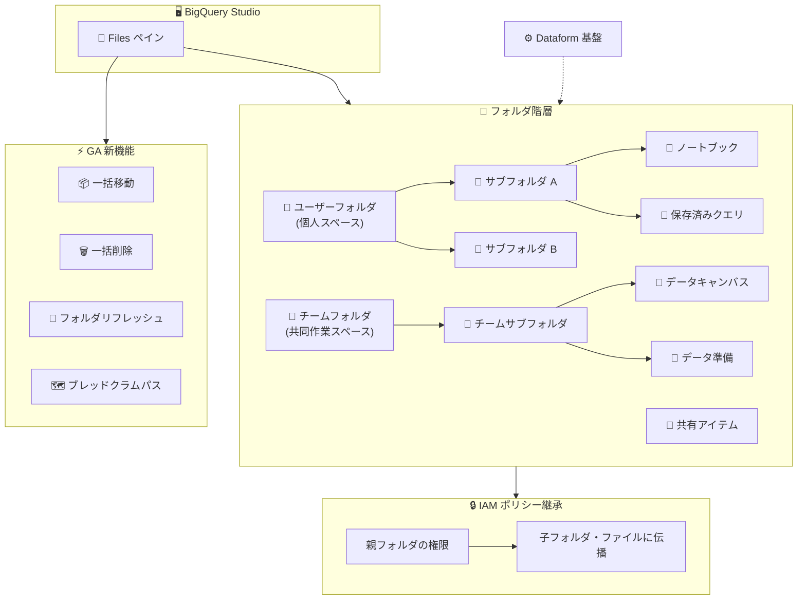

# BigQuery: フォルダによるコードアセット整理機能が GA

**リリース日**: 2026-04-17

**サービス**: BigQuery

**機能**: フォルダを使用した単一ファイルコードアセットの整理とアクセス制御

**ステータス**: GA (一般提供)

📊 [このアップデートのインフォグラフィックを見る](https://takech9203.github.io/google-cloud-news-summary/20260417-bigquery-folders-code-assets-ga.html)

## 概要

BigQuery Studio において、フォルダを使用して単一ファイルコードアセット (ノートブック、保存済みクエリ、データキャンバス、データ準備ファイル) を整理し、アクセスを制御する機能が一般提供 (GA) となった。これにより、OS のファイルシステムのような階層構造でコードアセットを体系的に管理できるようになる。

今回の GA 化に伴い、一括移動・一括削除操作、フォルダ内容の更新 (リフレッシュ)、リソース権限に基づいたフルブレッドクラムパスの表示といった新機能も追加された。これらの機能強化により、大量のコードアセットを抱えるチームでも効率的にリソースを管理・操作できるようになった。

この機能は Dataform を基盤として動作し、IAM ポリシー継承をサポートしている。フォルダに設定した権限がサブフォルダやファイルに自動的に伝播するため、大規模なプロジェクトでのアクセス制御が大幅に簡素化される。対象ユーザーはデータアナリスト、データエンジニア、データサイエンティストなど、BigQuery Studio を日常的に使用するすべてのユーザーである。

**アップデート前の課題**

Preview 段階では、フォルダ機能は限定的なサポートであり、本番環境での利用に制約があった。

- コードアセットがフラットに並び、大量のノートブックやクエリを体系的に整理する手段が限定されていた
- 複数のリソースを移動・削除する際に、1 つずつ個別に操作する必要があった
- フォルダの内容がリアルタイムに反映されず、他のユーザーが共有した変更を確認するための明示的な更新手段がなかった
- 深い階層構造で作業する際に、現在の場所を把握するためのナビゲーション情報が不十分だった

**アップデート後の改善**

- フォルダ機能が GA となり、SLA に基づいた本番環境での利用が可能になった
- 一括移動・一括削除操作により、複数リソースをまとめて効率的に操作できるようになった
- フォルダ内容のリフレッシュ機能により、他のユーザーによる変更をすぐに確認できるようになった
- リソース権限に基づいたフルブレッドクラムパス表示により、階層構造内での現在位置を正確に把握できるようになった
- IAM ポリシー継承が GA レベルで安定的に機能し、フォルダ単位での効率的なアクセス制御が可能になった

## アーキテクチャ図



BigQuery Studio のフォルダ機能は Dataform を基盤として動作し、ユーザーフォルダとチームフォルダの 2 種類の階層構造でコードアセットを整理する。GA 化に伴い、一括操作やリフレッシュ、ブレッドクラムパスなどの運用機能が強化され、IAM ポリシー継承によるアクセス制御が安定的に提供される。

## サービスアップデートの詳細

### 主要機能

1. **フォルダによる階層構造管理**
   - OS のファイルシステムと同様の階層構造でコードアセットを整理可能
   - 最大 5 階層のネスト (入れ子) をサポート
   - ユーザーフォルダ (個人用) とチームフォルダ (共同作業用) の 2 種類を提供

2. **一括移動・一括削除操作 (GA 新機能)**
   - フォルダビューで複数のリソースをチェックボックスで選択し、まとめて移動または削除が可能
   - 一括操作は独立して実行され、1 つのリソースが失敗しても他のリソースの処理は継続される
   - 一括削除時、選択したフォルダは空である必要がある

3. **フォルダ内容のリフレッシュ (GA 新機能)**
   - ファイルブラウザで任意のフォルダを選択し、「Refresh contents」操作で最新の内容を取得可能
   - 他のユーザーが共有した変更や、自身が別セッションで行った変更を即座に反映

4. **フルブレッドクラムパス表示 (GA 新機能)**
   - フォルダを開くと、上部にフルパスのブレッドクラムが表示される
   - 表示されるパスはユーザーの権限レベルに基づいて決定される

5. **IAM ポリシー継承**
   - 親フォルダに設定した権限がサブフォルダとファイルに自動的に伝播
   - プロジェクトレベルの権限がなくても、フォルダパス上のいずれかのフォルダに適切な権限があればリソースにアクセス可能
   - リソースの移動時、個別に付与されたロールは保持され、継承ロールは新しい場所に応じて更新される

### 対応するコードアセットの種類

フォルダで整理できるのは単一ファイルのコードアセットのみである。

| コードアセット | 説明 |
|--------------|------|
| ノートブック | Colab Enterprise ノートブック |
| 保存済みクエリ | BigQuery で保存した SQL クエリ |
| データキャンバス | ビジュアルデータ分析ツール |
| データ準備ファイル | データ準備ジョブの設定ファイル |

## 技術仕様

### フォルダの種類と特性

| 項目 | ユーザーフォルダ | チームフォルダ |
|------|----------------|--------------|
| 用途 | 個人のコードアセット管理 | チーム共同作業 |
| アクセス範囲 | デフォルトは作成者のみ | 明示的に権限付与されたユーザー |
| 自動付与ロール | Dataform Admin (フォルダ作成時) | Dataform Admin (ルートチームフォルダ作成者) |
| 共有 | 選択的に他ユーザーと共有可能 | オーナー権限者が権限を管理 |

### 制限事項

| 項目 | 制限値 |
|------|--------|
| 最大ネスト深度 | 5 階層 |
| 移動可能なフォルダ内のファイル・フォルダ数 | 100 以下 |
| 大量フォルダ時のパフォーマンス | 数十万フォルダでファイルエクスプローラーやフォルダ展開が低速化 |

### IAM ロール

フォルダとコードアセットに適用可能な主要な IAM ロールは以下の通りである。

**コードアセット (ユーザーフォルダ含む) 向けロール:**

| ロール | 説明 |
|--------|------|
| `roles/dataform.codeOwner` | コードアセットに対する全操作 (削除・共有含む) |
| `roles/dataform.codeEditor` | コードアセットに対する全操作 (削除・共有を除く) |
| `roles/dataform.codeCommenter` | コードアセットの閲覧とコメント |
| `roles/dataform.codeViewer` | コードアセットの閲覧のみ |

**チームフォルダ向けロール:**

| ロール | 説明 |
|--------|------|
| `roles/dataform.teamFolderOwner` | チームフォルダに対する全操作 (削除・共有含む) |
| `roles/dataform.teamFolderContributor` | チームフォルダに対する全操作 (削除・共有を除く) |
| `roles/dataform.teamFolderCommenter` | チームフォルダとコンテンツの閲覧とコメント |
| `roles/dataform.teamFolderViewer` | チームフォルダとコンテンツの閲覧のみ |

## 設定方法

### 前提条件

1. BigQuery Studio が有効化されたプロジェクト
2. 適切な IAM ロール (フォルダ作成には `dataform.folders.create` 権限が必要)
3. Dataform API が有効化されていること

### 手順

#### ステップ 1: フォルダの作成

1. Google Cloud コンソールで BigQuery ページに移動する
2. 左ペインの「Files」をクリックしてファイルブラウザを開く
3. ユーザーフォルダまたはチームフォルダの配下で「View actions」> 「Create folder」を選択する
4. フォルダ名を入力し、「Create」をクリックする

#### ステップ 2: コードアセットの一括移動

1. ファイルブラウザでフォルダを展開する
2. フォルダビューで移動したいリソースのチェックボックスを選択する
3. 「Move」をクリックする
4. 移動先のフォルダを選択し、「Move」をクリックする

#### ステップ 3: フォルダへの権限設定

1. 権限を設定したいフォルダを選択する
2. 「Share permissions」ペインで「Add User/Group」をクリックする
3. プリンシパルとロールを設定し、「Save」をクリックする

## メリット

### ビジネス面

- **チーム生産性の向上**: コードアセットを論理的に整理することで、必要なリソースの検索時間を短縮し、チーム全体の作業効率が向上する
- **ガバナンスの強化**: フォルダ単位の IAM ポリシー継承により、組織のセキュリティポリシーに準拠したアクセス制御を容易に実現できる
- **オンボーディングの効率化**: 新しいチームメンバーにフォルダレベルで権限を付与するだけで、必要なすべてのリソースへのアクセスを一括で提供できる

### 技術面

- **運用効率の向上**: 一括移動・一括削除により、大量のリソース管理にかかる手作業を大幅に削減できる
- **最小権限の原則の実践**: プロジェクトレベルではなくフォルダレベルで権限を設定できるため、よりきめ細かいアクセス制御が可能になる
- **本番環境対応**: GA によって SLA が適用され、本番ワークロードでの信頼性の高い利用が保証される

## デメリット・制約事項

### 制限事項

- フォルダのネストは最大 5 階層までに制限されている
- 100 を超えるファイルやフォルダを含むフォルダは移動できない
- 数十万規模のフォルダが存在する場合、ファイルエクスプローラーやフォルダ展開のパフォーマンスが低下する
- 一括削除時、対象のフォルダは空である必要がある (フォルダ内のファイルは事前に削除または移動が必要)

### 考慮すべき点

- フォルダ移動中のリソースは「ビジー」状態となり、他の移動や削除操作が制限される
- 移動操作時、個別に付与されたロールは保持されるが、継承ロールは移動先のフォルダ構造に基づいて更新されるため、権限変更に注意が必要
- コードアセットの作成時に設定したリージョンは後から変更できない

## ユースケース

### ユースケース 1: データ分析チームのプロジェクト管理

**シナリオ**: データ分析チームが複数のビジネスプロジェクト (売上分析、顧客分析、マーケティング分析) を並行して進めており、各プロジェクトのノートブックやクエリを体系的に管理したい。

**実装例**:
```
Team Folders/
  └── データ分析チーム/
      ├── 売上分析/
      │   ├── FY2025/
      │   │   ├── 月次レポートクエリ.sql
      │   │   └── トレンド分析ノートブック.ipynb
      │   └── FY2026/
      │       ├── 月次レポートクエリ.sql
      │       └── 予測モデルノートブック.ipynb
      ├── 顧客分析/
      │   ├── セグメンテーション.ipynb
      │   └── LTV 分析.sql
      └── マーケティング分析/
          ├── キャンペーン効果測定.ipynb
          └── チャネル分析.sql
```

**効果**: プロジェクトごとにフォルダを分けることで、関連するコードアセットを素早く見つけられる。チームフォルダの teamFolderContributor ロールをメンバーに付与することで、全プロジェクトのリソースへのアクセスを一括管理できる。

### ユースケース 2: 部門横断プロジェクトでのアクセス制御

**シナリオ**: 機密データを扱うプロジェクトで、分析チームと経営企画チームに異なるレベルのアクセス権限を付与したい。

**効果**: 分析チームのフォルダには codeEditor ロール、経営企画チームのフォルダには codeViewer ロールを設定することで、IAM ポリシー継承により配下のすべてのリソースに適切な権限が自動的に適用される。プロジェクトレベルの広範な権限を付与する必要がなくなり、最小権限の原則を実践できる。

## 料金

BigQuery フォルダ機能自体に追加料金は発生しない。BigQuery Studio の標準的な利用料金に含まれる。BigQuery の料金体系はコンピュート (分析) とストレージに分かれており、フォルダ機能はこれらの料金に影響しない。

詳細な料金情報は [BigQuery の料金ページ](https://cloud.google.com/bigquery/pricing) を参照。

## 利用可能リージョン

BigQuery フォルダは Dataform がサポートするすべてのロケーションで利用可能である。BigQuery Studio が利用できるリージョンには、アメリカ、ヨーロッパ、アジア太平洋、中東、アフリカの各リージョンが含まれる。

主要なリージョンの例:
- **アメリカ**: us-central1 (Iowa), us-east4 (Northern Virginia), us-west1 (Oregon) など
- **ヨーロッパ**: europe-west1 (Belgium), europe-west3 (Frankfurt), europe-west2 (London) など
- **アジア太平洋**: asia-northeast1 (Tokyo), asia-northeast3 (Seoul), asia-southeast1 (Singapore) など

フォルダとコードアセットは異なるコードリージョンに配置可能であり、デフォルトリージョンはプロジェクト設定で変更できる。

詳細は [BigQuery Studio locations](https://cloud.google.com/bigquery/docs/locations#bqstudio-loc) を参照。

## 関連サービス・機能

- **[Dataform](https://cloud.google.com/dataform/docs/overview)**: BigQuery フォルダの基盤技術。フォルダの API リソースや IAM 制御は Dataform API を通じて提供される
- **[BigQuery Studio](https://cloud.google.com/bigquery/docs/bigquery-studio-introduction)**: フォルダ機能を含むコードアセット管理の統合 IDE 環境
- **[Cloud IAM](https://cloud.google.com/iam/docs/overview)**: フォルダに対する権限設定とポリシー継承の基盤
- **[Colab Enterprise](https://cloud.google.com/colab/docs/introduction)**: フォルダで管理可能なノートブックの作成・実行環境

## 参考リンク

- 📊 [インフォグラフィック](https://takech9203.github.io/google-cloud-news-summary/20260417-bigquery-folders-code-assets-ga.html)
- [公式リリースノート](https://cloud.google.com/release-notes#April_17_2026)
- [Organize code assets with folders (ドキュメント)](https://cloud.google.com/bigquery/docs/code-asset-folders)
- [Create and manage folders (ドキュメント)](https://cloud.google.com/bigquery/docs/create-manage-folders)
- [Dataform アクセス制御](https://cloud.google.com/dataform/docs/access-control)
- [BigQuery 料金](https://cloud.google.com/bigquery/pricing)

## まとめ

BigQuery フォルダによるコードアセット整理機能の GA 化は、BigQuery Studio を利用するチームの生産性とガバナンスを大きく向上させるアップデートである。特に一括操作、フォルダリフレッシュ、ブレッドクラムパスといった新機能の追加により、大規模チームでの実用性が大幅に改善された。BigQuery Studio を日常的に利用している組織は、チームフォルダを活用してコードアセットの整理と IAM ポリシー継承によるアクセス制御の導入を検討すべきである。

---

**タグ**: #BigQuery #BigQueryStudio #Dataform #フォルダ管理 #コードアセット #IAM #GA #アクセス制御
