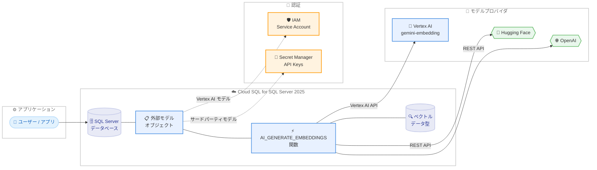

# Cloud SQL for SQL Server: Vertex AI 統合によるベクトルエンベディング生成 (Preview)

**リリース日**: 2026-04-17

**サービス**: Cloud SQL for SQL Server

**機能**: Vertex AI 統合 / サードパーティモデル連携

**ステータス**: Preview

📊 [このアップデートのインフォグラフィックを見る](https://takech9203.github.io/google-cloud-news-summary/20260417-cloud-sql-sqlserver-vertex-ai-integration.html)

## 概要

Cloud SQL for SQL Server と Vertex AI およびサードパーティモデルとの統合が Preview として利用可能になった。この機能により、Cloud SQL for SQL Server 2025 インスタンスから直接、Vertex AI でホストされているモデルを使用してベクトルエンベディングを生成できるようになる。対応するモデルプロバイダは Vertex AI、Hugging Face、OpenAI の 3 つである。

この統合は、SQL Server 2025 で新たに導入されたネイティブベクトルデータ型と `AI_GENERATE_EMBEDDINGS` 関数を活用し、データベース内で直接 ML モデルを呼び出せる点が最大の特徴である。従来はアプリケーション層で別途エンベディング API を呼び出してからデータベースに結果を格納する必要があったが、今回の統合により SQL クエリのみでエンベディング生成が完結する。SQL Server を利用するデータエンジニア、アプリケーション開発者、AI/ML エンジニアが主な対象となる。

なお、Cloud SQL for PostgreSQL および MySQL では既に Vertex AI 統合が提供されており、今回のアップデートにより SQL Server でも同様の AI 統合機能が利用可能になった。これにより Cloud SQL の全データベースエンジンで Vertex AI 統合がサポートされることになる。

**アップデート前の課題**

- Cloud SQL for SQL Server からベクトルエンベディングを生成するには、アプリケーション層で Vertex AI API や OpenAI API を個別に呼び出し、結果をデータベースに格納する必要があった
- SQL Server のワークロードにおいて、データベースから直接 ML モデルにアクセスする手段がなく、データの移動やコードの複雑化が発生していた
- PostgreSQL や MySQL の Cloud SQL では Vertex AI 統合が利用可能だったが、SQL Server ではこの機能がサポートされていなかった

**アップデート後の改善**

- `AI_GENERATE_EMBEDDINGS` 関数を使用して、SQL Server から直接ベクトルエンベディングを生成可能になった
- Vertex AI、Hugging Face、OpenAI のモデルエンドポイントを外部モデルオブジェクトとして登録し、統一的な SQL インターフェースで利用可能になった
- Cloud SQL が提供するストアドプロシージャ (`gcloudsql_ml_create_external_model` など) を通じて、モデルの登録・変更・削除をデータベース管理者が直接管理できるようになった

## アーキテクチャ図



Cloud SQL for SQL Server 2025 から Vertex AI およびサードパーティのモデルプロバイダに接続するアーキテクチャを示す。外部モデルオブジェクトがモデルの登録と管理を担い、`AI_GENERATE_EMBEDDINGS` 関数を通じてエンベディング生成を実行する。Vertex AI モデルは IAM サービスアカウントで認証し、サードパーティモデルは Secret Manager に格納した API キーで認証する。

## サービスアップデートの詳細

### 主要機能

1. **外部モデルオブジェクト管理**
   - Cloud SQL が提供する 3 つのストアドプロシージャ (`gcloudsql_ml_create_external_model`、`gcloudsql_ml_alter_external_model`、`gcloudsql_ml_drop_external_model`) を使用して、AI モデルのエンドポイントを SQL Server 内に登録・変更・削除できる
   - ストアドプロシージャは `msdb` データベースの `dbo` スキーマに配置されている
   - モデルプロバイダとして Vertex AI、OpenAI、Hugging Face を指定可能

2. **AI_GENERATE_EMBEDDINGS 関数**
   - SQL Server の `AI_GENERATE_EMBEDDINGS` 関数を使用して、テキストをベクトルエンベディングに変換する
   - 登録済みの外部モデルを `USE MODEL` 句で指定して呼び出す
   - 実行にはデータベースユーザーに `EXECUTE ON EXTERNAL MODEL` 権限が必要

3. **マルチプロバイダ対応**
   - Vertex AI: Cloud SQL サービスアカウントの IAM 認証を使用。Secret Manager は不要
   - Hugging Face / OpenAI: API キーを Secret Manager に格納し、シークレット URL を外部モデル作成時に指定
   - サードパーティモデルを使用する場合はパブリック IP が必要 (プライベート IP インスタンスからはアクセス不可)

## 技術仕様

### 対応エディションとデータベースバージョン

| 項目 | 詳細 |
|------|------|
| 対応エディション | Cloud SQL Enterprise Plus / Cloud SQL Enterprise |
| 対応データベースバージョン | SQL Server 2025 の全バージョン |
| ベクトル最大次元数 (float32) | 1,998 次元 |
| ベクトル最大次元数 (float16) | 3,996 次元 |

### ストアドプロシージャ

| プロシージャ名 | 用途 |
|---------------|------|
| `[msdb].[dbo].[gcloudsql_ml_create_external_model]` | 外部モデルオブジェクトの作成 |
| `[msdb].[dbo].[gcloudsql_ml_alter_external_model]` | 外部モデルオブジェクトの変更 |
| `[msdb].[dbo].[gcloudsql_ml_drop_external_model]` | 外部モデルオブジェクトの削除 |

### モデルプロバイダ別認証方式

| プロバイダ | 認証方式 | Secret Manager | パブリック IP 要件 |
|-----------|---------|----------------|-------------------|
| Vertex AI | IAM サービスアカウント | 不要 (空を指定) | 不要 |
| OpenAI | Secret Manager | 必要 (API キー) | 必要 |
| Hugging Face | Secret Manager | 必要 (API キー) | 必要 |

### 外部モデル作成のパラメータ

```sql
EXECUTE [msdb].[dbo].[gcloudsql_ml_create_external_model]
    @db = [DB_NAME],
    @model_name = MODEL_NAME,
    @model_provider = 'MODEL_PROVIDER',
    @model = 'MODEL',
    @model_url = MODEL_URL,
    @secret_url = SECRET_URL
```

| パラメータ | 説明 |
|-----------|------|
| `@db` | 外部モデルを作成するターゲットデータベース名 |
| `@model_name` | 新しい外部モデルの名前 |
| `@model_provider` | モデルプロバイダ名 (Vertex AI / OpenAI / Hugging Face) |
| `@model` | 呼び出す AI モデル名 (例: `gemini-embedding-002`) |
| `@model_url` | モデルエンドポイントの URL |
| `@secret_url` | Secret Manager のシークレット URL (Vertex AI の場合は空) |

## 設定方法

### 前提条件

1. Cloud SQL for SQL Server 2025 インスタンスであること (Enterprise Plus または Enterprise エディション)
2. Cloud SQL Admin API、Vertex AI API、Compute Engine API が有効化されていること
3. サードパーティモデルを使用する場合は Secret Manager API も有効化が必要
4. サードパーティモデルを使用する場合はインスタンスにパブリック IP が設定されていること

### 手順

#### ステップ 1: 必要な API の有効化

```bash
gcloud services enable sqladmin.googleapis.com \
    aiplatform.googleapis.com \
    compute.googleapis.com \
    secretmanager.googleapis.com
```

Cloud SQL Admin API、Vertex AI API、Compute Engine API、および Secret Manager API (サードパーティモデル使用時に必要) を有効化する。

#### ステップ 2: Vertex AI 統合を有効にしたインスタンスの作成または更新

```bash
# 新規インスタンス作成時
gcloud sql instances create INSTANCE_NAME \
    --database-version=SQLSERVER_2025_ENTERPRISE \
    --tier=MACHINE_TYPE \
    --region=REGION_NAME \
    --enable-google-ml-integration

# 既存インスタンスの更新
gcloud sql instances patch INSTANCE_NAME \
    --enable-google-ml-integration
```

`--enable-google-ml-integration` フラグを指定して、インスタンスで Vertex AI 統合を有効化する。

#### ステップ 3: IAM 権限の付与

```bash
gcloud projects add-iam-policy-binding PROJECT_ID \
    --member="serviceAccount:SERVICE_ACCOUNT_EMAIL" \
    --role="roles/aiplatform.user"
```

Cloud SQL サービスアカウントに Vertex AI へのアクセス権限 (`roles/aiplatform.user`) を付与する。サービスアカウントのメールアドレスは `gcloud sql instances describe INSTANCE_NAME` コマンドで確認できる。

#### ステップ 4: Secret Manager 権限の付与 (サードパーティモデル使用時)

```bash
SA_NAME=$(gcloud sql instances describe INSTANCE_NAME \
    --format="value(serviceAccountEmailAddress)")

gcloud secrets add-iam-policy-binding SECRET_NAME \
    --member="serviceAccount:${SA_NAME}" \
    --role="roles/secretmanager.secretAccessor"
```

サードパーティモデルの API キーを Secret Manager に格納し、Cloud SQL サービスアカウントにシークレットへのアクセス権限を付与する。

#### ステップ 5: 外部モデルオブジェクトの作成

```sql
-- Vertex AI モデルの登録例
EXECUTE [msdb].[dbo].[gcloudsql_ml_create_external_model]
    @db = [mydb],
    @model_name = 'gemini-embedding',
    @model_provider = 'Vertex AI',
    @model = 'gemini-embedding-002',
    @model_url = 'https://us-central1-aiplatform.googleapis.com/v1/projects/PROJECT_ID/locations/us-central1/publishers/google/models/gemini-embedding-002',
    @secret_url = ''

-- OpenAI モデルの登録例
EXECUTE [msdb].[dbo].[gcloudsql_ml_create_external_model]
    @db = [mydb],
    @model_name = 'openai-embedding',
    @model_provider = 'OpenAI',
    @model = 'text-embedding-3-small',
    @model_url = 'https://api.openai.com/v1/embeddings',
    @secret_url = 'https://secretmanager.googleapis.com/v1/projects/PROJECT_ID/secrets/openai-api-key/versions/1'
```

使用するモデルプロバイダに応じて外部モデルオブジェクトを作成する。

#### ステップ 6: エンベディングの生成

```sql
-- ベクトルエンベディングの生成
SELECT AI_GENERATE_EMBEDDINGS(
    N'Cloud SQL for SQL Server は Google Cloud のマネージドデータベースです'
    USE MODEL gemini-embedding
)

-- 次元数を指定する場合 (高次元モデル使用時)
DECLARE @params JSON = N'{"dimensions": "1536"}';
SELECT AI_GENERATE_EMBEDDINGS(
    'This article introduces AI concepts.'
    USE MODEL gemini-embedding
    PARAMETERS @params
)
```

`AI_GENERATE_EMBEDDINGS` 関数を使用してテキストからベクトルエンベディングを生成する。高次元モデルを使用する場合は `PARAMETERS` 句で次元数を指定できる。

## メリット

### ビジネス面

- **開発効率の向上**: SQL クエリのみでエンベディング生成が完結するため、アプリケーション層での API 統合コードが不要になり、開発サイクルが短縮される
- **SQL Server エコシステムの強化**: 既存の SQL Server ワークロードに AI 機能を追加でき、データベースプラットフォームの移行なしに生成 AI アプリケーションを構築できる
- **マルチプロバイダの柔軟性**: Vertex AI に加えて OpenAI や Hugging Face のモデルも利用可能なため、要件に応じた最適なモデルを選択できる

### 技術面

- **データ移動の最小化**: データベース内で直接エンベディング生成を実行するため、大量のテキストデータをアプリケーション層に転送する必要がない
- **SQL Server 2025 ネイティブベクトル型の活用**: SQL Server 2025 で導入されたネイティブベクトルデータ型とベクトルインデックスを組み合わせることで、データベース内でのベクトル検索が可能になる
- **統一的な管理**: ストアドプロシージャによるモデル管理と IAM/Secret Manager による認証を Cloud SQL の管理フレームワーク内で一元的に運用できる

## デメリット・制約事項

### 制限事項

- Preview 機能であり、本番ワークロードでの利用は SLA の対象外。「Pre-GA Offerings Terms」が適用される
- SQL Server 2025 のみ対応。SQL Server 2022、2019、2017 では利用できない
- float32 ベクトルの最大次元数は 1,998 に制限される。`gemini-embedding-01` など高次元出力のモデルでは、`dimensions` パラメータで次元数を削減するか、float16 (Microsoft プレビュー機能) を使用する必要がある
- サードパーティモデル (OpenAI、Hugging Face) を使用するにはパブリック IP が設定されたインスタンスが必要。プライベート IP のみのインスタンスからはアクセスできない
- Vertex AI 統合を無効にしても外部モデルは自動削除されない。`DROP EXTERNAL MODEL` で手動削除が必要

### 考慮すべき点

- Private Service Connect やプライベートサービスアクセスは Vertex AI 統合のみでサポートされ、サードパーティモデルには対応していない
- 実行ユーザーには `EXECUTE ON EXTERNAL MODEL` 権限が必要であり、適切なロールまたはグラントの設定が求められる
- Preview から GA への移行時に仕様変更が発生する可能性がある

## ユースケース

### ユースケース 1: SQL Server データベースでのセマンティック検索

**シナリオ**: SQL Server に蓄積された商品カタログに対して、自然言語による類似性検索を実装する。ユーザーの検索クエリをエンベディングに変換し、事前生成した商品説明のエンベディングとベクトル類似性検索を行う。

**実装例**:
```sql
-- 商品テーブルにベクトル列を追加
ALTER TABLE products
ADD description_embedding VECTOR(768);

-- 商品説明のエンベディングを生成
UPDATE products
SET description_embedding = AI_GENERATE_EMBEDDINGS(
    description USE MODEL gemini-embedding
);

-- ベクトルインデックスの作成
CREATE VECTOR INDEX idx_product_embedding
ON products(description_embedding);

-- 類似商品の検索
DECLARE @query_vec VECTOR(768);
SET @query_vec = AI_GENERATE_EMBEDDINGS(
    N'軽量で防水のランニングシューズ' USE MODEL gemini-embedding
);

SELECT TOP 5 product_name, description,
    VECTOR_DISTANCE('cosine', description_embedding, @query_vec) AS distance
FROM products
ORDER BY distance;
```

**効果**: アプリケーション層でのベクトル検索ロジックが不要になり、SQL のみでセマンティック検索を実現できる。既存の SQL Server アプリケーションに最小限の変更で AI 機能を追加できる。

### ユースケース 2: RAG (検索拡張生成) パイプラインの構築

**シナリオ**: 社内ナレッジベースのドキュメントをエンベディング化し、ユーザーの質問に対して関連するドキュメントを検索した上で、外部の LLM に回答を生成させる RAG パイプラインを構築する。

**効果**: SQL Server 内にナレッジベースのベクトルストアを構築することで、別途ベクトルデータベースを運用する必要がなくなる。既存の SQL Server のセキュリティモデルやバックアップ体制をそのまま活用できる。

## 料金

Cloud SQL for SQL Server の料金は、インスタンスの構成設定 (CPU、メモリ、ストレージ、リージョン) に依存する。Vertex AI 統合自体に追加料金は発生しないが、Vertex AI モデルの呼び出しには Vertex AI の料金が別途適用される。

Committed Use Discounts (CUD) を利用することで以下の割引が適用される。

| 契約期間 | 割引率 |
|---------|--------|
| 1 年契約 | 25% |
| 3 年契約 | 52% |

サードパーティモデル (OpenAI、Hugging Face) を使用する場合は、各プロバイダの API 利用料金も別途発生する。

詳細な料金情報については [Cloud SQL 料金ページ](https://cloud.google.com/sql/pricing) を参照。

## 利用可能リージョン

Cloud SQL for SQL Server は Google Cloud の多数のリージョンで利用可能である。ただし、Vertex AI 統合を使用する場合は Vertex AI が利用可能なリージョンに限定される。利用可能なリージョンの詳細は [Cloud SQL リージョン可用性の概要](https://cloud.google.com/sql/docs/sqlserver/region-availability-overview) を参照。

## 関連サービス・機能

- **Vertex AI**: Cloud SQL から直接アクセスする ML モデルのホスティング基盤。Gemini エンベディングモデルなどを提供し、IAM ベースの認証でシームレスに統合される
- **Secret Manager**: サードパーティモデルプロバイダ (OpenAI、Hugging Face) の API キーを安全に保管・管理するサービス。Cloud SQL インスタンスのサービスアカウントにアクセス権を付与して使用する
- **Cloud SQL for PostgreSQL / MySQL Vertex AI 統合**: PostgreSQL および MySQL では既に GA で提供されている同様の機能。`google_ml_integration` 拡張 (PostgreSQL) や `mysql.ml_embedding()` 関数 (MySQL) を通じて Vertex AI モデルにアクセスできる
- **AlloyDB AI**: AlloyDB でも Model Endpoint Management を通じた Vertex AI 統合が提供されており、Cloud SQL と類似のアーキテクチャで AI 機能を利用できる

## 参考リンク

- 📊 [インフォグラフィック](https://takech9203.github.io/google-cloud-news-summary/20260417-cloud-sql-sqlserver-vertex-ai-integration.html)
- [公式リリースノート](https://cloud.google.com/release-notes#April_17_2026)
- [Cloud SQL for SQL Server と Vertex AI の統合ドキュメント](https://cloud.google.com/sql/docs/sqlserver/integrate-cloud-sql-with-vertex-ai)
- [Cloud SQL for SQL Server エディション概要](https://cloud.google.com/sql/docs/sqlserver/editions-intro)
- [SQL Server ベクトルデータ型 (Microsoft ドキュメント)](https://learn.microsoft.com/en-us/sql/sql-server/ai/vectors?view=sql-server-ver17)
- [外部モデルの権限付与 (Microsoft ドキュメント)](https://learn.microsoft.com/en-us/sql/t-sql/statements/create-external-model-transact-sql?view=sql-server-ver17#external-model-grants)
- [Cloud SQL 料金ページ](https://cloud.google.com/sql/pricing)

## まとめ

Cloud SQL for SQL Server と Vertex AI の統合が Preview として利用可能になったことで、SQL Server 2025 データベースから直接ベクトルエンベディングを生成できるようになった。Vertex AI に加えて OpenAI と Hugging Face のモデルもサポートされ、統一的な SQL インターフェースで利用できる。SQL Server ワークロードで AI/ML 機能の活用を検討しているユーザーは、SQL Server 2025 インスタンスを作成して `--enable-google-ml-integration` フラグで統合を有効化し、Preview 期間中に動作検証を行うことを推奨する。

---

**タグ**: #CloudSQL #SQLServer #VertexAI #VectorEmbeddings #AI統合 #MachineLearning #GenerativeAI #Preview #OpenAI #HuggingFace
