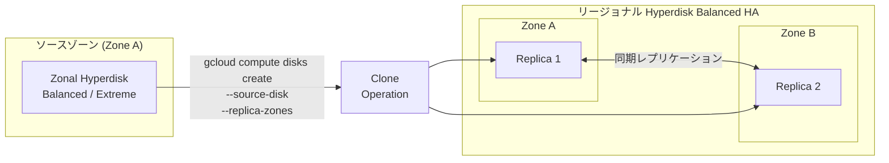

# Compute Engine: Hyperdisk Balanced High Availability ディスクのゾーンディスクからのクローン作成 (GA)

**リリース日**: 2026-04-17

**サービス**: Compute Engine

**機能**: Hyperdisk Balanced High Availability disk clone from zonal disk (GA)

**ステータス**: Generally Available (GA)

:bar_chart: [このアップデートのインフォグラフィックを見る](https://takech9203.github.io/google-cloud-news-summary/20260417-compute-engine-hyperdisk-balanced-ha-clone-ga.html)

## 概要

Google Cloud は、ゾーン Hyperdisk Balanced または Hyperdisk Extreme ディスクをクローンして Hyperdisk Balanced High Availability (HA) ディスクを作成する機能を一般提供 (GA) として発表しました。これにより、同一リージョン内の別ゾーンにデータのレプリカを追加することで、ゾーンワークロードの高可用性を容易に実現できるようになります。

Hyperdisk Balanced High Availability は、同一リージョン内の 2 つのゾーン間でデータを同期的にレプリケートするリージョナルディスクです。最大 100,000 IOPS、2,400 MiB/s のスループットをサポートし、ゾーン障害からアプリケーションを保護します。今回の GA リリースにより、既存のゾーンディスクから直接クローンを作成して HA 構成に移行する運用が本番環境で正式にサポートされます。

この機能は、高可用性を必要とするデータベース、ミッションクリティカルなアプリケーション、規制要件によりデータの複数ゾーンへのレプリケーションが求められるワークロードを運用するインフラストラクチャエンジニア、SRE、クラウドアーキテクトを主な対象としています。

**アップデート前の課題**

- ゾーン Hyperdisk Balanced / Extreme から直接リージョナル HA ディスクを作成する手段がなく、スナップショットを介した間接的な方法が必要だった
- ゾーンワークロードの HA 化には複数のステップと手動作業が発生し、運用の複雑さが増大していた
- HA 移行のプロセスが非効率的で、ダウンタイムやデータ不整合のリスクが存在した

**アップデート後の改善**

- ゾーン Hyperdisk Balanced または Hyperdisk Extreme ディスクから直接 Hyperdisk Balanced HA ディスクをクローン作成可能になった
- 単一コマンドでゾーンディスクをリージョナル HA ディスクに変換でき、運用が大幅に簡素化された
- クローン作成後、平均約 3 分で使用可能な状態になり、迅速な HA 構成が実現可能になった

## アーキテクチャ図



ゾーン Hyperdisk をソースとして、同一リージョン内の 2 つのゾーンにレプリカを持つ Hyperdisk Balanced High Availability ディスクがクローン操作により作成されます。データは 2 つのゾーン間で同期的にレプリケートされ、一方のゾーンが障害を起こしても他方のレプリカからデータにアクセスできます。

## サービスアップデートの詳細

### 主要機能

1. **ゾーンディスクからのダイレクトクローン作成**
   - Hyperdisk Balanced および Hyperdisk Extreme のゾーンディスクをソースとして使用可能
   - スナップショットを介さずに直接 Hyperdisk Balanced HA ディスクを作成
   - クローン先のリージョナルディスクは常に Hyperdisk Balanced High Availability タイプとなる

2. **カスタマイズ可能なパフォーマンス設定**
   - クローン作成時に IOPS (最大 100,000) とスループット (最大 2,400 MiB/s) を指定可能
   - 指定しない場合はディスクサイズに基づくデフォルト値が自動適用
   - ソースディスクのサイズを継承するが、異なるサイズの指定も可能

3. **迅速な利用開始**
   - クローン作成後、平均約 3 分で使用可能
   - 完全なレプリケーション状態 (RPO がゼロに近い状態) に到達するまでは数十分を要する場合がある
   - レプリケーション状態のモニタリング API で進捗を確認可能

## 技術仕様

### パフォーマンス上限の比較

| ディスクタイプ | 最大 IOPS | 最大スループット (MiB/s) |
|------|------|------|
| Hyperdisk Balanced | 160,000 | 2,400 |
| Hyperdisk Extreme | 350,000 | 5,000 |
| Hyperdisk Balanced High Availability (クローン先) | 100,000 | 2,400 |

### Hyperdisk Balanced HA のサイズとパフォーマンス仕様

| 項目 | 詳細 |
|------|------|
| サイズ範囲 | 4 GiB - 64 TiB |
| デフォルトサイズ | 100 GiB |
| IOPS 範囲 | 3,000 - 100,000 |
| スループット範囲 | 140 - 2,400 MiB/s |
| ベースライン IOPS (無料) | 3,000 IOPS |
| ベースラインスループット (無料) | 140 MiB/s |
| 耐久性 | 99.9999% 以上 |

### 対応マシンシリーズ

Hyperdisk Balanced High Availability は以下のマシンシリーズで使用可能です:

- A3 (H100 / H200)
- C3 / C3D / C4 / C4A
- G4
- M3
- N4 / N4A / N4D
- Z3

### 必要な IAM 権限

```json
{
  "permissions": [
    "compute.disks.create",
    "compute.disks.useReadOnly"
  ],
  "note": "ソースディスクがサービスアカウントが関連付けられたインスタンスのブートディスクの場合、iam.serviceAccounts.actAs も必要"
}
```

## 設定方法

### 前提条件

1. ソースディスクが Hyperdisk Balanced または Hyperdisk Extreme であること
2. `compute.disks.create` および `compute.disks.useReadOnly` の IAM 権限を持つこと
3. クローン先のレプリカゾーンがソースディスクと同一リージョン内であること

### 手順

#### ステップ 1: gcloud CLI を使用したクローン作成

```bash
gcloud compute disks create TARGET_DISK_NAME \
  --description="zonal to regional cloned disk" \
  --region=CLONED_REGION \
  --source-disk=SOURCE_DISK_NAME \
  --source-disk-zone=SOURCE_DISK_ZONE \
  --replica-zones=SOURCE_DISK_ZONE,REPLICA_ZONE_2 \
  --project=PROJECT_ID \
  --disk-type=hyperdisk-balanced-high-availability \
  --provisioned-iops=IOPS_LIMIT \
  --provisioned-throughput=THROUGHPUT_LIMIT
```

パラメータの説明:
- `TARGET_DISK_NAME`: 新しいリージョナルディスクの名前
- `CLONED_REGION`: ソースディスクと同じリージョン
- `SOURCE_DISK_NAME`: クローン元のゾーンディスク名
- `SOURCE_DISK_ZONE`: ソースディスクのゾーン (リージョナルディスクの最初のレプリカゾーンにもなる)
- `REPLICA_ZONE_2`: 2 番目のレプリカゾーン
- `IOPS_LIMIT`: (任意) IOPS 上限 (最大 100,000)
- `THROUGHPUT_LIMIT`: (任意) スループット上限 (最大 2,400 MiB/s)

#### ステップ 2: Google Cloud コンソールを使用したクローン作成

```
1. Google Cloud コンソールで [ディスク] ページに移動
2. クローンするゾーンディスクの [操作] 列で [...] > [ディスクをクローン] を選択
3. [名前] フィールドにクローンディスクの名前を入力
4. [ロケーション] で [リージョナル] を選択し、2 番目のレプリカゾーンを選択
5. [プロパティ] でその他の詳細を確認
6. [作成] をクリック
```

注意: コンソールからの作成では IOPS / スループットの指定はできず、サイズに応じたデフォルト値が適用されます。

#### ステップ 3: REST API を使用したクローン作成

```bash
POST https://compute.googleapis.com/compute/v1/projects/PROJECT_ID/regions/REGION/disks
{
  "name": "TARGET_DISK_NAME",
  "sourceDisk": "projects/PROJECT_ID/zones/SOURCE_ZONE/disks/SOURCE_DISK_NAME",
  "type": "projects/PROJECT_ID/regions/REGION/diskTypes/hyperdisk-balanced-high-availability",
  "replicaZones": [
    "projects/PROJECT_ID/zones/SOURCE_ZONE",
    "projects/PROJECT_ID/zones/REPLICA_ZONE_2"
  ]
}
```

## メリット

### ビジネス面

- **運用コストの削減**: スナップショットを介さず直接クローンにより HA 構成を構築でき、移行の工数とダウンタイムを削減
- **ビジネス継続性の向上**: ゾーン障害からの保護がシンプルな操作で実現でき、RTO (Recovery Time Objective) の短縮に寄与
- **コンプライアンス対応**: 複数ゾーンへのデータレプリケーション要件を持つ規制に容易に対応可能

### 技術面

- **シンプルな HA 移行**: 単一コマンドでゾーンディスクからリージョナル HA ディスクへ変換可能
- **高い耐久性**: 99.9999% 以上の耐久性 (Hyperdisk Balanced の 99.999% を上回る)
- **柔軟なパフォーマンス制御**: クローン作成時および作成後に IOPS / スループットを個別にカスタマイズ可能
- **マルチライターモード対応**: 異なるゾーンの複数 VM からの同時書き込みアクセスが可能

## デメリット・制約事項

### 制限事項

- Hyperdisk ML および Hyperdisk Throughput からの直接クローンは不可 (スナップショ経由が必要)
- クローン作成直後はレプリカが完全同期していない (平均 3 分で使用可能だが、完全レプリケーションまで数十分を要する場合がある)
- HA ディスクのパフォーマンス上限はソースディスクより低い場合がある (例: Hyperdisk Extreme の 350,000 IOPS に対して HA は最大 100,000 IOPS)
- AI ゾーンではリージョナルディスクの作成不可
- マルチライターモードの HA ディスクはブートディスクとして使用不可

### 考慮すべき点

- パフォーマンス指定なしでクローンすると、サイズに基づくデフォルト値が適用され、ソースディスクの性能を大幅に下回る場合がある (例: 150 GiB の Hyperdisk Extreme 180,000 IOPS から HA クローンするとデフォルトで 3,900 IOPS)
- ストレージコストはゾーンディスクの 2 倍 (2 つのゾーンにデータを保持するため)
- リージョナルディスクはゾーンディスクと異なるパフォーマンス特性を持つため、ベンチマークテストを推奨
- 100,000 IOPS に到達するには、ディスクサイズが最低 200 GiB 必要

## ユースケース

### ユースケース 1: ゾーンデータベースの HA 化

**シナリオ**: 単一ゾーンで運用中の高性能データベース (例: SQL Server FCI) を、ゾーン障害から保護するためにリージョナル HA 構成に移行する必要がある。

**実装例**:
```bash
# 既存の Hyperdisk Balanced (us-central1-a) から HA ディスクを作成
gcloud compute disks create db-ha-disk \
  --region=us-central1 \
  --source-disk=db-zonal-disk \
  --source-disk-zone=us-central1-a \
  --replica-zones=us-central1-a,us-central1-f \
  --disk-type=hyperdisk-balanced-high-availability \
  --provisioned-iops=50000 \
  --provisioned-throughput=1200
```

**効果**: スナップショットを介さず直接 HA ディスクを作成することで、移行時間の短縮とデータの一貫性を確保。ゾーン障害時も別ゾーンのレプリカにフェイルオーバーし、サービス継続が可能。

### ユースケース 2: 高パフォーマンスワークロードの災害対策

**シナリオ**: Hyperdisk Extreme で運用中の高 IOPS ワークロードを、迅速なフェイルオーバーが可能な HA 構成に移行したい。

**実装例**:
```bash
# 既存の Hyperdisk Extreme (asia-northeast1-b) から HA ディスクを作成
gcloud compute disks create ml-ha-disk \
  --region=asia-northeast1 \
  --source-disk=ml-extreme-disk \
  --source-disk-zone=asia-northeast1-b \
  --replica-zones=asia-northeast1-b,asia-northeast1-c \
  --disk-type=hyperdisk-balanced-high-availability \
  --provisioned-iops=100000 \
  --provisioned-throughput=2400
```

**効果**: Hyperdisk Extreme の IOPS 上限 (350,000) より低い HA の上限 (100,000) を考慮しつつ、ゾーン障害に対する耐性を確保。ワークロードの特性に応じた適切なパフォーマンス設計が可能。

## 料金

Hyperdisk Balanced High Availability のストレージコストは、データを 2 つのゾーンに書き込むため、Hyperdisk Balanced の 2 倍となります。課金対象は以下の通りです:

- **プロビジョニング容量**: GiB あたりの月額料金 (ディスクを削除するまで、未アタッチ・インスタンス停止中でも課金)
- **プロビジョニング IOPS**: ベースラインの 3,000 IOPS を超える分に対して月額課金
- **プロビジョニングスループット**: ベースラインの 140 MiB/s を超える分に対して月額課金

### 注意事項

| 項目 | 詳細 |
|--------|-----------------|
| コスト構造 | Hyperdisk Balanced の 2 倍のストレージコスト |
| ベースライン (無料枠) | 3,000 IOPS + 140 MiB/s |
| CUD / SUD 割引 | 適用対象外 |
| Spot VM 割引 | 適用対象外 |

最新の具体的な料金については [Disk pricing](https://cloud.google.com/compute/disks-image-pricing#disk) ページを参照してください。

## 利用可能リージョン

Hyperdisk Balanced High Availability は全てのリージョンで利用可能です。ただし、AI ゾーンでは Hyperdisk Balanced High Availability ボリュームの作成はサポートされていません。

## 関連サービス・機能

- **[Hyperdisk Balanced](https://docs.cloud.google.com/compute/docs/disks/hyperdisks)**: ゾーンディスクとしてクローンのソースに使用可能。最大 160,000 IOPS、2,400 MiB/s
- **[Hyperdisk Extreme](https://docs.cloud.google.com/compute/docs/disks/hyperdisks)**: 高 IOPS ゾーンディスクとしてクローンのソースに使用可能。最大 350,000 IOPS、5,000 MiB/s
- **[リージョナル Persistent Disk](https://docs.cloud.google.com/compute/docs/disks/regional-persistent-disk)**: 従来型の同期レプリケーション。E2, N1, N2, N2D マシンタイプに対応
- **[非同期レプリケーション](https://docs.cloud.google.com/compute/docs/disks/async-pd/about)**: リージョン間のデータレプリケーション。リージョン障害からの保護に使用
- **[Hyperdisk Storage Pools](https://docs.cloud.google.com/compute/docs/disks/storage-pools)**: Hyperdisk の容量とパフォーマンスを一括購入してコスト最適化
- **[スナップショット](https://docs.cloud.google.com/compute/docs/disks/snapshots)**: Hyperdisk Balanced HA のバックアップとポイントインタイムリカバリに使用

## 参考リンク

- :bar_chart: [インフォグラフィック](https://takech9203.github.io/google-cloud-news-summary/20260417-compute-engine-hyperdisk-balanced-ha-clone-ga.html)
- [公式リリースノート](https://cloud.google.com/release-notes#April_17_2026)
- [ドキュメント - ディスクのクローン作成](https://docs.cloud.google.com/compute/docs/disks/clone-duplicate-disks)
- [ドキュメント - Hyperdisk Balanced High Availability](https://docs.cloud.google.com/compute/docs/disks/hd-types/hyperdisk-balanced-ha)
- [ドキュメント - リージョナルディスク](https://docs.cloud.google.com/compute/docs/disks/regional-persistent-disk)
- [料金ページ](https://cloud.google.com/compute/disks-image-pricing#disk)

## まとめ

今回の GA リリースにより、ゾーン Hyperdisk Balanced / Extreme から Hyperdisk Balanced High Availability ディスクへの直接クローン作成が本番環境で正式にサポートされました。これにより、既存のゾーンワークロードの高可用性化が大幅に簡素化されます。ゾーン障害への耐性が必要なミッションクリティカルなワークロードを運用している場合は、この機能を活用して HA 構成への移行を検討することを推奨します。パフォーマンス上限やコストの違い (HA はゾーンディスクの 2 倍のストレージコスト) を考慮した上で、ワークロードに最適な構成を設計してください。

---

**タグ**: Compute Engine, Hyperdisk, Hyperdisk Balanced High Availability, 高可用性, リージョナルディスク, ディスククローン, GA, ストレージ, 災害対策
