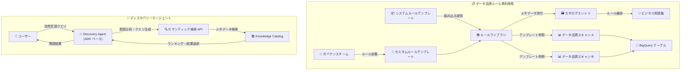

# Dataplex (Knowledge Catalog): データ品質ルールの再利用性 & ディスカバリーエージェント

**リリース日**: 2026-04-17

**サービス**: Dataplex (Knowledge Catalog)

**機能**: データ品質ルールテンプレートによる再利用性、Knowledge Catalog ディスカバリーエージェント

**ステータス**: Feature (一般提供)

📊 [このアップデートのインフォグラフィックを見る](https://takech9203.github.io/google-cloud-news-summary/20260417-dataplex-data-quality-rules-discovery-agent.html)

## 概要

Google Cloud の Knowledge Catalog (旧 Dataplex Universal Catalog) に、2 つの重要な機能が追加された。1 つ目は**データ品質ルールの再利用性**で、データ品質ルールをテンプレートとして定義し、複数のカタログエントリで再利用できるようになった。組織全体でデータ品質プロセスを標準化し、一般的なデータ検証シナリオ向けのシステムルールテンプレートの共有ライブラリも利用可能となる。

2 つ目は **Knowledge Catalog ディスカバリーエージェント**で、複雑な自然言語クエリに対してより関連性の高い検索結果を取得できる AI エージェントの構築・実行が可能になった。Google の Agent Development Kit (ADK) を基盤とし、Knowledge Catalog のセマンティック検索を活用して、ビジネスコンテキストに基づいたデータアセットの発見を支援する。

これらの機能は、データガバナンスチームやデータエンジニアが組織横断的にデータ品質を管理し、データ発見の効率を大幅に向上させることを目的としている。

**アップデート前の課題**

- データ品質ルールを個別のスキャンごとに定義する必要があり、同じルールを複数のテーブルやエントリで使い回すには手動でコピーする必要があった
- 標準的なデータ検証 (NULL チェック、範囲チェックなど) であっても毎回 SQL を記述する必要があり、コールドスタート問題が発生していた
- 中央のガバナンスチームが定義したルールをエンジニアリングチームに展開する標準的な仕組みがなかった
- Knowledge Catalog の検索は、複雑な自然言語クエリや複合条件のクエリに対して十分な精度を提供できなかった
- ビジネスコンテキストに基づいたデータアセットの発見が困難で、正確な技術用語を知っている必要があった

**アップデート後の改善**

- データ品質ルールをテンプレートとして定義し、複数のカタログエントリやスキャンで再利用できるようになった
- システムルールテンプレート (NULL チェック、一意性チェック、範囲チェックなど) が組み込みで提供され、SQL を書かずにデータ品質監視を素早くセットアップできるようになった
- ルールをメタデータとしてカタログエントリに添付でき、ビジネス用語集のタームと連動した自動ガバナンスが可能になった
- ディスカバリーエージェントにより、自然言語で複雑な検索クエリを実行し、より関連性の高い結果を取得できるようになった
- マルチターンの対話的な探索で、検索結果を段階的に絞り込めるようになった

## アーキテクチャ図



上図は、今回追加された 2 つの機能の全体アーキテクチャを示す。上段はデータ品質ルールの再利用性で、ガバナンスチームが定義したルールテンプレートが複数のスキャンやカタログエントリで共有される仕組みを表す。下段はディスカバリーエージェントのフローで、ユーザーの自然言語クエリが ADK ベースのエージェントを経由してセマンティック検索に変換される流れを示す。

## サービスアップデートの詳細

### 主要機能

1. **データ品質ルールテンプレート (カスタムテンプレート)**
   - SQL ベースのルールロジックをテンプレートとして定義し、`data-quality-rule-template` エントリとして保存
   - テンプレートにはパラメータを定義でき、利用時に具体的な値を渡すことが可能 (参照テーブル名、参照カラム名など)
   - 閾値 (THRESHOLD) 機能に対応し、柔軟なルール定義が可能
   - Console、REST API、Terraform でテンプレートの作成・更新・削除が可能

2. **システムルールテンプレート**
   - Knowledge Catalog が提供する組み込みのルールテンプレート群で、すべてのリージョンで利用可能
   - `dataplex-templates` プロジェクトの `rule-library` エントリグループで管理される
   - NULL チェック (`non_null_expectation`)、一意性チェック (`uniqueness_expectation`)、範囲チェック (`statistic_range_expectation`) などの一般的な検証パターンを提供
   - 従来のビルトインルールとの違いとして、カタログエントリやスキャンの両方から参照可能

3. **データルールのメタデータ化**
   - データ品質ルールを Knowledge Catalog の `data-rules` アスペクトとして BigQuery テーブルエントリやビジネス用語集ターム エントリに添付可能
   - カラムをビジネス用語集のタームにリンクすると、そのタームに定義された検証ルールを自動的に継承
   - セマンティック検索で既存のルールを発見・再利用可能

4. **Knowledge Catalog ディスカバリーエージェント**
   - Google Agent Development Kit (ADK) を基盤とした AI エージェント
   - 複合条件クエリ (例: 「us-central1 にあるが BigQuery 以外のデータセットを検索」) に対応
   - ビジネスコンテキストに基づく検索が可能で、正確な技術用語を知らなくても検索できる
   - マルチターンの対話で検索結果を段階的に絞り込み可能
   - Knowledge Catalog セマンティック検索 API を内部的に利用

## 技術仕様

### ルールテンプレートの構成要素

| 項目 | 詳細 |
|------|------|
| エントリタイプ | `projects/dataplex-types/locations/global/entryTypes/data-quality-rule-template` |
| アスペクトキー | `dataplex-types.global.data-quality-rule-template` |
| ルールロジック | SQL ベース (`sqlCollection`) |
| パラメータ | `inputParameters` で定義、利用時に `values` で指定 |
| サポート機能 | `capabilities` (例: `THRESHOLD`) |
| ディメンション | VALIDITY, FRESHNESS, VOLUME, COMPLETENESS, CONSISTENCY, ACCURACY, UNIQUENESS |
| ルール上限 | 1 スキャンあたり最大 1,000 ルール |

### ディスカバリーエージェントの依存関係

| 項目 | 詳細 |
|------|------|
| ベースフレームワーク | Google Agent Development Kit (ADK) |
| 必要な API | Knowledge Catalog API, Vertex AI API, Service Usage API |
| 必要な IAM ロール | `roles/dataplex.viewer`, `roles/aiplatform.user`, `roles/serviceusage.serviceUsageConsumer` |
| 必要なパーミッション | `dataplex.projects.search`, `aiplatform.endpoints.predict`, `serviceusage.services.use` |
| Python 依存パッケージ | `google-adk`, `google-cloud-dataplex`, `google-api-core` |

### カスタムルールテンプレートの定義例 (Terraform)

```hcl
resource "google_dataplex_entry" "rule_template" {
  project        = "PROJECT_ID"
  location       = "us-central1"
  entry_id       = "valid_email_check"
  entry_group_id = "my-rule-library"
  entry_type     = "projects/dataplex-types/locations/global/entryTypes/data-quality-rule-template"

  entry_source {
    display_name = "Valid Email Check"
    description  = "Validates email format using regex pattern"
  }

  aspects {
    aspect_key = "dataplex-types.global.data-quality-rule-template"
    aspect {
      data = jsonencode({
        dimension     = "VALIDITY"
        sqlCollection = [
          {
            query = "SELECT t.* FROM $${data()} AS t WHERE NOT REGEXP_CONTAINS(t.$${column()}, r'^[a-zA-Z0-9._%+-]+@[a-zA-Z0-9.-]+\\.[a-zA-Z]{2,}$')"
          }
        ]
        capabilities = ["THRESHOLD"]
      })
    }
  }
}
```

## 設定方法

### 前提条件

1. Dataplex API が有効化されていること
2. ルールテンプレート管理: `roles/dataplex.catalogEditor` または `roles/dataplex.entryOwner` が付与されていること
3. ルールテンプレート参照: `dataplex.entries.get` および `dataplex.entries.getData` パーミッションがあること
4. ディスカバリーエージェント: Vertex AI API および Service Usage API が有効化されていること

### 手順

#### ステップ 1: ルールテンプレートの作成 (REST API)

```bash
# 環境変数の設定
alias gcurl='curl -H "Authorization: Bearer $(gcloud auth print-access-token)" -H "Content-Type: application/json"'
DATAPLEX_API="dataplex.googleapis.com/v1/projects/PROJECT_ID/locations/LOCATION"

# カスタムルールテンプレートの作成
gcurl -X POST "https://${DATAPLEX_API}/entryGroups/ENTRY_GROUP_ID/entries?entry_id=TEMPLATE_ID" \
  --data @- << 'EOF'
{
  "entryType": "projects/dataplex-types/locations/global/entryTypes/data-quality-rule-template",
  "entrySource": {
    "displayName": "Valid Email Check",
    "description": "Validates email format"
  },
  "aspects": {
    "dataplex-types.global.data-quality-rule-template": {
      "data": {
        "dimension": "VALIDITY",
        "sqlCollection": [
          {
            "query": "SELECT t.* FROM ${data()} AS t WHERE NOT REGEXP_CONTAINS(t.${column()}, r'^[a-zA-Z0-9._%+-]+@[a-zA-Z0-9.-]+\\.[a-zA-Z]{2,}$')"
          }
        ],
        "capabilities": ["THRESHOLD"]
      }
    }
  }
}
EOF
```

#### ステップ 2: スキャンでルールテンプレートを参照

```bash
gcurl -X POST "https://${DATAPLEX_API}/dataScans?data_scan_id=DATASCAN_ID" \
  --data @- << 'EOF'
{
  "data": {
    "resource": "//bigquery.googleapis.com/projects/PROJECT_ID/datasets/DATASET_ID/tables/TABLE_ID"
  },
  "executionSpec": {
    "trigger": { "onDemand": {} }
  },
  "type": "DATA_QUALITY",
  "dataQualitySpec": {
    "rules": [
      {
        "templateReference": {
          "name": "projects/PROJECT_ID/locations/LOCATION/entryGroups/ENTRY_GROUP_ID/entries/TEMPLATE_ID"
        },
        "column": "email",
        "name": "email_validity_check"
      }
    ]
  }
}
EOF
```

#### ステップ 3: ディスカバリーエージェントのセットアップ

```bash
# リポジトリのクローン
git clone https://github.com/GoogleCloudPlatform/dataplex-labs.git
cd dataplex-labs/knowledge_catalog_discovery_agent

# Python 仮想環境のセットアップ
python3 -m venv /tmp/kcsearch
source /tmp/kcsearch/bin/activate
pip3 install -r requirements.txt

# 環境変数の設定
export GOOGLE_CLOUD_PROJECT=PROJECT_ID
export GOOGLE_GENAI_USE_VERTEXAI=True

# エージェントの実行
adk run path/to/agent/parent/folder
```

## メリット

### ビジネス面

- **データ品質の標準化**: 中央ガバナンスチームが検証済みのルールテンプレートを作成し、組織全体で一貫したデータ品質基準を適用できる
- **運用コストの削減**: ルールの再利用により、同じ検証ロジックを繰り返し記述する必要がなくなり、ルール管理のオーバーヘッドが大幅に削減される
- **データ発見の民主化**: ディスカバリーエージェントにより、技術的な検索クエリを知らなくても自然言語でデータアセットを発見でき、セルフサービスのデータ発見が促進される

### 技術面

- **コールドスタート問題の解消**: システムルールテンプレートを利用して、SQL を記述せずに一般的なデータ品質チェックを即座にセットアップ可能
- **責任の分離**: ガバナンスチームがルールテンプレートを管理し、エンジニアリングチームはルールの適用に集中できるアーキテクチャ
- **セマンティック検索の強化**: ディスカバリーエージェントが複数の検索バリエーションを生成し、メタデータフィルタにマッピングすることで、検索精度が向上
- **拡張性**: ディスカバリーエージェントは ADK ベースのため、カスタムエージェントのサブエージェントとして統合可能

## デメリット・制約事項

### 制限事項

- データ品質ルールの実行対象は BigQuery テーブルおよび Iceberg REST Catalog テーブルに限定される
- 1 スキャンあたりのルール数は最大 1,000 に制限される
- システムルールテンプレートの一意性チェック (`uniqueness_expectation`) は、ビルトインルールとは計算方法が異なる (重複行をすべて失敗として扱う)
- ディスカバリーエージェントの利用には Vertex AI API の有効化と追加の IAM ロール付与が必要
- ルールレコメンデーション機能は gcloud CLI ではサポートされていない

### 考慮すべき点

- システムルールテンプレートとビルトインルールではメトリクスの計算方法が異なるため、移行時に結果の差異が生じる可能性がある
- ルールテンプレートをカタログエントリに添付する場合、適切な IAM パーミッションの設計が必要
- ディスカバリーエージェントは Knowledge Catalog セマンティック検索をベースとしているため、検索対象のメタデータが充実しているほど効果が高い

## ユースケース

### ユースケース 1: 組織横断的なデータ品質標準化

**シナリオ**: 金融機関のデータガバナンスチームが、顧客 PII データの検証ルール (メール形式、SSN 形式、電話番号形式) をテンプレートとして定義し、全部門の BigQuery テーブルに統一的に適用する。

**実装例**:
```bash
# メール検証ルールテンプレートを参照するスキャンを作成
gcurl -X POST "https://${DATAPLEX_API}/dataScans?data_scan_id=customer-email-check" \
  --data @- << 'EOF'
{
  "data": {
    "resource": "//bigquery.googleapis.com/projects/my-project/datasets/customers/tables/profiles"
  },
  "type": "DATA_QUALITY",
  "dataQualitySpec": {
    "rules": [
      {
        "templateReference": {
          "name": "projects/my-project/locations/us-central1/entryGroups/pii-rules/entries/valid_email"
        },
        "column": "email",
        "name": "customer_email_check"
      },
      {
        "templateReference": {
          "name": "projects/dataplex-templates/locations/global/entryGroups/rule-library/entries/non_null_expectation"
        },
        "column": "customer_id",
        "name": "customer_id_not_null"
      }
    ]
  }
}
EOF
```

**効果**: 全部門で一貫した PII 検証基準が適用され、コンプライアンス監査への対応が効率化される。ルール変更時もテンプレートを更新するだけで全スキャンに反映される。

### ユースケース 2: AI エージェントによるデータ発見の効率化

**シナリオ**: データサイエンティストが「ヨーロッパリージョンにある顧客行動データで、過去 1 年以内に更新されたもの」といった複雑な条件でデータアセットを検索する。

**効果**: ディスカバリーエージェントがクエリの意図を分析し、複数の検索バリエーションを生成してセマンティック検索を実行することで、従来のキーワード検索では見つからなかった関連データアセットが発見できる。対話的な絞り込みにより、目的のデータに素早くたどり着ける。

## 料金

ルールの再利用性に関連する料金要素は以下の通り。

| 料金要素 | 詳細 |
|----------|------|
| BigQuery 処理料金 | スキャンプロジェクトで実行されるジョブに対して課金 |
| Knowledge Catalog データ品質スキャン | 処理に対する追加料金なし (BigQuery で課金) |
| メタデータストレージ | `data-rules` アスペクト、`data-quality-rule-template` アスペクトの保存に対して課金 |

- Knowledge Catalog でのデータ整理やスキャンスケジューリングの利用に対する課金はなし
- Search API の呼び出しおよびコンソールでの検索クエリに対する課金はなし
- ディスカバリーエージェントの利用には Vertex AI API の利用料金が発生

詳細は [Knowledge Catalog pricing](https://cloud.google.com/dataplex/pricing) を参照。

## 利用可能リージョン

- システムルールテンプレートはすべてのリージョンで利用可能 (`projects/dataplex-templates/locations/global`)
- カスタムルールテンプレートは Knowledge Catalog がサポートするすべてのリージョンで作成可能
- ディスカバリーエージェントは Vertex AI API および Knowledge Catalog API がサポートするリージョンで利用可能
- 詳細は [Knowledge Catalog のロケーション](https://cloud.google.com/dataplex/docs/locations) を参照

## 関連サービス・機能

- **BigQuery**: データ品質スキャンの実行基盤。ルールは BigQuery テーブルおよび Iceberg REST Catalog テーブルに対して実行される
- **Vertex AI**: ディスカバリーエージェントの AI 推論基盤。クエリの意図分析と検索バリエーション生成に使用
- **Agent Development Kit (ADK)**: ディスカバリーエージェントの構築フレームワーク。カスタムエージェントへのサブエージェント統合に対応
- **Cloud Logging**: データ品質スキャンの結果を `data_scan` ログと `data_quality_scan_rule_result` ログで監視・アラート設定が可能
- **Knowledge Catalog セマンティック検索**: ディスカバリーエージェントの内部検索エンジン。AI による自然言語検索を提供
- **ビジネス用語集**: ルールテンプレートをビジネス用語集のタームに添付し、カラムリンク時にルールを自動継承する機能と連携

## 参考リンク

- 📊 [インフォグラフィック](https://takech9203.github.io/google-cloud-news-summary/20260417-dataplex-data-quality-rules-discovery-agent.html)
- [公式リリースノート](https://cloud.google.com/release-notes#April_17_2026)
- [Reuse data quality rules](https://cloud.google.com/dataplex/docs/reuse-data-quality-rules)
- [System rule templates list](https://cloud.google.com/dataplex/docs/system-rule-templates-list)
- [Build an agent to discover your data](https://cloud.google.com/dataplex/docs/use-discovery-agent)
- [Knowledge Catalog セマンティック検索](https://cloud.google.com/dataplex/docs/search-assets)
- [Auto data quality overview](https://cloud.google.com/dataplex/docs/auto-data-quality-overview)
- [Knowledge Catalog pricing](https://cloud.google.com/dataplex/pricing)

## まとめ

今回のアップデートにより、Knowledge Catalog のデータ品質管理とデータ発見の両面で大幅な機能強化が実現した。データ品質ルールの再利用性は、組織横断的なガバナンスの標準化と運用コスト削減を可能にし、特にシステムルールテンプレートによるコールドスタート問題の解消はすべてのデータ品質プロジェクトに即座に価値を提供する。ディスカバリーエージェントは ADK を基盤とした拡張可能な設計であり、既存のカスタムエージェントに組み込むことで、データガバナンスワークフロー全体の自動化を推進できる。まずはシステムルールテンプレートを活用した基本的なデータ品質チェックの導入から始め、段階的にカスタムテンプレートとディスカバリーエージェントを組織のデータガバナンス基盤に統合することを推奨する。

---

**タグ**: #Dataplex #KnowledgeCatalog #DataQuality #DataGovernance #DiscoveryAgent #ADK #RuleReusability #SemanticSearch #BigQuery #VertexAI
