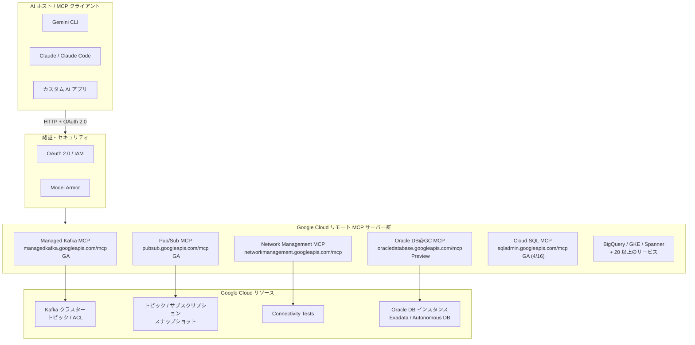

# Google Cloud MCP サーバー: 4 サービスで一斉にリモート MCP サーバーを提供開始

**リリース日**: 2026-04-17

**サービス**: Managed Service for Apache Kafka / Network Intelligence Center / Oracle Database@Google Cloud / Pub/Sub

**機能**: 各サービスのリモート MCP サーバー提供開始 (GA 2 件 / Preview 2 件)

**ステータス**: GA (Managed Kafka, Pub/Sub) / Preview (Network Intelligence Center, Oracle Database@Google Cloud)

[このアップデートのインフォグラフィックを見る](https://takech9203.github.io/google-cloud-news-summary/20260417-google-cloud-mcp-servers-april.html)

## 概要

2026 年 4 月 17 日、Google Cloud は 4 つのサービスにおいてリモート Model Context Protocol (MCP) サーバーの提供を同時に発表しました。Managed Service for Apache Kafka と Pub/Sub は GA (一般提供)、Network Intelligence Center と Oracle Database@Google Cloud は Preview としてリリースされています。前日の 4 月 16 日には Cloud SQL のリモート MCP サーバーが GA となっており、Google Cloud 全体で MCP サーバーのエコシステムが急速に拡大しています。

MCP (Model Context Protocol) は Anthropic が開発したオープンソースプロトコルで、LLM や AI アプリケーションが外部データソースに標準化された方法で接続するための仕組みです。Google Cloud のリモート MCP サーバーはサービス側のインフラストラクチャ上で動作し、HTTP エンドポイントを通じて AI アプリケーション (Gemini CLI、Claude、ChatGPT、カスタムアプリケーション等) との通信を行います。各サーバーは OAuth 2.0 と IAM による認証・認可、Model Armor によるセキュリティ保護、集中型の監査ログといったエンタープライズグレードのガバナンス機能を備えています。

今回の 4 サービス同時発表は、メッセージング (Kafka, Pub/Sub)、ネットワーク管理 (Network Intelligence Center)、データベース (Oracle Database@Google Cloud) という異なるドメインにまたがっており、Google Cloud が MCP を AI とクラウドインフラの接点として戦略的に位置づけていることを示しています。

**アップデート前の課題**

- Managed Service for Apache Kafka の Kafka クラスター、トピック、コンシューマーグループ等の管理には、Console や gcloud CLI の直接操作が必要で、AI アプリケーションからのシームレスな操作が困難だった
- Network Intelligence Center の Connectivity Tests の作成・実行・管理には API を直接呼び出す必要があり、AI エージェントによるネットワーク診断の自動化が難しかった
- Oracle Database@Google Cloud リソースの管理には専用の API やコンソールが必要で、AI 開発プラットフォームからの統合的な操作手段がなかった
- Pub/Sub のトピック・サブスクリプション管理やメッセージ発行には、gcloud CLI や REST API の知識が前提であり、自然言語ベースの操作ができなかった

**アップデート後の改善**

- 各サービスのリソースを AI アプリケーション (Gemini CLI、Claude、ChatGPT 等) から自然言語で直接操作可能になった
- GA サービス (Managed Kafka, Pub/Sub) は SLA に基づいたサービス品質保証のもとで本番環境利用が可能になった
- IAM によるきめ細かなアクセス制御と Model Armor によるセキュリティスキャンが統一的に利用可能になった
- MCP の標準化されたインターフェースにより、複数の Google Cloud サービスを横断的に操作する AI エージェントの構築が容易になった

## アーキテクチャ図



Google Cloud のリモート MCP サーバーエコシステムを示す図です。AI ホストが OAuth 2.0 / IAM で認証後、各サービスのリモート MCP サーバーを通じて Google Cloud リソースを操作します。今回の発表で 4 サービスが新たに加わり、既に GA の Cloud SQL を含めて 25 以上のサービスが MCP サーバーを提供しています。

## サービスアップデートの詳細

### 1. Managed Service for Apache Kafka -- リモート MCP サーバー GA

**エンドポイント**: `https://managedkafka.googleapis.com/mcp` (グローバル)、`https://managedkafka.REGION.rep.googleapis.com/mcp` (リージョナル: Preview)

Managed Service for Apache Kafka の MCP サーバーでは、以下の操作が可能です。

- **Kafka クラスターの管理**: クラスターの作成、一覧表示、詳細取得、更新、削除
- **トピック管理**: トピックの作成、一覧表示、パーティション設定
- **コンシューマーグループ管理**: コンシューマーグループの一覧表示、詳細取得
- **ACL 管理**: アクセス制御リストの管理
- **Kafka Connect 管理**: Connect クラスターとコネクターの作成・管理

**必要な IAM ロール**:
- `roles/mcp.toolUser` (MCP Tool User) -- MCP ツール呼び出しの基本権限
- `roles/managedkafka.admin` (Managed Kafka Admin) -- Kafka リソースへのフルアクセス

### 2. Network Intelligence Center -- Connectivity Tests MCP サーバー

**エンドポイント**: `https://networkmanagement.googleapis.com/mcp`

Network Management API の MCP サーバーでは、Connectivity Tests の作成・表示・削除が可能です。

- **`create_connectivity_test`**: ソースからデスティネーションへの Connectivity Test を作成・実行。無料枠を超えたテスト実行は課金対象 (UNDETERMINED 以外の結果のみ)
- **`get_connectivity_test`**: 特定の Connectivity Test の詳細を取得
- **`list_connectivity_tests`**: プロジェクト内の全 Connectivity Tests を一覧表示
- **`delete_connectivity_test`**: 特定の Connectivity Test を削除

AI エージェントによる推奨ワークフローとして、テスト作成後に `get_connectivity_test` で結果をポーリングし、完了後に `delete_connectivity_test` でリソースを削除するパターンが示されています。

### 3. Oracle Database@Google Cloud -- リモート MCP サーバー Preview

**エンドポイント**: `https://oracledatabase.googleapis.com/mcp`

Oracle Database@Google Cloud の MCP サーバーでは、以下の Oracle Database リソースを AI アプリケーションから管理できます。

- **ODB ネットワーク / サブネット**: 作成、一覧表示、詳細取得
- **Exadata Infrastructure**: インスタンスの作成、一覧表示、詳細取得
- **Exadata VM Cluster / Exascale VM Cluster**: クラスターの作成、一覧表示、詳細取得
- **Exascale Storage Vault**: ストレージボールトの作成、一覧表示、詳細取得
- **Autonomous AI Database**: データベースの作成、一覧表示、詳細取得
- **DB System**: DB システムの作成、一覧表示、詳細取得

**制限事項**:
- `create_autonomous_database` と `create_db_system` ツールでは、パスワードに Secret Manager に格納されたシークレットのみをサポートし、生パスワードは使用不可
- Secret Manager の管理者権限を持つユーザーは IAM deny ポリシーが設定されていてもシークレットにアクセスできる可能性がある

### 4. Pub/Sub -- リモート MCP サーバー GA

**エンドポイント**: `https://pubsub.googleapis.com/mcp` (グローバル)、ロケーショナルおよびリージョナルエンドポイントも利用可能

Pub/Sub の MCP サーバーでは、Pub/Sub リソースの管理とメッセージの発行が可能です。

- **トピック管理**: 作成、一覧表示、取得、更新、削除
- **サブスクリプション管理**: 作成、一覧表示、取得、更新、削除 (メッセージフィルタリング、Single Message Transforms 等の高度な機能を含む)
- **スナップショット管理**: 作成、一覧表示、取得、更新、削除
- **メッセージ発行**: トピックへのメッセージ publish

**必要な IAM ロール**:
- `roles/mcp.toolUser` (MCP Tool User) -- MCP ツール呼び出しの基本権限
- `roles/pubsub.editor` (Pub/Sub Editor) -- Pub/Sub リソースの作成・更新・削除

**サンプルプロンプト例**:
- 「Pub/Sub トピック my-topic からメッセージを consume し、priority=low の属性を持つメッセージをフィルタリングして、Cloud Storage バケット my-bucket に書き込むパイプラインを構築して」
- 「トピック my-topic から BigQuery テーブル my-table へのサブスクリプションを作成し、配信失敗したメッセージは my-dead-letter-topic に送信して」

## 技術仕様

### 各 MCP サーバーの比較

| 項目 | Managed Kafka | Network Intelligence Center | Oracle DB@GC | Pub/Sub |
|------|---------------|---------------------------|--------------|---------|
| ステータス | GA | リリースステージ未記載 | Preview | GA |
| グローバルエンドポイント | `managedkafka.googleapis.com/mcp` | `networkmanagement.googleapis.com/mcp` | `oracledatabase.googleapis.com/mcp` | `pubsub.googleapis.com/mcp` |
| リージョナルエンドポイント | Preview | -- | -- | Preview |
| ロケーショナルエンドポイント | -- | -- | -- | GA |
| 認証方式 | OAuth 2.0 + IAM | OAuth 2.0 + IAM | OAuth 2.0 + IAM | OAuth 2.0 + IAM |
| Model Armor 対応 | 対応 | 対応 | 対応 | 対応 |
| 基本 IAM ロール | `mcp.toolUser` + `managedkafka.admin` | `mcp.toolUser` + サービス固有ロール | `mcp.toolUser` + 複数のサービス固有ロール | `mcp.toolUser` + `pubsub.editor` |

### 共通の認証・認可フロー

すべての Google Cloud リモート MCP サーバーは以下の共通アーキテクチャに基づいています。

```json
{
  "mcpServers": {
    "service-mcp": {
      "httpUrl": "https://<service>.googleapis.com/mcp",
      "authProviderType": "google_credentials",
      "oauth": {
        "scopes": ["https://www.googleapis.com/auth/<service-scope>"]
      },
      "timeout": 30000,
      "headers": {
        "x-goog-user-project": "PROJECT_ID"
      }
    }
  }
}
```

## 設定方法

### 前提条件

1. 対象サービスの API が有効化されていること (各サービスの API を有効にすると MCP サーバーも自動的に有効化)
2. `roles/mcp.toolUser` ロールが付与されていること
3. 各サービス固有の IAM ロールが付与されていること
4. OAuth 2.0 認証が設定されていること

### 手順

#### ステップ 1: API の有効化と IAM ロールの付与

```bash
# Pub/Sub の例
gcloud services enable pubsub.googleapis.com --project=PROJECT_ID

# MCP Tool User ロールの付与
gcloud projects add-iam-policy-binding PROJECT_ID \
  --member="user:USER_EMAIL" \
  --role="roles/mcp.toolUser"

# サービス固有のロール付与 (Pub/Sub の場合)
gcloud projects add-iam-policy-binding PROJECT_ID \
  --member="user:USER_EMAIL" \
  --role="roles/pubsub.editor"
```

#### ステップ 2: MCP クライアントの設定 (Gemini CLI の例)

```json
{
  "name": "pubsub-mcp",
  "version": "1.0.0",
  "mcpServers": {
    "pubsub": {
      "httpUrl": "https://pubsub.googleapis.com/mcp",
      "authProviderType": "google_credentials",
      "oauth": {
        "scopes": ["https://www.googleapis.com/auth/pubsub"]
      },
      "timeout": 30000,
      "headers": {
        "x-goog-user-project": "PROJECT_ID"
      }
    }
  }
}
```

#### ステップ 3: ツール一覧の確認

```bash
# MCP サーバーのツール一覧を取得 (認証不要)
curl --location 'https://pubsub.googleapis.com/mcp' \
  --header 'content-type: application/json' \
  --header 'accept: application/json, text/event-stream' \
  --data '{
    "method": "tools/list",
    "jsonrpc": "2.0",
    "id": 1
  }'
```

## メリット

### ビジネス面

- **AI エージェントによるインフラ運用の自動化**: 自然言語でのクラウドリソース操作により、運用チームの生産性が向上し、専門知識のない担当者でもインフラを管理できるようになる
- **マルチサービス横断の統合運用**: MCP の標準化されたプロトコルにより、Kafka、Pub/Sub、Oracle DB、ネットワーク診断など異なるドメインのサービスを単一の AI エージェントから統合的に操作可能になる
- **エンタープライズグレードのガバナンス**: IAM、Model Armor、監査ログの統一的な適用により、AI を活用したインフラ操作においてもセキュリティとコンプライアンスの要件を満たせる

### 技術面

- **標準化されたインターフェース**: MCP プロトコルに準拠しているため、既存の MCP 対応 AI アプリケーションから追加開発なしで各サービスを利用可能
- **グローバルおよびリージョナルエンドポイント**: データレジデンシー要件に応じてリージョナルエンドポイントを選択でき、レイテンシの最適化も可能
- **ツールセット選択機能**: MCP サーバーから特定のツールセットのみを選択して使用でき、エージェントのコンテキストが過剰なツールで溢れることを防止

## デメリット・制約事項

### 制限事項

- Network Intelligence Center と Oracle Database@Google Cloud は Preview 段階であり、SLA の適用外で、サポートも限定的
- Oracle Database@Google Cloud MCP サーバーではシークレット管理に Secret Manager が必須で、生パスワードは使用不可
- リージョナル MCP エンドポイントは一部サービスで Preview 段階 (Managed Kafka, Pub/Sub)
- Model Armor は特定のリージョンでのみ利用可能で、非対応リージョンでの MCP サーバー使用時にはルーティング動作が異なる場合がある

### 考慮すべき点

- MCP ツール呼び出しは IAM 権限に基づいてリソースを操作するため、エージェントに付与するロールの最小権限の原則を慎重に検討する必要がある
- AI エージェント用に専用の ID (サービスアカウント等) を作成し、アクセスの制御と監視を行うことが推奨されている
- Connectivity Tests は無料枠を超えると課金対象となるため、AI エージェントが大量のテストを自動生成する場合はコスト管理に注意が必要
- MCP サーバーへのトラフィックに自然言語データが含まれない場合、Model Armor のプロンプトインジェクション/ジェイルブレイクフィルターは有効化しないことが推奨されている

## ユースケース

### ユースケース 1: AI エージェントによるメッセージングパイプラインの構築

**シナリオ**: データエンジニアが Kafka から Pub/Sub を経由して BigQuery にデータを流すパイプラインを構築する場合、AI エージェントに自然言語で指示するだけでリソースの作成と設定が完了する。

**実装例**:
```
プロンプト: 「Kafka クラスター my-cluster にトピック user-events を作成し、
Pub/Sub にも同名のトピックとサブスクリプションを作成して、
BigQuery テーブル analytics.user_events にデータを書き込む
パイプラインを構築して」
```

**効果**: Managed Kafka MCP と Pub/Sub MCP を組み合わせることで、複数サービスにまたがるパイプライン構築を自然言語で一貫して行える。手動での API 呼び出しや Console 操作と比較して、構築時間を大幅に短縮できる。

### ユースケース 2: AI によるネットワーク接続性の診断と障害対応

**シナリオ**: SRE チームがインシデント発生時に、AI エージェントを使って Connectivity Tests を自動実行し、ネットワークの到達性を素早く診断する。

**実装例**:
```
プロンプト: 「VM instance-a (10.0.1.5) から Cloud SQL インスタンス
db-prod (10.0.2.10) のポート 3306 への接続性をテストして。
結果を確認したらテストリソースを削除して」
```

**効果**: Network Intelligence Center MCP サーバーにより、ネットワーク診断を会話形式で実行でき、障害の切り分け時間を短縮できる。AI エージェントがテスト結果を解釈し、問題の原因と対処法を提案することも可能。

### ユースケース 3: Oracle Database@Google Cloud のインフラプロビジョニング

**シナリオ**: DBA が Oracle Database@Google Cloud 上に新しい Autonomous Database を構築する際、AI 開発プラットフォームから直接リソースをプロビジョニングする。

**効果**: Oracle Database@Google Cloud MCP サーバーにより、Exadata Infrastructure、VM Cluster、Autonomous Database 等の複雑なリソース階層を AI エージェントが順序立てて作成でき、手順の誤りを減らせる。

## 料金

各 MCP サーバー自体の利用に追加料金は発生しません。課金は各サービスのリソース使用量に基づいて発生します。

- **Managed Service for Apache Kafka**: [料金ページ](https://cloud.google.com/managed-service-for-apache-kafka/pricing)を参照
- **Network Intelligence Center**: Connectivity Tests は無料枠を超えたテスト実行 (UNDETERMINED 以外の結果) が課金対象。[料金ページ](https://cloud.google.com/network-intelligence-center/pricing)を参照
- **Oracle Database@Google Cloud**: [料金ページ](https://cloud.google.com/oracle/database/pricing)を参照
- **Pub/Sub**: [料金ページ](https://cloud.google.com/pubsub/pricing)を参照

## 関連サービス・機能

- **Cloud SQL MCP サーバー (GA: 2026-04-16)**: 前日に GA となったデータベース系 MCP サーバー。今回の Oracle Database@Google Cloud MCP と合わせて、データベース管理の AI 統合が加速
- **BigQuery MCP サーバー (Preview)**: データ分析ワークロードにおいて Pub/Sub MCP と連携し、ストリーミングデータのパイプライン構築を AI エージェントで自動化可能
- **GKE MCP サーバー (Preview)**: Kubernetes リソースの AI 管理。Managed Kafka や Pub/Sub のワークロードを GKE 上で実行している場合に組み合わせて利用
- **Model Armor**: MCP ツール呼び出しとレスポンスをスキャンし、セキュリティリスクからの保護と AI セキュリティポリシーの適用を行うサービス
- **Cloud Logging / Cloud Monitoring MCP サーバー (Preview)**: オブザーバビリティ系 MCP サーバー。Connectivity Tests と組み合わせたネットワーク監視の AI 自動化に活用可能

## 参考リンク

- [このアップデートのインフォグラフィックを見る](https://takech9203.github.io/google-cloud-news-summary/20260417-google-cloud-mcp-servers-april.html)
- [公式リリースノート](https://cloud.google.com/release-notes#April_17_2026)
- [Google Cloud MCP サーバー概要](https://docs.cloud.google.com/mcp/overview)
- [サポートされている MCP サーバー製品一覧](https://docs.cloud.google.com/mcp/supported-products)
- [Managed Service for Apache Kafka MCP サーバー](https://docs.cloud.google.com/managed-service-for-apache-kafka/docs/use-managed-service-for-apache-kafka-mcp)
- [Managed Service for Apache Kafka MCP リファレンス](https://docs.cloud.google.com/managed-service-for-apache-kafka/docs/reference/mcp)
- [Network Intelligence Center MCP リファレンス](https://docs.cloud.google.com/network-intelligence-center/docs/reference/networkmanagement/mcp)
- [Oracle Database@Google Cloud MCP サーバー](https://docs.cloud.google.com/oracle/database/docs/use-oracledatabase-mcp)
- [Oracle Database@Google Cloud MCP リファレンス](https://docs.cloud.google.com/oracle/database/docs/reference/mcp)
- [Pub/Sub MCP サーバー](https://docs.cloud.google.com/pubsub/docs/use-pubsub-mcp)
- [Pub/Sub MCP リファレンス](https://docs.cloud.google.com/pubsub/docs/reference/mcp)
- [MCP サーバーへの認証](https://docs.cloud.google.com/mcp/authenticate-mcp)
- [IAM による MCP 使用の制御](https://docs.cloud.google.com/mcp/control-mcp-use-iam)
- [Model Armor 概要](https://docs.cloud.google.com/model-armor/overview)

## まとめ

2026 年 4 月 17 日に 4 サービスのリモート MCP サーバーが一斉に発表されたことは、Google Cloud が MCP を AI とクラウドインフラストラクチャの標準的な接続レイヤーとして本格的に推進していることを明確に示しています。前日の Cloud SQL GA と合わせ、データベース、メッセージング、ネットワーク管理という主要カテゴリにおいて AI エージェントからの直接操作が可能になりました。Solutions Architect としては、既存の運用ワークフローへの MCP 統合の検討、エージェントに付与する IAM ロールの最小権限設計、および Model Armor を活用したセキュリティポリシーの策定を進めることを推奨します。

---

**タグ**: #GoogleCloud #MCP #ModelContextProtocol #ManagedKafka #PubSub #NetworkIntelligenceCenter #OracleDatabase #AIAgent #GA #Preview
