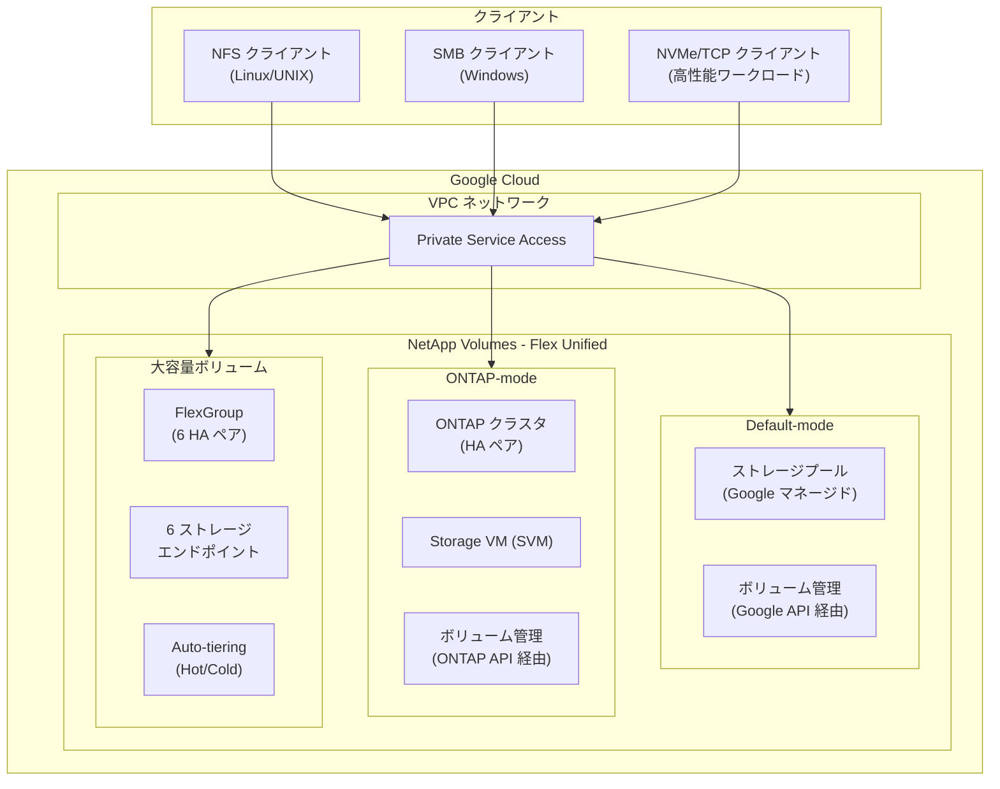

# NetApp Volumes: Flex Unified サービスレベル / ONTAP-mode / 大容量ボリュームが GA

**リリース日**: 2026-04-17

**サービス**: Google Cloud NetApp Volumes

**機能**: Flex Unified サービスレベル (NFS/SMB/NVMe/TCP)、ONTAP-mode、大容量ボリュームの一般提供開始

**ステータス**: GA (一般提供)

[このアップデートのインフォグラフィックを見る](https://takech9203.github.io/google-cloud-news-summary/20260417-netapp-volumes-flex-unified-ga.html)

## 概要

Google Cloud NetApp Volumes の Flex Unified サービスレベルに関する 3 つの重要な機能が一般提供 (GA) となりました。具体的には、(1) Flex Unified プールの ONTAP-mode、(2) Flex Unified サービスレベルにおける NFS、SMB、NVMe/TCP プロトコルのサポート、(3) 大容量ボリューム (Large Capacity Volumes) 機能です。これらはいずれも 2026 年 2 月のプレビュー提供を経て、本番環境での利用が可能になりました。

Flex Unified サービスレベルは、容量とパフォーマンスを独立してプロビジョニングできる汎用ストレージティアです。今回の GA により、ファイルストレージ (NFS/SMB) とブロックストレージ (NVMe/TCP) を単一のサービスレベルで統合的に利用でき、さらに ONTAP の高度なデータ管理機能をフルに活用する ONTAP-mode も本番ワークロードに適用可能になりました。大容量ボリュームは最大 2.48 PiB (auto-tiering 有効時は 20 PiB) のボリュームサイズと最大 22 GiBps のスループットを提供し、大規模データセットを扱うエンタープライズワークロードに対応します。

この一連のアップデートは、Google Cloud 上でエンタープライズグレードのストレージソリューションを必要とするすべてのユーザーを対象としており、特にオンプレミスの NetApp ONTAP 環境からクラウドへの移行を検討している組織にとって大きな価値を持ちます。

**アップデート前の課題**

- ONTAP-mode はプレビュー段階であり、本番ワークロードでの利用には SLA が保証されていなかった
- Flex Unified での NFS/SMB プロトコルサポートがプレビュー段階で、ファイルストレージとしての利用に制約があった
- NVMe/TCP プロトコルによる高性能ブロックストレージアクセスが GA として利用できなかった
- 大容量ボリューム機能がプレビューのため、ペタバイト規模のデータセットに対する本番利用が制限されていた
- 高度な ONTAP データ管理機能を Google Cloud 上でフルに活用するための GA レベルのサポートがなかった

**アップデート後の改善**

- ONTAP-mode が GA となり、SLA 付きで本番環境での ONTAP クラスタ管理が可能になった
- NFS、SMB、NVMe/TCP プロトコルが GA として Flex Unified サービスレベルで利用可能になった
- 大容量ボリュームが GA となり、最大 2.48 PiB (auto-tiering 時 20 PiB) のボリュームを本番環境で運用可能になった
- 最大 22 GiBps のスループットと 750,000 IOPS により、高性能が要求されるワークロードに対応可能になった
- 単一のサービスレベルでファイル (NFS/SMB) とブロック (NVMe/TCP) の両方をサポートし、ストレージ管理が統合された

## アーキテクチャ図



Flex Unified サービスレベルは、Default-mode と ONTAP-mode の 2 つの運用モードを提供します。大容量ボリュームは 6 つの HA ペアと FlexGroup 技術を活用し、複数のストレージエンドポイントでクライアントトラフィックを負荷分散します。

## サービスアップデートの詳細

### 主要機能

1. **ONTAP-mode の GA**
   - Flex Unified ストレージプールを ONTAP クラスタとして運用可能
   - ONTAP の SVM、ボリューム、プロトコル、スナップショット、レプリケーションなどの高度な機能にフルアクセス
   - アクティブ-パッシブ HA ペアによる高可用性構成
   - Google Cloud コンソール、gcloud CLI、Terraform、API からデプロイ可能
   - ONTAP レベルでのボリューム作成・管理、エクスポートポリシー設定、スナップショット管理が可能
   - Google がストレージプール、ネットワーク、CMEK を管理し、ONTAP のアップグレードも自動実行

2. **Flex Unified サービスレベルの NFS/SMB/NVMe/TCP 対応 GA**
   - NFS (v3, v4.1, v4.2)、SMB (2.1, 3.0, 3.1.1)、NVMe/TCP プロトコルを GA としてサポート
   - 容量とパフォーマンスの独立プロビジョニング (最大 5 GiBps スループット、160,000 IOPS)
   - ストレージプール容量: 1 TiB から 425 TiB
   - ボリューム容量: 1 GiB から 300 TiB
   - ゾーナルおよびリージョナルの高可用性オプション
   - SMB の continuously available shares (Microsoft SQL Server、FSLogix) をサポート

3. **大容量ボリューム (Large Capacity Volumes) の GA**
   - NFS および SMB プロトコルのファイル専用ソリューション
   - ボリュームサイズ: 4.8 TiB から 2.48 PiB (auto-tiering なし)、最大 20 PiB (auto-tiering あり)
   - 最大スループット: 22 GiBps、最大 IOPS: 750,000
   - 6 つのストレージエンドポイント (IP アドレス) による負荷分散
   - FlexGroup 技術を基盤とした 6 つのアクティブ-パッシブ HA ペア構成
   - 1 GiB 単位での細かなサイズ変更が可能

## 技術仕様

### Flex Unified サービスレベル - パフォーマンス比較

| 項目 | 通常ボリューム | 大容量ボリューム |
|------|---------------|-----------------|
| ストレージプール容量 | 1 - 425 TiB | 6 TiB - 2.48 PiB (auto-tiering なし) / 20 PiB (auto-tiering あり) |
| ボリューム容量 | 1 GiB - 300 TiB | 4.8 TiB - 2.48 PiB / 20 PiB |
| 最大スループット | 5 GiBps | 22 GiBps |
| 最大 IOPS | 160,000 | 750,000 |
| ストレージエンドポイント数 | 1 | 6 |
| HA ペア数 | 1 | 6 |

### サポートプロトコル

| プロトコル | Default-mode | ONTAP-mode |
|-----------|-------------|------------|
| NFS (v3, v4.1, v4.2) | 対応 | 対応 |
| SMB (2.1, 3.0, 3.1.1) | 対応 | 対応 |
| NVMe/TCP | 対応 | 対応 |
| iSCSI | 対応 | 対応 |

### Default-mode と ONTAP-mode の比較

| 項目 | Default-mode | ONTAP-mode |
|------|-------------|------------|
| 管理方式 | Google API / コンソール | ONTAP API (+ プール管理は Google API) |
| 対象ユーザー | シンプルな管理を好むユーザー | ONTAP 経験者 |
| ボリューム管理 | Google Cloud コンソール | ONTAP CLI / API |
| スナップショット上限 | 255 / ボリューム | 1,023 / ボリューム |
| ボリュームクローン | シンクローン | シッククローン |
| SMB ワークグループモード | 非対応 (ドメインのみ) | 対応 |
| FlexCache | 対応 | 対応 |
| CMEK | 対応 | 対応 |

### ストレージプールのデプロイ (ONTAP-mode)

```bash
# gcloud CLI でのストレージプール作成例
gcloud netapp storage-pools create POOL_NAME \
    --location=LOCATION \
    --service-level=FLEX \
    --capacity=CAPACITY_GIB \
    --network=VPC_NAME \
    --storage-pool-type=FLEX_UNIFIED \
    --deployment-type=ONTAP_MODE \
    --project=PROJECT_ID
```

## 設定方法

### 前提条件

1. Google Cloud プロジェクトで NetApp Volumes API が有効化されていること
2. 適切な IAM 権限 (netapp.admin ロールなど) が付与されていること
3. VPC ネットワークに Private Service Access (PSA) が構成されていること
4. ONTAP-mode を使用する場合、ONTAP の管理知識があること
5. 大容量ボリュームを使用する場合、デフォルトクォータ (25 TiB/リージョン) の引き上げが必要

### 手順

#### ステップ 1: Private Service Access の構成

```bash
# PSA 用の IP アドレス範囲を予約
gcloud compute addresses create netapp-volumes-range \
    --global \
    --purpose=VPC_PEERING \
    --addresses=10.0.0.0 \
    --prefix-length=20 \
    --network=VPC_NAME \
    --project=PROJECT_ID

# プライベートサービス接続を作成
gcloud services vpc-peerings connect \
    --service=netapp.servicenetworking.goog \
    --ranges=netapp-volumes-range \
    --network=VPC_NAME \
    --project=PROJECT_ID
```

VPC ネットワークと NetApp Volumes 間のプライベート接続を確立します。

#### ステップ 2: ストレージプールの作成

```bash
# Flex Unified Default-mode のストレージプール作成
gcloud netapp storage-pools create my-flex-unified-pool \
    --location=us-central1 \
    --service-level=FLEX \
    --capacity=10240 \
    --network=my-vpc \
    --storage-pool-type=FLEX_UNIFIED \
    --project=my-project
```

ストレージプールの容量とパフォーマンスを指定して作成します。容量は後から増やすことも可能です。

#### ステップ 3: ボリュームの作成

```bash
# NFS ボリュームの作成例 (Default-mode)
gcloud netapp volumes create my-volume \
    --location=us-central1 \
    --capacity=1024 \
    --storage-pool=my-flex-unified-pool \
    --protocols=NFSV3 \
    --share-name=my-share \
    --project=my-project
```

ストレージプール内にボリュームを作成します。ONTAP-mode の場合はボリュームの作成と管理は ONTAP API を使用します。

## メリット

### ビジネス面

- **ストレージ統合によるコスト最適化**: 単一の Flex Unified サービスレベルでファイル (NFS/SMB) とブロック (NVMe/TCP/iSCSI) の両方を管理でき、複数のストレージサービスを使い分ける必要がない
- **クラウド移行の加速**: ONTAP-mode により、オンプレミスの NetApp ONTAP 環境と同じ運用方法で Google Cloud 上のストレージを管理でき、既存のスキルと知識をそのまま活用可能
- **コミット利用割引 (CUD)**: 1 年契約で 15%、3 年契約で 20% のオンデマンド料金からの割引が利用可能
- **ペタバイト規模の対応**: 大容量ボリュームにより、これまでクラウド移行が困難だった大規模データセットのワークロードにも対応

### 技術面

- **高パフォーマンス**: 通常ボリュームで最大 5 GiBps / 160,000 IOPS、大容量ボリュームで最大 22 GiBps / 750,000 IOPS を実現
- **柔軟なパフォーマンス調整**: 容量とスループット / IOPS を独立してプロビジョニング可能。スループットは 64 MiBps から 5 GiBps まで 1 MiBps 単位で調整可能
- **高度なデータ管理**: ONTAP-mode ではスナップショット (最大 1,023/ボリューム)、レプリケーション、FlexCache、FlexGroup など ONTAP のフル機能を活用可能
- **Auto-tiering**: ホットティアとコールドティアの自動階層化により、アクセス頻度の低いデータのストレージコストを自動的に削減

## デメリット・制約事項

### 制限事項

- 大容量ボリュームと通常ボリューム間の変換は作成後にはできない
- ONTAP-mode では Google Cloud コンソールからのボリューム管理ができず、ONTAP API/CLI の操作知識が必要
- iSCSI ボリュームのサイズ縮小は非対応
- 大容量ボリュームのデフォルトクォータは 25 TiB/リージョンのため、大規模利用にはクォータ引き上げ申請が必要
- Flex Unified の利用可能リージョンは Standard/Premium/Extreme と比較して限定的

### 考慮すべき点

- ONTAP-mode ではストレージプール以外のリソース (ボリューム等) のモニタリング責任がユーザー側にある
- ONTAP-mode と Default-mode 間の移行パスが限定される可能性がある
- 大容量ボリュームを使用する場合、6 つのストレージエンドポイントへの接続に対応するクライアント設定が必要
- ストレージプール容量の増加時に、基盤 VM のアップグレードが発生し、短時間の I/O 停止が生じる可能性がある
- auto-tiering 有効時、ホットティアのサイズは縮小不可のため、大量のコールドデータ移行時の計画が重要

## ユースケース

### ユースケース 1: オンプレミス NetApp ONTAP からのクラウド移行

**シナリオ**: 大規模な製造企業がオンプレミスの NetApp ONTAP ストレージシステムで CAD データ、シミュレーションデータ、ドキュメント管理を運用しており、Google Cloud への段階的な移行を計画している。ONTAP の運用ノウハウを持つストレージ管理チームが存在する。

**実装例**:
```bash
# ONTAP-mode ストレージプールの作成
gcloud netapp storage-pools create cad-storage-pool \
    --location=asia-northeast2 \
    --service-level=FLEX \
    --capacity=102400 \
    --network=prod-vpc \
    --storage-pool-type=FLEX_UNIFIED \
    --deployment-type=ONTAP_MODE \
    --project=manufacturing-prod

# ボリューム移行の設定 (ONTAP CLI で実施)
# SnapMirror を使用してオンプレミスから NetApp Volumes へデータを複製
```

**効果**: 既存の ONTAP 運用プロセスとスクリプトをそのまま活用でき、チームの再教育コストを最小化しながらクラウド移行を実現。段階的なデータ移行により、ダウンタイムを最小限に抑えられる。

### ユースケース 2: AI/ML トレーニングデータの大規模ストレージ

**シナリオ**: AI/ML チームが数百テラバイトから数ペタバイト規模のトレーニングデータセットを管理しており、複数の GPU インスタンスから高スループットでの並列読み取りが必要。

**効果**: 大容量ボリューム (最大 20 PiB) と 22 GiBps のスループット、6 つのストレージエンドポイントによる負荷分散により、大量の GPU ノードからの並列データアクセスを高性能で実現。auto-tiering により、使用頻度の低い過去のデータセットのストレージコストを自動最適化。

### ユースケース 3: マルチプロトコル統合ストレージ

**シナリオ**: エンタープライズ環境で、Windows ファイルサーバー (SMB)、Linux アプリケーション (NFS)、高性能データベース (NVMe/TCP) が混在しており、それぞれ別のストレージサービスを使用していた。

**効果**: Flex Unified サービスレベルで NFS、SMB、NVMe/TCP を単一のストレージプールから提供することで、ストレージ管理の統合と簡素化を実現。管理対象のストレージサービスが減少し、運用コストとオーバーヘッドを削減。

## 料金

NetApp Volumes の料金はサービスレベル、リージョン、割り当て容量に基づいて課金されます。Flex Unified の場合、ストレージプールの容量に加えて、プロビジョニングしたスループットと IOPS に対しても課金されます。

### 料金体系

| 項目 | 説明 |
|------|------|
| ストレージプール容量 | リージョンとサービスレベルに応じた GiB 単位の課金 |
| スループット | プロビジョニングした MiBps 単位の課金 |
| IOPS | プロビジョニングした IOPS 単位の課金 (含まれる分を超えた場合) |
| コールドティア (auto-tiering) | ホットティアよりも低コストの GiB 単位課金 |
| CUD 割引 | 1 年: 15% OFF / 3 年: 20% OFF (最低 $11.38/時間、約 $100,000/年) |

最新の料金詳細は [NetApp Volumes pricing](https://cloud.google.com/netapp/volumes/pricing) を参照してください。

## 利用可能リージョン

Flex Unified サービスレベルは以下のリージョンで利用可能です。

| リージョン | 説明 |
|-----------|------|
| asia-northeast2 | 大阪 |
| asia-south1 | ムンバイ |
| asia-southeast1 | シンガポール |
| australia-southeast1 | シドニー |
| europe-west1 | ベルギー |
| europe-west3 | フランクフルト |
| europe-west4 | オランダ |
| me-central2 | ダンマーム |
| me-west1 | テルアビブ |
| southamerica-east1 | サンパウロ |
| us-central1 | アイオワ |
| us-east1 | サウスカロライナ |
| us-east4 | バージニア北部 |
| us-west1 | オレゴン |
| us-west4 | ラスベガス |

## 関連サービス・機能

- **Google Cloud VMware Engine**: NetApp Volumes を VMware ワークロードの外部ストレージとして利用可能。NFS データストアとして接続し、VMware 環境のストレージ機能を拡張
- **Compute Engine**: NFS/SMB マウントや iSCSI/NVMe/TCP 接続により、Compute Engine VM からストレージボリュームにアクセス
- **Network Connectivity Center**: Producer VPC スポークを使用した追加ネットワーク接続をサポート (GA)
- **Cloud KMS / CMEK**: 顧客管理の暗号化キーによるボリュームデータの暗号化をサポート
- **FlexCache**: ONTAP-mode での FlexCache によるリモートデータのキャッシュアクセラレーション
- **Active Directory**: SMB アクセスや NFS の ID マッピングに Active Directory 連携をサポート

## 参考リンク

- [インフォグラフィック](https://takech9203.github.io/google-cloud-news-summary/20260417-netapp-volumes-flex-unified-ga.html)
- [公式リリースノート](https://docs.cloud.google.com/release-notes#April_17_2026)
- [NetApp Volumes 概要](https://docs.cloud.google.com/netapp/volumes/docs/discover/overview)
- [ONTAP-mode について](https://docs.cloud.google.com/netapp/volumes/docs/ontap/overview#about_ontap-mode)
- [サービスレベル](https://docs.cloud.google.com/netapp/volumes/docs/discover/service-levels)
- [大容量ボリューム](https://docs.cloud.google.com/netapp/volumes/docs/configure-and-use/volumes/overview#large-capacity-volumes)
- [主要機能](https://docs.cloud.google.com/netapp/volumes/docs/discover/overview#key_features)
- [料金ページ](https://cloud.google.com/netapp/volumes/pricing)

## まとめ

今回の GA リリースにより、Google Cloud NetApp Volumes の Flex Unified サービスレベルは、ONTAP-mode による高度なストレージ管理、NFS/SMB/NVMe/TCP のマルチプロトコル対応、そしてペタバイト規模の大容量ボリュームという 3 つの柱が本番環境で利用可能になりました。オンプレミスの NetApp ONTAP 環境を運用している組織にとっては、既存の運用ノウハウを活かしたクラウド移行の有力な選択肢となります。大規模データを扱うワークロードや、マルチプロトコル環境の統合を検討している場合は、Flex Unified サービスレベルの評価を推奨します。

---

**タグ**: #NetAppVolumes #FlexUnified #ONTAP #NVMeTCP #LargeCapacityVolumes #GA #Storage #NFS #SMB #BlockStorage #GoogleCloud
