# Security Command Center: Application Design Center 連携によるプロアクティブセキュリティ評価

**リリース日**: 2026-04-17

**サービス**: Security Command Center

**機能**: Application Design Center 連携によるアプリケーションライフサイクルセキュリティ評価

**ステータス**: Preview

[このアップデートのインフォグラフィックを見る](https://takech9203.github.io/google-cloud-news-summary/20260417-scc-application-design-center.html)

## 概要

Security Command Center が Application Design Center (App Design Center) と連携し、アプリケーション開発ライフサイクル全体を通じたプロアクティブなセキュリティ評価を実行できるようになりました。本機能は Preview として提供され、Standard、Premium、Enterprise の全サービスティアで利用可能です。

この統合により、Security Command Center は「設計時 (design-time) の検出結果」と「ランタイム (runtime) の検出結果」の両方を統一的に表示します。設計時の検出結果は、App Design Center 内で Infrastructure as Code (IaC) テンプレートやアプリケーションをスキャンすることで、リソースがデプロイされる前に生成されます。ランタイムの検出結果は、クラウド環境にデプロイされたリソースから生成される従来の検出結果です。

本機能は、プラットフォームエンジニアリングチーム、DevSecOps エンジニア、セキュリティアーキテクトを主な対象としています。アプリケーションの設計・公開・デプロイの各フェーズでセキュリティ問題を早期に発見し、本番環境に脆弱な構成がデプロイされるリスクを大幅に低減できます。

**アップデート前の課題**

- Security Command Center の IaC 検証は、個別の Terraform プランファイルに対する検証 (gcloud CLI、Cloud Build、Jenkins、GitHub Actions) に限定されており、アプリケーション設計全体のセキュリティ評価を統合的に行う仕組みがなかった
- 設計時のセキュリティ検出結果とランタイムの検出結果が分離されており、アプリケーションのセキュリティポスチャを統一的に把握することが困難だった
- App Design Center で設計されたアプリケーションのセキュリティ評価を、テンプレート公開やデプロイのワークフロー内で自動的に実行する手段がなかった

**アップデート後の改善**

- App Design Center と Security Command Center の統合により、設計フェーズからデプロイフェーズまでのライフサイクル全体でセキュリティ評価が可能になった
- 設計時の検出結果とランタイムの検出結果が Security Command Center 上で統一的に表示され、アプリケーション全体のセキュリティポスチャを一元管理できるようになった
- テンプレート編集時のオンデマンド評価、Service Catalog 公開時の自動評価、デプロイ前の最終チェックの 3 段階でセキュリティ評価が自動的に実行されるようになった

## アーキテクチャ図

```mermaid
flowchart TD
    subgraph ADC["Application Design Center"]
        Design["設計フェーズ\n(テンプレート / アプリケーション編集)"]
        Publish["公開フェーズ\n(Service Catalog への公開)"]
        Deploy["デプロイフェーズ\n(リソースプロビジョニング)"]
        Design --> Publish --> Deploy
    end

    subgraph IaCScan["IaC セキュリティスキャン"]
        DesignScan["オンデマンド評価\n(設計時)"]
        PublishScan["自動評価\n(公開時)"]
        DeployScan["最終チェック\n(デプロイ前)"]
    end

    subgraph SCC["Security Command Center"]
        DesignFindings["設計時 Finding\n(Design-time)"]
        RuntimeFindings["ランタイム Finding\n(Runtime)"]
        UnifiedView["統一セキュリティビュー\n- Risk Overview\n- Findings ページ\n- Issues ページ\n- Compliance Monitor"]
        DesignFindings --> UnifiedView
        RuntimeFindings --> UnifiedView
    end

    subgraph Cloud["Google Cloud 環境"]
        Resources["デプロイ済みリソース\n(Compute, GKE, Storage 等)"]
    end

    Design -->|"編集トリガー"| DesignScan
    Publish -->|"公開トリガー"| PublishScan
    Deploy -->|"デプロイトリガー"| DeployScan

    DesignScan -->|"Finding 生成"| DesignFindings
    PublishScan -->|"Finding 生成"| DesignFindings
    DeployScan -->|"Finding 生成"| DesignFindings

    Deploy -->|"リソースデプロイ"| Resources
    Resources -->|"ランタイムスキャン"| RuntimeFindings
```



App Design Center のアプリケーション開発ライフサイクル (設計・公開・デプロイ) の各フェーズで IaC セキュリティスキャンが実行され、検出結果が Security Command Center に設計時 Finding として送信されます。デプロイ後のリソースからはランタイム Finding が生成され、両方の検出結果が統一ビューで表示されます。

## サービスアップデートの詳細

### 主要機能

1. **設計時セキュリティ評価 (Design-time Findings)**
   - App Design Center 内で IaC テンプレートやアプリケーションをスキャンし、リソースデプロイ前にセキュリティ問題を検出
   - 組織ポリシーや Security Health Analytics の検出ルールに対する違反を特定
   - 検出結果は Security Command Center の Finding として表示され、ランタイム Finding と同じインターフェースで管理可能

2. **ライフサイクル全体の評価ポイント**
   - **設計フェーズ**: テンプレートやアプリケーションの編集時にオンデマンドで評価を実行
   - **公開フェーズ**: テンプレートを Service Catalog に公開する際に自動で評価を実行
   - **デプロイフェーズ**: リソースをプロビジョニングする前に最終的な評価チェックを実行

3. **マネージドアプリケーションとアンマネージドアプリケーションの区別**
   - **マネージドアプリケーション**: App Design Center で設計されたアプリケーション。設計時評価をサポート
   - **アンマネージドアプリケーション**: App Hub に登録されているが App Design Center では管理されていないアプリケーション。ランタイム監視とリスク優先度付けをサポートするが、設計時評価は非対応

## 技術仕様

### アプリケーション分類

| アプリケーションタイプ | 設計時評価 | ランタイム評価 | 管理元 |
|----------------------|-----------|--------------|--------|
| マネージドアプリケーション | 対応 | 対応 | App Design Center |
| アンマネージドアプリケーション | 非対応 | 対応 | App Hub |

### セキュリティ評価のタイミング

| フェーズ | トリガー | 評価タイプ |
|---------|---------|-----------|
| 設計フェーズ | テンプレート / アプリケーション編集時 | オンデマンド |
| 公開フェーズ | Service Catalog への公開時 | 自動 |
| デプロイフェーズ | リソースプロビジョニング前 | 自動 (最終チェック) |

### 対応するサービスティア

| ティア | Application lifecycle security assessments |
|-------|------------------------------------------|
| Standard | 対応 |
| Premium | 対応 |
| Enterprise | 対応 |

## 設定方法

### 前提条件

1. Security Command Center が組織レベルで有効化されていること (Standard、Premium、または Enterprise ティア)
2. Application Design Center が設定済みであること
3. App Design Center のスペース (Space) が作成され、チームアクセスが割り当て済みであること

### 手順

#### ステップ 1: App Design Center でスペースを作成

App Design Center でテンプレートとアプリケーションを管理するためのスペースを作成します。

```bash
# gcloud CLI でスペースを作成
gcloud design-center spaces create SPACE_ID \
  --location=LOCATION \
  --project=PROJECT_ID
```

#### ステップ 2: IaC テンプレートをインポート

テンプレートに IaC (Terraform) をインポートして、セキュリティ評価の対象とします。

```bash
# GCS URI から IaC をインポート
gcloud design-center spaces application-templates import-iac TEMPLATE_ID \
  --location=us-central1 \
  --space=SPACE_ID \
  --gcs-uri=gs://my-bucket/iac

# ローカルファイルから IaC をインポート
gcloud design-center spaces application-templates import-iac TEMPLATE_ID \
  --location=us-central1 \
  --space=SPACE_ID \
  --iac-module-from-file=iac_module.yaml
```

#### ステップ 3: IaC の検証 (インポート前の確認)

インポート前に IaC の検証のみを実行することも可能です。

```bash
# IaC を検証のみ実行 (インポートなし)
gcloud design-center spaces applications import-iac APP_ID \
  --location=us-central1 \
  --space=SPACE_ID \
  --gcs-uri=gs://my-bucket/iac \
  --validate-iac
```

#### ステップ 4: Security Command Center で検出結果を確認

1. Google Cloud Console で Security Command Center に移動
2. Findings ページで設計時の検出結果を確認
3. App Hub アプリケーションでフィルタリングして、特定のアプリケーションに関連する検出結果を表示

## メリット

### ビジネス面

- **シフトレフトセキュリティの実現**: セキュリティ問題を開発ライフサイクルの早期段階で発見し、修正コストを大幅に削減。本番環境にデプロイされてからの修正と比較して、設計段階での修正は工数とリスクの両面で有利
- **ガバナンスの標準化**: プラットフォームチームが承認済みテンプレートにセキュリティ基準を組み込むことで、組織全体のセキュリティ標準を一貫して適用可能
- **コンプライアンス対応の強化**: 設計時からランタイムまでの包括的なセキュリティ評価により、監査証跡を自動生成し、コンプライアンス要件への適合を支援

### 技術面

- **統一されたセキュリティビュー**: 設計時とランタイムの検出結果を同一ダッシュボードで管理でき、セキュリティチームの運用効率が向上
- **自動化された評価ワークフロー**: テンプレート公開やデプロイのワークフロー内でセキュリティ評価が自動的に実行され、手動チェックの漏れを防止
- **既存の IaC 検証との補完**: 従来の Terraform プランファイルベースの IaC 検証 (gcloud CLI、Cloud Build、Jenkins、GitHub Actions) に加え、App Design Center のテンプレートレベルでの評価が追加され、多層的なセキュリティチェックが実現

## デメリット・制約事項

### 制限事項

- 本機能は Preview であり、Pre-GA Offerings Terms が適用される。本番環境での利用には限定的なサポートが提供される
- 設計時評価はマネージドアプリケーション (App Design Center で設計されたアプリケーション) のみが対象であり、アンマネージドアプリケーション (App Hub のみに登録) では利用できない
- IaC 検証は組織ポリシーと Security Health Analytics の検出ルールのみを対象としており、カスタムポリシーの範囲に制限がある

### 考慮すべき点

- App Design Center 自体の導入が前提となるため、既存の Terraform ワークフローや CI/CD パイプラインとの統合方法を検討する必要がある
- 設計時評価の結果はリソースがデプロイされる前の状態に基づくため、デプロイ後のランタイム環境で発生する動的なセキュリティ問題 (ネットワーク攻撃、認証情報の漏洩など) は検出対象外
- テンプレートの更新とセキュリティ評価のサイクルを組織の開発プロセスに組み込むための運用設計が必要

## ユースケース

### ユースケース 1: プラットフォームチームによるセキュアなテンプレートカタログの運用

**シナリオ**: 大規模な組織のプラットフォームチームが、開発者向けに承認済みのアプリケーションテンプレートカタログを運用している。テンプレートが組織のセキュリティポリシーに準拠していることを自動的に検証したい。

**実装例**:
```text
1. App Design Center でスペースを作成し、プラットフォームチームにアクセス権を付与
2. Web アプリケーション、マイクロサービス、RAG パターンなどのテンプレートを設計
3. テンプレート編集時にオンデマンドでセキュリティ評価を実行
4. Service Catalog に公開する際に自動評価で最終確認
5. Security Command Center で設計時 Finding を確認し、違反があればテンプレートを修正
```

**効果**: テンプレートカタログのすべてのテンプレートが組織のセキュリティ基準を満たすことが保証され、開発者はセキュアなテンプレートを選択してアプリケーションを迅速にデプロイできる。

### ユースケース 2: デプロイ前のセキュリティゲートとしての活用

**シナリオ**: 金融機関の DevSecOps チームが、アプリケーションのデプロイ前にセキュリティ評価を必須とするガバナンスプロセスを導入したい。

**効果**: デプロイフェーズの最終チェックにより、セキュリティ違反を含むリソースが本番環境にデプロイされるリスクを排除できる。設計時とランタイムの検出結果を統合的に監視することで、アプリケーションのセキュリティポスチャの全体像を把握し、継続的な改善が可能になる。

## 料金

Application lifecycle security assessments は Security Command Center の Standard、Premium、Enterprise の全ティアで利用可能です。Standard ティアは無料で提供されます。

### 料金体系

| ティア | 利用可否 | 課金モデル |
|-------|---------|-----------|
| Standard | 対応 | 無料 |
| Premium | 対応 | 従量課金またはサブスクリプション |
| Enterprise | 対応 | サブスクリプション (要問い合わせ) |

詳細な料金は [Security Command Center の料金ページ](https://cloud.google.com/security-command-center/pricing) を参照してください。

## 利用可能リージョン

Application Design Center は複数のロケーションでサポートされています。IaC のインポートやアプリケーション管理には `--location` フラグでロケーションを指定します。詳細は [Application Design Center ドキュメント](https://cloud.google.com/application-design-center/docs/overview) を参照してください。

## 関連サービス・機能

- **Application Design Center (App Design Center)**: アプリケーションの設計とデプロイのためのプラットフォーム。テンプレートベースのガバナンス付き開発ワークフローを提供
- **App Hub**: Google Cloud リソースをアプリケーション単位で管理・可視化するサービス。App Design Center からデプロイされたアプリケーションのコンポーネントは自動的に App Hub に登録される
- **IaC 検証 (IaC Validation)**: Terraform プランファイルを組織ポリシーと Security Health Analytics の検出ルールに対して検証する既存機能。Cloud Build、Jenkins、GitHub Actions との統合をサポート
- **Security Posture**: セキュリティポスチャを定義・デプロイし、Google Cloud リソースのセキュリティ状態を監視するサービス。IaC 検証のポリシーベースとして機能
- **Service Catalog**: App Design Center のテンプレートを共有するためのカタログ機能。テンプレート公開時に自動セキュリティ評価が実行される

## 参考リンク

- [インフォグラフィック](https://takech9203.github.io/google-cloud-news-summary/20260417-scc-application-design-center.html)
- [公式リリースノート](https://cloud.google.com/release-notes#April_17_2026)
- [Application lifecycle security assessments ドキュメント](https://cloud.google.com/security-command-center/docs/concepts-security-sources#application-security-assessments)
- [Application Design Center 概要](https://cloud.google.com/application-design-center/docs/overview)
- [IaC 検証ドキュメント](https://cloud.google.com/security-command-center/docs/validate-iac)
- [Security Command Center サービスティア](https://cloud.google.com/security-command-center/docs/service-tiers)
- [Security Command Center 料金ページ](https://cloud.google.com/security-command-center/pricing)

## まとめ

Security Command Center と Application Design Center の統合によるプロアクティブセキュリティ評価は、「シフトレフト」セキュリティを実現する重要なアップデートです。設計フェーズ、テンプレート公開フェーズ、デプロイフェーズの 3 段階でセキュリティ評価が自動的に実行され、設計時の検出結果とランタイムの検出結果が統一ビューで管理できるようになりました。App Design Center を活用してアプリケーションテンプレートを標準化している組織は、本機能を有効化してセキュリティ評価をライフサイクル全体に組み込むことを推奨します。

---

**タグ**: #SecurityCommandCenter #ApplicationDesignCenter #IaC検証 #シフトレフト #AppHub #セキュリティ評価 #Preview #インフラストラクチャコード
