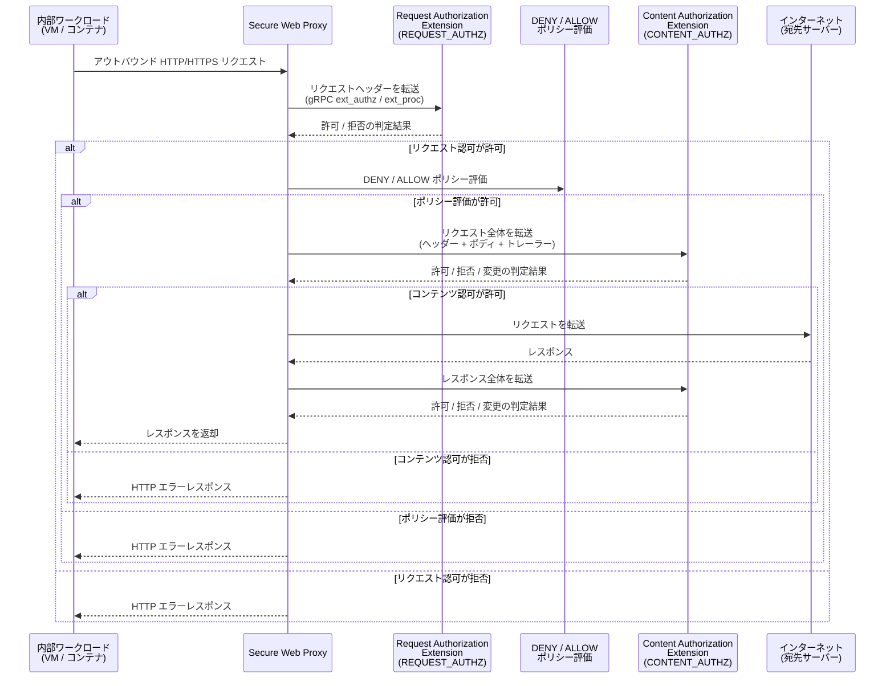

# Service Extensions: Secure Web Proxy 向け Authorization Extensions が Preview 提供開始

**リリース日**: 2026-04-17

**サービス**: Service Extensions

**機能**: Secure Web Proxy の処理パスへのカスタム認可サービスの挿入、および Authorization Extensions の認可ポリシーリクエスト/コンテンツプロファイル対応

**ステータス**: Preview

[このアップデートのインフォグラフィックを見る](https://takech9203.github.io/google-cloud-news-summary/20260417-service-extensions-swp-authorization.html)

## 概要

Service Extensions において、Secure Web Proxy (SWP) の処理パスにカスタム認可サービスを直接挿入できる Authorization Extensions 機能が Preview として提供開始されました。これにより、組織のアウトバウンド Web トラフィックに対して、Google 提供の組み込み認可エンジンを超えたカスタム認可ロジックを適用できるようになります。

さらに、Authorization Extensions が認可ポリシーの REQUEST_AUTHZ (リクエスト認可) プロファイルおよび CONTENT_AUTHZ (コンテンツ認可) プロファイルに対応しました。REQUEST_AUTHZ プロファイルはリクエストヘッダー情報に基づくアクセス制御を、CONTENT_AUTHZ プロファイルはリクエスト/レスポンスの本文を含む深いコンテンツ検査を行い、プロンプトインジェクション攻撃の防止や機密データ漏洩の検出などを実現します。

このアップデートは、Secure Web Proxy を使用してアウトバウンドトラフィックを制御している組織のセキュリティチーム、ネットワーク管理者、およびコンプライアンス担当者にとって重要です。外部ポリシーエンジンとの統合や、複数の認可システムからの認可判断の統合が可能になり、ゼロトラストセキュリティアーキテクチャの強化に大きく貢献します。

**アップデート前の課題**

- Secure Web Proxy の認可判断は組み込みの ALLOW/DENY ルールに限定されており、複雑な認可ロジックを表現することが困難だった
- 外部の認可エンジン (OPA、Cedar など) や社内独自の認可システムとの統合には、別途プロキシやミドルウェアの構築が必要だった
- アウトバウンドトラフィックに対するコンテンツベースのセキュリティ検査 (プロンプトインジェクション防止、機密データ漏洩防止) を SWP の処理パス内で行う手段がなかった

**アップデート後の改善**

- Authorization Extensions を使用してカスタム認可サービスを SWP の処理パスに直接挿入し、複雑な認可判断を実装可能になった
- REQUEST_AUTHZ プロファイルにより、リクエストヘッダーに基づくカスタム認可 (ユーザー属性、デバイス情報、コンテキストベースのアクセス制御) が可能になった
- CONTENT_AUTHZ プロファイルにより、リクエスト/レスポンスの全コンテンツに対する深いセキュリティ検査 (AI コンテンツフィルタリング、機密データ検出) が可能になった

## アーキテクチャ図



この図は、Secure Web Proxy の処理パスにおける Authorization Extensions の動作フローを示しています。リクエスト認可拡張 (REQUEST_AUTHZ) がまず呼び出され、次に組み込みの DENY/ALLOW ポリシー評価、最後にコンテンツ認可拡張 (CONTENT_AUTHZ) が呼び出されます。各段階で認可が拒否された場合、後続の処理はスキップされクライアントにエラーが返されます。

## サービスアップデートの詳細

### 主要機能

1. **Secure Web Proxy 向け Authorization Extensions**
   - Secure Web Proxy の処理パスにカスタム認可サービスを直接挿入可能
   - ユーザー管理の gRPC バックエンドサービスまたは FQDN ベースのサービスをコールアウト先として指定
   - Envoy の ext_proc または ext_authz プロトコルを使用した通信
   - フォワーディングルールあたり 1 つの Authorization Extension をアタッチ可能

2. **REQUEST_AUTHZ ポリシープロファイル**
   - HTTP リクエストヘッダー情報に基づくアクセス制御
   - ALLOW、DENY、CUSTOM の 3 つのアクション種別をサポート
   - CUSTOM アクションで認可判断をカスタム認可エンジンに委譲
   - リクエストヘッダー到着時に呼び出され、リクエストボディは認可拡張に転送されない
   - ポリシープロファイル未指定時のデフォルトプロファイル

3. **CONTENT_AUTHZ ポリシープロファイル**
   - リクエストおよびレスポンスの全コンテンツ (ヘッダー、ボディ、トレーラー) に対する深い検査
   - FULL_DUPLEX_STREAMED モードでのフル双方向ストリーミング処理
   - CUSTOM アクションのみをサポート (直接評価は不可)
   - Model Armor との統合により AI ガードレールの適用が可能
   - プロンプトインジェクション攻撃の防止、機密データ漏洩の検出、有害コンテンツのフィルタリング

4. **認可ポリシーの評価順序**
   - REQUEST_AUTHZ (カスタムリクエスト認可) が最初に評価
   - 次に DENY ポリシーが評価
   - 次に ALLOW ポリシーが評価
   - 最後に CONTENT_AUTHZ (カスタムコンテンツ認可) が評価
   - 各段階で拒否された場合、後続のポリシーは評価されない

## 技術仕様

### 対応プロファイルとプロトコル

| 項目 | REQUEST_AUTHZ | CONTENT_AUTHZ |
|------|:------------:|:-------------:|
| 対応アクション | ALLOW, DENY, CUSTOM | CUSTOM のみ |
| プロトコル | ext_proc / ext_authz | ext_proc |
| 処理対象 | リクエストヘッダーのみ | リクエスト/レスポンス全体 |
| ボディ処理 | なし | FULL_DUPLEX_STREAMED |
| デフォルトプロファイル | はい | いいえ |
| Model Armor 統合 | - | 対応 |

### 認可委譲先サービス

| 委譲先 | REQUEST_AUTHZ | CONTENT_AUTHZ |
|--------|:------------:|:-------------:|
| Google Cloud バックエンドサービス (ユーザー管理) | 対応 | 対応 |
| FQDN ベースサービス (ユーザー管理) | 対応 | 対応 |
| Model Armor (Google 管理) | - | 対応 |
| Identity-Aware Proxy (Google 管理) | 対応 | - |

### ext_authz API の CheckRequest / CheckResponse

```protobuf
// Authorization サービスインターフェース
service Authorization {
  rpc Check(CheckRequest) returns (CheckResponse) {}
}

message CheckRequest {
  // リクエスト属性 (ソース、宛先、ヘッダー等)
  AttributeContext attributes = 1;
}

message CheckResponse {
  // ステータス (OK = 許可、その他 = 拒否)
  google.rpc.Status status = 1;
  oneof http_response {
    // 拒否時のレスポンス
    DeniedHttpResponse denied_response = 2;
    // 許可時のレスポンス (ヘッダー変更可能)
    OkHttpResponse ok_response = 3;
  }
  // 後続のエクステンションへ渡すメタデータ
  google.protobuf.Struct dynamic_metadata = 4;
}
```

## 設定方法

### 前提条件

1. Google Cloud プロジェクトが作成済みであること
2. Secure Web Proxy インスタンスがデプロイ済みであること
3. Service Extensions API が有効化されていること
4. コールアウトバックエンドサービスが構成済みであること (HTTP/2 対応必須)
5. 必要な IAM ロールが付与されていること

### 手順

#### ステップ 1: コールアウトバックエンドサービスの構成

```bash
# バックエンドサービスの作成 (HTTP/2 プロトコル必須)
gcloud compute backend-services create authz-callout-backend \
    --project=PROJECT_ID \
    --region=REGION \
    --protocol=HTTP2 \
    --health-checks=HEALTH_CHECK_NAME \
    --load-balancing-scheme=INTERNAL_MANAGED
```

認可拡張に使用するバックエンドサービスは、Envoy の ext_proc または ext_authz プロトコルを実装した gRPC サービスである必要があります。

#### ステップ 2: Authorization Extension の作成

```bash
# AuthzExtension リソースの作成
gcloud service-extensions authz-extensions create my-authz-extension \
    --project=PROJECT_ID \
    --location=REGION \
    --backend-service=authz-callout-backend \
    --load-balancing-scheme=INTERNAL_MANAGED
```

#### ステップ 3: 認可ポリシーの作成 (REQUEST_AUTHZ)

```bash
# REQUEST_AUTHZ プロファイルの認可ポリシーを作成
gcloud network-security authz-policies create my-request-authz-policy \
    --project=PROJECT_ID \
    --location=REGION \
    --action=CUSTOM \
    --custom-provider='{"authzExtension": "projects/PROJECT_ID/locations/REGION/authzExtensions/my-authz-extension"}' \
    --policy-profile=REQUEST_AUTHZ \
    --target='{"loadBalancingScheme": "INTERNAL_MANAGED"}'
```

REQUEST_AUTHZ プロファイルを指定して、カスタム認可判断を Authorization Extension に委譲します。

#### ステップ 4: 認可ポリシーの作成 (CONTENT_AUTHZ) - オプション

```bash
# CONTENT_AUTHZ プロファイルの認可ポリシーを作成
gcloud network-security authz-policies create my-content-authz-policy \
    --project=PROJECT_ID \
    --location=REGION \
    --action=CUSTOM \
    --custom-provider='{"authzExtension": "projects/PROJECT_ID/locations/REGION/authzExtensions/my-content-authz-extension"}' \
    --policy-profile=CONTENT_AUTHZ \
    --target='{"loadBalancingScheme": "INTERNAL_MANAGED"}'
```

CONTENT_AUTHZ プロファイルにより、リクエスト/レスポンスの全コンテンツに対する深い検査が可能になります。

## メリット

### ビジネス面

- **セキュリティ態勢の強化**: アウトバウンドトラフィックに対してコンテキストベースの高度な認可判断を適用でき、ゼロトラストセキュリティモデルの実現を加速する
- **コンプライアンス要件への対応**: 業界固有の認可要件や規制準拠のためのカスタムポリシーを SWP の処理パス内で直接実施でき、追加インフラの構築コストを削減できる
- **AI セキュリティの統合**: CONTENT_AUTHZ プロファイルと Model Armor の統合により、生成 AI アプリケーションからのアウトバウンド推論トラフィックに対する AI ガードレールを一元的に適用可能

### 技術面

- **柔軟な認可アーキテクチャ**: 外部ポリシーエンジン (OPA、Cedar 等) や社内認可システムとシームレスに統合でき、既存の認可インフラを活用できる
- **多段階の認可評価**: REQUEST_AUTHZ と CONTENT_AUTHZ の 2 段階の認可拡張ポイントにより、ヘッダーレベルとコンテンツレベルの双方でセキュリティチェックを適用可能
- **メタデータの伝播**: CheckResponse の dynamic_metadata フィールドにより、認可拡張から後続のトラフィック拡張へコンテキスト情報を引き渡すことが可能
- **標準プロトコルの採用**: Envoy の ext_proc / ext_authz プロトコルを使用するため、Envoy エコシステムの豊富なライブラリやツールを活用可能

## デメリット・制約事項

### 制限事項

- 本機能は Preview 段階であり、本番環境での使用には SLA が適用されない。Pre-GA Offerings Terms が適用される
- フォワーディングルールあたり 1 つの Authorization Extension のみアタッチ可能
- Authorization Extensions ではロードバランサーからバックエンドサービスへリクエストボディは転送されない (ext_authz の場合)
- コールアウトバックエンドサービスは HTTP/2 プロトコルを使用する必要がある
- gRPC レスポンスメッセージの最大サイズは 128 KB。超過した場合 RESOURCE_EXHAUSTED エラーでストリームが閉じられる
- 特定のヘッダー (X-Forwarded-*, X-Google-*, :method, :authority, :scheme, host 等) の操作は制限されている
- プロジェクトあたりのリージョン別 Authorization Extensions 数は最大 10 (クォータ増加リクエスト可能)

### 考慮すべき点

- コールアウトの追加によりリクエスト処理のレイテンシが増加するため、認可サービスは SWP と同一リージョンにデプロイすることを推奨
- 認可サービスの可用性が SWP 全体の可用性に影響するため、高可用性設計が必要
- ext_authz プロトコル使用時はリクエストボディにアクセスできないため、コンテンツベースの検査が必要な場合は CONTENT_AUTHZ プロファイル (ext_proc) を使用する必要がある
- Preview 段階のため、GA までに API やリソース定義に破壊的変更が入る可能性がある

## ユースケース

### ユースケース 1: 外部ポリシーエンジンとの統合によるコンテキストベース認可

**シナリオ**: 企業が Open Policy Agent (OPA) を社内の統一認可エンジンとして使用しており、Secure Web Proxy を通過するアウトバウンドトラフィックにも同じポリシーを適用したい。

**実装例**:
```yaml
# OPA ポリシー例: 部門ごとのアウトバウンドアクセス制御
package swp.authz

default allow = false

allow {
    input.attributes.source.principal == "serviceAccount:finance-app@project.iam.gserviceaccount.com"
    input.attributes.request.http.host == "api.banking-partner.com"
    input.attributes.request.http.method == "GET"
}

allow {
    input.attributes.source.principal == "serviceAccount:hr-app@project.iam.gserviceaccount.com"
    input.attributes.request.http.host == "api.hr-saas.com"
}
```

**効果**: 全社的に統一された認可ポリシーをアウトバウンドトラフィックにも適用でき、ポリシーの一貫性が保たれる。ポリシーの更新を OPA 側で一元管理できるため運用負荷も軽減される。

### ユースケース 2: AI アプリケーションの出力コンテンツフィルタリング

**シナリオ**: 内部の生成 AI アプリケーションが外部 API にアクセスする際に、CONTENT_AUTHZ プロファイルと Model Armor を使用して、リクエスト/レスポンスのコンテンツセキュリティ検査を行いたい。

**効果**: プロンプトインジェクション攻撃の防止、機密データ (個人情報、クレデンシャル等) の外部漏洩防止、有害コンテンツのフィルタリングが SWP の処理パス内で自動的に実施され、AI アプリケーション側の実装変更なしにセキュリティを強化できる。

### ユースケース 3: マルチ認可システムの統合

**シナリオ**: 組織が Google の IAM 認可と社内独自の認可システムの両方を使用しており、SWP を通過するトラフィックに対して両方の認可判断を統合したい。

**効果**: REQUEST_AUTHZ 拡張で Google IAM の認可判断を補完し、組織固有の認可要件 (時間帯制限、リクエストレート制限、地理的制限等) を追加で適用できる。dynamic_metadata を通じた情報伝播により、後続の処理で認可コンテキストを利用したトラフィック制御も可能になる。

## 料金

Service Extensions の Authorization Extensions は、コールアウトの処理量に基づいて課金されます。Preview 期間中の料金については変更される可能性があります。

### 料金例

| 項目 | 料金 |
|------|------|
| Secure Web Proxy | データ処理量に基づく従量課金 |
| Service Extensions コールアウト | 処理リクエスト数に基づく従量課金 |
| コールアウトバックエンド (Compute Engine / Cloud Run) | 使用するコンピューティングリソースの従量課金 |
| Model Armor (CONTENT_AUTHZ 連携時) | リクエスト数に応じた従量課金 |

詳細な料金は [Service Extensions の料金ページ](https://cloud.google.com/service-extensions/pricing) および [Secure Web Proxy の料金ページ](https://cloud.google.com/secure-web-proxy/pricing) を参照してください。

## 利用可能リージョン

本機能は Secure Web Proxy がサポートされているリージョンで利用可能です。Authorization Extensions のポリシープロファイル (REQUEST_AUTHZ / CONTENT_AUTHZ) は、以下のサービスでサポートされています。

- Regional external Application Load Balancers
- Regional internal Application Load Balancers
- Secure Web Proxy

## 関連サービス・機能

- **Secure Web Proxy**: アウトバウンド Web トラフィック (HTTP/HTTPS) を保護するクラウドファーストのプロキシサービス。Authorization Extensions のホスト環境となる
- **Cloud Load Balancing Authorization Policies**: ロードバランサーにおけるアクセス制御ポリシー。Authorization Extensions と連携して CUSTOM アクションによる認可委譲を実現
- **Model Armor**: AI ガードレールサービス。CONTENT_AUTHZ プロファイルと統合して、プロンプトインジェクション防止や機密データ漏洩防止を提供
- **Identity-Aware Proxy (IAP)**: ユーザー ID とリクエストコンテキストに基づくアクセス制御。Regional ロードバランサーで REQUEST_AUTHZ 認可委譲先として利用可能
- **Service Extensions (Traffic Extensions / Route Extensions)**: 認可拡張以外のデータパス拡張機能。認可後のトラフィック処理やルーティングのカスタマイズに使用

## 参考リンク

- [インフォグラフィック](https://takech9203.github.io/google-cloud-news-summary/20260417-service-extensions-swp-authorization.html)
- [公式リリースノート](https://docs.cloud.google.com/release-notes#April_17_2026)
- [Callouts for Secure Web Proxy](https://docs.cloud.google.com/service-extensions/docs/swp-extensions-overview)
- [Authorization Extensions の概要](https://docs.cloud.google.com/service-extensions/docs/lb-extensions-overview#authorization-extensions)
- [Authorization Extensions の構成](https://docs.cloud.google.com/service-extensions/docs/configure-authorization-extensions)
- [認可ポリシーの概要](https://docs.cloud.google.com/load-balancing/docs/auth-policy/auth-policy-overview)
- [Service Extensions の概要](https://docs.cloud.google.com/service-extensions/docs/overview)
- [Secure Web Proxy の概要](https://docs.cloud.google.com/secure-web-proxy/docs/overview)
- [Service Extensions のクォータと制限](https://docs.cloud.google.com/service-extensions/docs/quotas)
- [Service Extensions の料金](https://cloud.google.com/service-extensions/pricing)

## まとめ

Service Extensions による Secure Web Proxy 向け Authorization Extensions の Preview 提供は、アウトバウンドトラフィックセキュリティにおける重要な進化です。REQUEST_AUTHZ と CONTENT_AUTHZ の 2 つのポリシープロファイルにより、ヘッダーレベルのアクセス制御からコンテンツレベルの深い検査まで、多段階のカスタム認可を SWP の処理パス内で実現できます。特に AI アプリケーションのアウトバウンドトラフィックに対する Model Armor 統合は、生成 AI の安全な運用において大きな価値を提供します。Preview 段階のため本番環境での利用には注意が必要ですが、概念実証やステージング環境での検証を開始し、GA リリースに備えることを推奨します。

---

**タグ**: #ServiceExtensions #SecureWebProxy #AuthorizationExtensions #Preview #認可ポリシー #REQUEST_AUTHZ #CONTENT_AUTHZ #ModelArmor #ゼロトラスト #アウトバウンドセキュリティ #ext_authz #ext_proc
