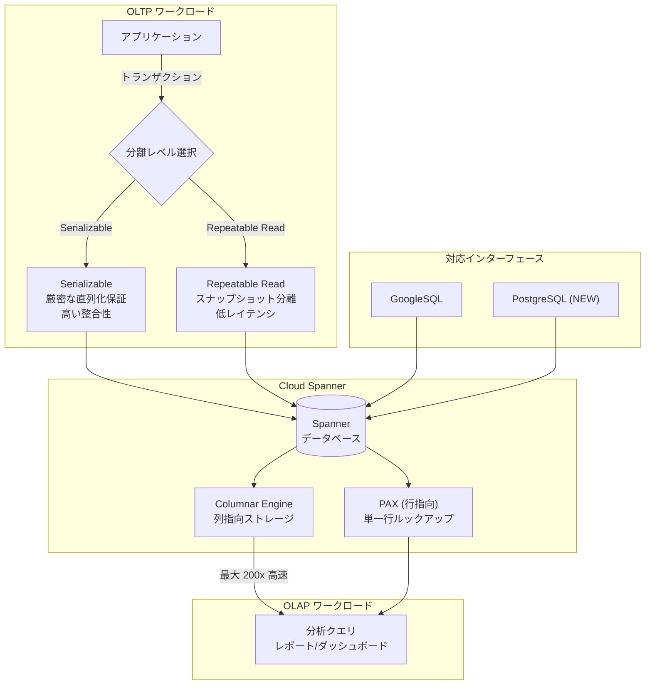

# Spanner: Repeatable Read Isolation & Columnar Engine GA

**リリース日**: 2026-04-17

**サービス**: Cloud Spanner

**機能**: Repeatable Read Isolation / Columnar Engine 一般提供 (GA)

**ステータス**: GA (一般提供)

[このアップデートのインフォグラフィックを見る](https://takech9203.github.io/google-cloud-news-summary/20260417-spanner-repeatable-read-columnar-engine-ga.html)

## 概要

Cloud Spanner において、2 つの重要な機能が一般提供 (GA) となった。1 つ目は **Repeatable Read Isolation** (反復読み取り分離レベル) で、読み取りが多く書き込みが少ないワークロードにおいてレイテンシの低減とトランザクション失敗率の改善を実現する。2 つ目は **Columnar Engine** (カラムナーエンジン) で、運用中のデータに対する分析クエリのスキャン性能を最大 200 倍高速化する。今回のリリースでは Columnar Engine の PostgreSQL インターフェースへの対応も追加された。

これらの GA は、Spanner をトランザクション処理 (OLTP) と分析処理 (OLAP) の両方に対応するデータベースとしてさらに強化するものであり、他のデータベースからの移行を容易にし、ETL パイプラインの簡素化を推進する。Solutions Architect や DBA にとって、ワークロードの最適化とアーキテクチャ設計の選択肢を広げる重要なアップデートである。

**アップデート前の課題**

- Spanner のデフォルトの分離レベルは Serializable であり、読み書き競合が多いワークロードではトランザクションのアボートが頻発し、リトライによるレイテンシ増加が発生していた
- 他のデータベース (MySQL、PostgreSQL) からの移行時に、Serializable 分離レベルに合わせたアプリケーション設計の変更が必要だった
- 分析クエリを実行するには ETL パイプラインで BigQuery 等の OLAP システムにデータを転送する必要があり、リアルタイム性が損なわれていた
- Columnar Engine は GoogleSQL インターフェースのみ対応しており、PostgreSQL インターフェースのデータベースでは利用できなかった

**アップデート後の改善**

- Repeatable Read Isolation を選択することで、読み取りがロックを取得せず並行書き込みをブロックしなくなり、トランザクション失敗率が低下しレイテンシが改善された
- MySQL や PostgreSQL と同等のデフォルト分離レベルに設定可能となり、他のデータベースからの移行時のアプリケーション変更が最小化された
- Columnar Engine により ETL なしで運用データに対して最大 200 倍高速なスキャンが可能となり、リアルタイム分析が実現された
- PostgreSQL インターフェースでも Columnar Engine が利用可能となり、PostgreSQL 互換のワークロードでも分析性能の恩恵を受けられるようになった

## アーキテクチャ図



Spanner 上で OLTP ワークロードには Repeatable Read / Serializable の分離レベルを選択でき、OLAP ワークロードには Columnar Engine による高速スキャンが利用できる。今回の GA で PostgreSQL インターフェースからも Columnar Engine が利用可能となった。

## サービスアップデートの詳細

### 主要機能

1. **Repeatable Read Isolation (GA)**
   - スナップショット分離に基づく実装で、トランザクション開始時点のデータベースの一貫したスナップショットを読み取る
   - デフォルトの楽観的同時実行制御 (Optimistic Concurrency) では、読み取りがロックを取得せず並行書き込みをブロックしない
   - 悲観的同時実行制御 (Pessimistic Concurrency) では、`SELECT ... FOR UPDATE` や `lock_scanned_ranges=exclusive` ヒントによる排他ロックをサポート
   - クライアントレベルまたはトランザクションレベルで分離レベルを設定可能
   - Go、Java、Python、Node.js、C++、C# のクライアントライブラリおよび REST API で対応

2. **Columnar Engine (GA)**
   - 列指向ストレージ形式により、分析クエリのスキャン性能を最大 200 倍高速化
   - バックグラウンドのコンパクション処理で列指向フォーマットを自動生成し、クエリ時に最新の更新とマージして強整合性を維持
   - データベース、テーブル、インデックス単位で有効化/無効化が可能
   - 運用ワークロード (トランザクション処理) への影響なし

3. **PostgreSQL インターフェースでの Columnar Engine サポート (NEW)**
   - `ALTER DATABASE db_name SET spanner.columnar_policy TO enabled` で有効化
   - テーブルやインデックス単位での `COLUMNAR POLICY` 指定に対応
   - GoogleSQL インターフェースと同等の機能を提供

## 技術仕様

### Repeatable Read Isolation

| 項目 | 詳細 |
|------|------|
| 分離レベル | ANSI/ISO SQL 標準の Repeatable Read (スナップショット分離で実装) |
| デフォルト動作 | 楽観的同時実行制御 (ロックフリーの読み取り) |
| 対象トランザクション | 読み書きトランザクション、読み取り専用トランザクション |
| 設定レベル | クライアントレベル、トランザクションレベル |
| 既知の制約 | Write Skew 異常が発生する可能性あり (SELECT FOR UPDATE で回避可能) |
| 対応 API | REST API (`TransactionOptions.isolation_level`)、全クライアントライブラリ |

### Columnar Engine

| 項目 | 詳細 |
|------|------|
| 対応エディション | Enterprise、Enterprise Plus |
| 対応インターフェース | GoogleSQL、PostgreSQL (NEW) |
| スキャン高速化 | 最大 200 倍 |
| ストレージ増加 | 約 60% (データの種類と圧縮特性により変動) |
| 有効化単位 | データベース、テーブル、インデックス |
| バックアップ | カラムナーフォーマットはバックアップに含まれない |
| モニタリング | クエリプランの Columnar Read Share、SPANNER_SYS.QUERY_STATS_TOP_* の AVG_COLUMNAR_READ_SHARE |

### Repeatable Read の設定例

```python
from google.cloud.spanner_v1 import TransactionOptions

# クライアントレベルで Serializable を設定
spanner_client = spanner.Client(
    default_transaction_options=DefaultTransactionOptions(
        isolation_level=TransactionOptions.IsolationLevel.SERIALIZABLE
    )
)

# トランザクションレベルで Repeatable Read にオーバーライド
database.run_in_transaction(
    update_function,
    isolation_level=TransactionOptions.IsolationLevel.REPEATABLE_READ
)
```

### Columnar Engine の設定例 (PostgreSQL)

```sql
-- データベース全体で Columnar Engine を有効化
ALTER DATABASE "Music" SET spanner.columnar_policy TO enabled;

-- 特定テーブルで無効化
CREATE TABLE Concerts(
    VenueId bigint NOT NULL,
    SingerId bigint NOT NULL,
    ConcertDate date NOT NULL,
    PRIMARY KEY(VenueId, SingerId, ConcertDate)
) COLUMNAR POLICY disabled;

-- 既存テーブルで Columnar Engine を無効化
ALTER TABLE Singers SET COLUMNAR POLICY disabled;
```

### Columnar Engine の設定例 (GoogleSQL)

```sql
-- データベース全体で Columnar Engine を有効化
ALTER DATABASE Music SET OPTIONS (columnar_policy = 'enabled');

-- 特定テーブルで無効化
CREATE TABLE Concerts(
    VenueId INT64 NOT NULL,
    SingerId INT64 NOT NULL,
    ConcertDate DATE NOT NULL,
) PRIMARY KEY(VenueId, SingerId, ConcertDate),
OPTIONS (columnar_policy = 'disabled');
```

## メリット

### ビジネス面

- **移行コストの削減**: Repeatable Read が MySQL/PostgreSQL のデフォルト分離レベルと同等の動作を提供するため、他データベースからの移行時にアプリケーションの再設計が不要になるケースが増える
- **ETL パイプラインの簡素化**: Columnar Engine により運用データベース上で直接分析が可能となり、ETL 構築・運用のコストを削減できる
- **リアルタイムビジネスインテリジェンス**: 最新の運用データに対してインタラクティブなレイテンシで分析クエリを実行でき、意思決定のスピードが向上する

### 技術面

- **レイテンシ改善**: Repeatable Read ではロックフリーの読み取りにより、高い読み書き競合シナリオでのトランザクションレイテンシが低下する
- **トランザクション失敗率の低減**: スナップショット分離により、Serializable と比較してトランザクションのアボート率が低下する
- **最大 200 倍のスキャン高速化**: Columnar Engine の列指向ストレージにより、大量データスキャンを伴う分析クエリが劇的に高速化される
- **強整合性の維持**: Columnar Engine はバックグラウンドで列指向フォーマットを生成しつつ、クエリ時に最新の更新とマージするため、常に最新データで分析が可能

## デメリット・制約事項

### 制限事項

- Repeatable Read では Write Skew 異常が発生する可能性がある (アプリケーション固有のデータ整合性制約に依存する場合は `SELECT FOR UPDATE` による回避が必要)
- Columnar Engine は Enterprise または Enterprise Plus エディションでのみ利用可能 (Standard エディションでは使用不可)
- Columnar Engine を有効化するとストレージ使用量が約 60% 増加するため、インスタンスのストレージ容量に十分な余裕が必要
- カラムナーフォーマットはバックアップに含まれないため、リストア後にコンパクションが完了するまでカラムナーの恩恵は得られない

### 考慮すべき点

- Repeatable Read と Serializable の選択は、ワークロードの特性 (読み書き競合の程度、データ異常の許容度) に応じて慎重に判断する必要がある
- Columnar Engine のコンパクション処理は数日かかる場合があり、有効化直後にフル性能が発揮されるわけではない
- 高頻度の更新やランダム挿入がある場合、Columnar Engine のパフォーマンスに影響する可能性がある (追記型ワークロードが最適)
- `SELECT *` ではなく、必要なカラムのみを指定するクエリ設計が Columnar Engine の効果を最大化する

## ユースケース

### ユースケース 1: 他データベースからの移行

**シナリオ**: MySQL や PostgreSQL で動作しているアプリケーションを Spanner に移行する場合。既存アプリケーションはデフォルトの分離レベル (MySQL: REPEATABLE READ、PostgreSQL: READ COMMITTED) を前提として設計されている。

**実装例**:
```python
# クライアント作成時に Repeatable Read をデフォルトに設定
from google.cloud.spanner_v1 import TransactionOptions, DefaultTransactionOptions

spanner_client = spanner.Client(
    default_transaction_options=DefaultTransactionOptions(
        isolation_level=TransactionOptions.IsolationLevel.REPEATABLE_READ
    )
)
```

**効果**: アプリケーションコードの変更を最小限に抑えつつ、Spanner のスケーラビリティと高可用性の恩恵を受けることができる。

### ユースケース 2: リアルタイム運用レポーティング

**シナリオ**: EC サイトの運用データベースとして Spanner を使用しており、売上ダッシュボードやリアルタイム在庫レポートを運用データに対して直接実行したい。

**実装例**:
```sql
-- PostgreSQL インターフェースで Columnar Engine を有効化
ALTER DATABASE "ecommerce" SET spanner.columnar_policy TO enabled;

-- 大量データスキャンを伴う分析クエリ
SELECT category, SUM(amount) AS total_sales, COUNT(*) AS order_count
FROM orders
WHERE order_date >= CURRENT_DATE - INTERVAL '30 days'
GROUP BY category
ORDER BY total_sales DESC;
```

**効果**: ETL パイプラインなしで最新の運用データに対して高速な分析が可能となり、ビジネスの意思決定スピードが向上する。

### ユースケース 3: 読み取りが多いマイクロサービス

**シナリオ**: 商品カタログや在庫情報を頻繁に読み取るマイクロサービスが多数あり、少数のサービスがデータを更新する。Serializable ではリードヘビーなサービスのトランザクション失敗が頻発していた。

**効果**: Repeatable Read に切り替えることで、読み取りトランザクションのアボート率が低下し、全体的なシステムスループットが向上する。

## 料金

Columnar Engine は Spanner Enterprise エディションおよび Enterprise Plus エディションで利用可能であり、追加のストレージ使用量 (約 60% 増) に対してストレージ料金が発生する。Repeatable Read Isolation は全エディション (Standard、Enterprise、Enterprise Plus) で追加料金なしで利用可能である。

詳細な料金については [Spanner 料金ページ](https://cloud.google.com/spanner/pricing) を参照のこと。

## 利用可能リージョン

Repeatable Read Isolation および Columnar Engine は、Spanner が利用可能なすべてのリージョン、デュアルリージョン、マルチリージョン構成で使用可能である。ただし Columnar Engine は Enterprise / Enterprise Plus エディションのインスタンスでのみ利用できる。

## 関連サービス・機能

- **BigQuery Federation**: Spanner のデータを BigQuery からフェデレーテッドクエリで直接参照可能。Columnar Engine と組み合わせることで Spanner 側のスキャン性能も向上
- **Data Boost**: 分析クエリのコンピュートを分離し、トランザクションワークロードへの影響を排除。Columnar Engine とは補完的な関係
- **Managed Autoscaler**: Enterprise エディション以上で利用可能なマネージドオートスケーラー。分析ワークロードの変動に自動対応
- **Cloud Monitoring**: `instance/edition/feature_usage` メトリクスで Columnar Engine の使用状況を監視可能
- **Directed Reads**: 読み取り専用レプリカへのルーティングにより分析ワークロードをさらに分離

## 参考リンク

- [インフォグラフィック](https://takech9203.github.io/google-cloud-news-summary/20260417-spanner-repeatable-read-columnar-engine-ga.html)
- [公式リリースノート](https://cloud.google.com/release-notes#April_17_2026)
- [Repeatable Read Isolation ドキュメント](https://docs.cloud.google.com/spanner/docs/use-repeatable-read-isolation)
- [Isolation Levels 概要](https://docs.cloud.google.com/spanner/docs/isolation-levels)
- [Columnar Engine 概要](https://docs.cloud.google.com/spanner/docs/columnar-engine)
- [Columnar Engine 設定ガイド](https://docs.cloud.google.com/spanner/docs/configure-columnar-engine)
- [Columnar Engine モニタリング](https://docs.cloud.google.com/spanner/docs/monitor-columnar-engine)
- [Spanner エディション概要](https://docs.cloud.google.com/spanner/docs/editions-overview)
- [Spanner 料金ページ](https://cloud.google.com/spanner/pricing)

## まとめ

Spanner の Repeatable Read Isolation と Columnar Engine の GA は、OLTP と OLAP の両面で Spanner の実用性を大きく向上させるアップデートである。Repeatable Read は他データベースからの移行を容易にし、読み取りヘビーなワークロードのパフォーマンスを改善する。Columnar Engine の PostgreSQL 対応により、PostgreSQL 互換のワークロードでも ETL なしのリアルタイム分析が可能となった。既存の Spanner ユーザーは、ワークロードの特性に応じた分離レベルの最適化と、分析クエリの高速化について検討することを推奨する。

---

**タグ**: #CloudSpanner #RepeatableRead #ColumnarEngine #GA #IsolationLevel #OLAP #OLTP #PostgreSQL #Analytics #DatabaseMigration
