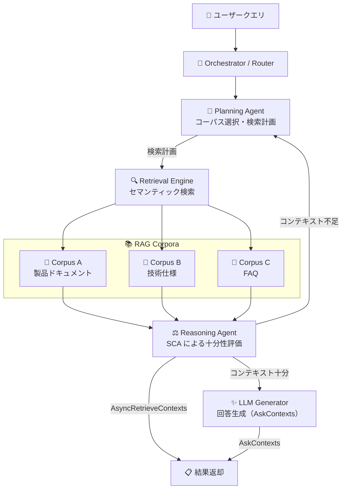

# Generative AI on Vertex AI: RAG Cross Corpus Retrieval

**リリース日**: 2026-04-17

**サービス**: Generative AI on Vertex AI

**機能**: RAG Cross Corpus Retrieval

**ステータス**: Public Preview

:chart_with_upwards_trend: [このアップデートのインフォグラフィックを見る](https://takech9203.github.io/google-cloud-news-summary/20260417-vertex-ai-rag-cross-corpus-retrieval.html)

## 概要

Vertex AI RAG Engine に **RAG Cross Corpus Retrieval** 機能がパブリックプレビューとして追加されました。この機能は、複数の RAG コーパスに対して同時にコンテキスト検索や回答生成を行うことを可能にする新しい API セット (`AsyncRetrieveContexts` と `AskContexts`) を提供します。

従来の Vertex AI RAG Engine では、`RetrieveContexts` API は単一のコーパス（または単一コーパス内の複数ファイル）に対してのみ検索を実行できました。しかし、企業環境では知識ベースが部門別・ドメイン別に複数のコーパスとして管理されることが一般的です。Cross Corpus Retrieval は、Agentic Retrieval アーキテクチャを採用し、Planning Agent がクエリを分析してコーパスの説明文に基づき最適なコーパスを自動選択することで、複数の知識ベースをまたいだ統合的な情報検索を実現します。

この機能は、大規模な知識管理システムを構築する企業や、複数ドメインにまたがる質問応答システムを必要とする組織にとって特に有用です。

**アップデート前の課題**

- `RetrieveContexts` API は単一の RAG コーパス（または単一コーパス内の複数ファイル）のみを検索対象としていたため、複数コーパスにまたがる横断検索には個別に API を呼び出す必要があった
- 複数コーパスの検索結果を手動でマージ・ランキングし直す必要があり、統合的な回答生成が困難だった
- どのコーパスにどの情報があるかをアプリケーション側で把握し、ルーティングロジックを自前で実装する必要があった

**アップデート後の改善**

- `AsyncRetrieveContexts` API と `AskContexts` API により、複数の RAG コーパスを同時に検索し、関連コンテキストを一括で取得可能になった
- Agentic Retrieval アーキテクチャにより、Planning Agent がクエリの内容とコーパスの説明文を照合し、適切なコーパスを自動選択するため、ルーティングロジックの自前実装が不要になった
- Sufficient Context Awareness (SCA) による Reasoning Agent が検索結果の十分性を評価し、不足時には追加検索ループを実行することで、回答品質が向上した

## アーキテクチャ図



Cross Corpus Retrieval のアーキテクチャ図。Orchestrator がクエリを受け取り、Planning Agent がコーパスの説明文に基づいて最適なコーパスを選択します。Retrieval Engine が選択されたコーパスからコンテキストを取得し、Reasoning Agent (SCA) が十分性を評価します。`AsyncRetrieveContexts` ではコンテキストをそのまま返却し、`AskContexts` では LLM Generator が回答を生成して返却します。

## サービスアップデートの詳細

### 主要機能

1. **AsyncRetrieveContexts API**
   - 複数の RAG コーパスから関連コンテキストを非同期で取得する Long-Running Operation (LRO) API
   - オペレーション ID を使用してクエリのステータスと結果を取得可能
   - `v1beta1` エンドポイント: `POST https://{LOCATION}-aiplatform.googleapis.com/v1beta1/projects/{PROJECT_ID}/locations/{LOCATION}:asyncRetrieveContexts`
   - Python SDK では `rag.async_retrieve_contexts()` で呼び出し可能（自動的に完了を待機）

2. **AskContexts API**
   - 複数の RAG コーパスを横断検索し、LLM が直接回答を生成する同期 API
   - 検索とコンテキスト統合、回答生成までを一括で実行
   - `v1beta1` エンドポイント: `POST https://{LOCATION}-aiplatform.googleapis.com/v1beta1/projects/{PROJECT_ID}/locations/{LOCATION}:askContexts`
   - Python SDK では `rag.ask_contexts()` で呼び出し可能

3. **Agentic Retrieval アーキテクチャ**
   - **Planning Agent**: Gemini モデルを使用してクエリとコーパスの説明文をセマンティックマッチングし、検索計画を生成
   - **Retrieval Engine**: 選択されたコーパスに対してセマンティック検索を実行
   - **Reasoning Agent**: Sufficient Context Awareness (SCA) に基づき検索結果の十分性を評価。不十分な場合はフィードバックを生成して追加検索ループを実行

## 技術仕様

### API パラメータ

| パラメータ | 型 | 説明 |
|---|---|---|
| `parent` | string (必須) | Location のリソース名。形式: `projects/{project}/locations/{location}` |
| `query.text` | string (必須) | 検索クエリのテキスト |
| `tools.retrieval.vertex_rag_store.rag_resources` | list (必須) | 検索対象の RAG コーパスリソースのリスト |
| `tools.retrieval.disable_attribution` | bool | 帰属情報の無効化フラグ |

### 前提条件と制約

| 項目 | 詳細 |
|------|------|
| API バージョン | v1beta1 |
| 利用可能リージョン | **us-central1 のみ** |
| 必要な IAM ロール | RAG Engine サービスアカウントに `Vertex AI User` ロールを付与 |
| サービスアカウント | `service-{PROJECT_NUMBER}@gcp-sa-vertex-rag.iam.gserviceaccount.com` |
| コーパスの説明文 | 作成時に設定が必須（作成後は編集不可）。高品質な説明文が検索精度に直接影響 |

## 設定方法

### 前提条件

1. Google Cloud プロジェクトで Vertex AI API が有効化されていること
2. RAG Engine が `us-central1` リージョンで利用可能であること
3. RAG Engine サービスアカウントに `Vertex AI User` ロールが付与されていること

### 手順

#### ステップ 1: サービスアカウントへの IAM ロール付与

```bash
# プロジェクト番号を取得
PROJECT_NUMBER=$(gcloud projects describe $PROJECT_ID --format="value(projectNumber)")

# RAG Engine サービスアカウントに Vertex AI User ロールを付与
gcloud projects add-iam-policy-binding $PROJECT_ID \
  --member="serviceAccount:service-${PROJECT_NUMBER}@gcp-sa-vertex-rag.iam.gserviceaccount.com" \
  --role="roles/aiplatform.user"
```

RAG Engine サービスアカウントにプロジェクトレベルの `Vertex AI User` ロールを付与します。

#### ステップ 2: RAG コーパスの作成（説明文を必ず設定）

```python
from vertexai import rag
import vertexai

PROJECT_ID = "your-project-id"
LOCATION = "us-central1"

vertexai.init(project=PROJECT_ID, location=LOCATION)

# コーパスの説明文が Cross Corpus Retrieval の精度に直結するため、
# ドメインと内容を明確に記述する
corpus_a = rag.create_corpus(
    display_name="product-docs",
    description="製品の機能説明、設定手順、トラブルシューティングガイドを含む製品ドキュメント"
)

corpus_b = rag.create_corpus(
    display_name="tech-specs",
    description="API リファレンス、技術仕様、アーキテクチャ設計ドキュメント"
)
```

コーパスの `description` フィールドは作成後に変更できないため、内容を正確に記述することが重要です。

#### ステップ 3: AsyncRetrieveContexts による横断検索

```python
from vertexai.preview import rag
import vertexai

PROJECT_ID = "your-project-id"
LOCATION = "us-central1"
RAG_CORPUS_1_ID = "corpus-a-id"
RAG_CORPUS_2_ID = "corpus-b-id"

vertexai.init(project=PROJECT_ID, location=LOCATION)

# 複数コーパスから非同期でコンテキストを取得
response = await rag.async_retrieve_contexts(
    text="製品 X のパフォーマンスチューニング方法は？",
    rag_resources=[
        rag.RagResource(
            rag_corpus=f"projects/{PROJECT_ID}/locations/{LOCATION}/ragCorpora/{RAG_CORPUS_1_ID}",
        ),
        rag.RagResource(
            rag_corpus=f"projects/{PROJECT_ID}/locations/{LOCATION}/ragCorpora/{RAG_CORPUS_2_ID}",
        ),
    ],
)
print(response)
```

#### ステップ 4: AskContexts による横断検索 + 回答生成

```python
# 複数コーパスから検索し、直接回答を生成
response = rag.ask_contexts(
    text="製品 X のパフォーマンスチューニング方法は？",
    rag_resources=[
        rag.RagResource(
            rag_corpus=f"projects/{PROJECT_ID}/locations/{LOCATION}/ragCorpora/{RAG_CORPUS_1_ID}",
        ),
        rag.RagResource(
            rag_corpus=f"projects/{PROJECT_ID}/locations/{LOCATION}/ragCorpora/{RAG_CORPUS_2_ID}",
        ),
    ],
)
print(response)
```

## メリット

### ビジネス面

- **知識サイロの解消**: 部門別・ドメイン別に分散した知識ベースを統合的に検索可能。組織横断的な情報アクセスが容易になり、意思決定の迅速化に寄与
- **開発コストの削減**: コーパスのルーティングロジックやマージ処理を自前で実装する必要がなくなり、RAG アプリケーションの開発・運用コストが低減

### 技術面

- **インテリジェントなコーパス選択**: Planning Agent がコーパスの説明文とクエリを照合し、関連するコーパスのみを対象に検索を実行するため、全コーパスを網羅的に検索するよりも効率的
- **回答品質の向上**: SCA (Sufficient Context Awareness) による Reasoning Agent が検索結果の十分性を評価し、不足時に追加検索ループを自動実行することで、情報の取りこぼしを防止
- **非同期・同期の選択肢**: コンテキスト取得のみの非同期 API (`AsyncRetrieveContexts`) と、回答生成まで一括で行う同期 API (`AskContexts`) を用途に応じて使い分け可能

## デメリット・制約事項

### 制限事項

- **リージョン制限**: 現時点では `us-central1` でのみ利用可能。他のリージョンでは使用できない
- **Public Preview**: 本番ワークロードには SLA が適用されない可能性がある。GA までに API の仕様が変更される可能性がある
- **API バージョン**: `v1beta1` のみで提供。安定版 (`v1`) での提供は未定
- **コーパス説明文の不変性**: コーパスの `description` フィールドは作成時にのみ設定可能で、作成後は編集できない

### 考慮すべき点

- **コーパス説明文の品質**: Planning Agent のコーパス選択精度はコーパスの説明文の品質に強く依存する。曖昧な説明文では適切なコーパスが選択されない可能性がある
- **レイテンシ**: 複数コーパスの検索と SCA による評価ループが介在するため、単一コーパスへの `RetrieveContexts` と比較してレイテンシが増加する可能性がある
- **IAM 設定**: RAG Engine サービスアカウントに追加の IAM ロール (`Vertex AI User`) の付与が必要

## ユースケース

### ユースケース 1: マルチドメイン社内ナレッジベース

**シナリオ**: 大企業で、製品ドキュメント、HR ポリシー、IT サポートガイド、法務文書などがそれぞれ別の RAG コーパスとして管理されている。従業員が「出張時のノートPC セキュリティポリシーと経費精算の手順を教えて」と質問した場合、IT セキュリティコーパスと HR ポリシーコーパスの両方から関連情報を横断検索する必要がある。

**実装例**:
```python
response = rag.ask_contexts(
    text="出張時のノートPC セキュリティポリシーと経費精算の手順を教えて",
    rag_resources=[
        rag.RagResource(rag_corpus="projects/.../ragCorpora/it-security"),
        rag.RagResource(rag_corpus="projects/.../ragCorpora/hr-policies"),
        rag.RagResource(rag_corpus="projects/.../ragCorpora/travel-guidelines"),
    ],
)
```

**効果**: Planning Agent が自動的にクエリを分解し、IT セキュリティと HR ポリシーの両方のコーパスから関連情報を検索・統合して回答を生成。ユーザーはどのコーパスにどの情報があるかを意識せずに必要な情報を取得可能。

### ユースケース 2: テクニカルサポート向け統合 FAQ

**シナリオ**: SaaS プロバイダーが、製品ごとに個別の RAG コーパスを運用している。サポートエンジニアが「製品 A のデータを製品 B にインポートする方法」を調べる場合、両方の製品ドキュメントを横断して検索する必要がある。

**効果**: `AsyncRetrieveContexts` で両方のコーパスからコンテキストを非同期取得し、エージェントが統合的な手順を提示。サポート対応の効率化と品質向上を実現。

## 料金

Cross Corpus Retrieval 自体の追加料金は公式ドキュメントに明記されていません。ただし、Vertex AI RAG Engine の利用に関連する以下のコストが適用されます。

| コンポーネント | 課金 |
|---|---|
| データインジェスト | データソースからのアクセスは無料。データ転送コスト（egress 等）は別途 |
| データ変換（パース） | デフォルトパーサーは無料。LLM パーサー / Document AI パーサーは各モデルの料金 |
| エンベディング生成 | 使用するエンベディングモデルの料金 |
| データインデックスと検索 | Spanner モード: Spanner の料金。Serverless モード: 無料（リソース管理・オーケストレーション） |
| リランキング | LLM Reranker / Vertex AI Search Ranking API の料金 |

詳細は [Vertex AI RAG Engine billing](https://cloud.google.com/vertex-ai/generative-ai/docs/rag-engine/rag-engine-billing) を参照してください。

## 利用可能リージョン

Cross Corpus Retrieval は現時点で **us-central1 のみ** で利用可能です。

RAG Engine 自体は以下のリージョンでサポートされていますが、Cross Corpus Retrieval の対応リージョンは今後拡大される可能性があります。

| リージョン | ロケーション | RAG Engine ステータス |
|---|---|---|
| us-central1 | アイオワ | GA (Allowlist) |
| us-east4 | バージニア | GA (Allowlist) |
| us-east1 | サウスカロライナ | Preview (Allowlist) |
| europe-west3 | フランクフルト | GA |
| europe-west4 | オランダ | GA |
| asia-northeast1 | 東京 | Preview |

## 関連サービス・機能

- **Vertex AI RAG Engine**: Cross Corpus Retrieval の基盤となるマネージド RAG サービス。コーパス管理、データインジェスト、エンベディング生成、検索を統合的に提供
- **Vertex AI RAG Engine Serverless モード**: 2026-04-03 にパブリックプレビューとして発表されたフルマネージドデータベースモード。Cross Corpus Retrieval と組み合わせることで、インフラ管理なしに複数コーパスの横断検索が可能
- **Vertex AI RAG Engine メタデータ検索**: 2026-04-06 に発表されたスキーマベースのメタデータ検索機能。メタデータフィルタリングと Cross Corpus Retrieval を組み合わせることで、より精度の高い検索が可能
- **Cloud Spanner**: RAG Engine の Spanner モードでベクトルデータベースとして使用。Cross Corpus Retrieval のバックエンドストレージとしても機能
- **Vertex AI Embeddings**: RAG コーパスへのデータインジェスト時にエンベディングを生成するために使用

## 参考リンク

- :chart_with_upwards_trend: [インフォグラフィック](https://takech9203.github.io/google-cloud-news-summary/20260417-vertex-ai-rag-cross-corpus-retrieval.html)
- [公式リリースノート](https://cloud.google.com/release-notes#April_17_2026)
- [RAG Cross Corpus Retrieval ドキュメント](https://cloud.google.com/vertex-ai/generative-ai/docs/rag-engine/cross-corpus-retrieval)
- [Vertex AI RAG Engine 概要](https://cloud.google.com/vertex-ai/generative-ai/docs/rag-engine/rag-overview)
- [RAG API リファレンス](https://cloud.google.com/vertex-ai/generative-ai/docs/model-reference/rag-api)
- [Vertex AI RAG Engine 料金](https://cloud.google.com/vertex-ai/generative-ai/docs/rag-engine/rag-engine-billing)
- [SCA 研究ブログ](https://research.google/blog/deeper-insights-into-retrieval-augmented-generation-the-role-of-sufficient-context/)

## まとめ

RAG Cross Corpus Retrieval は、Vertex AI RAG Engine の機能を大幅に拡張し、複数の RAG コーパスにまたがる統合検索を Agentic Retrieval アーキテクチャで実現するものです。特に、複数ドメインの知識ベースを運用する企業にとって、コーパスのルーティングロジックを自前で実装する負担を解消し、Planning Agent による自動コーパス選択と SCA による回答品質の担保を提供します。現時点では us-central1 限定かつ Public Preview のため、本番適用前に十分な検証を行い、特にコーパスの説明文の設計に注力することを推奨します。

---

**タグ**: #VertexAI #RAGEngine #CrossCorpusRetrieval #AgenticRetrieval #GenerativeAI #LLM #RAG #PublicPreview
