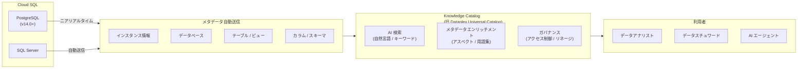

# Cloud SQL for PostgreSQL / SQL Server: Knowledge Catalog 自動統合によるデータディスカバリー

**リリース日**: 2026-04-18

**サービス**: Cloud SQL for PostgreSQL / Cloud SQL for SQL Server

**機能**: 新規作成インスタンスにおける Knowledge Catalog (旧 Dataplex Universal Catalog) との自動統合

**ステータス**: Feature (新機能)

[このアップデートのインフォグラフィックを見る](https://takech9203.github.io/google-cloud-news-summary/20260418-cloud-sql-knowledge-catalog-integration.html)

## 概要

Cloud SQL for PostgreSQL および Cloud SQL for SQL Server の新規作成インスタンスが、Knowledge Catalog (旧 Dataplex Universal Catalog) と自動的に統合されるようになりました。この統合により、Cloud SQL インスタンスのメタデータが Knowledge Catalog に自動送信され、組織全体でのデータディスカバリーが容易になります。PostgreSQL の場合、バージョン 14.0 以降のインスタンスでは、メタデータの更新がニアリアルタイムで Knowledge Catalog に反映されます。

Knowledge Catalog は、分散されたデータ資産や AI 資産のディスカバリーとインベントリを自動化するフルマネージドサービスです。今回のアップデートにより、新しく作成された Cloud SQL インスタンスはデフォルトでこの統合が有効化され、インスタンス、データベース、テーブル、カラム、ビューなどのメタデータが自動的にカタログに登録されます。Knowledge Catalog コンソールの構成ペインで統合が有効かどうかを確認でき、不要な場合はオプトアウト (無効化) することも可能です。

このアップデートは、データガバナンス、データディスカバリー、メタデータ管理に関心のあるすべての Cloud SQL ユーザーを対象としています。特に、複数のデータソースを横断した統合的なデータカタログを構築したい組織にとって有用です。

**アップデート前の課題**

- Cloud SQL インスタンスのメタデータを Knowledge Catalog に登録するには、明示的に統合を有効化する手動設定が必要だった
- 新規インスタンス作成時に Knowledge Catalog 統合を忘れると、データカタログに登録されないデータサイロが発生していた
- 組織全体のデータ資産を網羅的に把握するために、各チームが個別にカタログ統合を設定する運用負荷があった

**アップデート後の改善**

- 新規作成された Cloud SQL インスタンスは自動的に Knowledge Catalog と統合され、手動設定が不要になった
- PostgreSQL 14.0 以降のインスタンスではメタデータがニアリアルタイムで Knowledge Catalog に反映されるようになった
- 自動統合により、組織のデータカタログの網羅性が向上し、データディスカバリーが容易になった
- 統合が不要な場合はオプトアウトが可能で、柔軟な運用ができる

## アーキテクチャ図



Cloud SQL インスタンスで作成・変更されたメタデータ (インスタンス、データベース、テーブル、カラム、ビュー) が自動的に Knowledge Catalog に送信され、データアナリストやデータスチュワード、AI エージェントが統合的にデータを検索・管理できます。

## サービスアップデートの詳細

### 主要機能

1. **新規インスタンスの自動統合**
   - 新しく作成された Cloud SQL for PostgreSQL および Cloud SQL for SQL Server インスタンスは、デフォルトで Knowledge Catalog との統合が有効化される
   - 手動での有効化操作が不要となり、データカタログへの登録漏れを防止
   - 自動有効化の一環として、インスタンスのメタデータが Knowledge Catalog に送信される

2. **ニアリアルタイムのメタデータ同期 (PostgreSQL v14.0+)**
   - PostgreSQL バージョン 14.0 以降のインスタンスでは、メタデータの変更がニアリアルタイムで Knowledge Catalog に反映される
   - テーブルの作成・変更、スキーマの更新などが即座にカタログに反映され、常に最新の状態を維持
   - Knowledge Catalog のメタデータ変更フィード機能と連携し、Pub/Sub 経由でのメタデータ変更通知も可能

3. **収集されるメタデータの範囲**
   - インスタンス名、ロケーション (リージョン)、作成日時、最終更新日時
   - データベース、テーブル、カラム、ビューの構造情報
   - スキーマ情報 (テーブルおよびビュー)
   - Knowledge Catalog はプライマリインスタンスからのみメタデータを取得 (リードレプリカは対象外)

4. **オプトアウト機能**
   - 統合が不要な場合は、インスタンスごとに無効化が可能
   - gcloud CLI、REST API、Google Cloud コンソールから設定変更が可能

## 技術仕様

### 対象データベースエンジンとバージョン

| 項目 | Cloud SQL for PostgreSQL | Cloud SQL for SQL Server |
|------|-------------------------|-------------------------|
| 自動統合の対象 | 新規作成インスタンス | 新規作成インスタンス |
| ニアリアルタイム同期 | バージョン 14.0 以降 | リリースノートに明記なし |
| 収集対象リソース | インスタンス、DB、テーブル、カラム、ビュー | インスタンス、DB、テーブル、カラム、ビュー |
| リードレプリカ | 対象外 (プライマリのみ) | 対象外 (プライマリのみ) |

### Knowledge Catalog 統合設定

| 設定項目 | 値 |
|----------|-----|
| 設定パラメータ | `enableDataplexIntegration` |
| デフォルト値 (新規インスタンス) | `true` (自動有効化) |
| 無効化フラグ (gcloud) | `--no-enable-dataplex-integration` |
| 確認方法 | Knowledge Catalog コンソールの構成ペイン、または `gcloud sql instances describe` |

### 必要な IAM 権限

```
cloudsql.schemas.view  # Knowledge Catalog でメタデータを表示するために必要
                       # プロジェクトレベルで付与が必要
```

この権限は、プロジェクト内のすべての Cloud SQL インスタンスのメタデータへのアクセスを許可する点に注意が必要です。

## 設定方法

### 前提条件

1. Google Cloud プロジェクトで Dataplex API が有効化されていること
2. `cloudsql.schemas.view` 権限を含む IAM ロールが付与されていること
3. Cloud SQL for PostgreSQL (v14.0 以降推奨) または Cloud SQL for SQL Server のインスタンス

### 手順

#### ステップ 1: 統合状態の確認

```bash
# インスタンスの Knowledge Catalog 統合状態を確認
gcloud sql instances describe INSTANCE_NAME
```

出力の `settings` セクションで `enableDataplexIntegration: true` を確認します。新規作成インスタンスではデフォルトで有効です。

#### ステップ 2: 既存インスタンスへの統合有効化 (任意)

```bash
# 既存インスタンスに Knowledge Catalog 統合を有効化
gcloud sql instances patch INSTANCE_NAME \
    --enable-dataplex-integration
```

```bash
# プロジェクト内の全インスタンスに一括有効化
gcloud sql instances list --format="(NAME)" \
    | tail -n +2 | xargs -t -I % gcloud sql instances patch % --enable-dataplex-integration
```

#### ステップ 3: 統合の無効化 (オプトアウト)

```bash
# インスタンスの Knowledge Catalog 統合を無効化
gcloud sql instances patch INSTANCE_NAME \
    --no-enable-dataplex-integration
```

REST API を使用する場合は、以下のリクエストボディを使用します。

```json
{
  "settings": {
    "enableDataplexIntegration": false
  }
}
```

#### ステップ 4: Knowledge Catalog でのデータ確認

Knowledge Catalog コンソール (Google Cloud コンソール > Dataplex > Knowledge Catalog) で、Cloud SQL のメタデータが登録されていることを確認します。AI 検索やキーワード検索を使用して、Cloud SQL のテーブルやビューを発見できます。

## メリット

### ビジネス面

- **データガバナンスの自動化**: 新規インスタンスが自動的にカタログに登録されるため、データ管理者の運用負荷が軽減され、データガバナンスポリシーの適用漏れを防止できる
- **データディスカバリーの効率化**: アナリストやデータサイエンティストが、自然言語検索を使用して組織全体の Cloud SQL データ資産を迅速に発見・理解できる
- **コンプライアンスの強化**: メタデータの一元管理により、PII を含むデータの追跡やデータリネージの可視化が容易になり、規制要件への対応を支援する

### 技術面

- **ゼロコンフィギュレーション**: 新規インスタンス作成時に追加の設定手順が不要で、デフォルトでメタデータが自動収集される
- **ニアリアルタイム同期**: PostgreSQL v14.0 以降ではスキーマ変更がほぼリアルタイムで反映され、カタログの鮮度が保たれる
- **AI 検索との統合**: Knowledge Catalog の AI 搭載自然言語検索により、Cloud SQL のデータ資産をインテントベースで検索可能
- **メタデータ変更フィード**: Pub/Sub 経由でメタデータ変更通知を受信し、データ品質チェックやワークフローの自動トリガーが可能

## デメリット・制約事項

### 制限事項

- 自動統合は新規作成インスタンスにのみ適用される。既存インスタンスには手動での有効化が必要
- Knowledge Catalog のメタデータ取得はプライマリインスタンスのみが対象で、リードレプリカからは取得されない
- `cloudsql.schemas.view` 権限はプロジェクトレベルで付与する必要があり、プロジェクト内の全 Cloud SQL インスタンスのメタデータが表示対象となる (インスタンス単位での細かいアクセス制御は不可)
- PostgreSQL 14.0 より前のバージョンでは、ニアリアルタイム同期が利用できない可能性がある

### 考慮すべき点

- 自動有効化により、意図せずメタデータが Knowledge Catalog に送信される場合がある。セキュリティポリシーやデータ分類の要件に応じてオプトアウトの検討が必要
- Knowledge Catalog のメタデータストレージ SKU に基づく料金が発生する可能性がある (ただし、検索 API 呼び出しやコンソールでの検索は無料)
- 組織内の VPC Service Controls の境界設定によっては、検索結果が制限される場合がある

## ユースケース

### ユースケース 1: 組織横断的なデータディスカバリー

**シナリオ**: 大規模な企業で複数の事業部門がそれぞれ Cloud SQL for PostgreSQL インスタンスを運用しており、データアナリストが特定のビジネスデータ (例: 売上データ、顧客情報) がどのインスタンスのどのテーブルに存在するかを把握できていない。

**実装例**:
```bash
# 新規インスタンスは自動的に Knowledge Catalog に登録される
gcloud sql instances create sales-db \
    --database-version=POSTGRES_16 \
    --tier=db-custom-4-16384 \
    --region=asia-northeast1

# Knowledge Catalog で自然言語検索
# 「売上データを含むテーブルを表示して」
# -> Cloud SQL の sales-db 内のテーブルが検索結果に表示される
```

**効果**: データアナリストが Knowledge Catalog の自然言語検索で、組織内の Cloud SQL インスタンスに分散したデータを横断的に発見できるようになり、データアクセスまでの時間を大幅に短縮できる。

### ユースケース 2: データスチュワードによるメタデータガバナンス

**シナリオ**: 金融機関でデータスチュワードが、Cloud SQL に格納されている個人情報 (PII) を含むテーブルを特定し、適切なメタデータラベル (アスペクト) を付与する必要がある。

**効果**: Knowledge Catalog に自動登録された Cloud SQL のスキーマ情報から PII カラムを特定し、アスペクトを使用してメタデータをエンリッチメントすることで、コンプライアンス要件に対応したデータガバナンスを実現できる。

### ユースケース 3: AI エージェントによるデータ活用

**シナリオ**: 生成 AI アプリケーションが、組織内のデータソースから適切なデータを自動選択してレポートを生成する必要がある。Knowledge Catalog の MCP (Model Context Protocol) インターフェースを通じて、AI エージェントがデータソースを検索する。

**効果**: Cloud SQL のメタデータが自動的に Knowledge Catalog に登録されることで、AI エージェントが信頼性の高いメタデータに基づいてデータソースを発見・選択し、ハルシネーションのリスクを低減した上でデータ活用が可能になる。

## 料金

Knowledge Catalog の利用料金はメタデータストレージ SKU に基づきます。Cloud SQL 側での統合有効化に追加料金は発生しません。

| 項目 | 料金 |
|------|------|
| メタデータストレージ | Knowledge Catalog のメタデータストレージ SKU に基づく課金 |
| 検索 API 呼び出し | 無料 |
| コンソールでの検索 | 無料 |
| カタログリソースの作成・管理 | 無料 |

最新の料金詳細は [Knowledge Catalog pricing](https://cloud.google.com/dataplex/pricing) および [Cloud SQL pricing](https://cloud.google.com/sql/pricing) を参照してください。

## 利用可能リージョン

Cloud SQL for PostgreSQL および Cloud SQL for SQL Server が利用可能なすべてのリージョンで、Knowledge Catalog との統合が利用可能です。詳細は [Cloud SQL のロケーション](https://cloud.google.com/sql/docs/postgres/locations) を参照してください。

## 関連サービス・機能

- **Knowledge Catalog (Dataplex)**: Cloud SQL のメタデータを統合管理するカタログサービス。AI 検索、メタデータエンリッチメント、データリネージ機能を提供
- **BigQuery**: Knowledge Catalog と統合されたもう一つの主要データソース。Cloud SQL と BigQuery のメタデータを横断的に検索可能
- **AlloyDB for PostgreSQL**: Cloud SQL と同様に Knowledge Catalog との統合をサポート。クラスタレベルでの統合有効化が可能
- **Cloud Storage**: Knowledge Catalog でオブジェクトストレージのメタデータも管理可能。非構造化データのディスカバリーにも対応
- **Pub/Sub**: Knowledge Catalog のメタデータ変更フィード機能と連携し、メタデータ変更の通知をリアルタイムで受信可能
- **Sensitive Data Protection**: データの機密性分類結果を Knowledge Catalog と連携させることで、PII データの検出・管理を強化

## 参考リンク

- [インフォグラフィック](https://takech9203.github.io/google-cloud-news-summary/20260418-cloud-sql-knowledge-catalog-integration.html)
- [公式リリースノート](https://cloud.google.com/release-notes#April_18_2026)
- [Cloud SQL の Knowledge Catalog 統合 (PostgreSQL)](https://cloud.google.com/sql/docs/postgres/dataplex-catalog-integration)
- [Cloud SQL の Knowledge Catalog 統合 (MySQL - 共通ドキュメント)](https://cloud.google.com/sql/docs/mysql/dataplex-catalog-integration)
- [Knowledge Catalog の概要](https://cloud.google.com/dataplex/docs/catalog-overview)
- [Knowledge Catalog でのデータ検索](https://cloud.google.com/dataplex/docs/search-assets)
- [データソースの統合](https://cloud.google.com/dataplex/docs/integrate-data-sources)
- [Knowledge Catalog 料金](https://cloud.google.com/dataplex/pricing)
- [Cloud SQL 料金](https://cloud.google.com/sql/pricing)

## まとめ

Cloud SQL for PostgreSQL と Cloud SQL for SQL Server の新規インスタンスが Knowledge Catalog と自動統合されるようになり、手動設定なしでデータカタログへのメタデータ登録が行われます。特に PostgreSQL v14.0 以降ではニアリアルタイムのメタデータ同期が実現し、組織全体のデータディスカバリーとガバナンスが大幅に強化されます。既存インスタンスをお持ちの場合は `gcloud sql instances patch --enable-dataplex-integration` で統合を有効化し、組織のデータカタログの網羅性を向上させることを推奨します。

---

**タグ**: #CloudSQL #PostgreSQL #SQLServer #KnowledgeCatalog #Dataplex #DataDiscovery #MetadataManagement #DataGovernance #GoogleCloud
