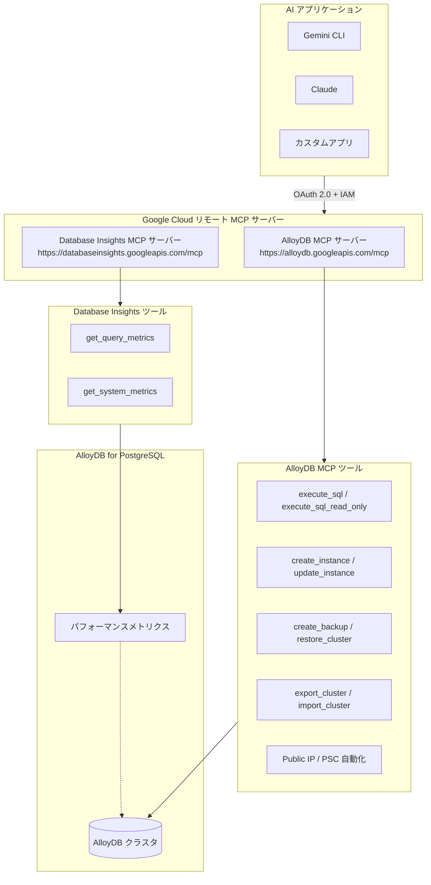

# AlloyDB for PostgreSQL: リモート MCP サーバー GA & Database Insights MCP サーバー GA

**リリース日**: 2026-04-20

**サービス**: AlloyDB for PostgreSQL

**機能**: AlloyDB リモート MCP サーバー (グローバルエンドポイント) GA / Database Insights リモート MCP サーバー GA

**ステータス**: GA (一般提供)

[このアップデートのインフォグラフィックを見る](https://takech9203.github.io/google-cloud-news-summary/20260420-alloydb-mcp-server-database-insights-ga.html)

## 概要

AlloyDB for PostgreSQL のリモート MCP (Model Context Protocol) サーバーに関する 2 つの GA リリースと 1 つの既知の問題が発表された。まず、Database Insights リモート MCP サーバーが GA となり、AI アプリケーションから AlloyDB のパフォーマンスおよびシステムメトリクスを PromQL クエリで分析できるようになった。次に、AlloyDB リモート MCP サーバーのグローバルエンドポイント (`https://alloydb.googleapis.com/mcp`) が GA に昇格し、読み取り専用 SQL 実行、インスタンス更新、データのエクスポート/インポート、バックアップ作成、クラスタ復元、Public IP、Private Service Connect エンドポイント自動化のサポートが追加された。

これらのアップデートにより、Gemini CLI、Claude、ChatGPT などの AI アプリケーションから AlloyDB クラスタの管理・監視を自然言語で行える基盤が本番環境向けに整備された。データベース管理者や SRE は、MCP 対応の AI エージェントを通じてインフラ操作とパフォーマンス分析を統合的に実行できるようになる。

なお、ChatGPT ユーザーが AlloyDB リモート MCP サーバーのツールセットを一覧表示・使用できないという既知の問題も同時に報告されている。

**アップデート前の課題**

- AlloyDB リモート MCP サーバーはプレビュー段階であり、本番ワークロードでの使用には SLA が保証されていなかった
- AI アプリケーションから AlloyDB のパフォーマンスメトリクスやシステムメトリクスを直接分析する MCP ベースの手段がなかった
- MCP サーバー経由の読み取り専用 SQL 実行、データのエクスポート/インポート、バックアップ/リストアなどの運用操作が利用できなかった
- Public IP や Private Service Connect エンドポイントの自動化が MCP ツール経由でサポートされていなかった

**アップデート後の改善**

- AlloyDB リモート MCP サーバー (グローバルエンドポイント) が GA となり、本番環境での使用が SLA 付きでサポートされるようになった
- Database Insights MCP サーバーにより、AI エージェントから `get_query_metrics` / `get_system_metrics` ツールでパフォーマンス分析が可能になった
- `execute_sql_read_only` による安全な読み取り専用クエリ、`create_backup` / `restore_cluster` によるバックアップ・リストア操作が MCP 経由で利用可能になった
- Private Service Connect エンドポイントの自動作成や Public IP 接続が MCP ツールからサポートされた

## アーキテクチャ図



AlloyDB for PostgreSQL は 2 つのリモート MCP サーバーを提供する。AlloyDB MCP サーバーはクラスタ・インスタンス管理と SQL 実行を担い、Database Insights MCP サーバーはパフォーマンスメトリクスの分析を担当する。AI アプリケーションは OAuth 2.0 認証を通じてこれらのサーバーに接続する。

## サービスアップデートの詳細

### 主要機能

1. **Database Insights リモート MCP サーバー (GA)**
   - エンドポイント: `https://databaseinsights.googleapis.com/mcp`
   - AlloyDB のパフォーマンスおよびシステムメトリクスを AI アプリケーションから分析可能
   - `get_query_metrics`: クエリ関連のテレメトリデータを PromQL クエリで取得
   - `get_system_metrics`: システム関連のテレメトリデータを PromQL クエリで取得
   - CPU 使用率、メモリ、クエリレイテンシ、データベース負荷、接続数などのメトリクスを分析可能

2. **AlloyDB リモート MCP サーバー グローバルエンドポイント (GA)**
   - エンドポイント: `https://alloydb.googleapis.com/mcp`
   - 読み取り専用 SQL 実行 (`execute_sql_read_only`)
   - インスタンス更新ツール
   - データのエクスポート (`export_cluster`) / インポート (`import_cluster`)
   - バックアップ作成 (`create_backup`) / クラスタ復元 (`restore_cluster`)
   - Public IP 接続のサポート
   - Private Service Connect エンドポイントの自動化

3. **既知の問題: ChatGPT との互換性**
   - ChatGPT ユーザーが AlloyDB リモート MCP サーバーのツールセットを一覧表示・使用できない
   - Claude や Gemini CLI などの他の MCP クライアントは正常に動作する

## 技術仕様

### MCP サーバーエンドポイント

| 項目 | AlloyDB MCP サーバー | Database Insights MCP サーバー |
|------|---------------------|-------------------------------|
| グローバルエンドポイント | `https://alloydb.googleapis.com/mcp` | `https://databaseinsights.googleapis.com/mcp` |
| リージョナルエンドポイント | `https://alloydb.REGION.rep.googleapis.com/mcp` (Preview) | - |
| トランスポート | HTTP (Streamable HTTP) | HTTP (Streamable HTTP) |
| 認証 | OAuth 2.0 + IAM | OAuth 2.0 + IAM |
| ステータス | グローバル: GA / リージョナル: Preview | GA |

### AlloyDB MCP サーバーの主要ツール一覧

| ツール名 | 機能 | 必要な IAM ロール |
|----------|------|------------------|
| `execute_sql` | SQL 実行 (DDL/DML/DQL) | `roles/alloydb.admin` または `roles/alloydb.databaseUser` |
| `execute_sql_read_only` | 読み取り専用 SQL 実行 | `roles/alloydb.viewer`, `roles/alloydb.admin`, `roles/alloydb.databaseUser` |
| `create_instance` | インスタンス作成 | `roles/alloydb.admin` |
| `create_backup` | バックアップ作成 | `roles/alloydb.admin` |
| `restore_cluster` | クラスタ復元 | `roles/alloydb.admin` |
| `export_cluster` | データエクスポート | `roles/alloydb.admin` |
| `import_cluster` | データインポート | `roles/alloydb.admin` |
| `list_clusters` | クラスタ一覧 | `roles/alloydb.viewer` |
| `list_instances` | インスタンス一覧 | `roles/alloydb.viewer` |
| `create_user` | ユーザー作成 (IAM 認証のみ) | `roles/alloydb.admin` |

### 必要な IAM 権限

```
# MCP ツール呼び出しの基本権限
mcp.tools.call

# AlloyDB 操作の主要権限
alloydb.clusters.create
alloydb.clusters.get
alloydb.clusters.list
alloydb.clusters.update
alloydb.clusters.import
alloydb.clusters.export
alloydb.instances.create
alloydb.instances.get
alloydb.instances.executeSql
alloydb.instances.executeSqlReadOnly
alloydb.instances.login
alloydb.users.create
alloydb.users.list
alloydb.users.update
```

### OAuth スコープ

| スコープ URI | 説明 |
|-------------|------|
| `https://www.googleapis.com/auth/alloydb` | AlloyDB データの閲覧、編集、構成、削除 |

## 設定方法

### 前提条件

1. AlloyDB for PostgreSQL API が有効化されていること (MCP サーバーは API 有効化と同時に利用可能になる)
2. 適切な IAM ロールが付与されていること
3. OAuth 2.0 認証の設定が完了していること

### 手順

#### ステップ 1: MCP クライアントの設定 (Claude の例)

Claude Desktop または Claude Code で AlloyDB MCP サーバーを設定する場合、以下の情報を入力する。

- **Server name**: AlloyDB for PostgreSQL MCP server
- **Server URL**: `https://alloydb.googleapis.com/mcp`
- **Transport**: HTTP
- **Authentication**: Google Cloud 認証情報 (OAuth Client ID / Secret またはエージェント ID)

#### ステップ 2: Database Insights MCP サーバーの設定

Database Insights MCP サーバーを別途設定する場合、以下のエンドポイントを使用する。

- **Server name**: Database Insights MCP server
- **Server URL**: `https://databaseinsights.googleapis.com/mcp`

#### ステップ 3: ツール一覧の確認

```bash
# AlloyDB MCP サーバーのツール一覧を取得
curl --location 'https://alloydb.googleapis.com/mcp' \
  --header 'content-type: application/json' \
  --header 'accept: application/json, text/event-stream' \
  --data '{
    "method": "tools/list",
    "jsonrpc": "2.0",
    "id": 1
  }'
```

```bash
# Database Insights MCP サーバーのツール一覧を取得
curl --location 'https://databaseinsights.googleapis.com/mcp' \
  --header 'content-type: application/json' \
  --header 'accept: application/json, text/event-stream' \
  --data '{
    "method": "tools/list",
    "jsonrpc": "2.0",
    "id": 1
  }'
```

#### ステップ 4: 読み取り専用 SQL 実行の有効化

`execute_sql_read_only` を使用するには、インスタンスの `data_api_access` 設定を有効にする必要がある。

```bash
curl -X PATCH \
  -H "Authorization: Bearer $(gcloud auth print-access-token)" \
  -H "Content-Type: application/json" \
  https://alloydb.googleapis.com/v1alpha/projects/PROJECT_ID/locations/LOCATION/clusters/CLUSTER_ID/instances/INSTANCE_ID?updateMask=dataApiAccess \
  -d '{
    "dataApiAccess": "ENABLED"
  }'
```

## メリット

### ビジネス面

- **AI 駆動のデータベース運用**: 自然言語でデータベースの管理・監視操作が可能になり、運用チームの生産性が向上する
- **本番環境対応**: GA リリースにより SLA が保証され、エンタープライズワークロードでの MCP サーバー利用が可能になった
- **マルチクライアント対応**: Gemini CLI、Claude など複数の AI プラットフォームから統一的にデータベースを管理できる

### 技術面

- **統合的なオブザーバビリティ**: Database Insights MCP サーバーにより、パフォーマンスメトリクスを AI エージェント経由で PromQL ベースで分析可能
- **セキュアなアクセス制御**: OAuth 2.0 + IAM による細粒度の認証・認可、Model Armor によるプロンプト/レスポンスのセキュリティ保護
- **安全な読み取り操作**: `execute_sql_read_only` により本番データベースに対するリスクの低い読み取りクエリを AI エージェント経由で実行可能

## デメリット・制約事項

### 制限事項

- `create_user` ツールはパスワードベースのビルトイン認証ユーザーの作成をサポートしない (IAM 認証のみ)
- `execute_sql` のレスポンスが 10 MB を超える場合、レスポンスが切り捨てられる可能性がある
- `execute_sql_read_only` は PostgreSQL バージョン 17 以降でのみサポートされる
- `execute_sql_read_only` に必要な IAM 権限 `alloydb.instances.executeSqlReadOnly` は Google Cloud コンソールに表示されない
- リージョナルエンドポイントはまだ Preview であり、GA はグローバルエンドポイントのみ
- ChatGPT ユーザーは AlloyDB MCP サーバーのツールセットを一覧表示・使用できない (既知の問題)

### 考慮すべき点

- MCP サーバーは AlloyDB for PostgreSQL API の有効化と同時に利用可能になるため、意図しないアクセスを防ぐために IAM ポリシーの適切な設定が重要
- エージェント用の専用 ID を作成し、リソースへのアクセスを制御・監視することが推奨されている
- `execute_sql` は DDL/DML を含むすべての SQL を実行できるため、本番環境では `execute_sql_read_only` の使用を検討すべき

## ユースケース

### ユースケース 1: AI エージェントによるパフォーマンストラブルシューティング

**シナリオ**: SRE チームが AlloyDB インスタンスのパフォーマンス低下を検知し、AI エージェントを使って原因を特定する。

**実装例**:
```
# AI エージェントへのプロンプト例
「AlloyDB インスタンス my-instance の過去 1 時間のクエリレイテンシと
CPU 使用率を確認して、パフォーマンス低下の原因を分析してください」

# AI エージェントが実行するツール呼び出し:
# 1. Database Insights MCP: get_query_metrics (クエリレイテンシの取得)
# 2. Database Insights MCP: get_system_metrics (CPU 使用率の取得)
# 3. AlloyDB MCP: execute_sql_read_only (スロークエリの特定)
```

**効果**: 複数のモニタリングツールを手動で確認する代わりに、AI エージェントが自動的にメトリクスを収集・分析し、原因を特定する

### ユースケース 2: 開発環境のセットアップ自動化

**シナリオ**: 新しい Web アプリケーション開発プロジェクトのために、AlloyDB インスタンスのプロビジョニングとスキーマ設定を AI エージェントに依頼する。

**実装例**:
```
# AI エージェントへのプロンプト例
「新しい AlloyDB PostgreSQL 開発インスタンスを作成し、
products テーブルをセットアップしてください」

# AI エージェントが実行するワークフロー:
# 1. create_cluster でクラスタ作成
# 2. create_instance でインスタンス作成 (Public IP 有効)
# 3. get_operation で作成状況をポーリング
# 4. execute_sql で CREATE TABLE 実行
# 5. execute_sql で初期データ挿入
```

**効果**: 手動でのコンソール操作や gcloud コマンドの作成が不要になり、自然言語でインフラのセットアップが完了する

## 料金

AlloyDB for PostgreSQL の MCP サーバー自体の追加料金はなく、AlloyDB for PostgreSQL API の有効化により利用可能になる。料金は AlloyDB の通常の使用量ベースの課金モデルに従う。

- **インスタンスリソース**: vCPU 数およびメモリ量に基づく課金
- **ストレージ**: クラスタのフレキシブルストレージレイヤーに保存されたデータ量
- **ネットワーク**: インスタンスからのネットワーク Egress トラフィック

コミットメント利用割引 (CUD) も利用可能で、1 年契約で 25%、3 年契約で 52% の割引が適用される。

詳細は [AlloyDB for PostgreSQL の料金ページ](https://docs.cloud.google.com/alloydb/pricing) を参照。

## 関連サービス・機能

- **Google Cloud MCP サーバー**: AlloyDB MCP サーバーは Google Cloud のリモート MCP サーバーエコシステムの一部。BigQuery、Cloud SQL、Bigtable、Compute Engine なども同様の MCP サーバーを提供している
- **Cloud SQL MCP サーバー**: Cloud SQL for MySQL / PostgreSQL / SQL Server でも同様のリモート MCP サーバーと Database Insights MCP サーバーが利用可能
- **Model Armor**: MCP ツール呼び出しとレスポンスのスキャンによるセキュリティ保護を提供。プロンプトインジェクションや機密データの漏洩リスクを軽減する
- **AlloyDB Query Insights**: パフォーマンスモニタリング機能。Database Insights MCP サーバーが分析するメトリクスの元データを提供する
- **Private Service Connect**: AlloyDB インスタンスへのプライベート接続を提供。MCP ツール経由でのエンドポイント自動作成がサポートされた

## 参考リンク

- [インフォグラフィック](https://takech9203.github.io/google-cloud-news-summary/20260420-alloydb-mcp-server-database-insights-ga.html)
- [公式リリースノート](https://docs.cloud.google.com/alloydb/docs/release-notes#April_20_2026)
- [AlloyDB リモート MCP サーバーの使用ガイド](https://docs.cloud.google.com/alloydb/docs/ai/use-alloydb-mcp)
- [AlloyDB MCP リファレンス](https://docs.cloud.google.com/alloydb/docs/reference/mcp)
- [AlloyDB MCP ツールリファレンス](https://docs.cloud.google.com/alloydb/docs/reference/mcp/alloydb/mcp)
- [Database Insights MCP ツールリファレンス](https://docs.cloud.google.com/alloydb/docs/reference/mcp/databaseinsights/mcp)
- [Google Cloud MCP サーバー概要](https://docs.cloud.google.com/mcp/overview)
- [Google Cloud MCP 既知の問題](https://docs.cloud.google.com/mcp/known-issues)
- [MCP 対応製品一覧](https://docs.cloud.google.com/mcp/supported-products)
- [AlloyDB for PostgreSQL 料金](https://docs.cloud.google.com/alloydb/pricing)

## まとめ

AlloyDB for PostgreSQL のリモート MCP サーバー (グローバルエンドポイント) と Database Insights MCP サーバーが GA となり、AI エージェントからのデータベース管理・パフォーマンス分析が本番環境で正式にサポートされた。ChatGPT での互換性問題が報告されているものの、Gemini CLI や Claude などの主要な MCP クライアントでは利用可能である。AlloyDB ユーザーは、まず読み取り専用操作とパフォーマンス分析から MCP サーバーの活用を開始し、AI 駆動のデータベース運用ワークフローを段階的に構築していくことを推奨する。

---

**タグ**: #AlloyDB #PostgreSQL #MCP #ModelContextProtocol #DatabaseInsights #GA #AI #RemoteMCPServer #パフォーマンス分析 #データベース管理
