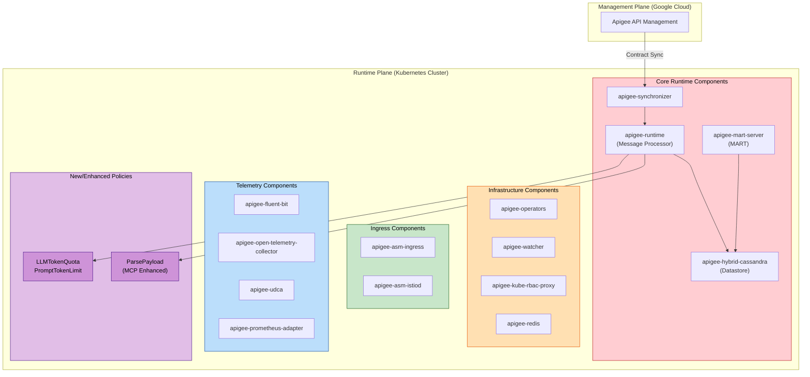

# Apigee hybrid: v1.16.1 パッチリリース (LLM トークンポリシー対応 / MCP 拡張 / セキュリティ修正)

**リリース日**: 2026-04-20

**サービス**: Apigee hybrid

**機能**: v1.16.1 パッチリリース -- LLMTokenQuota/PromptTokenLimit ポリシーサポート、ParsePayload MCP 拡張、セキュリティ CVE 修正

**ステータス**: Patch Release (Fixed / Security)

:bar_chart: [このアップデートのインフォグラフィックを見る](https://takech9203.github.io/google-cloud-news-summary/20260420-apigee-hybrid-v1-16-1.html)

## 概要

2026 年 4 月 20 日、Apigee hybrid v1.16.1 パッチリリースが公開された。本リリースは、AI/LLM 関連のトークン管理ポリシーの Apigee hybrid 環境への対応、Model Context Protocol (MCP) サポートの拡張、セキュリティ脆弱性の包括的な修正を含む重要なアップデートである。

主な変更点は 3 つの機能修正と、13 以上のコンポーネントにわたる複数の CVE セキュリティ修正で構成される。特に注目すべきは、LLMTokenQuota および PromptTokenLimit ポリシーが Apigee hybrid で利用可能になったことで、ハイブリッド環境で LLM API のトークン使用量を制御できるようになった点である。また、ParsePayload ポリシーの MCP メソッド対応拡張により、エージェントアプリケーションからのリクエスト処理が強化された。

本パッチリリースは Helm チャートと統合されたコンテナイメージで提供されるため、Helm チャート経由のアップグレードでイメージが自動更新され、手動でのイメージ変更は通常不要である。

**アップデート前の課題**

- Apigee hybrid 環境では LLMTokenQuota および PromptTokenLimit ポリシーが利用できず、LLM API のトークン使用量制御ができなかった
- ParsePayload ポリシーがサポートする MCP メソッドが限定的であり、一部のエージェントアプリケーションからのリクエスト処理に制限があった
- ParsePayload ポリシーの出力に個人識別情報 (PII) が含まれる可能性があり、セキュリティ/プライバシー上の懸念があった
- 複数のコンポーネントに既知の CVE 脆弱性が存在していた

**アップデート後の改善**

- Apigee hybrid で LLMTokenQuota および PromptTokenLimit ポリシーが利用可能になり、ハイブリッド環境でも LLM トークンのレート制限とクォータ管理が実現できるようになった
- ParsePayload ポリシーがより広範な MCP メソッドをサポートし、システムレベルのメソッドに対するガバナンスバイパスが実装された
- ParsePayload ポリシーの出力から PII が除去され、セキュリティとプライバシーが向上した
- 13 以上のコンポーネントにわたる CVE 脆弱性が修正された

## アーキテクチャ図



Apigee hybrid v1.16.1 のアーキテクチャ図。色分けされたサブグラフは今回のセキュリティパッチが適用された各コンポーネントグループを示す。紫色で強調されたポリシーコンポーネント (LLMTokenQuota / PromptTokenLimit / ParsePayload) が今回新たに追加・拡張された機能領域である。

## サービスアップデートの詳細

### 主要機能

1. **LLMTokenQuota / PromptTokenLimit ポリシーの Apigee hybrid 対応 (Bug ID: 469900037)**
   - Apigee hybrid 環境で LLMTokenQuota および PromptTokenLimit ポリシーが利用可能になった
   - **PromptTokenLimit ポリシー**: LLM バックエンドへのトークンスパイクを防止するレート制限ポリシー。ユーザープロンプト内のトークン数を分単位または秒単位で制限する。SpikeArrest ポリシーに類似しているが、リクエスト数ではなくトークン数を制限対象とする
   - **LLMTokenQuota ポリシー**: LLM API のトークン消費量に対するクォータ管理ポリシー。API プロダクト単位で、時間、日、月などの期間にわたるトークン消費量制限を適用できる
   - 両ポリシーのレート超過時には HTTP 429 (Too Many Requests) が返される

2. **ParsePayload ポリシーの MCP メソッド拡張 (Bug ID: 502577947)**
   - ParsePayload ポリシーが、より広範な Model Context Protocol (MCP) メソッドをサポートするように拡張された
   - システムレベルの必須メソッドに対するガバナンスバイパスが実装された。これにより、`tools/list` や `tools/call` などの基本的な MCP オペレーションに対して、不要なポリシー制約なしに処理が可能になった
   - ParsePayload ポリシーは JSON-RPC 2.0 形式の構造化リクエストペイロードから論理的なオペレーションを抽出し、メッセージフロー変数に設定する。これにより条件付きルーティングロジックの実装が可能になる
   - ParsePayload ポリシーは Apigee hybrid v1.16.1 以降でのみ利用可能

3. **ParsePayload ポリシー出力からの PII 除去 (Bug ID: 503029410)**
   - ParsePayload ポリシーの出力から個人識別情報 (PII) が除去され、セキュリティとプライバシーが向上した
   - API プロキシのデバッグセッションやログにおいて、機密情報が意図せず露出するリスクが低減された

## 技術仕様

### PromptTokenLimit ポリシー設定例

```xml
<PromptTokenLimit continueOnError="false" enabled="true" name="PTL-limitTokens-1">
  <DisplayName>Limit Prompt Tokens</DisplayName>
  <Rate>1000pm</Rate>
  <UserPromptSource>{jsonPath('$.contents[-1].parts[-1].text',request.content,true)}</UserPromptSource>
</PromptTokenLimit>
```

### LLMTokenQuota ポリシーとの使い分け

| 項目 | PromptTokenLimit | LLMTokenQuota |
|------|-----------------|---------------|
| 目的 | トークンスパイク防止 (運用トラフィック管理) | トークン消費量のクォータ制限 (コスト管理・ビジネス契約) |
| 制限対象 | ユーザープロンプト内のトークン数 | レスポンスを含むトークン消費量 |
| 適用期間 | 分単位・秒単位 (短期) | 時間・日・月単位 (長期) |
| 類似ポリシー | SpikeArrest | Quota |
| HTTP レスポンス (超過時) | 429 Too Many Requests | 429 Too Many Requests |

### ParsePayload ポリシー設定例

```xml
<ParsePayload continueOnError="false" enabled="true" name="parse-payload-mcp">
  <Source>request</Source>
  <PayloadType>JSON-RPC-2.0</PayloadType>
  <Protocol>MCP</Protocol>
</ParsePayload>
```

### セキュリティ修正対象コンポーネント

| コンポーネント | カテゴリ | 対象 CVE 例 |
|---------------|---------|------------|
| apigee-runtime | Core Runtime | CVE-2026-21945, CVE-2026-21932 |
| apigee-mart-server | Core Runtime | CVE-2026-21945, CVE-2026-21932 |
| apigee-synchronizer | Core Runtime | CVE-2025-55163 |
| apigee-hybrid-cassandra | Datastore | 複数 CVE |
| apigee-operators | Infrastructure | 複数 CVE |
| apigee-watcher | Infrastructure | 複数 CVE |
| apigee-kube-rbac-proxy | Infrastructure | 複数 CVE |
| apigee-redis | Infrastructure | 複数 CVE |
| apigee-fluent-bit | Telemetry | 複数 CVE |
| apigee-open-telemetry-collector | Telemetry | 複数 CVE |
| apigee-udca | Telemetry | 複数 CVE |
| apigee-prometheus-adapter | Telemetry | 複数 CVE |
| apigee-asm-ingress | Ingress | 複数 CVE |
| apigee-asm-istiod | Ingress | 複数 CVE |

## 設定方法

### 前提条件

1. Apigee hybrid v1.15.x 以上が稼働していること
2. サポートされている Kubernetes プラットフォーム (GKE 1.31.x - 1.33.x、EKS 1.31.x - 1.33.x、AKS 1.31.x - 1.34.x 等)
3. Helm がインストールされていること

### 手順

#### ステップ 1: Helm チャートのダウンロード

```bash
export CHART_REPO=oci://us-docker.pkg.dev/apigee-release/apigee-hybrid-helm-charts
export CHART_VERSION=1.16.1

helm pull $CHART_REPO/apigee-operator --version $CHART_VERSION --untar
helm pull $CHART_REPO/apigee-datastore --version $CHART_VERSION --untar
helm pull $CHART_REPO/apigee-env --version $CHART_VERSION --untar
helm pull $CHART_REPO/apigee-ingress-manager --version $CHART_VERSION --untar
helm pull $CHART_REPO/apigee-org --version $CHART_VERSION --untar
helm pull $CHART_REPO/apigee-redis --version $CHART_VERSION --untar
helm pull $CHART_REPO/apigee-telemetry --version $CHART_VERSION --untar
helm pull $CHART_REPO/apigee-virtualhost --version $CHART_VERSION --untar
```

#### ステップ 2: CRD のアップデート

```bash
# Dry run
kubectl apply -k apigee-operator/etc/crds/default/ \
  --server-side --force-conflicts --validate=false --dry-run=server

# 適用
kubectl apply -k apigee-operator/etc/crds/default/ \
  --server-side --force-conflicts --validate=false
```

#### ステップ 3: Helm チャートのアップグレード (コンポーネントごとに実行)

```bash
# Operator
helm upgrade operator apigee-operator/ \
  --install --namespace APIGEE_NAMESPACE --atomic \
  -f overrides.yaml

# Datastore
helm upgrade datastore apigee-datastore/ \
  --install --namespace APIGEE_NAMESPACE --atomic \
  -f overrides.yaml

# Telemetry
helm upgrade telemetry apigee-telemetry/ \
  --install --namespace APIGEE_NAMESPACE --atomic \
  -f overrides.yaml

# Redis
helm upgrade redis apigee-redis/ \
  --install --namespace APIGEE_NAMESPACE --atomic \
  -f overrides.yaml

# Ingress Manager
helm upgrade ingress-manager apigee-ingress-manager/ \
  --install --namespace APIGEE_NAMESPACE --atomic \
  -f overrides.yaml

# Organization
helm upgrade ORG_NAME apigee-org/ \
  --install --namespace APIGEE_NAMESPACE --atomic \
  -f overrides.yaml

# Environment (環境ごとに実行)
helm upgrade ENV_RELEASE_NAME apigee-env/ \
  --install --namespace APIGEE_NAMESPACE \
  --set env=ENV_NAME -f overrides.yaml

# VirtualHost (環境グループごとに実行)
helm upgrade ENV_GROUP_RELEASE_NAME apigee-virtualhost/ \
  --install --namespace APIGEE_NAMESPACE \
  --set envgroup=ENV_GROUP_NAME -f overrides.yaml
```

パッチリリースのため、コンテナイメージは Helm チャートに統合されており、Helm upgrade コマンド実行時に自動的に更新される。

## メリット

### ビジネス面

- **LLM API のコスト管理**: LLMTokenQuota ポリシーにより、API プロダクト単位でのトークン消費量制限が可能になり、LLM 利用コストの予測可能性と制御性が向上する
- **セキュリティコンプライアンス**: 13 以上のコンポーネントにわたる CVE 修正により、セキュリティ監査やコンプライアンス要件への対応が容易になる
- **プライバシー保護強化**: PII 除去により、GDPR や個人情報保護法などのプライバシー規制への準拠が改善される

### 技術面

- **LLM トラフィック制御**: PromptTokenLimit ポリシーにより、LLM バックエンドへの突発的なトークンスパイクを防止し、バックエンドサービスの安定性を確保できる
- **MCP エージェント対応強化**: ParsePayload ポリシーの拡張により、MCP 準拠のエージェントアプリケーションからのリクエスト処理がより柔軟になった
- **自動イメージ更新**: パッチリリースの Helm チャート統合により、手動でのイメージ変更が不要で、アップグレード作業が簡素化された

## デメリット・制約事項

### 制限事項

- ParsePayload ポリシーは Apigee hybrid v1.16.1 以降でのみ利用可能であり、それ以前のバージョンにはバックポートされない
- ParsePayload ポリシーはメッセージストリーミングをサポートしない。ストリーミングが有効なリクエスト/レスポンスで使用するとエラーが発生する
- MCP in Apigee は現時点では Apigee hybrid 組織での利用は対象外 (Apigee hosted MCP エンドポイントのみ)。ただし ParsePayload ポリシーは hybrid で利用可能

### 考慮すべき点

- アップグレード前に既存の Cassandra データベースのバックアップを取得すること
- アップグレードプロセス中に新しい環境を作成しないこと
- ロールバックが必要な場合は、以前のバージョンの Helm チャートを使用して逆順でロールバックを実行する必要がある

## ユースケース

### ユースケース 1: LLM API ゲートウェイでのトークンレート制限

**シナリオ**: 企業が Apigee hybrid 経由で Vertex AI や他の LLM サービスへの API アクセスを提供しており、特定のクライアントによるトークンの過剰消費を防止したい。

**実装例**:
```xml
<!-- プロキシの Request Flow に PromptTokenLimit を追加 -->
<PromptTokenLimit continueOnError="false" enabled="true" name="PTL-vertexai">
  <DisplayName>Vertex AI Token Rate Limit</DisplayName>
  <Identifier ref="developer.id"/>
  <Rate>5000pm</Rate>
  <UserPromptSource>{jsonPath('$.contents[-1].parts[-1].text',request.content,true)}</UserPromptSource>
  <UseEffectiveCount>true</UseEffectiveCount>
</PromptTokenLimit>
```

**効果**: 開発者ごとに 1 分あたり 5,000 トークンに制限することで、LLM バックエンドの過負荷を防止しつつ、公平なリソース配分を実現できる。

### ユースケース 2: MCP エージェントリクエストの条件付きルーティング

**シナリオ**: エージェントアプリケーションが MCP プロトコルを使用して複数のツール/サービスにアクセスする際、リクエストの MCP メソッドに基づいて異なるバックエンドにルーティングしたい。

**実装例**:
```xml
<!-- ParsePayload で MCP メソッドを抽出 -->
<ParsePayload continueOnError="false" enabled="true" name="parse-mcp-request">
  <Source>request</Source>
  <PayloadType>JSON-RPC-2.0</PayloadType>
  <Protocol>MCP</Protocol>
</ParsePayload>

<!-- 抽出されたメソッドに基づく条件付きルーティング -->
<!-- tools/list はディスカバリ、tools/call は実行にルーティング -->
```

**効果**: MCP リクエストのメソッドタイプに応じた柔軟なルーティングが可能になり、ディスカバリリクエストと実行リクエストを異なるバックエンドに振り分けることでパフォーマンスとセキュリティを最適化できる。

## 関連サービス・機能

- **Apigee (マネージド版)**: LLMTokenQuota / PromptTokenLimit ポリシーは Apigee マネージド版で先行して利用可能だった。今回のリリースで hybrid 環境にも対応
- **Vertex AI**: LLM トークンポリシーの主要なバックエンドターゲットの一つ。Apigee 経由でのアクセス時にトークン制御が可能
- **Model Context Protocol (MCP)**: Anthropic が開発したオープンソースプロトコル。AI アプリケーションがデータソース、ワークフロー、ツールに標準化された方法で接続するための仕組み
- **Cloud Monitoring / Cloud Logging**: Apigee hybrid のテレメトリコンポーネント (fluent-bit, OpenTelemetry Collector, Prometheus Adapter) と連携してモニタリングデータを収集
- **Anthos Service Mesh (ASM)**: apigee-asm-ingress / apigee-asm-istiod コンポーネントとして Apigee hybrid のイングレスゲートウェイを構成

## 参考リンク

- :bar_chart: [インフォグラフィック](https://takech9203.github.io/google-cloud-news-summary/20260420-apigee-hybrid-v1-16-1.html)
- [公式リリースノート](https://docs.cloud.google.com/release-notes#April_20_2026)
- [Apigee hybrid リリースノート](https://docs.cloud.google.com/apigee/docs/hybrid/release-notes)
- [Apigee hybrid v1.16.1 アップグレードガイド](https://docs.cloud.google.com/apigee/docs/hybrid/v1.16/upgrade)
- [Apigee hybrid v1.16 概要 (The Big Picture)](https://docs.cloud.google.com/apigee/docs/hybrid/v1.16/big-picture)
- [PromptTokenLimit ポリシーリファレンス](https://docs.cloud.google.com/apigee/docs/api-platform/reference/policies/prompt-token-limit-policy)
- [LLMTokenQuota ポリシーリファレンス](https://docs.cloud.google.com/apigee/docs/api-platform/reference/policies/llm-token-quota-policy)
- [ParsePayload ポリシーリファレンス](https://docs.cloud.google.com/apigee/docs/api-platform/reference/policies/parse-payload-policy)
- [LLM トークンポリシーチュートリアル](https://docs.cloud.google.com/apigee/docs/api-platform/tutorials/using-ai-token-policies)
- [Apigee MCP 概要](https://docs.cloud.google.com/apigee/docs/api-platform/apigee-mcp/apigee-mcp-overview)
- [Apigee hybrid サービス構成リファレンス](https://docs.cloud.google.com/apigee/docs/hybrid/v1.16/service-config)
- [Apigee リリースプロセス (コンテナイメージ)](https://docs.cloud.google.com/apigee/docs/release/apigee-release-process#apigee-hybrid-container-images)

## まとめ

Apigee hybrid v1.16.1 は、AI/LLM ワークロードのトークン管理、MCP エージェントサポートの拡張、プライバシー保護の強化、および包括的なセキュリティ修正を含む重要なパッチリリースである。特に LLMTokenQuota / PromptTokenLimit ポリシーの hybrid 対応は、ハイブリッド環境で LLM API ゲートウェイを運用する組織にとって待望の機能である。セキュリティ CVE 修正の範囲が広いため、本番環境を含むすべての Apigee hybrid v1.16.x 環境において早期のアップグレードを推奨する。

---

**タグ**: #Apigee #ApigeeHybrid #LLM #MCP #ModelContextProtocol #Security #CVE #PatchRelease #TokenQuota #PromptTokenLimit #ParsePayload #Kubernetes #HelmChart #APIManagement
