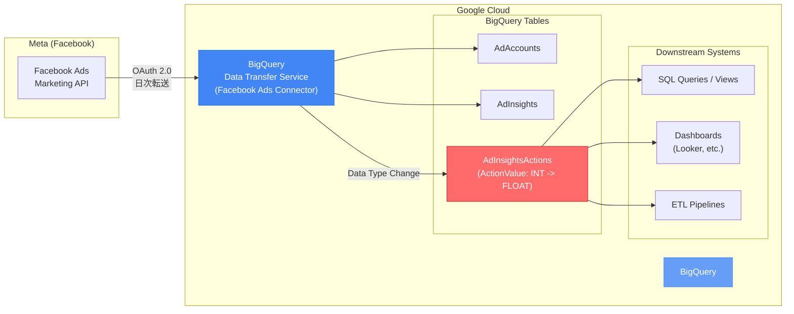

# BigQuery Data Transfer Service: Facebook Ads コネクタ ActionValue フィールドのデータ型変更 (INT -> FLOAT)

**リリース日**: 2026-04-20

**サービス**: BigQuery Data Transfer Service

**機能**: Facebook Ads コネクタ AdInsightsActions レポートのデータ型マッピング変更

**ステータス**: 破壊的変更 (Breaking Change) - 2026 年 7 月 25 日に適用予定

:bar_chart: [このアップデートのインフォグラフィックを見る](https://takech9203.github.io/google-cloud-news-summary/20260420-bigquery-dts-facebook-ads-data-type-change.html)

## 概要

2026 年 7 月 25 日より、BigQuery Data Transfer Service の Facebook Ads コネクタにおいて、AdInsightsActions レポートの `ActionValue` フィールドのデータ型マッピングが `INT` (Integer) から `FLOAT` に変更されます。この変更は、Facebook Ads (Meta) のソースデータをより正確に反映し、データの整合性を確保するために実施されます。

この変更は**破壊的変更 (Breaking Change)** に分類されます。`ActionValue` フィールドを参照している SQL クエリ、ビュー、ETL パイプライン、ダッシュボードなどが影響を受ける可能性があり、2026 年 7 月 25 日までに対応が必要です。Facebook Ads の広告パフォーマンスデータを BigQuery で分析しているすべてのユーザーが対象となります。

**アップデート前の課題**

- `ActionValue` フィールドが `INT` (Integer) 型にマッピングされており、ソースデータの小数値が切り捨てられていた
- Facebook Ads API から返される ActionValue は実際には浮動小数点数を含む可能性があるが、整数型への変換により精度が失われていた
- 広告のコンバージョン値やアクション値の正確な金額データを取得できないケースが存在していた

**アップデート後の改善**

- `ActionValue` フィールドが `FLOAT` 型にマッピングされ、ソースデータの小数値を正確に保持できるようになる
- Facebook Ads API のレスポンスデータとの整合性が向上し、データの精度が改善される
- 広告のコンバージョン値やアクション値をより正確に分析できるようになる

## アーキテクチャ図



Facebook Ads からのデータフローを示しています。赤色で強調された AdInsightsActions テーブルの ActionValue フィールドのデータ型が INT から FLOAT に変更され、下流のクエリ、ダッシュボード、ETL パイプラインに影響が及ぶ可能性があります。

## サービスアップデートの詳細

### 主要な変更内容

1. **ActionValue フィールドのデータ型変更**
   - 対象テーブル: `AdInsightsActions`
   - 対象フィールド: `ActionValue` (BigQuery マッピング名)
   - ソースフィールド: `ACTION_COLLECTION.value` (Meta API)
   - 変更前: `INT` (Integer)
   - 変更後: `FLOAT`
   - 適用日: 2026 年 7 月 25 日

2. **変更の目的**
   - ソースデータをより正確に反映するための改善
   - データ整合性の確保
   - Facebook Ads API が返す浮動小数点数値への正確な対応

3. **影響範囲**
   - AdInsightsActions テーブルに対するすべてのクエリ
   - ActionValue フィールドを参照するビュー定義
   - ActionValue フィールドの型に依存するダウンストリームのパイプライン

## 技術仕様

### データ型マッピングの変更

| 項目 | 変更前 | 変更後 |
|------|--------|--------|
| BigQuery データ型 | `INTEGER` (INT64) | `FLOAT` (FLOAT64) |
| Meta API ソースフィールド | `ACTION_COLLECTION.value` | `ACTION_COLLECTION.value` |
| 対象テーブル | `AdInsightsActions` | `AdInsightsActions` |
| 適用日 | - | 2026-07-25 |

### AdInsightsActions テーブルの主要フィールド

| BigQuery フィールド名 | 型 | 説明 |
|----------------------|------|------|
| DateStart | Date | レポート開始日 |
| DateEnd | Date | レポート終了日 |
| AdAccountId | String | 広告アカウント ID |
| CampaignId | String | キャンペーン ID |
| AdSetId | String | 広告セット ID |
| AdId | String | 広告 ID |
| ActionCollection | String | アクションコレクション名 |
| ActionValue | **INT -> FLOAT** | アクション値 (データ型変更対象) |
| ActionAttributionWindows | String | アトリビューションウィンドウ |

### 影響を受けるアクションコレクション

ActionValue フィールドは、以下のアクションコレクションのすべてに含まれます。転送設定で指定しているアクションコレクションを確認してください。

- ActionValues, Actions, ConversionValues, Conversions
- CostPerActionType, CostPerConversion, CostPerAdClick
- PurchaseRoas, MobileAppPurchaseRoas, WebsitePurchaseRoas
- その他 50 以上のアクションコレクション

## 対応方法

### 前提条件

1. BigQuery Data Transfer Service で Facebook Ads コネクタを利用していること
2. AdInsightsActions テーブルの `ActionValue` フィールドを参照するクエリやパイプラインが存在すること

### 手順

#### ステップ 1: 影響範囲の特定

```sql
-- ActionValue フィールドを参照しているビューを確認
SELECT
  table_catalog,
  table_schema,
  table_name,
  view_definition
FROM
  `your-project`.`region-us`.INFORMATION_SCHEMA.VIEWS
WHERE
  view_definition LIKE '%ActionValue%';
```

INFORMATION_SCHEMA を活用して、ActionValue フィールドを参照しているビューやスケジュールクエリを特定します。

#### ステップ 2: クエリの互換性確認

```sql
-- 変更前: INT 型を前提としたクエリの例
SELECT
  CampaignId,
  SUM(ActionValue) AS total_value  -- INT 型での集計
FROM
  `your-project.your_dataset.AdInsightsActions`
WHERE
  DateStart >= '2026-01-01'
GROUP BY
  CampaignId;

-- 変更後: FLOAT 型に対応したクエリの例
SELECT
  CampaignId,
  ROUND(SUM(ActionValue), 2) AS total_value  -- FLOAT 型での集計 (必要に応じて丸め処理)
FROM
  `your-project.your_dataset.AdInsightsActions`
WHERE
  DateStart >= '2026-01-01'
GROUP BY
  CampaignId;
```

FLOAT 型への変更に伴い、集計結果に小数点以下の値が含まれるようになります。必要に応じて `ROUND()` 関数で丸め処理を追加してください。

#### ステップ 3: 型変換の明示的な処理

```sql
-- 既存のパイプラインで INT 型を期待している場合の互換性確保
SELECT
  CampaignId,
  CAST(ActionValue AS INT64) AS action_value_int,  -- 従来の INT 型互換
  ActionValue AS action_value_float                  -- 新しい FLOAT 型
FROM
  `your-project.your_dataset.AdInsightsActions`;
```

移行期間中は `CAST()` を使用して従来の INT 型との互換性を維持しつつ、段階的に FLOAT 型への移行を進めることを推奨します。

#### ステップ 4: ダウンストリームシステムの更新

BigQuery に接続しているダッシュボードや BI ツール (Looker、Looker Studio、Tableau など) で ActionValue フィールドの型変更が影響しないか確認し、必要に応じて設定を更新します。

## メリット

### ビジネス面

- **データ精度の向上**: コンバージョン値やアクション値の小数点以下の金額を正確に把握でき、広告 ROI の分析精度が向上する
- **ソースデータとの一貫性**: Facebook Ads API から返されるデータと BigQuery 上のデータの整合性が確保される

### 技術面

- **データ整合性の改善**: 型変換による暗黙的なデータ損失 (小数点以下の切り捨て) が解消される
- **正確なレポーティング**: 通貨値や ROAS (広告費用対効果) の計算でより正確な結果が得られる

## デメリット・制約事項

### 制限事項

- 破壊的変更のため、既存のクエリやパイプラインの修正が必要になる場合がある
- INT 型を前提とした厳密な型チェックを行うシステムでエラーが発生する可能性がある

### 考慮すべき点

- FLOAT 型は浮動小数点数であるため、厳密な等値比較 (`=`) ではなく範囲比較や `ROUND()` を使用することを推奨
- 既存の BigQuery テーブルのスキーマが自動的に更新されるため、バックフィル実行時にも新しいデータ型が適用される
- 変更適用後に過去データのバックフィルを行った場合、過去パーティションのデータも FLOAT 型で上書きされる点に注意
- 2026 年 7 月 25 日の適用日まで約 3 か月の猶予期間があるため、計画的な移行を推奨

## ユースケース

### ユースケース 1: 広告コンバージョン値の精密分析

**シナリオ**: EC サイトの広告運用チームが Facebook Ads のコンバージョン値を BigQuery で集計し、商品カテゴリ別の ROAS を算出している。

**実装例**:
```sql
-- FLOAT 型対応後のコンバージョン値分析クエリ
SELECT
  CampaignName,
  ActionCollection,
  COUNT(*) AS action_count,
  ROUND(SUM(ActionValue), 2) AS total_conversion_value,
  ROUND(AVG(ActionValue), 4) AS avg_conversion_value
FROM
  `your-project.your_dataset.AdInsightsActions`
WHERE
  ActionCollection = 'ConversionValues'
  AND DateStart >= DATE_SUB(CURRENT_DATE(), INTERVAL 30 DAY)
GROUP BY
  CampaignName, ActionCollection
ORDER BY
  total_conversion_value DESC;
```

**効果**: 従来は整数に切り捨てられていたコンバージョン値が小数点以下まで正確に集計され、特に単価の低い商品の ROAS 計算精度が向上する。

### ユースケース 2: ETL パイプラインの型安全性確保

**シナリオ**: データエンジニアリングチームが BigQuery から Dataflow や Cloud Composer を使用してデータウェアハウスに ActionValue を転送するパイプラインを運用している。

**効果**: パイプラインのスキーマ定義を事前に FLOAT 型に更新することで、変更適用日にダウンタイムなく移行できる。

## 料金

BigQuery Data Transfer Service 自体のデータ転送は無料です。ただし、転送後のデータに対して標準の BigQuery ストレージ料金およびクエリ料金が適用されます。今回のデータ型変更による追加の料金影響はありません。

なお、FLOAT 型は INTEGER 型と同じ 8 バイトのストレージを使用するため、ストレージコストの変化もありません。

## 関連サービス・機能

- **[BigQuery Data Transfer Service](https://docs.cloud.google.com/bigquery/docs/dts-introduction)**: データ転送の自動化サービス。Facebook Ads を含む多数のデータソースからの定期的なデータロードを管理
- **[Facebook Ads コネクタ](https://docs.cloud.google.com/bigquery/docs/facebook-ads-transfer)**: Facebook Ads のデータを BigQuery に転送するコネクタ。AdAccounts、AdInsights、AdInsightsActions の 3 つのテーブルをサポート
- **[Facebook Ads レポート変換](https://docs.cloud.google.com/bigquery/docs/facebook-ads-transformation)**: Facebook Ads レポートから BigQuery テーブルへのデータ変換マッピングの詳細
- **[BigQuery Data Transfer Service データソース変更ログ](https://docs.cloud.google.com/bigquery/docs/transfer-changes)**: DTS コネクタのスキーマ変更やマッピング変更の履歴
- **[Cloud Monitoring](https://cloud.google.com/monitoring)**: データ転送ジョブの監視やアラート設定に使用

## 参考リンク

- :bar_chart: [インフォグラフィック](https://takech9203.github.io/google-cloud-news-summary/20260420-bigquery-dts-facebook-ads-data-type-change.html)
- [公式リリースノート](https://docs.cloud.google.com/release-notes#April_20_2026)
- [Facebook Ads コネクタ ドキュメント](https://docs.cloud.google.com/bigquery/docs/facebook-ads-transfer)
- [Facebook Ads レポート変換](https://docs.cloud.google.com/bigquery/docs/facebook-ads-transformation)
- [BigQuery Data Transfer Service 変更ログ](https://docs.cloud.google.com/bigquery/docs/transfer-changes)
- [BigQuery Data Transfer Service 概要](https://docs.cloud.google.com/bigquery/docs/dts-introduction)
- [料金ページ](https://cloud.google.com/bigquery/pricing#data-transfer-service-pricing)

## まとめ

2026 年 7 月 25 日に適用される BigQuery Data Transfer Service の Facebook Ads コネクタにおける ActionValue フィールドのデータ型変更 (INT -> FLOAT) は、データの精度向上を目的とした重要な改善ですが、破壊的変更として既存のクエリやパイプラインに影響を与える可能性があります。適用日まで約 3 か月の猶予がありますので、早期に影響範囲を特定し、FLOAT 型に対応したクエリへの修正やダウンストリームシステムの更新を計画的に進めることを強く推奨します。

---

**タグ**: #BigQuery #DataTransferService #FacebookAds #BreakingChange #DataTypeChange #AdInsightsActions #Meta
