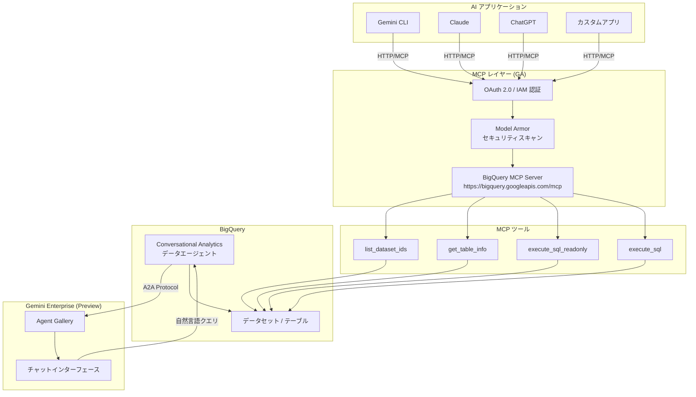

# BigQuery: MCP Server GA & Conversational Analytics エージェント Gemini Enterprise Preview

**リリース日**: 2026-04-20

**サービス**: BigQuery

**機能**: BigQuery MCP Server の GA 昇格、Conversational Analytics エージェントの Gemini Enterprise Preview

**ステータス**: GA (MCP Server) / Preview (Conversational Analytics エージェント in Gemini Enterprise)

[このアップデートのインフォグラフィックを見る](https://takech9203.github.io/google-cloud-news-summary/20260420-bigquery-mcp-server-conversational-analytics.html)

## 概要

BigQuery に関する 2 つの重要なアップデートが発表された。1 つ目は **BigQuery MCP Server の GA (一般提供)** であり、Model Context Protocol (MCP) を通じて AI アプリケーションから BigQuery のリソース操作、SQL クエリの生成・実行、結果の解釈といったデータ関連タスクをセキュアに実行できるようになった。Gemini CLI、Claude、ChatGPT などの主要な AI アプリケーションから標準化されたプロトコルで BigQuery に接続できる。

2 つ目は **BigQuery Conversational Analytics エージェントの Gemini Enterprise への公開機能 (Preview)** である。BigQuery で作成したデータエージェントを Gemini Enterprise に公開し、ビジネスユーザーが自然言語でデータに質問できる環境を提供できるようになった。Agent Gallery での発見、@メンション によるエージェント呼び出し、自然言語クエリの自動ルーティングなど、複数の方法でエージェントを利用できる。

これらのアップデートは、データアナリスト、データエンジニア、AI アプリケーション開発者、およびビジネスユーザーを対象としており、BigQuery と AI エコシステムの統合を大幅に強化するものである。

**アップデート前の課題**

- BigQuery を AI アプリケーションから利用するには、各アプリケーション固有の API 統合や SDK の実装が必要だった
- AI アプリケーションが BigQuery のスキーマやメタデータを理解するには手動でコンテキストを提供する必要があった
- BigQuery で作成した Conversational Analytics のデータエージェントは BigQuery Studio 内でしか利用できず、Gemini Enterprise のユーザーに直接公開する手段がなかった
- ビジネスユーザーがデータに質問するには BigQuery の UI にアクセスする必要があり、普段使いの AI アシスタントからデータ分析を行うことができなかった

**アップデート後の改善**

- MCP 標準プロトコルにより、Gemini CLI、Claude、ChatGPT など主要な AI アプリケーションから統一的な方法で BigQuery に接続可能になった
- BigQuery MCP Server がリソースの探索、SQL 生成、クエリ実行、結果解釈をツールとして公開し、AI アプリケーションが自律的にデータ操作を行える環境が GA として安定提供される
- Conversational Analytics エージェントを Gemini Enterprise に公開し、Agent Gallery や @メンション、自動ルーティングで幅広いユーザーがデータエージェントを利用可能になった
- IAM、OAuth 2.0、Model Armor によるセキュリティ制御がエンタープライズグレードで提供される

## アーキテクチャ図



BigQuery MCP Server は AI アプリケーションと BigQuery の間を MCP 標準プロトコルで仲介し、IAM と Model Armor による多層的なセキュリティを提供する。Conversational Analytics エージェントは A2A プロトコルを通じて Gemini Enterprise に公開され、ビジネスユーザーが自然言語でデータ分析を行える。

## サービスアップデートの詳細

### 主要機能

1. **BigQuery MCP Server (GA)**
   - BigQuery API を有効化するだけで MCP Server が利用可能になる
   - グローバルエンドポイント `https://bigquery.googleapis.com/mcp` を提供
   - HTTP トランスポートで通信し、OAuth 2.0 と IAM で認証・認可を行う
   - 6 つの MCP ツール (list_dataset_ids、get_dataset_info、list_table_ids、get_table_info、execute_sql_readonly、execute_sql) を公開
   - Model Armor によるプロンプトインジェクション防御と機密データ保護に対応

2. **Conversational Analytics エージェント in Gemini Enterprise (Preview)**
   - BigQuery で作成したデータエージェントを Gemini Enterprise に公開可能
   - Agent Gallery でのブラウズ、専用 URL でのダイレクトアクセス、@メンション でのエージェント呼び出しに対応
   - 自然言語による質問を適切なデータエージェントに自動ルーティング
   - テキスト、Markdown、チャート、テーブル形式でのレスポンスストリーミング
   - 会話履歴の自動保存機能を搭載

3. **エンタープライズセキュリティ**
   - BigQuery MCP Server に IAM deny ポリシーを適用して、ツールアクセスを細かく制御可能
   - execute_sql への書き込みアクセスを deny ポリシーで制限可能
   - Model Armor Floor Settings による MCP 通信のセキュリティスキャン (プロンプトインジェクション検出、機密データ保護)
   - Conversational Analytics エージェントの共有は IAM ロール (dataAgentUser / dataAgentEditor / dataAgentViewer) で制御

## 技術仕様

### BigQuery MCP Server ツール一覧

| ツール名 | 機能 | 読み取り専用 | 対応する API メソッド |
|----------|------|-------------|---------------------|
| `list_dataset_ids` | プロジェクト内のデータセット ID を一覧表示 | はい | datasets.list |
| `get_dataset_info` | データセットのメタデータ情報を取得 | はい | datasets.get |
| `list_table_ids` | データセット内のテーブル ID を一覧表示 | はい | tables.list |
| `get_table_info` | テーブルのメタデータ情報を取得 | はい | tables.get |
| `execute_sql_readonly` | 読み取り専用 SQL クエリを実行 (SELECT のみ) | はい | jobs.Query |
| `execute_sql` | SQL クエリを実行 (DML、DDL、AI/ML 関数を含む) | いいえ | jobs.Query |

### 制限事項

| 項目 | 詳細 |
|------|------|
| クエリ処理時間制限 | デフォルト 3 分 (超過時自動キャンセル) |
| 結果行数上限 | 最大 3,000 行 |
| Google Drive 外部テーブル | execute_sql / execute_sql_readonly で非対応 |
| execute_sql_readonly の制約 | SELECT 文のみ。DML、DDL、Python UDF は非対応 |
| MCP Server 固有クォータ | なし (BigQuery API のクォータに準拠) |

### 必要な IAM ロール

```text
# BigQuery MCP Server に必要なロール
roles/mcp.toolUser          # MCP ツール呼び出し権限
roles/bigquery.jobUser      # BigQuery ジョブ実行権限
roles/bigquery.dataViewer   # BigQuery データ閲覧権限

# Conversational Analytics エージェント用ロール
roles/geminidataanalytics.dataAgentUser    # エージェントとのチャット権限
roles/geminidataanalytics.dataAgentEditor  # エージェント編集権限
roles/geminidataanalytics.dataAgentViewer  # エージェント閲覧権限
```

## 設定方法

### 前提条件

1. BigQuery API が有効化されたGoogle Cloud プロジェクト
2. 適切な IAM ロール (roles/mcp.toolUser、roles/bigquery.jobUser、roles/bigquery.dataViewer)
3. OAuth 2.0 認証情報 (Google Cloud 認証情報、OAuth Client ID/Secret、またはエージェント ID)

### 手順

#### ステップ 1: BigQuery MCP Server の有効化

```bash
# BigQuery API を有効化 (新規プロジェクトでは自動的に有効)
gcloud services enable bigquery.googleapis.com

# MCP Server を有効化
gcloud beta api-registry mcp enable bigquery.googleapis.com
```

BigQuery API を有効化すると、BigQuery リモート MCP Server が利用可能になる。

#### ステップ 2: MCP クライアントの設定

```json
{
  "mcpServers": {
    "bigquery": {
      "name": "BigQuery MCP server",
      "url": "https://bigquery.googleapis.com/mcp",
      "transport": "http",
      "authentication": {
        "type": "oauth2",
        "scopes": ["https://www.googleapis.com/auth/bigquery"]
      }
    }
  }
}
```

利用する AI アプリケーション (Gemini CLI、Claude など) の MCP クライアント設定に上記のエンドポイント情報を追加する。

#### ステップ 3: MCP ツールの確認

```bash
# 利用可能な MCP ツールを一覧取得
curl --location 'https://bigquery.googleapis.com/mcp' \
  --header 'content-type: application/json' \
  --header 'accept: application/json, text/event-stream' \
  --data '{
    "method": "tools/list",
    "jsonrpc": "2.0",
    "id": 1
  }'
```

tools/list メソッドは認証不要で実行でき、利用可能なツールとその仕様を確認できる。

#### ステップ 4: Conversational Analytics エージェントの Gemini Enterprise 公開 (Preview)

1. BigQuery Studio で Conversational Analytics データエージェントを作成・公開する
2. 公開時に「Gemini Enterprise」を公開先として選択する
3. A2A エンドポイント JSON をコピーし、Gemini Enterprise 管理者に共有する
4. Gemini Enterprise 管理者がエージェントを登録し、ユーザーに共有する

## メリット

### ビジネス面

- **データアクセスの民主化**: Gemini Enterprise を通じてビジネスユーザーが SQL を書くことなく自然言語でデータ分析を行える。テーブル名やフィールド名を知らなくても、ビジネス用語 (「売上」「トップパフォーマー」など) で質問できる
- **AI アプリケーション開発の加速**: MCP 標準プロトコルにより、BigQuery との統合に必要な開発工数が大幅に削減される。独自の API 統合を構築する代わりに、MCP クライアント設定のみで接続可能

### 技術面

- **標準化されたプロトコル**: MCP は Anthropic が開発したオープンソースプロトコルであり、AI アプリケーションと外部データソースの接続を標準化する。BigQuery 固有の知識がなくてもツールを通じて適切な操作が可能
- **多層的なセキュリティ**: OAuth 2.0 認証、IAM による細粒度の認可、Model Armor によるプロンプトインジェクション防御と機密データ保護を組み合わせた多層防御を提供
- **クォータ管理の透明性**: MCP Server 固有のクォータはなく、既存の BigQuery API クォータに準拠するため、既存の BigQuery のコスト管理・クォータ設定がそのまま有効

## デメリット・制約事項

### 制限事項

- BigQuery MCP Server のクエリ結果は最大 3,000 行に制限される。大量のデータを取得する用途には不向き
- クエリ処理時間はデフォルト 3 分で自動キャンセルされるため、長時間実行クエリには対応できない
- Google Drive 外部テーブルへのクエリは execute_sql / execute_sql_readonly の両方で非対応
- Conversational Analytics の Gemini Enterprise 公開は Preview であり、利用にはアローリストへの申請が必要
- Conversational Analytics API が公式にサポートする言語は英語のみ (日本語での利用は非公式)
- Conversational Analytics はデータレジデンシー (DRZ) に非対応。特定の地理的リージョンにエージェントをホストすることは不可

### 考慮すべき点

- MCP Server を通じたクエリは通常の BigQuery クエリと同様に課金される (オンデマンドの場合は処理バイト数に基づく)
- execute_sql ツールは書き込み操作を許可するため、IAM deny ポリシーで適切に制限することが推奨される
- Model Armor の統合はオプションだが、セキュリティベストプラクティスとして有効化が推奨される

## ユースケース

### ユースケース 1: AI アプリケーションからのデータ探索と分析

**シナリオ**: データサイエンティストが Gemini CLI や Claude を使って BigQuery のデータを対話的に探索し、SQL クエリを生成・実行する。

**実装例**:
```bash
# Gemini CLI から BigQuery MCP Server を利用してデータ探索
# (Gemini CLI の設定に BigQuery MCP Server を追加済みの場合)

# ユーザーの質問: 「sales データセットにはどんなテーブルがある?」
# → MCP ツール list_table_ids が呼ばれ、テーブル一覧を取得

# ユーザーの質問: 「先月の売上トップ10の商品を教えて」
# → MCP ツール get_table_info でスキーマ確認後、
#   execute_sql_readonly で適切な SQL を生成・実行
```

**効果**: SQL の知識がなくても自然言語でデータにアクセスでき、AI アプリケーションがスキーマを自動的に理解して適切なクエリを生成する。

### ユースケース 2: ビジネスユーザー向けデータエージェントの組織展開

**シナリオ**: データアナリストが売上分析用のデータエージェントを BigQuery で作成し、Gemini Enterprise に公開することで、営業部門のビジネスユーザーが自然言語で売上データに質問できるようにする。

**効果**: ビジネスユーザーが Gemini Enterprise のチャットインターフェースから「今四半期の売上トレンドは?」「トップパフォーマーは誰?」といった質問を自然言語で行え、テキスト・チャート・テーブル形式で結果を取得できる。データエージェントにはビジネスロジックや用語の定義を設定でき、組織固有の文脈を反映した正確な回答が得られる。

## 料金

### BigQuery MCP Server

BigQuery MCP Server 自体には追加料金はない。MCP Server を通じて実行されるクエリは、通常の BigQuery クエリと同様に課金される。

- **オンデマンド料金**: 処理バイト数に基づく従量課金
- **キャパシティ料金**: スロット予約に基づく課金 (Standard / Enterprise / Enterprise Plus エディション)
- **無料枠**: 毎月 1 TB のクエリ処理が無料

MCP Server を通じて実行されたクエリにはジョブラベル `goog-mcp-server: true` が自動設定され、MCP 経由の利用量を追跡可能。

### Conversational Analytics

Conversational Analytics API は Preview フェーズであり、Preview 期間中は追加料金なしで利用可能。データエージェントの作成・利用に対する追加課金はない。ただし、データエージェントとの会話で実行される BigQuery クエリには通常の BigQuery 料金が発生する。

## 関連サービス・機能

- **[Google Cloud MCP Servers](https://docs.cloud.google.com/mcp/overview)**: BigQuery MCP Server は Google Cloud の MCP サーバー群の一部。他のサービス (Cloud Storage、Compute Engine など) も MCP Server を提供しており、統一的な AI 統合が可能
- **[Model Armor](https://docs.cloud.google.com/model-armor/overview)**: MCP 通信のセキュリティスキャンを提供し、プロンプトインジェクション防御や機密データ保護を行う
- **[Gemini Enterprise](https://docs.cloud.google.com/gemini/enterprise/docs)**: Conversational Analytics エージェントの公開先。Agent Gallery でエージェントを発見・利用可能
- **[Conversational Analytics API](https://docs.cloud.google.com/gemini/docs/conversational-analytics-api/overview)**: Conversational Analytics の機能をプログラマティックに利用するための API。カスタムインターフェースの構築に使用可能
- **[BigQuery ML](https://docs.cloud.google.com/bigquery/docs/bqml-introduction)**: Conversational Analytics は AI.FORECAST、AI.DETECT_ANOMALIES、AI.GENERATE などの BigQuery ML 関数をサポート
- **[Cloud API Registry](https://docs.cloud.google.com/api-registry/docs/overview)**: MCP サーバーの検出、ガバナンス、監視を行うサービス

## 参考リンク

- [インフォグラフィック](https://takech9203.github.io/google-cloud-news-summary/20260420-bigquery-mcp-server-conversational-analytics.html)
- [公式リリースノート](https://docs.cloud.google.com/release-notes#April_20_2026)
- [BigQuery MCP Server ドキュメント](https://docs.cloud.google.com/bigquery/docs/use-bigquery-mcp)
- [BigQuery MCP リファレンス](https://docs.cloud.google.com/bigquery/docs/reference/mcp)
- [Conversational Analytics 概要](https://docs.cloud.google.com/bigquery/docs/conversational-analytics)
- [データエージェントの作成](https://docs.cloud.google.com/bigquery/docs/create-data-agents)
- [Gemini Enterprise への公開手順](https://docs.cloud.google.com/bigquery/docs/create-data-agents#publish-agent-gemini-enterprise)
- [Google Cloud MCP Servers 概要](https://docs.cloud.google.com/mcp/overview)
- [Model Armor MCP 統合](https://docs.cloud.google.com/model-armor/model-armor-mcp-google-cloud-integration)
- [BigQuery 料金](https://cloud.google.com/bigquery/pricing)

## まとめ

今回のアップデートにより、BigQuery は AI アプリケーションとのシームレスな統合 (MCP Server GA) と、ビジネスユーザーへのデータ分析の民主化 (Conversational Analytics in Gemini Enterprise) という 2 つの方向で大きく前進した。MCP Server の GA により、Gemini CLI や Claude などの AI アプリケーションから標準化されたプロトコルでセキュアに BigQuery を操作できる環境が安定提供される。BigQuery を活用している組織は、まず MCP Server の設定を行い AI ワークフローへの統合を検討すること、また Conversational Analytics のデータエージェントを作成してビジネスユーザーへのデータアクセスの拡大を試みることを推奨する。

---

**タグ**: #BigQuery #MCP #ModelContextProtocol #ConversationalAnalytics #GeminiEnterprise #AI #DataAnalytics #GA #Preview
