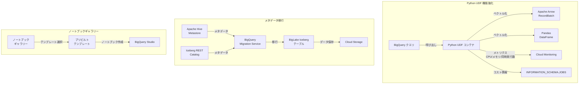

# BigQuery: Python UDF 機能強化、BigLake Iceberg メタデータ移行、ノートブックギャラリー GA

**リリース日**: 2026-04-20

**サービス**: BigQuery

**機能**: Python UDF 改善 (Preview)、BigLake Iceberg メタデータ移行 (Preview)、ノートブックギャラリー (GA)

**ステータス**: Preview / GA

:bar_chart: [このアップデートのインフォグラフィックを見る](https://takech9203.github.io/google-cloud-news-summary/20260420-bigquery-python-udfs-biglake-iceberg-notebook.html)

## 概要

BigQuery に対して 3 つの重要なアップデートが発表された。第一に、Preview 段階の Python UDF に Apache Arrow によるベクトル化処理、Cloud Monitoring 統合、コンテナリクエスト同時実行制御、新しいクォータ、コスト可視化の 5 つの機能が追加された。第二に、Apache Hive Metastore や Apache Iceberg REST Catalog などの外部データカタログから BigLake テーブル (Apache Iceberg) へのメタデータ移行が Preview として利用可能になった。第三に、BigQuery Web UI のノートブックギャラリーが GA (一般提供) となった。

Python UDF の機能強化は、大規模データ処理のパフォーマンス最適化、運用監視の改善、コスト管理の強化を目的としている。BigLake Iceberg メタデータ移行は、既存のデータレイクから Google Cloud のレイクハウスアーキテクチャへの移行を簡素化する。ノートブックギャラリーは、データアナリストやデータサイエンティストがプリビルトのテンプレートを活用して迅速に分析を開始できるようにする。

これらのアップデートは、BigQuery をデータウェアハウスからデータレイクハウスプラットフォームへと進化させる戦略の一環であり、データエンジニア、データサイエンティスト、プラットフォームエンジニアの幅広い層に影響を与える。

**アップデート前の課題**

- Python UDF はバッチ処理で Pandas DataFrame のみをサポートしており、Apache Arrow ネイティブの高速処理ができなかった
- Python UDF のリソース使用状況 (CPU、メモリ、同時リクエスト数) を Cloud Monitoring で監視する手段がなかった
- Python UDF のコンテナ同時リクエスト数を CREATE FUNCTION 文で明示的に制御できなかった
- Python UDF の実行コストが INFORMATION_SCHEMA.JOBS や Job API から確認できなかった
- 外部データカタログ (Hive Metastore、Iceberg REST Catalog) から BigLake Iceberg テーブルへのメタデータ移行は手動で行う必要があった
- ノートブックギャラリーが Preview 段階であり、プリビルトテンプレートの発見・利用に制限があった

**アップデート後の改善**

- Apache Arrow RecordBatch インターフェースによるベクトル化 UDF が利用可能になり、Pandas に加えて Arrow ネイティブの高速バッチ処理が選択できるようになった
- Cloud Monitoring で CPU 使用率、メモリ使用率、インスタンスあたりの最大同時リクエスト数をリアルタイムに監視できるようになった
- `container_request_concurrency` オプションにより、Python UDF コンテナの同時リクエスト数を 1〜1000 の範囲で制御可能になった
- `INFORMATION_SCHEMA.JOBS` の `external_service_costs` カラムと Job API の `ExternalServiceCosts` フィールドで Python UDF コストが可視化された
- BigQuery Migration Service を使用して外部データカタログから BigLake Iceberg テーブルへのメタデータ移行が自動化された
- ノートブックギャラリーが GA となり、SQL、Python、Apache Spark、DataFrames のプリビルトテンプレートが本番環境で安定して利用できるようになった

## アーキテクチャ図



BigQuery の 3 つのアップデートの全体像を示す。Python UDF はベクトル化処理と監視・コスト可視化が強化され、外部カタログからのメタデータ移行パスが追加され、ノートブックギャラリーがデータ分析の入り口として GA になった。

## サービスアップデートの詳細

### 主要機能

1. **Apache Arrow によるベクトル化 Python UDF (Preview)**
   - Apache Arrow の RecordBatch インターフェースを使用して、バッチ単位で行を処理するベクトル化 UDF を作成可能
   - 従来の Pandas DataFrame ベースのベクトル化に加え、Arrow ネイティブの `pyarrow.compute` モジュールによる高速な列指向演算が利用可能
   - `max_batching_rows` オプションでバッチサイズの上限を制御可能 (未指定時は自動決定)

2. **Cloud Monitoring 統合 (Preview)**
   - Python UDF のメトリクスが `bigquery.googleapis.com/ManagedRoutineInvocation` リソースタイプで Cloud Monitoring にエクスポートされる
   - CPU 使用率 (`cpu_utilizations`)、メモリ使用率 (`memory_utilizations`)、最大同時リクエスト数 (`max_request_concurrencies`) の 3 つのメトリクスが利用可能
   - BigQuery のジョブ詳細画面、Metrics Explorer、Cloud Monitoring ダッシュボードからメトリクスを確認可能
   - プロジェクト ID、ロケーション、クエリジョブ ID、ルーティン ID などのラベルでフィルタリング可能

3. **コンテナリクエスト同時実行制御 (Preview)**
   - `CREATE FUNCTION` 文の `container_request_concurrency` オプションで、Python UDF コンテナインスタンスあたりの最大同時リクエスト数を指定可能
   - 設定可能な値の範囲は 1〜1000 (デフォルトは 80)
   - CPU を 1.0 vCPU 未満に設定し、同時実行数を未指定の場合、ランタイムで 1 に設定される

4. **新しいクォータ (Preview)**
   - Python UDF イメージストレージ: プロジェクトあたりリージョンあたり 10 GiB
   - Python UDF ミューテーションレート: プロジェクトあたりリージョンあたり毎分 30 回

5. **コスト可視化 (Preview)**
   - `INFORMATION_SCHEMA.JOBS` ビューの `external_service_costs` カラムで Python UDF コストを確認可能
   - Job API の `ExternalServiceCosts` フィールドでも同様にコスト情報を取得可能

6. **外部データカタログから BigLake Iceberg テーブルへのメタデータ移行 (Preview)**
   - BigQuery Migration Service を使用して、外部データカタログのメタデータを BigLake Iceberg テーブルに移行
   - サポートされる外部カタログ: Apache Hive Metastore、Apache Iceberg REST Catalog
   - Google Cloud Console の Migration > Services ページから移行を作成・実行
   - 移行されたメタデータは BigLake カタログ作成時に指定した Cloud Storage バケットに保存

7. **ノートブックギャラリー (GA)**
   - BigQuery Web UI のノートブックギャラリーがプリビルトテンプレートの発見・利用のための中央ハブとして GA
   - SQL、Python、Apache Spark、DataFrames の基本テンプレートを提供
   - 生成 AI やマルチモーダルデータ分析など高度なトピックのテンプレートも利用可能
   - データライフサイクル全体 (取り込み、探索、高度な分析、BigQuery ML) をカバー

## 技術仕様

### Python UDF ベクトル化 (Apache Arrow)

| 項目 | 詳細 |
|------|------|
| インターフェース | `pyarrow.RecordBatch` |
| 入力 | バッチ化された行 (等長の列) |
| 出力 | `pyarrow.Array` または同等のオブジェクト |
| ランタイム | `python-3.11` (pyarrow 14.0.2 プリインストール) |
| バッチサイズ制御 | `max_batching_rows` オプション |

### Python UDF コンテナ設定

| 項目 | デフォルト値 | 設定範囲 |
|------|-------------|---------|
| CPU | 1.0 vCPU | 0.33〜1.0 (小数)、1、2、4 (整数) |
| メモリ | 512Mi | Mi、M、Gi、G 単位で指定 |
| 同時リクエスト数 | 80 | 1〜1000 |
| 最大構成 | 4 vCPU / 16 GiB | - |

### Cloud Monitoring メトリクス

| メトリクス | 説明 | 単位 |
|-----------|------|------|
| `managed_routine/python/cpu_utilizations` | インスタンスあたりの CPU 使用率分布 | % |
| `managed_routine/python/memory_utilizations` | インスタンスあたりのメモリ使用率分布 | % |
| `managed_routine/python/max_request_concurrencies` | 最大同時リクエスト数の分布 | Count |

### BigLake Iceberg メタデータ移行の制限事項

| 項目 | 制限 |
|------|------|
| 同期タイプ | ワンタイム同期のみ (継続的・定期的同期は非対応) |
| テーブル数上限 | 1 回の移行あたり最大 10,000 テーブル |
| ネストされた名前空間 | 非対応 |
| Iceberg REST Catalog | Parquet データファイルのみサポート |
| Iceberg バージョン | V3 テーブルは非対応 |
| 組織ポリシー | ドメイン制限共有の組織ポリシーは非対応 |

### Apache Arrow ベクトル化 UDF の例

```sql
CREATE FUNCTION `PROJECT_ID.DATASET_ID`.multiplyVectorizedArrow(
  x FLOAT64, y FLOAT64
)
RETURNS FLOAT64
LANGUAGE python
OPTIONS(
  runtime_version="python-3.11",
  entry_point="vectorized_multiply_arrow"
)
AS r'''
import pyarrow as pa
import pyarrow.compute as pc

def vectorized_multiply_arrow(batch: pa.RecordBatch):
  x = batch.column('x')
  y = batch.column('y')
  return pc.multiply(x, y)
''';
```

### コンテナリソース設定の例

```sql
CREATE FUNCTION `PROJECT_ID.DATASET_ID`.resizeImage(image BYTES)
RETURNS BYTES
LANGUAGE python
OPTIONS(
  entry_point='resize_image',
  runtime_version='python-3.11',
  packages=['Pillow==11.2.1'],
  container_memory='2Gi',
  container_cpu=2,
  container_request_concurrency=100
)
AS r"""
import io
from PIL import Image

def resize_image(image_bytes):
  img = Image.open(io.BytesIO(image_bytes))
  resized_img = img.resize((256, 256), Image.Resampling.LANCZOS)
  output_stream = io.BytesIO()
  resized_img.convert('RGB').save(output_stream, format='JPEG')
  return output_stream.getvalue()
""";
```

## 設定方法

### Python UDF ベクトル化 (Apache Arrow)

#### 前提条件

1. BigQuery プロジェクトとデータセットが作成済みであること
2. `bigquery.routines.create` 権限を持つ IAM ロールが付与されていること

#### ステップ 1: Apache Arrow ベクトル化 UDF の作成

```sql
CREATE FUNCTION `my_project.my_dataset`.my_vectorized_udf(
  col1 FLOAT64, col2 FLOAT64
)
RETURNS FLOAT64
LANGUAGE python
OPTIONS(
  runtime_version="python-3.11",
  entry_point="my_function",
  max_batching_rows=1000
)
AS r'''
import pyarrow as pa
import pyarrow.compute as pc

def my_function(batch: pa.RecordBatch):
  return pc.add(batch.column('col1'), batch.column('col2'))
''';
```

#### ステップ 2: Cloud Monitoring でメトリクスを確認

Cloud Monitoring の Metrics Explorer で `BigQuery Managed Routine Invocation` リソースタイプを選択し、CPU 使用率やメモリ使用率を確認する。BigQuery のジョブ詳細画面の「Cloud Monitoring dashboard」リンクからもアクセスできる。

### BigLake Iceberg メタデータ移行

#### 前提条件

1. BigLake API、BigQuery Data Transfer API、BigQuery Migration API、Secret Manager API、Storage Transfer API が有効化されていること
2. BigQuery Admin ロール (`roles/bigquery.admin`) が付与されていること
3. サービスエージェントに Storage Transfer Admin、Service Usage Consumer、Storage Admin、BigLake Admin ロールが付与されていること
4. BigLake カタログが作成済みであること

#### ステップ 1: 必要な API の有効化

```bash
gcloud services enable \
  biglake.googleapis.com \
  bigquerydatatransfer.googleapis.com \
  bigquerymigration.googleapis.com \
  secretmanager.googleapis.com \
  storagetransfer.googleapis.com
```

#### ステップ 2: 移行の作成

Google Cloud Console で Migration > Services ページに移動し、「Register or Migrate Open Lakehouse」セクションの「Create migration」をクリックする。カタログタイプ、リージョン、ソースシステムの URL を設定して移行を実行する。

### ノートブックギャラリー

#### ステップ 1: ノートブックギャラリーを開く

BigQuery Studio のエディタペインで「SQL query」の横にあるドロップダウン矢印をクリックし、「Notebook > All templates」を選択する。

#### ステップ 2: テンプレートからノートブックを作成

ギャラリーからテンプレートを選択し、「Use this template」をクリックして実行可能なノートブックに変換する。

## メリット

### ビジネス面

- **データレイクハウス移行の加速**: 外部カタログからのメタデータ移行自動化により、既存のデータレイクを BigLake ベースのレイクハウスアーキテクチャに効率的に統合できる
- **コスト可視化による予算管理**: Python UDF のコストが INFORMATION_SCHEMA.JOBS で確認できるようになり、チームごとの利用コストの配分や予算管理が可能になる
- **データ分析の民主化**: ノートブックギャラリーのプリビルトテンプレートにより、初心者でも迅速にデータ分析を開始でき、組織全体のデータリテラシー向上に貢献する

### 技術面

- **処理パフォーマンスの向上**: Apache Arrow RecordBatch インターフェースにより、Pandas のオーバーヘッドを回避したゼロコピーに近い列指向バッチ処理が可能になる
- **運用監視の強化**: Cloud Monitoring 統合により、Python UDF のリソース使用状況をリアルタイムに把握し、ボトルネックの特定やキャパシティプランニングが容易になる
- **同時実行の最適化**: `container_request_concurrency` オプションにより、ワークロードに応じた同時実行数の微調整が可能になり、スループットとレイテンシのバランスを最適化できる

## デメリット・制約事項

### 制限事項

- Python UDF の全機能は Preview 段階であり、SLA の対象外。本番ワークロードでの利用には注意が必要
- BigLake Iceberg メタデータ移行はワンタイム同期のみで、継続的な同期は非対応。移行後のソースとデスティネーション双方への書き込みはデータ損失のリスクがある
- BigLake Iceberg メタデータ移行は 1 回あたり最大 10,000 テーブルまで。大規模ワークロードは複数回に分割する必要がある
- Python UDF は `python-3.11` ランタイムのみサポート。JSON、RANGE、INTERVAL、GEOGRAPHY データ型は非対応
- Python UDF コンテナは最大 4 vCPU / 16 GiB まで。VPC ネットワーク、Assured Workloads、CMEK は非対応
- Python UDF の結果はキャッシュされない (非決定的と見なされるため)

### 考慮すべき点

- Python UDF イメージストレージの 10 GiB/プロジェクト/リージョンのクォータに注意。不要な UDF は `DROP FUNCTION` で削除してクォータを解放する
- Python UDF のミューテーションレート (30 回/分/プロジェクト/リージョン) を超えないよう、CI/CD パイプラインでの UDF デプロイ頻度を管理する
- Arrow ベクトル化 UDF は Pandas ベクトル化 UDF と異なるインターフェースを持つため、既存の Pandas UDF からの移行には関数シグネチャの変更が必要
- メタデータ移行後の BigLake テーブルには BigLake 料金が適用される

## ユースケース

### ユースケース 1: 大規模テキストデータの高速処理

**シナリオ**: 数億行のログデータに対して、正規表現によるパターン抽出やテキスト変換を行う Python UDF を使用している。従来の行単位処理ではスループットが不足していた。

**実装例**:
```sql
CREATE FUNCTION `project.dataset`.extract_patterns(text STRING)
RETURNS STRING
LANGUAGE python
OPTIONS(
  runtime_version="python-3.11",
  entry_point="extract",
  max_batching_rows=5000,
  container_cpu=4,
  container_memory='8Gi',
  container_request_concurrency=200
)
AS r'''
import pyarrow as pa
import pyarrow.compute as pc

def extract(batch: pa.RecordBatch):
  texts = batch.column('text')
  return pc.utf8_replace_slice(texts, 0, 0, "processed_")
''';
```

**効果**: Apache Arrow のゼロコピー列指向処理により、Pandas 経由と比較してデータのシリアライゼーションオーバーヘッドが削減され、大規模バッチ処理のスループットが向上する。

### ユースケース 2: オンプレミスデータレイクの Google Cloud 移行

**シナリオ**: オンプレミスの Apache Hive Metastore に数千テーブルのメタデータを持つデータレイクを、Google Cloud の BigLake レイクハウスアーキテクチャに移行する。

**効果**: BigQuery Migration Service を使用してメタデータを自動移行することで、テーブル定義やスキーマ情報を手動で再作成する必要がなくなり、移行にかかる時間と労力が大幅に削減される。移行後は BigQuery からの統合クエリや Iceberg テーブルの管理が可能になる。

### ユースケース 3: データ分析チームのオンボーディング

**シナリオ**: 新しいデータアナリストがチームに参加する際、BigQuery の使い方やデータ分析のベストプラクティスを効率的に学習させたい。

**効果**: ノートブックギャラリーのプリビルトテンプレートを使用することで、SQL の基本クエリ、Python によるデータ探索、BigQuery DataFrames の活用、生成 AI 機能の利用などを段階的に学習できる。テンプレートには実行可能なサンプルコードが含まれており、すぐに手を動かして学べる。

## 料金

### Python UDF

Python UDF は追加料金なしで提供される。課金が有効な場合、以下が適用される。

- BigQuery Services SKU に基づいて課金される
- 料金は Python UDF 呼び出し時のコンピュートおよびメモリ消費量に比例
- UDF コンテナイメージのビルド・リビルドにかかるリソースも課金対象
- 外部またはインターネットへのネットワーク Egress が発生する場合、Cloud Networking の Premium Tier Egress 料金が適用

### BigLake Iceberg メタデータ移行

- メタデータの転送自体は無料
- 移行後のデータには [BigLake 料金](https://cloud.google.com/products/biglake/pricing) が適用される

## 利用可能リージョン

- **Python UDF**: BigQuery の全マルチリージョンおよびリージョナルロケーションで利用可能
- **BigLake Iceberg メタデータ移行**: BigQuery Migration Service がサポートするリージョンで利用可能
- **ノートブックギャラリー**: BigQuery Studio がサポートするリージョンで利用可能

## 関連サービス・機能

- **Cloud Monitoring**: Python UDF のメトリクス (CPU、メモリ、同時実行数) の監視先。Metrics Explorer やカスタムダッシュボードで可視化可能
- **BigLake**: Apache Iceberg テーブルの管理基盤。メタデータ移行のデスティネーションとして機能
- **BigQuery Migration Service**: 外部データカタログからのメタデータ移行を実行するサービス
- **Cloud Storage**: BigLake Iceberg テーブルのデータ保存先
- **Colab Enterprise**: ノートブックギャラリーのテンプレートを実行するランタイム環境を提供
- **BigQuery DataFrames**: ノートブック内で Pandas ライクな API を使用して BigQuery データを分析するためのフレームワーク
- **Secret Manager**: Iceberg REST Catalog からの移行時に OAuth 認証情報を安全に管理

## 参考リンク

- :bar_chart: [インフォグラフィック](https://takech9203.github.io/google-cloud-news-summary/20260420-bigquery-python-udfs-biglake-iceberg-notebook.html)
- [公式リリースノート](https://docs.cloud.google.com/release-notes#April_20_2026)
- [Python UDF ドキュメント](https://docs.cloud.google.com/bigquery/docs/user-defined-functions-python)
- [BigLake Iceberg メタデータ移行ドキュメント](https://docs.cloud.google.com/bigquery/docs/migration/external-metastore-lakehouse-migration)
- [ノートブックギャラリー クイックスタート](https://docs.cloud.google.com/bigquery/docs/quickstarts/notebook-gallery-quickstart)
- [ノートブック概要](https://docs.cloud.google.com/bigquery/docs/notebooks-introduction)
- [Python UDF クォータ](https://docs.cloud.google.com/bigquery/quotas#udf_limits)
- [BigQuery 料金ページ](https://cloud.google.com/bigquery/pricing)
- [BigLake 料金ページ](https://cloud.google.com/products/biglake/pricing)

## まとめ

今回のアップデートは、BigQuery の Python UDF エコシステムの成熟 (パフォーマンス、監視、コスト管理)、オープンフォーマットデータレイクからの移行パスの拡充、そしてデータ分析の入門体験の改善という 3 つの方向で BigQuery プラットフォームを強化するものである。特に Python UDF の Apache Arrow ベクトル化と Cloud Monitoring 統合は、大規模データ処理パイプラインを運用するチームにとって即座に活用すべき機能である。BigLake Iceberg メタデータ移行は、既存の Hive Metastore ベースのデータレイクを持つ組織が Google Cloud レイクハウスへの移行を検討する契機となる。

---

**タグ**: #BigQuery #PythonUDF #ApacheArrow #CloudMonitoring #BigLake #ApacheIceberg #MetadataMigration #NotebookGallery #BigQueryStudio #DataLakehouse #Preview #GA
