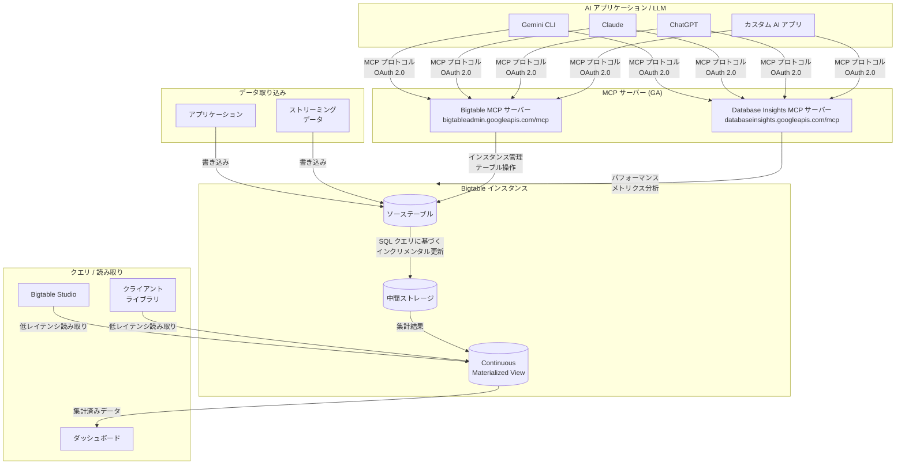

# Bigtable: Continuous Materialized Views / MCP サーバー / Free Trial インスタンス GA

**リリース日**: 2026-04-20

**サービス**: Bigtable

**機能**: Continuous Materialized Views GA、Bigtable リモート MCP サーバー GA、Database Insights MCP サーバー GA、Free Trial インスタンス GA

**ステータス**: Feature (複数 GA)

[このアップデートのインフォグラフィックを見る](https://takech9203.github.io/google-cloud-news-summary/20260420-bigtable-materialized-views-mcp-free-trial-ga.html)

## 概要

Bigtable に関する 4 つの機能が一般提供 (GA) となった。第一に、Continuous Materialized Views (継続的マテリアライズドビュー) が GA となり、SQL クエリに基づく事前集計テーブルをソースデータの変更に合わせて自動的かつインクリメンタルに更新できるようになった。第二に、Bigtable リモート MCP (Model Context Protocol) サーバーが GA となり、LLM や AI アプリケーションから Bigtable インスタンスを直接操作できるようになった。第三に、Database Insights リモート MCP サーバーも GA となり、Bigtable のパフォーマンスやシステムメトリクスを AI アプリケーションから分析可能になった。第四に、Free Trial インスタンスが GA となり、90 日間無料で Bigtable の機能を評価できるようになった。

Continuous Materialized Views は、Bigtable のデータをリアルタイムに事前集計する機能である。ユーザーが提供する SQL クエリ (GoogleSQL) に基づいて、ソーステーブルとは異なるスキーマを持つ事前計算済みテーブルを作成し、データの挿入・更新・削除がソーステーブルに対して行われると、バックグラウンドで自動的にマテリアライズドビューに反映される。ダッシュボード用のメトリクス集計、ラムダ/カッパアーキテクチャの自動化、非同期セカンダリインデックスの作成などのユースケースに適している。

MCP サーバーの GA は、AI エコシステムとの統合を加速させるものであり、Bigtable のインスタンス管理やテーブル操作を Gemini CLI、Claude、ChatGPT などの AI プラットフォームから標準化された方法で実行できる。Free Trial インスタンスは、1 ノード SSD クラスタと最大 500 GB のストレージを 90 日間無料で提供し、Bigtable の評価と学習を支援する。

**アップデート前の課題**

- Bigtable のデータ集計を行うには、読み取り後にアプリケーション側で変換・集計処理を行うか、別途ストリーム処理パイプラインを構築する必要があった
- ダッシュボード用のリアルタイム集計を実現するには、Dataflow などの追加ツールやカスタム ETL ジョブが必要だった
- AI アプリケーションから Bigtable を操作するには、独自の API 統合やローカル MCP サーバーのセットアップが必要だった
- Bigtable を評価するには有料インスタンスを作成する必要があり、学習・評価段階でのコスト障壁が存在した
- セカンダリアクセスパターンへの対応には、別テーブルへのデータ複製とカスタム同期ロジックの実装が必要だった

**アップデート後の改善**

- SQL クエリを定義するだけで、ソースデータの変更に自動追従する事前集計テーブルを作成できるようになった (メンテナンス不要)
- Google が管理するリモート MCP サーバー (`https://bigtableadmin.googleapis.com/mcp`) を通じて、AI アプリケーションから直接 Bigtable を操作できるようになった
- Database Insights MCP サーバーにより、AI エージェントが Bigtable のパフォーマンスメトリクスを自動分析できるようになった
- 90 日間無料の Free Trial インスタンスにより、コスト負担なく Bigtable の機能を評価・学習できるようになった

## アーキテクチャ図



ソーステーブルに書き込まれたデータは、定義された SQL クエリに基づいてバックグラウンドでインクリメンタルに処理され、Continuous Materialized View に反映される。AI アプリケーションは MCP プロトコルを介して Bigtable の管理操作やパフォーマンス分析を実行し、クライアントライブラリや Bigtable Studio からマテリアライズドビューの低レイテンシ読み取りが可能である。

## サービスアップデートの詳細

### 主要機能

1. **Continuous Materialized Views (GA)**
   - SQL クエリ (GoogleSQL) に基づいて、ソーステーブルのデータを自動的に集計・変換した事前計算済みテーブルを作成
   - ソーステーブルへのデータ変更 (挿入・更新・削除) はバックグラウンドで自動的にマテリアライズドビューに反映される (結果整合性)
   - ガベージコレクションポリシーとも同期し、ソーステーブルのデータ期限切れや削除が自動的にビューに反映される
   - ソーステーブルの読み書きレイテンシへの影響は最小限 (低優先度バックグラウンドジョブとして実行)
   - Google Cloud CLI、Bigtable Studio クエリエディタ、Java / Go クライアントライブラリで作成可能
   - 対応集計関数: `COUNT`, `SUM`, `MIN`, `MAX`, `AVG`, `HLL_COUNT.INIT`, `HLL_COUNT.MERGE`, `HLL_COUNT.MERGE_PARTIAL`, `ANY_VALUE`, `BIT_AND`, `BIT_OR`, `BIT_XOR`

2. **Bigtable リモート MCP サーバー (GA)**
   - MCP プロトコルに準拠したリモートサーバーで、HTTP エンドポイント (`https://bigtableadmin.googleapis.com/mcp`) を提供
   - Bigtable API を有効化するだけで自動的に利用可能
   - OAuth 2.0 による認証・認可をサポートし、IAM によるきめ細かなアクセス制御が可能
   - Gemini CLI、Claude.ai、ChatGPT、カスタム AI アプリケーションとの接続をサポート
   - インスタンスの作成・管理、テーブルの作成・一覧表示・削除などの操作が AI アプリケーションから実行可能

3. **Database Insights リモート MCP サーバー (GA)**
   - エンドポイント: `https://databaseinsights.googleapis.com/mcp`
   - Bigtable のパフォーマンスやシステムメトリクスを AI アプリケーションから分析可能
   - Bigtable だけでなく、Cloud SQL、AlloyDB、Spanner など他のデータベースサービスでも同じインターフェースで利用可能

4. **Free Trial インスタンス (GA)**
   - 90 日間無料で利用可能 (初期 10 日間は課金アカウント不要、課金有効化で 90 日に延長)
   - 1 ノード SSD クラスタ、最大 500 GB のストレージを提供
   - SQL クエリ、大量データの取り込み、BigQuery や Dataflow との連携を評価可能
   - プロジェクトごとに 1 インスタンスまで作成可能
   - いつでも有料インスタンスにアップグレード可能 (データ損失やダウンタイムなし)

## 技術仕様

### Continuous Materialized Views

| 項目 | 詳細 |
|------|------|
| クエリ言語 | GoogleSQL for Bigtable |
| 整合性モデル | 結果整合性 (Eventually Consistent) |
| クォータ | インスタンスあたり 1,000 テーブル制限にカウント |
| 中間ストレージ | クエリがスキャンするデータ量とほぼ同等のサイズ |
| レプリケーション | クラスタごとに独立して処理 (テーブルの通常のレプリケーションとは異なる) |
| 作成方法 | gcloud CLI、Bigtable Studio、Java / Go クライアントライブラリ |
| 読み取り方法 | Bigtable Studio、SQL 対応クライアントライブラリ、ReadRows API (Java / Go) |
| 初期データ投入速度 | 1 TB あたり約 3 時間 (175 ノードクラスタの場合、線形スケール) |

### Bigtable MCP サーバーの必要な IAM ロール

| 用途 | 必要なロール |
|------|------------|
| MCP ツールの呼び出し | `roles/mcp.toolUser` (MCP Tool User) |
| Bigtable リソースへのフルアクセス | `roles/bigtable.admin` (Bigtable Administrator) |

### Free Trial インスタンスの制限事項

| 項目 | 制限 |
|------|------|
| クラスタ数 | 1 クラスタのみ (追加不可) |
| ノード数 | 1 ノード (スケーリング無効) |
| ストレージ | 最大 500 GB SSD |
| レプリケーション | 無効 |
| 暗号化 | Google マネージド暗号化のみ (CMEK 非対応) |
| Data Boost | 利用不可 |
| SLA | 適用外 |

## 設定方法

### 前提条件

1. Google Cloud プロジェクトで Bigtable API が有効化されていること
2. 必要な IAM ロールが付与されていること

### 手順

#### ステップ 1: Continuous Materialized View の作成 (gcloud CLI)

```bash
# Continuous Materialized View の作成
gcloud bigtable materialized-views create my-view \
  --instance=my-instance \
  --query='SELECT SPLIT(_key, "#")[SAFE_OFFSET(0)] AS advertiser_id, count(*) AS count, sum(cast(cast(data["spend_usd"] as string) as int64)) as sum_spend FROM `$0` GROUP BY advertiser_id'
```

ソーステーブルのデータ量に応じて初期投入に時間がかかる場合がある。オートスケーリングの有効化を推奨する。

#### ステップ 2: Bigtable MCP サーバーへの接続設定 (Gemini CLI)

```json
{
  "mcpServers": {
    "Bigtable MCP Server": {
      "httpUrl": "https://bigtableadmin.googleapis.com/mcp",
      "authProviderType": "google_credentials",
      "oauth": {
        "scopes": ["https://www.googleapis.com/auth/bigtable.admin"]
      },
      "headers": {
        "x-goog-user-project": "YOUR_PROJECT_ID"
      }
    },
    "Database Insights MCP Server": {
      "httpUrl": "https://databaseinsights.googleapis.com/mcp",
      "authProviderType": "google_credentials",
      "oauth": {
        "scopes": ["https://www.googleapis.com/auth/cloud-platform"]
      },
      "headers": {
        "x-goog-user-project": "YOUR_PROJECT_ID"
      }
    }
  }
}
```

#### ステップ 3: MCP ツール一覧の確認

```bash
# ツール一覧の取得 (認証不要)
curl --location 'https://bigtableadmin.googleapis.com/mcp' \
  --header 'content-type: application/json' \
  --header 'accept: application/json, text/event-stream' \
  --data '{
    "method": "tools/list",
    "jsonrpc": "2.0",
    "id": 1
  }'
```

#### ステップ 4: Free Trial インスタンスの作成

1. Google Cloud Console で Bigtable のページを開く
2.「Experience Bigtable at no cost and no commitment」セクションでインスタンス名、リージョン、ゾーンを入力
3.「Create free instance」をクリック
4. 課金アカウントを有効化すると、試用期間が 10 日から 90 日に延長される

## メリット

### ビジネス面

- **リアルタイム分析の迅速な実現**: Continuous Materialized Views により、ストリーム処理パイプラインや ETL ジョブを構築することなく、データの事前集計とリアルタイムダッシュボードを実現できる
- **AI 統合の加速**: 標準化された MCP プロトコルにより、AI アプリケーションから Bigtable を直接操作・分析できるため、AI 駆動のデータベース管理ワークフローを迅速に構築できる
- **評価コストの排除**: Free Trial インスタンスにより、90 日間無料で Bigtable の性能と機能を評価でき、導入判断に必要な技術検証をコスト負担なく実施できる

### 技術面

- **ゼロメンテナンス**: Continuous Materialized Views はソーステーブルの変更を自動的に追跡・反映するため、同期ロジックの実装やメンテナンスが不要
- **低レイテンシ読み取り**: 事前集計済みのデータを直接読み取ることで、クエリ時の集計処理を排除し、低レイテンシでの結果取得を実現
- **ソーステーブルへの影響最小**: マテリアライズドビューの処理は低優先度バックグラウンドジョブとして実行され、ソーステーブルの読み書きパフォーマンスへの影響は最小限
- **標準プロトコル対応**: MCP という業界標準プロトコルに対応したことで、特定の AI プラットフォームに依存しない柔軟な統合が可能

## デメリット・制約事項

### Continuous Materialized Views の制限

- 結果整合性 (Eventually Consistent) であり、ソーステーブルの変更がビューに反映されるまでに遅延が発生する場合がある
- `SELECT *`、`DISTINCT`、`LIMIT/OFFSET`、`OVER` (ウィンドウ関数)、`ARRAY_AGG` などの SQL 機能はサポートされていない
- 1 行あたりのスキャンデータが 1 MiB を超える行はビューから除外される
- 中間ストレージとして、クエリがスキャンするデータとほぼ同量の追加ストレージが必要
- インスタンスあたり 1,000 テーブル制限にカウントされる
- レプリケーション環境では、クラスタごとに独立して処理されるため、クラスタ間で一時的な不整合が生じる可能性がある

### MCP サーバーの制限

- API キーによる認証はサポートされていない (OAuth 2.0 が必須)
- エージェント用に別途 ID を作成し、アクセス制御とモニタリングを行うことが推奨される

### Free Trial インスタンスの制限

- プロジェクトごとに 1 インスタンスのみ (削除後も再作成不可)
- スケーリング、レプリケーション、CMEK、Data Boost は利用不可
- 本番ワークロードでの使用は推奨されない
- SLA の対象外

## ユースケース

### ユースケース 1: 広告費のリアルタイム集計ダッシュボード

**シナリオ**: 広告プラットフォームが、広告主ごとの広告費を Bigtable に保存している。これまではダッシュボード表示のたびにテーブル全体をスキャンして集計していたが、Continuous Materialized View を使って事前集計を行う。

**実装例**:
```sql
-- 広告主ごとの広告費を事前集計する Materialized View
SELECT
  SPLIT(_key, "#")[SAFE_OFFSET(0)] AS advertiser_id,
  count(*) AS ad_count,
  sum(cast(cast(data['spend_usd'] as string) as int64)) AS total_spend
FROM `$0`
GROUP BY advertiser_id
```

**効果**: ダッシュボードからの読み取りは事前集計済みのビューに対して行われるため、テーブル全体のスキャンが不要になり、低レイテンシでの集計結果取得が可能になる。ソーステーブルへの書き込みは自動的にビューに反映されるため、同期ロジックの実装が不要になる。

### ユースケース 2: AI エージェントによる Bigtable 運用自動化

**シナリオ**: SRE チームが AI エージェントを使って Bigtable インスタンスの管理とパフォーマンス監視を自動化する。

**実装例**:
```
# AI エージェントへの指示例
"Project my-project の Bigtable インスタンス一覧を表示して、
 各インスタンスのCPU使用率とストレージ使用量を確認してください。
 異常があれば報告してください。"
```

**効果**: Bigtable MCP サーバーでインスタンス管理を行い、Database Insights MCP サーバーでパフォーマンスメトリクスを取得することで、AI エージェントが自然言語での指示に基づいてデータベースの状態確認と問題の診断を一貫して実行でき、SRE の負荷を軽減できる。

### ユースケース 3: Bigtable の導入評価

**シナリオ**: 既存の NoSQL データベースからの移行を検討しているチームが、Free Trial インスタンスを使って Bigtable の性能を評価する。

**効果**: 90 日間の無料試用期間中に、最大 500 GB のデータを投入して実際のワークロードに近い条件での性能テストを実施できる。SQL クエリ、BigQuery 連携、Dataflow 連携などの機能も評価でき、移行判断のための技術検証をコスト負担なく行える。

## 料金

### Continuous Materialized Views

Continuous Materialized Views の料金は、ビュー自体のストレージと中間ストレージに対して、通常の Bigtable ストレージ料金が適用される。また、ビューの処理に必要なコンピュート容量はノード料金に含まれる。オートスケーリングを有効にしている場合、ビューの処理に応じてノードが自動的にスケールアップ・ダウンする。

### MCP サーバー

Bigtable MCP サーバーおよび Database Insights MCP サーバーの利用自体に追加料金は発生しない。料金は通常の Bigtable リソース使用量 (コンピュート、ストレージ) に基づく。

### Free Trial インスタンス

| 項目 | 詳細 |
|------|------|
| 試用期間 | 10 日間 (課金有効化で 90 日に延長) |
| 料金 | 無料 (アップグレードしない限り課金されない) |
| 提供リソース | 1 ノード SSD クラスタ、最大 500 GB ストレージ |
| Google Cloud 無料トライアルとの関係 | $300 無料クレジットとは別枠で提供される |

詳細な料金については [Bigtable 料金ページ](https://cloud.google.com/bigtable/pricing) を参照。

## 関連サービス・機能

- **BigQuery**: Bigtable と連携して複雑な分析クエリを実行可能。Continuous Materialized Views で事前集計したデータと BigQuery の分析機能を組み合わせることでデータパイプラインを最適化できる
- **Dataflow**: ストリーミングおよびバッチデータ処理パイプラインの構築に使用。Continuous Materialized Views はラムダ/カッパアーキテクチャの一部として Dataflow と補完的に利用できる
- **Google Cloud MCP サーバー**: Bigtable 以外にも Cloud SQL、AlloyDB、Spanner、Firestore など複数の Google Cloud データベースサービスが MCP サーバーを提供しており、統一されたインターフェースで AI アプリケーションから操作可能
- **Cloud Monitoring**: Database Insights MCP サーバーは内部的に Cloud Monitoring のメトリクスを活用しており、既存のモニタリング基盤と連携
- **Model Armor**: Google Cloud MCP サーバーでは、オプションで Model Armor によるプロンプトおよびレスポンスのセキュリティ保護が利用可能

## 参考リンク

- [インフォグラフィック](https://takech9203.github.io/google-cloud-news-summary/20260420-bigtable-materialized-views-mcp-free-trial-ga.html)
- [公式リリースノート](https://docs.cloud.google.com/release-notes#April_20_2026)
- [Continuous Materialized Views 概要](https://docs.cloud.google.com/bigtable/docs/continuous-materialized-views)
- [Continuous Materialized Views の作成と管理](https://docs.cloud.google.com/bigtable/docs/manage-continuous-materialized-views)
- [Continuous Materialized Views のクエリ仕様](https://docs.cloud.google.com/bigtable/docs/continuous-materialized-view-queries)
- [Bigtable リモート MCP サーバーの使用](https://docs.cloud.google.com/bigtable/docs/use-bigtable-mcp)
- [Bigtable MCP リファレンス](https://docs.cloud.google.com/bigtable/docs/reference/admin/mcp)
- [Database Insights MCP リファレンス](https://docs.cloud.google.com/bigtable/docs/reference/admin/mcp/databaseinsights/mcp)
- [Free Trial インスタンス概要](https://docs.cloud.google.com/bigtable/docs/free-trial-instance)
- [Free Trial インスタンスの作成](https://docs.cloud.google.com/bigtable/docs/create-free-trial-instance)
- [Bigtable 料金](https://cloud.google.com/bigtable/pricing)

## まとめ

今回のアップデートにより、Bigtable はデータ集計・分析機能、AI エコシステムとの統合、および導入障壁の低減において大幅に強化された。Continuous Materialized Views の GA は、リアルタイムのデータ事前集計をゼロメンテナンスで実現し、ストリーム処理パイプラインやカスタム ETL ジョブの構築を不要にする。MCP サーバーの GA は AI アプリケーションからのデータベース操作・分析を標準化し、Free Trial インスタンスの GA は新規ユーザーの評価障壁を排除する。Bigtable を使用している、または導入を検討しているチームは、Continuous Materialized Views によるクエリパフォーマンスの改善と運用効率化を積極的に評価することを推奨する。

---

**タグ**: #Bigtable #ContinuousMaterializedViews #MCP #ModelContextProtocol #DatabaseInsights #FreeTrial #GA #NoSQL #リアルタイム集計 #AI
