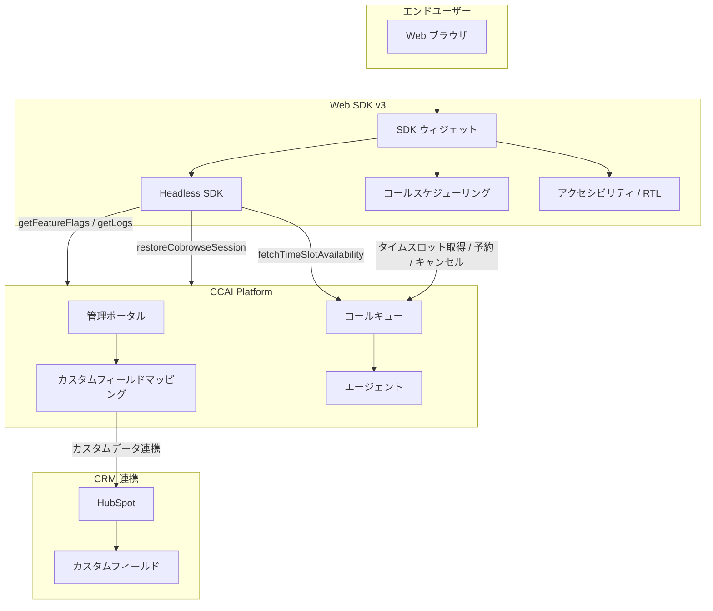

# Google Cloud CCaaS: Web SDK v3 高度なコールスケジューリング、HubSpot カスタムフィールドマッピング、アクセシビリティ改善

**リリース日**: 2026-04-20

**サービス**: Google Cloud Contact Center as a Service (CCaaS)

**機能**: Web SDK v3 高度なコールスケジューリング / HubSpot カスタムフィールドマッピング / Headless Web SDK 新メソッド / アクセシビリティ改善 / バグ修正

**ステータス**: Prerelease (プレリリースノート)

[このアップデートのインフォグラフィックを見る](https://takech9203.github.io/google-cloud-news-summary/20260420-ccaas-prerelease-web-sdk-v3.html)

## 概要

Google Cloud CCaaS (Contact Center as a Service) の次期バージョンのプレリリースノートが公開された。本アップデートは、Web SDK v3 における高度なコールスケジューリング機能、HubSpot CRM との カスタムフィールドマッピング、Headless Web SDK の新メソッド追加、そしてアクセシビリティとデザインの大幅な改善を含む包括的なリリースである。

Web SDK v3 のコールスケジューリング機能は、日ベースのタイムスロット選択、既存予約の再スケジューリング、キャンセル機能を新たに提供し、エンドユーザーのコールバック体験を大きく向上させる。また、HubSpot カスタムフィールドマッピングにより、SDK から送信されたカスタムデータを HubSpot の任意のカスタムフィールドに直接書き込むことが可能になった。アクセシビリティ面では、WCAG 準拠、RTL (右から左) 言語サポート、スクリーンリーダー互換性の向上が実現されている。

加えて、チャットエスカレーション時の切断問題や IVR キューのリネームエラーなど、複数の重要なバグ修正も含まれている。本アップデートはコンタクトセンター運用者、Web 開発者、およびグローバル展開を行う組織にとって注目すべき内容である。

**アップデート前の課題**

- Web SDK v3 のコールスケジューリングは基本的なタイムスロット選択のみで、日ごとの閲覧や既存予約の管理 (再スケジューリング・キャンセル) ができなかった
- HubSpot CRM との連携では、SDK のカスタムデータを HubSpot のカスタムフィールドに自動的にマッピングする機能がなく、データ連携が限定的だった
- Headless Web SDK にはフィーチャーフラグの取得、タイムスロットの空き状況確認、コブラウズセッション復元、デバッグログ取得のメソッドが存在しなかった
- Web SDK は WCAG に完全準拠しておらず、アラビア語やヘブライ語などの RTL 言語のサポートが不足していた

**アップデート後の改善**

- エンドユーザーが日ごとにタイムスロットを閲覧し、既存のスケジュール済みコールの再スケジューリングやキャンセルが可能になった
- SDK のカスタムデータフィールドを HubSpot のカスタムフィールドに直接マッピングし、ランタイムで自動的に値を書き込めるようになった
- Headless Web SDK に `getFeatureFlags`、`fetchTimeSlotAvailability`、`restoreCobrowseSession`、`getLogs` の 4 つの新メソッドが追加された
- WCAG 準拠、RTL 言語サポート (アラビア語、ヘブライ語、ペルシア語、ウルドゥー語)、スクリーンリーダー互換性が改善された

## アーキテクチャ図



Web SDK v3 がエンドユーザーのブラウザと CCAI Platform の間を仲介し、コールスケジューリング、Headless SDK の新メソッド、HubSpot へのカスタムフィールドマッピングがそれぞれ連携する構成を示す。

## サービスアップデートの詳細

### 主要機能

1. **HubSpot カスタムフィールドマッピング**
   - Web または Mobile SDK のカスタムデータフィールドを HubSpot のカスタムフィールドにマッピング可能になった
   - ランタイムで SDK がカスタムデータ値を送信すると、マッピングされた HubSpot カスタムフィールドに自動的に値が書き込まれる
   - 管理者は Settings > Operation Management ページの新しい Custom Field Mapping ペインから設定を行う
   - 従来から Zendesk、Salesforce、Kustomer 向けに提供されていた CRM カスタムフィールドマッピング機能が HubSpot にも拡張された

2. **Web SDK v3: 高度なコールスケジューリング**
   - **日ベースのタイムスロット選択**: エンドユーザーが日ごとに整理された空きタイムスロットを閲覧可能。間隔は設定で変更可能
   - **再スケジューリング**: エンドユーザーが Web SDK を再度開いた際、既存のスケジュール済みコールがあれば、新しいフローを開始する前に予約管理 (再スケジューリングまたはキャンセル) を促される
   - **キャンセル**: エンドユーザーが Web SDK から以前にスケジュールしたコールをキャンセル可能

3. **Headless Web SDK の更新**
   - **新メソッド**:
     - `getFeatureFlags`: フィーチャーフラグの現在の状態を取得
     - `fetchTimeSlotAvailability`: 指定メニューのタイムスロット空き状況を確認
     - `restoreCobrowseSession`: ブラウザウィンドウ再オープン後にコブラウズセッションを復元
     - `getLogs`: SDK が収集した内部デバッグログを取得
   - **更新されたメソッドシグネチャ**:
     - `getTimeSlots`: `GetTimeSlotsRequest` オプションオブジェクトが追加 (従来は `menuId` と `lang` のみ)
     - `updatePostSession`: `optInSelection` パラメータが追加

4. **アクセシビリティとデザインの改善**
   - **WCAG 準拠**: Web Content Accessibility Guidelines (WCAG) に準拠するよう更新
   - **RTL (右から左) 言語サポート**: アラビア語、ヘブライ語、ペルシア語、ウルドゥー語に対応
   - **スクリーンリーダー互換性の向上**: スクリーンリーダーのサポートが改善
   - **スペーシングの改善**: 4px ベースのスペーシングを採用し、ページ表示の見た目を統一

### バグ修正

本リリースでは以下の問題が修正された:

| 修正内容 | カテゴリ |
|----------|----------|
| チャットエスカレーション時の切断問題 | チャット |
| All Interactions ダッシュボードでの不正なチャットインタラクション表示 | ダッシュボード |
| OOO (不在) メッセージの不一致 | メッセージング |
| Missed target 通知の誤表示 | 通知 |
| プライベートイングレス接続の失敗 | ネットワーク |
| Allow transfers チェックボックスの問題 | 転送設定 |
| アウトバウンド電話番号の割り当て問題 | アウトバウンド |
| IVR キューのリネームエラー | IVR |

## 技術仕様

### Headless Web SDK 新メソッド

| メソッド | 機能 | 戻り値 |
|----------|------|--------|
| `getFeatureFlags()` | フィーチャーフラグの状態取得 | フィーチャーフラグオブジェクト |
| `fetchTimeSlotAvailability(menuId)` | タイムスロットの空き確認 | 空き状況レスポンス |
| `restoreCobrowseSession()` | コブラウズセッション復元 | セッションオブジェクト |
| `getLogs()` | SDK 内部デバッグログ取得 | ログ配列 |

### 更新されたメソッドシグネチャ

**getTimeSlots (変更前)**:
```typescript
getTimeSlots(menuId: number | string, lang?: string): Promise<string[]>
```

**getTimeSlots (変更後)**:
```typescript
getTimeSlots(menuId: number | string, options?: GetTimeSlotsRequest): Promise<string[]>
```

**updatePostSession (変更前)**:
```typescript
updatePostSession(postSessionStatus: PostSessionStatus): Promise<void>
```

**updatePostSession (変更後)**:
```typescript
updatePostSession(postSessionStatus: PostSessionStatus, optInSelection?: boolean): Promise<void>
```

### Web SDK v3 の設定例

```html
<!-- Web SDK v3 ウィジェットの組み込み -->
<div id="ccaas-widget"></div>
<script src="https://{your_ccaas_host}/web-sdk/v3/widget.js"></script>
<script>
  var ccaas = new UJET({
    companyId: "{COMPANY_KEY}",
    host: "https://{your_ccaas_host}",
    authenticate: getAuthToken
  });

  // カスタムデータの設定 (HubSpot フィールドマッピング対象)
  ccaas.config({
    customData: {
      plan_type: {
        label: "Plan Type",
        value: "enterprise"
      },
      account_id: {
        label: "Account ID",
        value: "ACC-12345"
      }
    }
  });

  ccaas.mount("#ccaas-widget");
</script>
```

## 設定方法

### HubSpot カスタムフィールドマッピングの設定

#### ステップ 1: HubSpot 側でカスタムフィールドを作成

HubSpot の管理画面でマッピング先となるカスタムフィールドを作成する。

#### ステップ 2: CCAI Platform でフィールドマッピングを設定

1. CCAI Platform ポータルに管理者権限でサインイン
2. Settings > Operation Management に移動
3. 新しい Custom Field Mapping ペインを開く
4. SDK カスタムデータフィールドと HubSpot カスタムフィールドの対応関係を設定

#### ステップ 3: SDK カスタムデータの送信

```javascript
// Web SDK v3 でカスタムデータを設定
ccaas.config({
  customData: {
    custom_field_key: {
      label: "表示ラベル",
      value: "送信する値"
    }
  }
});
```

ランタイムで SDK がカスタムデータ値を送信すると、マッピングされた HubSpot カスタムフィールドに自動的に値が書き込まれる。

### Headless Web SDK の新メソッド利用

```javascript
// Headless SDK クライアントの取得
const client = ccaas.client;

// フィーチャーフラグの取得
const flags = await client.getFeatureFlags();

// タイムスロットの空き状況確認
const availability = await client.fetchTimeSlotAvailability(menuId);

// コブラウズセッションの復元
await client.restoreCobrowseSession();

// デバッグログの取得
const logs = client.getLogs();
```

## メリット

### ビジネス面

- **顧客体験の向上**: 高度なコールスケジューリングにより、エンドユーザーは日ごとにタイムスロットを確認し、都合に合わせてコールバックを管理できる。再スケジューリングやキャンセルも可能になり、顧客満足度の向上が期待される
- **CRM データ連携の強化**: HubSpot カスタムフィールドマッピングにより、コンタクトセンターで収集したカスタムデータを HubSpot に自動反映でき、営業・サポートチーム間のデータ一貫性が向上する
- **グローバル展開の促進**: RTL 言語サポートと WCAG 準拠により、中東地域やアクセシビリティ要件が厳しい市場への展開が容易になる

### 技術面

- **開発効率の向上**: Headless Web SDK の新メソッドにより、フィーチャーフラグ管理、タイムスロット空き確認、デバッグログ取得が API レベルで可能になり、カスタム UI の開発が効率化される
- **安定性の向上**: チャットエスカレーション切断、IVR キューリネームエラーなど複数のバグ修正により、システムの安定性と信頼性が向上する
- **デバッグ容易性**: `getLogs` メソッドの追加により、SDK 内部のデバッグログを取得でき、問題調査が容易になる

## デメリット・制約事項

### 制限事項

- 本アップデートはプレリリースノートであり、正式リリース時に内容が変更される可能性がある
- コールスケジューリングのタイムスロット算出は静的モデルに基づいており、15 分間隔ごとのスロット数は「キューに割り当てられた総エージェント数 x 0.5」で計算される
- スケジュールコールは Web SDK ではPSTN 通話として発信されるため、SmartActions は利用できない

### 考慮すべき点

- HubSpot カスタムフィールドマッピングを利用するには、HubSpot 側で事前にカスタムフィールドを作成しておく必要がある
- RTL 言語サポートは現時点でアラビア語、ヘブライ語、ペルシア語、ウルドゥー語の 4 言語に限定されている
- `getTimeSlots` メソッドのシグネチャが変更されているため、既存の Headless SDK 実装でこのメソッドを使用している場合は互換性を確認する必要がある

## ユースケース

### ユースケース 1: EC サイトでの VIP 顧客向けコールバック管理

**シナリオ**: EC サイトで VIP 顧客がサポートに問い合わせる際、高度なコールスケジューリング機能を使って、顧客自身が都合の良い日時を選択してコールバックを予約する。予定が変わった場合は Web SDK から再スケジューリングやキャンセルも可能。

**実装例**:
```javascript
// Web SDK v3 でコールスケジューリングを初期化
var ccaas = new UJET({
  companyId: "VIP_SUPPORT",
  host: "https://support.example.com",
  authenticate: getAuthToken
});

ccaas.config({
  customData: {
    customer_tier: { label: "Customer Tier", value: "VIP" },
    order_id: { label: "Order ID", value: "ORD-98765" }
  }
});

ccaas.mount("#ccaas-widget");
```

**効果**: VIP 顧客の待ち時間を解消し、予約管理の自律性を提供することで、顧客満足度と再購入率の向上が見込める。

### ユースケース 2: 多言語対応のグローバルサポートポータル

**シナリオ**: 中東・南アジア地域の顧客向けに、アラビア語・ヘブライ語・ペルシア語・ウルドゥー語対応のサポートウィジェットを Web サイトに組み込む。RTL 言語サポートにより、テキストの方向が自動的に右から左に切り替わる。

**効果**: 対象地域の顧客がネイティブ言語で快適にサポートを利用でき、WCAG 準拠によりアクセシビリティ要件を満たすことで、規制準拠にも対応できる。

### ユースケース 3: HubSpot を活用したカスタムデータの自動連携

**シナリオ**: HubSpot を CRM として使用しているサポートチームが、Web SDK から送信される顧客のプランタイプやアカウント ID などのカスタムデータを HubSpot のカスタムフィールドに自動マッピングする。

**効果**: 手動でのデータ入力が不要になり、コンタクトセンターと CRM のデータ一貫性が確保される。エージェントは HubSpot のレコードで即座にカスタムデータを確認でき、対応品質が向上する。

## 関連サービス・機能

- **Contact Center AI (CCAI)**: Google Cloud のコンタクトセンター AI プラットフォーム。CCaaS は CCAI Platform 上に構築されており、バーチャルエージェント、Agent Assist などの AI 機能と連携する
- **HubSpot 連携**: CCaaS は HubSpot、Salesforce、Zendesk、Kustomer などの主要 CRM との統合をサポートしている。今回のアップデートで HubSpot のカスタムフィールドマッピングが追加された
- **Application Integration (HubSpot トリガー)**: Google Cloud Application Integration でも HubSpot トリガーが Preview として提供されており、HubSpot のイベントに基づくワークフロー統合が可能
- **Dialogflow CX**: CCaaS のバーチャルエージェント基盤として Dialogflow CX が利用され、チャットや音声のインテリジェントルーティングを実現する

## 参考リンク

- [インフォグラフィック](https://takech9203.github.io/google-cloud-news-summary/20260420-ccaas-prerelease-web-sdk-v3.html)
- [公式リリースノート](https://docs.cloud.google.com/release-notes#April_20_2026)
- [Web SDK v3 ガイド](https://docs.cloud.google.com/contact-center/ccai-platform/docs/web-sdk-v3-getting-started)
- [Headless Web SDK API リファレンス](https://docs.cloud.google.com/contact-center/ccai-platform/docs/headless-web-api)
- [Web SDK v3 API リファレンス](https://docs.cloud.google.com/contact-center/ccai-platform/docs/web-sdk-v3-api-reference)
- [CRM カスタムフィールドマッピング](https://docs.cloud.google.com/contact-center/ccai-platform/docs/crm-custom-field-mapping)
- [HubSpot 連携設定](https://docs.cloud.google.com/contact-center/ccai-platform/docs/hubspot)
- [コールスケジューリング設定](https://docs.cloud.google.com/contact-center/ccai-platform/docs/call-settings)
- [Web SDK v2 から v3 へのアップグレードガイド](https://docs.cloud.google.com/contact-center/ccai-platform/docs/web-sdk-v3-upgrade)

## まとめ

Google Cloud CCaaS の今回のプレリリースは、Web SDK v3 の高度なコールスケジューリング、HubSpot カスタムフィールドマッピング、Headless SDK の新メソッド群、WCAG 準拠とRTL 言語サポートによるアクセシビリティ改善、そして複数のバグ修正を含む大規模なアップデートである。コンタクトセンター運用者は、正式リリースに向けて HubSpot カスタムフィールドの準備や RTL 言語サポートの検証を進めることを推奨する。また、Headless Web SDK を利用したカスタム実装を行っている開発者は、`getTimeSlots` や `updatePostSession` のシグネチャ変更に伴う互換性の確認を事前に実施すべきである。

---

**タグ**: #GoogleCloud #CCaaS #ContactCenter #WebSDK #HubSpot #CRM #Accessibility #WCAG #RTL #Prerelease
