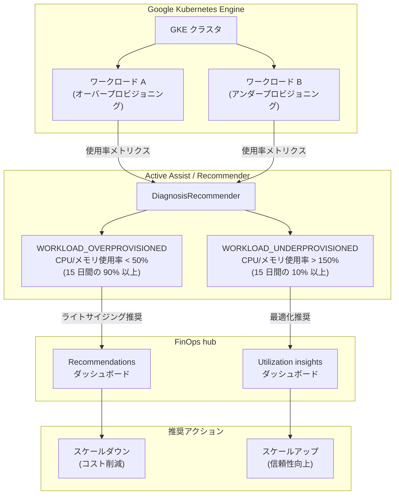

# Cloud Billing: GKE ワークロードレコメンダーが FinOps hub で利用可能に

**リリース日**: 2026-04-20

**サービス**: Cloud Billing

**機能**: GKE ワークロードレコメンダーの FinOps hub 統合

**ステータス**: Feature (新機能)

[このアップデートのインフォグラフィックを見る](https://takech9203.github.io/google-cloud-news-summary/20260420-cloud-billing-gke-workload-recommenders-finops.html)

## 概要

Google Kubernetes Engine (GKE) のワークロードレコメンダーが Cloud Billing の FinOps hub で直接利用可能になりました。これにより、GKE クラスタ上で動作するオーバープロビジョニングされたワークロードのライトサイジング推奨と、アンダープロビジョニングされたワークロードの最適化推奨を、FinOps hub のダッシュボードから一元的に確認できるようになります。

今回のアップデートでは、2 種類の GKE ワークロードレコメンダーが FinOps hub に追加されています。オーバープロビジョニングされたワークロード (WORKLOAD_OVERPROVISIONED) のレコメンデーションは FinOps hub の Recommendations ダッシュボードに表示され、アンダープロビジョニングされたワークロード (WORKLOAD_UNDERPROVISIONED) のレコメンデーションは Utilization insights ダッシュボードに表示されます。いずれも推奨に従うことで、コスト削減と信頼性向上の両方を実現できます。

このアップデートは、GKE クラスタを運用するすべての組織のコスト管理担当者、DevOps エンジニア、プラットフォームエンジニアを対象としています。特に、複数のプロジェクトにまたがる GKE ワークロードのコスト最適化を一元管理したい FinOps チームにとって有用です。

**アップデート前の課題**

- GKE ワークロードのライトサイジング推奨を確認するには、GKE コンソールの Kubernetes クラスタページや gcloud CLI / Recommender API を個別に参照する必要があった
- FinOps hub ではクラスタレベルの推奨 (CLUSTER_OVERPROVISIONED / CLUSTER_UNDERPROVISIONED) は確認できたが、ワークロード単位の詳細な推奨は確認できなかった
- Cloud Billing のコスト最適化ダッシュボードと GKE のワークロードレベルの推奨が分離しており、コスト管理者とプラットフォームエンジニアの間で情報の断絶が生じていた

**アップデート後の改善**

- FinOps hub の Recommendations ダッシュボードからオーバープロビジョニングされた GKE ワークロードのライトサイジング推奨を直接確認・適用できるようになった
- FinOps hub の Utilization insights ダッシュボードからアンダープロビジョニングされた GKE ワークロードの最適化推奨を確認できるようになった
- クラスタレベルとワークロードレベルの両方の推奨を FinOps hub で一元管理でき、組織全体のコスト最適化の可視性が向上した
- ワークロード単位の推定月間コスト削減額が表示され、最適化の優先順位付けが容易になった

## アーキテクチャ図



GKE クラスタ上のワークロードの CPU / メモリ使用率が Active Assist の DiagnosisRecommender によって分析され、オーバープロビジョニングまたはアンダープロビジョニングの推奨が生成されます。これらの推奨が FinOps hub の各ダッシュボードに表示され、コスト管理者が一元的に確認・対応できます。

## サービスアップデートの詳細

### 主要機能

1. **オーバープロビジョニングされたワークロードの推奨 (WORKLOAD_OVERPROVISIONED)**
   - CPU またはメモリの使用率が過去 15 日間の 90% 以上の期間で 50% 未満のワークロードを検出
   - FinOps hub の Recommendations ダッシュボードにライトサイジング推奨として表示
   - 推奨に従いリソースリクエストとリミットを削減することで、コスト削減が可能
   - 推定月間コスト削減額が表示される (GKE コスト割り当てが有効な場合)

2. **アンダープロビジョニングされたワークロードの推奨 (WORKLOAD_UNDERPROVISIONED)**
   - CPU またはメモリの使用率が過去 15 日間の 10% 以上の期間で 150% を超えるワークロードを検出
   - FinOps hub の Utilization insights ダッシュボードに表示
   - 推奨に従いリソースリクエストとリミットを増加させることで、信頼性を向上
   - Recommendations ダッシュボードには表示されない点に注意

3. **推定コスト/削減額の表示**
   - ワークロードコストに基づく推定月間コストまたは削減額を表示
   - 過去 30 日間のリクエスト値の加重平均と CPU/メモリコストから算出
   - 表示には `billing.accounts.getSpendingInformation` 権限と GKE コスト割り当ての有効化が必要

## 技術仕様

### レコメンダーの判定基準

| 項目 | WORKLOAD_OVERPROVISIONED | WORKLOAD_UNDERPROVISIONED |
|------|--------------------------|---------------------------|
| Recommender ID | google.container.DiagnosisRecommender | google.container.DiagnosisRecommender |
| シグナル | CPU/メモリ使用率が低い | CPU/メモリ使用率が高い |
| 観測期間 | 過去 15 日間 | 過去 15 日間 |
| 閾値 | 使用率 < 50% が 90% 以上の時間 | 使用率 > 150% が 10% 以上の時間 |
| 推奨アクション | スケールダウン (コスト削減) | スケールアップ (信頼性向上) |
| FinOps hub 表示先 | Recommendations ダッシュボード | Utilization insights ダッシュボード |
| 対象クラスタ | Autopilot / Standard | Autopilot / Standard |

### レコメンダーの除外条件

- Horizontal Pod Autoscaling (HPA) のターゲットメトリクスに対しては推奨を生成しない (干渉を避けるため)
- Vertical Pod Autoscaling (VPA) が有効な場合、リクエスト値は自動管理されるため推奨を生成しない
- 新規ワークロードに対しては、推奨生成まで最大 3 日間の待機期間がある

### FinOps hub アクセスに必要な IAM 権限

| 権限/ロール | 用途 |
|-------------|------|
| Billing Account Viewer または Billing Account Administrator | FinOps hub へのアクセス |
| Recommender Viewer (recommender.viewer) | 推奨の詳細表示と適用 |
| Project Viewer | プロジェクト単位の推奨詳細の表示 |
| billing.accounts.getSpendingInformation | コスト/削減額の推定表示 |

カスタムロールで FinOps hub にアクセスする場合は、以下の権限が必要です。

```
billing.accounts.get
billing.accounts.getSpendingInformation
billing.finOpsBenchmarkInformation.get
billing.finOpsHealthInformation.get
recommender.costRecommendations.listAll
```

## 設定方法

### 前提条件

1. Cloud Billing アカウントに対する Billing Account Viewer 以上のロール
2. 推奨の詳細を確認するための Recommender Viewer ロール
3. GKE クラスタが稼働中であること (Autopilot / Standard いずれも対象)
4. コスト/削減額の推定を表示するには GKE コスト割り当ての有効化が必要

### 手順

#### ステップ 1: GKE コスト割り当ての有効化

推定コスト削減額を FinOps hub で表示するために、GKE クラスタでコスト割り当てを有効化します。

```bash
# 既存クラスタでコスト割り当てを有効化
gcloud container clusters update CLUSTER_NAME \
    --enable-cost-allocation \
    --region=REGION
```

#### ステップ 2: FinOps hub でワークロード推奨を確認

1. Google Cloud コンソールで「お支払い」>「FinOps hub」に移動
2. 対象の Cloud Billing アカウントを選択
3. 「Potential savings/month」チャートから「View all recommendations」をクリックして Recommendations ダッシュボードを開く
4. Services ドロップダウンで「Google Kubernetes Engine」を選択してフィルタリング

#### ステップ 3: gcloud CLI での推奨確認 (オプション)

```bash
# オーバープロビジョニングされたワークロードの推奨を表示
gcloud recommender recommendations list \
    --recommender=google.container.DiagnosisRecommender \
    --location=LOCATION \
    --project=PROJECT_ID \
    --filter="recommenderSubtype:WORKLOAD_OVERPROVISIONED"

# アンダープロビジョニングされたワークロードの推奨を表示
gcloud recommender recommendations list \
    --recommender=google.container.DiagnosisRecommender \
    --location=LOCATION \
    --project=PROJECT_ID \
    --filter="recommenderSubtype:WORKLOAD_UNDERPROVISIONED"
```

#### ステップ 4: 推奨の適用

推奨に基づいてワークロードのリソースリクエストとリミットを調整します。

```bash
# VPA を有効化して自動調整する方法
gcloud container clusters update CLUSTER_NAME \
    --enable-vertical-pod-autoscaling \
    --region=REGION
```

または、Deployment のリソースリクエストを手動で調整します。

```yaml
# オーバープロビジョニングされたワークロードの場合: リクエスト値を削減
apiVersion: apps/v1
kind: Deployment
metadata:
  name: my-app
spec:
  template:
    spec:
      containers:
      - name: my-container
        resources:
          requests:
            cpu: "250m"      # 推奨に基づき 500m から削減
            memory: "256Mi"  # 推奨に基づき 512Mi から削減
          limits:
            cpu: "500m"
            memory: "512Mi"
```

## メリット

### ビジネス面

- **コスト最適化の一元管理**: GKE ワークロードのコスト最適化推奨を、Compute Engine や Cloud SQL などの他のサービスの推奨と同じ FinOps hub で一元的に管理でき、組織全体のコスト最適化戦略を効率化できる
- **意思決定の迅速化**: 推定月間コスト削減額が表示されるため、どのワークロードから最適化に着手すべきかの優先順位付けが容易になる
- **FinOps チームとプラットフォームチームの連携強化**: コスト管理者が FinOps hub で発見した推奨を、プラットフォームエンジニアに直接共有・適用依頼でき、チーム間のコラボレーションが向上する

### 技術面

- **ワークロードレベルの粒度**: クラスタ全体ではなく個々のワークロード単位での最適化推奨が得られるため、きめ細かいリソース調整が可能
- **データドリブンな判断**: 過去 15 日間の実際の CPU/メモリ使用率データに基づく推奨であり、推測ではなくエビデンスベースの最適化ができる
- **VPA との統合**: 推奨の適用方法として Vertical Pod Autoscaling (VPA) の有効化が選択でき、継続的な自動最適化も実現可能

## デメリット・制約事項

### 制限事項

- アンダープロビジョニングされたワークロードの推奨は Utilization insights ダッシュボードにのみ表示され、Recommendations ダッシュボードには含まれない
- HPA のターゲットメトリクスが設定されているワークロードに対しては推奨が生成されない
- VPA が有効なワークロードに対しては推奨が生成されない (既に自動管理されているため)
- 新規ワークロードに対する推奨生成には最大 3 日間の待機期間がある
- 推定コスト削減額の表示には GKE コスト割り当ての有効化が必要

### 考慮すべき点

- バッチ処理ワークロードは意図的に高い使用率を維持している場合があり、アンダープロビジョニングと誤検知される可能性がある
- JVM ベースのワークロードでは、GKE が実際のメモリ使用量を正確に把握できない場合があり、推奨の適用には追加の検証が推奨される
- 推定コスト/削減額は過去の使用量に基づく予測であり、将来のコストを保証するものではない

## ユースケース

### ユースケース 1: マルチプロジェクト環境での GKE コスト最適化

**シナリオ**: 大規模な組織で複数のチームがそれぞれの GKE クラスタでマイクロサービスを運用しており、FinOps チームが組織全体の GKE コストを最適化したい。各チームが個別に GKE コンソールを確認する運用では、最適化の抜け漏れが発生していた。

**効果**: FinOps hub の Recommendations ダッシュボードで全プロジェクトのオーバープロビジョニングされたワークロードを一覧表示し、推定削減額の大きい順にソートすることで、最もインパクトの大きい最適化から着手できる。各チームへの推奨の共有と適用依頼も FinOps hub から直接行える。

### ユースケース 2: リソースの信頼性向上

**シナリオ**: 本番環境の GKE クラスタで、特定のマイクロサービスが断続的にパフォーマンス低下を起こしている。原因が不明だったが、FinOps hub の Utilization insights ダッシュボードで該当ワークロードがアンダープロビジョニングとして検出されていた。

**効果**: FinOps hub でアンダープロビジョニングされたワークロードの推奨を確認し、CPU/メモリのリクエスト値を増加させることで、パフォーマンス問題を解消。コスト増加と信頼性向上のトレードオフを推定コスト情報に基づいて判断できる。

### ユースケース 3: VPA 導入による継続的な最適化

**シナリオ**: FinOps hub で多数のワークロードがオーバープロビジョニングとして検出されたが、手動での個別調整は運用負荷が高い。

**実装例**:
```bash
# VPA を有効化して継続的な自動最適化を実現
gcloud container clusters update my-cluster \
    --enable-vertical-pod-autoscaling \
    --region=asia-northeast1
```

**効果**: VPA を有効化することで、GKE が自動的にリソースリクエスト値を最適化し、FinOps hub の推奨件数が減少。継続的なコスト最適化サイクルが実現する。

## 料金

FinOps hub および GKE ワークロードレコメンダーの利用自体に追加料金は発生しません。FinOps hub は Cloud Billing アカウントに対して無料で提供される機能です。

推奨に基づいてワークロードのリソースを調整した場合、GKE のコンピューティングリソース料金が変動します。

| 項目 | 料金 |
|------|------|
| FinOps hub の利用 | 無料 |
| Recommender API の利用 | 無料 |
| ワークロード推奨の表示 | 無料 |
| GKE コンピューティングリソース | [GKE pricing](https://cloud.google.com/kubernetes-engine/pricing) に準拠 |

## 関連サービス・機能

- **GKE クラスタレコメンダー**: ワークロードレベルではなくクラスタ全体のライトサイジング推奨を提供。CLUSTER_OVERPROVISIONED / CLUSTER_UNDERPROVISIONED のサブタイプで FinOps hub に既に統合済み
- **GKE アイドルクラスタレコメンダー**: 使用されていない GKE クラスタを検出し、削除を推奨。CLUSTER_IDLE サブタイプで FinOps hub に統合済み
- **Vertical Pod Autoscaling (VPA)**: ワークロードのリソースリクエストを自動調整する機能。推奨の適用方法として VPA の有効化が選択肢の一つ
- **Active Assist**: Google Cloud 全体でインサイトとレコメンデーションを提供するプラットフォーム。GKE ワークロードレコメンダーの基盤サービス
- **GKE コスト割り当て**: クラスタ、名前空間、ワークロード単位でのコスト内訳を提供。推定コスト削減額の表示に必要
- **Compute Engine VM マシンタイプレコメンダー**: VM レベルのライトサイジング推奨を提供し、同様に FinOps hub に統合されている

## 参考リンク

- [インフォグラフィック](https://takech9203.github.io/google-cloud-news-summary/20260420-cloud-billing-gke-workload-recommenders-finops.html)
- [公式リリースノート](https://docs.cloud.google.com/release-notes#April_20_2026)
- [ワークロードリソース使用率の最適化](https://cloud.google.com/kubernetes-engine/docs/how-to/optimize-workload-resource-utilization)
- [FinOps hub の概要](https://cloud.google.com/billing/docs/how-to/finops-hub)
- [FinOps hub Recommendations ダッシュボード](https://cloud.google.com/billing/docs/how-to/finops-recommendations-dashboard)
- [FinOps hub Utilization insights ダッシュボード](https://cloud.google.com/billing/docs/how-to/finops-utilization-insights)
- [GKE のインサイトとレコメンデーションで使用率を最適化](https://cloud.google.com/kubernetes-engine/docs/how-to/optimize-with-recommenders)
- [GKE 料金](https://cloud.google.com/kubernetes-engine/pricing)

## まとめ

GKE ワークロードレコメンダーが FinOps hub に統合されたことで、オーバープロビジョニングおよびアンダープロビジョニングされた個々のワークロードの最適化推奨を、Cloud Billing の一元的なダッシュボードから確認・対応できるようになりました。GKE クラスタを運用している組織は、まず FinOps hub の Recommendations ダッシュボードで現在のオーバープロビジョニング状況を確認し、推定削減額の大きいワークロードから VPA の有効化またはリソースリクエストの手動調整を実施することを推奨します。

---

**タグ**: #CloudBilling #FinOps #GKE #Kubernetes #CostOptimization #Recommender #RightSizing #WorkloadOptimization #ActiveAssist #GoogleCloud
