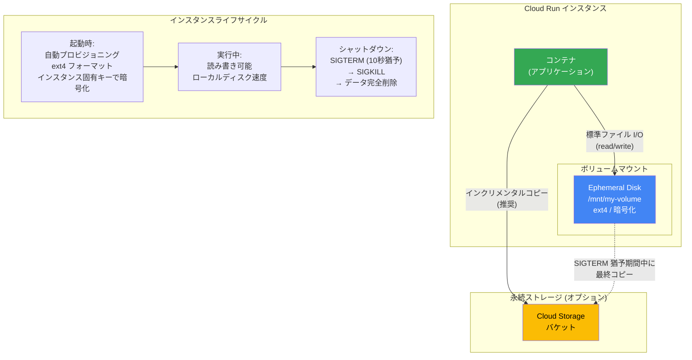

# Cloud Run: Ephemeral Disk (エフェメラルディスク) ボリュームマウント機能が Preview に

**リリース日**: 2026-04-20

**サービス**: Cloud Run

**機能**: Ephemeral Disk ボリュームマウント

**ステータス**: Preview

[このアップデートのインフォグラフィックを見る](https://takech9203.github.io/google-cloud-news-summary/20260420-cloud-run-ephemeral-disk-preview.html)

## 概要

Cloud Run において、インスタンスの存続期間中のみ永続するエフェメラルディスク (ephemeral disk) をボリュームとしてマウントする機能が Preview として利用可能になりました。この機能は、Cloud Run のサービス、ジョブ、およびワーカープールの全リソースタイプで使用できます。

エフェメラルディスクは、必要なディスクサイズとマウントパスを指定するだけで、Cloud Run が自動的にディスクをプロビジョニングし、ext4 にフォーマットし、インスタンス固有のキーで暗号化して提供します。これにより、大容量データの一時処理やキャッシュ用途において、メモリに依存せずディスクベースのストレージを活用できるようになります。

この機能は、大規模なデータ処理ワークロードを Cloud Run で実行する開発者、Web サービスのレスポンスレイテンシを最適化したいエンジニア、および GPU ワークロードで大容量の一時ストレージを必要とする ML/AI エンジニアにとって有用な改善です。

**アップデート前の課題**

- Cloud Run で一時的なデータを保存するにはインメモリボリューム (tmpfs) を使用する必要があり、大容量データの処理ではメモリコストが増大していた
- 大きなファイルを処理する際、ファイル全体をメモリに保持するか、小さなチャンクに分割して処理する必要があった
- Cloud Storage FUSE によるボリュームマウントはネットワーク帯域に依存し、ローカルディスクと比較してレイテンシが高かった
- メモリの制約により、Cloud Run で処理できるデータセットのサイズに実質的な上限があった

**アップデート後の改善**

- 最大 10 GB (デフォルト、クォータ増加申請可能) のディスクベースの一時ストレージをインスタンスごとに利用可能になった
- メモリとは独立したストレージにより、大容量データの処理でメモリコストを削減可能になった
- ローカルディスクとして ext4 ファイルシステムを直接操作するため、既存のファイル I/O コードをそのまま利用可能
- インスタンスごとに最大 10 ボリュームまでマウント可能で、用途別にストレージを分離できるようになった

## アーキテクチャ図



Cloud Run エフェメラルディスクは、インスタンスの起動時に自動プロビジョニングされ、シャットダウン時にデータが完全に削除されます。必要に応じて、実行中に Cloud Storage などの永続ストレージへインクリメンタルにデータをコピーすることが推奨されます。

## サービスアップデートの詳細

### 主要機能

1. **自動プロビジョニングと暗号化**
   - ディスクは起動時に自動的にプロビジョニングされ、ext4 ファイルシステムにフォーマットされる
   - インスタンス固有のキーで暗号化され、セキュリティを確保
   - 追加のセットアップやディスク管理が不要

2. **全リソースタイプでの利用**
   - Cloud Run サービス (services)、ジョブ (jobs)、ワーカープール (worker pools) の全タイプで使用可能
   - サービスではインスタンスクラッシュ、スケーリング、トラフィック移行時にデータ削除
   - ジョブではインスタンスクラッシュ、タスク完了時にデータ削除

3. **SIGTERM シグナルによるグレースフルシャットダウン**
   - シャットダウン前に 10 秒間の猶予期間 (SIGTERM から SIGKILL まで) が提供される
   - この猶予期間を利用して永続ストレージへの最終コピーなどのクリーンアップ処理が可能

4. **マルチコンテナ対応**
   - 複数コンテナ構成 (サイドカーパターン) でもボリュームを共有可能
   - コンテナごとに異なるマウントパスを指定可能

## 技術仕様

### ストレージとクォータ

| 項目 | デフォルト値 | 備考 |
|------|-------------|------|
| インスタンスあたりのストレージ上限 | 10 GB | クォータ増加申請可能 |
| インスタンスあたりのボリューム数上限 | 10 | - |
| プロジェクトあたりのリージョン上限 | 100 GB | クォータ増加申請可能 |
| 最小ディスクサイズ | 10 Gi | ephemeral-disk タイプの最小値 |
| ファイルシステム | ext4 | 自動フォーマット |
| 暗号化 | インスタンス固有キー | 自動適用 |

### 必要な IAM ロール

| ロール | 説明 |
|--------|------|
| `roles/run.developer` | Cloud Run Developer - リソースの構成に必要 |
| `roles/iam.serviceAccountUser` | Service Account User - サービス ID に対して必要 |

### 実行環境の要件

エフェメラルディスクは第 2 世代実行環境 (gen2) でのみ利用可能です。Cloud Run ジョブおよびワーカープールはデフォルトで第 2 世代実行環境を使用しますが、サービスでは明示的に `--execution-environment=gen2` を指定する必要がある場合があります。

## 設定方法

### 前提条件

1. gcloud CLI がインストールおよび初期化されていること
2. `gcloud components update` でコンポーネントが最新であること
3. 対象リソースに対する Cloud Run Developer ロールと Service Account User ロールが付与されていること

### 手順

#### ステップ 1: サービスにエフェメラルディスクを追加 (gcloud CLI)

```bash
gcloud beta run services update SERVICE \
  --execution-environment=gen2 \
  --add-volume=name=VOLUME_NAME,type=ephemeral-disk,size=SIZE \
  --add-volume-mount=volume=VOLUME_NAME,mount-path=MOUNT_PATH
```

`SERVICE` はサービス名、`VOLUME_NAME` はボリューム名 (任意の名前)、`SIZE` はディスクサイズ (例: `100Gi`、最小 `10Gi`)、`MOUNT_PATH` はマウントパス (例: `/mnt/my-volume`) に置き換えます。

#### ステップ 2: ジョブにエフェメラルディスクを追加 (gcloud CLI)

```bash
gcloud beta run jobs update JOB \
  --add-volume=name=VOLUME_NAME,type=ephemeral-disk,size=SIZE \
  --add-volume-mount=volume=VOLUME_NAME,mount-path=MOUNT_PATH
```

#### ステップ 3: ワーカープールにエフェメラルディスクを追加 (gcloud CLI)

```bash
gcloud beta run worker-pools update WORKERPOOL \
  --add-volume=name=VOLUME_NAME,type=ephemeral-disk,size=SIZE \
  --add-volume-mount=volume=VOLUME_NAME,mount-path=MOUNT_PATH
```

#### ステップ 4: Terraform での設定 (サービスの場合)

```hcl
resource "google_cloud_run_v2_service" "default" {
  name             = "SERVICE"
  location         = "REGION"
  launch_stage     = "BETA"
  deletion_protection = "true"
  ingress          = "INGRESS_TRAFFIC_ALL"

  template {
    containers {
      image = "IMAGE_URL"
      volume_mounts {
        name       = "VOLUME_NAME"
        mount_path = "MOUNT_PATH"
      }
    }
    volumes {
      name = "VOLUME_NAME"
      empty_dir {
        medium     = "DISK"
        size_limit = "SIZE"
      }
    }
  }

  lifecycle {
    ignore_changes = [launch_stage]
  }
}
```

#### ステップ 5: アプリケーションからの読み書き

マウントされたボリュームは標準のファイル I/O で操作可能です。

```python
# Python の例: /mnt/my-volume に書き込み
f = open("/mnt/my-volume/sample-logfile.txt", "a")
f.write("Hello from ephemeral disk!")
f.close()
```

```javascript
// Node.js の例: /mnt/my-volume に書き込み
var fs = require('fs');
fs.appendFileSync('/mnt/my-volume/sample-logfile.txt', 'Hello logs!', { flag: 'a+' });
```

```go
// Go の例: /mnt/my-volume にファイルを作成
f, err := os.Create("/mnt/my-volume/sample-logfile.txt")
```

## メリット

### ビジネス面

- **コスト最適化**: 大容量データの一時処理において、高価なメモリではなくディスクベースのストレージを使用することでコストを削減可能
- **処理可能なデータ規模の拡大**: メモリ上限に縛られず、より大きなデータセットを Cloud Run 上で処理できるようになり、ワークロードの適用範囲が拡大

### 技術面

- **シンプルな統合**: 標準的なファイルシステム操作でアクセスできるため、既存のアプリケーションコードの変更が最小限で済む
- **自動暗号化**: インスタンス固有のキーによる暗号化が自動適用され、追加のセキュリティ設定が不要
- **レイテンシの改善**: リモートストレージへのネットワークアクセスと比較して、ローカルディスクアクセスにより低レイテンシなデータ操作を実現
- **柔軟なボリューム構成**: 最大 10 ボリュームまで異なるマウントポイントに配置でき、用途に応じた論理的な分離が可能

## デメリット・制約事項

### 制限事項

- Preview ステータスのため、SLA の対象外であり、本番ワークロードでの使用は自己責任
- 第 2 世代実行環境 (gen2) でのみ利用可能
- 利用可能リージョンが限定されている (非 GPU ワークロードの場合は 8 リージョン)
- `/dev`、`/proc`、`/sys` およびそのサブディレクトリへのマウントは不可
- インスタンスシャットダウン時にデータは完全に削除され、復旧不可
- Cloud Run ジョブでは Live Migration がサポートされないため、長時間実行ジョブの信頼性に影響する可能性がある

### 考慮すべき点

- データの永続化が必要な場合は、Cloud Storage 等への定期的なバックアップ戦略が必須
- SIGTERM から SIGKILL までの 10 秒間の猶予に依存した最終コピーは推奨されず、インクリメンタルコピーの実装が推奨される
- ネットワーク経由で大量データをエフェメラルディスクにダウンロードする場合、Direct VPC の設定により転送速度を改善することが推奨される
- プロビジョニングされたディスクの全サイズとインスタンスの存続期間が課金対象となる

## ユースケース

### ユースケース 1: 大規模データファイルの処理

**シナリオ**: Cloud Run ジョブで数 GB の CSV/Parquet ファイルを Cloud Storage からダウンロードし、変換処理を行った後、結果を BigQuery にロードする ETL パイプライン。

**実装例**:
```bash
# ジョブにエフェメラルディスクを追加
gcloud beta run jobs update etl-pipeline \
  --add-volume=name=work-disk,type=ephemeral-disk,size=50Gi \
  --add-volume-mount=volume=work-disk,mount-path=/mnt/work

# アプリケーション内でのファイル処理
# 1. Cloud Storage から /mnt/work/input/ にダウンロード
# 2. /mnt/work/output/ に変換結果を書き出し
# 3. BigQuery にロード
```

**効果**: 従来はメモリに全データを保持する必要があったが、ディスクに一時保存することでメモリ使用量を大幅に削減。より大きなデータセットの処理が可能になり、メモリリソースのコストも低減。

### ユースケース 2: Web アプリケーションのディスクキャッシュ

**シナリオ**: Cloud Run サービスで動作する Web アプリケーションにおいて、頻繁にアクセスされるデータ (画像のサムネイル、API レスポンスのキャッシュなど) をローカルディスクにキャッシュし、レスポンスレイテンシを改善する。

**実装例**:
```bash
gcloud beta run services update web-app \
  --execution-environment=gen2 \
  --add-volume=name=cache-disk,type=ephemeral-disk,size=10Gi \
  --add-volume-mount=volume=cache-disk,mount-path=/mnt/cache
```

**効果**: リモートストレージへの毎回のアクセスを回避し、ローカルディスクからの高速なデータ読み出しにより、エンドユーザーへのレスポンス時間を短縮。

### ユースケース 3: ML モデルの推論用一時ストレージ

**シナリオ**: GPU 対応の Cloud Run サービスで ML モデルの推論を行う際、大容量のモデルファイルやバッチ入力データの一時保存に使用する。

**効果**: GPU メモリに加えてディスクベースの一時ストレージを活用することで、大規模なモデルファイルのロードやバッチ入力データのステージングが効率的に行える。

## 料金

Cloud Run エフェメラルディスクの料金は、プロビジョニングされたディスクの全サイズとインスタンスの存続期間に基づいて計算されます。詳細な料金体系については、Cloud Run の料金ページを参照してください。

## 利用可能リージョン

### 非 GPU ワークロード

| リージョン | ロケーション |
|-----------|-------------|
| asia-northeast1 | 東京 |
| europe-west1 | ベルギー (Low CO2) |
| northamerica-northeast1 | モントリオール (Low CO2) |
| northamerica-northeast2 | トロント (Low CO2) |
| us-central1 | アイオワ (Low CO2) |
| us-east1 | サウスカロライナ |
| us-east4 | 北バージニア |
| us-west1 | オレゴン (Low CO2) |

### GPU ワークロード

GPU を使用する場合、エフェメラルディスクは Cloud Run GPU がサポートする全リージョンで利用可能です。

## 関連サービス・機能

- **Cloud Run インメモリボリューム (tmpfs)**: メモリベースの一時ストレージ。小容量・高速アクセスが必要な場合に適しているが、メモリリソースを消費する
- **Cloud Storage FUSE ボリュームマウント**: Cloud Storage バケットをファイルシステムとしてマウント。永続的なストレージが必要な場合に適しているが、ネットワークレイテンシの影響を受ける
- **Cloud Run NFS ボリュームマウント**: NFS サーバーをマウント。複数インスタンス間でのデータ共有が必要な場合に適している
- **Cloud Run 第 2 世代実行環境 (gen2)**: エフェメラルディスクの前提条件となる実行環境。フル Linux 互換性を提供

## 参考リンク

- [インフォグラフィック](https://takech9203.github.io/google-cloud-news-summary/20260420-cloud-run-ephemeral-disk-preview.html)
- [公式リリースノート](https://docs.cloud.google.com/release-notes#April_20_2026)
- [ドキュメント - サービス向けエフェメラルディスク](https://docs.cloud.google.com/run/docs/configuring/services/ephemeral-disk)
- [ドキュメント - ジョブ向けエフェメラルディスク](https://docs.cloud.google.com/run/docs/configuring/jobs/ephemeral-disk)
- [ドキュメント - ワーカープール向けエフェメラルディスク](https://docs.cloud.google.com/run/docs/configuring/workerpools/ephemeral-disk)
- [Cloud Run 料金ページ](https://cloud.google.com/run/pricing)

## まとめ

Cloud Run エフェメラルディスクの Preview リリースにより、サーバーレスコンテナ環境における一時ストレージの選択肢が大きく広がりました。従来はメモリベースの tmpfs か外部ストレージサービスへのネットワークアクセスに限られていた一時データの保存が、ローカルディスクベースで効率的に行えるようになります。大規模データ処理、キャッシュ、ML ワークロードなど幅広い用途に対応するこの機能は、Cloud Run の適用領域を大幅に拡大するものです。Preview 段階のため本番環境への適用は慎重に判断しつつ、開発・テスト環境での検証を開始することを推奨します。

---

**タグ**: #CloudRun #EphemeralDisk #VolumeMount #Preview #ストレージ #サーバーレス #コンテナ #gen2
