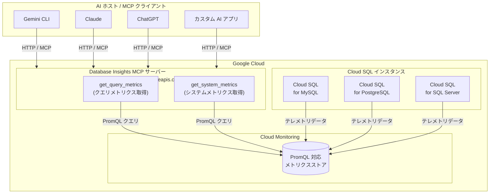

# Cloud SQL: Database Insights リモート MCP サーバーが GA (一般提供)

**リリース日**: 2026-04-20

**サービス**: Cloud SQL (MySQL, PostgreSQL, SQL Server)

**機能**: Database Insights リモート MCP サーバーによるパフォーマンス・システムメトリクス分析

**ステータス**: GA

[このアップデートのインフォグラフィックを見る](https://takech9203.github.io/google-cloud-news-summary/20260420-cloud-sql-database-insights-mcp-server-ga.html)

## 概要

Cloud SQL の Database Insights リモート MCP サーバーが一般提供 (GA) となりました。このサーバーは、Cloud SQL for MySQL、Cloud SQL for PostgreSQL、Cloud SQL for SQL Server の全 3 エンジンに対応しており、AI アプリケーションや LLM エージェントから Cloud SQL インスタンスのパフォーマンスメトリクスおよびシステムメトリクスを PromQL ベースで照会・分析する機能を提供します。

Database Insights MCP サーバーは、Google のインフラストラクチャ上でホストされるリモート MCP サーバーとして `https://databaseinsights.googleapis.com/mcp` エンドポイントで提供されます。MCP (Model Context Protocol) は AI アプリケーションが外部データソースに標準化された方法で接続するためのオープンプロトコルです。このサーバーにより、Gemini CLI、Claude、ChatGPT などの AI プラットフォームから自然言語でデータベースのパフォーマンス状況を問い合わせたり、システムの健全性を確認したりできるようになります。

このアップデートは、Cloud SQL のオブザーバビリティ (可観測性) を AI 駆動のワークフローに統合したいデータベース管理者 (DBA) やサイトリライアビリティエンジニア (SRE) にとって重要な機能強化です。既存の Query Insights ダッシュボードに加え、MCP プロトコルを介したプログラマティックかつ会話型のメトリクスアクセスが本番グレードで利用可能になりました。

**アップデート前の課題**

- Cloud SQL のパフォーマンスメトリクスやシステムメトリクスを確認するには、Google Cloud Console の Query Insights ダッシュボードや Cloud Monitoring を直接操作する必要があった
- AI アプリケーションや LLM エージェントからデータベースのパフォーマンスデータにアクセスするには、Cloud Monitoring API を個別に呼び出す独自の連携コードが必要だった
- Database Insights MCP サーバーはプレビュー段階であり、本番環境での使用に SLA が適用されず、サポートも限定的だった

**アップデート後の改善**

- AI アプリケーションから MCP プロトコル経由で、自然言語を使ったデータベースパフォーマンスの照会・分析が可能になった
- GA リリースにより SLA が適用され、本番ワークロードでの利用が正式にサポートされた
- MySQL、PostgreSQL、SQL Server の全 3 エンジンで統一的なメトリクスアクセスが利用可能になった

## アーキテクチャ図



Database Insights MCP サーバーは Cloud Monitoring に蓄積された Cloud SQL のメトリクスデータに PromQL でアクセスする中間層として機能し、AI アプリケーションからの自然言語によるパフォーマンス分析を可能にします。

## サービスアップデートの詳細

### 主要機能

1. **get_query_metrics ツール (MySQL / PostgreSQL)**
   - Cloud SQL インスタンスのクエリ関連テレメトリデータを PromQL クエリで取得
   - Cloud Monitoring からクエリパフォーマンスメトリクスを照会
   - クエリ負荷、実行時間、待機イベントなどの分析に活用可能
   - 時間範囲の指定 (startTime / endTime) に対応

2. **get_system_metrics ツール (MySQL / PostgreSQL / SQL Server)**
   - Cloud SQL インスタンスのシステム関連テレメトリデータを PromQL クエリで取得
   - CPU 使用率、メモリ使用量、ディスク I/O、ネットワークスループットなどのシステムメトリクスを照会
   - インスタンスの健全性監視やキャパシティプランニングに活用可能
   - 全 3 データベースエンジン (MySQL、PostgreSQL、SQL Server) で利用可能

3. **PromQL ベースの柔軟なクエリ**
   - Cloud Monitoring の PromQL (Prometheus Query Language) 互換クエリ言語を使用
   - 集計、フィルタリング、時系列計算などの高度なメトリクス分析が可能
   - 既存の Prometheus / Grafana エコシステムの知識を活用可能

## 技術仕様

### MCP ツール比較

| ツール | MySQL | PostgreSQL | SQL Server | 説明 |
|--------|:-----:|:----------:|:----------:|------|
| get_query_metrics | 対応 | 対応 | 非対応 | クエリ関連テレメトリデータの取得 |
| get_system_metrics | 対応 | 対応 | 対応 | システム関連テレメトリデータの取得 |

### MCP サーバー接続情報

| 項目 | 詳細 |
|------|------|
| サーバー URL | `https://databaseinsights.googleapis.com/mcp` |
| トランスポート | HTTP (Streamable HTTP) |
| 認証 | OAuth 2.0 + IAM |
| プロトコル | JSON-RPC 2.0 |

### get_query_metrics 入力スキーマ

```json
{
  "parent": "projects/{project}/locations/{location}",
  "resource": "{project_id}",
  "promqlQuery": "{PromQL クエリ文字列}",
  "startTime": "2026-04-20T00:00:00Z",
  "endTime": "2026-04-20T23:59:59Z"
}
```

| パラメータ | 必須 | 説明 |
|-----------|:----:|------|
| parent | 必須 | メトリクスをリクエストするロケーション名 (形式: `projects/{project}/locations/{location}`) |
| resource | 必須 | メトリクスのリソース名 (プロジェクト ID) |
| promqlQuery | 必須 | メトリクス取得用の PromQL クエリ |
| startTime | 任意 | メトリクスの開始時刻 (RFC3339 形式) |
| endTime | 任意 | メトリクスの終了時刻 (RFC3339 形式) |

### get_system_metrics 入力スキーマ

```json
{
  "parent": "projects/{project}/locations/{location}",
  "resource": "{project_id}",
  "promqlQuery": "{PromQL クエリ文字列}",
  "startTime": "2026-04-20T00:00:00Z",
  "endTime": "2026-04-20T23:59:59Z"
}
```

パラメータは get_query_metrics と同一です。

### ツールアノテーション

| 属性 | 値 |
|------|-----|
| Destructive Hint | No |
| Idempotent Hint | Yes |
| Read Only Hint | Yes |
| Open World Hint | No |

両ツールとも読み取り専用であり、データベースインスタンスに対する変更を行いません。

## 設定方法

### 前提条件

1. Google Cloud プロジェクトが作成済みであること
2. Cloud SQL API (MySQL、PostgreSQL、または SQL Server) が有効化されていること
3. MCP サーバーが有効化されていること ([MCP サーバーの有効化手順](https://docs.cloud.google.com/mcp/enable-disable-mcp-servers) を参照)
4. 適切な IAM 認証が設定されていること ([MCP 認証ガイド](https://docs.cloud.google.com/mcp/authenticate-mcp) を参照)

### 手順

#### ステップ 1: ツール一覧の確認

```bash
# Database Insights MCP サーバーで利用可能なツールを確認
curl --location 'https://databaseinsights.googleapis.com/mcp' \
  --header 'content-type: application/json' \
  --header 'accept: application/json, text/event-stream' \
  --data '{
    "method": "tools/list",
    "jsonrpc": "2.0",
    "id": 1
  }'
```

#### ステップ 2: Gemini CLI での設定

以下の内容でエクステンションファイルを作成します。

```json
{
  "name": "database-insights",
  "version": "1.0.0",
  "mcpServers": {
    "Database Insights MCP Server": {
      "httpUrl": "https://databaseinsights.googleapis.com/mcp",
      "authProviderType": "google_credentials",
      "oauth": {
        "scopes": ["https://www.googleapis.com/auth/cloud-platform"]
      },
      "timeout": 30000,
      "headers": {
        "x-goog-user-project": "PROJECT_ID"
      }
    }
  }
}
```

`PROJECT_ID` を実際のプロジェクト ID に置き換えてください。

#### ステップ 3: システムメトリクスの取得例

```bash
# get_system_metrics ツールの呼び出し
curl --location 'https://databaseinsights.googleapis.com/mcp' \
  --header 'content-type: application/json' \
  --header 'accept: application/json, text/event-stream' \
  --header "Authorization: Bearer $(gcloud auth print-access-token)" \
  --data '{
    "method": "tools/call",
    "params": {
      "name": "get_system_metrics",
      "arguments": {
        "parent": "projects/my-project/locations/us-central1",
        "resource": "my-project",
        "promqlQuery": "cloudsql_instance_cpu_utilization",
        "startTime": "2026-04-20T00:00:00Z",
        "endTime": "2026-04-20T23:59:59Z"
      }
    },
    "jsonrpc": "2.0",
    "id": 1
  }'
```

## メリット

### ビジネス面

- **インシデント対応の迅速化**: AI エージェントに「このインスタンスの過去 1 時間の CPU 使用率を教えて」と自然言語で質問するだけでパフォーマンスデータを即座に取得でき、障害対応時間を短縮
- **運用効率の向上**: データベースの定期的な健全性チェックを AI エージェントに委任し、異常の早期発見と報告を自動化
- **本番環境での信頼性**: GA リリースにより SLA が適用され、エンタープライズ要件を満たすサービス品質が保証される

### 技術面

- **PromQL の活用**: Prometheus 互換のクエリ言語により、柔軟で高度なメトリクス分析が可能。既存のオブザーバビリティスタックの知識を直接活用できる
- **読み取り専用の安全な設計**: 両ツールとも読み取り専用 (Read Only) であり、データベースインスタンスに一切の変更を加えない安全な操作
- **Cloud SQL MCP サーバーとの補完**: インスタンス管理用の Cloud SQL MCP サーバー (`sqladmin.googleapis.com/mcp`) と組み合わせることで、管理とオブザーバビリティの両面を AI から一元的に操作可能

## デメリット・制約事項

### 制限事項

- SQL Server では `get_query_metrics` ツールが利用できず、`get_system_metrics` のみ対応
- PromQL クエリの知識が必要であり、AI エージェントが適切なクエリを生成するにはプロンプト設計の工夫が求められる
- メトリクスの保持期間は Cloud SQL エディションに依存する (Enterprise: 7 日間、Enterprise Plus: 30 日間)

### 考慮すべき点

- Database Insights MCP サーバーは Cloud SQL MCP サーバー (`sqladmin.googleapis.com/mcp`) とは別のエンドポイントであり、両方を使用する場合はそれぞれの設定が必要
- Query Insights の Enterprise Plus エディション機能 (AI アシスト型トラブルシューティング、インデックスアドバイザー) を利用するには、Enterprise Plus へのアップグレードが必要
- Query Insights for Enterprise Plus edition はインスタンスに接続されたディスクにメトリクスデータを保存するため、ストレージ使用量の増加を考慮する必要がある (MySQL の場合、7 日分で約 45 GB、30 日分で約 180 GB)

## ユースケース

### ユースケース 1: AI 駆動のデータベースパフォーマンス監視

**シナリオ**: SRE チームが AI エージェントを活用して、Cloud SQL インスタンスの定期的なパフォーマンスチェックを自動化する。

**実装例**:
```text
プロンプト: 「本番 PostgreSQL インスタンスの過去 6 時間の CPU 使用率とクエリ負荷を分析して、
異常がないか確認してください」

AI エージェントの実行フロー:
1. get_system_metrics で CPU 使用率の時系列データを取得
2. get_query_metrics でクエリ負荷の時系列データを取得
3. メトリクスを分析し、異常なスパイクやトレンドを特定
4. 結果をサマリーとして報告
```

**効果**: 定期的なパフォーマンス監視を会話形式で実行でき、Cloud Monitoring ダッシュボードを手動で確認する工数を削減。異常検知の早期対応が可能になる。

### ユースケース 2: インシデント発生時の迅速なトリアージ

**シナリオ**: データベースのレスポンスタイムが急激に悪化した際に、AI エージェントを使って原因を迅速に切り分ける。

**効果**: Cloud Monitoring のダッシュボードを手動で探索する代わりに、自然言語で即座にシステムメトリクスとクエリメトリクスの相関分析を依頼でき、平均復旧時間 (MTTR) を短縮できる。

## 料金

Database Insights MCP サーバー自体の利用に追加料金は発生しません。Query Insights 機能は Cloud SQL Enterprise エディションおよび Enterprise Plus エディションの両方で追加料金なしで利用できます。

### 関連する料金要素

| 項目 | 料金 |
|------|------|
| Database Insights MCP サーバーへのアクセス | 無料 |
| Query Insights (Enterprise / Enterprise Plus) | Cloud SQL インスタンス料金に含む (追加料金なし) |
| Cloud Monitoring API リクエスト (Enterprise) | Cloud Monitoring の無料枠あり |
| ストレージ (Enterprise Plus) | インスタンスに接続されたディスクに保存。[通常のストレージ料金](https://cloud.google.com/sql/pricing) が適用 |

詳細な料金は [Cloud SQL の料金ページ](https://cloud.google.com/sql/pricing) を参照してください。

## 関連サービス・機能

- **Cloud SQL リモート MCP サーバー** (`sqladmin.googleapis.com/mcp`): インスタンスの作成、管理、SQL 実行などの操作を提供する MCP サーバー。Database Insights MCP サーバーと組み合わせることで、管理とオブザーバビリティの両面を AI から統合的に操作可能
- **Query Insights**: Cloud SQL Console 上のパフォーマンス診断ダッシュボード。クエリ負荷の可視化、問題のあるクエリの特定、クエリプランの分析を提供
- **Cloud Monitoring**: Google Cloud の統合モニタリングサービス。Database Insights MCP サーバーのバックエンドとしてメトリクスデータを格納
- **AlloyDB Database Insights MCP サーバー**: AlloyDB for PostgreSQL 向けの同等の Database Insights MCP サーバー。同じエンドポイント (`databaseinsights.googleapis.com/mcp`) を共有
- **Model Armor**: MCP ツール呼び出しとレスポンスに対するセキュリティスキャンを提供し、プロンプトインジェクションや機密データ漏洩を防止

## 参考リンク

- [インフォグラフィック](https://takech9203.github.io/google-cloud-news-summary/20260420-cloud-sql-database-insights-mcp-server-ga.html)
- [公式リリースノート](https://docs.cloud.google.com/release-notes#April_20_2026)
- [Cloud SQL for MySQL MCP リファレンス](https://docs.cloud.google.com/sql/docs/mysql/reference/mcp)
- [Cloud SQL for PostgreSQL MCP リファレンス](https://docs.cloud.google.com/sql/docs/postgres/reference/mcp)
- [Cloud SQL for SQL Server MCP リファレンス](https://docs.cloud.google.com/sql/docs/sqlserver/reference/mcp)
- [Database Insights MCP ツールリファレンス (MySQL)](https://docs.cloud.google.com/sql/docs/mysql/reference/mcp/databaseinsights/mcp)
- [Database Insights MCP ツールリファレンス (PostgreSQL)](https://docs.cloud.google.com/sql/docs/postgres/reference/mcp/databaseinsights/mcp)
- [Database Insights MCP ツールリファレンス (SQL Server)](https://docs.cloud.google.com/sql/docs/sqlserver/reference/mcp/databaseinsights/mcp)
- [Google Cloud MCP サーバー概要](https://docs.cloud.google.com/mcp/overview)
- [MCP 認証ガイド](https://docs.cloud.google.com/mcp/authenticate-mcp)
- [Cloud SQL 料金ページ](https://cloud.google.com/sql/pricing)

## まとめ

Cloud SQL の Database Insights リモート MCP サーバーの GA リリースにより、MySQL、PostgreSQL、SQL Server の全 3 エンジンのパフォーマンスおよびシステムメトリクスを AI アプリケーションから PromQL ベースで照会・分析できるようになりました。既に GA となっている Cloud SQL リモート MCP サーバー (インスタンス管理用) と組み合わせることで、データベースの管理からオブザーバビリティまでを AI 駆動のワークフローに統合できます。Cloud SQL を運用している組織は、まず Gemini CLI や Claude などの AI ツールに Database Insights MCP サーバーを接続し、日常的なパフォーマンス監視やインシデント対応への活用を検討することを推奨します。

---

**タグ**: #CloudSQL #DatabaseInsights #MCP #ModelContextProtocol #GA #MySQL #PostgreSQL #SQLServer #オブザーバビリティ #パフォーマンス監視 #PromQL #AI
