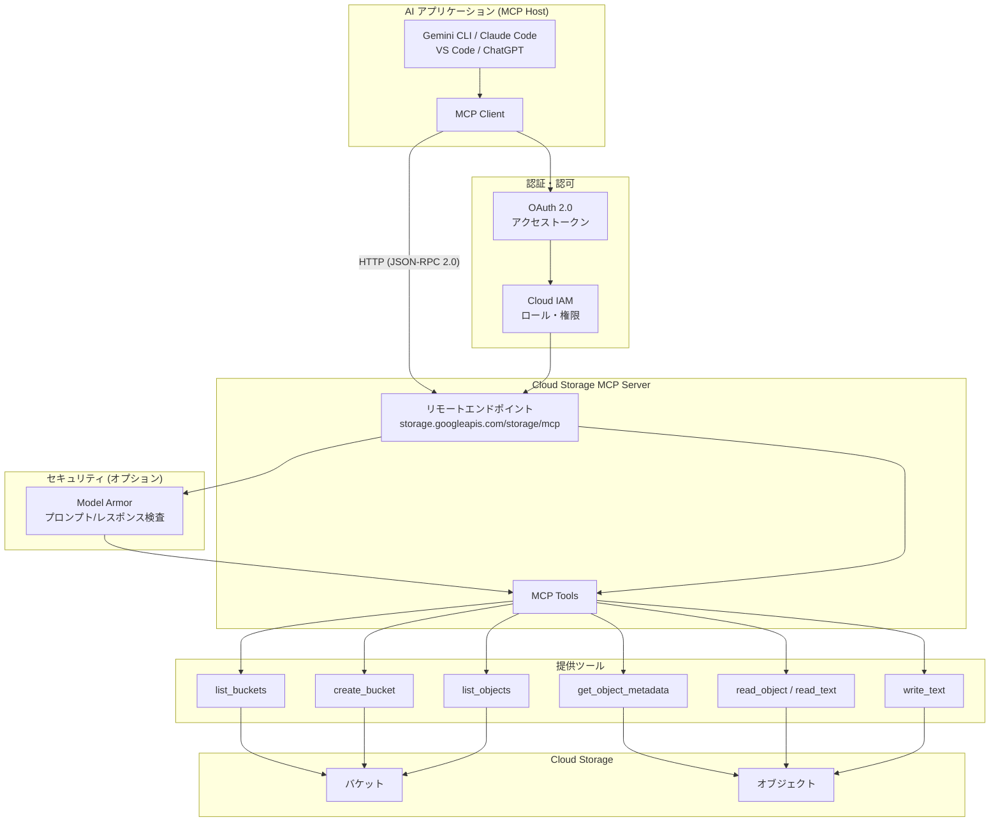

# Cloud Storage: Model Context Protocol (MCP) Server が一般提供開始

**リリース日**: 2026-04-20

**サービス**: Cloud Storage

**機能**: Cloud Storage MCP Server の一般提供 (GA)

**ステータス**: GA (一般提供)

[このアップデートのインフォグラフィックを見る](https://takech9203.github.io/google-cloud-news-summary/20260420-cloud-storage-mcp-server-ga.html)

## 概要

Cloud Storage の Model Context Protocol (MCP) サーバーが一般提供 (GA) となりました。MCP は Anthropic が開発したオープンソースプロトコルであり、AI アプリケーションが外部データソースに接続する方法を標準化するものです。この MCP サーバーを利用することで、Gemini CLI、Claude Code、ChatGPT、Visual Studio Code などの AI アプリケーションやエージェントから、自然言語を通じて Cloud Storage のバケットやオブジェクトを直接操作できるようになります。

Cloud Storage MCP サーバーはリモート MCP サーバーとして提供され、エンドポイント `https://storage.googleapis.com/storage/mcp` を通じて HTTP で通信します。Cloud Storage API を有効化すると自動的に MCP サーバーも利用可能になるため、追加のインフラ構築は不要です。OAuth 2.0 と IAM による認証・認可に対応し、Model Armor によるセキュリティスキャンもオプションで利用できます。

このアップデートは、AI エージェントを活用したワークフロー自動化やデータ管理を行う開発者、データエンジニア、および AI アプリケーション開発者にとって重要な機能追加です。

**アップデート前の課題**

- AI アプリケーションから Cloud Storage を操作するには、REST API や クライアントライブラリを使った明示的なコード実装が必要だった
- AI エージェントがストレージリソースにアクセスするための標準化されたインターフェースが存在しなかった
- エージェントが自然言語の指示に基づいてバケットの作成やオブジェクトの読み書きを行うには、カスタムツールの開発が必要だった

**アップデート後の改善**

- MCP プロトコルを通じて、AI アプリケーションから標準化された方法で Cloud Storage を操作可能になった
- 自然言語による指示で、バケットの作成・一覧取得、オブジェクトの読み書き・メタデータ取得が行える
- リモート MCP サーバーとして Google が管理するインフラ上で稼働するため、自前でサーバーを構築・運用する必要がない

## アーキテクチャ図



AI アプリケーションが MCP クライアントを通じて Cloud Storage MCP サーバーのリモートエンドポイントに接続し、OAuth 2.0 と IAM による認証・認可を経て、7 種類の MCP ツールを使用して Cloud Storage のバケットとオブジェクトを操作します。

## サービスアップデートの詳細

### 主要機能

1. **バケット管理ツール**
   - `list_buckets`: プロジェクト内のバケット一覧をアルファベット順で取得
   - `create_bucket`: プロジェクト内に新しいバケットを作成

2. **オブジェクト操作ツール**
   - `list_objects`: バケット内のオブジェクト一覧を取得
   - `get_object_metadata`: オブジェクトのメタデータ (サイズ、作成日、コンテンツタイプなど) を取得
   - `read_object`: バイナリファイル (画像、PDF、ZIP アーカイブなど) を読み取り。テキストファイルには `read_text` を推奨
   - `read_text`: テキスト形式のオブジェクト内容を読み取り (トークン消費が少ない)
   - `write_text`: テキストコンテンツをオブジェクトに書き込み (既存コンテンツは上書き)

3. **リモート MCP サーバーアーキテクチャ**
   - Google が管理するリモートサーバーとして稼働し、HTTP エンドポイント経由でアクセス
   - JSON-RPC 2.0 プロトコルによる標準化された通信
   - Cloud Storage API を有効にするだけで自動的に MCP サーバーも有効化
   - ローカル MCP サーバー (stdio ベース) も GitHub リポジトリで別途提供

## 技術仕様

### MCP サーバー接続情報

| 項目 | 詳細 |
|------|------|
| サーバー名 | Cloud Storage MCP server |
| エンドポイント URL | `https://storage.googleapis.com/storage/mcp` |
| トランスポート | HTTP |
| プロトコル | JSON-RPC 2.0 |
| 認証方式 | OAuth 2.0 + IAM |

### MCP ツール一覧と特性

| ツール名 | 操作 | Read-only | Idempotent | Destructive |
|----------|------|-----------|------------|-------------|
| `list_buckets` | バケット一覧取得 | Yes | Yes | No |
| `create_bucket` | バケット作成 | No | Yes | No |
| `list_objects` | オブジェクト一覧取得 | Yes | Yes | No |
| `get_object_metadata` | メタデータ取得 | Yes | Yes | No |
| `read_object` | バイナリ読み取り | Yes | Yes | No |
| `read_text` | テキスト読み取り | Yes | Yes | No |
| `write_text` | テキスト書き込み | No | Yes | No |

### 制限事項

| 項目 | 制限値 |
|------|--------|
| 読み取り対象ファイル形式 | テキスト、PDF、画像ファイル |
| 書き込み対象ファイル形式 | テキストファイルのみ |
| 読み取り/書き込み最大サイズ | 8 MiB |
| エンドポイント | グローバルエンドポイントのみ |

### 必要な IAM ロール

| IAM ロール | 用途 |
|-----------|------|
| `roles/mcp.toolUser` | MCP ツール呼び出しの実行 |
| `roles/storage.objectViewer` | オブジェクトの一覧表示、読み取り、メタデータ取得 |
| `roles/storage.objectCreator` | オブジェクトへのコンテンツ書き込み |
| `roles/storage.admin` | バケットの作成・一覧表示 |

### OAuth スコープ

| スコープ URI | 説明 |
|-------------|------|
| `https://www.googleapis.com/auth/storage.read-only` | データの読み取りのみを許可 |
| `https://www.googleapis.com/auth/storage.read-write` | データの読み取りおよび変更を許可 |

## 設定方法

### 前提条件

1. Google Cloud プロジェクトで Cloud Storage API が有効化されていること
2. 適切な IAM ロール (`roles/mcp.toolUser` および必要なストレージロール) が付与されていること
3. MCP クライアントに対応した AI アプリケーション (Gemini CLI、Claude Code、VS Code、ChatGPT など) を使用すること

### 手順

#### ステップ 1: MCP ツール一覧の確認

```bash
curl --location 'https://storage.googleapis.com/storage/mcp' \
  --header 'content-type: application/json' \
  --header 'accept: application/json, text/event-stream' \
  --data '{
    "method": "tools/list",
    "jsonrpc": "2.0",
    "id": 1
  }'
```

`tools/list` メソッドは認証不要で実行でき、利用可能なツールとそのスキーマを確認できます。

#### ステップ 2: AI アプリケーションでの MCP サーバー設定

AI アプリケーションの MCP サーバー設定で以下の情報を入力します。

```json
{
  "mcpServers": {
    "cloud-storage": {
      "url": "https://storage.googleapis.com/storage/mcp",
      "transport": "http",
      "auth": {
        "type": "oauth2",
        "scope": "https://www.googleapis.com/auth/storage.read-write"
      }
    }
  }
}
```

具体的な設定方法は AI アプリケーションごとに異なります。公式ドキュメントで [Claude.ai](https://docs.cloud.google.com/mcp/configure-mcp-ai-application#claude-ai)、[Gemini CLI](https://docs.cloud.google.com/mcp/configure-mcp-ai-application#gemini-cli)、[ChatGPT](https://docs.cloud.google.com/mcp/configure-mcp-ai-application#chatgpt)、[Visual Studio Code](https://docs.cloud.google.com/mcp/configure-mcp-ai-application#vscode) 向けのガイドを参照してください。

#### ステップ 3: MCP ツールの呼び出し

```bash
curl --location 'https://storage.googleapis.com/storage/mcp' \
  --header 'content-type: application/json' \
  --header 'accept: application/json, text/event-stream' \
  --header 'Authorization: Bearer OAUTH2_TOKEN' \
  --data '{
    "jsonrpc": "2.0",
    "method": "tools/call",
    "id": "123e4567-e89b-12d3-a456-426614174000",
    "params": {
      "name": "list_buckets",
      "arguments": {
        "projectId": "my-project"
      }
    }
  }'
```

認証済みのリクエストを送信して、プロジェクト内のバケット一覧を取得する例です。

## メリット

### ビジネス面

- **AI エージェントによる業務自動化の加速**: マーケティングチームが自然言語で「商品画像バケットからアセットを取得し、キャンペーン用バケットを作成して保存」といった指示を AI エージェントに出すことで、手作業を大幅に削減できる
- **開発コストの削減**: カスタムツールの開発が不要になり、標準化された MCP プロトコルを通じて即座に Cloud Storage 連携を実現できる
- **セキュリティとガバナンスの強化**: IAM による細粒度のアクセス制御と Model Armor によるプロンプト/レスポンスの検査機能により、エンタープライズレベルのセキュリティ要件に対応

### 技術面

- **標準化されたプロトコル**: MCP プロトコルに準拠しているため、MCP 対応の任意の AI アプリケーションから統一的に利用可能
- **インフラ管理不要**: Google が管理するリモートサーバーとして稼働するため、サーバーの構築・運用・スケーリングが不要
- **柔軟な認証**: OAuth 2.0 に対応し、Google Cloud 認証情報、OAuth クライアント ID/シークレット、エージェントアイデンティティなど複数の認証方式を選択可能
- **監査ログの一元化**: Cloud Audit Logs との統合により、MCP ツール呼び出しの監査証跡を自動的に記録

## デメリット・制約事項

### 制限事項

- 読み取り操作はテキスト、PDF、画像ファイルに制限されており、その他のバイナリ形式 (動画、音声など) のコンテンツ分析はサポートされていない
- 書き込み操作はテキストファイルのみに制限されており、バイナリファイルの書き込みはできない
- 読み取り・書き込みの最大ファイルサイズが 8 MiB に制限されている
- グローバルエンドポイントのみの提供であり、リージョナルエンドポイントは利用不可

### 考慮すべき点

- MCP サーバーの無効化には Cloud Storage API 自体の無効化が必要であり、MCP サーバーだけを個別に無効化することはできない
- エージェントに適切な IAM ロールを付与する際は、最小権限の原則に従い、不必要な権限を与えないよう注意が必要
- Model Armor を有効にする場合、リージョンによってはクロスリージョン呼び出しが発生し、レイテンシやデータレジデンシに影響する可能性がある
- エージェント用に専用の ID を作成し、アクセスの制御と監視を行うことが推奨されている

## ユースケース

### ユースケース 1: リテールのコンテンツ・キャンペーン管理

**シナリオ**: マーケティングチームの AI エージェントが、商品画像の管理やプロモーションキャンペーンのアセット作成を自動化する。

**実装例**:
```
プロンプト例:
「SKU-123 の商品リスティングを product-images バケットのアセットを使って作成し、
 campaign-q3-assets という新しいバケットを作成してバナー画像を保存して」

エージェントのワークフロー:
1. list_objects で product-images バケットから商品画像を検索
2. read_object で商品アセットを取得 (最大 8 MiB)
3. 商品リスティングのドラフトを生成
4. create_bucket で campaign-q3-assets バケットを作成
5. write_text でキャンペーンアセットを保存
```

**効果**: マーケティング担当者がコーディング不要で、自然言語の指示だけでストレージ操作を含むキャンペーン管理ワークフローを実行可能。

### ユースケース 2: 財務データ分析

**シナリオ**: ポートフォリオマネージャーが AI エージェントを使い、Cloud Storage に保存された財務レポートや決算説明会のトランスクリプトから洞察を得る。

**実装例**:
```
プロンプト例:
「ExampleCorp の最新の決算説明会の要点と、
 直近 3 回の財務レポートのセンチメントを比較して」

エージェントのワークフロー:
1. list_objects で earnings-calls/ExampleCorp/ から関連ファイルを特定
2. read_text で財務レポートの内容をダウンロード (最大 8 MiB/ファイル)
3. LLM でサマリー作成、センチメント比較、回答の合成
```

**効果**: 複数の財務ドキュメントを横断的に分析し、自然言語で質問するだけでインサイトを取得可能。

## 料金

Cloud Storage MCP サーバー自体の利用に追加料金は発生しません。ただし、MCP ツールを通じて実行される Cloud Storage のオペレーション (バケット作成、オブジェクト読み取り・書き込みなど) は、通常の Cloud Storage オペレーション料金が適用されます。

| 項目 | 料金 |
|------|------|
| MCP サーバー利用料 | 無料 (追加料金なし) |
| Cloud Storage オペレーション | 通常の [Cloud Storage 料金](https://cloud.google.com/storage/pricing) が適用 |
| Model Armor (オプション) | [Model Armor の料金](https://docs.cloud.google.com/model-armor/overview) が適用 |

## 関連サービス・機能

- **[Google Cloud MCP servers](https://docs.cloud.google.com/mcp/overview)**: Cloud Storage 以外にも、BigQuery、Pub/Sub など複数の Google Cloud サービスが MCP サーバーを提供。統一された MCP プロトコルでマルチサービス連携が可能
- **[Model Armor](https://docs.cloud.google.com/model-armor/overview)**: MCP ツール呼び出しとレスポンスのセキュリティスキャン機能。プロンプトインジェクションや機密データ漏洩のリスクを軽減
- **[Cloud IAM](https://docs.cloud.google.com/iam/docs/overview)**: MCP ツールへのアクセスを細粒度で制御。`roles/mcp.toolUser` ロールにより MCP ツール呼び出し権限を管理
- **[Cloud Audit Logs](https://docs.cloud.google.com/logging/docs/audit)**: MCP ツール呼び出しの監査証跡を自動記録し、コンプライアンス要件に対応
- **[Cloud Storage FUSE](https://docs.cloud.google.com/storage/docs/gcs-fuse)**: ファイルシステムインターフェースでの Cloud Storage アクセス。MCP サーバーとは異なるアプローチで同じストレージリソースにアクセス可能

## 参考リンク

- [このアップデートのインフォグラフィック](https://takech9203.github.io/google-cloud-news-summary/20260420-cloud-storage-mcp-server-ga.html)
- [公式リリースノート](https://docs.cloud.google.com/release-notes#April_20_2026)
- [Cloud Storage MCP サーバーの使用方法](https://docs.cloud.google.com/storage/docs/use-cloud-storage-mcp)
- [Cloud Storage MCP リファレンス](https://docs.cloud.google.com/storage/docs/reference/mcp)
- [Google Cloud MCP servers 概要](https://docs.cloud.google.com/mcp/overview)
- [Cloud Storage MCP GitHub リポジトリ](https://github.com/googleapis/gcloud-mcp/tree/main/packages/storage-mcp)
- [MCP クライアントの設定ガイド](https://docs.cloud.google.com/mcp/configure-mcp-ai-application)
- [Cloud Storage 料金](https://cloud.google.com/storage/pricing)

## まとめ

Cloud Storage MCP サーバーの GA リリースにより、AI アプリケーションやエージェントから標準化された MCP プロトコルを通じて Cloud Storage を直接操作できるようになりました。Google が管理するリモートサーバーとして提供されるため、インフラの構築・運用が不要であり、IAM と Model Armor によるエンタープライズレベルのセキュリティも確保されています。AI エージェントを活用したワークフロー自動化を検討している開発者は、まず既存の AI アプリケーション (Gemini CLI や Claude Code など) から MCP サーバーへの接続を設定し、バケット一覧取得やオブジェクト読み取りから試用を開始することを推奨します。

---

**タグ**: #CloudStorage #MCP #ModelContextProtocol #AI #エージェント #GA #一般提供 #OAuth #IAM #ModelArmor
