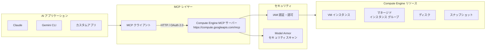

# Compute Engine: リモート MCP サーバーが一般提供開始

**リリース日**: 2026-04-20

**サービス**: Compute Engine

**機能**: リモート Model Context Protocol (MCP) サーバーの一般提供 (GA)

**ステータス**: GA (一般提供)

[このアップデートのインフォグラフィックを見る](https://takech9203.github.io/google-cloud-news-summary/20260420-compute-engine-remote-mcp-server-ga.html)

## 概要

Google Cloud は、Compute Engine リモート Model Context Protocol (MCP) サーバーの一般提供 (GA) を発表しました。このサーバーにより、AI エージェントや AI アプリケーションが標準化されたプロトコルを通じて Compute Engine リソースを直接管理できるようになります。対象リソースには、VM インスタンス、マネージド インスタンス グループ (MIG)、ディスク、スナップショットが含まれます。

MCP は Anthropic が開発したオープンソースプロトコルで、大規模言語モデル (LLM) や AI アプリケーションが外部データソースに接続する方法を標準化するものです。今回 GA となった Compute Engine リモート MCP サーバーは、Google Cloud のインフラストラクチャ上で動作し、HTTP エンドポイント (`https://compute.googleapis.com/mcp`) を通じて AI アプリケーションとの通信を提供します。

本機能は 2025 年 12 月 10 日にプレビューとして公開されており、約 4 ヶ月の検証期間を経て GA に昇格しました。Claude、Gemini CLI、ChatGPT などの主要な AI アプリケーションから接続可能で、インフラストラクチャ管理の自動化と効率化を実現します。

**アップデート前の課題**

- AI エージェントが Compute Engine リソースを管理するには、独自の API 統合やカスタムツールの開発が必要だった
- LLM アプリケーションとインフラストラクチャ管理の間に標準化されたインターフェースが存在せず、各ツールごとに個別の実装が必要だった
- インフラストラクチャ操作の自動化には gcloud CLI やクライアントライブラリを使ったスクリプト作成が必要で、自然言語による管理ができなかった
- MCP サーバーはプレビュー段階であり、本番環境での SLA 保証がなかった

**アップデート後の改善**

- AI エージェントが標準化された MCP プロトコルを通じて、自然言語で Compute Engine リソースを管理可能に
- IAM ベースのきめ細かい認可制御と OAuth 2.0 認証により、エンタープライズグレードのセキュリティを確保
- Model Armor との統合により、MCP ツール呼び出しとレスポンスのセキュリティスキャンが可能に
- GA となったことで本番環境での利用に適した SLA と信頼性が提供される

## アーキテクチャ図



AI アプリケーションが MCP クライアントを介してリモート MCP サーバーに接続し、IAM と Model Armor によるセキュリティ制御を経て Compute Engine リソースを操作するアーキテクチャです。

## サービスアップデートの詳細

### 主要機能

1. **VM インスタンスの管理**
   - インスタンスの一覧表示、詳細取得、作成、削除、起動、停止
   - マシンタイプの変更 (リサイズ)
   - アタッチされたディスクやアクセラレータの情報取得
   - GPU 付きの特殊な VM のプロビジョニング

2. **マネージド インスタンス グループ (MIG) の管理**
   - MIG の一覧表示と詳細取得
   - インスタンステンプレートの一覧表示とプロパティ取得
   - マネージドインスタンスの一覧表示と状態確認

3. **ディスクとスナップショットの管理**
   - ディスクの一覧表示、基本情報取得、パフォーマンス設定取得
   - スナップショットの管理と不要リソースのクリーンアップ
   - ソースディスクが存在しないスナップショットの特定

4. **リソース情報の照会**
   - 利用可能なマシンタイプの一覧表示
   - アクセラレータタイプの一覧表示
   - イメージの一覧表示
   - 予約とコミットメントの情報取得

## 技術仕様

### MCP サーバー接続情報

| 項目 | 詳細 |
|------|------|
| サーバー名 | Compute Engine MCP server |
| エンドポイント URL | `https://compute.googleapis.com/mcp` |
| トランスポート | HTTP |
| 認証方式 | OAuth 2.0 + IAM |
| MCP 仕様準拠 | MCP Authorization Specification |

### OAuth スコープ

| スコープ URI | 説明 |
|-------------|------|
| `https://www.googleapis.com/auth/compute.read-only` | データの読み取りのみを許可 |
| `https://www.googleapis.com/auth/compute.read-write` | データの読み取りと変更を許可 |

### 必要な IAM ロール

| ロール | 説明 |
|--------|------|
| `roles/mcp.toolUser` | MCP ツールの呼び出し権限 (必須) |
| Compute Engine 操作に必要なロール | 実行する操作に応じた Compute Engine の権限 |

## 設定方法

### 前提条件

1. Google Cloud プロジェクトで Compute Engine API が有効化されていること
2. MCP Tool User ロール (`roles/mcp.toolUser`) が付与されていること
3. 操作に必要な Compute Engine のロールと権限が付与されていること

### 手順

#### ステップ 1: IAM ロールの付与

```bash
# MCP Tool User ロールを付与
gcloud projects add-iam-policy-binding PROJECT_ID \
  --member="PRINCIPAL" \
  --role="roles/mcp.toolUser"
```

`PROJECT_ID` を Google Cloud プロジェクト ID に、`PRINCIPAL` を対象のプリンシパル識別子に置き換えてください。

#### ステップ 2: AI アプリケーションでの MCP サーバー設定 (Claude の例)

Claude Desktop や Claude Code などの MCP 対応クライアントで、以下の情報を設定します。

```json
{
  "mcpServers": {
    "compute-engine": {
      "url": "https://compute.googleapis.com/mcp",
      "transport": "http",
      "auth": {
        "type": "oauth2",
        "scopes": ["https://www.googleapis.com/auth/compute.read-write"]
      }
    }
  }
}
```

#### ステップ 3: AI アプリケーションでの MCP サーバー設定 (Gemini CLI の例)

```json
{
  "name": "compute_engine",
  "version": "1.0.0",
  "mcpServers": {
    "compute_engine_mcp": {
      "httpUrl": "https://compute.googleapis.com/mcp",
      "authProviderType": "google_credentials",
      "oauth": {
        "scopes": ["https://www.googleapis.com/auth/compute.read-write"]
      },
      "timeout": 30000,
      "headers": {
        "x-goog-user-project": "PROJECT_ID"
      }
    }
  }
}
```

上記を `~/.gemini/extensions/compute_engine/gemini-extension.json` に保存してください。

#### ステップ 4: MCP ツールの利用確認

```bash
# MCP サーバーのツール一覧を取得
curl --location 'https://compute.googleapis.com/mcp' \
  --header 'content-type: application/json' \
  --header 'accept: application/json, text/event-stream' \
  --data '{
    "method": "tools/list",
    "jsonrpc": "2.0",
    "id": 1
  }'
```

`tools/list` メソッドは認証不要で実行でき、利用可能なツールの一覧を取得できます。

## メリット

### ビジネス面

- **運用コストの削減**: AI エージェントが自然言語による指示でインフラストラクチャを管理できるため、手作業のスクリプト作成やコンソール操作が不要になり、運用工数を大幅に削減
- **不要リソースの自動特定**: ソースディスクが存在しないスナップショットや、停止中の GPU 付き VM など、コストの無駄を AI が自動的に特定・クリーンアップ
- **迅速な障害対応**: VM の設定確認、再起動、構成変更を自然言語で指示でき、トラブルシューティング時間を短縮

### 技術面

- **標準化されたインターフェース**: MCP プロトコルにより、異なる AI アプリケーションから同一のインターフェースで Compute Engine を操作可能
- **エンタープライズグレードのセキュリティ**: IAM による認証・認可、OAuth 2.0 スコープ、Model Armor によるセキュリティスキャンの多層防御
- **マルチクライアント対応**: Claude、Gemini CLI、ChatGPT、カスタムアプリケーションなど、MCP 対応の幅広い AI ツールから利用可能

## デメリット・制約事項

### 制限事項

- Compute Engine リモート MCP サーバーは完全なリージョン分離をサポートしておらず、MCP ツールへの呼び出しが任意のリージョンを経由する可能性がある
- Model Armor が有効な場合、Model Armor がサポートしていないリージョンからの呼び出しでは、ルーティング動作が異なる場合がある

### 考慮すべき点

- AI エージェントにインフラストラクチャ管理権限を付与するため、IAM ロールの設計と最小権限の原則の適用が重要
- エージェント用に専用のアイデンティティを作成し、アクセスの制御と監視を行うことが推奨される
- エージェントが過剰なツールでオーバーロードされないよう、Toolset 機能を活用して必要なツールのみを公開することが推奨される
- 破壊的な操作 (VM の削除、ディスクの削除など) に対しては、承認ワークフローやガードレールの設計が必要

## ユースケース

### ユースケース 1: 未使用リソースのクリーンアップによるコスト最適化

**シナリオ**: 大規模なプロジェクトで長期間にわたり蓄積された不要なリソース (停止中の GPU VM、ソースディスクが削除されたスナップショットなど) を特定し、削除する。

**プロンプト例**:
```
us-central1 リージョンで、ソースディスクが存在しないスナップショットをすべて見つけてください。
```
```
us-central1 リージョンで、NVIDIA Tesla T4 アクセラレータが付いた停止中の VM をすべて見つけて削除してください。
```

**効果**: 手動でのリソース棚卸しに比べ、数分でプロジェクト全体の不要リソースを特定・削除でき、クラウドコストを削減。

### ユースケース 2: AI ワークロード向け VM の柔軟なプロビジョニング

**シナリオ**: 特定のリージョン内で GPU が利用可能なゾーンを自動的に探索し、AI/ML ワークロード用の VM をプロビジョニングする。

**プロンプト例**:
```
us-central1 リージョンの利用可能なゾーンに、NVIDIA T4 アクセラレータ付きの VM を作成してください。VM 名は my-ml-training-vm としてください。
```

**効果**: GPU の在庫状況を手動で確認する必要がなく、AI がゾーンの可用性を自動判断して最適なゾーンにプロビジョニング。

### ユースケース 3: インスタンスのパフォーマンス最適化

**シナリオ**: パフォーマンス不足の VM を同一マシンファミリー内で次のサイズにリサイズし、オンライン復帰後に新しいマシンタイプを確認する。

**プロンプト例**:
```
my-app-server のマシンタイプを同じマシンファミリーの次に大きいマシンタイプに変更し、オンラインに復帰したら通知して、新しいマシンタイプを確認してください。
```

**効果**: VM のリサイズに必要な停止・変更・起動・確認の一連の操作を、一つの自然言語指示で自動実行。

## 料金

Compute Engine リモート MCP サーバー自体の追加料金は発生しません。MCP サーバーは Compute Engine API を有効化すると自動的に利用可能になります。ただし、MCP ツールを通じて作成・管理するリソース (VM インスタンス、ディスク、スナップショットなど) には通常の Compute Engine 料金が適用されます。

Model Armor を有効化する場合は、Model Armor の料金が別途発生する場合があります。

## 利用可能リージョン

Compute Engine リモート MCP サーバーはグローバルエンドポイント (`https://compute.googleapis.com/mcp`) として提供されており、Compute Engine が利用可能なすべてのリージョンのリソースを管理できます。ただし、完全なリージョン分離はサポートされておらず、MCP ツールへの呼び出しが任意のリージョンを経由する可能性がある点に注意が必要です。

## 関連サービス・機能

- **[Google Cloud MCP サーバー概要](https://docs.cloud.google.com/mcp/overview)**: BigQuery、Cloud Run、GKE、Cloud SQL など、Google Cloud の他のサービスでも同様のリモート MCP サーバーが提供されている
- **[Model Armor](https://docs.cloud.google.com/model-armor/overview)**: MCP ツール呼び出しとレスポンスのセキュリティスキャンを提供し、プロンプトインジェクションや機密データ漏洩を防止
- **[IAM](https://docs.cloud.google.com/iam/docs/overview)**: MCP ツールの利用を制御するためのきめ細かい認証・認可制御
- **[Cloud Run MCP サーバー](https://docs.cloud.google.com/run/docs/use-cloud-run-mcp)**: 同様に GA となった Cloud Run 向けリモート MCP サーバー
- **[Cloud SQL MCP サーバー](https://docs.cloud.google.com/sql/docs/mysql/use-cloudsql-mcp)**: データベース管理向けの MCP サーバー

## 参考リンク

- [インフォグラフィック](https://takech9203.github.io/google-cloud-news-summary/20260420-compute-engine-remote-mcp-server-ga.html)
- [公式リリースノート](https://docs.cloud.google.com/release-notes#April_20_2026)
- [Compute Engine MCP サーバーの使用](https://docs.cloud.google.com/compute/docs/use-compute-engine-mcp)
- [Compute Engine MCP リファレンス](https://docs.cloud.google.com/compute/docs/reference/mcp)
- [Compute Engine MCP ツール一覧](https://docs.cloud.google.com/compute/docs/reference/mcp/tools_overview)
- [Google Cloud MCP サーバー概要](https://docs.cloud.google.com/mcp/overview)
- [MCP 対応サポート製品一覧](https://docs.cloud.google.com/mcp/supported-products)
- [MCP サーバーへの認証](https://docs.cloud.google.com/mcp/authenticate-mcp)
- [AI アプリケーションでの MCP 設定](https://docs.cloud.google.com/mcp/configure-mcp-ai-application)

## まとめ

Compute Engine リモート MCP サーバーの GA は、AI エージェントによるクラウドインフラストラクチャ管理の新しい標準を確立する重要なマイルストーンです。2025 年 12 月のプレビュー提供から約 4 ヶ月を経て本番環境での利用が可能となり、Claude、Gemini CLI、ChatGPT などの AI アプリケーションから自然言語で Compute Engine リソースを管理できるようになりました。まずは読み取り専用スコープ (`compute.read-only`) で既存リソースの棚卸しや可視化から始め、IAM ロールの設計と Model Armor によるセキュリティ対策を整備した上で、段階的に書き込み操作を含む運用自動化に拡大することを推奨します。

---

**タグ**: #ComputeEngine #MCP #ModelContextProtocol #AIエージェント #インフラ自動化 #GA #GeminiCLI #Claude #セキュリティ #ModelArmor #IAM
