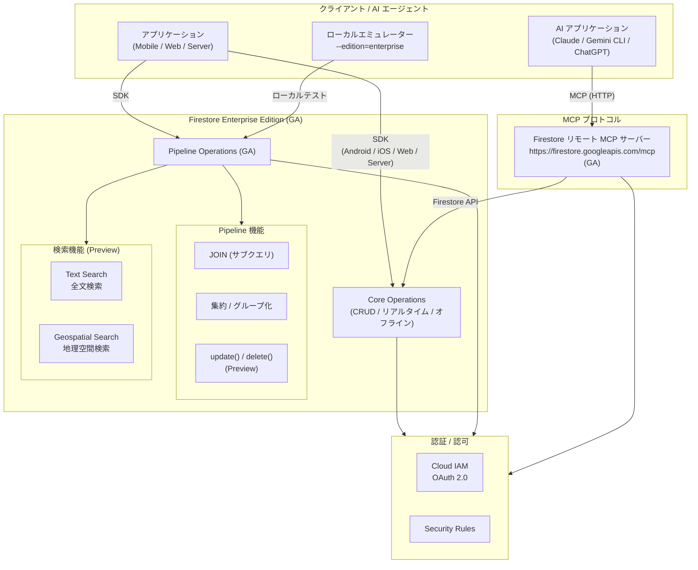

# Firestore: Enterprise Edition GA / MCP Server GA / Text Search & Geospatial Search

**リリース日**: 2026-04-20

**サービス**: Firestore

**機能**: Enterprise Edition (Native mode + Pipeline operations) GA、リモート MCP サーバー GA、Text Search / Geospatial Search (Preview)、Pipeline DML ステージ (Preview)

**ステータス**: GA / Preview

[このアップデートのインフォグラフィックを見る](https://takech9203.github.io/google-cloud-news-summary/20260420-firestore-enterprise-mcp-text-search-ga.html)

## 概要

Firestore に関する 6 つの重要なアップデートが同時に発表されました。最大の注目点は、Firestore Enterprise Edition (Native mode) と Pipeline operations インターフェースが GA (一般提供) に到達したことです。Enterprise Edition は、従来の Standard Edition にはなかった高度なクエリエンジンを搭載し、集約関数、リレーショナル JOIN、複雑なフィルタリングなどの Pipeline operations を提供します。インデックスがオプション化され、ドキュメント単位ではなくユニット単位の課金モデルが導入されています。

併せて、Firestore リモート MCP (Model Context Protocol) サーバーも GA となり、Claude、Gemini CLI、ChatGPT などの AI アプリケーションから Firestore データベースに直接接続し、ドキュメントの CRUD 操作を行えるようになりました。これは AI エージェントが外部データソースと標準化されたプロトコルで連携するための基盤となります。

さらに、Enterprise Edition 向けの新機能として Text Search と Geospatial Search (共に Preview)、Pipeline operations における `update()` / `delete()` DML ステージ (Preview)、サブクエリによる JOIN 操作が追加されました。エミュレーターの Enterprise Edition 対応も実現し、ローカル開発環境での Enterprise 機能のテストが可能になりました。

**アップデート前の課題**

- Firestore Enterprise Edition (Native mode) と Pipeline operations は Preview 段階であり、本番ワークロードでの利用には SLA の保証がなかった
- Firestore MCP サーバーも Preview であり、AI エージェントとの連携を本番環境に導入しにくかった
- Firestore ではテキスト全文検索や位置情報検索を行うために、外部サービス (Algolia、Elasticsearch など) を別途構築する必要があった
- Pipeline operations でドキュメントの更新・削除を行うには、クエリ結果を取得した後にクライアント側で個別に書き込み操作を実行する必要があった
- エミュレーターは Standard Edition のみ対応しており、Enterprise Edition の Pipeline operations をローカルでテストできなかった
- 複数コレクション間の JOIN はクライアント側で複数クエリを発行し、アプリケーションコードで結合する必要があった

**アップデート後の改善**

- Enterprise Edition と Pipeline operations が GA となり、SLA 保証のもとで本番ワークロードに利用可能
- MCP サーバーが GA となり、AI アプリケーションから Firestore への接続を本番環境で安定的に運用可能
- Text Search と Geospatial Search (Preview) により、外部検索サービスなしで Firestore 内で全文検索・地理空間検索が実行可能
- `update()` / `delete()` DML ステージ (Preview) により、Pipeline のクエリ結果に基づくサーバーサイドの一括データ変更が可能
- エミュレーターが Enterprise Edition に対応し、`--edition=enterprise` フラグでローカルテストが可能
- サブクエリによる JOIN で、サーバーサイドでコレクション間のデータ結合が実行可能

## アーキテクチャ図



Firestore Enterprise Edition は Core Operations (従来の CRUD) と Pipeline Operations (高度なクエリ) の 2 つのオペレーションセットを提供します。AI アプリケーションは MCP サーバー経由で接続し、従来のアプリケーションは SDK 経由で直接接続します。

## サービスアップデートの詳細

### 主要機能

1. **Firestore Enterprise Edition (Native mode) + Pipeline Operations の GA**
   - Enterprise Edition は Firestore の上位エディションであり、高度な Pipeline クエリエンジンを搭載
   - インデックスがオプション化され、インデックスなしでもクエリを実行可能 (ただし大規模データセットではフルスキャンによるコスト・レイテンシ増加に注意)
   - Pipeline operations は、ステージベースの合成可能な構文でクエリを構築し、集約関数 (sum, min, count_distinct 等)、リレーショナル JOIN、複雑なフィルタリング (regex_match, str_contains 等)、プロジェクション (select, remove_fields) などを提供
   - Query Explain、Query Insights による実行計画の分析とインデックス最適化が可能
   - sparse、non-sparse、unique インデックスなどの新しいインデックスタイプをサポート

2. **Firestore リモート MCP サーバーの GA**
   - エンドポイント: `https://firestore.googleapis.com/mcp`
   - AI アプリケーション (Claude、Gemini CLI、ChatGPT、カスタムアプリ) から Firestore ドキュメントの CRUD 操作が可能
   - OAuth 2.0 と IAM による認証・認可
   - 必要な IAM ロール: `roles/mcp.toolUser` (MCP ツール呼び出し) と `roles/datastore.user` (Firestore ドキュメント操作)
   - Model Armor による MCP トラフィックのセキュリティスキャンに対応
   - IAM deny ポリシーによるきめ細かなアクセス制御が可能

3. **Text Search (Preview)**
   - Firestore Enterprise Edition データベース内でのテキスト全文検索
   - テキストインデックスの事前作成が必要
   - Pipeline operations の `search(...)` ステージを使用してクエリを実行

4. **Geospatial Search (Preview)**
   - 地理空間クエリにより、位置情報に基づくサービスを構築可能
   - `geoDistance` 式を使用して指定地点からの距離でフィルタリング (メートル単位)
   - 地理空間インデックスの事前作成が必要
   - Pipeline operations の `search(...)` ステージを使用してクエリを実行

5. **Pipeline operations による JOIN (サブクエリ)**
   - コレクション間やサブコレクション間のサーバーサイド JOIN が可能
   - Array サブクエリ (結果セット全体を配列として返す) と Scalar サブクエリ (単一値を返す) の 2 種類をサポート
   - `.define()` ステージで親スコープの変数を定義し、`variable()` 関数でネストされたサブクエリから参照
   - `.select()`、`.addFields()`、`.where()`、`.sort()` などの式受け入れステージで使用可能

6. **Pipeline operations の update() / delete() DML ステージ (Preview)**
   - クエリ結果に基づいてサーバーサイドでドキュメントの更新・削除を一括実行
   - DML ステージはパイプラインの最後に配置する必要がある
   - `update()`: 対象ドキュメントにフィールドの追加・変更を適用 (`__name__` フィールドが必要)
   - `delete()`: `where(...)` ステージを含めることで意図しない一括削除を防止
   - トランザクション内での使用は不可 (各ドキュメントが独立して処理される)

7. **エミュレーターの Enterprise Edition 対応**
   - `--edition=enterprise` フラグで Enterprise Edition モードで起動可能
   - Firebase Local Emulator Suite でも `firebase.json` の `firestore.edition` または `emulators.firestore.edition` で設定可能
   - ローカル環境で Pipeline operations を含む Enterprise 機能のテストが可能

## 技術仕様

### Edition の比較

| 項目 | Standard Edition | Enterprise Edition |
|------|------------------|-------------------|
| インデックス要件 | 単一フィールドインデックスが自動作成、複合インデックスは手動作成 | インデックスはオプション (未作成時はフルスキャン) |
| インデックスタイプ | 標準インデックスのみ | sparse、non-sparse、unique、vector search インデックス |
| クエリ機能 | Core operations (where, orderBy 等) | Core operations + Pipeline operations (集約、JOIN、regex 等) |
| 課金モデル | ドキュメント単位 (読み取り / 書き込み / 削除) | ユニット単位 (Read Unit: 4KB、Write Unit: 1KB) |
| リアルタイム更新 | 読み取り SKU に含まれる | 専用 SKU で別課金 |
| ソート順序 | `__name__` フィールドが自動追加される正規化 | 正規化なし (明示的な指定が必要) |

### MCP サーバー構成

| 項目 | 詳細 |
|------|------|
| エンドポイント | `https://firestore.googleapis.com/mcp` |
| トランスポート | HTTP |
| 認証 | OAuth 2.0 + IAM |
| スコープ | `https://www.googleapis.com/auth/cloud-platform` |
| 必要ロール (MCP) | `roles/mcp.toolUser` |
| 必要ロール (Firestore) | `roles/datastore.user` |
| 対応データベースモード | Native mode (Standard / Enterprise Edition) |

### Pipeline DML ステージの制約

| 項目 | 詳細 |
|------|------|
| DML ステージの位置 | パイプライン定義の最後 (`.execute()` の前) |
| トランザクション | 非対応 (各ドキュメントが独立処理) |
| 使用可能な先行ステージ | collection, collection_group, where, select, add_fields, remove_fields, let, sort, limit, offset |
| 使用不可能な先行ステージ | aggregate, distinct, unnest, find_nearest, union, joins, sub-queries |

## 設定方法

### 前提条件

1. Google Cloud プロジェクトの作成と Firestore API の有効化
2. gcloud CLI のインストールとアップデート (`gcloud components update`)
3. Enterprise Edition の場合、対応リージョンの選択

### 手順

#### ステップ 1: Enterprise Edition データベースの作成

Google Cloud Console または gcloud CLI で Firestore データベースを Enterprise Edition で作成します。

```bash
gcloud firestore databases create \
  --location=us-central1 \
  --type=firestore-native \
  --edition=enterprise
```

#### ステップ 2: エミュレーターを Enterprise Edition で起動

```bash
# gcloud CLI を使用
gcloud emulators firestore start --edition=enterprise

# ホストとポートを指定する場合
gcloud emulators firestore start --edition=enterprise --host-port=0.0.0.0:8080
```

Firebase Local Emulator Suite を使用する場合は `firebase.json` で設定します。

```json
{
  "firestore": {
    "rules": "firestore.rules",
    "indexes": "firestore.indexes.json",
    "edition": "enterprise"
  },
  "emulators": {
    "firestore": {
      "port": 8080,
      "edition": "enterprise"
    }
  }
}
```

#### ステップ 3: MCP サーバーへの接続設定

AI アプリケーションの MCP クライアント設定にて以下を指定します。

```json
{
  "mcpServers": {
    "firestore": {
      "url": "https://firestore.googleapis.com/mcp",
      "transport": "http",
      "auth": {
        "type": "oauth2",
        "scope": "https://www.googleapis.com/auth/cloud-platform"
      }
    }
  }
}
```

#### ステップ 4: Pipeline operations によるサブクエリ JOIN の実行例

```javascript
// Node.js: ユーザーと注文をサブクエリで結合
const snapshot = await db.pipeline()
  .collection("users")
  .define({ userRef: field("__name__") })
  .addFields(
    db.pipeline()
      .collection("orders")
      .where(field("userId").equal(variable("userRef")))
      .select("orderId", "total", "createdAt")
      .toArray()
      .as("orders")
  )
  .execute();
```

#### ステップ 5: Text Search の実行例

```javascript
// テキストインデックスを事前に作成した上で実行
const snapshot = await db.pipeline()
  .collection("articles")
  .search({
    query: field("content").textSearch("Firestore Enterprise")
  })
  .execute();
```

#### ステップ 6: Geospatial Search の実行例

```javascript
// 地理空間インデックスを事前に作成した上で実行
const snapshot = await db.pipeline()
  .collection("restaurants")
  .search({
    query: field("location")
      .geoDistance(new GeoPoint(35.6812, 139.7671)) // 東京駅
      .lessThan(1000) // 1,000メートル以内
  })
  .execute();
```

## メリット

### ビジネス面

- **AI エージェント統合の本番運用**: MCP サーバーの GA により、AI アプリケーションから Firestore データへのアクセスを SLA 保証付きで本番環境に導入可能
- **外部サービスコストの削減**: Text Search と Geospatial Search により、Algolia や Elasticsearch などの外部検索サービスへの依存を削減できる可能性
- **開発速度の向上**: Pipeline operations の高度なクエリ機能により、アプリケーション側で複雑なデータ処理ロジックを実装する工数を削減
- **柔軟なコスト管理**: ユニット単位課金により、小さなドキュメントの読み取りが効率的になり、インデックスのオプション化でストレージコストを最適化可能

### 技術面

- **サーバーサイド JOIN**: Pipeline サブクエリにより、クライアント側での複数クエリ発行とデータ結合が不要に
- **サーバーサイド DML**: `update()` / `delete()` ステージにより、クエリ結果に基づく一括変更をサーバー側で効率的に実行
- **ローカルテスト環境の充実**: エミュレーターの Enterprise Edition 対応により、本番同等の機能をローカルでテスト可能
- **高度なインデックス制御**: sparse、non-sparse、unique インデックスにより、用途に応じた最適なインデックス戦略を選択可能

## デメリット・制約事項

### 制限事項

- Text Search と Geospatial Search は Preview であり、SLA の保証や本番ワークロードへの推奨は限定的
- `update()` / `delete()` DML ステージは Preview であり、トランザクション内での使用は不可
- DML ステージの前に aggregate、distinct、unnest、find_nearest、union、joins、sub-queries ステージは使用不可
- Enterprise Edition のインデックス未作成クエリはフルスキャンとなり、データ量に比例してコストとレイテンシが増加
- Pipeline operations ではリアルタイムリスンとオフライン永続化は Core operations でのみ利用可能
- Enterprise Edition は全リージョンで利用可能だが、一部の機能はリージョン制限がある場合がある

### 考慮すべき点

- Standard Edition から Enterprise Edition への移行では、課金モデルがドキュメント単位からユニット単位に変更されるため、コスト試算が必要
- Enterprise Edition ではソート順序の正規化が行われないため、決定的な結果順序が必要な場合は `__name__` を明示的に指定する必要がある
- MCP サーバー利用時は適切な IAM ロール設定と、必要に応じて Model Armor によるセキュリティ対策を検討すべき
- DML ステージは各ドキュメントが独立して処理されるため、部分的な成功 (partial success) が発生しうる

## ユースケース

### ユースケース 1: AI チャットボットによるデータベース管理

**シナリオ**: カスタマーサポート用の AI エージェントが、ユーザーからの問い合わせに応じて Firestore に保存された注文情報や顧客情報を検索・更新する。

**実装例**:
```
AI エージェント → MCP プロトコル → Firestore MCP サーバー (GA)
  → ドキュメント検索: "注文 ID: 12345 の配送状況を確認"
  → ドキュメント更新: "注文のステータスを '発送済み' に変更"
```

**効果**: AI アプリケーションが標準化されたプロトコルで Firestore に直接アクセスできるため、カスタム API の構築が不要になり、開発コストと運用負荷を削減できる。

### ユースケース 2: 位置情報ベースのレコメンデーション

**シナリオ**: 飲食店検索アプリで、ユーザーの現在地から近い順にレストランを表示し、メニューのテキスト検索も同時に行う。

**実装例**:
```javascript
const results = await db.pipeline()
  .collection("restaurants")
  .search({
    query: field("location")
      .geoDistance(new GeoPoint(userLat, userLng))
      .lessThan(2000) // 2km以内
  })
  .where(field("cuisine").equal("Japanese"))
  .sort(field("rating").descending())
  .limit(20)
  .execute();
```

**効果**: Geospatial Search により外部の位置情報検索サービスが不要となり、Firestore 内で完結する位置情報ベースのクエリが実現する。

### ユースケース 3: データマイグレーション・一括更新

**シナリオ**: アプリケーションのデータモデル変更に伴い、全ユーザードキュメントに新しいフィールドを追加し、古いフィールドを削除する。

**実装例**:
```javascript
// 全ユーザーの preferences.theme フィールドを追加し、
// 古い theme フィールドを削除
const snapshot = await db.pipeline()
  .collectionGroup("users")
  .where(not(exists(field("preferences.theme"))))
  .addFields(constant("default").as("preferences.theme"))
  .removeFields("theme")
  .update()
  .execute();
```

**効果**: `update()` DML ステージにより、クエリと更新をひとつのパイプラインで実行でき、クライアント側のバッチ処理コードが不要になる。

## 料金

Enterprise Edition はユニット単位の課金モデルを採用しています (us-central1 の料金)。

### 料金比較 (Standard vs Enterprise)

| 項目 | Standard Edition | Enterprise Edition |
|------|-----------------|-------------------|
| 読み取り | $0.03 / 10万ドキュメント | $0.05 / 100万 Read Unit (4KB単位) |
| 書き込み | $0.09 / 10万ドキュメント | $0.26 / 100万 Write Unit (1KB単位) |
| 削除 | $0.01 / 10万ドキュメント | Write Unit に含まれる |
| リアルタイム更新 | 読み取り SKU に含まれる | $0.30 / 100万 Read Unit (専用 SKU) |
| ストレージ | $0.00020 / GiB 時間 | $0.00032 / GiB 時間 |

### 無料枠 (1日あたり)

| 項目 | Standard Edition | Enterprise Edition |
|------|-----------------|-------------------|
| 読み取り | 50,000 | 50,000 |
| 書き込み | 20,000 | 40,000 |
| 削除 | 20,000 | Write に含まれる |
| リアルタイム更新 | 読み取り SKU に含まれる | 50,000 |
| ストレージ | 1 GB | 1 GB |

## 利用可能リージョン

Enterprise Edition は 2026 年 3 月以降、全サポートリージョンの Native mode で利用可能です。

**マルチリージョン**: eur3 (ヨーロッパ)、nam5 (米国中部)、nam7 (米国中部・東部)

**リージョン** (一部抜粋): us-central1、us-east1、us-east4、us-west1、europe-west1、europe-west3、asia-northeast1 (東京)、asia-northeast2 (大阪)、asia-southeast1 (シンガポール) など、多数のリージョンに対応。

**SLA**: マルチリージョン >= 99.999%、リージョン >= 99.99%

## 関連サービス・機能

- **Firebase**: Firestore Enterprise Edition は Firebase SDK (Android / iOS / Web) からも利用可能であり、Firebase Local Emulator Suite でのテストにも対応
- **Model Armor**: MCP サーバーのトラフィックに対するセキュリティスキャン (プロンプトインジェクション防止等) を提供
- **Cloud IAM**: MCP サーバーおよび Firestore データベースへのアクセス制御を一元管理
- **Vertex AI**: AI エージェント構築時に Firestore MCP サーバーを外部データソースとして統合可能
- **Gemini Code Assist**: Firestore (MongoDB compatibility mode) での自然言語による MQL クエリ生成を支援

## 参考リンク

- [インフォグラフィック](https://takech9203.github.io/google-cloud-news-summary/20260420-firestore-enterprise-mcp-text-search-ga.html)
- [公式リリースノート](https://docs.cloud.google.com/release-notes#April_20_2026)
- [Firestore Enterprise Edition Pipeline 概要](https://firebase.google.com/docs/firestore/enterprise/pipelines-overview)
- [Firestore リモート MCP サーバー](https://docs.cloud.google.com/firestore/native/docs/use-firestore-mcp)
- [Text Search](https://docs.cloud.google.com/firestore/native/docs/text-search)
- [Geospatial Search](https://docs.cloud.google.com/firestore/native/docs/geospatial-search)
- [Pipeline DML (update / delete)](https://docs.cloud.google.com/firestore/native/docs/pipeline/dml)
- [サブクエリによる JOIN](https://docs.cloud.google.com/firestore/native/docs/pipeline/perform-joins-with-sub-pipelines)
- [エミュレーター](https://docs.cloud.google.com/firestore/native/docs/emulator)
- [Enterprise Edition 料金](https://cloud.google.com/firestore/enterprise/pricing)
- [Enterprise Edition クイックスタート](https://firebase.google.com/docs/firestore/enterprise/quickstart)
- [対応リージョン](https://docs.cloud.google.com/firestore/native/docs/locations)

## まとめ

今回のアップデートは Firestore にとって歴史的なマイルストーンです。Enterprise Edition と Pipeline operations の GA により、Firestore は従来の NoSQL ドキュメントデータベースの枠を超え、サーバーサイド JOIN、高度な集約、全文検索、地理空間検索を備えたフルスペックのデータベースプラットフォームへと進化しました。MCP サーバーの GA は AI エージェント時代における Firestore の位置づけを強固にするものであり、AI アプリケーションからのデータアクセスを標準化されたプロトコルで実現します。既存の Firestore ユーザーは Enterprise Edition への移行を検討し、エミュレーターで事前検証を行った上で、本番環境への導入を計画することを推奨します。

---

**タグ**: #Firestore #EnterpriseEdition #PipelineOperations #MCP #ModelContextProtocol #TextSearch #GeospatialSearch #GA #Preview #NoSQL #AIAgent #Firebase
