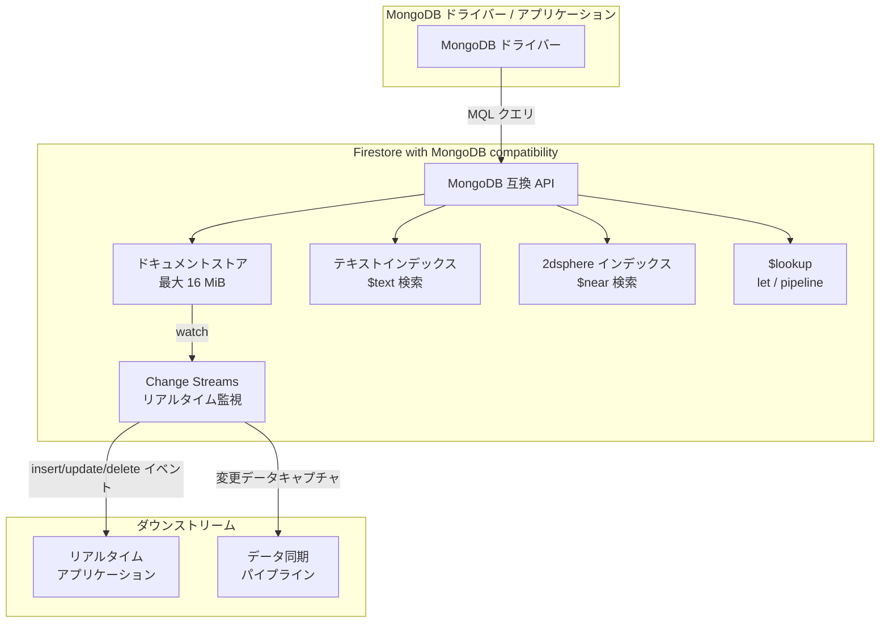

# Firestore with MongoDB compatibility: 複数機能の大幅強化 -- ドキュメントサイズ拡大、テキスト/地理空間検索、Change Streams など

**リリース日**: 2026-04-20

**サービス**: Firestore with MongoDB compatibility

**機能**: ドキュメントサイズ上限の 16 MiB への拡大、テキスト/地理空間検索、$lookup の let/pipeline 対応、Change Streams、drop() コマンド

**ステータス**: Feature (一部 Preview)

[このアップデートのインフォグラフィックを見る](https://takech9203.github.io/google-cloud-news-summary/20260420-firestore-mongodb-compatibility-enhancements.html)

## 概要

Firestore with MongoDB compatibility に対して、5 つの重要な機能アップデートが同時にリリースされた。ドキュメントの最大サイズが 16 MiB に引き上げられ、MongoDB との互換性がさらに向上した。テキスト検索と地理空間検索 (Preview)、Change Streams (Preview)、drop() コマンド (Preview) が新たに追加され、$lookup の let/pipeline フィールドサポートにより集計パイプラインの柔軟性が大幅に強化された。

これらのアップデートは、MongoDB からの移行を検討している開発者や、既に Firestore with MongoDB compatibility を利用しているチームにとって特に大きなインパクトがある。テキスト検索や地理空間検索の追加により、以前は外部検索エンジンや追加サービスに依存していたユースケースを Firestore 単体でカバーできるようになった。Change Streams はリアルタイムアプリケーションやデータ同期パイプラインの構築を可能にし、MongoDB エコシステムとの互換性を一段と高めている。

対象ユーザーは、Firestore Enterprise エディションを利用する開発者、MongoDB からの移行を計画しているチーム、リアルタイムデータ同期が必要なアプリケーション開発者、位置情報サービスやテキスト検索機能を組み込むアプリケーション開発者である。

**アップデート前の課題**

- ドキュメントサイズに MongoDB 標準の 16 MiB よりも小さい制限があり、MongoDB からの移行時にデータモデルの変更が必要になるケースがあった
- テキスト検索や地理空間検索がサポートされておらず、これらの機能が必要な場合は外部の検索サービスを別途構築する必要があった
- $lookup の let/pipeline フィールドが未サポートで、サブクエリを使った柔軟な結合処理ができなかった (2025 年 9 月の時点では from/localField/foreignField/as のみサポート)
- リアルタイムでのデータ変更監視 (Change Streams) がサポートされておらず、ポーリングベースの実装が必要だった
- コレクションの一括削除に drop() コマンドが使えず、ドキュメント単位での削除が必要だった

**アップデート後の改善**

- ドキュメントサイズ上限が 16 MiB に拡大され、MongoDB 標準と同等になり、移行時のデータモデル変更が不要になった
- $text オペレータによるテキスト検索と $near オペレータによる地理空間検索が利用可能になり、Firestore 単体で全文検索や位置情報クエリを実行できるようになった (Preview)
- $lookup で let と pipeline がサポートされ、サブクエリを使った高度な結合クエリが可能になった
- Change Streams によりコレクションやデータベース全体のリアルタイム変更監視が可能になった (Preview)
- drop() コマンドでコレクション全体を一括削除できるようになった (Preview)

## アーキテクチャ図



Firestore with MongoDB compatibility の新機能を示すアーキテクチャ図。MongoDB ドライバーからの MQL クエリが MongoDB 互換 API を経由し、テキスト検索、地理空間検索、$lookup パイプライン、ドキュメントストアにアクセスする。Change Streams はリアルタイムアプリケーションやデータ同期パイプラインに変更イベントを配信する。

## サービスアップデートの詳細

### 主要機能

1. **ドキュメント最大サイズの 16 MiB への拡大**
   - ドキュメントの最大サイズが 16 MiB に引き上げられ、MongoDB の標準上限と一致した
   - フィールドの最大ネスト深度は 20 レベル (Array/Object 型のフィールドごとに 1 レベル加算)
   - 10 MiB を超えるドキュメントは Eventarc イベントペイロードに含まれない点に注意が必要

2. **テキスト検索 (Preview)**
   - $text オペレータと $search 引数を使用してコレクション内の文字列検索が可能
   - テキストインデックスの作成が前提条件
   - $language 引数による言語設定、完全一致検索、用語の組み合わせ検索、除外検索をサポート
   - {$meta: "textScore"} による関連性スコアの計算とソートに対応
   - 言語に基づくコンテキスト対応の同義語、ステミング、スペル修正、ダイアクリティック変形のマッチングを自動拡張

3. **地理空間検索 (Preview)**
   - $near オペレータを使用して GeoJSON オブジェクトまたは GeoPoint に基づく近接検索が可能
   - $maxDistance / $minDistance による距離フィルタリング (メートル単位)
   - 2dsphere インデックスの作成が前提条件
   - 検索結果は近い順にソートされ、セカンダリソートで上書き可能
   - パーティションフィルタとの組み合わせもサポート

4. **$lookup の let / pipeline サポート**
   - 集計パイプラインの $lookup ステージで let と pipeline フィールドが利用可能に
   - これにより、サブクエリを使った柔軟なコレクション結合が可能になった
   - 2025 年 9 月に追加された from/localField/foreignField/as に加え、より高度な結合パターンに対応

5. **Change Streams (Preview)**
   - コレクション単位またはデータベース全体のリアルタイム変更監視が可能
   - insert、update、delete、drop の各イベントを db.collection.watch() および db.watch() で観測
   - デフォルト保持期間は 7 日 (最小 1 日、最大 7 日、1 日単位)
   - 全ての fullDocument / fullDocumentBeforeChange オプション (プレイメージ/ポストイメージ) をサポート
   - resumeAfter / startAfter によるカーソル再開をサポート
   - 自動パーティショニングと読み取り並列化による高スループット処理に対応
   - 作成は Google Cloud コンソールから行い、datastore.schemas.create 権限が必要

6. **drop() コマンド (Preview)**
   - コレクション全体を一括削除する drop() コマンドをサポート
   - 削除直後に同じインデックス構成を再作成することはできない (バックグラウンド削除の完了待ちが必要)
   - 大規模コレクションの削除では接続タイムアウトが発生する可能性があり、接続期限の延長が推奨される
   - drop 時の Eventarc イベントは生成されない

## 技術仕様

### テキスト検索の主要仕様

| 項目 | 詳細 |
|------|------|
| オペレータ | $text (クエリ内)、$search (検索文字列指定) |
| 言語設定 | $language 引数で指定、未指定時はインデックスの言語を使用 |
| スコアリング | {$meta: "textScore"} で関連性スコアを取得・ソート可能 |
| 制約 | $near との同時使用不可、クエリ内に $text は 1 つのみ |
| 集計パイプライン | $match ステージ内で使用可能 (パイプラインの最初のステージである必要あり) |

### 地理空間検索の主要仕様

| 項目 | 詳細 |
|------|------|
| オペレータ | $near (距離計算・ソート) |
| インデックス | 2dsphere インデックスが必要 |
| 距離指定 | $maxDistance / $minDistance (メートル単位) |
| データ形式 | GeoJSON オブジェクトまたは GeoPoint |
| 制約 | $text との同時使用不可、$not / $nor 内では使用不可、集計クエリでは未サポート |

### Change Streams の主要仕様

| 項目 | 詳細 |
|------|------|
| スコープ | コレクション単位またはデータベース全体 |
| イベント種別 | insert, update, delete, drop |
| 保持期間 | 1-7 日 (デフォルト 7 日、1 日単位、作成後変更不可) |
| プレイメージ/ポストイメージ | 全オプションサポート (1 時間以上前のイメージには PITR 有効化が必要) |
| 再開オプション | resumeAfter, startAfter |
| チェイン可能なステージ | $addFields, $match, $project, $replaceRoot, $replaceWith, $set, $unset |
| 必要な IAM 権限 | datastore.schemas.create, datastore.schemas.delete, datastore.schemas.list |
| 推奨ロール | Datastore Index Admin (roles/datastore.indexAdmin) |

### ドキュメントサイズとクォータ

| 項目 | 詳細 |
|------|------|
| 最大ドキュメントサイズ | 16 MiB |
| 最大フィールドネスト深度 | 20 レベル |
| 最大フィールド値サイズ | 4 MiB - 89 bytes |
| Eventarc ペイロード制限 | 10 MiB を超えるドキュメントは含まれない |

## 設定方法

### 前提条件

1. Firestore Enterprise エディションのデータベースが作成済みであること
2. 適切な IAM ロールが付与されていること (roles/datastore.owner, roles/datastore.indexAdmin, roles/editor, roles/owner のいずれか)

### 手順

#### ステップ 1: テキストインデックスの作成 (テキスト検索を使用する場合)

```javascript
// テキストインデックスの作成
db.cities.createIndex({ description: "text" })
```

テキスト検索を実行するには、検索対象フィールドにテキストインデックスを事前に作成する必要がある。

#### ステップ 2: テキスト検索の実行

```javascript
// 一般的なテキスト検索
db.cities.find({ $text: { $search: "french bread" } })

// 言語を指定したテキスト検索
db.cities.find({ $text: { $search: "french bread", $language: "en" } })

// 関連性スコアでソート
db.cities
  .find({ $text: { $search: "best french bread" } })
  .sort({ score: { $meta: "textScore" } })
```

$text オペレータ内の $search に検索文字列を指定する。$language で言語を指定でき、{$meta: "textScore"} で関連性スコアに基づくソートが可能。

#### ステップ 3: 地理空間検索の実行

```javascript
// 2dsphere インデックスの作成
db.myCollection.createIndex({ location: "2dsphere" })

// 近接検索
db.myCollection.find({
  location: {
    $near: {
      $geometry: {
        type: "Point",
        coordinates: [-122.084, 37.4221]
      },
      $maxDistance: 2000,
      $minDistance: 500
    }
  }
})
```

$near オペレータで GeoJSON ポイントを基準に距離ベースの検索を実行する。$maxDistance / $minDistance でメートル単位の距離フィルタリングが可能。

#### ステップ 4: Change Streams の設定と利用

```javascript
// Google Cloud コンソールで Change Stream を作成した後、
// コレクション単位のカーソルを開く
let cursor = db.myCollection.watch()

// データベース全体のカーソルを開く
let dbCursor = db.watch()

// 変更イベントの取得
let doc = db.myCollection.insertOne({ value: "hello world" })
console.log(cursor.tryNext())

// resume token を使用した再開
let event = cursor.tryNext()
let resumeToken = event._id
let newCursor = db.myCollection.watch({ resumeAfter: resumeToken })
```

Change Streams を使用するには、まず Google Cloud コンソールから Change Stream を明示的に作成する必要がある。自動作成はサポートされていない。

#### ステップ 5: $lookup で let / pipeline を使用

```javascript
// let と pipeline を使用した $lookup の例
db.orders.aggregate([
  {
    $lookup: {
      from: "inventory",
      let: { orderItem: "$item", orderQty: "$quantity" },
      pipeline: [
        {
          $match: {
            $expr: {
              $and: [
                { $eq: ["$sku", "$$orderItem"] },
                { $gte: ["$instock", "$$orderQty"] }
              ]
            }
          }
        },
        { $project: { sku: 1, instock: 1 } }
      ],
      as: "stockdata"
    }
  }
])
```

let フィールドで外部コレクションの変数を定義し、pipeline で内部のサブクエリを構築できる。

## メリット

### ビジネス面

- **MongoDB 移行のハードル低減**: ドキュメントサイズ上限が MongoDB 標準の 16 MiB と同等になり、Change Streams や $lookup の完全サポートにより、MongoDB からの移行時に必要なコード変更が大幅に減少する
- **外部サービス依存の削減**: テキスト検索と地理空間検索が組み込みで提供されることで、Elasticsearch 等の外部検索エンジンを別途運用する必要がなくなるケースが増え、運用コストとアーキテクチャの複雑性が低減される
- **リアルタイムアプリケーションの構築加速**: Change Streams により、リアルタイム通知、ダッシュボード更新、データ同期などのユースケースをポーリングなしで効率的に実装できる

### 技術面

- **サーバーレスのスケーラビリティ**: Firestore の自動パーティショニングと読み取り並列化により、Change Streams を含む全機能が事前のキャパシティプランニングなしにスケールする
- **高度な集計パイプライン**: $lookup の let/pipeline サポートにより、サブクエリを使ったコレクション間の複雑な結合処理が可能になり、アプリケーション側のデータ加工ロジックを DB 側に集約できる
- **全文検索のネイティブ対応**: テキスト検索では同義語、ステミング、スペル修正、ダイアクリティック変形の自動拡張が含まれ、言語対応の検索が組み込みで利用可能

## デメリット・制約事項

### 制限事項

- テキスト検索と地理空間検索は Preview であり、SLA の対象外。本番ワークロードへの適用は慎重に検討が必要
- Change Streams は Preview であり、保持期間は作成後に変更不可 (変更するには再作成が必要)
- $near オペレータと $text オペレータは同一クエリ内で同時に使用できない
- $near は集計クエリ ($aggregate) では未サポート
- テキスト検索では $match + $text がパイプラインの最初のステージである必要がある
- drop() コマンドは Preview であり、削除直後の同一インデックス構成の再作成はバックグラウンド削除完了まで待つ必要がある
- drop() コマンドによる削除では Eventarc イベントが生成されない
- Change Streams のプレイメージ/ポストイメージで 1 時間以上前のデータを取得するには PITR (Point-In-Time Recovery) の有効化が必要
- retryable writes はサポートされていない (retryWrites=false の設定が必要)

### 考慮すべき点

- 10 MiB を超えるドキュメントは Eventarc イベントペイロードに含まれないため、イベント駆動アーキテクチャでは注意が必要
- 大規模コレクションの drop() では接続タイムアウトが発生する可能性があるため、接続期限の延長または bulk delete の使用を検討すべき
- Change Streams の保持期間変更には再作成が必要なため、初期設定時に適切な保持期間を検討する必要がある

## ユースケース

### ユースケース 1: 位置情報ベースのサービス検索

**シナリオ**: モバイルアプリケーションでユーザーの現在地周辺のレストランや店舗を検索する機能を実装する場合。

**実装例**:
```javascript
// 2dsphere インデックスの作成
db.restaurants.createIndex({ location: "2dsphere" })

// ユーザーの現在地から 1km 以内のレストランを検索
db.restaurants.find({
  location: {
    $near: {
      $geometry: {
        type: "Point",
        coordinates: [139.6917, 35.6895]  // 東京駅付近
      },
      $maxDistance: 1000
    }
  }
})
```

**効果**: 外部の地理空間検索サービスを使わずに、Firestore 単体で位置情報ベースの近接検索を実現できる。サーバーレスアーキテクチャのまま、位置情報サービスのスケーラビリティを確保できる。

### ユースケース 2: リアルタイムデータ同期パイプライン

**シナリオ**: Firestore のデータ変更をリアルタイムで他のシステム (分析基盤、キャッシュ、外部 API) に同期する場合。

**実装例**:
```javascript
// Change Stream の作成 (Google Cloud コンソール経由)
// カーソルの開始
let cursor = db.orders.watch()

// フィルタリング付きの監視
let filteredCursor = db.orders.watch([
  { $match: { "fullDocument.status": "completed" } }
])

// イベント処理ループ
while (cursor.hasNext()) {
  let event = cursor.next()
  // 変更イベントを処理 (外部システムへの同期など)
  processChange(event)
}
```

**効果**: ポーリングベースの実装と比較して、レイテンシの大幅な削減とリソース効率の向上が期待できる。自動パーティショニングにより高スループットの変更ストリームにも対応可能。

### ユースケース 3: 商品カタログのテキスト検索

**シナリオ**: EC サイトで商品の説明文からキーワード検索を行い、関連性スコアに基づいてランキング表示する場合。

**実装例**:
```javascript
// 商品説明フィールドにテキストインデックスを作成
db.products.createIndex({ description: "text", name: "text" })

// テキスト検索と関連性スコアによるソート
db.products
  .find({ $text: { $search: "wireless bluetooth headphones" } })
  .sort({ score: { $meta: "textScore" } })
  .project({ name: 1, price: 1, score: { $meta: "textScore" } })
```

**効果**: Elasticsearch 等の外部全文検索エンジンを導入せずに、Firestore のサーバーレスインフラ上でテキスト検索を実現できる。運用コストとアーキテクチャの複雑性を低減しつつ、関連性スコアに基づく検索結果のランキングが可能。

## 料金

Firestore with MongoDB compatibility は Firestore Enterprise エディションの一部として提供され、従量課金モデル (pay-per-use) で提供される。

### 無料枠

| 項目 | 無料枠 |
|------|--------|
| ストレージ | 1 GiB |
| 読み取りユニット | 50,000/日 |
| 書き込みユニット | 40,000/日 |
| 送信データ転送 | 10 GiB/月 |

無料枠はプロジェクトあたり 1 データベースに適用される。TTL による管理削除、バックアップデータ、リストア操作は無料枠の対象外。

詳細な料金情報は [Firestore Enterprise 料金ページ](https://cloud.google.com/firestore/enterprise/pricing) を参照。

## 関連サービス・機能

- **Cloud Monitoring / Cloud Logging**: Firestore with MongoDB compatibility のデータベースアクティビティのモニタリングとログ記録に使用。Change Streams と組み合わせた運用監視が可能
- **Eventarc**: Firestore のデータ変更をトリガーとしてイベント駆動ワークフローを構築可能。ただし 10 MiB 超のドキュメントと drop イベントは対象外
- **Datastream / Dataflow**: MongoDB からの移行時に使用。Datastream でソースからの変更データをキャプチャし、Dataflow で Firestore にデータを注入する移行パイプラインを構築可能
- **VPC Service Controls**: Firestore with MongoDB compatibility データベースへのネットワークアクセスを制御し、データ漏洩リスクを軽減
- **Firestore Native (Enterprise)**: 同日に Pipeline operations の GA、テキスト/地理空間検索のサポートもリリースされており、Native モードとの機能差が縮小している

## 参考リンク

- [インフォグラフィック](https://takech9203.github.io/google-cloud-news-summary/20260420-firestore-mongodb-compatibility-enhancements.html)
- [公式リリースノート](https://docs.cloud.google.com/firestore/mongodb-compatibility/docs/release-notes)
- [Firestore with MongoDB compatibility 概要](https://docs.cloud.google.com/firestore/mongodb-compatibility/docs/overview)
- [Behavior differences (ドキュメントサイズ等)](https://docs.cloud.google.com/firestore/mongodb-compatibility/docs/behavior-differences)
- [テキスト検索ドキュメント](https://docs.cloud.google.com/firestore/mongodb-compatibility/docs/text-query)
- [地理空間検索ドキュメント](https://docs.cloud.google.com/firestore/mongodb-compatibility/docs/geo-query)
- [Change Streams ドキュメント](https://docs.cloud.google.com/firestore/mongodb-compatibility/docs/change-streams)
- [サポート機能一覧 (MongoDB 8.0)](https://docs.cloud.google.com/firestore/mongodb-compatibility/docs/supported-features-80)
- [クォータと上限](https://docs.cloud.google.com/firestore/mongodb-compatibility/quotas)
- [料金ページ](https://cloud.google.com/firestore/enterprise/pricing)

## まとめ

今回のアップデートは、Firestore with MongoDB compatibility の MongoDB 互換性を大幅に強化するものであり、特にドキュメントサイズの 16 MiB への拡大、テキスト/地理空間検索、Change Streams の追加は、MongoDB からの移行障壁を大きく下げる重要な進展である。MongoDB ワークロードを Google Cloud のサーバーレスインフラに移行することを検討しているチームは、これらの新機能により、アプリケーションコードの変更を最小限に抑えた移行が可能になる。Preview 機能については GA 昇格のタイミングを注視しつつ、開発環境での検証を推奨する。

---

**タグ**: #Firestore #MongoDB #TextSearch #GeoSpatial #ChangeStreams #NoSQL #Database #ServerlessDatabase #FirestoreEnterprise #DataMigration
