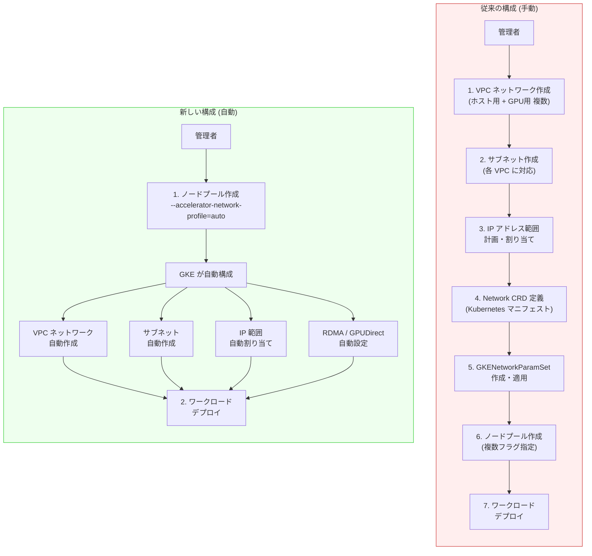

# Google Kubernetes Engine (GKE): Accelerator Network Profile の一般提供 (GA)

**リリース日**: 2026-04-20

**サービス**: Google Kubernetes Engine (GKE)

**機能**: Accelerator Network Profile の一般提供 (GA)

**ステータス**: GA (Generally Available)

[このアップデートのインフォグラフィックを見る](https://takech9203.github.io/google-cloud-news-summary/20260420-gke-accelerator-network-profile-ga.html)

## 概要

Google Kubernetes Engine (GKE) の Accelerator Network Profile が一般提供 (GA) となりました。この機能は、AI/ML ワークロード向けの GPU および TPU ノードプールにおけるネットワーク構成を自動化し、これまで手動で行う必要があった複雑な VPC やサブネットの作成作業を不要にします。

従来、GPU や TPU を使用するアクセラレータ最適化マシンでは、高スループット・低レイテンシの通信を実現するために、複数の VPC ネットワーク、サブネット、IP アドレス範囲、ネットワークインターフェースを個別に作成・管理する必要がありました。Accelerator Network Profile を使用すると、ノードプール作成時に `--accelerator-network-profile=auto` という単一のフラグを指定するだけで、GKE が必要なすべてのクラウドおよび Kubernetes ネットワークリソースを自動的にプロビジョニングします。

この機能は、GKE 上で大規模な AI/ML トレーニングや推論ワークロードを実行するクラウドアーキテクト、ネットワーキングスペシャリスト、ML エンジニアに特に重要なアップデートです。RDMA (Remote Direct Memory Access) や GPUDirect 通信に必要な高性能ネットワーク接続を、ネットワーキングの専門知識がなくても簡単に構成できるようになります。

**アップデート前の課題**

- GPU/TPU ワークロード用に複数の VPC ネットワークとサブネットを手動で作成・管理する必要があった
- IP アドレス範囲の計画と割り当てを個別に行う必要があり、設定ミスのリスクがあった
- RDMA 対応の高性能ネットワーク (MTU 8896) を手動で構成する必要があり、ネットワーキングの深い専門知識が求められた
- ノードプールごとに Network CRD、GKENetworkParamSet などの Kubernetes オブジェクトを個別に定義・適用する必要があった
- マルチ NIC 構成の設定が複雑で、ホスト NIC と GPU NIC の役割分離を正しく構成するのが困難だった

**アップデート後の改善**

- `--accelerator-network-profile=auto` フラグ一つで VPC、サブネット、ネットワークインターフェースの構成が自動化された
- 手動での VPC 作成、サブネット作成、IP 範囲管理が不要になり、設定ミスのリスクが大幅に低減
- RDMA や GPUDirect 通信に必要な高性能ネットワークが自動的に最適な設定 (MTU 8896 など) でプロビジョニングされる
- Autopilot クラスタでも ComputeClass リソースを通じて自動ネットワーク構成が利用可能になった
- AI/ML ワークロードのデプロイまでのリードタイムが大幅に短縮された

## アーキテクチャ図



左の「従来の構成」では管理者が 7 つのステップを手動で実行する必要がありましたが、右の「新しい構成」ではノードプール作成時にフラグを一つ追加するだけで、GKE が VPC、サブネット、IP 範囲、RDMA 設定をすべて自動的に構成します。

## サービスアップデートの詳細

### 主要機能

1. **単一フラグによるネットワーク自動構成**
   - ノードプール作成時に `--accelerator-network-profile=auto` を指定するだけで、GPU/TPU ワークロードに必要なすべてのネットワークリソースが自動的に作成される
   - ホスト NIC (クラスタ通信・管理用) と GPU NIC (高性能インターコネクト用) が自動的に適切な VPC に接続される
   - RDMA 対応ネットワークが MTU 8896 で自動構成され、GPUDirect 通信が有効化される

2. **Autopilot クラスタおよびノード自動プロビジョニングとの統合**
   - ComputeClass リソースに `acceleratorNetworkProfile: auto` フィールドを追加することで、Autopilot クラスタや Standard クラスタのノード自動プロビジョニングでも自動ネットワーク構成が利用可能
   - ワークロードが ComputeClass を選択すると、GKE がノードのプロビジョニングと同時にネットワークインターフェースも自動構成する

3. **GKE マネージド DRANET との連携**
   - Kubernetes Dynamic Resource Allocation (DRA) API を実装した GKE マネージド DRANET と組み合わせて使用可能
   - Pod レベルで RDMA ネットワークインターフェースを動的に割り当て、各 Pod が専用の高帯域幅インターフェースを排他的に利用可能
   - `cloud.google.com/gke-networking-dra-driver=true` ラベルを追加することで DRANET ドライバを有効化

## 技術仕様

### 対応マシンタイプ

| マシンファミリー | GPU/TPU モデル | 用途 |
|------|------|------|
| A4X Max | GB300 GPU | 最大規模の AI トレーニング |
| A4X | GB200 GPU | 大規模 AI トレーニング |
| A4 | NVIDIA B200 GPU | AI トレーニング・推論 |
| A3 Ultra | NVIDIA H200 GPU | 大規模言語モデル (LLM) |
| A3 Mega | NVIDIA H100 GPU | AI/ML トレーニング |
| TPU Trillium (v6e) | Cloud TPU | TPU ワークロード |

### ネットワーク構成の自動設定内容

| 項目 | 詳細 |
|------|------|
| ホスト NIC | クラスタ通信およびコントロールプレーンとの管理通信用 VPC に自動接続 |
| GPU/TPU NIC | 高性能専用 VPC に自動接続 (RDMA 対応) |
| MTU | 8896 (GPUDirect 通信に最適化) |
| Pod ネットワーク | 各ネットワークインターフェースが単一の Pod に専有割り当て |
| ノードラベル | `gke.networks.io/accelerator-network-profile: auto` が自動付与 |

### 前提条件

- GKE Dataplane V2 が有効であること
- 単一ゾーンのノードプールであること
- 対応するアクセラレータ最適化マシンファミリー (A3、A4、TPU Trillium) を使用すること

## 設定方法

### gcloud CLI による設定

#### ステップ 1: GPU ノードプールの作成

```bash
gcloud beta container node-pools create my-gpu-pool \
    --accelerator-network-profile=auto \
    --node-locations=us-central1-a \
    --machine-type=a3-ultragpu-8g \
    --cluster=my-cluster \
    --region=us-central1
```

ノードプール作成時に `--accelerator-network-profile=auto` フラグを追加するだけで、GKE が GPU 用の VPC ネットワーク、サブネット、ネットワークインターフェースを自動的に構成します。

#### ステップ 2: ワークロードのデプロイ (nodeSelector の指定)

```yaml
apiVersion: v1
kind: Pod
metadata:
  name: gpu-workload
spec:
  nodeSelector:
    gke.networks.io/accelerator-network-profile: auto
  containers:
  - name: training
    image: my-training-image
    resources:
      limits:
        nvidia.com/gpu: 8
```

`--accelerator-network-profile=auto` で作成されたノードには `gke.networks.io/accelerator-network-profile: auto` ラベルが自動付与されるため、ワークロードの `nodeSelector` にこのラベルを指定してスケジューリングします。

### REST API による設定

#### ステップ 1: REST API でのノードプール作成

```json
{
  "nodePool": {
    "name": "my-gpu-pool",
    "machineType": "a3-ultragpu-8g",
    "accelerator_network_profile": "auto"
  }
}
```

REST API の場合は `nodePools.create` メソッドのリクエストボディに `accelerator_network_profile` フィールドを指定します。

### Autopilot / ノード自動プロビジョニングでの設定

#### ステップ 1: ComputeClass リソースの作成

```yaml
apiVersion: cloud.google.com/v1
kind: ComputeClass
metadata:
  name: gpu-auto-networking
spec:
  autopilot:
    enabled: true
  nodePoolAutoCreation:
    enabled: true
  priorities:
  - machineType: a3-megagpu-8g
    gpu:
      count: 8
      driverVersion: default
      type: nvidia-h100-mega-80gb
    flexStart:
      enabled: true
    location:
      zones: [us-central1-a]
    acceleratorNetworkProfile: auto
  whenUnsatisfiable: DoNotScaleUp
```

#### ステップ 2: ComputeClass の適用

```bash
kubectl apply -f gpu-auto-networking.yaml
```

ComputeClass リソースを作成してクラスタに適用すると、この ComputeClass を選択するワークロードがデプロイされた際に、GKE が自動的にネットワーク構成済みのノードをプロビジョニングします。

## メリット

### ビジネス面

- **デプロイ時間の大幅短縮**: 従来数時間かかっていた GPU/TPU ノードプールのネットワーク構成が数分で完了し、AI/ML プロジェクトの立ち上げが加速する
- **運用コストの削減**: ネットワーク構成の手動管理が不要になることで、インフラ運用チームの負荷が軽減され、より戦略的なタスクにリソースを割り当てられる
- **ヒューマンエラーの排除**: 手動構成に起因するネットワーク設定ミスがなくなり、ワークロードの安定稼働と GPU リソースの有効活用が実現する

### 技術面

- **単一フラグでの完全自動化**: `--accelerator-network-profile=auto` の一つのフラグで VPC、サブネット、IP 範囲、RDMA 設定がすべて最適化された状態で構成される
- **最適なネットワークパフォーマンス**: MTU 8896、RDMA 対応、GPUDirect 通信が自動的に有効化され、GPU 間の通信性能が最大化される
- **Pod レベルの専有ネットワーク**: 各ネットワークインターフェースが単一の Pod に専有割り当てされ、パフォーマンス感度の高いワークロードに最適な帯域幅が保証される

## デメリット・制約事項

### 制限事項

- GKE Dataplane V2 が有効なクラスタでのみ利用可能 (従来の Dataplane では使用不可)
- 対応マシンタイプは A3、A4、TPU Trillium (v6e) に限定されている (A2、G2、N1 などの旧世代アクセラレータは非対応)
- ノードプールは単一ゾーンである必要がある (マルチゾーンノードプールでは使用不可)
- リージョナルクラスタの場合、ゾーンごとに個別にネットワークプロファイルを有効化する必要がある

### 考慮すべき点

- 同一ノードプールでマルチネットワーク API と DRANET の両方を使用することはできないため、ネットワークアタッチメント方式を事前に選択する必要がある
- 自動構成される VPC やサブネットの IP 範囲は GKE が管理するため、既存のネットワーク設計との整合性を確認する必要がある
- 手動でネットワーク構成を細かく制御したい場合は、従来のマルチネットワーク API を使用する選択肢もある

## ユースケース

### ユースケース 1: 大規模言語モデル (LLM) の分散トレーニング

**シナリオ**: 企業の AI チームが、A3 Ultra (H200 GPU) を使用して数百億パラメータの大規模言語モデルの分散トレーニングを実施する。従来は GPU 間の高速通信に必要な RDMA ネットワークの構成に数日を要していた。

**実装例**:
```bash
gcloud beta container node-pools create llm-training-pool \
    --accelerator-network-profile=auto \
    --node-locations=us-central1-a \
    --machine-type=a3-ultragpu-8g \
    --num-nodes=4 \
    --cluster=llm-cluster \
    --region=us-central1
```

**効果**: RDMA 対応の高性能ネットワークが自動構成され、GPU 間のオールリデュース通信が最適化される。ネットワーク構成のリードタイムが数日から数分に短縮される。

### ユースケース 2: TPU を使用した ML 推論パイプライン

**シナリオ**: ML プラットフォームチームが、TPU Trillium (v6e) を使用した推論サービスを Autopilot クラスタ上で運用する。ワークロードの増減に応じてノードを自動スケーリングしたい。

**実装例**:
```yaml
apiVersion: cloud.google.com/v1
kind: ComputeClass
metadata:
  name: tpu-inference
spec:
  autopilot:
    enabled: true
  nodePoolAutoCreation:
    enabled: true
  priorities:
  - machineType: ct6e-standard-4t
    location:
      zones: [us-central1-a]
    acceleratorNetworkProfile: auto
  whenUnsatisfiable: DoNotScaleUp
```

**効果**: ノード自動プロビジョニングと組み合わせることで、推論リクエストの増加時に TPU ノードが自動的にスケールアウトし、ネットワーク構成も自動的に完了する。運用チームの介入なしにインフラが拡張される。

## 料金

Accelerator Network Profile 機能自体に追加料金は発生しません。課金対象は、プロビジョニングされるアクセラレータ最適化 VM のコンピューティングリソース (GPU、vCPU、メモリ、ローカル SSD) です。料金はマシンタイプと利用形態 (オンデマンド、Spot、Flex-start、リザベーション) により異なります。詳細は [Accelerator-optimized machine type family の料金ページ](https://docs.cloud.google.com/compute/vm-instance-pricing#accelerator-optimized) を参照してください。

## 関連サービス・機能

- **[GKE マネージド DRANET](https://docs.cloud.google.com/kubernetes-engine/docs/how-to/allocate-network-resources-dra)**: Kubernetes Dynamic Resource Allocation (DRA) API を実装し、Pod レベルでネットワークリソースを動的に割り当てる機能。2026年4月8日に GA となり、Accelerator Network Profile と組み合わせて使用可能
- **[GKE Dataplane V2](https://docs.cloud.google.com/kubernetes-engine/docs/concepts/dataplane-v2)**: Accelerator Network Profile の前提条件となるデータプレーン。eBPF ベースの高性能ネットワーキングを提供
- **[マルチネットワーク Pod サポート](https://docs.cloud.google.com/kubernetes-engine/docs/how-to/setup-multinetwork-support-for-pods)**: Pod に複数のネットワークインターフェースを提供する機能。手動でネットワーク構成を細かく制御したい場合の代替手段
- **[AI Hypercomputer](https://cloud.google.com/ai-hypercomputer)**: Google Cloud の AI インフラストラクチャスタック。GPU/TPU のプロビジョニングとネットワーク構成を統合的に管理

## 参考リンク

- [インフォグラフィック](https://takech9203.github.io/google-cloud-news-summary/20260420-gke-accelerator-network-profile-ga.html)
- [公式リリースノート](https://docs.cloud.google.com/release-notes#April_20_2026)
- [Configure automated networking for accelerator VMs (公式ドキュメント)](https://docs.cloud.google.com/kubernetes-engine/docs/how-to/config-auto-net-for-accelerators)
- [Allocate network resources using GKE managed DRANET](https://docs.cloud.google.com/kubernetes-engine/docs/how-to/allocate-network-resources-dra)
- [Accelerator-optimized machine types 料金ページ](https://docs.cloud.google.com/compute/vm-instance-pricing#accelerator-optimized)

## まとめ

GKE の Accelerator Network Profile の GA リリースは、GPU/TPU ワークロードのネットワーク構成における最大の課題であった複雑性を根本的に解消するアップデートです。`--accelerator-network-profile=auto` という単一のフラグで、VPC、サブネット、RDMA 設定がすべて自動構成されるため、AI/ML チームはインフラ構成ではなくモデル開発に集中できるようになります。A3、A4、TPU Trillium を使用した GPU/TPU ワークロードを運用している、または計画している組織は、この機能の採用を強く推奨します。

---

**タグ**: #GKE #GoogleKubernetesEngine #GPU #TPU #AcceleratorNetworkProfile #RDMA #GPUDirect #AI #ML #ネットワーク自動化 #GA
